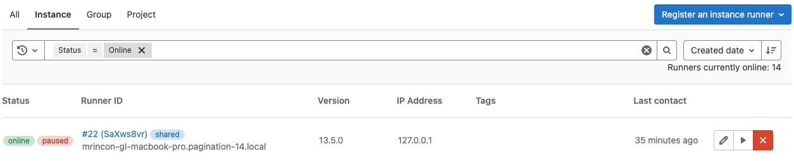



- Tier: 基础版，专业版，旗舰版
- Offering: 私有化部署



**管理员**区域为 极狐GitLab 私有化部署实例提供了一个管理并配置功能的 Web UI。如果你是管理员，要访问**管理员**区域：

- 在 极狐GitLab 18.5 及更高版本中：
  - 在右上角，选择 **管理员**。
  - 在顶部栏，选择 **搜索或跳转到**，然后选择 **管理区域**。
- 在 极狐GitLab 17.3 及更高版本中：在左侧边栏底部，选择 **管理员**。
- 在 极狐GitLab 16.7 及更高版本中：在左侧边栏底部，选择 **管理区域**。
- 在 极狐GitLab 16.1 及更高版本中：在左侧边栏中，选择 **搜索或跳转到**，然后选择 **管理员**。
- 在 极狐GitLab 16.0 及更早版本中：在顶部栏中，选择 **主菜单** > **管理员**。

如果 极狐GitLab 实例使用管理员模式，则必须在**管理员**可见之前[为你的会话启用管理员模式](settings/sign_in_restrictions.md#turn-on-admin-mode-for-your-session)。

> [!note]
> 仅私有化部署实例的管理员可以访问 **管理员** 区域。
> 在 JihuLab.com 上，**管理员** 区域功能不可用。

## 管理项目



- 在 极狐GitLab 18.2 中，全新外观通过功能标志 `admin_projects_vue` 引入，默认禁用。
- 在 极狐GitLab 18.3 中 GA，功能标志 `admin_projects_vue` 已移除。



要管理 极狐GitLab 实例中的所有项目：

1. 在右上角，选择 **管理员**。
1. 在左侧边栏中，选择 **概述** > **项目**。页面会显示每个项目的：

   - 名称
   - 描述
   - 可见性级别
   - 角色
   - 主题
   - 状态
   - 存储大小
   - 标星数量
   - 派生数量
   - 合并请求数量
   - 议题数量

1. 可选。选择一个标签页：

   - **活跃** 显示所有活跃项目。
   - **非活跃** 显示已归档或待删除的项目。

1. 可选。组合筛选条件以找到所需项目。可按以下条件筛选：

   - 名称。必须至少输入三个字符。
   - 可见性：公开、内部或私有。
   - 编程语言。
   - 群组或用户命名空间。
   - 你拥有所有者角色的项目。

1. 可选。要更改排序顺序，请选择排序下拉列表并选择所需的顺序。可用的排序选项有：

   - 名称
   - 创建日期
   - 最后更新日期
   - 标星数量
   - 存储大小

### 编辑项目

要从**管理员**区域的项目页面编辑项目名称或描述：

1. 在右上角，选择 **管理员**。
1. 在左侧边栏中，选择 **概述** > **项目**。
1. 找到要编辑的项目，然后选择 **操作** () > **编辑**。
1. 编辑 **项目名称** 或 **项目描述**。
1. 选择 **保存更改**。

### 删除项目

要删除项目：

1. 在右上角，选择 **管理员**。
1. 在左侧边栏中，选择 **概述** > **项目**。
1. 找到要编辑的项目，然后选择 **操作** () > **删除**。
1. 在确认对话框中，选择 **是的，删除项目**。

## 管理用户



- 在 极狐GitLab 17.0 中，用户筛选功能引入。



**管理员**区域的用户页面显示每个用户的以下信息：

- 用户名
- 电子邮件地址
- 项目成员数量
- 群组成员数量
- 账户创建日期
- 最后活动日期

要从**管理员**区域的用户页面管理所有用户：

1. 在右上角，选择 **管理员**。
1. 在左侧边栏中，选择 **概述** > **用户**。
1. 可选。要更改默认按用户名排序的顺序：

   1. 选择排序下拉列表。
   1. 选择所需的顺序。

1. 可选。使用用户搜索框按以下条件搜索和筛选用户：

   - 用户 **访问级别**。
   - **双因素认证** 是否启用或禁用。
   - 用户 **状态**。
   - 用户 **类型** 是否为 [占位符](../user/import/mapping/post_migration_mapping.md#placeholder-users)。

1. 可选。在用户搜索字段中输入文本，然后按 <kbd>Enter</kbd>。此不区分大小写的文本搜索会对名称、用户名和电子邮件进行部分匹配。

要编辑用户，请找到该用户所在行，然后选择 **编辑**。

### 删除用户

要从**管理员**区域的用户页面删除用户或删除用户及其贡献：

1. 在右上角，选择 **管理员**。
1. 在左侧边栏中，选择 **概述** > **用户**。
1. 找到要删除的用户。在该行中，选择 **用户管理** ()，然后选择所需的选项。

### 用户模拟

管理员可以模拟任何其他用户，包括其他管理员。这使你能够查看用户在 极狐GitLab 中看到的内容，并代表用户执行操作。

要模拟用户：

- 通过 UI：
  1. 在右上角，选择 **管理员**。
  1. 在左侧边栏中，选择 **概述** > **用户**。
  1. 从用户列表中选择一个用户。
  1. 在右上角，选择 **模拟**。
  1. 要停止模拟，请在右上角选择 **停止模拟** ()。
- 通过 API，使用 [模拟令牌](../api/rest/authentication.md#impersonation-tokens)。

所有模拟活动均通过[审计事件捕获](compliance/audit_event_reports.md#user-impersonation)。
默认情况下，模拟功能已启用。你可以配置 极狐GitLab 以[禁用模拟](../api/rest/authentication.md#disable-impersonation)。

### 用户身份



- Tier: 专业版，旗舰版
- Offering: 私有化部署





- 在 极狐GitLab 15.3 中，查看用户 SCIM 身份功能引入。



当使用认证提供方时，管理员可以查看用户的身份。此页面显示用户的身份，包括 SCIM 身份。使用此信息来排查 SCIM 相关问题并确认账户所使用的身份。

操作步骤：

1. 在右上角，选择 **管理员**。
1. 在左侧边栏中，选择 **概述** > **用户**。
1. 从用户列表中选择一个用户。
1. 选择 **身份**。

### 用户权限导出



- Tier: 专业版，旗舰版
- Offering: 私有化部署



导出用户权限时，导出的信息会显示用户在群组和项目中的直接成员身份。该数据包括以下内容，并且仅限于前 100,000 名用户：

- 用户名
- 电子邮件
- 类型
- 路径
- 访问级别（[项目](../user/permissions.md#project-permissions) 和 [群组](../user/permissions.md#group-permissions)）
- 最后活动日期。有关填充此列的活动列表，请参见 [用户 API 文档](../api/users.md#list-a-users-activity)。

要导出 极狐GitLab 实例中所有活跃用户的用户权限：

1. 在右上角，选择 **管理员**。
1. 在左侧边栏中，选择 **概述** > **用户**。
1. 在右上角，选择 **导出权限为 CSV** ()。

### 用户统计

**用户统计**页面按角色提供用户账户概览。这些统计数据每日计算。上次更新后进行的用户更改不会反映出来。还包括以下合计数据：

- 计费用户
- 已阻止用户
- 总用户数

极狐GitLab 计费基于[计费用户](../subscriptions/manage_seats.md#billable-users)的数量。

### 为用户添加电子邮件

要手动向用户账户添加电子邮件地址：

1. 在右上角，选择 **管理员**。
1. 在左侧边栏中，选择 **概述** > **用户**。
1. 找到用户并选择该用户。
1. 选择 **编辑**。
1. 在 **电子邮件** 字段中，输入新的电子邮件地址。这会将新电子邮件地址添加到用户，并将之前的电子邮件地址设置为备用地址。
1. 选择 **保存更改**。

## 用户同期群

[同期群](user_cohorts.md) 标签页显示新用户的月度同期群及其随时间推移的活动情况。

## 阻止用户创建顶级群组

管理员可以阻止特定用户创建顶级群组。这些用户仍然可以创建子群组并在现有组织结构中进行协作。

要阻止用户创建顶级群组：

1. 在右上角，选择 **管理员**。
1. 在左侧边栏中，选择 **概述** > **用户**。
1. 找到用户并选择该用户。
1. 选择 **编辑**。
1. 清除 **可以创建顶级群组** 复选框。
1. 选择 **保存更改**。

关闭此设置后：

- 该用户无法创建顶级群组。
- 根据群组的[子群组创建权限](../user/group/subgroups/_index.md#change-who-can-create-subgroups)，该用户可以在其具有维护者或所有者角色的群组中创建子群组。

## 管理群组



- 在 极狐GitLab 18.2 中，全新外观通过功能标志 `admin_groups_vue` 引入，默认禁用。
- 在 极狐GitLab 18.5 中，该功能在 JihuLab.com、私有化部署实例上启用。
- 在 极狐GitLab 18.6 中 GA，功能标志 `admin_groups_vue` 已移除。



> [!flag]
> 此功能的可用性由功能标志控制。
> 更多信息，请参阅历史记录。

要管理 极狐GitLab 实例中的所有群组：

1. 在右上角，选择 **管理员**。
1. 在左侧边栏中，选择 **概述** > **群组**。页面会显示每个群组的：

   - 名称
   - 描述
   - 可见性级别
   - 角色
   - 状态
   - 存储大小
   - 子群组数量
   - 项目数量
   - 成员数量

1. 可选。选择一个标签页：

   - **活跃** 显示所有活跃群组。
   - **非活跃** 显示待删除的群组。

1. 可选。要更改排序顺序，请选择排序下拉列表并选择所需的顺序。可用的排序选项有：

   - 名称
   - 创建日期
   - 最后更新日期
   - [存储大小](../user/storage_usage_quotas.md)

1. 可选。要按名称筛选群组，请在搜索栏中输入至少三个字符。
1. 可选。要[创建新群组](../user/group/_index.md#create-a-group)，选择 **新建群组**。

### 编辑群组

要从**管理员**区域的群组页面编辑群组名称或描述：

1. 在右上角，选择 **管理员**。
1. 在左侧边栏中，选择 **概述** > **群组**。
1. 找到要编辑的群组，然后选择 **操作** () > **编辑**。
1. 编辑 **群组名称** 或 **群组描述**。
1. 选择 **保存更改**。

### 删除群组

要删除群组：

1. 在右上角，选择 **管理员**。
1. 在左侧边栏中，选择 **概述** > **群组**。
1. 找到要编辑的群组，然后选择 **操作** () > **删除**。
1. 在确认对话框中，选择 **确认**。

## 管理主题



- Status: Beta



使用[主题](../user/project/project_topics.md)对相似项目进行分类和查找。

### 查看所有主题

要查看 极狐GitLab 实例中的所有主题：

1. 在右上角，选择 **管理员**。
1. 在左侧边栏中，选择 **概述** > **主题**。

对于每个主题，页面会显示其名称以及标记了该主题的项目数量。

### 搜索主题

1. 在右上角，选择 **管理员**。
1. 在左侧边栏中，选择 **概述** > **主题**。
1. 在搜索框中输入你的搜索条件。主题搜索不区分大小写，并应用部分匹配。

### 创建主题

要创建主题：

1. 在右上角，选择 **管理员**。
1. 在左侧边栏中，选择 **概述** > **主题**。
1. 选择 **新建主题**。
1. 输入 **主题英文简称 (名称)** 和 **主题标题**。
1. 可选。输入 **描述** 并添加 **主题头像**。
1. 选择 **保存更改**。

创建的主题会显示在 **探索主题** 页面上。

分配的主题仅对有权访问项目的人员可见，但所有人都可以查看 极狐GitLab 实例上存在哪些主题。请勿在主题名称中包含敏感信息。

### 编辑主题

你可以随时编辑主题的名称、标题、描述和头像。要编辑主题：

1. 在右上角，选择 **管理员**。
1. 在左侧边栏中，选择 **概述** > **主题**。
1. 在该主题所在行选择 **编辑**。
1. 编辑主题英文简称 (名称)、标题、描述或头像。
1. 选择 **保存更改**。

### 删除主题

如果不再需要某个主题，可以永久删除它。要删除主题：

1. 在右上角，选择 **管理员**。
1. 在左侧边栏中，选择 **概述** > **主题**。
1. 要删除主题，请在该主题所在行选择 **移除**。

### 合并主题

你可以将分配给某个主题的所有项目移动到另一个主题。然后，源主题将被永久删除。合并的主题删除后，无法恢复。

要合并主题：

1. 在右上角，选择 **管理员**。
1. 在左侧边栏中，选择 **概述** > **主题**。
1. 选择 **合并主题**。
1. 从 **源主题** 下拉列表中选择要合并并删除的主题。
1. 从 **目标主题** 下拉列表中选择要将源主题合并到其中的主题。
1. 选择 **合并**。

## 管理 Gitaly 服务器

你可以从**管理员**区域的 **Gitaly 服务器** 页面列出 极狐GitLab 实例中的所有 Gitaly 服务器。更多详细信息，请参见 [Gitaly](gitaly/_index.md)。

要访问 **Gitaly 服务器** 页面：

1. 在右上角，选择 **管理员**。
1. 在左侧边栏中，选择 **概述** > **Gitaly 服务器**。

该页面包含每个 Gitaly 服务器的以下信息：

| 字段 | 描述 |
|----------------|-------------|
| 存储 | 仓库存储 |
| 地址 | Gitaly 服务器监听的网络地址 |
| 服务器版本 | Gitaly 版本 |
| Git 版本 | Gitaly 服务器上安装的 Git 版本 |
| 是否最新 | 指示 Gitaly 服务器版本是否为最新可用版本。绿色圆点表示服务器是最新的。 |

## 管理组织



- 在 极狐GitLab 16.10 中，通过功能标志 `ui_for_organizations` 引入，默认禁用。



> [!flag]
> 在私有化部署实例上，默认情况下此功能不可用。要使其可用，管理员可以[启用功能标志](feature_flags/_index.md) `ui_for_organizations`。
> 在 JihuLab.com 上，此功能不可用。
> 此功能尚未准备好用于生产环境。

**管理员**区域中的组织页面默认列出所有项目，按最后更新时间降序排列。每个项目显示：

- 名称
- 命名空间
- 描述
- 大小，最多每 15 分钟更新一次

要从此页面管理 极狐GitLab 实例中的所有组织：

1. 在右上角，选择 **管理员**。
1. 在左侧边栏中，选择 **概述** > **组织**。

## CI/CD 部分

### 管理 Runner



- 在 极狐GitLab 15.8 中，从 **概述** > **Runner** 移至 **CI/CD** > **Runner**。



要管理 极狐GitLab 实例中的所有 Runner：

1. 在右上角，选择 **管理员**。
1. 在左侧边栏中，选择 **CI/CD** > **Runner**。

每个 Runner 都会显示以下信息：

| 属性 | 描述 |
|--------------|-------------|
| 状态 | Runner 的状态。在 [极狐GitLab 15.1 及更高版本](https://jihulab.com/gitlab-cn/gitlab/-/issues/22224) 中，对于旗舰版，升级状态可用。 |
| Runner 详情 | 有关 Runner 的信息，包括部分令牌以及注册 Runner 的计算机详情。 |
| 版本 | GitLab Runner 版本。 |
| 任务 | Runner 运行的任务总数。 |
| 标签 | 与 Runner 关联的标签。 |
| 最近联系 | 指示 Runner 上次联系 极狐GitLab 实例的时间戳。 |

你还可以编辑、暂停或删除每个 Runner。

更多信息，请参见 [GitLab Runner](https://gitlab.cn/docs/runner/)。

#### 搜索和筛选 Runner

要搜索 Runner 的描述：

1. 在 **搜索或筛选结果** 文本框中，输入你要找的 Runner 的描述。
1. 按 <kbd>Enter</kbd>。

要按状态、类型和标签筛选 Runner：

1. 选择一个标签页或 **搜索或筛选结果** 文本框。
1. 选择任何 **类型**，或按 **状态** 或 **标签** 筛选。
1. 选择或输入你的搜索条件。

#### 批量删除 Runner



- 在 极狐GitLab 15.4 中引入。
- 在 极狐GitLab 15.5 中功能标志已移除。



要同时删除多个 Runner：

1. 在右上角，选择 **管理员**。
1. 在左侧边栏中，选择 **CI/CD** > **Runner**。
1. 选中要删除的 Runner 左侧的复选框。要选择页面上的所有 Runner，请选中列表上方的复选框。
1. 选择 **删除所选**。

### 管理任务



- 在 极狐GitLab 15.8 中，从 **概述** > **任务** 移至 **CI/CD** > **任务**。



要管理 极狐GitLab 实例中的所有任务：

1. 在右上角，选择 **管理员**。
1. 在左侧边栏中，选择 **CI/CD** > **任务**。所有任务按任务 ID 降序列出。
1. 选择 **全部** 标签页列出所有任务。选择 **等待中**、**运行中** 或 **已完成** 标签页仅列出对应状态的任务。

对于每个任务，会列出以下详细信息：

| 字段 | 描述 |
|----------|-------------|
| 状态 | 任务状态。包括 **通过**、**跳过** 或 **失败**。 |
| 任务 | 包含任务、分支和启动该任务的提交的链接。 |
| 流水线 | 包含特定流水线的链接。 |
| 项目 | 任务所属项目的名称和组织。 |
| Runner | 分配执行该任务的 CI Runner 的名称。 |
| 阶段 | 任务在 `.gitlab-ci.yml` 文件中声明的阶段。 |
| 名称 | 在 `.gitlab-ci.yml` 文件中指定的任务名称。 |
| 耗时 | 任务的持续时间以及任务完成多久了。 |
| 覆盖率 | 测试覆盖率百分比。 |

## 监控部分

以下主题介绍了**管理员**区域的 **监控** 部分。

### 系统信息



- 在 极狐GitLab 15.2 中，支持相对时间引入。"运行时间" 统计更名为 "系统启动时间"。



**系统信息**页面提供以下统计信息：

| 字段 | 描述 |
|:---------------|:--------------------------------------------------|
| CPU | 可用的 CPU 核心数 |
| 内存使用量 | 已用内存和总可用内存 |
| 磁盘使用量 | 已用磁盘空间和总可用磁盘空间 |
| 系统启动时间 | 托管 极狐GitLab 的系统启动时间。在 极狐GitLab 15.1 及更早版本中，这是运行时间统计。 |

这些统计信息仅在访问 **系统信息** 页面或刷新浏览器页面时更新。

### 后台任务

**后台任务**页面显示 Sidekiq 仪表板。极狐GitLab 使用 Sidekiq 执行后台进程。

Sidekiq 仪表板包含：

- 每个[任务生命周期状态](https://github.com/sidekiq/sidekiq/wiki/Job-Lifecycle)的标签页。
- 后台任务统计的细分。
- **已处理** 和 **失败** 任务的实时图表，可选择轮询间隔。
- **已处理** 和 **失败** 任务的历史图表，可选择时间跨度。
- Redis 统计信息，包括：
  - 版本号
  - 运行时间，以天为单位
  - 连接数
  - 当前内存使用量，以 MB 为单位
  - 峰值内存使用量，以 MB 为单位

### 数据管理



- 在 极狐GitLab 18.8 中引入。



**数据管理**页面提供了一个全面的界面，用于查看和管理 Geo 主站点上所有组件的验证状态。这些组件包括 Geo 支持的 [所有数据类型](geo/replication/datatypes.md)。

使用此页面可以：

- 识别导致验证失败的孤立文件或数据库记录，而无需访问 Rails 控制台。
- 直接通过 UI 查看详细错误信息并采取纠正措施。
- 跟踪所有组件的验证状态并识别失败模式。
- 一次触发所有对象的校验和计算。

列表视图显示所选组件的验证状态。

1. 从下拉列表中选择一个组件，以在不同的验证模型（项目、上传等）之间切换。从列表视图中，你可以：

   - 按校验和状态（失败、待处理、成功）筛选对象。
   - 浏览大量结果集。
   - 查看每个对象的最后校验和时间、最后失败时间以及失败原因。
   - 针对单个对象触发校验和计算。

1. 从列表视图中选择一个单独的模型，以查看特定对象验证状态的全面信息，例如：

   - 已验证对象的详细信息。
   - 当前校验和状态和历史记录。
   - 如果验证失败，详细的失败原因。
   - 重新计算对象校验和的选项。

### 数据库诊断



- 在 极狐GitLab 18.3 中，排序规则健康检查引入。
- 在 极狐GitLab 18.3 中，模式健康检查引入，包括缺失索引、表、外键和序列检查。
- 在 极狐GitLab 18.4 中，将错误的序列所有者检查添加到模式健康检查中。



数据库诊断页面包含一系列检查，旨在标记数据库的常见问题：

- 由 [PostgreSQL 排序规则更改](https://jihulab.com/groups/gitlab-cn/-/epics/8573) 引起的索引损坏
- [模式差异](https://jihulab.com/groups/gitlab-cn/-/epics/3928)

要运行每个检查，请选择该检查的运行按钮。选择运行按钮会安排一个后台任务，该任务会将检查信息报告到页面。

#### 排序规则健康检查

排序规则健康检查旨在检测导致索引损坏的 PostgreSQL 问题。如果运行 PostgreSQL 的先前操作系统使用的 `glibc` 版本早于 2.28，通常会发生这种情况。更多信息，请参见 [为 PostgreSQL 升级操作系统](postgresql/upgrading_os.md) 的文档。

任何问题都会列在 **损坏的索引** 部分。如果你遇到问题，可以[修复损坏的索引](raketasks/maintenance.md#repair-corrupted-database-indexes)。

排序规则健康检查还尝试标记常见受影响表上的重复项：

- `ci_refs`
- `ci_resource_groups`
- `environments`
- `merge_request_diff_commit_users`
- `sbom_components`
- `tags`
- `topics`

更多信息，请参见 [议题 505982](https://jihulab.com/gitlab-cn/gitlab/-/issues/505982)。
仪表板中列出的信息与
[`gitlab:db:collation_checker` Rake 任务](raketasks/maintenance.md#detect-postgresql-collation-version-mismatches)中显示的信息相同。

#### Schema 健康检查

Schema 健康检查将数据库状态与目标 Schema 进行比较，并列出检测到的差异。没有可用的自动 Schema 修复工具。

如果您发现任何误报或对检查结果有任何疑问，请参阅
[反馈议题](https://jihulab.com/gitlab-cn/gitlab/-/issues/567561)。

### 日志

这些日志文件的内容有助于排查问题。每个日志文件的内容按时间顺序列出。为尽量减少性能问题，每个日志文件最多显示 2000 行。

| 日志文件                | 内容 |
|:------------------------|:---------|
| `application_json.log`  | 极狐GitLab 用户活动 |
| `git_json.log`          | 极狐GitLab 与 Git 仓库之间的失败交互 |
| `production.log`        | 来自 Puma 的请求以及为处理这些请求所采取的操作 |
| `sidekiq.log`           | 后台作业 |
| `repocheck.log`         | 代码仓活动 |
| `integrations_json.log` | 极狐GitLab 与集成系统之间的活动 |
| `kubernetes.log`        | Kubernetes 活动 |

有关这些日志文件及其内容的详细信息，请参阅[日志系统](logs/_index.md)。

为了避免多节点系统的管理员产生混淆，**日志**视图已从**管理员**区域仪表板中移除。此视图在多节点设置中仅显示部分信息。对于多节点系统，请将日志采集到 Elasticsearch 和 Splunk 等服务中。

### 审计事件



- Tier: 专业版，旗舰版
- Offering: 私有化部署



**审计事件**页面列出了对极狐GitLab 服务器所做的更改。使用此信息来控制、分析和跟踪每次更改。

### 统计信息

仪表板的**实例概览**部分列出了极狐GitLab 实例的当前统计信息。您可以通过
[应用程序统计 API](../api/statistics.md#retrieve-application-statistics)获取这些信息。

这些统计信息对于小于 10,000 的值显示精确计数。对于 10,000 及以上的值，
当使用 [`TablesampleCountStrategy`](https://jihulab.com/gitlab-cn/gitlab/-/blob/master/lib/gitlab/database/count/tablesample_count_strategy.rb?ref_type=heads#L16) 和
[`ReltuplesCountStrategy`](https://jihulab.com/gitlab-cn/gitlab/-/blob/master/lib/gitlab/database/count/reltuples_count_strategy.rb?ref_type=heads) 策略进行计算时，这些统计信息会显示近似数据。