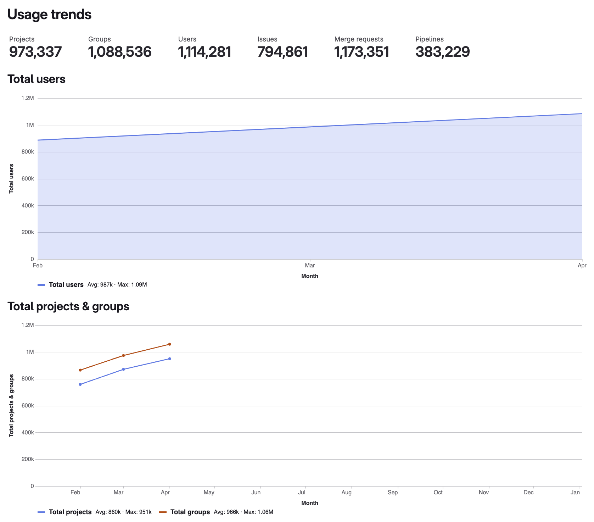



- Tier: 基础版，专业版，旗舰版
- Offering: 私有化部署



使用趋势让您了解实例包含了多少数据，以及这些数据量随时间变化的速度。

使用趋势页面展示：

- 以下各项的总数量概览：
  - 项目
  - 群组
  - 用户
  - 议题
  - 合并请求
  - 流水线
- 为期一年的月度数据折线图：
  - 项目和群组
  - 流水线
  - 议题和合并请求

使用趋势数据每日刷新。

## 查看使用趋势

先决条件：

- 管理员权限。

要查看使用趋势：

1. 在右上角，选择 **管理员**。
1. 在左侧边栏，选择 **分析** > **使用趋势**。