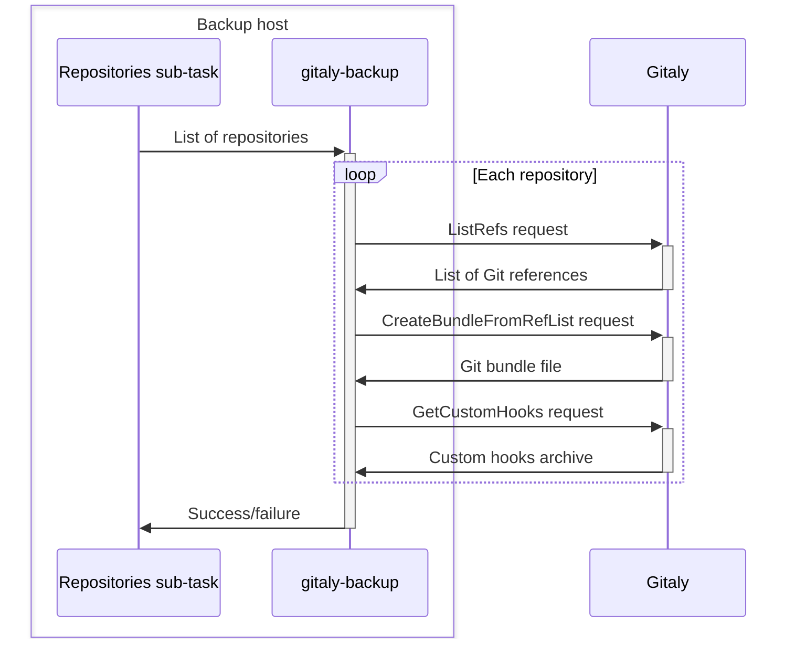
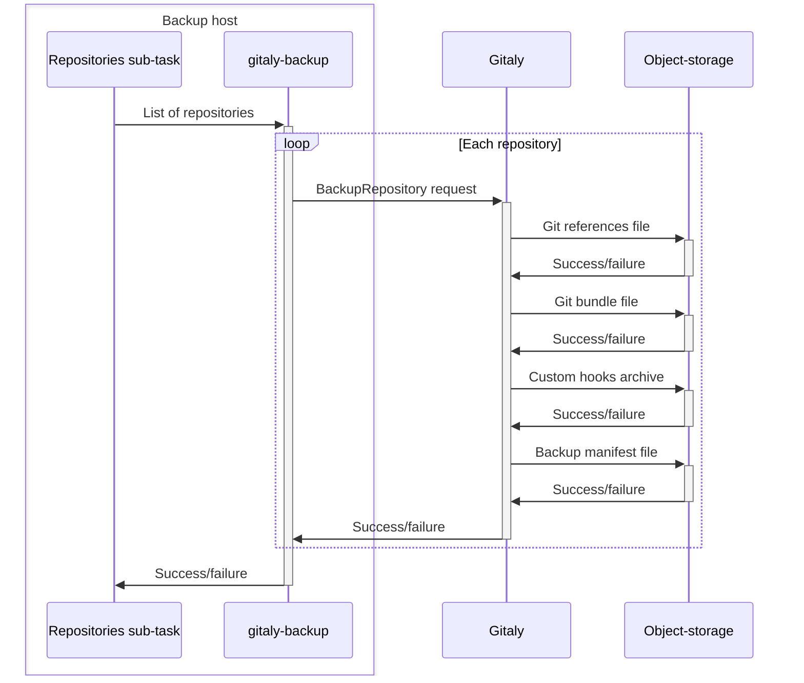

<a id="backup-archive-process"></a>

# 备份归档过程

当您运行[备份命令](backup_gitlab.md#backup-command)时，备份脚本会创建一个备份归档文件来存储您的极狐GitLab 数据。

为创建归档文件，备份脚本：

1. 当您进行增量备份时，提取前一个备份归档文件。
1. 更新或生成备份归档文件。
1. 运行所有备份子任务以：
   - [备份数据库](#back-up-the-database)。
   - [备份 Git 仓库](#back-up-git-repositories)。
   - [备份文件](#back-up-files)。
1. 将备份临时目录归档为一个 `tar` 文件。
1. 如果[已配置](backup_gitlab.md#upload-backups-to-a-remote-cloud-storage)，将新的备份归档上传到对象存储。
1. 清理已归档的[备份临时目录](#backup-staging-directory)文件。

<a id="back-up-the-database"></a>

## 备份数据库

为备份数据库，`db` 子任务：

1. 使用 `pg_dump` 创建 [SQL 转储](https://www.postgresql.org/docs/16/backup-dump.html)。
1. 将 `pg_dump` 的输出通过管道传递给 `gzip` 并创建一个压缩的 SQL 文件。
1. 将此文件保存到[备份临时目录](#backup-staging-directory)。

<a id="back-up-git-repositories"></a>

## 备份 Git 仓库

为备份 Git 仓库，`repositories` 子任务：

1. 告知 `gitaly-backup` 哪些仓库需要备份。
1. 运行 `gitaly-backup` 以：
   - 在 Gitaly 上调用一系列远程过程调用 (RPC)。
   - 收集每个仓库的备份数据。
1. 将收集到的数据流式传输到[备份临时目录](#backup-staging-directory)的目录结构中。

下图说明了这个过程：



配置了 Gitaly 集群 (Praefect) 的存储备份方式与独立 Gitaly 实例相同。

- 当 Gitaly 集群 (Praefect) 接收到来自 `gitaly-backup` 的 RPC 调用时，它会重建自己的数据库。
  - 无需单独备份 Gitaly 集群 (Praefect) 数据库。
- 每个仓库仅备份一次，无论复制因子如何，因为备份通过 RPC 进行操作。

<a id="server-side-backups"></a>

### 服务器端备份

服务器端仓库备份是备份 Git 仓库的高效方法。此方法的优点包括：

- 数据不会通过来自 Gitaly 的 RPC 进行传输。
- 服务器端备份需要更少的网络传输。
- 运行备份 Rake 任务的计算机不需要磁盘存储。

为执行服务器端备份，`repositories` 子任务：

1. 运行 `gitaly-backup` 为每个仓库发起单个 RPC 调用。
1. 触发存储物理仓库的 Gitaly 节点将备份数据上传到对象存储。
1. 使用[备份 ID](#backup-id)将存储在对象存储上的备份链接到创建的备份归档。

下图说明了这个过程：



<a id="back-up-files"></a>

## 备份文件

以下子任务备份文件：

- `uploads`：附件
- `builds`：CI/CD 作业输出日志
- `artifacts`：CI/CD 作业产物
- `pages`：页面内容
- `lfs`：LFS 对象
- `terraform_state`：Terraform 状态
- `registry`：容器镜像仓库镜像
- `packages`：软件包
- `ci_secure_files`：项目级安全文件
- `external_diffs`：合并请求差异（当存储在外部时）

每个子任务确定特定任务目录中的一组文件，然后：

1. 使用 `tar` 实用程序创建已确定文件的归档。
1. 通过 `gzip` 压缩归档，不保存到磁盘。
1. 将 `tar` 文件保存到[备份临时目录](#backup-staging-directory)。

由于备份是从实时实例创建的，文件可能在备份过程中被修改。在这种情况下，可以使用[备用策略](backup_gitlab.md#backup-strategy-option)来备份文件。`rsync` 实用程序创建要备份的文件的副本，并将其传递给 `tar` 进行归档。

> [!note]
> 如果您使用此策略，运行备份 Rake 任务的计算机必须有足够的存储空间以容纳复制文件和压缩归档。

<a id="backup-id"></a>

## 备份 ID

备份 ID 是备份归档的唯一标识符。当您需要恢复极狐GitLab 且有多个备份归档可用时，这些 ID 至关重要。

备份归档保存在 `config/gitlab.yml` 文件中的 `backup_path` 设置所指定的目录中。默认位置为 `/var/opt/gitlab/backups`。

备份 ID 由以下部分组成：

- 备份创建的时间戳
- 日期 (`YYYY_MM_DD`)
- 极狐GitLab 版本
- 极狐GitLab 版本

以下是一个示例备份 ID：`1493107454_2018_04_25_10.6.4-ce`

<a id="backup-filename"></a>

## 备份文件名

默认情况下，文件名遵循 `<备份 ID>_gitlab_backup.tar` 结构。例如，`1493107454_2018_04_25_10.6.4-ce_gitlab_backup.tar`。

<a id="backup-information-file"></a>

## 备份信息文件

备份信息文件 `backup_information.yml` 保存未包含在备份中的所有备份输入。该文件保存在[备份临时目录](#backup-staging-directory)中。子任务使用此文件来确定如何恢复数据，以及如何将备份中的数据与[服务器端仓库备份](#server-side-backups)等外部服务关联起来。

备份信息文件包含以下内容：

- 备份创建的时间。
- 生成备份的极狐GitLab 版本。
- 其他指定的选项。例如，跳过的子任务。

<a id="backup-staging-directory"></a>

## 备份临时目录

备份临时目录是备份和恢复过程中使用的临时存储位置。此目录：

- 在创建极狐GitLab 备份归档之前存储备份工件。
- 在恢复备份或创建增量备份之前提取备份归档。

备份临时目录也是创建完成备份归档的同一目录。当创建未打包的备份时，备份工件保留在此目录中，不会创建归档文件。

以下是一个包含未打包备份的备份临时目录示例：

```plaintext
backups/
├── 1701728344_2023_12_04_16.7.0-pre_gitlab_backup.tar
├── 1701728447_2023_12_04_16.7.0-pre_gitlab_backup.tar
├── artifacts.tar.gz
├── backup_information.yml
├── builds.tar.gz
├── ci_secure_files.tar.gz
├── db
│   ├── ci_database.sql.gz
│   └── database.sql.gz
├── lfs.tar.gz
├── packages.tar.gz
├── pages.tar.gz
├── repositories
│   ├── manifests/
│   ├── @hashed/
│   └── @snippets/
├── terraform_state.tar.gz
└── uploads.tar.gz
```