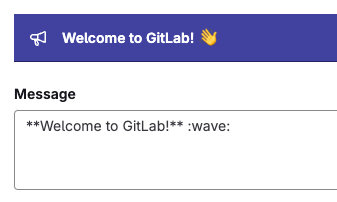
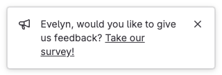



- Tier: 基础版，专业版，旗舰版
- Offering: 私有化部署



极狐GitLab 可以向极狐GitLab 实例的用户显示两种类型的广播消息：

- 横幅
- 通知

广播消息可以使用[广播消息 API](../api/broadcast_messages.md) 进行管理。

> [!warning]
> 广播消息通过 API 公开可访问，无论定位设置如何。请勿包含敏感或机密信息，也不要使用广播消息向特定群组或项目传达私人信息。

<a id="banners"></a>

## 横幅

横幅显示在页面顶部，也可以选择作为 Git 远程响应显示在命令行中。



```shell
$ git push
...
远程：
远程：**欢迎来到 极狐GitLab** :wave:
远程：
...
```

如果同时有多个横幅处于活动状态，它们将按创建顺序显示在页面顶部。在命令行中，只显示最新的横幅。

只有将横幅配置为可关闭时，横幅才能被关闭。

<a id="notifications"></a>

## 通知

极狐GitLab 在页面右下角显示通知。通知可以包含占位符，这些占位符会被替换为当前用户的属性：



```markdown
{{name}}，你想给我们反馈吗？
<a href="example.com">参与我们的调查！</a>
```

如果同时有多个通知处于活动状态，只显示最新的通知。

通知支持以下占位符：

- `{{email}}`
- `{{name}}`
- `{{user_id}}`
- `{{username}}`
- `{{instance_id}}`

如果用户未登录，用户相关的值为空。

<a id="prerequisites"></a>

## 先决条件

你必须具有管理员访问权限。

<a id="add-a-broadcast-message"></a>

## 添加广播消息

要向极狐GitLab 实例的用户显示消息，请添加广播消息。

> [!warning]
> 广播消息通过 API 公开可访问，无论定位设置如何。请勿包含敏感或机密信息，也不要使用广播消息向特定群组或项目传达私人信息。

添加广播消息的步骤：

1. 在右上角，选择 **管理员**。
1. 在左侧边栏中，选择 **消息**。
1. 在右侧，选择 **添加新消息**。
1. 添加你的 **消息** 文本：
   - 消息内容可以包括 Markdown、表情符号以及 `a` 和 `br` HTML 标签。
   - `br` 标签用于插入换行符。
   - `a` HTML 标签接受 `class` 和 `style` 属性，并支持以下 CSS 属性：
     - `color`
     - `border`
     - `background`
     - `padding`
     - `margin`
     - `text-decoration`
1. 对于 **类型**，选择 `banner` 或 `notification`。
1. 选择一个 **主题**。默认主题为 `indigo`。
1. 要允许用户关闭广播消息，选择 **可关闭**。
1. 可选。要跳过在命令行中以 Git 远程响应形式显示广播消息，请清除 **Git 远程响应** 复选框。
1. 可选。要仅向部分用户显示消息，请选择 **目标广播消息**：
   - 向所有页面上的所有用户显示。
   - 向匹配的特定页面上的所有用户显示。
   - 仅向在群组或项目页面上具有特定角色的用户显示。此设置会在群组、子群组和项目页面上显示你的消息，但不会在 Git 远程响应中显示。
1. 如果需要，选择 **目标角色** 以向相应角色显示广播消息。
1. 如果需要，添加 **目标路径** 以仅在匹配该路径的 URL 上显示广播消息。
   使用通配符 `*` 匹配多个 URL 并指定路径，例如：
   - `*/-/milestones` 用于任何群组或项目的 **里程碑** 索引页。
   - `*/-/milestones/*` 仅用于单个里程碑页面。
   - `*/-/milestones*` 用于索引页和单个里程碑页面。
1. 选择消息开始和结束的日期和时间（UTC）。
1. 选择 **添加广播消息**。

当广播消息过期后，它不再显示在用户界面中，但仍会列在广播消息列表中。

<a id="edit-a-broadcast-message"></a>

## 编辑广播消息

如果需要对广播消息进行更改，你可以编辑它。

编辑广播消息的步骤：

1. 在右上角，选择 **管理员**。
1. 在左侧边栏中，选择 **消息**。
1. 在广播消息列表中，选择消息对应的编辑按钮。
1. 进行所需更改后，选择 **更新广播消息**。

过期的消息可以通过更改其结束日期来重新激活。

<a id="delete-a-broadcast-message"></a>

## 删除广播消息

如果不再需要某个广播消息，你可以删除它。
你可以在消息处于活动状态时删除它。

删除广播消息的步骤：

1. 在右上角，选择 **管理员**。
1. 在左侧边栏中，选择 **消息**。
1. 在广播消息列表中，选择消息对应的删除按钮。

广播消息被删除后，将从广播消息列表中移除。