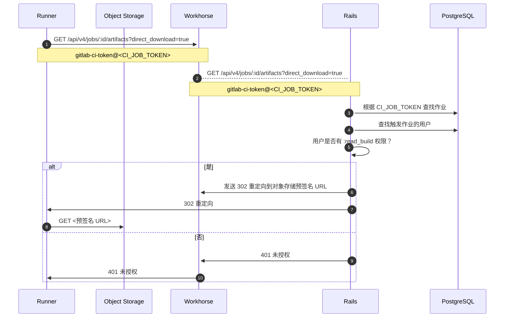
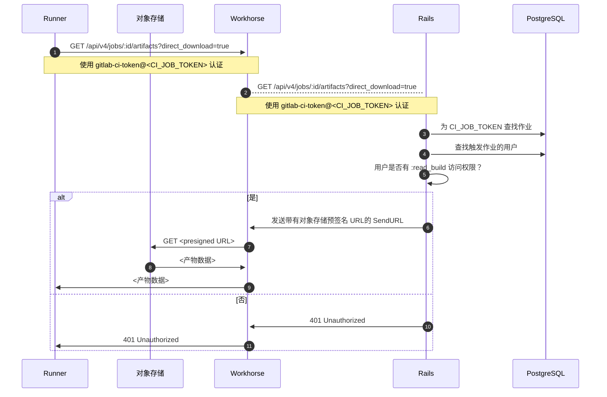



- Tier: 基础版，专业版，旗舰版
- Offering: 私有化部署



在管理作业产物时，您可能会遇到以下问题。

## 作业产物文件名可能错误

<a id="job-artifacts-can-have-wrong-filenames"></a>

在 极狐GitLab 18.6 之前，从远端存储迁移到本地存储可能导致产物被复制为不正确的文件名。

例如：

- 产物应类似：`path/to/artifacts/2025_10_15/922/485/artifacts.zip`。
- 文件名不正确的产物类似：`path/to/artifacts/2025_10_15/922/485/4f8681af93715b90c913e507f24b05cc6ca6e`（没有 `.zip` 扩展名）。

如果您的 极狐GitLab 实例出现此问题，请运行：

```shell
gitlab-rake gitlab:artifacts:fix_artifact_filepath
```

此任务会检查本地存储中文件名不正确的产物，并将其重命名为预期的文件名。

## 作业产物占用过多磁盘空间

<a id="job-artifacts-using-too-much-disk-space"></a>

作业产物可能比预期更快地占满磁盘空间。一些可能的原因包括：

- 用户配置的作业产物过期时间过长。
- 运行的作业数量（以及因此生成的产物数量）超出预期。
- 作业日志比预期大，并随时间累积。
- 由于[产物维护留下了空目录](https://gitlab.com/gitlab-org/gitlab/-/issues/17465)，文件系统可能耗尽 inode。[清理孤立产物文件的 Rake 任务](../raketasks/cleanup.md#remove-orphan-artifact-files)会移除这些目录。
- 产物文件可能残留在磁盘上且未被维护清理。运行[清理孤立产物文件的 Rake 任务](../raketasks/cleanup.md#remove-orphan-artifact-files)来移除它们。此脚本通常总是有工作可做，因为它也会移除空目录（参见上一条原因）。
- 状态为 `unknown` 的产物可能不会被自动清理处理。您可以[检查这些产物](#check-for-artifacts-with-unknown-status)并清理它们以回收磁盘空间。
- [保留最近成功作业的最新产物](../../ci/jobs/job_artifacts.md#keep-artifacts-from-most-recent-successful-jobs)功能已启用。

在这些以及其他情况下，需要找出最占用磁盘空间的项目，确定哪些类型的产物占用空间最多，并在某些情况下手动删除作业产物以回收磁盘空间。

### 产物维护

<a id="artifacts-housekeeping"></a>

产物维护是识别已过期并可删除的产物的过程。

#### 检查状态为 `unknown` 的产物

<a id="check-for-artifacts-with-unknown-status"></a>

某些产物的状态为 `unknown`，因为维护系统无法确定其正确的锁定状态。这些产物即使过期后也不会被自动清理处理，可能导致过多的磁盘空间占用。

要检查您的实例是否存在状态为 `unknown` 的产物：

1. 启动数据库控制台：

   

   

   ```shell
   sudo gitlab-psql
   ```

   

   

   ```shell
   # 查找 toolbox pod
   kubectl --namespace <namespace> get pods -lapp=toolbox
   # 连接到 PostgreSQL 控制台
   kubectl exec -it <toolbox-pod-name> -- /srv/gitlab/bin/rails dbconsole --include-password --database main
   ```

   

   

   ```shell
   sudo docker exec -it <container_name> /bin/bash
   gitlab-psql
   ```

   

   

   ```shell
   sudo -u git -H psql -d gitlabhq_production
   ```

   

   

1. 运行以下查询：

   ```sql
   select expire_at, file_type, locked, count(*) from p_ci_job_artifacts
   where expire_at is not null and
   file_type != 3
   group by expire_at, file_type, locked having count(*) > 1;
   ```

如果返回的记录中 locked 状态为 `2`，则这些就是 `unknown` 产物。例如：

```plaintext
           expire_at           | file_type | locked | count
-------------------------------+-----------+--------+--------
 2021-06-21 22:00:00+00        |         1 |      2 |  73614
 2021-06-21 22:00:00+00        |         2 |      2 |  73614
 2021-06-21 22:00:00+00        |         4 |      2 |   3522
 2021-06-21 22:00:00+00        |         9 |      2 |     32
 2021-06-21 22:00:00+00        |        12 |      2 |    163
```

如果您有 `unknown` 产物，可以[设置更短的过期时间](#clean-up-unknown-artifacts)或手动删除它们以回收磁盘空间。

#### 清理 `unknown` 产物

<a id="clean-up-unknown-artifacts"></a>

要清理 `unknown` 产物，您可以设置更短的过期时间，让自动清理流程处理它们：

1. 启动 [Rails 控制台](../operations/rails_console.md#starting-a-rails-console-session)。
1. 将 `unknown` 产物的过期时间设置为当前时间：

   ```ruby
   # 这会将 unknown 产物标记为立即清理
   Ci::JobArtifact.where(locked: 2).update_all(expire_at: Time.current)
   ```

然后，自动维护流程将在下次运行时清理这些产物。

#### `@final` 产物未从对象存储中删除

<a id="final-artifacts-not-deleted-from-object-store"></a>

在 极狐GitLab 16.1 及更高版本中，产物直接上传到其最终存储位置 `@final` 目录，而非首先使用临时位置。

极狐GitLab 16.1 和 16.2 中的一个问题导致[产物过期时未从对象存储中删除](https://gitlab.com/gitlab-org/gitlab/-/issues/419920)。过期产物的清理流程不会从 `@final` 目录中移除产物。此问题已在 极狐GitLab 16.3 及更高版本中修复。

运行过 极狐GitLab 16.1 或 16.2 的实例管理员可能会发现对象存储的产物使用量增加。请按照以下步骤检查并删除这些产物。

删除文件分为两个阶段：

1. [识别哪些文件已成为孤立文件](#list-orphaned-job-artifacts)。
1. [从对象存储中删除已识别的文件](#delete-orphaned-job-artifacts)。

##### 列出孤立的作业产物

<a id="list-orphaned-job-artifacts"></a>





```shell
sudo gitlab-rake gitlab:cleanup:list_orphan_job_artifact_final_objects
```





```shell
docker exec -it <container-id> bash
gitlab-rake gitlab:cleanup:list_orphan_job_artifact_final_objects
```

将输出写入容器中挂载的持久卷，或在命令完成后将输出文件复制出会话。





```shell
sudo -u git -H bundle exec rake gitlab:cleanup:list_orphan_job_artifact_final_objects RAILS_ENV=production
```





```shell
# 查找 pod
kubectl get pods --namespace <namespace> -lapp=toolbox

# 打开 Rails 控制台
kubectl exec -it -c toolbox <toolbox-pod-name> bash
gitlab-rake gitlab:cleanup:list_orphan_job_artifact_final_objects
```

命令完成后，将文件从会话中复制到持久存储。





该 Rake 任务具有一些适用于所有 极狐GitLab 部署类型的附加功能：

- 扫描对象存储可以被中断。进度记录在 Redis 中，用于从中断点恢复扫描产物。
- 默认情况下，Rake 任务会生成一个 CSV 文件：
  `/opt/gitlab/embedded/service/gitlab-rails/tmp/orphan_job_artifact_final_objects.csv`
- 设置环境变量以指定不同的文件名：

  ```shell
  # 软件包化的 GitLab
  sudo su -
  FILENAME='custom_filename.csv' gitlab-rake gitlab:cleanup:list_orphan_job_artifact_final_objects
  ```

- 如果输出文件已存在（默认或指定的文件），它会将条目追加到文件中。
- 每行包含由逗号分隔的字段 `object_path,object_size`，没有文件头。例如：

  ```plaintext
  35/13/35135aaa6cc23891b40cb3f378c53a17a1127210ce60e125ccf03efcfdaec458/@final/1a/1a/5abfa4ec66f1cc3b681a4d430b8b04596cbd636f13cdff44277211778f26,201
  ```

##### 删除孤立的作业产物

<a id="delete-orphaned-job-artifacts"></a>





```shell
sudo gitlab-rake gitlab:cleanup:delete_orphan_job_artifact_final_objects
```





```shell
docker exec -it <container-id> bash
gitlab-rake gitlab:cleanup:delete_orphan_job_artifact_final_objects
```

- 当命令完成后，将输出文件复制出会话，或将其写入容器已挂载的卷中。





```shell
sudo -u git -H bundle exec rake gitlab:cleanup:delete_orphan_job_artifact_final_objects RAILS_ENV=production
```





```shell
# 查找 pod
kubectl get pods --namespace <namespace> -lapp=toolbox

# 打开 Rails 控制台
kubectl exec -it -c toolbox <toolbox-pod-name> bash
gitlab-rake gitlab:cleanup:delete_orphan_job_artifact_final_objects
```

- 命令完成后，将文件从会话中复制到持久存储。





以下内容适用于所有 极狐GitLab 部署类型：

- 使用 `FILENAME` 变量指定输入文件名。默认情况下，脚本会查找：
  `/opt/gitlab/embedded/service/gitlab-rails/tmp/orphan_job_artifact_final_objects.csv`
- 脚本删除文件时，会输出一个包含已删除文件的 CSV 文件：
  - 该文件位于与输入文件相同的目录中
  - 文件名以 `deleted_from--` 为前缀。例如：`deleted_from--orphan_job_artifact_final_objects.csv`。
  - 文件中的行格式为：`object_path,object_size,object_generation/version`，例如：

    ```plaintext
    35/13/35135aaa6cc23891b40cb3f378c53a17a1127210ce60e125ccf03efcfdaec458/@final/1a/1a/5abfa4ec66f1cc3b681a4d430b8b04596cbd636f13cdff44277211778f26,201,1711616743796587
    ```

### 列出具有特定过期时间（或未设置过期时间）的产物所关联的项目和构建

<a id="list-projects-and-builds-with-artifacts-with-a-specific-expiration-or-no-expiration"></a>

使用 [Rails 控制台](../operations/rails_console.md)，您可以查找具有以下情况的作业产物的项目：

- 无过期日期。
- 过期日期在未来 7 天以上。

与[删除产物](#delete-old-builds-and-artifacts)类似，使用以下示例时间范围并根据需要进行调整：

- `7.days.from_now`
- `10.days.from_now`
- `2.weeks.from_now`
- `3.months.from_now`
- `1.year.from_now`

以下每个脚本也通过 `.limit(50)` 将结果限制为 50 条，但该数字也可以根据需要更改：

```ruby
# 查找拥有永不过期产物的构建和项目
builds_with_artifacts_that_never_expire = Ci::Build.with_downloadable_artifacts.where(artifacts_expire_at: nil).limit(50)
builds_with_artifacts_that_never_expire.find_each do |build|
  puts "构建 ID #{build.id} 的产物永不过期，属于项目 #{build.project.full_path}"
end

# 查找拥有从今天起 7 天后过期产物的构建和项目
builds_with_artifacts_that_expire_in_a_week = Ci::Build.with_downloadable_artifacts.where('artifacts_expire_at > ?', 7.days.from_now).limit(50)
builds_with_artifacts_that_expire_in_a_week.find_each do |build|
  puts "构建 ID #{build.id} 的产物将于 #{build.artifacts_expire_at} 过期，属于项目 #{build.project.full_path}"
end
```

### 按作业产物存储总大小列出项目

<a id="list-projects-by-total-size-of-job-artifacts-stored"></a>

在 [Rails 控制台](../operations/rails_console.md) 中运行以下代码，按存储的作业产物总大小列出前 20 个项目：

```ruby
include ActionView::Helpers::NumberHelper
ProjectStatistics.order(build_artifacts_size: :desc).limit(20).each do |s|
  puts "#{number_to_human_size(s.build_artifacts_size)} \t #{s.project.full_path}"
end
```

您可以通过修改 `.limit(20)` 中的数字来更改列出的项目数量。

### 列出单个项目中最大的产物

<a id="list-largest-artifacts-in-a-single-project"></a>

在 [Rails 控制台](../operations/rails_console.md) 中运行以下代码，列出单个项目中最大的 50 个作业产物：

```ruby
include ActionView::Helpers::NumberHelper
project = Project.find_by_full_path('path/to/project')
Ci::JobArtifact.where(project: project).order(size: :desc).limit(50).map { |a| puts "ID: #{a.id} - #{a.file_type}: #{number_to_human_size(a.size)}" }
```

您可以通过修改 `.limit(50)` 中的数字来更改列出的产物数量。

### 列出单个项目中的产物

<a id="list-artifacts-in-a-single-project"></a>

列出单个项目的产物，按产物大小排序。输出包括：

- 创建产物的作业 ID
- 产物大小
- 产物文件类型
- 产物创建日期
- 产物在磁盘上的位置

```ruby
p = Project.find_by_id(<project_id>)
arts = Ci::JobArtifact.where(project: p)

list = arts.order(size: :desc).limit(50).each do |art|
    puts "作业 ID: #{art.job_id} - 大小: #{art.size}b - 类型: #{art.file_type} - 创建于: #{art.created_at} - 文件位置: #{art.file}"
end
```

要更改列出的产物数量，请修改 `limit(50)` 中的数字。

### 删除旧构建和产物

<a id="delete-old-builds-and-artifacts"></a>

> [!warning]
> 这些命令会永久删除数据。在生产环境中运行前，请先在测试环境中试用，并备份实例以便在需要时恢复。

#### 删除项目的旧产物

<a id="delete-old-artifacts-for-a-project"></a>

此步骤还会清除用户[选择保留](../../ci/jobs/job_artifacts.md#with-an-expiry)的产物：

```ruby
project = Project.find_by_full_path('path/to/project')
builds_with_artifacts =  project.builds.with_downloadable_artifacts
builds_with_artifacts.where("finished_at < ?", 1.year.ago).each_batch do |batch|
  batch.each do |build|
    Ci::JobArtifacts::DeleteService.new(build).execute
  end

  batch.update_all(artifacts_expire_at: Time.current)
end
```

#### 在实例范围内删除旧产物

<a id="delete-old-artifacts-instance-wide"></a>

此步骤还会清除用户[选择保留](../../ci/jobs/job_artifacts.md#with-an-expiry)的产物：

```ruby
builds_with_artifacts = Ci::Build.with_downloadable_artifacts
builds_with_artifacts.where("finished_at < ?", 1.year.ago).each_batch do |batch|
  batch.each do |build|
    Ci::JobArtifacts::DeleteService.new(build).execute
  end

  batch.update_all(artifacts_expire_at: Time.current)
end
```

#### 删除项目中的旧作业日志和产物

<a id="delete-old-job-logs-and-artifacts-for-a-project"></a>

```ruby
project = Project.find_by_full_path('path/to/project')
builds =  project.builds
admin_user = User.find_by(username: 'username')
builds.where("finished_at < ?", 1.year.ago).each_batch do |batch|
  batch.each do |build|
    print "Ci::Build ID #{build.id}... "

    if build.erasable?
      Ci::BuildEraseService.new(build, admin_user).execute
      puts "已清除"
    else
      puts "已跳过（无可清除内容或不可清除）"
    end
  end
end
```

#### 在实例范围内删除旧作业日志和产物

<a id="delete-old-job-logs-and-artifacts-instance-wide"></a>

```ruby
builds = Ci::Build.all
admin_user = User.find_by(username: 'username')
builds.where("finished_at < ?", 1.year.ago).each_batch do |batch|
  batch.each do |build|
    print "Ci::Build ID #{build.id}... "

    if build.erasable?
      Ci::BuildEraseService.new(build, admin_user).execute
      puts "已清除"
    else
      puts "已跳过（无可清除内容或不可清除）"
    end
  end
end
```

`1.year.ago` 是一个 Rails [`ActiveSupport::Duration`](https://api.rubyonrails.org/classes/ActiveSupport/Duration.html) 方法。
请从较长的持续时间开始，以降低意外删除仍在使用中的产物的风险。
根据需要以更短的持续时间（例如 `3.months.ago`、`2.weeks.ago` 或 `7.days.ago`）重新运行删除操作。

`erase_erasable_artifacts!` 方法是同步的，执行时会立即移除产物；它们不是通过后台队列调度的。

### 删除产物不会立即回收磁盘空间

<a id="deleting-artifacts-does-not-immediately-reclaim-disk-space"></a>

当删除产物时，该过程分为两个阶段：

1. **标记为准备删除**：`Ci::JobArtifact` 记录从数据库中移除，并转换为带有未来 `pick_up_at` 时间戳的 `Ci::DeletedObject` 记录。
1. **从存储中移除**：产物文件保留在磁盘上，直到 `Ci::ScheduleDeleteObjectsCronWorker` 工作器处理 `Ci::DeletedObject` 记录并物理删除文件。

为防止系统资源过载，移除操作有意进行了限制：

- 工作器每小时运行一次，在第 16 分钟时运行。
- 它以最多 20 个并发作业的批次处理对象。
- 每个已删除对象都有一个 `pick_up_at` 时间戳，决定其何时有资格进行物理删除。

对于大规模删除，在完全回收磁盘空间之前，物理清理可能需要相当长的时间。对于非常大的删除，清理可能需要数天。

如果您需要快速回收磁盘空间，可以加快产物删除。

#### 加快产物删除

<a id="expedite-artifact-removal"></a>

如果在删除大量产物后需要快速回收磁盘空间，您可以绕过标准调度限制并加快删除过程。

> [!warning]
> 如果您要删除大量产物，这些命令会对系统造成显著负载。

```ruby
# 将所有产物的 pick_up_date 设置为当前时间
# 这会将它们标记为立即删除
Ci::DeletedObject.update_all(pick_up_at: Time.current)

# 获取标记为删除的产物计数
Ci::DeletedObject.where("pick_up_at < ?", Time.current)

# 从磁盘删除产物
while Ci::DeletedObject.where("pick_up_at < ?", Time.current).count > 0
  Ci::DeleteObjectsService.new.execute
  sleep(10)
end

# 获取标记为删除的产物计数（现在应为零）
Ci::DeletedObject.count
```

### 删除旧流水线

<a id="delete-old-pipelines"></a>

> [!warning]
> 这些命令会永久删除数据。在生产环境中运行前，请考虑寻求技术支持工程师的指导。您还应先在测试环境中试用，并备份实例以便在需要时恢复。

删除流水线也会移除该流水线的：

- 作业产物
- 作业日志
- 作业元数据
- 流水线元数据

删除作业和流水线元数据有助于减小数据库中 CI 表的大小。
CI 表通常是实例数据库中的最大表。

#### 删除项目中的旧流水线

<a id="delete-old-pipelines-for-a-project"></a>

```ruby
project = Project.find_by_full_path('path/to/project')
user = User.find(1)
project.ci_pipelines.where("finished_at < ?", 1.year.ago).each_batch do |batch|
  batch.each do |pipeline|
    puts "正在清除流水线 #{pipeline.id}"
    Ci::DestroyPipelineService.new(pipeline.project, user).execute(pipeline)
  end
end
```

#### 在实例范围内删除旧流水线

<a id="delete-old-pipelines-instance-wide"></a>

```ruby
user = User.find(1)
Ci::Pipeline.where("finished_at < ?", 1.year.ago).each_batch do |batch|
  batch.each do |pipeline|
    puts "正在清除项目 #{pipeline.project_id} 的流水线 #{pipeline.id}"
    Ci::DestroyPipelineService.new(pipeline.project, user).execute(pipeline)
  end
end
```

## 作业产物上传失败，报错 500

<a id="job-artifact-upload-fails-with-error-500"></a>

如果您对产物使用对象存储，并且作业产物上传失败，请检查：

- 作业日志中类似以下的错误消息：

  ```plaintext
  WARNING: Uploading artifacts as "archive" to coordinator... failed id=12345 responseStatus=500 Internal Server Error status=500 token=abcd1234
  ```

- [Workhorse 日志](../logs/_index.md#workhorse-logs)中类似以下的错误消息：

  ```json
  {"error":"MissingRegion: could not find region configuration","level":"error","msg":"error uploading S3 session","time":"2021-03-16T22:10:55-04:00"}
  ```

在这两种情况下，您可能需要将 `region` 添加到作业产物的[对象存储配置](../object_storage.md)中。

## 作业产物上传失败，报错 `500 Internal Server Error (Missing file)`

<a id="job-artifact-upload-fails-with-500-internal-server-error-missing-file"></a>

在使用[合并对象存储](../object_storage.md#configure-a-single-storage-connection-for-all-object-types-consolidated-form)时，不支持包含文件夹路径的存储桶名称。例如 `bucket/path`。如果存储桶名称中包含路径，您可能会收到类似以下的错误：

```plaintext
WARNING: Uploading artifacts as "archive" to coordinator... POST https://gitlab.example.com/api/v4/jobs/job_id/artifacts?artifact_format=zip&artifact_type=archive&expire_in=1+day: 500 Internal Server Error (Missing file)
FATAL: invalid argument
```

当使用合并对象存储时，如果作业产物因上述错误而上传失败，请确保为每种数据类型[使用独立的存储桶](../object_storage.md#use-separate-buckets)。

## 使用 Windows 挂载时作业产物上传失败，报错 `FATAL: invalid argument`

<a id="job-artifacts-fail-to-upload-with-fatal-invalid-argument-when-using-windows-mount"></a>

如果您对作业产物使用带有 CIFS 的 Windows 挂载，则当 Runner 尝试上传产物时，可能会出现 `invalid argument` 错误：

```plaintext
WARNING: Uploading artifacts as "dotenv" to coordinator... POST https://<your-gitlab-instance>/api/v4/jobs/<JOB_ID>/artifacts: 500 Internal Server Error  id=1296 responseStatus=500 Internal Server Error status=500 token=*****
FATAL: invalid argument
```

要解决此问题，您可以尝试：

- 切换到 ext4 挂载而非 CIFS。
- 升级到至少 Linux 内核 5.15，该版本包含许多与 CIFS 文件租约相关的重要错误修复。
- 对于较旧的内核，使用 `nolease` 挂载选项禁用文件租约。

有关更多信息，[请参阅调查详情](https://gitlab.com/gitlab-org/gitlab/-/issues/389995)。

## 使用配额显示不正确的产物存储用量

<a id="usage-quota-shows-incorrect-artifact-storage-usage"></a>

有时[产物存储用量](../../user/storage_usage_quotas.md)显示的产物占用总存储空间值不正确。要重新计算实例中所有项目的产物用量统计信息，您可以运行此后台脚本：

```shell
gitlab-rake gitlab:refresh_project_statistics_build_artifacts_size[https://example.com/path/file.csv]
```

`https://example.com/path/file.csv` 文件必须列出您想要重新计算产物存储用量的所有项目的项目 ID。使用以下文件格式：

```plaintext
PROJECT_ID
1
2
```

在脚本运行期间，产物用量值可能会波动至 `0`。重新计算后，用量应再次按预期显示。

## 产物下载流程图

<a id="artifact-download-flow-diagrams"></a>

以下流程图说明了作业产物的工作原理。这些图假设已为作业产物配置了对象存储。

### Proxy 下载已禁用

<a id="proxy-download-disabled"></a>

当 [`proxy_download` 设置为 `false`](../object_storage.md) 时，极狐GitLab 将重定向 Runner 以使用预签名 URL 从对象存储下载产物。对于 Runner 来说，直接从源获取通常更快，因此通常建议使用此配置。它还可以减少带宽使用，因为数据不必由 极狐GitLab 获取再发送给 Runner。但是，这需要授予 Runner 直接访问对象存储的权限。

请求流程如下：



在此图中：

1. 首先，Runner 尝试通过 `GET /api/v4/jobs/:id/artifacts` 端点获取作业产物。Runner 在首次尝试时附加 `direct_download=true` 查询参数，以表明它能够直接从对象存储下载。直接下载可以通过 Runner 配置中的 [`FF_USE_DIRECT_DOWNLOAD` 功能标志](https://docs.gitlab.com/runner/configuration/feature-flags/) 禁用。此标志默认为 `true`。
1. Runner 使用 HTTP 基本认证发送 GET 请求，用户名为 `gitlab-ci-token`，密码为自动生成的 CI/CD 作业令牌。此令牌由极狐GitLab 生成，并在作业开始时提供给 runner。

2. GET 请求被传递到极狐GitLab API，该 API 在数据库中查找令牌并找到触发作业的用户。

3. 在第 5-8 步中：

   - 如果用户有权限访问构建，则极狐GitLab 会生成一个预签名 URL，并发送带有 `Location` 头设置为该 URL 的 302 重定向。runner 遵循 302 重定向并下载产物。
   - 如果找不到作业或用户无权访问该作业，则 API 返回 401 Unauthorized。

   如果收到以下 HTTP 状态码，runner 不会重试：

   - 200 OK
   - 401 Unauthorized
   - 403 Forbidden
   - 404 Not Found

   但是，如果 runner 收到任何其他状态码，例如 500 错误，它会尝试重新下载产物两次，每次尝试之间睡眠 1 秒。后续尝试会省略 `direct_download=true`。

<a id="proxy-download-enabled"></a>

### 启用代理下载

如果 `proxy_download` 为 `true`，即使 runner 发送了 `direct_download=true` 查询参数，极狐GitLab 也始终从对象存储获取产物并将数据发送给 runner。如果 runner 的网络访问受限，代理下载可能更理想。

下图类似于禁用代理下载的示例，不同之处在于第 6-9 步，极狐GitLab 不会向 runner 发送 302 重定向。相反，极狐GitLab 指示 Workhorse 获取数据并将其流式传输回 runner。从 runner 的角度来看，原始的 GET 请求到 `/api/v4/jobs/:id/artifacts` 直接返回二进制数据。



<a id="413-request-entity-too-large-error"></a>

## `413 请求实体过大` 错误

如果产物过大，作业可能会失败并显示以下错误：

```plaintext
将产物作为 "archive" 上传至 coordinator... 归档过大 <job-id> responseStatus=413 Request Entity Too Large status=413"，发生在流水线构建作业结束时，试图将产物存储到 <object-storage>。
```

您可能需要：

- 增加 [最大产物大小](../settings/continuous_integration.md#set-maximum-artifacts-size)。
- 如果您使用 NGINX 作为代理服务器，请增加文件上传大小限制，该限制默认为 1 MB。在 NGINX 配置文件中为 `client-max-body-size` 设置更高的值。

