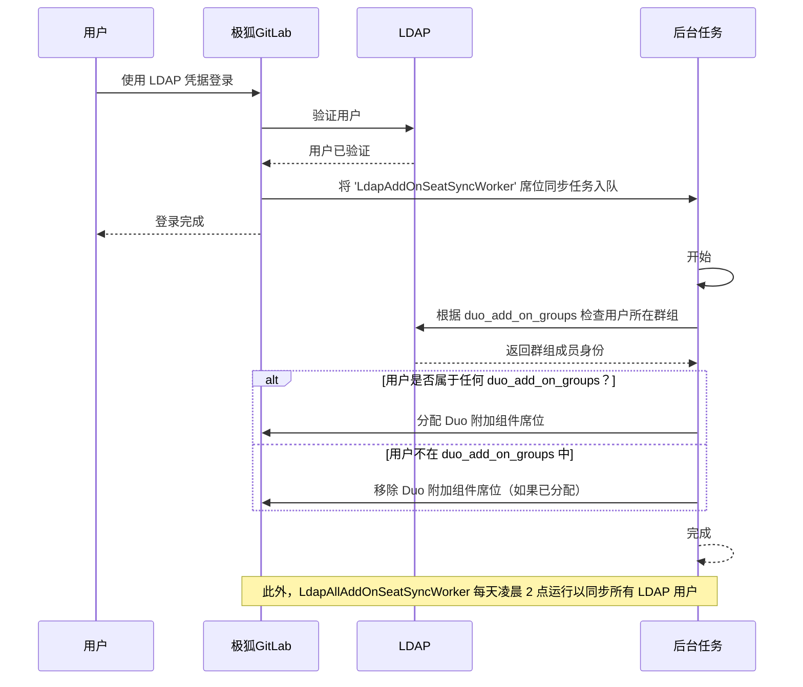



- Tier: 专业版，旗舰版
- Offering: 私有化部署





- 在极狐GitLab 17.8 中引入。



极狐GitLab 管理员可以基于 LDAP 群组成员身份配置自动的极狐GitLab Duo 附加组件席位分配。启用后，极狐GitLab 将在用户登录时根据其 LDAP 群组成员身份自动分配或移除附加组件席位。

<a id="seat-management-workflow"></a>

## 席位管理工作流

1. **配置**：管理员在 `duo_add_on_groups` [配置设置](#configure-gitlab-duo-add-on-seat-management) 中指定 LDAP 群组。
1. **席位同步**：极狐GitLab 通过两种方式检查 LDAP 群组成员身份：
   - **用户登录时**：当用户通过 LDAP 登录时，极狐GitLab 立即检查其群组成员身份。
   - **定时同步**：极狐GitLab 每天凌晨 2:00 自动同步所有 LDAP 用户，以确保即使没有用户登录，席位分配也保持最新。
1. **席位分配**：
   - 如果用户属于 `duo_add_on_groups` 中列出的任何群组，则为其分配附加组件席位（如果尚未分配）。
   - 如果用户不属于任何列出的群组，则移除其附加组件席位（如果之前已分配）。
1. **异步处理**：席位分配和移除以异步方式处理，以确保主登录流程不被中断。

下图展示了该工作流：



<a id="configure-gitlab-duo-add-on-seat-management"></a>

## 配置极狐GitLab Duo 附加组件席位管理

要启用基于 LDAP 的附加组件席位管理：

1. 打开你为[安装](auth/ldap/ldap_synchronization.md#gitlab-duo-add-on-for-groups)编辑过的极狐GitLab 配置文件。
1. 将 `duo_add_on_groups` 设置添加到你的 LDAP 服务器配置中。
1. 指定应拥有极狐GitLab Duo 附加组件席位的 LDAP 群组名称数组。

以下示例是适用于 Linux 软件包安装的 `gitlab.rb` 配置：

```ruby
gitlab_rails['ldap_servers'] = {
  'main' => {
    # 为便于阅读，已移除其他 LDAP 设置
    'duo_add_on_groups' => ['duo_users', 'admins'],
  }
}
```