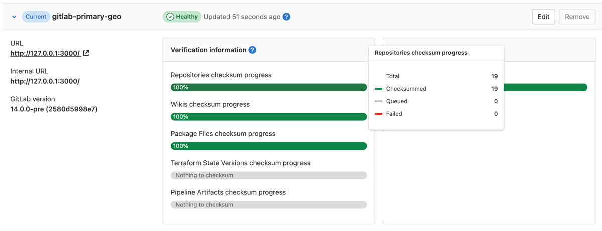
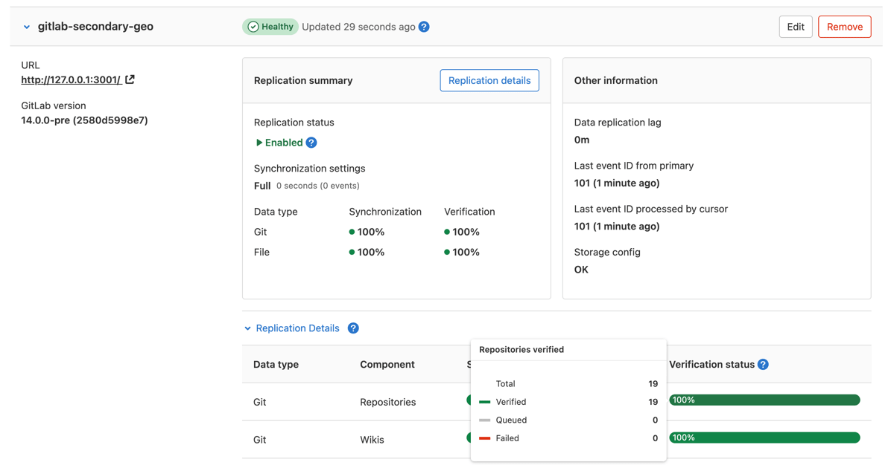
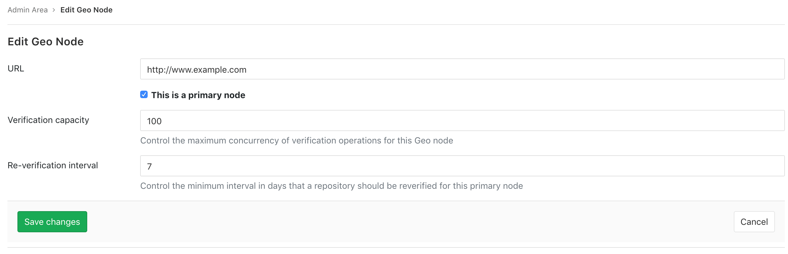



- Tier: 专业版，旗舰版
- Offering: 私有化部署



自动后台验证确保传输的数据与计算出的校验和匹配。如果 **主** 站点上的数据校验和与 **辅助** 站点上的数据校验和匹配，则数据传输成功。在计划故障转移后，根据损坏程度，任何损坏的数据可能会**丢失**。

如果验证在 **主** 站点上失败，这表明 Geo 正在复制一个损坏的对象。您可以从备份中恢复它，或者从 **主** 站点中移除以解决问题。

如果验证在 **主** 站点上成功，但在 **辅助** 站点上失败，这表明对象在复制过程中被损坏。Geo 会主动尝试纠正验证失败，标记仓库在一段退避期后重新同步。如果您想要为这些失败重置验证，您应该遵循[这些说明](background_verification.md#reset-verification-for-projects-where-verification-has-failed)。

如果验证明显滞后于复制，请考虑在安排计划故障转移之前给站点更多时间。

<a id="repository-verification"></a>

## 仓库验证

前提条件：

- 管理员权限。

在 **主** 站点上：

1. 在右上角，选择 **管理员**。
1. 在左侧边栏中，选择 **Geo** > **站点**。
1. 展开该站点的 **验证信息** 选项卡，查看仓库和 Wiki 的自动校验和状态。成功以绿色显示，待处理任务以灰色显示，失败以红色显示。

   

在 **辅助** 站点上：

1. 在右上角，选择 **管理员**。
1. 在左侧边栏中，选择 **Geo** > **站点**。
1. 展开该站点的 **验证信息** 选项卡，查看仓库和 Wiki 的自动校验和状态。成功以绿色显示，待处理任务以灰色显示，失败以红色显示。

   

<a id="using-checksums-to-compare-geo-sites"></a>

## 使用校验和比较 Geo 站点

要检查 Geo **辅助** 站点的健康状况，我们使用 Git 引用及其值列表的校验和。该校验和包含 `HEAD`、`heads`、`tags`、`notes` 以及极狐GitLab 特定引用，以确保真正的一致性。如果两个站点的校验和相同，那么它们肯定拥有相同的引用。我们在每次更新后计算每个站点的校验和，以确保它们都保持同步。

<a id="repository-re-verification"></a>

## 仓库重新验证

由于错误或短暂的基础设施故障，Git 仓库可能会意外更改而未被标记为需要验证。Geo 会不断重新验证仓库以确保数据完整性。默认且推荐的重新验证间隔为 7 天，但可以设置短至 1 天的间隔。较短的间隔会降低风险但增加负载，反之亦然。

在 **主** 站点上：

1. 在右上角，选择 **管理员**。
1. 在左侧边栏，选择 **Geo** > **站点**。
1. 选择 **主** 站点的 **编辑**，以自定义最小重新验证间隔：

   

<a id="reset-verification-for-projects-where-verification-has-failed"></a>

## 为验证失败的项目重置验证

Geo 会主动尝试纠正验证失败，标记仓库在一段退避期后重新同步。您也可以手动[通过 UI 或 Rails 控制台重新同步和重新验证各个组件](../replication/troubleshooting/synchronization_verification.md#resync-and-reverify-individual-components)。

<a id="reconcile-differences-with-checksum-mismatches"></a>

## 使用校验和不匹配协调差异



- **存储名称** 和 **相对路径** 字段在极狐GitLab 16.3 中从 **Gitaly 存储名称** 和 **Gitaly 相对路径** 重命名。



如果 **主** 站点和 **辅助** 站点出现校验和验证不匹配，原因可能并不明显。要查找校验和不匹配的原因：

1. 在 **主** 站点上：
   1. 在右上角，选择 **管理员**。
   1. 在左侧边栏，选择 **概览** > **项目**。
   1. 找到您想要检查校验和差异的项目，并选择其名称。
   1. 在项目管理页面上，获取 **存储名称** 和 **相对路径** 字段的值。

1. 在 **主** 站点上的 **Gitaly 节点** 和 **辅助** 站点上的 **Gitaly 节点** 上，进入项目的仓库目录。如果使用 Gitaly 集群 (Praefect)，请在运行这些命令前[检查其是否处于健康状态](../../gitaly/praefect/troubleshooting.md#check-cluster-health)。

   默认路径是 `/var/opt/gitlab/git-data/repositories`。如果仓库存储是自定义的，请检查服务器上的目录布局以确保：

   ```shell
   cd /var/opt/gitlab/git-data/repositories
   ```

   1. 在 **主** 站点上运行以下命令，将输出重定向到文件：

      ```shell
      git show-ref --head | grep -E "HEAD|(refs/(heads|tags|keep-around|merge-requests|environments|notes)/)" > primary-site-refs
      ```

   1. 在 **辅助** 站点上运行以下命令，将输出重定向到文件：

      ```shell
      git show-ref --head | grep -E "HEAD|(refs/(heads|tags|keep-around|merge-requests|environments|notes)/)" > secondary-site-refs
      ```

   1. 将前几步生成的文件复制到同一系统上，并对内容进行差分比较：

      ```shell
      diff primary-site-refs secondary-site-refs
      ```

<a id="current-limitations"></a>

## 当前限制

有关支持哪些复制和验证方法的更多信息，请参阅[支持的 Geo 数据类型](../replication/datatypes.md)。