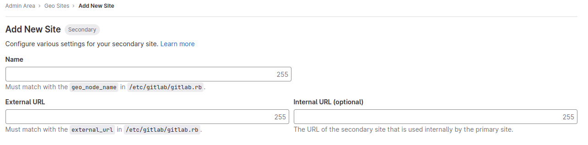
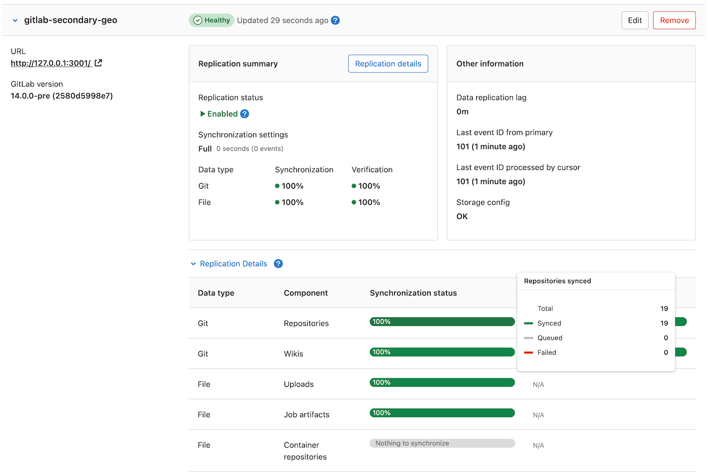



- Tier: 专业版，旗舰版
- Offering: 私有化部署



> [!note]
> 这是设置**次要** Geo 站点的最后一步。设置过程的各个阶段必须按照文档顺序完成。
> 如果尚未完成，请在继续之前[完成所有先前阶段](../setup/_index.md#using-linux-package-installations)。

配置**次要**站点的基本步骤包括：

1. 在**主**站点和**次要**站点之间复制所需的配置。
1. 在每个**次要**站点上配置跟踪数据库。
1. 在每个**次要**站点上启动 GitLab。

本文档聚焦于第一项。建议你在测试或生产环境中执行这些步骤之前，先通读所有步骤。

**主站点和次要站点的共同前提条件**：

- [设置数据库复制](../setup/database.md)
- [配置 Authorized SSH Keys 快速查找](../../operations/fast_ssh_key_lookup.md)

> [!note]
> **请勿**为**次要**站点设置任何自定义身份验证。这由**主**站点处理。
> 任何需要访问**管理员**区域的操作都必须在**主**站点上完成，因为**次要**站点是只读副本。

<a id="step-1-manually-replicate-secret-gitlab-values"></a>

## 第 1 步：手动复制密钥 GitLab 值

GitLab 在 `/etc/gitlab/gitlab-secrets.json` 文件中存储了许多密钥值，这些值必须在站点的所有节点上保持一致。由于目前尚无法在站点之间自动复制这些值（请参见议题 #3789），因此必须手动将其复制到**次要站点的所有节点**。

1. 通过 SSH 登录到**主站点的一个 Rails 节点**，并执行以下命令：

   ```shell
   sudo cat /etc/gitlab/gitlab-secrets.json
   ```

   这将显示需要复制的密钥，格式为 JSON。

1. 通过 SSH 登录到**次要 Geo 站点的每个节点**，并以 `root` 用户身份登录：

   ```shell
   sudo -i
   ```

1. 备份所有现有的密钥：

   ```shell
   mv /etc/gitlab/gitlab-secrets.json /etc/gitlab/gitlab-secrets.json.`date +%F`
   ```

1. 将 `/etc/gitlab/gitlab-secrets.json` 从**主站点的 Rails 节点**复制到**次要站点的每个节点**，或在节点之间复制粘贴文件内容：

   ```shell
   sudo editor /etc/gitlab/gitlab-secrets.json

   # 粘贴在主站点上运行的 `cat` 命令的输出
   # 保存并退出
   ```

1. 确保文件权限正确：

   ```shell
   chown root:root /etc/gitlab/gitlab-secrets.json
   chmod 0600 /etc/gitlab/gitlab-secrets.json
   ```

1. 重新配置**次要站点上的每个 Rails、Sidekiq 和 Gitaly 节点**以使更改生效：

   ```shell
   gitlab-ctl reconfigure
   gitlab-ctl restart
   ```

<a id="step-2-manually-replicate-the-primary-sites-ssh-host-keys"></a>

## 第 2 步：手动复制**主**站点的 SSH Host Keys

GitLab 与系统安装的 SSH 守护进程集成，指定一个用户（通常名为 `git`）来处理所有访问请求。

在[灾难恢复](../disaster_recovery/_index.md)场景中，GitLab 系统管理员会将**次要**站点提升为**主**站点。**主**域的 DNS 记录也应更新为指向新的**主**站点（之前是**次要**站点）。这样做可以避免需要更新 Git remote 和 API URL。

这会导致所有发往新提升的**主**站点的 SSH 请求因 SSH Host Key 不匹配而失败。为防止这种情况，必须将主 SSH Host Key 手动复制到**次要**站点。

SSH Host Key 的路径取决于所使用的软件：

- 如果你使用 OpenSSH，则路径为 `/etc/ssh`。
- 如果你使用 [`gitlab-sshd`](../../operations/gitlab_sshd.md)，则路径为 `/var/opt/gitlab/gitlab-sshd`。

在以下步骤中，请将 `<ssh_host_key_path>` 替换为你正在使用的路径：

1. 通过 SSH 登录到**次要站点的每个 Rails 节点**，并以 `root` 用户身份登录：

   ```shell
   sudo -i
   ```

1. 备份所有现有的 SSH Host Key：

   ```shell
   find <ssh_host_key_path> -iname 'ssh_host_*' -exec cp {} {}.backup.`date +%F` \;
   ```

1. 从**主**站点复制 SSH Host Key：

   如果你可以使用 `root` 用户访问**主站点上提供 SSH 流量的节点**（通常是主 GitLab Rails 应用节点）：

   ```shell
   # 在次要站点上运行此命令，将 `<primary_site_fqdn>` 替换为服务器的 IP 地址或 FQDN
   scp root@<primary_node_fqdn>:<ssh_host_key_path>/ssh_host_*_key* <ssh_host_key_path>
   ```

   如果你只能通过具有 `sudo` 权限的用户访问：

   ```shell
   # 在主站点的节点上运行此命令：
   sudo tar --transform 's/.*\///g' -zcvf ~/geo-host-key.tar.gz <ssh_host_key_path>/ssh_host_*_key*

   # 在次要站点的每个节点上运行此命令：
   scp <user_with_sudo>@<primary_site_fqdn>:geo-host-key.tar.gz .
   tar zxvf ~/geo-host-key.tar.gz -C <ssh_host_key_path>
   ```

1. 在**次要站点的每个 Rails 节点**上，确保文件权限正确：

   ```shell
   chown root:root <ssh_host_key_path>/ssh_host_*_key*
   chmod 0600 <ssh_host_key_path>/ssh_host_*_key
   ```

1. 为验证密钥指纹是否匹配，在每个站点的主节点和次要节点上执行以下命令：

   ```shell
   for file in <ssh_host_key_path>/ssh_host_*_key; do ssh-keygen -lf $file; done
   ```

   你应该会得到类似于以下内容的输出，并且两台节点上的输出应完全相同：

   ```shell
   1024 SHA256:FEZX2jQa2bcsd/fn/uxBzxhKdx4Imc4raXrHwsbtP0M root@serverhostname (DSA)
   256 SHA256:uw98R35Uf+fYEQ/UnJD9Br4NXUFPv7JAUln5uHlgSeY root@serverhostname (ECDSA)
   256 SHA256:sqOUWcraZQKd89y/QQv/iynPTOGQxcOTIXU/LsoPmnM root@serverhostname (ED25519)
   2048 SHA256:qwa+rgir2Oy86QI+PZi/QVR+MSmrdrpsuH7YyKknC+s root@serverhostname (RSA)
   ```

1. 验证你拥有与现有私钥对应的正确公钥：

   ```shell
   # 这将打印私钥的指纹：
   for file in <ssh_host_key_path>/ssh_host_*_key; do ssh-keygen -lf $file; done

   # 这将打印公钥的指纹：
   for file in <ssh_host_key_path>/ssh_host_*_key.pub; do ssh-keygen -lf $file; done
   ```

   > [!note]
   > 私钥和公钥命令的输出应生成相同的指纹。

1. 在**次要站点的每个 Rails 节点**上重启 `sshd`（用于 OpenSSH）或 `gitlab-sshd` 服务：

   - 对于 OpenSSH：

     ```shell
     # Debian 或 Ubuntu 安装情况
     sudo service ssh reload

     # CentOS 安装情况
     sudo service sshd reload
     ```

   - 对于 `gitlab-sshd`：

     ```shell
     sudo gitlab-ctl restart gitlab-sshd
     ```

1. 验证 SSH 是否仍然正常工作。

   在新终端中通过 SSH 登录到你的 GitLab **次要**服务器。如果无法连接，请根据前面的步骤验证权限是否正确。

<a id="step-3-add-the-secondary-site"></a>

## 第 3 步：添加**次要**站点

1. 通过 SSH 登录到**次要站点的每个 Rails 和 Sidekiq 节点**，并以 root 身份登录：

   ```shell
   sudo -i
   ```

1. 编辑 `/etc/gitlab/gitlab.rb`，并为你的站点添加一个**唯一的**名称。在后续步骤中你需要用到它：

   ```ruby
   ##
   ## Geo 站点的唯一标识符。请参阅
   ## https://gitlab.cn/docs/administration/geo_sites/#common-settings
   ##
   gitlab_rails['geo_node_name'] = '<site_name_here>'
   ```

1. 重新配置**次要站点的每个 Rails 和 Sidekiq 节点**以使更改生效：

   ```shell
   gitlab-ctl reconfigure
   ```

1. 前往主节点 GitLab 实例：
   1. 在右上角，选择**管理员**。
   1. 在左侧边栏中，选择 **Geo** > **Sites**。
   1. 选择**添加站点**。
      
   1. 在**名称**中，输入 `/etc/gitlab/gitlab.rb` 中 `gitlab_rails['geo_node_name']` 的值。这些值必须始终**精确匹配**，逐字符相同。
   1. 在**外部 URL** 中，输入 `/etc/gitlab/gitlab.rb` 中 `external_url` 的值。这些值必须始终匹配，但一个是否以 `/` 结尾而另一个不以结尾并无关紧要。
   1. 可选。在**内部 URL（可选）**中，输入次要站点的内部 URL。
   1. 可选。选择**次要**站点应复制哪些群组或存储分片。留空以复制全部。更多信息请参见[选择性同步](selective_synchronization.md)。
   1. 选择**保存更改**以添加**次要**站点。
1. 通过 SSH 登录到**次要站点的每个 Rails 和 Sidekiq 节点**，并重启服务：

   ```shell
   gitlab-ctl restart
   ```

   检查你的 Geo 设置是否存在任何常见问题，可运行：

   ```shell
   gitlab-rake gitlab:geo:check
   ```

   如果任何检查失败，请查阅[故障排除文档](troubleshooting/_index.md)。

1. 通过 SSH 登录到**主站点的一个 Rails 或 Sidekiq 服务器**，并以 root 身份登录，以验证**次要**站点是否可达，或检查 Geo 设置是否存在任何常见问题：

   ```shell
   gitlab-rake gitlab:geo:check
   ```

   如果任何检查失败，请查阅[故障排除文档](troubleshooting/_index.md)。

在**次要**站点被添加到 Geo 管理页面并重启后，该站点会自动开始从**主**站点复制缺失的数据，此过程称为**回填**。
同时，**主**站点会开始将任何更改通知给每个**次要**站点，以便**次要**站点可以立即对这些通知做出反应。

确保次要站点正在运行且可访问。你可以使用与主站点相同的凭据登录到次要站点。

<a id="add-primary-and-secondary-urls-as-allowed-actioncable-origins"></a>

### 添加主站点和次要站点的 URL 作为允许的 ActionCable 源

此步骤允许 WebSocket 在主站点和次要站点之间无缝工作。

1. 收集你的站点（主站点和次要站点）的**外部 URL**。你可以从管理区域的站点页面中找到它们，如上文所述。
1. 通过 SSH 登录到**主站点**的每个 Rails 和 Sidekiq 节点，并以 root 身份登录：

   ```shell
   sudo -i
   ```

1. 编辑 `/etc/gitlab/gitlab.rb`，将步骤 1 中收集到的 URL 添加到 `action_cable_allowed_origins` 设置中：

   ```ruby
   gitlab_rails['action_cable_allowed_origins'] = ['https://secondary.example.com', 'https://primary.example.com']
   ```

1. 为使更改生效，重新配置每个 Rails 和 Sidekiq 节点，并重启服务：

   ```shell
   gitlab-ctl reconfigure
   gitlab-ctl restart
   ```

<a id="step-4-optional-using-custom-certificates"></a>

## 第 4 步：（可选）使用自定义证书

如果满足以下条件，你可以安全地跳过此步骤：

- 你的**主**站点使用公共 CA 签发的 HTTPS 证书。
- 你的**主**站点仅通过 CA 签发的（非自签名）HTTPS 证书连接到外部服务。

<a id="custom-or-self-signed-certificate-for-inbound-connections"></a>

### 用于入站连接的自定义或自签名证书

如果你的 GitLab Geo **主**站点使用自定义或[自签名证书来保护入站 HTTPS 连接](https://gitlab.cn/docs/omnibus/settings/ssl/#install-custom-public-certificates)，这可以是单域名或多域名证书。

根据你的证书类型安装正确的证书：

- **包含主站点和次要站点域名的多域名证书**：将证书安装到**次要**站点所有**Rails、Sidekiq 和 Gitaly** 节点的 `/etc/gitlab/ssl` 下。
- **证书特定于每个 Geo 站点域名的单域名证书**：为你的**次要**站点的域名生成有效证书，并按照[这些说明](https://gitlab.cn/docs/omnibus/settings/ssl/#install-custom-public-certificates)将其安装到**次要**站点所有**Rails、Sidekiq 和 Gitaly** 节点的 `/etc/gitlab/ssl` 下。

<a id="connecting-to-external-services-that-use-custom-certificates"></a>

### 连接到使用自定义证书的外部服务

需要将外部服务的自签名证书副本添加到**主**站点所有需要访问该服务的节点的信任存储中。

为了让**次要**站点也能访问相同的外部服务，必须将这些证书添加到**次要**站点的信任存储中。

如果你的**主**站点使用了[用于入站连接的自定义或自签名证书](#custom-or-self-signed-certificate-for-inbound-connections)，则需要将**主**站点的证书添加到**次要**站点的信任存储中：

1. 通过 SSH 登录到**次要站点上的每个 Rails、Sidekiq 和 Gitaly 节点**，并以 root 身份登录：

   ```shell
   sudo -i
   ```

1. 从**主**站点复制受信任的证书：

   如果你可以使用 root 用户访问**主站点上提供 SSH 流量的节点**：

   ```shell
   scp root@<primary_site_node_fqdn>:/etc/gitlab/trusted-certs/* /etc/gitlab/trusted-certs
   ```

   如果你只能通过具有 sudo 权限的用户访问：

   ```shell
   # 在主站点的节点上运行此命令：
   sudo tar --transform 's/.*\///g' -zcvf ~/geo-trusted-certs.tar.gz /etc/gitlab/trusted-certs/*

   # 在次要站点的每个节点上运行此命令：
   scp <user_with_sudo>@<primary_site_node_fqdn>:geo-trusted-certs.tar.gz .
   tar zxvf ~/geo-trusted-certs.tar.gz -C /etc/gitlab/trusted-certs
   ```

1. 重新配置**次要站点中每个已更新的 Rails、Sidekiq 和 Gitaly 节点**：

   ```shell
   sudo gitlab-ctl reconfigure
   ```

<a id="step-5-verify-proper-functioning-of-the-secondary-site"></a>

## 第 5 步：验证**次要**站点的正常运行

你可以使用与**主**站点相同的凭据登录到**次要**站点。登录后：

1. 在右上角，选择**管理员**。
1. 在左侧边栏中，选择 **Geo** > **Sites**。
1. 验证它是否被正确标识为**次要** Geo 站点，并且 Geo 已启用。

初始复制可能需要一些时间。站点或“回填”状态可能仍处于“进行中”状态。你可以通过浏览器从**主**站点的 **Geo Sites** 仪表板监控每个 Geo 站点的同步过程。



如果你的安装无法正常工作，请查阅[故障排除文档](troubleshooting/_index.md)。

仪表板中最明显的两个问题是：

1. 数据库复制工作不正常。
1. 实例间通知无法正常工作。在这种情况下，可能是以下原因之一：
   - 你正在使用自定义证书或自定义 CA（请参见[故障排除文档](troubleshooting/_index.md)）。
   - 实例被防火墙拦截（请检查你的防火墙规则）。

禁用**次要**站点会停止同步过程。

如果**主**站点上为多个存储分片自定义了仓库存储，则必须在每个**次要**站点上复制相同的配置。

指引你的用户查阅[使用 Geo 站点指南](usage.md)。

目前，已同步的内容包括：

- Git 仓库
- Wiki
- LFS 对象
- 议题、合并请求、代码片段和评论附件
- 用户、群组和项目头像

<a id="troubleshooting"></a>

## 故障排除

请参阅[故障排除文档](troubleshooting/_index.md)。