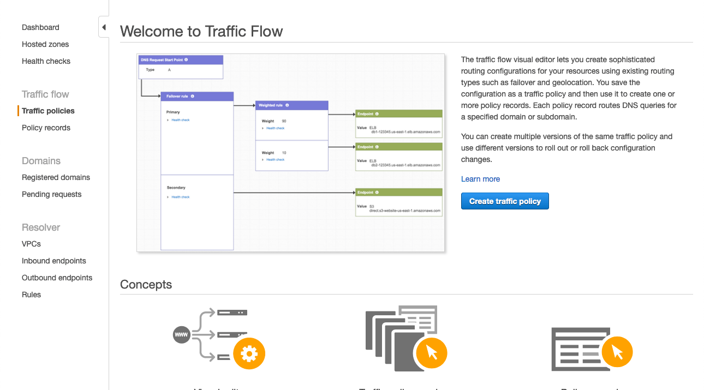
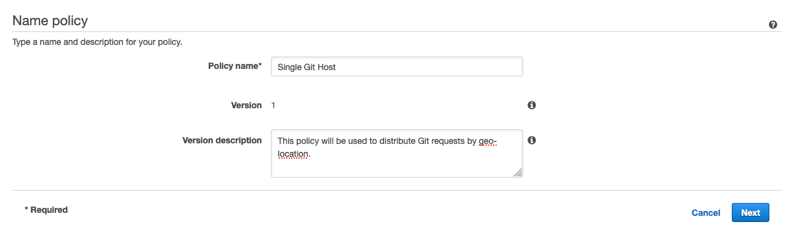
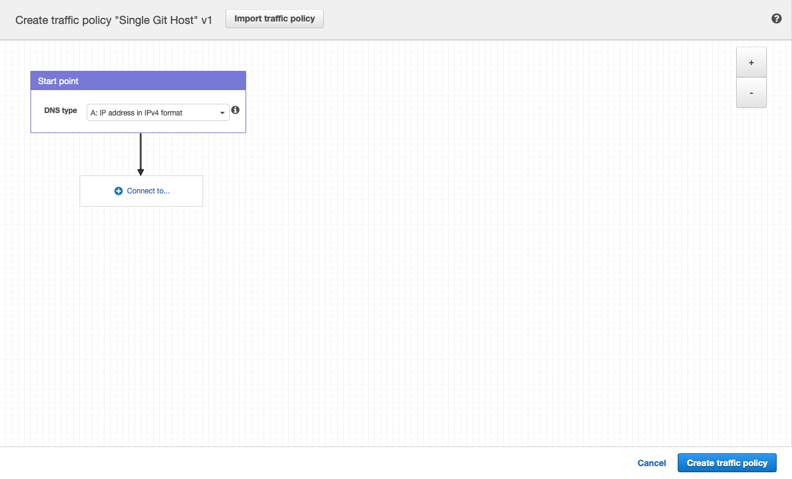
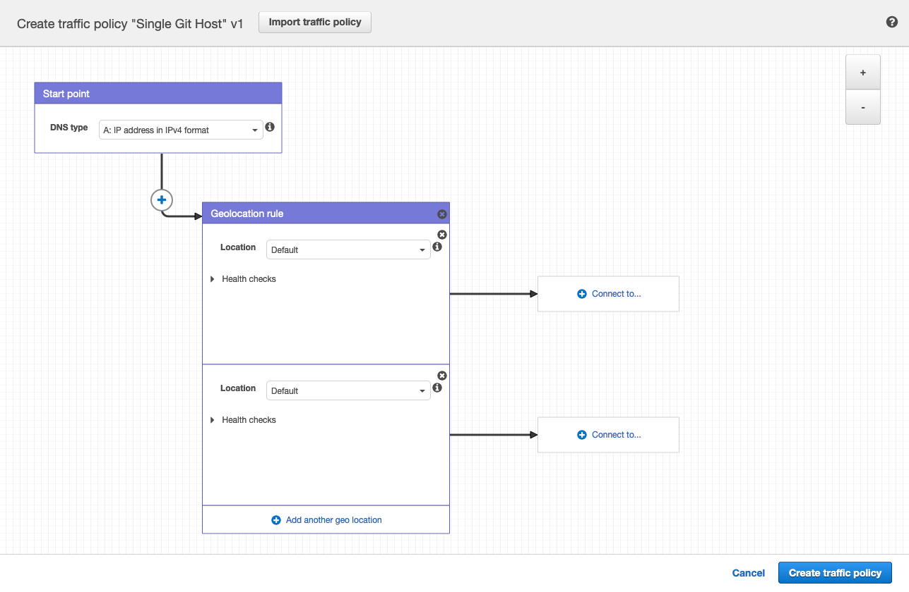
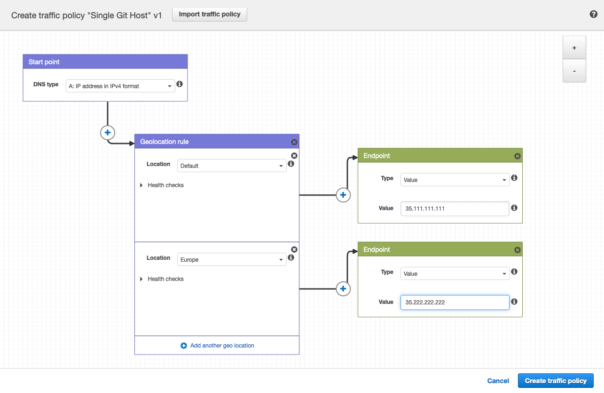
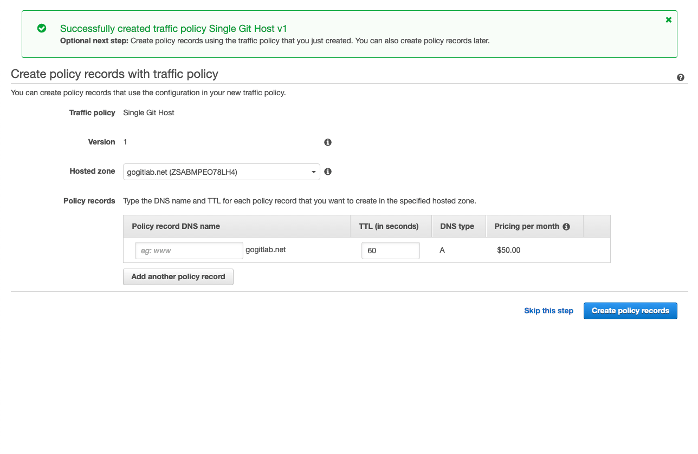
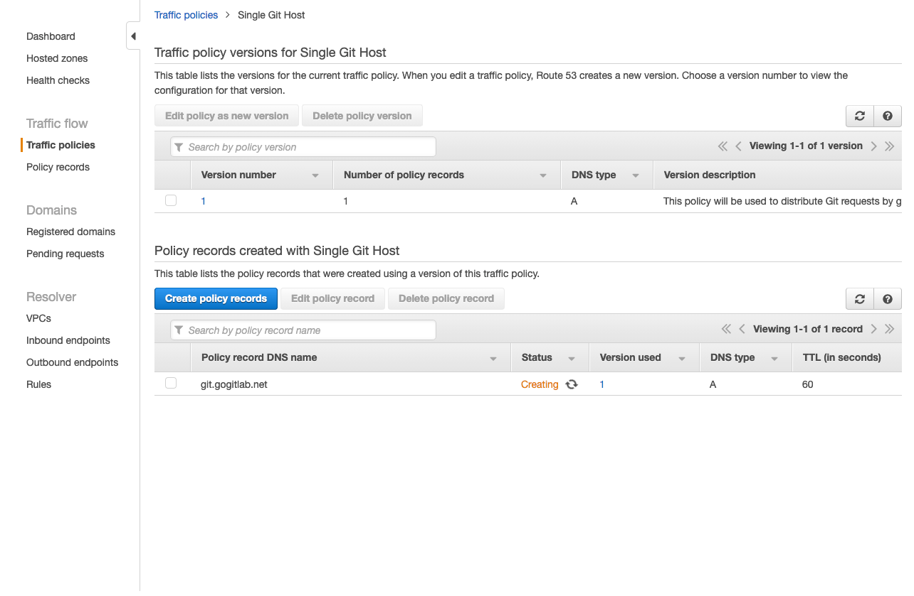
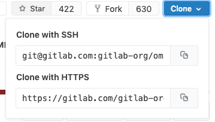



- Tier: 专业版，旗舰版
- Offering: 私有化部署



> [!note]
> [极狐GitLab Geo 支持位置感知的 DNS，包括 Web UI 和 API 流量。](../secondary_proxy/_index.md#configure-location-aware-dns)
> 建议优先使用该配置，而非本文档所描述的位置感知 Git 远程 URL。

你可以为极狐GitLab 用户提供一个统一的远程 URL，该 URL 会自动将请求指向离他们最近的 Geo 站点。这样，用户在移动时无需更新其 Git 配置即可受益于更近的 Geo 站点。

这是可行的，因为 Git 推送请求可以从 **辅助** 站点自动重定向（HTTP）或代理（SSH）到 **主** 站点。

本文使用 [AWS Route53](https://aws.amazon.com/route53/)，但你也可以使用其他类似服务。

## 前提条件

在本示例中，我们已经配置了：

- `primary.example.com` 作为 Geo **主** 站点。
- `secondary.example.com` 作为 Geo **辅助** 站点。

我们创建了一个 `git.example.com` 子域，它可以自动将请求定向到：

- 从中国发往 **辅助** 站点。
- 从其他所有位置发往 **主** 站点。

在任何情况下，你都需要：

- 一个正常运行的 极狐GitLab **主** 站点，可通过其自有地址访问。
- 一个正常运行的 极狐GitLab **辅助** 站点。
- 一个管理你域名的 Route53 托管区域。

如果你尚未设置 Geo 主站点和辅助站点，请参阅[Geo 设置说明](../setup/_index.md)。

## 创建流量策略

在 Route53 托管区域中，你可以使用流量策略来设置各种路由配置。

1. 进入 [Route53 控制面板](https://console.aws.amazon.com/route53/home) 并选择 **流量策略**。

   

1. 选择 **创建流量策略**。

   

1. 在 **策略名称** 字段中填写 `单一 Git 主机` 并选择 **下一步**。

   

1. 保持 **DNS 类型** 为 `A: IPv4 格式的 IP 地址`。
1. 选择 **连接到** 并选择 **地理位置规则**。

   

1. 对于第一个 **位置**，保留为 `默认`。
1. 选择 **连接到** 并选择 **新端点**。
1. 选择 **类型** `值` 并填入 `<你的 **主** 站点 IP 地址>`。
1. 对于第二个 **位置**，选择 `中国`。
1. 选择 **连接到** 并选择 **新端点**。
1. 选择 **类型** `值` 并填入 `<你的 **辅助** 站点 IP 地址>`。

   

1. 选择 **创建流量策略**。

   

1. 在 **策略记录 DNS 名称** 中填入 `git`。
1. 选择 **创建策略记录**。

   

你现在已成功设置一个统一主机，例如 `git.example.com`，它可以根据地理位置将流量分发到你的 Geo 站点！

## 配置 Git 克隆 URL 以使用特殊的 Git URL

当用户首次克隆仓库时，他们通常会从项目页面复制 Git 远程 URL。默认情况下，这些 SSH 和 HTTP URL 基于当前主机的外部 URL。例如：

- `git@secondary.example.com:group1/project1.git`
- `https://secondary.example.com/group1/project1.git`

你可以自定义：

- SSH 远程 URL 以使用位置感知的 `git.example.com`。为此，可在 Web 节点的 `gitlab.rb` 中设置 `gitlab_rails['gitlab_ssh_host']` 来更改 SSH 远程 URL 的主机。
- HTTP 远程 URL，如[自定义 HTTPS Git 克隆 URL](../../settings/visibility_and_access_controls.md#customize-git-clone-url-for-https) 所示。

## Git 请求处理的示例行为

按照上述配置步骤后，Git 请求的处理现在已具备位置感知能力。对于请求：

- 在中国以外的地区，所有请求都会被导向 **主** 站点。
- 在中国境内，通过：
  - HTTP：
    - `git clone http://git.example.com/foo/bar.git` 被导向 **辅助** 站点。
    - `git push` 最初被导向 **辅助** 站点，该站点会自动将其重定向到 `primary.example.com`。
  - SSH：
    - `git clone git@git.example.com:foo/bar.git` 被导向 **辅助** 站点。
    - `git push` 最初被导向 **辅助** 站点，该站点会自动将请求代理到 `primary.example.com`。