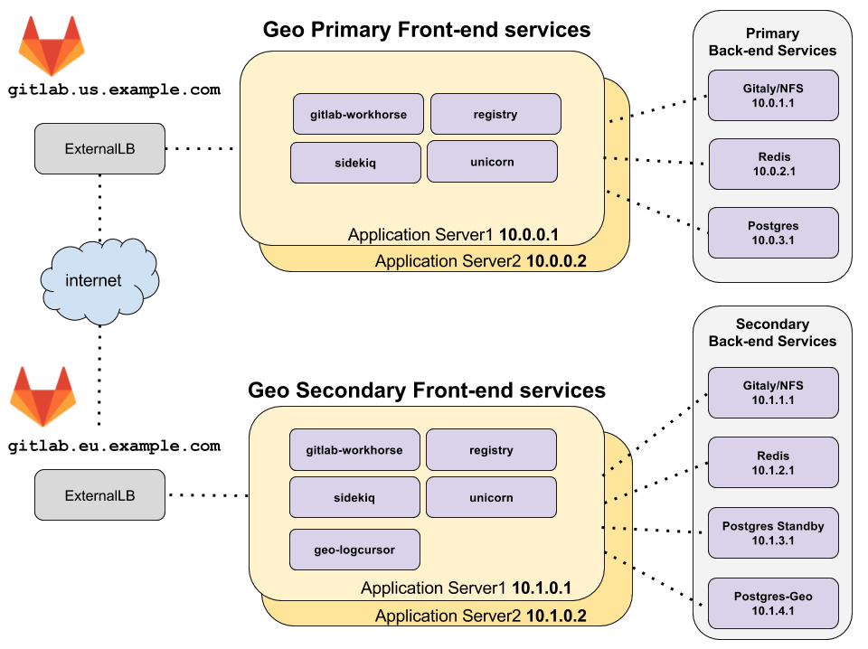



- Tier: 专业版，旗舰版
- Offering: 私有化部署



本文档描述了在多节点配置中运行 Geo 的最小参考架构。如果您的多节点设置与所述不同，可以根据需要调整这些说明。

本指南适用于具有多个应用节点（Sidekiq 或 GitLab Rails）的安装。对于带有外部 PostgreSQL 的单节点安装，请遵循[为两个单节点站点设置 Geo（使用外部 PostgreSQL 服务）](../setup/two_single_node_external_services.md)，如果您使用其他外部服务，请相应调整配置。

<a id="architecture-overview"></a>

## 架构概览



**[图表源文件 - 仅限 GitLab 团队成员](https://docs.google.com/drawings/d/1z0VlizKiLNXVVVaERFwgsIOuEgjcUqDTWPdQYsE7Z4c/edit)**

拓扑图假设 **主** 和 **辅助** Geo 站点位于两个不同的位置，在它们自己的虚拟网络中，使用私有 IP 地址。网络配置使得一个地理位置中的所有机器都可以使用它们的私有 IP 地址相互通信。给出的 IP 地址是示例，可能会根据您部署的网络拓扑而有所不同。

访问这两个 Geo 站点的唯一外部方式是通过 HTTPS，在上一个示例中为 `gitlab.us.example.com` 和 `gitlab.eu.example.com`。

> [!note]
> **主** 和 **辅助** Geo 站点必须能够通过 HTTPS 相互通信。

<a id="redis-and-postgresql-for-multiple-nodes"></a>

## 多节点的 Redis 和 PostgreSQL

由于为 PostgreSQL 和 Redis 设置此配置涉及的额外复杂性，本 Geo 多节点文档未涵盖此内容。

有关使用 Linux 软件包设置多节点 PostgreSQL 集群和 Redis 集群的更多信息，请参见：

- [Geo 多节点数据库复制](../setup/database.md#multi-node-database-replication)
- [Redis 多节点文档](../../redis/replication_and_failover.md)

> [!note]
> 可以使用云托管服务来运行 PostgreSQL 和 Redis，但这超出了本文档的范围。

<a id="prerequisites-two-independently-working-gitlab-multi-node-sites"></a>

## 先决条件：两个独立运行的极狐GitLab 多节点站点

一个极狐GitLab 站点作为 Geo **主** 站点。使用[极狐GitLab 参考架构文档](../../reference_architectures/_index.md)进行设置。您可以为每个 Geo 站点使用不同的参考架构规模。如果您已经有一个正在使用的极狐GitLab 实例，它可以作为 **主** 站点。

第二个极狐GitLab 站点作为 Geo **辅助** 站点。同样，使用[极狐GitLab 参考架构文档](../../reference_architectures/_index.md)进行设置。最好登录并测试它。但是，请注意，作为从 **主** 站点复制过程的一部分，其数据将被清除。

<a id="configure-a-gitlab-site-to-be-the-geo-primary-site"></a>

## 将极狐GitLab 站点配置为 Geo **主** 站点

以下步骤使极狐GitLab 站点能够作为 Geo **主** 站点。

<a id="step-1-configure-the-primary-frontend-nodes"></a>

### 步骤 1：配置 **主** 前端节点

> [!note]
> 不要使用 [`geo_primary_role`](https://gitlab.cn/docs/omnibus/roles/#gitlab-geo-roles)，因为它适用于单节点站点。

1. 编辑 `/etc/gitlab/gitlab.rb` 并添加以下内容：

   ```ruby
   ##
   ## Geo 站点的唯一标识符。请参见
   ## https://gitlab.cn/docs/administration/geo_sites/#common-settings
   ##
   gitlab_rails['geo_node_name'] = '<site_name_here>'

   ##
   ## 禁用自动迁移
   ##
   gitlab_rails['auto_migrate'] = false
   ```

进行这些更改后，[重新配置极狐GitLab](../../restart_gitlab.md#reconfigure-a-linux-package-installation)以使更改生效。

<a id="step-2-define-the-site-as-the-primary-site"></a>

### 步骤 2：将站点定义为 **主** 站点

1. 在其中一个前端节点上执行以下命令：

   ```shell
   sudo gitlab-ctl set-geo-primary-node
   ```

> [!note]
> 在典型的极狐GitLab 多节点设置过程中，应用节点上的 PostgreSQL 和 Redis 应该已经被禁用。从应用节点到后端节点上服务的连接也应该已经配置好。请参见 [PostgreSQL](../../postgresql/replication_and_failover.md#configuring-the-application-nodes) 和 [Redis](../../redis/replication_and_failover.md#example-configuration-for-the-gitlab-application) 的多节点配置文档。

<a id="configure-the-other-gitlab-site-to-be-a-geo-secondary-site"></a>

## 将另一个极狐GitLab 站点配置为 Geo **辅助** 站点

**辅助** 站点类似于任何其他极狐GitLab 多节点站点，但有三个主要区别：

- 主 PostgreSQL 数据库是 Geo **主** 站点 PostgreSQL 数据库的只读副本。
- 每个 Geo **辅助** 站点都有一个额外的 PostgreSQL 数据库，称为“Geo 跟踪数据库”，用于跟踪各种资源的复制和验证状态。
- 有一个额外的极狐GitLab 服务 [`geo-logcursor`](../_index.md#geo-log-cursor)

因此，我们逐个设置多节点组件，并包含与典型多节点设置的偏差。但是，我们强烈建议首先配置一个全新的极狐GitLab 站点，就好像它不是 Geo 设置的一部分一样。这可以验证它是一个正常工作的极狐GitLab 站点。然后才应该将其修改为用作 Geo **辅助** 站点。这有助于将 Geo 设置问题与无关的多节点配置问题分开。

<a id="step-1-configure-the-redis-and-gitaly-services-on-the-geo-secondary-site"></a>

### 步骤 1：在 Geo **辅助** 站点上配置 Redis 和 Gitaly 服务

配置以下服务，再次使用非 Geo 多节点文档：

- 为多节点[配置极狐GitLab 的 Redis](../../redis/replication_and_failover.md#example-configuration-for-the-gitlab-application)。
- [Gitaly](../../gitaly/_index.md)，它存储从 Geo **主** 站点同步的数据。

> [!note]
> 可以使用 [NFS](../../nfs.md) 代替 Gitaly，但不推荐。

<a id="step-2-configure-the-geo-tracking-database-on-the-geo-secondary-site"></a>

### 步骤 2：在 Geo **辅助** 站点上配置 Geo 跟踪数据库

Geo 跟踪数据库不能在多节点 PostgreSQL 集群中运行，请参见[为跟踪 PostgreSQL 数据库配置 Patroni 集群](../setup/database.md#configuring-patroni-cluster-for-the-tracking-postgresql-database)。

您可以在单个节点上运行 Geo 跟踪数据库，如下所示：

1. 为极狐GitLab 应用程序用于访问跟踪数据库的数据库用户生成所需密码的 MD5 哈希：

   用户名（默认为 `gitlab_geo`）会包含在哈希中。

   ```shell
   gitlab-ctl pg-password-md5 gitlab_geo
   # 输入密码：<your_tracking_db_password_here>
   # 确认密码：<your_tracking_db_password_here>
   # fca0b89a972d69f00eb3ec98a5838484
   ```

   在下一步中使用此哈希填充 `<tracking_database_password_md5_hash>`。

1. 在打算运行 Geo 跟踪数据库的机器上，将以下内容添加到 `/etc/gitlab/gitlab.rb`：

   ```ruby
   ##
   ## 启用 Geo 辅助跟踪数据库
   ##
   geo_postgresql['enable'] = true
   geo_postgresql['listen_address'] = '<ip_address_of_this_host>'
   geo_postgresql['sql_user_password'] = '<tracking_database_password_md5_hash>'

   ##
   ## 配置到副本数据库的 PostgreSQL 连接
   ##
   geo_postgresql['md5_auth_cidr_addresses'] = ['<replica_database_ip>/32']
   gitlab_rails['db_host'] = '<replica_database_ip>'

   # 防止 reconfigure 尝试在副本数据库上运行迁移
   gitlab_rails['auto_migrate'] = false
   ```

1. [选择退出自动 PostgreSQL 升级](https://gitlab.cn/docs/omnibus/settings/database/#opt-out-of-automatic-postgresql-upgrades)，以避免在升级极狐GitLab 时出现意外停机。请注意已知的[使用 Geo 升级 PostgreSQL 时的注意事项](https://gitlab.cn/docs/omnibus/settings/database/#caveats-when-upgrading-postgresql-with-geo)。特别是对于较大的环境，必须谨慎规划和执行 PostgreSQL 升级。因此，今后请确保 PostgreSQL 升级是定期维护活动的一部分。

进行这些更改后，[重新配置极狐GitLab](../../restart_gitlab.md#reconfigure-a-linux-package-installation)以使更改生效。

如果使用外部 PostgreSQL 实例，另请参见[使用外部 PostgreSQL 实例的 Geo](../setup/external_database.md)。

<a id="step-3-configure-postgresql-streaming-replication"></a>

### 步骤 3：配置 PostgreSQL 流复制

遵循 [Geo 数据库复制说明](../setup/database.md)。

如果使用外部 PostgreSQL 实例，另请参见[使用外部 PostgreSQL 实例的 Geo](../setup/external_database.md)。

启用流复制后，`gitlab-rake db:migrate:status:geo` 会失败，直到[辅助站点的配置完成](#step-7-copy-secrets-and-add-the-secondary-site-in-the-application)，特别是 [Geo 配置 - 步骤 3. 添加辅助站点](configuration.md#step-3-add-the-secondary-site)。

<a id="step-4-configure-the-frontend-application-nodes-on-the-geo-secondary-site"></a>

### 步骤 4：在 Geo **辅助** 站点上配置前端应用节点

> [!note]
> 不要使用 [`geo_secondary_role`](https://gitlab.cn/docs/omnibus/roles/#gitlab-geo-roles)，因为它适用于单节点站点。

在最小[架构图](#architecture-overview)中，有两台机器运行极狐GitLab 应用服务。这些服务在配置中被选择性启用。

按照[参考架构](../../reference_architectures/_index.md)中概述的相关步骤配置极狐GitLab Rails 应用节点，然后进行以下修改：

1. 在 Geo **辅助** 站点的每个应用节点上编辑 `/etc/gitlab/gitlab.rb`，并添加以下内容：

   ```ruby
   ##
   ## 启用极狐GitLab 应用服务。application_role 启用了许多服务。
   ## 或者，您可以选择在不同节点上启用或禁用特定服务，
   ## 以帮助水平扩展和关注点分离。
   ##
   roles ['application_role']

   ## `application_role` 已经启用了此功能。只有在您选择性启用
   ## 依赖于 Rails 的单个服务（如 `puma`、`sidekiq`、`geo-logcursor` 等）时，
   ## 才需要此行。
   gitlab_rails['enable'] = true

   ##
   ## 启用 Geo 日志游标服务
   ##
   geo_logcursor['enable'] = true

   ##
   ## Geo 站点的唯一标识符。请参见
   ## https://gitlab.cn/docs/administration/geo_sites/#common-settings
   ##
   gitlab_rails['geo_node_name'] = '<site_name_here>'

   ##
   ## 禁用自动迁移
   ##
   gitlab_rails['auto_migrate'] = false

   ##
   ## 配置到跟踪数据库的连接
   ##
   geo_secondary['enable'] = true
   geo_secondary['db_host'] = '<geo_tracking_db_host>'
   geo_secondary['db_password'] = '<geo_tracking_db_password>'

   ##
   ## 配置到流副本数据库的连接（如果尚未配置）
   ##
   gitlab_rails['db_host'] = '<replica_database_host>'
   gitlab_rails['db_password'] = '<replica_database_password>'

   ##
   ## 配置到 Redis 的连接（如果尚未配置）
   ##
   gitlab_rails['redis_host'] = '<redis_host>'
   gitlab_rails['redis_password'] = '<redis_password>'

   ##
   ## 如果您使用的是不由 Omnibus 管理的自定义用户，则需要指定
   ## 如下所示的 UID 和 GID，并确保它们在集群中的节点之间匹配，
   ## 以避免权限问题
   ##
   user['uid'] = 9000
   user['gid'] = 9000
   web_server['uid'] = 9001
   web_server['gid'] = 9001
   registry['uid'] = 9002
   registry['gid'] = 9002
   ```

> [!warning]
> 如果您使用 Linux 软件包设置了 PostgreSQL 集群，并设置了
> `postgresql['sql_user_password'] = 'md5 摘要 of secret'`，请记住
> `gitlab_rails['db_password']` 和 `geo_secondary['db_password']`
> 包含明文密码。这些配置用于让 Rails 节点连接到数据库。

确保当前节点的 IP 列在只读副本数据库的 `postgresql['md5_auth_cidr_addresses']` 设置中，以允许此节点上的 Rails 连接到 PostgreSQL。

进行这些更改后，[重新配置极狐GitLab](../../restart_gitlab.md#reconfigure-a-linux-package-installation)以使更改生效。

在[架构概览](#architecture-overview)拓扑中，以下极狐GitLab 服务在“前端”节点上启用：

- `geo-logcursor`
- `gitlab-pages`
- `gitlab-workhorse`
- `logrotate`
- `nginx`
- `registry`
- `remote-syslog`
- `sidekiq`
- `puma`

通过在前端应用节点上运行 `sudo gitlab-ctl status` 来验证这些服务是否存在。

<a id="step-5-set-up-the-loadbalancer-for-the-geo-secondary-site"></a>

### 步骤 5：为 Geo **辅助** 站点设置负载均衡器

最小[架构图](#architecture-overview)显示每个地理位置都有一个负载均衡器，用于将流量路由到应用节点。

有关更多信息，请参见[多节点极狐GitLab 的负载均衡器](../../load_balancer.md)。

<a id="step-6-configure-the-backend-application-nodes-on-the-geo-secondary-site"></a>

### 步骤 6：在 Geo **辅助** 站点上配置后端应用节点

最小[架构图](#architecture-overview)显示所有应用服务在同一台机器上一起运行。但是，对于多节点，我们[强烈建议将所有服务分开运行](../../reference_architectures/_index.md)。

例如，一个 Sidekiq 节点可以按照之前记录的前端应用节点类似的方式进行配置，并进行一些更改以仅运行 `sidekiq` 服务：

1. 在 Geo **辅助** 站点的每个 Sidekiq 节点上编辑 `/etc/gitlab/gitlab.rb`，并添加以下内容：

   ```ruby
   ##
   ## 启用 Sidekiq 服务
   ##
   sidekiq['enable'] = true
   gitlab_rails['enable'] = true

   ##
   ## Geo 站点的唯一标识符。请参见
   ## https://gitlab.cn/docs/administration/geo_sites/#common-settings
   ##
   gitlab_rails['geo_node_name'] = '<site_name_here>'

   ##
   ## 禁用自动迁移
   ##
   gitlab_rails['auto_migrate'] = false

   ##
   ## 配置到跟踪数据库的连接
   ##
   geo_secondary['enable'] = true
   geo_secondary['db_host'] = '<geo_tracking_db_host>'
   geo_secondary['db_password'] = '<geo_tracking_db_password>'

   ##
   ## 配置到流副本数据库的连接（如果尚未配置）
   ##
   gitlab_rails['db_host'] = '<replica_database_host>'
   gitlab_rails['db_password'] = '<replica_database_password>'

   ##
   ## 配置到 Redis 的连接（如果尚未配置）
   ##
   gitlab_rails['redis_host'] = '<redis_host>'
   gitlab_rails['redis_password'] = '<redis_password>'

   ##
   ## 如果您使用的是不由 Omnibus 管理的自定义用户，则需要指定
   ## 如下所示的 UID 和 GID，并确保它们在集群中的节点之间匹配，
   ## 以避免权限问题
   ##
   user['uid'] = 9000
   user['gid'] = 9000
   web_server['uid'] = 9001
   web_server['gid'] = 9001
   registry['uid'] = 9002
   registry['gid'] = 9002
   ```

   您可以类似地配置一个节点仅运行 `geo-logcursor` 服务，设置 `geo_logcursor['enable'] = true` 并通过 `sidekiq['enable'] = false` 禁用 Sidekiq。

   这些节点不需要连接到负载均衡器。

<a id="step-7-copy-secrets-and-add-the-secondary-site-in-the-application"></a>

### 步骤 7：复制密钥并在应用程序中添加辅助站点

1. [配置极狐GitLab](configuration.md) 以设置 **主** 和 **辅助** 站点。