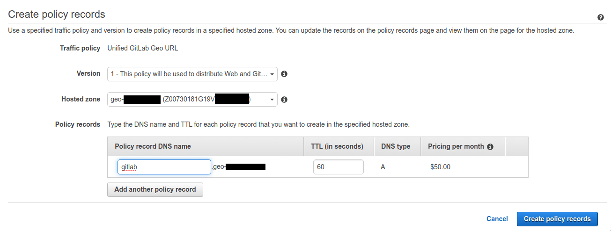



- Tier: 专业版，旗舰版
- Offering: 私有化部署



> [!flag]
> 此功能的可用性由功能标志控制。
> `geo_secondary_proxy_separate_urls` 功能标志计划在未来的版本中弃用并移除。
> 对只读 Geo 从站点的支持已在 [议题 366810](https://gitlab.com/gitlab-org/gitlab/-/issues/366810) 中提出。

从站点表现为完整的读写极狐GitLab 实例。它们将所有操作透明地代理到主站点，但有一些[显著的例外情况](#features-accelerated-by-secondary-geo-sites)。

此行为支持以下用例：

- 将所有 Geo 站点置于单个 URL 之后，无论用户访问哪个站点，都能提供一致、无缝且全面的体验。用户无需处理多个极狐GitLab URL。
- 按地理位置对流量进行负载均衡，而无需担心写入访问。

<!-- Video published on 2022-01-26 -->

有关已知问题，请参阅 [Geo 文档中与代理相关的条目](../_index.md#known-issues)。

<a id="set-up-a-unified-url-for-geo-sites"></a>

## 为 Geo 站点设置统一 URL

从站点可以透明地提供读写流量。因此，您可以使用单个外部 URL，以便请求可以访问主 Geo 站点或任何从 Geo 站点。无论用户访问哪个站点，这都能提供一致、无缝且全面的体验。用户无需处理多个 URL，甚至无需知道多个站点的概念。

您可以通过以下方式将流量路由到 Geo 站点：

- 地理位置感知 DNS。将流量路由到最近的 Geo 站点，无论是主站点还是从站点。有关示例，请参阅[配置地理位置感知 DNS](#configure-location-aware-dns)。
- 轮询 DNS。
- 负载均衡器。它必须使用粘性会话，以避免身份验证失败和跨站点请求错误。DNS 路由本质上是粘性的，因此没有此注意事项。

<a id="configure-location-aware-dns"></a>

### 配置地理位置感知 DNS

按照此示例将流量路由到最近的 Geo 站点，无论是主站点还是从站点。

<a id="prerequisites"></a>

#### 先决条件

此示例创建一个 `gitlab.example.com` 子域，自动将请求定向到：

- 从所有位置到主站点。

对于此示例，您需要：

- 一个正常工作的 Geo 主站点和从站点，请参阅 [Geo 设置说明](../setup/_index.md)。
- 一个管理您域名的 DNS 区域。虽然以下说明使用 [AWS Route53](https://aws.amazon.com/route53/) 和 [GCP cloud DNS](https://cloud.google.com/dns)，但也可以使用其他服务，例如 [Cloudflare](https://www.cloudflare.com/)。

<a id="aws-route53"></a>

#### AWS Route53

在此示例中，您使用一个 Route53 托管区域来管理您的域名，以进行 Route53 设置。

在 Route53 托管区域中，可以使用流量策略来设置各种路由配置。要创建流量策略：

1. 转到 [Route53 仪表板](https://console.aws.amazon.com/route53/home) 并选择 **流量策略**。
1. 选择 **创建流量策略**。
1. 在 **策略名称** 字段中填写 `Single Git Host`，然后选择 **下一步**。
1. 将 **DNS 类型** 保留为 `A: IP Address in IPv4 format`。
1. 选择 **连接到**，然后选择 **地理位置规则**。
1. 对于第一个 **位置**：
   1. 将其保留为 `Default`。
   1. 选择 **连接到**，然后选择 **新端点**。
   1. 选择 **类型** `value` 并填写 `<your primary IP address>`。
1. 选择 **创建流量策略**。
1. 在 **策略记录 DNS 名称** 中填写 `gitlab`。

   

1. 选择 **创建策略记录**。

您已成功设置一个单一主机，例如 `gitlab.example.com`，它通过地理位置规则路由流量。

<a id="gcp"></a>

#### GCP

在此示例中，您创建一个管理您域名的 GCP Cloud DNS 区域。

创建基于地理位置的记录集时，当流量来源与任何策略项不完全匹配时，GCP 会对来源区域应用最近匹配。要创建基于地理位置的记录集：

1. 选择 **网络服务** > **Cloud DNS**。
1. 选择为您的域名配置的区域。
1. 选择 **添加记录集**。
1. 输入您的位置感知公共 URL 的 DNS 名称，例如，`gitlab.example.com`。
1. 选择 **路由策略**：**基于地理位置**。
1. 选择 **添加托管 RRData**。
   1. 输入您的 `<primary IP address>`。
   1. 选择 **完成**。
1. 选择 **添加托管 RRData**。
   1. 输入您的 `<secondary IP address>`。
   1. 选择 **完成**。
1. 选择 **创建**。

您已成功设置一个单一主机，例如 `gitlab.example.com`，它使用位置感知 URL 将流量分发到您的 Geo 站点。

<a id="configure-each-site-to-use-the-same-external-url"></a>

### 配置每个站点使用相同的外部 URL

在您设置好从单个 URL 到所有 Geo 站点的路由后，如果您的站点使用不同的 URL，请执行以下步骤：

1. 在每个极狐GitLab 站点上，SSH 登录到每个运行 Rails（Puma、Sidekiq、Log-Cursor）的节点，并将 `external_url` 设置为该单一 URL：

   ```shell
   sudo -e /etc/gitlab/gitlab.rb
   ```

1. 重新配置更新后的节点以使更改生效：

   ```shell
   sudo gitlab-ctl reconfigure
   ```

1. 为了匹配在从 Geo 站点上设置的新外部 URL，主数据库需要反映此更改。

   在主站点的 Geo 管理页面中，编辑每个使用从站点代理的 Geo 从站点，并将 `URL` 字段设置为该单一 URL。确保主站点也使用此 URL。

   为了允许站点之间相互通信，[确保每个站点的 `Internal URL` 字段是唯一的](../../geo_sites.md#set-up-the-internal-urls)。

在 Kubernetes 中，您可以[使用与主站点相同的域，配置在 `global.hosts.domain` 下](https://gitlab.cn/docs/charts/advanced/geo/)。

<a id="set-up-a-separate-url-for-a-secondary-geo-site"></a>

## 为从 Geo 站点设置单独的 URL

您可以为每个站点使用不同的外部 URL。您可以使用此功能为特定用户群提供特定站点。或者，您可以允许用户控制他们使用哪个站点，但他们必须理解其选择的含义。

> [!note]
> 极狐GitLab 不支持多个外部 URL，请参阅 [议题 21319](https://gitlab.com/gitlab-org/gitlab/-/issues/21319)。一个固有的问题是，在很多情况下，站点需要在 HTTP 请求上下文之外生成绝对 URL，例如在发送非请求触发的电子邮件时。

<a id="configure-a-secondary-geo-site-to-a-different-external-url-than-the-primary-site"></a>

### 将从 Geo 站点配置为与主站点不同的外部 URL

如果您的从站点使用与主站点相同的外部 URL，但您希望将其更改为使用不同的 URL：

1. 在从站点上，SSH 登录到每个运行 Rails（Puma、Sidekiq、Log-Cursor）的节点，并将 `external_url` 设置为从站点所需的 URL：

   ```shell
   sudo -e /etc/gitlab/gitlab.rb
   ```

1. 重新配置更新后的节点以使更改生效：

   ```shell
   sudo gitlab-ctl reconfigure
   ```

1. 为了匹配在从 Geo 站点上设置的新外部 URL，主数据库需要反映此更改。

   在主站点的 Geo 管理页面中，编辑目标从站点，并将 `URL` 字段设置为所需的 URL。

   为了允许站点之间相互通信，[确保每个站点的 `Internal URL` 字段是唯一的](../../geo_sites.md#set-up-the-internal-urls)。如果所需 URL 对此站点是唯一的，那么您可以清除 `Internal URL` 字段。保存时，它将默认为外部 URL。

<a id="behavior-of-secondary-sites-when-the-primary-geo-site-is-down"></a>

## 当主 Geo 站点宕机时从站点的行为

考虑到 Web 流量被代理到主站点，当主站点不可访问时，从站点的行为会有所不同：

- UI 和 API 流量返回与主站点相同的错误（或者如果主站点完全不可访问则失败），因为它们被代理。
- 对于在被访问的特定从站点上完全最新的代码仓库，Git 读取操作仍然可以正常工作，包括通过 HTTP(s) 或 SSH 进行身份验证。但是，由极狐GitLab Runner 执行的 Git 读取将失败。
- 对于未复制到从站点的代码仓库的 Git 操作，返回与主站点相同的错误，因为它们被代理。
- 所有 Git 写入操作都返回与主站点相同的错误，因为它们被代理。

<a id="features-accelerated-by-secondary-geo-sites"></a>

## 由从 Geo 站点加速的功能

发送到从 Geo 站点的大多数 HTTP 流量都被代理到主 Geo 站点。通过这种架构，从 Geo 站点能够支持写入请求，并避免读后写问题。某些读取请求由从站点本地处理，以改善附近的延迟和带宽。

下表详细说明了通过 Geo 从站点 Workhorse 代理测试的组件。它并未涵盖所有数据类型。

在此上下文中，加速读取是指由从站点提供的读取请求，前提是该组件在从站点上的数据是最新的。如果确定从站点上的数据已过期，则请求将转发到主站点。对于下表中未列出的组件的读取请求，始终会自动转发到主站点。

| 功能 / 组件                                  | 加速读取？ | 备注 |
|:-----------------------------------------------------|:-------------------|-------|
| Rails 静态资源（JavaScript、CSS、字体、图片） |         | `/assets/` 下的资源由 Workhorse 直接从从站点的本地文件系统提供，无需代理到主站点。这适用于所有从站点，无论使用统一 URL 还是单独的 URL。在初始浏览器请求后，这些资源通常也会被浏览器缓存。 |
| 项目、Wiki、设计代码仓库（使用 Web UI）  |          |       |
| 项目、Wiki 代码仓库（使用 Git）                 |         | Git 读取由本地从站点提供，而推送则被代理到主站点。如果代码仓库在 Geo 从站点本地不存在，例如由于选择性同步排除，则请求将被代理到主站点。 |
| 项目、个人代码片段（使用 Web UI）         |          |       |
| 项目、个人代码片段（使用 Git）                |         | Git 读取由本地从站点提供，而推送则被代理到主站点。如果代码仓库在 Geo 从站点本地不存在，例如由于选择性同步排除，则请求将被代理到主站点。 |
| 群组 Wiki 代码仓库（使用 Web UI）             |          |       |
| 群组 Wiki 代码仓库（使用 Git）                    |         | Git 读取由本地从站点提供，而推送则被代理到主站点。如果代码仓库在 Geo 从站点本地不存在，例如由于选择性同步排除，则请求将被代理到主站点。 |
| 用户上传                                         |          |       |
| LFS 对象（使用 Web UI）                       |          |       |
| LFS 对象（使用 Git）                              |         |       |
| Pages                                                |          | Pages 可以使用相同的 URL（无访问控制），但必须单独配置，且不会被代理。 |
| 高级搜索（使用 Web UI）                   |          |       |
| 容器镜像仓库                                   |          | 容器镜像仓库仅推荐用于灾难恢复场景。如果从站点的容器镜像仓库不是最新的，则读取请求将使用旧数据提供，因为请求不会转发到主站点。加速容器镜像仓库已计划，请在[议题](https://gitlab.com/gitlab-org/gitlab/-/issues/365864)中点赞或评论以表明您的兴趣，或要求您的极狐GitLab 代表为您执行此操作。 |
| 依赖代理                                     |          | 对 Geo 从站点的依赖代理的读取请求始终被代理到主站点。 |
| 所有其他数据                                       |          | 对于此表中未列出的组件的读取请求，始终会自动转发到主站点。 |

要请求加速某项功能，请检查 [史诗 8239](https://gitlab.com/groups/gitlab-org/-/work_items/8239) 中是否已存在相关议题，并点赞或评论以表明您的兴趣，或要求您的极狐GitLab 代表为您执行此操作。如果不存在适用的议题，请创建一个并在史诗中提及。

<a id="disable-secondary-site-http-proxying"></a>

## 禁用从站点 HTTP 代理

当从站点使用统一 URL（即配置为与主站点相同的 `external_url`）时，从站点 HTTP 代理默认启用。在这种情况下禁用代理通常没有帮助，因为根据路由，相同的 URL 会提供完全不同的行为。当在从 Geo 站点上禁用 HTTP 代理时，该站点将以只读模式运行，并带有一些您应该注意的重要限制。

<a id="what-happens-if-you-disable-secondary-proxying"></a>

### 如果禁用从站点代理会发生什么

禁用代理功能标志具有以下一般效果。

<a id="http-and-git-requests"></a>

#### HTTP 和 Git 请求

- 从站点不会将 HTTP 请求代理到主站点。相反，它会尝试自行处理这些请求，或者失败。
- Git 请求通常成功。Git 推送会被重定向或代理到主站点。
- 除 Git 请求外，任何可能写入数据的 HTTP 请求都会失败。读取请求通常成功。

| 功能 / 组件                                 | 成功     | 备注 |
|:----------------------------------------------------|:------------|-------|
| 项目、Wiki、设计代码仓库（使用 Web UI） | 可能       | 读取由本地存储的数据提供。写入会导致错误。 |
| 项目、Wiki 代码仓库（使用 Git）                |  | Git 读取由本地存储的数据提供，而推送则被代理到主站点。如果代码仓库在 Geo 从站点本地不存在，例如由于选择性同步排除，则会导致“未找到”错误。 |
| 项目、个人代码片段（使用 Web UI）        | 可能       | 读取由本地存储的数据提供。写入会导致错误。 |
| 项目、个人代码片段（使用 Git）               |  | Git 读取由本地存储的数据提供，而推送则被代理到主站点。如果代码仓库在 Geo 从站点本地不存在，例如由于选择性同步排除，则会导致“未找到”错误。 |
| 群组 Wiki 代码仓库（使用 Web UI）            | 可能       | 读取由本地存储的数据提供。写入会导致错误。 |
| 群组 Wiki 代码仓库（使用 Git）                   |  | Git 读取由本地存储的数据提供，而推送则被代理到主站点。如果代码仓库在 Geo 从站点本地不存在，例如由于选择性同步排除，则会导致“未找到”错误。 |
| 用户上传                                        | 可能       | 上传文件由本地存储的数据提供。在从站点上尝试上传文件会导致错误。 |
| LFS 对象（使用 Web UI）                      | 可能       | 读取由本地存储的数据提供。写入会导致错误。 |
| LFS 对象（使用 Git）                             |  | LFS 对象由本地存储的数据提供，而推送则被代理到主站点。如果 LFS 对象在 Geo 从站点本地不存在，例如由于选择性同步排除，则会导致“未找到”错误。 |
| Pages                                               | 可能       | Pages 可以使用相同的 URL（无访问控制），但必须单独配置，且不会被代理。 |
| 高级搜索（使用 Web UI）                  |   |       |
| 容器镜像仓库                                  |   | 容器镜像仓库仅推荐用于灾难恢复场景。如果从站点的容器镜像仓库不是最新的，则读取请求将使用旧数据提供，因为请求不会转发到主站点。加速容器镜像仓库已计划，请在[议题](https://gitlab.com/gitlab-org/gitlab/-/issues/365864)中点赞或评论以表明您的兴趣，或要求您的极狐GitLab 代表为您执行此操作。 |
| 依赖代理                                    |   |       |
| 所有其他数据                                      | 可能       | 读取由本地存储的数据提供。写入会导致错误。 |

您应该使用功能标志，而不是使用 `GEO_SECONDARY_PROXY` 环境变量。

在极狐GitLab 15.1 中，即使没有统一 URL，从站点上的 HTTP 代理也默认启用。

<a id="terms-of-service-acceptance"></a>

#### 服务条款接受

当代理被禁用时，仅访问从站点的用户无法正确接受服务条款或其他法律协议。这会产生以下问题：

- **无接受记录**：如果员工仅登录从站点，他们对条款和条件的接受不会记录在主数据库中，因为当从站点代理被禁用时，写入操作（包括条款接受）不会被代理，即使他们可能看到条款消息。
- **法律合规问题**：如果员工通过仅从站点访问模式使用极狐GitLab 服务，组织可能缺乏适当的法律保障，因为没有他们同意条款和条件的可验证记录。

作为变通方法，您必须至少访问一次主站点以正确接受条款和条件。在主站点接受后，此信息将通过正常的 Geo 同步复制到从站点。

> [!note]
> 此限制影响需要记录接受条款和条件以符合合规或法律要求的组织。确保用户能够访问主站点以进行初始条款接受。

<a id="disable-proxy-on-all-secondary-sites"></a>

### 在所有从站点上禁用代理

如果您需要在所有从站点上禁用代理，最简单的方法是禁用功能标志：





1. SSH 登录到您的主 Geo 站点上运行 Puma 或 Sidekiq 的节点并运行：

   ```shell
   sudo gitlab-rails runner "Feature.disable(:geo_secondary_proxy_separate_urls)"
   ```

1. 在您的从 Geo 站点上所有运行 Puma 的节点上重启 Puma：

   ```shell
   sudo gitlab-ctl restart puma
   ```





1. 在您的主 Geo 站点上，在 Toolbox pod 中运行此命令：

   ```shell
   kubectl exec -it <toolbox-pod-name> -- gitlab-rails runner "Feature.disable(:geo_secondary_proxy_separate_urls)"
   ```

1. 在您的从 Geo 站点上重启 Webservice pod：

   ```shell
   kubectl rollout restart deployment -l app=webservice
   ```





要恢复更改以便重新启用从站点代理：





1. SSH 登录到您的主 Geo 站点上运行 Puma 或 Sidekiq 的节点并运行：

   ```shell
   sudo gitlab-rails runner "Feature.enable(:geo_secondary_proxy_separate_urls)"
   ```

1. 在您的从 Geo 站点上所有运行 Puma 的节点上重启 Puma：

   ```shell
   sudo gitlab-ctl restart puma
   ```





1. 在您的主 Geo 站点上，在 Toolbox pod 中运行此命令：

   ```shell
   kubectl exec -it <toolbox-pod-name> -- gitlab-rails runner "Feature.enable(:geo_secondary_proxy_separate_urls)"
   ```

1. 在您的从 Geo 站点上重启 Webservice pod：

   ```shell
   kubectl rollout restart deployment -l app=webservice
   ```





<a id="disable-secondary-site-http-proxying-per-site"></a>

### 按站点禁用从站点 HTTP 代理

如果有多个从站点，您可以按照以下步骤在每个从站点上单独禁用 HTTP 代理：





1. SSH 登录到您的从 Geo 站点上的每个应用节点（直接服务用户流量）并添加以下环境变量：

   ```shell
   sudo -e /etc/gitlab/gitlab.rb
   ```

   ```ruby
   gitlab_workhorse['env'] = {
     "GEO_SECONDARY_PROXY" => "0"
   }
   ```

1. 重新配置更新后的节点以使更改生效：

   ```shell
   sudo gitlab-ctl reconfigure
   ```





您可以使用 `--set gitlab.webservice.extraEnv.GEO_SECONDARY_PROXY="0"`，或在您的 values 文件中指定以下内容：

```yaml
gitlab:
  webservice:
    extraEnv:
      GEO_SECONDARY_PROXY: "0"
```





<a id="disable-secondary-site-git-proxying"></a>

### 禁用从站点 Git 代理

无法禁用以下内容的转发：

- 通过 SSH 的 Git 推送
- 当 Git 代码仓库在从站点上过期时，通过 SSH 的 Git 拉取
- 通过 HTTP 的 Git 推送
- 当 Git 代码仓库在从站点上过期时，通过 HTTP 的 Git 拉取
