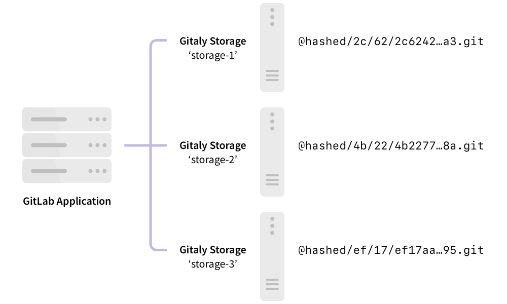
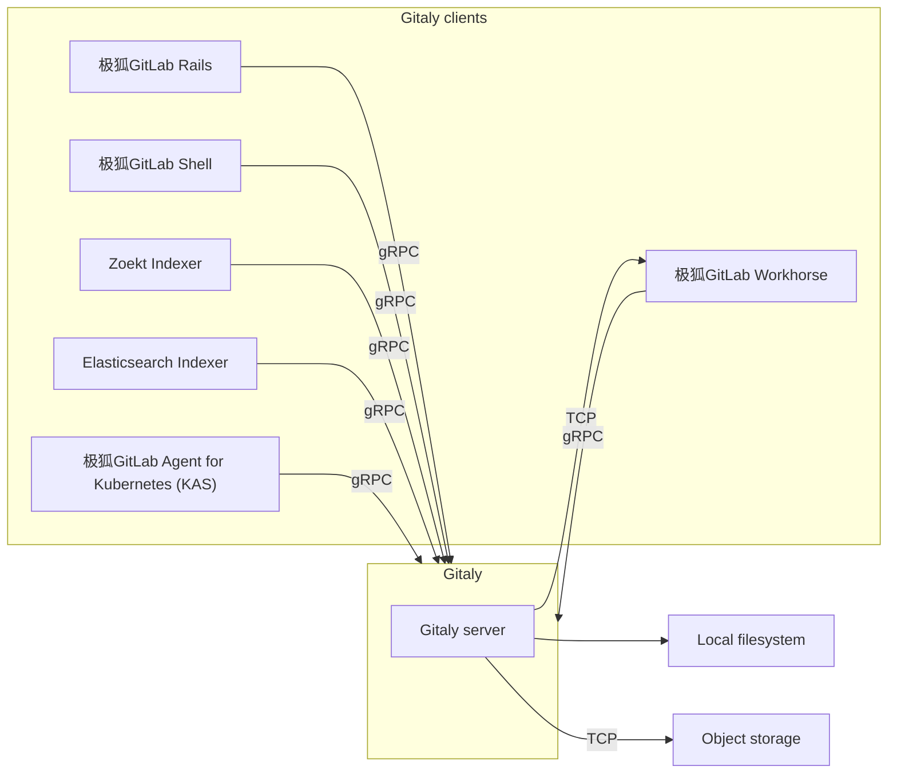



- Tier: 基础版，专业版，旗舰版
- Offering: 私有化部署



[Gitaly](https://jihulab.com/gitlab-cn/gitaly) 提供了对 Git 仓库的高级远程过程调用 (RPC) 访问。
极狐GitLab 使用它来读取和写入 Git 数据。

Gitaly 存在于每个极狐GitLab 安装中，并协调 Git 仓库的
存储和检索。Gitaly 可以是：

- 在单实例 Linux 软件包安装中运行的后台服务（所有
  极狐GitLab 在一台机器上）。
- 根据扩展和可用性需求，分离到自己的实例并在完整的集群配置中进行配置。

> [!note]
> Gitaly 仅管理极狐GitLab 的 Git 仓库访问。其他类型的极狐GitLab 数据不使用 Gitaly 访问。

极狐GitLab 通过配置的
[仓库存储](../repository_storage_paths.md) 访问[仓库](../../user/project/repository/_index.md)。每个新仓库根据其
[配置的权重](../repository_storage_paths.md#configure-where-new-repositories-are-stored) 存储在一个仓库存储上。每个
仓库存储要么是：

- 使用[存储路径](../repository_storage_paths.md) 直接访问仓库的 Gitaly 存储，其中每个仓库存储在单个 Gitaly 节点上。所有请求都路由到此节点。
- 由 [Gitaly 集群 (Praefect)](praefect/_index.md) 提供的[虚拟存储](praefect/_index.md#virtual-storage)，其中每个仓库可以存储在多个 Gitaly 节点上以实现容错。对于 Gitaly 集群 (Praefect)：
  - 读取请求分布在多个 Gitaly 节点之间，这可以提高性能。
  - 写入请求广播到仓库副本。

以下展示了极狐GitLab 设置为直接访问 Gitaly：

在此示例中：

- 每个仓库存储在三个 Gitaly 存储之一上：`storage-1`、`storage-2` 或
  `storage-3`。
- 每个存储由一个 Gitaly 节点提供服务。
- 三个 Gitaly 节点在其文件系统上存储数据。

## 磁盘要求

Gitaly 和 Gitaly 集群 (Praefect) 需要快速的本地存储才能有效运行，因为它们是大量
基于 I/O 的进程。因此，我们强烈建议所有 Gitaly 节点使用固态硬盘
(SSD)。这些 SSD 应具有高读写吞吐量，因为 Gitaly 同时操作许多小文件。

作为参考，以下图表显示了 JihuLab.com 上 Gitaly 生产集群在一分钟粒度下的 P99 磁盘 IOPS。
数据源自一个为期七天的代表性时期，从周一开始到周一结束。请注意，随着工作周流量
增大，IOPS 会出现规律性的峰值。原始数据显示出更大的峰值，写入峰值
达到 8000 IOPS。可用的磁盘吞吐量必须能够处理这些峰值，以避免
中断 Gitaly 请求。

- P99 磁盘读取 IOPS：

  

- P99 磁盘写入 IOPS：

  

我们通常看到：

- 每秒 500 - 1000 次读取，峰值每秒 3500 次读取。
- 每秒约 500 次写入，峰值超过每秒 3000 次写入。

在撰写本文时，Gitaly 服务器集群中的大多数实例均为 `t2d-standard-32` 实例，
配备 `pd-ssd` 磁盘。[宣传的](https://cloud.google.com/compute/docs/disks/performance#t2d_instances)
最大写入和读取 IOPS 为 60,000。

JihuLab.com 还针对昂贵的 Git 操作采用了更严格的[并发限制](concurrency_limiting.md)，
这些限制默认不会在极狐GitLab 私有化部署实例上启用。放宽并发限制、
针对特别大的单体仓库的操作，或使用
[pack-objects 缓存](configure_gitaly.md#pack-objects-cache) 都可能显著增加磁盘活动。

在实践中，对于你自己的环境，你在 Gitaly 实例上观察到的磁盘活动可能与这些公布的结果
有很大差异。如果你在云环境中运行，选择更大的实例通常会提高可用的磁盘 IOPS。
你也可以选择配置 IOPS 磁盘类型，以获得有保证的吞吐量。请参阅你的云提供商的文档，
了解如何正确配置 IOPS。

对于仓库数据，出于性能和一致性的考虑，仅支持 Gitaly 和 Gitaly 集群 (Praefect) 使用本地存储。
不支持 [NFS](../nfs.md) 或[基于云的文件系统](../nfs.md#avoid-using-cloud-based-file-systems) 等替代方案。

## Gitaly 架构

Gitaly 实现了客户端-服务器架构：

- Gitaly 服务器是运行 Gitaly 本身的任何节点。
- Gitaly 客户端是运行对 Gitaly 服务器发出请求的进程的任何节点。Gitaly 客户端也被
  称为 Gitaly 消费者，包括：
  - [极狐GitLab Rails 应用程序](https://jihulab.com/gitlab-cn/gitlab)
  - [极狐GitLab Shell](https://jihulab.com/gitlab-cn/gitlab-shell)
  - [极狐GitLab Workhorse](https://jihulab.com/gitlab-cn/gitlab-workhorse)
  - [极狐GitLab Elasticsearch Indexer](https://jihulab.com/gitlab-cn/gitlab-elasticsearch-indexer)
  - [极狐GitLab Zoekt Indexer](https://jihulab.com/gitlab-cn/gitlab-zoekt-indexer)
  - [极狐GitLab Agent for Kubernetes (KAS)](https://jihulab.com/gitlab-cn/cluster-integration/gitlab-agent)

以下说明了 Gitaly 客户端-服务器架构：

## 配置 Gitaly

Gitaly 随 Linux 软件包安装进行了预配置，这是一种
[适用于多达 20 RPS / 1000 名用户](../reference_architectures/1k_users.md) 的配置。对于：

- 适用于多达 40 RPS / 2000 名用户的 Linux 软件包安装，请参阅[具体的 Gitaly 配置说明](../reference_architectures/2k_users.md#configure-gitaly)。
- 自行编译的安装或自定义 Gitaly 安装，请参阅[配置 Gitaly](configure_gitaly.md)。

对于每天执行 Git 写入操作的活跃用户超过 2000 名的极狐GitLab 安装，最适合使用 Gitaly 集群 (Praefect)。

## Gitaly CLI



- `gitaly git` 子命令在极狐GitLab 17.4 中引入。



`gitaly` 命令是一个命令行界面，为 Gitaly 管理员提供了额外的子命令。例如，
Gitaly CLI 用于：

- 为仓库[配置自定义 Git 钩子](../server_hooks.md)。
- 验证 Gitaly 配置文件。
- 验证内部 Gitaly API 是否可访问。
- 针对磁盘上的仓库[运行 Git 命令](troubleshooting.md#use-gitaly-git-when-git-is-required-for-troubleshooting)。

有关其他子命令的更多信息，请运行 `sudo -u git -- /opt/gitlab/embedded/bin/gitaly --help`。

## 备份仓库

在使用除 GitLab 之外的工具备份或同步仓库时，必须在复制仓库数据时[阻止写入](../backup_restore/backup_gitlab.md#prevent-writes-and-copy-the-git-repository-data)。

## Bundle URI

你可以将 Git [bundle URI](https://git-scm.com/docs/bundle-uri) 与 Gitaly 一起使用。
有关更多信息，请参阅 [Bundle URI 文档](bundle_uris.md)。

## 直接访问仓库

极狐GitLab 不建议使用 Git 客户端或任何其他工具直接访问存储在磁盘上的 Gitaly 仓库，
因为 Gitaly 在持续改进和变化。这些改进可能会使你的
假设无效，从而导致性能下降、不稳定，甚至数据丢失。例如：

- Gitaly 具有诸如 [`info/refs` 广告缓存](https://gitlab.com/gitlab-org/gitaly/blob/master/doc/design_diskcache.md) 之类的优化，
  这些优化依赖于 Gitaly 通过使用官方 gRPC 接口控制和监控对仓库的访问。
- [Gitaly 集群 (Praefect)](praefect/_index.md) 具有诸如容错和
  [分布式读取](praefect/_index.md#distributed-reads) 的优化，这些优化依赖于 gRPC 接口和数据库
  来确定仓库状态。

> [!warning]
> 直接访问 Git 仓库的风险自负，且不受支持。