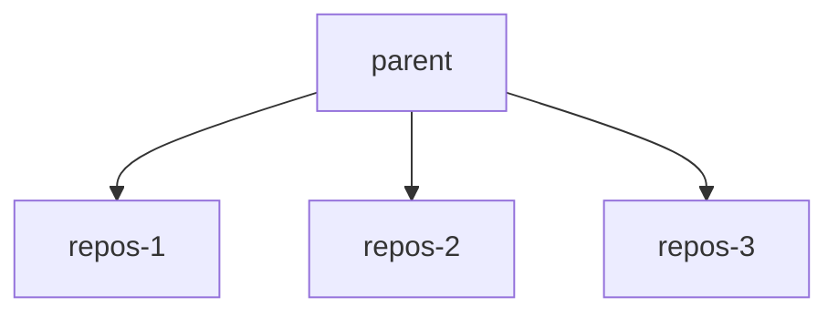

您可以在 Linux 中使用控制组（cgroups）来限制特定进程可消耗的内存和 CPU 量。Cgroups 有助于保护系统免受因内存和 CPU 过度消耗而导致的意外资源耗尽。Cgroups 广泛可用，并且通常用作容器化的基础机制。

Cgroups 通过使用伪文件系统进行配置，通常挂载在 `/sys/fs/cgroup` 下，并以分层方式分配资源。挂载点在 Gitaly 中是可配置的。根据所使用的 cgroups 版本，其结构会有所不同：

- Cgroups v1 遵循面向资源的层次结构。父目录是像 `cpu` 和 `memory` 这样的资源。
- Cgroups v2 采用面向进程的方法。父目录是进程组，其中的文件代表每个被控制的资源。

有关更深入的介绍，请参阅 [cgroups Linux 手册页](https://man7.org/linux/man-pages/man7/cgroups.7.html)。

当 Gitaly 运行时：

- 在虚拟机上，同时支持 cgroups v1 和 cgroups v2。Gitaly 会根据挂载点自动检测要使用的 cgroup 版本。
- 在 Kubernetes 集群上，仅支持 cgroups v2，因为使用 cgroups v1 时无法将对 cgroup 层次结构的读写权限委托给容器。

当 Gitaly 使用 cgroups v2 运行时，可能会有额外的功能和改进，例如能够使用 [clone](https://man7.org/linux/man-pages/man2/clone.2.html) 系统调用直接在 cgroup 下启动进程。

<a id="before-you-begin"></a>

## 开始之前

在您的环境中启用限制应谨慎进行，并且仅在特定情况下进行，例如为了防止意外流量。当达到限制时，确实会导致断开连接，从而对用户产生负面影响。为了获得一致且稳定的性能，您应首先探索其他选项，例如调整节点规格，以及[审查大型仓库](../../user/project/repository/monorepos/_index.md)或工作负载。

当为内存启用 cgroups 时，您应确保在 Gitaly 节点上没有配置交换空间，因为进程可能转而使用交换空间而不是被终止。内核将可用的交换内存视为对 cgroup 所施加限制的额外补充。这种情况可能导致性能显著受损。
要在 Gitaly 中启用 cgroups，您必须配置 `repositories` 字段，且 `count` 大于 `0`。

<a id="how-gitaly-benefits-from-cgroups"></a>

## Gitaly 如何从 cgroups 中受益

在某些情况下，一些 Git 操作可能会消耗过多资源直至耗尽，例如：

- 意外的高流量。
- 对未遵循最佳实践的大型仓库运行操作。

消耗这些资源的特定仓库上的活动被称为“吵闹的邻居”，并可能导致托管在同一 Gitaly 服务器上的其他仓库的 Git 性能下降。

作为一种硬性保护，Gitaly 可以使用 cgroups 来告诉内核在这些操作占用所有系统资源并导致不稳定之前终止它们。Gitaly 根据 Git 命令所操作的仓库将 Git 进程分配到一个 cgroup。这些 cgroup 称为仓库 cgroups。每个仓库 cgroup：

- 有内存和 CPU 限制。
- 包含一个或多个仓库的 Git 进程。cgroup 的总数是可配置的。每个 cgroup 使用一致性循环哈希来确保针对给定仓库的 Git 进程总是最终进入同一个 cgroup。

当仓库 cgroup 达到其：

- 内存限制时，内核会检查进程以寻找要终止的候选进程，这可能导致客户端请求被中止。
- CPU 限制时，进程不会被终止，但进程会被阻止消耗超过允许量的 CPU，这意味着客户端请求可能会被限制，但不会被中止。

当达到这些限制时，性能可能会降低，用户可能会断开连接。

下图说明了 cgroup 结构：

- 父 cgroup 管理所有 Git 进程的限制。
- 每个仓库 cgroup（命名为 `repos-1` 到 `repos-3`）在仓库级别强制执行限制。

如果 Gitaly 存储服务于：

- 仅三个仓库，每个仓库直接分配到一个 cgroup 中。
- 超过仓库 cgroups 数量的仓库，多个仓库会以一致的方式分配到同一个组中。



<a id="configuring-oversubscription"></a>

## 配置超量订阅

仓库 cgroups 的数量应足够高，以便在服务于数千个仓库的存储上仍能实现隔离。仓库数量的一个良好起点是存储上活跃仓库数量的两倍。

因为仓库 cgroups 在父 cgroup 的基础上强制执行额外的限制，如果我们通过将父限制除以组数来配置它们，最终会得到过于严格的限制。例如：

- 我们的父内存限制是 32 GiB。
- 我们大约有 100 个活跃仓库。
- 我们已配置 `cgroups.repositories.count = 100`。

如果我们将 32 GiB 除以 100，每个仓库 cgroup 将仅分配 0.32 GiB。此设置将导致极差的性能和严重的利用不足。

您可以使用超量订阅在正常操作期间维持性能基线水平，同时允许少量高工作负载仓库在必要时“爆发”，而不会影响不相关的请求。超量订阅指的是分配比系统技术上可用的资源更多的资源。

使用前面的示例，我们可以通过为每个仓库 cgroup 分配 10 GiB 内存来超量订阅，尽管系统没有 10 GiB * 100 的系统内存。这些值假设 10 GiB 足以应对任何单个仓库的正常操作，但也允许两个仓库各自爆发到 10 GiB，同时留下第三份资源来维持基线性能。

类似的规则也适用于 CPU 时间。我们故意为仓库 cgroups 分配比整个系统可用核心数更多的 CPU 核心。例如，我们可能决定每个仓库 cgroup 分配 4 个核心，即使系统没有 400 个总核心。

两个主要值控制超量订阅：

- `cpu_quota_us`
- `memory_bytes`

父 cgroups 的这些值与仓库 cgroups 的这些值之间的差异决定了超量订阅的量。

<a id="measurement-and-tuning"></a>

## 测量与调优

为了确定和调整超量订阅的正确基线资源需求，您必须观察 Gitaly 服务器上的生产工作负载。默认公开的 [Prometheus 指标](../monitoring/prometheus/_index.md)足以满足此需求。您可以使用以下查询作为指南，来衡量特定 Gitaly 服务器的 CPU 和内存使用情况：

| 查询                                                                                                                                                | 资源                                                          |
|------------------------------------------------------------------------------------------------------------------------------------------------------|-------------------------------------------------------------------|
| `quantile_over_time(0.99, instance:node_cpu_utilization:ratio{type="gitaly", fqdn="gitaly.internal"}[5m])`    | 具有指定 `fqdn` 的 Gitaly 节点的 p99 CPU 利用率    |
| `quantile_over_time(0.99, instance:node_memory_utilization:ratio{type="gitaly", fqdn="gitaly.internal"}[5m])` | 具有指定 `fqdn` 的 Gitaly 节点的 p99 内存利用率 |

根据您在代表性时间段（例如，一个典型的工作周）内观察到的利用率，您可以确定正常操作的基线资源需求。为了得出上一个示例中的配置，我们会观察到整个工作周内持续的内存使用量为 10 GiB，以及 CPU 的 4 核心负载。

随着您的工作负载变化，您应该重新审视这些指标并对 cgroups 配置进行调整。如果在启用 cgroups 后您发现性能显著下降，您也应该调整配置，因为这可能表明限制过于严格。

<a id="available-configuration-settings"></a>

## 可用的配置设置



- 在极狐GitLab 16.7 中[引入](https://gitlab.com/gitlab-org/gitaly/-/issues/5689)了 `max_cgroups_per_repo`。
- 在极狐GitLab 17.8 中[移除](https://gitlab.com/gitlab-org/gitlab/-/merge_requests/176694)了旧版方法的文档。



要在 Gitaly 中配置仓库 cgroups，请在 `/etc/gitlab/gitlab.rb` 中为 `gitaly['configuration'][:cgroups]` 使用以下设置：

- `mountpoint` 是父 cgroup 目录的挂载位置。默认为 `/sys/fs/cgroup`。
- `hierarchy_root` 是 Gitaly 在其下创建组的父 cgroup，并且预期由 Gitaly 运行时所使用的用户和组拥有。当 Gitaly 启动时，Linux 软件包安装会创建目录集 `mountpoint/<cpu|memory>/hierarchy_root`。
- `memory_bytes` 是共同施加于 Gitaly 生成的所有 Git 进程的总内存限制。0 表示无限制。
- `cpu_shares` 是共同施加于 Gitaly 生成的所有 Git 进程的 CPU 限制。0 表示无限制。最大值为 1024 份额，代表 100% 的 CPU。
- `cpu_quota_us` 是 [`cfs_quota_us`](https://docs.kernel.org/scheduler/sched-bwc.html#management)，如果 cgroups 的进程超过此配额值，则对其进行限制。我们将 `cfs_period_us` 设置为 `100ms`，因此 1 个核心为 `100000`。0 表示无限制。
- `repositories.count` 是 cgroups 池中 cgroups 的数量。每次生成新的 Git 命令时，Gitaly 会根据该命令所针对的仓库将其分配到这些 cgroup 之一。循环哈希算法将 Git 命令分配到这些 cgroup，因此针对某个仓库的 Git 命令总是被分配到同一个 cgroup。
- `repositories.memory_bytes` 是施加于包含在仓库 cgroup 中的所有 Git 进程的总内存限制。0 表示无限制。此值不能超过顶级 `memory_bytes` 的值。
- `repositories.cpu_shares` 是施加于包含在仓库 cgroup 中的所有 Git 进程的 CPU 限制。0 表示无限制。最大值为 1024 份额，代表 100% 的 CPU。此值不能超过顶级 `cpu_shares` 的值。
- `repositories.cpu_quota_us` 是施加于包含在仓库 cgroup 中的所有 Git 进程的 [`cfs_quota_us`](https://docs.kernel.org/scheduler/sched-bwc.html#management)。一个 Git 进程不能使用超过给定配额的量。我们将 `cfs_period_us` 设置为 `100ms`，因此 1 个核心为 `100000`。0 表示无限制。
- `repositories.max_cgroups_per_repo` 是针对特定仓库的 Git 进程可以分布到的仓库 cgroups 的数量。这使得可以为仓库 cgroups 配置更保守的 CPU 和内存限制，同时仍然允许突发性工作负载。例如，当 `max_cgroups_per_repo` 为 `2` 且 `memory_bytes` 限制为 10 GB 时，针对特定仓库的独立 Git 操作最多可以消耗 20 GB 内存。

示例（不一定是推荐的设置）：

```ruby
# in /etc/gitlab/gitlab.rb
gitaly['configuration'] = {
  # ...
  cgroups: {
    mountpoint: '/sys/fs/cgroup',
    hierarchy_root: 'gitaly',
    memory_bytes: 64424509440, # 60 GB
    cpu_shares: 1024,
    cpu_quota_us: 400000 # 4 cores
    repositories: {
      count: 1000,
      memory_bytes: 32212254720, # 20 GB
      cpu_shares: 512,
      cpu_quota_us: 200000, # 2 cores
      max_cgroups_per_repo: 2
    },
  },
}
```

<a id="monitoring-cgroups"></a>

## 监控 cgroups

有关监控 cgroups 的信息，请参阅[监控 Gitaly cgroups](monitoring.md#monitor-gitaly-cgroups)。


请注意，根据要求，我已经将文档末尾有关反馈和议题链接的部分删除了。