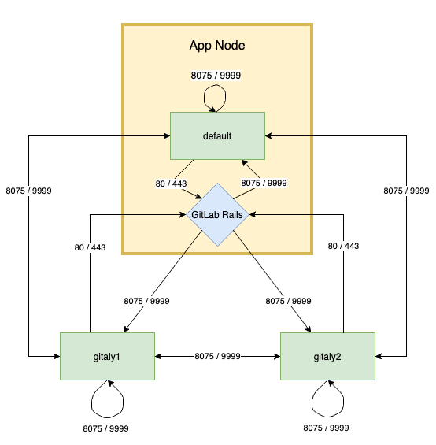



- Tier: 基础版，专业版，旗舰版
- Offering: 私有化部署



配置 Gitaly 有两种方式：





1. 编辑 `/etc/gitlab/gitlab.rb` 并添加或更改 Gitaly 设置。参考
   [Gitaly 配置示例文件](https://jihulab.com/gitlab-cn/gitaly/-/blob/master/config.toml.example)。示例文件中的设置必须转换为 Ruby 格式。
1. 保存文件并 [重新配置极狐GitLab](../restart_gitlab.md#reconfigure-a-linux-package-installation)。





1. 配置 [Gitaly chart](https://gitlab.cn/docs/charts/charts/gitlab/gitaly/)。
1. [升级你的 Helm 发布版本](https://gitlab.cn/docs/charts/installation/deployment/)。





1. 编辑 `/home/git/gitaly/config.toml` 并添加或更改 Gitaly 设置。参考
   [Gitaly 配置示例文件](https://jihulab.com/gitlab-cn/gitaly/-/blob/master/config.toml.example)。
1. 保存文件并 [重启极狐GitLab](../restart_gitlab.md#self-compiled-installations)。





以下配置选项也可用：

- 启用 [TLS 支持](tls_support.md)。
- 限制 [RPC 并发](concurrency_limiting.md#limit-rpc-concurrency)。
- 限制 [pack-objects 并发](concurrency_limiting.md#limit-pack-objects-concurrency)。

<a id="about-the-gitaly-token"></a>

## Gitaly 令牌说明

在整个 Gitaly 文档中提及的令牌仅是一个由管理员选择的任意密码。它与为极狐GitLab API 或其他类似 Web API 创建的令牌无关。

<a id="run-gitaly-on-its-own-server"></a>

## 在独立服务器上运行 Gitaly

默认情况下，Gitaly 与 Gitaly 客户端运行在同一台服务器上，并按照前面的描述进行配置。单服务器安装最适合使用以下默认配置：

- [Linux 安装包](https://gitlab.cn/docs/omnibus/)。
- [自行编译安装](../../install/self_compiled/_index.md)。

但是，可以将 Gitaly 部署到自己的服务器上，这可以使跨多台机器的极狐GitLab 安装受益。

> [!note]
> 当配置为在独立服务器上运行时，必须先 [升级](../../update/package/_index.md) Gitaly 服务器，然后才能升级集群中的 Gitaly 客户端。

在独立服务器上设置 Gitaly 的过程是：

1. [安装 Gitaly](#install-gitaly)。
1. [配置认证](#configure-authentication)。
1. [配置 Gitaly 服务器](#configure-gitaly-servers)。
1. [配置 Gitaly 客户端](#configure-gitaly-clients)。
1. [在不需要的地方禁用 Gitaly](#disable-gitaly-where-not-required-optional)（可选）。

> [!note]
> [磁盘要求](_index.md#disk-requirements) 适用于 Gitaly 节点。

<a id="network-architecture"></a>

### 网络架构

以下列表描述了 Gitaly 的网络架构：

- 极狐GitLab Rails 将仓库分片到 [仓库存储](../repository_storage_paths.md) 中。
- `/config/gitlab.yml` 包含从存储名称到 `(Gitaly 地址, Gitaly 令牌)` 对的映射。
- `/config/gitlab.yml` 中的 `存储名称` -> `(Gitaly 地址, Gitaly 令牌)` 映射是 Gitaly 网络拓扑的唯一事实来源。
- 一个 `(Gitaly 地址, Gitaly 令牌)` 对应一个 Gitaly 服务器。
- 一个 Gitaly 服务器托管一个或多个存储。
- 一个 Gitaly 客户端可以使用一个或多个 Gitaly 服务器。
- Gitaly 地址必须以便所有 Gitaly 客户端都能正确解析的方式进行指定。
- Gitaly 客户端包括：
  - Puma。
  - Sidekiq。
  - 极狐GitLab Workhorse。
  - 极狐GitLab Shell。
  - Elasticsearch 索引器。
  - Gitaly 自身。
- Gitaly 服务器必须能够使用其自身的 `(Gitaly 地址, Gitaly 令牌)` 对（如 `/config/gitlab.yml` 中指定的）向其自身发起 RPC 调用。
- 认证通过一个共享的静态令牌完成，该令牌在 Gitaly 和极狐GitLab Rails 节点之间共享。



> [!warning]
> Gitaly 服务器不得暴露在公网中，因为默认情况下 Gitaly 网络流量未加密。强烈建议使用防火墙来限制对 Gitaly 服务器的访问。另一种选择是 [使用 TLS](tls_support.md)。

在以下部分中，我们描述了如何使用密钥令牌 `abc123secret` 配置两台 Gitaly 服务器：

- `gitaly1.internal`。
- `gitaly2.internal`。

我们假设你的极狐GitLab 安装有三个仓库存储：

- `default`。
- `storage1`。
- `storage2`。

如果需要，你可以使用仅一台服务器和一个仓库存储。

<a id="install-gitaly"></a>

### 安装 Gitaly

在每个 Gitaly 服务器上安装 Gitaly，可以使用以下方式之一：

- Linux 安装包。 [下载并安装](https://gitlab.cn/install/) 你想要的 Linux 安装包，但不要提供 `EXTERNAL_URL=` 值。
- 自行编译安装。 按照 [安装 Gitaly](../../install/self_compiled/_index.md#install-gitaly) 中的步骤操作。

<a id="configure-gitaly-servers"></a>

### 配置 Gitaly 服务器

要配置 Gitaly 服务器，你必须：

- 配置认证。
- 配置存储路径。
- 启用网络监听器。

`git` 用户必须能够在配置的存储路径上读取、写入和设置权限。

为了避免在轮换 Gitaly 令牌期间导致停机，你可以使用 `gitaly['auth_transitioning']` 设置临时禁用认证。有关更多信息，请参阅
[启用认证过渡模式](#enable-auth-transitioning-mode)。

<a id="configure-authentication"></a>

#### 配置认证



- 在极狐GitLab 18.11 中引入了对 `token_file` 的支持。



Gitaly 和极狐GitLab 使用两个共享密钥进行认证：

- _Gitaly 令牌_：用于对 Gitaly 的 gRPC 请求进行身份验证。你可以直接在极狐GitLab 配置中指定 Gitaly 令牌，也可以在令牌文件中指定。使用令牌文件更安全，更适合容器化环境，因为它避免了在启动时将密钥渲染到配置中。令牌文件必须：
  - 仅包含令牌字符串。空白字符会自动修剪。
  - 具有文件权限 `0600` 或 `0400`。
- _极狐GitLab Shell 令牌_：用于从极狐GitLab Shell 到极狐GitLab 内部 API 的身份验证回调。





1. 要配置 _Gitaly 令牌_，编辑 `/etc/gitlab/gitlab.rb`：

   - 使用令牌文件时：

     ```ruby
     gitaly['configuration'] = {
        # ...
        auth: {
          # ...
          token_file: '/etc/gitlab/gitaly_token',
        },
     }
     ```

   - 直接指定令牌时：

     ```ruby
     gitaly['configuration'] = {
        # ...
        auth: {
          # ...
          token: 'abc123secret',
        },
     }
     ```

   `token` 和 `token_file` 互斥。

1. 通过以下两种方式之一配置 _极狐GitLab Shell 令牌_：

   - 方法 1（推荐）：将 `/etc/gitlab/gitlab-secrets.json` 从 Gitaly 客户端复制到 Gitaly 服务器以及任何其他 Gitaly 客户端的相同路径。

   - 方法 2：

     1. 在所有运行极狐GitLab Rails 的节点上，编辑 `/etc/gitlab/gitlab.rb`。
     1. 将 `GITLAB_SHELL_SECRET_TOKEN` 替换为真实的密钥：

        - 极狐GitLab 17.5 及更高版本：

          ```ruby
          gitaly['gitlab_secret'] = 'GITLAB_SHELL_SECRET_TOKEN'
          ```

        - 极狐GitLab 17.4 及更早版本：

          ```ruby
          gitlab_shell['secret_token'] = 'GITLAB_SHELL_SECRET_TOKEN'
          ```

     1. 在所有运行 Gitaly 的节点上，编辑 `/etc/gitlab/gitlab.rb`。
     1. 将 `GITLAB_SHELL_SECRET_TOKEN` 替换为真实的密钥：

        - 极狐GitLab 17.5 及更高版本：

          ```ruby
          gitaly['gitlab_secret'] = 'GITLAB_SHELL_SECRET_TOKEN'
          ```

        - 极狐GitLab 17.4 及更早版本：

          ```ruby
          gitlab_shell['secret_token'] = 'GITLAB_SHELL_SECRET_TOKEN'
          ```

     1. 这些更改后，重新配置极狐GitLab：

     ```shell
     sudo gitlab-ctl reconfigure
     ```





1. 将 `/home/git/gitlab/.gitlab_shell_secret` 从 Gitaly 客户端复制到 Gitaly 服务器（以及任何其他 Gitaly 客户端）的相同路径。
1. 在 Gitaly 客户端上，编辑 `/home/git/gitlab/config/gitlab.yml`：

   ```yaml
   gitlab:
     gitaly:
       token: 'abc123secret'
   ```

1. 保存文件并 [重启极狐GitLab](../restart_gitlab.md#self-compiled-installations)。
1. 在 Gitaly 服务器上，编辑 `/home/git/gitaly/config.toml`：

   - 使用令牌文件时：

     ```toml
     [auth]
     token_file = '/etc/gitaly/token'
     ```

   - 直接指定令牌时：

     ```toml
     [auth]
     token = 'abc123secret'
     ```

   `token` 和 `token_file` 互斥。

1. 保存文件并 [重启极狐GitLab](../restart_gitlab.md#self-compiled-installations)。





<a id="configure-gitaly-server"></a>

#### 配置 Gitaly 服务端

<!--
Updates to example must be made at:

- <https://jihulab.com/gitlab-cn/charts/gitlab/blob/master/doc/advanced/external-gitaly/external-omnibus-gitaly.md#configure-linux-package-installation>
- <https://jihulab.com/gitlab-cn/gitlab/-/blob/master/doc/administration/gitaly/praefect/configure.md#praefect>
- All reference architecture pages
-->

配置 Gitaly 服务端。

Gitaly 有一些 RPC，其中它会使用客户端（例如 Rails 或 Sidekiq）提供的地址向自己发起网络调用。

如果因为你的网络配置导致 Gitaly 无法以这种方式访问自身（例如，Gitaly 位于不支持发夹连接的负载均衡器后面）：

1. 编辑 Gitaly 服务器的 `/etc/hosts` 文件。
1. 添加一个条目，将客户端使用的 Gitaly 地址重定向到 Gitaly 服务器自身的 IP 地址。例如，`127.0.0.1 gitaly.example.com` 或 `<local-ip> gitaly.example.com`。





1. 编辑 `/etc/gitlab/gitlab.rb`：

   ```ruby
   # 避免在 Gitaly 服务器上运行不必要的服务
   postgresql['enable'] = false
   redis['enable'] = false
   nginx['enable'] = false
   puma['enable'] = false
   sidekiq['enable'] = false
   gitlab_workhorse['enable'] = false
   gitlab_exporter['enable'] = false
   gitlab_kas['enable'] = false

   # 如果你运行单独的监控节点，可以禁用这些服务
   prometheus['enable'] = false
   alertmanager['enable'] = false

   # 如果不运行单独的监控节点，可以启用 Prometheus 访问并禁用这些额外服务。
   # 这使得 Prometheus 监听所有接口。你必须使用防火墙来限制对该地址/端口的访问。
   # prometheus['listen_address'] = '0.0.0.0:9090'
   # prometheus['monitor_kubernetes'] = false

   # 如果你不想运行监控服务，取消注释以下内容（不推荐）
   # node_exporter['enable'] = false

   # 在 'gitlab-ctl reconfigure' 期间阻止数据库连接
   gitlab_rails['auto_migrate'] = false

   # 配置 gitlab-shell API 回调 URL。没有这个，`git push` 将失败。
   # 这可以是你的前端极狐GitLab URL 或内部负载均衡器。
   # 不要忘记将 `/etc/gitlab/gitlab-secrets.json` 从 Gitaly 客户端复制到 Gitaly 服务器。
   gitlab_rails['internal_api_url'] = 'https://gitlab.example.com'

   gitaly['configuration'] = {
      # ...
      #
      # 让 Gitaly 接受所有网络接口上的连接。你必须使用防火墙来限制对该地址/端口的访问。
      # 如果你只想支持 TLS 连接，注释掉下面这行
      listen_addr: '0.0.0.0:8075',
      auth: {
        # ...
        #
        # 用于确保只有经过授权的服务器可以与 Gitaly 服务器通信的认证令牌
        token: 'AUTH_TOKEN',
      },
   }
   ```

1. 为每个 Gitaly 服务器在 `/etc/gitlab/gitlab.rb` 中添加以下内容：

   <!-- Updates to following example must also be made at <https://jihulab.com/gitlab-cn/charts/gitlab/blob/master/doc/advanced/external-gitaly/external-omnibus-gitaly.md#configure-linux-package-installation> -->

   在 `gitaly1.internal` 上：

   ```ruby
   gitaly['configuration'] = {
      # ...
      storage: [
         {
            name: 'default',
            path: '/var/opt/gitlab/git-data/repositories',
         },
         {
            name: 'storage1',
            path: '/mnt/gitlab/git-data/repositories',
         },
      ],
   }
   ```

   在 `gitaly2.internal` 上：

   ```ruby
   gitaly['configuration'] = {
      # ...
      storage: [
         {
            name: 'storage2',
            path: '/srv/gitlab/git-data/repositories',
         },
      ],
   }
   ```

1. 保存文件并 [重新配置极狐GitLab](../restart_gitlab.md#reconfigure-a-linux-package-installation)。
1. 确认 Gitaly 能够向极狐GitLab 内部 API 执行回调：

   ```shell
   sudo -u git -- /opt/gitlab/embedded/bin/gitaly check /var/opt/gitlab/gitaly/config.toml
   ```





1. 编辑 `/home/git/gitaly/config.toml`：

   ```toml
   listen_addr = '0.0.0.0:8075'

   runtime_dir = '/var/opt/gitlab/gitaly'

   [logging]
   format = 'json'
   level = 'info'
   dir = '/var/log/gitaly'
   ```

1. 为每个 Gitaly 服务器在 `/home/git/gitaly/config.toml` 中添加以下内容：

   在 `gitaly1.internal` 上：

   ```toml
   [[storage]]
   name = 'default'
   path = '/var/opt/gitlab/git-data/repositories'

   [[storage]]
   name = 'storage1'
   path = '/mnt/gitlab/git-data/repositories'
   ```

   在 `gitaly2.internal` 上：

   ```toml
   [[storage]]
   name = 'storage2'
   path = '/srv/gitlab/git-data/repositories'
   ```

1. 编辑 `/home/git/gitlab-shell/config.yml`：

   ```yaml
   gitlab_url: https://gitlab.example.com
   ```

1. 保存文件并 [重启极狐GitLab](../restart_gitlab.md#self-compiled-installations)。
1. 确认 Gitaly 能够向极狐GitLab 内部 API 执行回调：

   ```shell
   sudo -u git -- /opt/gitlab/embedded/bin/gitaly check /var/opt/gitlab/gitaly/config.toml
   ```





> [!warning]
> 如果直接将仓库数据从极狐GitLab 服务器复制到 Gitaly，请确保元数据文件（默认路径 `/var/opt/gitlab/git-data/repositories/.gitaly-metadata`）不包含在传输中。
> 复制此文件会导致极狐GitLab 使用直接磁盘访问来访问托管在 Gitaly 服务器上的仓库，从而导致 `Error creating pipeline` 和 `Commit not found` 错误，或数据过时。

<a id="configure-gitaly-clients"></a>

### 配置 Gitaly 客户端

作为最后一步，你必须更新 Gitaly 客户端，使其从使用本地 Gitaly 服务切换到使用你刚刚配置的 Gitaly 服务器。

> [!note]
> 极狐GitLab 要求配置一个 `default` 仓库存储。
> [阅读有关此限制的更多信息](#极狐gitlab-requires-a-default-repository-storage)。

这可能有风险，因为任何阻止 Gitaly 客户端访问 Gitaly 服务器的情况都会导致所有 Gitaly 请求失败。例如，任何类型的网络、防火墙或名称解析问题。

Gitaly 做出以下假设：

- 你的 `gitaly1.internal` Gitaly 服务器可以从你的 Gitaly 客户端通过 `gitaly1.internal:8075` 访问，并且该 Gitaly 服务器可以在 `/var/opt/gitlab/git-data` 和 `/mnt/gitlab/git-data` 上读取、写入和设置权限。
- 你的 `gitaly2.internal` Gitaly 服务器可以从你的 Gitaly 客户端通过 `gitaly2.internal:8075` 访问，并且该 Gitaly 服务器可以在 `/srv/gitlab/git-data` 上读取、写入和设置权限。
- 你的 `gitaly1.internal` 和 `gitaly2.internal` Gitaly 服务器可以相互访问。

你不能定义一些作为本地 Gitaly 服务器（没有 `gitaly_address`）而另一些作为远程服务器（有 `gitaly_address`）的 Gitaly 服务器，除非你使用 [混合配置](#mixed-configuration)。

配置 Gitaly 客户端有两种方式。这些说明适用于未加密的连接，但你也可以启用 [TLS 支持](tls_support.md)：





1. 编辑 `/etc/gitlab/gitlab.rb`：

   ```ruby
   # 使用在所有 Gitaly 服务器上配置的相同令牌值
   gitlab_rails['gitaly_token'] = '<AUTH_TOKEN>'

   gitlab_rails['repositories_storages'] = {
     'default'  => { 'gitaly_address' => 'tcp://gitaly1.internal:8075' },
     'storage1' => { 'gitaly_address' => 'tcp://gitaly1.internal:8075' },
     'storage2' => { 'gitaly_address' => 'tcp://gitaly2.internal:8075' },
   }
   ```

   或者，如果每个 Gitaly 服务器配置了不同的认证令牌：

   ```ruby
   gitlab_rails['repositories_storages'] = {
     'default'  => { 'gitaly_address' => 'tcp://gitaly1.internal:8075', 'gitaly_token' => '<AUTH_TOKEN_1>' },
     'storage1' => { 'gitaly_address' => 'tcp://gitaly1.internal:8075', 'gitaly_token' => '<AUTH_TOKEN_1>' },
     'storage2' => { 'gitaly_address' => 'tcp://gitaly2.internal:8075', 'gitaly_token' => '<AUTH_TOKEN_2>' },
   }
   ```

1. 保存文件并 [重新配置极狐GitLab](../restart_gitlab.md#reconfigure-a-linux-package-installation)。
1. 在 Gitaly 客户端（例如，Rails 应用程序）上运行 `sudo gitlab-rake gitlab:gitaly:check` 以确认其可以连接到 Gitaly 服务器。
1. 跟踪日志以查看请求：

   ```shell
   sudo gitlab-ctl tail gitaly
   ```





1. 编辑 `/home/git/gitlab/config/gitlab.yml`：

   ```yaml
   gitlab:
     repositories:
       storages:
         default:
           gitaly_address: tcp://gitaly1.internal:8075
           gitaly_token: AUTH_TOKEN_1
         storage1:
           gitaly_address: tcp://gitaly1.internal:8075
           gitaly_token: AUTH_TOKEN_1
         storage2:
           gitaly_address: tcp://gitaly2.internal:8075
           gitaly_token: AUTH_TOKEN_2
   ```

1. 保存文件并 [重启极狐GitLab](../restart_gitlab.md#self-compiled-installations)。
1. 运行 `sudo -u git -H bundle exec rake gitlab:gitaly:check RAILS_ENV=production` 以确认 Gitaly 客户端可以连接到 Gitaly 服务器。
1. 跟踪日志以查看请求：

   ```shell
   tail -f /home/git/gitlab/log/gitaly.log
   ```





当你在 Gitaly 服务器上跟踪 Gitaly 日志时，你应该会看到请求传入。一种确保触发 Gitaly 请求的方法是，通过 HTTP 或 HTTPS 从极狐GitLab 克隆仓库。

> [!warning]
> 如果你配置了 [服务器钩子](../server_hooks.md)，无论是针对每个仓库还是全局的，你必须将它们移动到 Gitaly 服务器上。如果你有多个 Gitaly 服务器，请将你的服务器钩子复制到所有 Gitaly 服务器。

<a id="mixed-configuration"></a>

#### 混合配置

极狐GitLab 可以与多个 Gitaly 服务器之一位于同一台服务器上，但不支持混合本地和远程配置的设置。以下设置是不正确的，因为：

- 所有地址必须能从其他 Gitaly 服务器访问。
- `storage1` 为 `gitaly_address` 分配了一个 Unix 套接字，这对于某些 Gitaly 服务器是无效的。

```ruby
gitlab_rails['repositories_storages'] = {
  'default' => { 'gitaly_address' => 'tcp://gitaly1.internal:8075' },
  'storage1' => { 'gitaly_address' => 'unix:/var/opt/gitlab/gitaly/gitaly.socket' },
  'storage2' => { 'gitaly_address' => 'tcp://gitaly2.internal:8075' },
}
```

要结合本地和远程 Gitaly 服务器，请为本地 Gitaly 服务器使用外部地址。例如：

```ruby
gitlab_rails['repositories_storages'] = {
  'default' => { 'gitaly_address' => 'tcp://gitaly1.internal:8075' },
  # 也运行 Gitaly 的极狐GitLab 服务器地址
  'storage1' => { 'gitaly_address' => 'tcp://gitlab.internal:8075' },
  'storage2' => { 'gitaly_address' => 'tcp://gitaly2.internal:8075' },
}

gitaly['configuration'] = {
  # ...
  #
  # 让 Gitaly 接受所有网络接口上的连接
  listen_addr: '0.0.0.0:8075',
  # 或者用于 TLS
  tls_listen_addr: '0.0.0.0:9999',
  tls: {
    certificate_path:  '/etc/gitlab/ssl/cert.pem',
    key_path: '/etc/gitlab/ssl/key.pem',
  },
  storage: [
    {
      name: 'storage1',
      path: '/mnt/gitlab/git-data/repositories',
    },
  ],
}
```

`path` 只能包含在本地 Gitaly 服务器的存储分片上。如果省略它，则默认的 Git 存储目录将用于该存储分片。

<a id="gitlab-requires-a-default-repository-storage"></a>

### 极狐GitLab 需要一个默认仓库存储

在将 Gitaly 服务器添加到环境时，你可能想要替换原始的 `default` Gitaly 服务。但是，你无法重新配置极狐GitLab 应用服务器来移除 `default` 存储，因为极狐GitLab 需要一个名为 `default` 的存储。
[阅读更多](https://gitlab.com/gitlab-org/gitlab/-/issues/36175) 关于此限制。

要解决此限制：

1. 在新的 Gitaly 服务上定义一个额外的存储位置，并将该额外存储配置为 `default`。该存储位置必须有一个正在运行且可用的 Gitaly 服务，以避免出现期望工作存储的数据库迁移问题。
1. 在 [**管理员** 区域](../repository_storage_paths.md#configure-where-new-repositories-are-stored) 中，将 `default` 的权重设置为零，以防止仓库存储在那里。

<a id="disable-gitaly-where-not-required-optional"></a>

### 在不需要的地方禁用 Gitaly（可选）

如果你将 Gitaly [作为远程服务运行](#在独立服务器上运行-gitaly)，请考虑禁用默认在你的极狐GitLab 服务器上运行的本地 Gitaly 服务，并仅在需要时运行它。

仅在极狐GitLab 实例运行于自定义集群配置中，且 Gitaly 在与极狐GitLab 实例分离的机器上运行时，禁用极狐GitLab 实例上的 Gitaly 才有意义。禁用集群中所有机器上的 Gitaly 不是有效的配置（某些机器必须充当 Gitaly 服务器）。

通过以下两种方式之一在极狐GitLab 服务器上禁用 Gitaly：





1. 编辑 `/etc/gitlab/gitlab.rb`：

   ```ruby
   gitaly['enable'] = false
   ```

1. 保存文件并 [重新配置极狐GitLab](../restart_gitlab.md#reconfigure-a-linux-package-installation)。





1. 编辑 `/etc/default/gitlab`：

   ```shell
   gitaly_enabled=false
   ```

1. 保存文件并 [重启极狐GitLab](../restart_gitlab.md#self-compiled-installations)。





<a id="change-the-gitaly-listening-interface"></a>

## 更改 Gitaly 监听接口

你可以更改 Gitaly 监听的接口。当你有需要与 Gitaly 通信的外部服务时，你可能会更改监听接口。例如，
启用精确代码搜索但实际服务运行在另一台服务器上时使用的 [精确代码搜索](../../integration/zoekt/_index.md) Zoekt。

`gitaly_token` 必须是一个密钥字符串，因为 `gitaly_token` 用于与 Gitaly 服务进行认证。
此密钥可以使用 `openssl rand -base64 24` 生成，生成一个 32 字符的随机字符串。

例如，将 Gitaly 监听接口更改为 `0.0.0.0:8075`：

```ruby
# /etc/gitlab/gitlab.rb
# 为 Gitaly 认证添加共享令牌
gitlab_shell['secret_token'] = 'your_secure_token_here'
gitlab_rails['gitaly_token'] = 'your_secure_token_here'

# Gitaly 配置
gitaly['gitlab_secret'] = 'your_secure_token_here'
gitaly['configuration'] = {
  listen_addr: '0.0.0.0:8075',
  auth: {
    token: 'your_secure_token_here',
  },
  storage: [
    {
      name: 'default',
      path: '/var/opt/gitlab/git-data/repositories',
    },
  ]
}

# 告诉 Rails 在哪里找到 Gitaly
gitlab_rails['repositories_storages'] = {
  'default' => { 'gitaly_address' => 'tcp://ip_address_here:8075' },
}

# 内部 API URL（对于多服务器设置很重要）
gitlab_rails['internal_api_url'] = 'http://ip_address_here'
```

<a id="control-groups"></a>

## 控制组

有关控制组的信息，请参阅 [Cgroups](cgroups.md)。

<a id="background-repository-optimization"></a>

## 后台仓库优化

随着时间的推移，Git 仓库的对象数据库中存储数据的方式可能会变得低效，从而减慢 Git 操作。你可以安排 Gitaly 每天运行一个具有最大持续时间的后台任务，以清理这些项目并提高性能。

> [!warning]
> 后台仓库优化在运行时可能会给主机带来显著负载。
> 确保将此任务安排在非高峰时段，并保持持续时间较短（例如，30-60 分钟）。

配置后台仓库优化有两种方式：





编辑 `/etc/gitlab/gitlab.rb` 并添加：

```ruby
gitaly['configuration'] = {
  # ...
  daily_maintenance: {
    # ...
    start_hour: 4,
    start_minute: 30,
    duration: '30m',
    storages: ['default'],
  },
}
```






编辑 `/home/git/gitaly/config.toml` 并添加：

```toml
[daily_maintenance]
start_hour = 4
start_minute = 30
duration = '30m'
storages = ["default"]
```





<a id="rotate-gitaly-authentication-token"></a>

## 轮换 Gitaly 认证令牌

在生产环境中轮换凭证通常需要停机，或导致服务中断，或两者兼有。

不过，你可以在不造成服务中断的情况下轮换 Gitaly 凭证。轮换 Gitaly 认证令牌包括以下步骤：

- [验证认证监控](#verify-authentication-monitoring)。
- [启用认证过渡模式](#enable-auth-transitioning-mode)。
- [更新 Gitaly 认证令牌](#update-gitaly-authentication-token)。
- [确保没有认证失败](#ensure-there-are-no-authentication-failures)。
- [禁用认证过渡模式](#disable-auth-transitioning-mode)。
- [验证认证已强制执行](#verify-authentication-is-enforced)。

如果你在单台服务器上运行极狐GitLab，此过程同样适用。此时 Gitaly 服务器和 Gitaly 客户端指向同一台机器。

<a id="verify-authentication-monitoring"></a>

### 验证认证监控

在轮换 Gitaly 认证令牌前，请验证你能够使用 Prometheus [监控认证行为](monitoring.md#queries)的极狐GitLab 安装。

然后可以继续执行后续步骤。

<a id="enable-auth-transitioning-mode"></a>

### 启用认证过渡模式

通过在 Gitaly 服务器上开启认证过渡模式，暂时禁用 Gitaly 认证，如下所示：

```ruby
# 在 /etc/gitlab/gitlab.rb 中
gitaly['configuration'] = {
  # ...
  auth: {
    # ...
    transitioning: true,
  },
}
```

完成此更改后，你的 [Prometheus 查询](#verify-authentication-monitoring)应返回类似以下内容：

```promql
{enforced="false",status="would be ok"}  4424.985419441742
```

由于 `enforced="false"`，可以安全地开始推出新令牌。

<a id="update-gitaly-authentication-token"></a>

### 更新 Gitaly 认证令牌

要更新为新 Gitaly 认证令牌，请在每台 Gitaly 客户端和 Gitaly 服务器上执行以下操作：

1. 更新配置：

   ```ruby
   # 在 /etc/gitlab/gitlab.rb 中
   gitaly['configuration'] = {
      # ...
      auth: {
         # ...
         token: '<新密钥令牌>',
      },
   }
   ```

   如果你使用的是 `token_file`，请使用新令牌更新所引用文件的内容。无需更改配置。令牌文件在启动时读取。

1. 重启 Gitaly：

   ```shell
   gitlab-ctl restart gitaly
   ```

如果在推出此更改时运行 [Prometheus 查询](#verify-authentication-monitoring)，将看到 `enforced="false",status="denied"` 计数器的非零值。

<a id="ensure-there-are-no-authentication-failures"></a>

### 确保没有认证失败

新令牌设置完毕并且所有相关服务重启后，你将[暂时看到](#verify-authentication-monitoring)以下结果的混合：

- `status="would be ok"`。
- `status="denied"`。

当所有 Gitaly 客户端和 Gitaly 服务器都拾取新令牌后，唯一的非零速率应为 `enforced="false",status="would be ok"`。

<a id="disable-auth-transitioning-mode"></a>

### 禁用认证过渡模式

要重新启用 Gitaly 认证，请禁用认证过渡模式。按如下方式更新 Gitaly 服务器上的配置：

```ruby
# 在 /etc/gitlab/gitlab.rb 中
gitaly['configuration'] = {
  # ...
  auth: {
    # ...
    transitioning: false,
  },
}
```

> [!warning]
> 若不完成此步骤，你将没有 Gitaly 认证。

<a id="verify-authentication-is-enforced"></a>

### 验证认证已强制执行

刷新你的 [Prometheus 查询](#verify-authentication-monitoring)。现在你应该看到与开始时类似的结果。例如：

```promql
{enforced="true",status="ok"}  4424.985419441742
```

`enforced="true"` 表示认证正在强制执行。

<a id="pack-objects-cache"></a>

## Pack-objects 缓存



- Tier: 基础版，专业版，旗舰版
- Offering: 私有化部署



[Gitaly](_index.md) 是为 Git 仓库提供存储的服务，可配置为缓存 Git fetch 响应的短期滚动窗口。当服务器收到大量 CI fetch 流量时，这可以降低服务器负载。

Pack-objects 缓存包装了 `git pack-objects`，这是 Git 内部的一部分，通过使用 PostUploadPack 和 SSHUploadPack Gitaly RPC 间接调用。当用户通过 HTTP 执行 Git fetch 时 Gitaly 运行 PostUploadPack，当用户通过 SSH 执行 Git fetch 时运行 SSHUploadPack。
启用缓存后，任何使用 PostUploadPack 或 SSHUploadPack 的操作都可以从中受益。它独立于且不受以下因素影响：

- 传输方式（HTTP 或 SSH）。
- Git 协议版本（v0 或 v2）。
- fetch 类型，如完整克隆、增量 fetch、浅克隆或部分克隆。

此缓存的优势在于能够对并发的相同 fetch 进行去重。它：

- 可使运行 CI/CD 流水线且具有多个并发作业的极狐GitLab 实例受益。应能明显降低服务器 CPU 使用率。
- 对唯一的 fetch 没有任何帮助。例如，如果你执行抽查将仓库克隆到本地计算机，则不太可能从此缓存中受益，因为你的 fetch 很可能是唯一的。

Pack-objects 缓存是本地缓存。它：

- 将其元数据存储在启用它的 Gitaly 进程的内存中。
- 将实际 Git 数据缓存文件存储在本地存储上。

使用本地文件的优势在于操作系统可能会自动将部分 pack-objects 缓存文件保留在内存中，使其更快。

由于 pack-objects 缓存可能导致磁盘写入 IO 显著增加，因此默认处于关闭状态。

<a id="configure-the-cache"></a>

### 配置缓存

以下配置项可用于 pack-objects 缓存。每项设置将在下文详细讨论。

| 设置 | 默认值 | 描述 |
|:----------|:---------------------------------------------------|:---------------------------------------------------------------------------------------------------|
| `enabled` | `false` | 启用缓存。关闭时，Gitaly 为每个请求运行专用的 `git pack-objects` 进程。 |
| `dir` | `<第一个存储的路径>/+gitaly/PackObjectsCache` | 存储缓存文件的本地目录。 |
| `max_age` | `5m`（5 分钟） | 早于此时间的缓存条目将被逐出并从磁盘删除。 |
| `min_occurrences` | 1 | 创建缓存条目前某个键必须出现的最小次数。 |

在 `/etc/gitlab/gitlab.rb` 中设置：

```ruby
gitaly['configuration'] = {
  # ...
  pack_objects_cache: {
    enabled: true,
    # “dir”、“max_age”和“min_occurences”的默认设置应该可以满足要求。
    # 如果你想自定义这些设置，请参阅下面的详细信息。
  },
}
```

<a id="enabled-defaults-to-false"></a>

#### `enabled` 默认值为 `false`

默认情况下缓存处于禁用状态，因为在某些情况下，它可能导致写入磁盘的字节数[极度增加](https://gitlab.com/gitlab-com/gl-infra/production/-/issues/4010#note_534564684)。在 JihuLab.com 上，我们已经验证仓库存储磁盘可以承受这种额外工作负载，但我们认为不能假定所有地方都是如此。

<a id="cache-storage-directory-dir"></a>

#### 缓存存储目录 `dir`

缓存需要一个目录来存储其文件。此目录应：

- 位于具有足够空间的文件系统上。如果缓存文件系统空间用尽，所有 fetch 将开始失败。
- 位于具有足够 IO 带宽的磁盘上。如果缓存磁盘 IO 带宽用尽，所有 fetch，甚至整个服务器都将变慢。

> [!warning]
> 指定目录中的所有现有数据将被删除。
> 请小心不要使用包含现有数据的目录。

默认情况下，缓存存储目录设置为配置文件中定义的第一个 Gitaly 存储的子目录。

多个 Gitaly 进程可以使用同一目录进行缓存存储。每个 Gitaly 进程使用唯一的随机字符串作为其所创建缓存文件名的一部分。这意味着：

- 它们不会冲突。
- 它们不会重用另一个进程的文件。

虽然默认目录将缓存文件放在与仓库数据相同的文件系统中，但这不是必须的。如果你的基础设施需要，你可以将缓存文件放在不同的文件系统上。

磁盘所需的 IO 带宽量取决于：

- Gitaly 服务器上仓库的大小和形状。
- 用户生成的流量类型。

你可以使用 `gitaly_pack_objects_generated_bytes_total` 指标作为悲观估计，假定缓存命中率为 0%。

所需空间量取决于：

- 用户从缓存中拉取的每秒字节数。
- `max_age` 缓存逐出窗口的大小。

如果你的用户拉取 100 MB/s，并且你使用 5 分钟的窗口，那么平均而言缓存目录中将有 `5*60*100 MB = 30 GB` 的数据。此平均值为预期平均值，而非保证值。峰值大小可能超过此平均值。

<a id="cache-eviction-window-max_age"></a>

#### 缓存逐出窗口 `max_age`

`max_age` 配置设置允许你控制缓存命中的几率和缓存文件使用的平均存储量。早于 `max_age` 的条目将从磁盘删除。

逐出不会干扰正在进行的请求。将 `max_age` 设置为小于通过慢速连接执行 fetch 所需的时间是可以的，因为 Unix 文件系统在读取已删除文件的所有进程关闭该文件之前不会真正删除它。

<a id="minimum-key-occurrences-min_occurrences"></a>

#### 最小键出现次数 `min_occurrences`

`min_occurrences` 设置控制创建新缓存条目之前相同请求必须出现的频率。默认值为 `1`，这意味着唯一的请求不会被写入缓存。

如果你：

- 增大此数字，缓存命中率会降低，缓存使用的磁盘空间更少。
- 减小此数字，缓存命中率会提高，缓存使用的磁盘空间更多。

你应该将 `min_occurrences` 设置为 `1`。在 JihuLab.com 上，从 0 调整为 1 为我们节省了 50% 的缓存磁盘空间，同时几乎没有影响缓存命中率。

<a id="observe-the-cache"></a>

### 观察缓存



- 在极狐GitLab 16.0 中，pack-objects 缓存的日志已[更改](https://gitlab.com/gitlab-org/gitaly/-/merge_requests/5719)。



你可以使用 Prometheus 指标和日志字段观察缓存。

<a id="prometheus-metrics"></a>

#### Prometheus 指标

Gitaly 导出以下 Prometheus 指标用于监控 pack-objects 缓存：

| 指标 | 类型 | 描述 |
|:-------|:-----|:------------|
| `gitaly_pack_objects_served_bytes_total` | Counter | 提供给客户端的 `git-pack-objects` 数据的总字节数 |
| `gitaly_pack_objects_cache_lookups_total` | Counter | 缓存查找次数，带有 `result` 标签指示 `hit` 或 `miss` |
| `gitaly_pack_objects_generated_bytes_total` | Counter | 运行 `git-pack-objects` 生成的总字节数 |

**Prometheus 查询示例：**

缓存命中率：

```promql
sum(rate(gitaly_pack_objects_cache_lookups_total{result="hit"}[5m])) /
sum(rate(gitaly_pack_objects_cache_lookups_total[5m]))
```

每秒从缓存提供的字节数：

```promql
rate(gitaly_pack_objects_served_bytes_total[5m])
```

每秒生成的字节数（缓存未命中）：

```promql
rate(gitaly_pack_objects_generated_bytes_total[5m])
```

缓存效率（提供字节与生成字节之比）：

```promql
rate(gitaly_pack_objects_served_bytes_total[5m]) /
rate(gitaly_pack_objects_generated_bytes_total[5m])
```

<a id="log-fields"></a>

#### 日志字段

这些日志是 gRPC 日志的一部分，可在调用执行时被发现。

| 字段 | 描述 |
|:---|:---|
| `pack_objects_cache.hit` | 指示当前 pack-objects 缓存是否命中（`true` 或 `false`） |
| `pack_objects_cache.key` | 用于 pack-objects 缓存的缓存键 |
| `pack_objects_cache.generated_bytes` | 正在写入的新缓存的大小（以字节为单位） |
| `pack_objects_cache.served_bytes` | 正在提供的缓存的大小（以字节为单位） |
| `pack_objects.compression_statistics` | 有关 pack-objects 生成的统计信息 |
| `pack_objects.enumerate_objects_ms` | 枚举客户端发送的对象所花费的总时间（毫秒） |
| `pack_objects.prepare_pack_ms` | 在将 packfile 发送回客户端之前准备它所花费的总时间（毫秒） |
| `pack_objects.write_pack_file_ms` | 将 packfile 发送回客户端所花费的总时间（毫秒）。高度依赖于客户端的互联网连接 |
| `pack_objects.written_object_count` | Gitaly 发送回客户端的总对象数 |

在以下情况下：

- 缓存未命中，Gitaly 会同时记录 `pack_objects_cache.generated_bytes` 和 `pack_objects_cache.served_bytes` 消息。Gitaly 还会记录一些更详细的 pack-object 生成统计信息。
- 缓存命中，Gitaly 仅记录 `pack_objects_cache.served_bytes` 消息。

示例：

```json
{
  "bytes":26186490,
  "correlation_id":"01F1MY8JXC3FZN14JBG1H42G9F",
  "grpc.meta.deadline_type":"none",
  "grpc.method":"PackObjectsHook",
  "grpc.request.fullMethod":"/gitaly.HookService/PackObjectsHook",
  "grpc.request.glProjectPath":"root/gitlab-workhorse",
  "grpc.request.glRepository":"project-2",
  "grpc.request.repoPath":"@hashed/d4/73/d4735e3a265e16eee03f59718b9b5d03019c07d8b6c51f90da3a666eec13ab35.git",
  "grpc.request.repoStorage":"default",
  "grpc.request.topLevelGroup":"@hashed",
  "grpc.service":"gitaly.HookService",
  "grpc.start_time":"2021-03-25T14:57:52.747Z",
  "level":"info",
  "msg":"finished unary call with code OK",
  "peer.address":"@",
  "pid":20961,
  "span.kind":"server",
  "system":"grpc",
  "time":"2021-03-25T14:57:53.543Z",
  "pack_objects.compression_statistics": "Total 145991 (delta 68), reused 6 (delta 2), pack-reused 145911",
  "pack_objects.enumerate_objects_ms": 170,
  "pack_objects.prepare_pack_ms": 7,
  "pack_objects.write_pack_file_ms": 786,
  "pack_objects.written_object_count": 145991,
  "pack_objects_cache.generated_bytes": 49533030,
  "pack_objects_cache.hit": "false",
  "pack_objects_cache.key": "123456789",
  "pack_objects_cache.served_bytes": 49533030,
  "peer.address": "127.0.0.1",
  "pid": 8813,
}
```

<a id="cat-file-cache"></a>

## `cat-file` 缓存

许多 Gitaly RPC 需要从仓库查找 Git 对象。大多数时候，我们使用 `git cat-file --batch` 进程来处理。为了获得更好的性能，Gitaly 可以跨 RPC 调用重用这些 `git cat-file` 进程。之前使用过的进程会保留在 [`git cat-file` 缓存](https://about.gitlab.com/blog/git-performance-on-nfs/#enter-cat-file-cache)中。为了控制其占用的系统资源，我们设置了可以进入缓存的 cat-file 进程的最大数量。

默认限制是 100 个 `cat-file`，它们构成一对 `git cat-file --batch` 和 `git cat-file --batch-check` 进程。如果你看到“打开文件过多”的错误或无法创建新进程，可能需要降低此限制。

理想情况下，该数值应大到足以处理标准流量。如果提高限制，应测量更改前后的缓存命中率。如果命中率未改善，则更高的限制可能没有显著效果。以下是查看命中率的 Prometheus 查询示例：

```plaintext
sum(rate(gitaly_catfile_cache_total{type="hit"}[5m])) / sum(rate(gitaly_catfile_cache_total{type=~"(hit)|(miss)"}[5m]))
```

在 Gitaly 配置文件中配置 `cat-file` 缓存。

<a id="configure-commit-signing-for-gitlab-ui-commits"></a>

## 为极狐GitLab UI 提交配置签名



- 为已签名的极狐GitLab UI 提交显示 **已验证** 徽章于极狐GitLab 16.3 引入，带有一个功能标志 `gitaly_gpg_signing`，默认禁用。
- 在极狐GitLab 16.3 中，在 `rotated_signing_keys` 选项中指定多个密钥来验证签名。
- 在极狐GitLab 私有化部署 17.0 中默认启用。



> [!flag]
> 在私有化部署的极狐GitLab 上，默认此功能可用。要隐藏该功能，管理员可以[禁用功能标志](../feature_flags/_index.md) `gitaly_gpg_signing`。
> 在 JihuLab.com 上，此功能不可用。

默认情况下，Gitaly 不对通过极狐GitLab UI 进行的提交签名。例如，使用以下方式进行的提交：

- Web 编辑器。
- Web IDE。
- 合并请求。

在 Gitaly 中启用提交签名后：

- 极狐GitLab 对所有通过 UI 进行的提交进行签名。
- 签名验证提交者的身份，而非作者的身份。
- 你可以通过设置 `committer_email` 和 `committer_name` 来配置 Gitaly 以反映提交是由你的实例提交的。例如，在 JihuLab.com 上，这些配置选项分别设置为 `noreply@gitlab.com` 和 `GitLab`。

`rotated_signing_keys` 是仅用于验证的密钥列表。Gitaly 尝试使用配置的 `signing_key` 验证 Web 提交，然后逐个使用轮换密钥直到成功。在以下情况下设置 `rotated_signing_keys` 选项：

- 签名密钥轮换时。
- 你想指定多个密钥以从其他实例迁移项目，并希望将其 Web 提交显示为 **已验证**。

通过以下两种方式之一配置 Gitaly 以对极狐GitLab UI 的提交进行签名：





1. [创建 GPG 密钥](../../user/project/repository/signed_commits/gpg.md#create-a-gpg-key)并导出，或[创建 SSH 密钥](../../user/ssh.md#generate-an-ssh-key-pair)。为获得最佳性能，请使用 EdDSA 密钥。

   导出 GPG 密钥：

   ```shell
   gpg --export-secret-keys <ID> > signing_key.gpg
   ```

   或创建 SSH 密钥（无密码）：

   ```shell
   ssh-keygen -t ed25519 -f signing_key.ssh
   ```

1. 在 Gitaly 节点上，将密钥复制到 `/etc/gitlab/gitaly/` 并确保 `git` 用户有读取文件的权限。
1. 编辑 `/etc/gitlab/gitlab.rb` 并配置 `gitaly['git']['signing_key']`：

   ```ruby
   gitaly['configuration'] = {
      # ...
      git: {
        # ...
        committer_name: 'Your Instance',
        committer_email: 'noreply@yourinstance.com',
        signing_key: '/etc/gitlab/gitaly/signing_key.gpg',
        rotated_signing_keys: ['/etc/gitlab/gitaly/previous_signing_key.gpg'],
        # ...
      },
   }
   ```

1. 保存文件并[重新配置极狐GitLab](../restart_gitlab.md#reconfigure-a-linux-package-installation)。





1. [创建 GPG 密钥](../../user/project/repository/signed_commits/gpg.md#create-a-gpg-key)并导出，或[创建 SSH 密钥](../../user/ssh.md#generate-an-ssh-key-pair)。为获得最佳性能，请使用 EdDSA 密钥。

   导出 GPG 密钥：

   ```shell
   gpg --export-secret-keys <ID> > signing_key.gpg
   ```

   或创建 SSH 密钥（无密码）：

   ```shell
   ssh-keygen -t ed25519 -f signing_key.ssh
   ```

1. 在 Gitaly 节点上，将密钥复制到 `/etc/gitlab`。
1. 编辑 `/home/git/gitaly/config.toml` 并配置 `signing_key`：

   ```toml
   [git]
   committer_name = "Your Instance"
   committer_email = "noreply@yourinstance.com"
   signing_key = "/etc/gitlab/gitaly/signing_key.gpg"
   rotated_signing_keys = ["/etc/gitlab/gitaly/previous_signing_key.gpg"]
   ```

1. 保存文件并[重启极狐GitLab](../restart_gitlab.md#self-compiled-installations)。





<a id="configure-custom-git-configuration"></a>

## 配置自定义 Git 配置

Gitaly 不读取系统级或用户级 Git 配置文件。若要在 Gitaly 服务器上提供自定义 Git 配置，请使用 `git.config` 设置。





编辑 `/etc/gitlab/gitlab.rb`：

```ruby
gitaly['configuration'] = {
  # ...
  git: {
    # ...
    config: [
      { key: "fsck.badDate", value: "ignore" },
      ...
    ],
  },
}
```





编辑 `/home/git/gitaly/config.toml`：

```toml
[[git.config]]
key = "fsck.badDate"
value = "ignore"
```





<a id="git-configuration-set-by-gitaly"></a>

### Gitaly 设置的 Git 配置

Gitaly 设置以下 Git 配置值，无法使用 `git.config` 设置覆盖：

- `advice.fetchShowForcedUpdates`
- `attr.tree`
- `bundle.heuristic`
- `bundle.mode`
- `bundle.version`
- `core.alternateRefsCommand`
- `core.autocrlf`
- `core.bigFileThreshold`
- `core.filesRefLockTimeout`
- `core.fsync`
- `core.fsyncMethod`
- `core.hooksPath`
- `core.packedRefsTimeout`
- `core.useReplaceRefs`
- `diff.noprefix`
- `fetch.fsck.badTimezone`
- `fetch.fsck.missingSpaceBeforeDate`
- `fetch.fsck.zeroPaddedFilemode`
- `fetch.fsckObjects`
- `fetch.negotiationAlgorithm`
- `fetch.recurseSubmodules`
- `fetch.writeCommitGraph`
- `fsck.badTimezone`
- `fsck.missingSpaceBeforeDate`
- `fsck.zeroPaddedFilemode`
- `gc.auto`
- `grep.threads`
- `http.<url>.extraHeader`
- `http.curloptResolve`
- `http.extraHeader`
- `http.followRedirects`
- `init.defaultBranch`
- `init.templateDir`
- `maintenance.auto`
- `pack.allowPackReuse`
- `pack.island`
- `pack.islandCore`
- `pack.threads`
- `pack.windowMemory`
- `pack.writeBitmapLookupTable`
- `pack.writeReverseIndex`
- `receive.advertisePushOptions`
- `receive.autogc`
- `receive.fsck.badTimezone`
- `receive.fsck.missingSpaceBeforeDate`
- `receive.fsck.zeroPaddedFilemode`
- `receive.hideRefs`
- `receive.procReceiveRefs`
- `remote.inmemory.fetch`
- `remote.inmemory.url`
- `remote.origin.fetch`
- `remote.origin.url`
- `repack.updateServerInfo`
- `repack.writeBitmaps`
- `transfer.bundleURI`
- `transfer.fsckObjects`
- `uploadpack.advertiseBundleURIs`
- `uploadpack.allowAnySHA1InWant`
- `uploadpack.allowFilter`
- `uploadpack.hideRefs`

<a id="generate-configuration-using-an-external-command"></a>

## 使用外部命令生成配置

你可以使用外部命令生成部分 Gitaly 配置。这样做可能是为了：

- 配置节点而无需将全部配置分发到每个节点。
- 通过自动发现节点设置进行配置。例如，使用 DNS 条目。
- 在节点启动时配置密钥，使其无需以明文可见。

要使用外部命令生成配置，你必须提供一个脚本，将所需的 Gitaly 节点配置以 JSON 格式输出到其标准输出。

例如，以下命令使用 AWS 密钥配置用于连接极狐GitLab 内部 API 的 HTTP 密码：

```ruby
#!/usr/bin/env ruby
require 'json'
JSON.generate({"gitlab": {"http_settings": {"password": `aws get-secret-value --secret-id ...`}}})
```

然后，你必须通过以下两种方式之一使 Gitaly 知晓脚本路径：





编辑 `/etc/gitlab/gitlab.rb` 并配置 `config_command`：

```ruby
gitaly['configuration'] = {
    config_command: '/path/to/config_command',
}
```





编辑 `/home/git/gitaly/config.toml` 并配置 `config_command`：

```toml
config_command = "/path/to/config_command"
```





配置后，Gitaly 在启动时执行该命令，并将其标准输出解析为 JSON。生成的配置随后合并回其他 Gitaly 配置中。

Gitaly 在以下情况下无法启动：

- 配置命令失败。
- 命令产生的输出无法解析为有效的 JSON。

<a id="configure-server-side-backups"></a>

## 配置服务器端备份



- 在极狐GitLab 16.3 中引入。
- 在极狐GitLab 16.6 中支持服务器端恢复指定备份而非最新备份。
- 在极狐GitLab 16.6 中支持服务器端创建增量备份。
- 在极狐GitLab 17.0 中为 Helm Chart 安装添加了服务器端支持。



可以配置仓库备份，使托管每个仓库的 Gitaly 节点负责创建备份并将其流式传输到对象存储。这有助于减少创建和恢复备份所需的网络资源。

每台 Gitaly 节点必须配置为连接到用于备份的对象存储。

配置服务器端备份后，你可以[创建服务器端仓库备份](../backup_restore/backup_gitlab.md#create-server-side-repository-backups)。

<a id="configure-azure-blob-storage"></a>

### 配置 Azure Blob 存储

如何为备份配置 Azure Blob 存储取决于你使用的安装类型。对于自编译安装，你必须在极狐GitLab 外部设置 `AZURE_STORAGE_ACCOUNT` 和 `AZURE_STORAGE_KEY` 环境变量。




编辑 `/etc/gitlab/gitlab.rb` 并配置 `go_cloud_url`：

```ruby
gitaly['env'] = {
    'AZURE_STORAGE_ACCOUNT' => 'azure_storage_account',
    'AZURE_STORAGE_KEY' => 'azure_storage_key' # 或 'AZURE_STORAGE_SAS_TOKEN'
}
gitaly['configuration'] = {
    backup: {
        go_cloud_url: 'azblob://<bucket>'
    }
}
```





对于基于 Helm 的部署，请参阅
[Gitaly Chart 的服务端备份文档](https://gitlab.cn/docs/charts/charts/gitlab/gitaly/#server-side-backups)。





编辑 `/home/git/gitaly/config.toml` 并配置 `go_cloud_url`：

```toml
[backup]
go_cloud_url = "azblob://<bucket>"
```





### 配置 Google Cloud 存储

Google Cloud 存储 (GCP) 使用应用默认凭据进行身份验证。使用以下任一方法在每个 Gitaly 服务器上设置应用默认凭据：

- `gcloud auth application-default login` 命令。
- `GOOGLE_APPLICATION_CREDENTIALS` 环境变量。对于自编译安装，请在 GitLab 外部设置该环境变量。

有关更多信息，请参阅[应用默认凭据](https://cloud.google.com/docs/authentication/provide-credentials-adc)。

目标存储桶使用 `go_cloud_url` 选项进行配置。





编辑 `/etc/gitlab/gitlab.rb` 并配置 `go_cloud_url`：

```ruby
gitaly['env'] = {
    'GOOGLE_APPLICATION_CREDENTIALS' => '/path/to/service.json'
}
gitaly['configuration'] = {
    backup: {
        go_cloud_url: 'gs://<bucket>'
    }
}
```





对于基于 Helm 的部署，请参阅
[Gitaly Chart 的服务端备份文档](https://gitlab.cn/docs/charts/charts/gitlab/gitaly/#server-side-backups)。





编辑 `/home/git/gitaly/config.toml` 并配置 `go_cloud_url`：

```toml
[backup]
go_cloud_url = "gs://<bucket>"
```





### 配置 S3 存储

要配置 S3 存储身份验证：

- 如果你使用 AWS CLI 进行身份验证，则可以使用默认的 AWS 会话。
- 否则，你可以使用 `AWS_ACCESS_KEY_ID` 和 `AWS_SECRET_ACCESS_KEY` 环境变量。对于自编译安装，请在 GitLab 外部设置这些环境变量。

有关更多信息，请参阅 [AWS 会话文档](https://docs.aws.amazon.com/sdk-for-go/api/aws/session/)。

目标存储桶和区域使用 `go_cloud_url` 选项进行配置。





编辑 `/etc/gitlab/gitlab.rb` 并配置 `go_cloud_url`：

```ruby
gitaly['env'] = {
    'AWS_ACCESS_KEY_ID' => 'aws_access_key_id',
    'AWS_SECRET_ACCESS_KEY' => 'aws_secret_access_key'
}
gitaly['configuration'] = {
    backup: {
        go_cloud_url: 's3://<bucket>?region=us-west-1'
    }
}
```





对于基于 Helm 的部署，请参阅
[Gitaly Chart 的服务端备份文档](https://gitlab.cn/docs/charts/charts/gitlab/gitaly/#server-side-backups)。





编辑 `/home/git/gitaly/config.toml` 并配置 `go_cloud_url`：

```toml
[backup]
go_cloud_url = "s3://<bucket>?region=us-west-1"
```





#### 配置 S3 兼容服务器

S3 兼容服务器的配置方式与 S3 类似，但需额外添加 `endpoint` 参数。

支持以下参数：

- `region`：AWS 区域。
- `endpoint`：端点 URL。
- `disabledSSL`：值为 `true` 时禁用 SSL。
- `s3ForcePathStyle`：值为 `true` 时强制使用路径样式寻址。





对于基于 Helm 的部署，请参阅
[Gitaly Chart 的服务端备份文档](https://gitlab.cn/docs/charts/charts/gitlab/gitaly/#server-side-backups)。





编辑 `/etc/gitlab/gitlab.rb` 并配置 `go_cloud_url`：

```ruby
gitaly['env'] = {
    'AWS_ACCESS_KEY_ID' => '<your_access_key_id>',
    'AWS_SECRET_ACCESS_KEY' => '<your_secret_access_key>'
}
gitaly['configuration'] = {
    backup: {
        go_cloud_url: 's3://<bucket>?region=us-east-1&endpoint=s3.example.com:9000&disableSSL=true&s3ForcePathStyle=true'
    }
}
```





编辑 `/home/git/gitaly/config.toml` 并配置 `go_cloud_url`：

```toml
[backup]
go_cloud_url = "s3://<bucket>?region=us-east-1&endpoint=s3.example.com:9000&disableSSL=true&s3ForcePathStyle=true"
```



