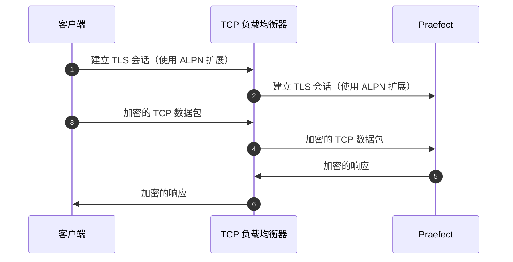
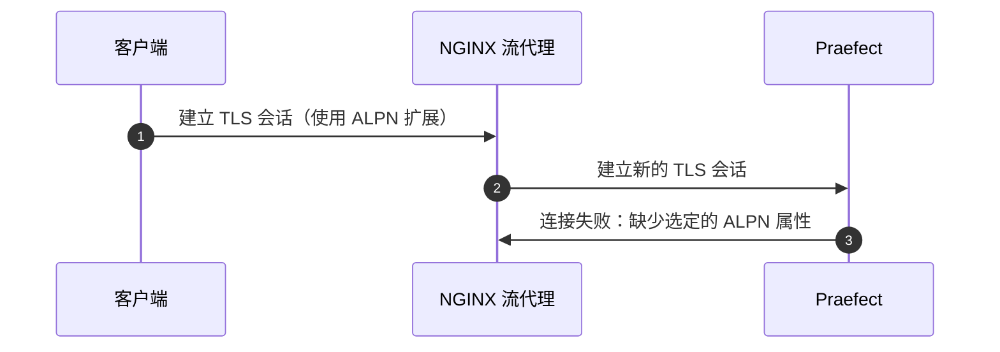



- Tier: 基础版，专业版，旗舰版
- Offering: 私有化部署



配置 Gitaly 集群可以使用以下方法：

- Gitaly 集群配置说明作为安装的一部分提供，可以参考[参考架构](../reference_architectures/_index.md)来进行配置：
  - [60 RPS 或 3,000 用户](../reference_architectures/3k_users.md#configure-gitaly-cluster)。
  - [100 RPS 或 5,000 用户](../reference_architectures/5k_users.md#configure-gitaly-cluster)。
  - [200 RPS 或 10,000 用户](../reference_architectures/10k_users.md#configure-gitaly-cluster)。
  - [500 RPS 或 25,000 用户](../reference_architectures/25k_users.md#configure-gitaly-cluster)。
  - [1000 RPS 或 50,000 用户](../reference_architectures/50k_users.md#configure-gitaly-cluster)。
- 本页后续的自定义配置说明。

较小的极狐GitLab 安装可能只需要 [Gitaly 本身](_index.md)。



Gitaly 集群尚不支持 Kubernetes、Amazon ECS 或类似的容器环境。有关更多信息，请参阅 [epic 6127](https://jihulab.com/gitlab-cn/-/epics/6127)。



<a id="requirements"></a>

## 要求

Gitaly 集群的最低推荐配置需要：

- 1 个负载均衡器
- 1 个 PostgreSQL 服务器（一个[支持的版本](../../install/requirements.md#postgresql)）
- 3 个 Praefect 节点
- 3 个 Gitaly 节点（1 个主节点，2 个从节点）



[磁盘要求](_index.md#disk-requirements)适用于 Gitaly 节点。



您应该配置奇数个 Gitaly 节点，以便在其中一个 Gitaly 节点在变更 RPC 调用中失败的情况下提供交易决策。

有关实现细节，请参阅 [设计文档](https://gitlab.com/gitlab-org/gitaly/-/blob/master/doc/design_ha.md)。



如果没有在极狐GitLab 中设置，功能标志从控制台读取为 false，Praefect 使用其默认值。默认值取决于极狐GitLab 版本。



<a id="network-latency-and-connectivity"></a>

### 网络延迟和连接性

Gitaly 集群的网络延迟应理想情况下以个位数毫秒为单位进行测量。延迟尤其重要，因为：

- Gitaly 节点健康检查。节点必须能够在 1 秒内响应。
- 强制[强一致性](_index.md#strong-consistency)的参考事务。较低的延迟意味着 Gitaly 节点可以更快地就更改达成一致。

在 Gitaly 节点之间实现可接受的延迟：

- 在物理网络上通常意味着高带宽、单一位置连接。
- 在云上通常意味着在同一区域，包括允许跨可用区复制。这些链接设计用于这种类型的同步。Gitaly 集群的延迟应小于 2 毫秒。

如果您无法提供低网络延迟以进行复制（例如，在远距离位置之间），请考虑 Geo。有关更多信息，请参阅 [与 Geo 的比较](_index.md#comparison-to-geo)。

Gitaly 集群[组件](_index.md#components)通过多条路由相互通信。您的防火墙规则必须允许以下内容以确保 Gitaly 集群正常运行：

| 来源                  | 目标                    | 默认端口  | TLS 端口 |
|:-----------------------|:-----------------------|:-------------|:---------|
| 极狐GitLab                 | Praefect 负载均衡器 | `2305`       | `3305`   |
| Praefect 负载均衡器 | Praefect               | `2305`       | `3305`   |
| Praefect               | Gitaly                 | `8075`       | `9999`   |
| Praefect               | 极狐GitLab （内部 API）  | `80`         | `443`    |
| Gitaly                 | 极狐GitLab （内部 API）  | `80`         | `443`    |
| Gitaly                 | Praefect 负载均衡器 | `2305`       | `3305`   |
| Gitaly                 | Praefect               | `2305`       | `3305`   |
| Gitaly                 | Gitaly                 | `8075`       | `9999`   |



Gitaly 并不直接连接到 Praefect。然而，来自 Gitaly 到 Praefect 负载均衡器的请求可能仍会被阻止，除非 Praefect 节点上的防火墙允许来自 Gitaly 节点的流量。



<a id="praefect-database-storage"></a>

### Praefect 数据库存储

需求相对较低，因为数据库仅包含以下元数据：

- 存储库的所在位置。
- 一些排队的工作。

这取决于存储库的数量，但良好的最低限度是 5-10 GB，类似于主要的极狐GitLab 应用程序数据库。

<a id="setup-instructions"></a>

## 设置说明

如果您使用 Linux 软件包安装了极狐GitLab （强烈推荐），请按照以下步骤进行操作：

1. [准备](#preparation)
1. [配置 Praefect 数据库](#postgresql)
1. [配置 Praefect 代理/路由器](#praefect)
1. [配置每个 Gitaly 节点](#gitaly)（每个 Gitaly 节点一次）
1. [配置负载均衡器](#load-balancer)
1. [更新极狐GitLab 服务器配置](#gitlab)
1. [配置 Grafana](#grafana)

<a id="preparation"></a>

### 准备

在开始之前，您应该已经拥有一个工作中的极狐GitLab 实例。[了解如何安装极狐GitLab](https://gitlab.cn/install/)。

准备一个 PostgreSQL 服务器。您应该使用随 Linux 软件包提供的 PostgreSQL 并使用它来配置 PostgreSQL 数据库。您可以使用外部 PostgreSQL 服务器，但必须[手动设置](#manual-database-setup)。

通过[安装极狐GitLab](https://gitlab.cn/install/)来准备所有新的节点。您需要：

- 1 个 PostgreSQL 节点
- 1 个 PgBouncer 节点（可选）
- 至少 1 个 Praefect 节点（需要最小存储）
- 3 个 Gitaly 节点（高 CPU，高内存，快速存储）
- 1 个极狐GitLab 服务器

您还需要每个节点的 IP/主机地址：

1. `PRAEFECT_LOADBALANCER_HOST`：Praefect 负载均衡器的 IP/主机地址
1. `POSTGRESQL_HOST`：PostgreSQL 服务器的 IP/主机地址
1. `PGBOUNCER_HOST`：PostgreSQL 服务器的 IP/主机地址
1. `PRAEFECT_HOST`：Praefect 服务器的 IP/主机地址
1. `GITALY_HOST_*`：每个 Gitaly 服务器的 IP 或主机地址
1. `GITLAB_HOST`：极狐GitLab 服务器的 IP/主机地址

如果您使用 Google Cloud Platform、SoftLayer 或任何其他提供虚拟私有云（VPC）的供应商，您可以使用每个云实例的私有地址（对应于 Google Cloud Platform 的“内部地址”）来进行 `PRAEFECT_HOST`、`GITALY_HOST_*` 和 `GITLAB_HOST` 的设置。

#### 密钥

组件之间的通信通过不同的密钥进行安全保护，如下所述。在开始之前，为每个生成一个唯一的密钥，并做好记录。在完成设置过程时，您可以用安全令牌替换这些占位符令牌。

1. `GITLAB_SHELL_SECRET_TOKEN`：用于 Git 钩子在接受 Git 推送时向极狐GitLab 发出回调 HTTP API 请求。出于遗留原因，此密钥与极狐GitLab Shell 共享。
1. `PRAEFECT_EXTERNAL_TOKEN`：托管在您的 Praefect 集群上的存储库只能由携带此令牌的 Gitaly 客户端访问。
1. `PRAEFECT_INTERNAL_TOKEN`：此令牌用于 Praefect 集群内部的复制流量。此令牌与 `PRAEFECT_EXTERNAL_TOKEN` 不同，因为 Gitaly 客户端不得直接访问 Praefect 集群的内部节点；否则可能导致数据丢失。
1. `PRAEFECT_SQL_PASSWORD`：此密码由 Praefect 用于连接到 PostgreSQL。
1. `PRAEFECT_SQL_PASSWORD_HASH`：Praefect 用户的密码哈希。使用 `gitlab-ctl pg-password-md5 praefect` 生成哈希。该命令要求输入 `praefect` 用户的密码。输入 `PRAEFECT_SQL_PASSWORD` 明文密码。默认情况下，Praefect 使用 `praefect` 用户，但您可以更改它。
1. `PGBOUNCER_SQL_PASSWORD_HASH`：PgBouncer 用户的密码哈希。PgBouncer 使用此密码连接到 PostgreSQL。有关更多详细信息，请参阅[捆绑的 PgBouncer](../postgresql/pgbouncer.md)文档。

我们在下面的说明中注明了这些密钥的要求。



Linux 软件包安装可以使用 `gitlab-secrets.json` 来进行 `GITLAB_SHELL_SECRET_TOKEN` 的设置。



<a id="customize-time-server-setting"></a>

### 自定义时间服务器设置

默认情况下，Gitaly 和 Praefect 节点使用 `pool.ntp.org` 作为时间同步检查的时间服务器。您可以通过在每个节点上的 `gitlab.rb` 中添加以下内容来自定义此设置：

- 对于 Gitaly 节点：`gitaly['env'] = { "NTP_HOST" => "ntp.example.com" }`
- 对于 Praefect 节点：`praefect['env'] = { "NTP_HOST" => "ntp.example.com" }`

<a id="postgresql"></a>

### PostgreSQL



如果使用[Geo](../geo/_index.md)，请不要将极狐GitLab 应用程序数据库和 Praefect 数据库存储在同一个 PostgreSQL 服务器上。复制状态是极狐GitLab 的每个实例内部的，且不应被复制。



这些说明有助于设置单个 PostgreSQL 数据库，创建一个单点故障。为了避免这种情况，您可以配置自己的集群 PostgreSQL。

可用的选项如下：

- 对于非 Geo 安装，您可以：
  - 使用已记录的[PostgreSQL 设置](../postgresql/_index.md)之一。
  - 使用您自己的第三方数据库设置。这需要[手动设置](#manual-database-setup)。
- 对于 Geo 实例，您可以：
  - 设置一个单独的 PostgreSQL 实例。
  - 使用云托管的 PostgreSQL 服务。推荐使用 AWS 关系数据库服务。

设置 PostgreSQL 会创建空的 Praefect 表。有关更多信息，请参阅[相关故障排除部分](troubleshooting_gitaly_cluster.md#relation-does-not-exist-errors)。

#### 在同一服务器上运行极狐GitLab 和 Praefect 数据库

极狐GitLab 应用程序数据库和 Praefect 数据库可以在同一服务器上运行。然而，当使用 Linux 软件包中的 PostgreSQL 时，Praefect 应该拥有自己的数据库服务器。如果发生故障转移，Praefect 无法知道并开始失败，因为它尝试使用的数据库会：

- 无法使用。
- 处于只读模式。

#### 手动数据库设置

要完成本节，您需要：

- 一个 Praefect 节点
- 一个 PostgreSQL 节点
  - 一个具有管理数据库服务器权限的 PostgreSQL 用户

在本节中，我们配置 PostgreSQL 数据库。这可以用于外部和 Linux 软件包提供的 PostgreSQL 服务器。

要运行以下说明，您可以使用安装了 Linux 软件包的 Praefect 节点（`/opt/gitlab/embedded/bin/psql`）。如果您使用的是 Linux 软件包提供的 PostgreSQL，您可以在 PostgreSQL 节点上使用 `gitlab-psql` 代替：

1. 创建一个新的用户 `praefect`，供 Praefect 使用：

   ```sql
   CREATE ROLE praefect WITH LOGIN PASSWORD 'PRAEFECT_SQL_PASSWORD';
   ```

   将 `PRAEFECT_SQL_PASSWORD` 替换为您在准备步骤中生成的强密码。

1. 创建一个新的数据库 `praefect_production`，它由 `praefect` 用户拥有。

   ```sql
   CREATE DATABASE praefect_production WITH OWNER praefect ENCODING UTF8;
   ```

使用 Linux 软件包提供的 PgBouncer 时，您需要采取以下额外步骤。我们强烈推荐使用随 Linux 软件包提供的 PostgreSQL 作为后端。以下说明仅适用于 Linux 软件包提供的 PostgreSQL：

1. 对于 Linux 软件包提供的 PgBouncer，您需要使用 `praefect` 密码的哈希代替实际密码：

   ```sql
   ALTER ROLE praefect WITH PASSWORD 'md5<PRAEFECT_SQL_PASSWORD_HASH>';
   ```

   将 `<PRAEFECT_SQL_PASSWORD_HASH>` 替换为您在准备步骤中生成的密码哈希。它以 `md5` 字面值为前缀。

1. Linux 软件包附带的 PgBouncer 配置为使用 [`auth_query`](https://www.pgbouncer.org/config.html#generic-settings)，并使用 `pg_shadow_lookup` 函数。您需要在 `praefect_production` 数据库中创建此函数：

   ```sql
   CREATE OR REPLACE FUNCTION public.pg_shadow_lookup(in i_username text, out username text, out password text) RETURNS record AS $$
   BEGIN
       SELECT usename, passwd FROM pg_catalog.pg_shadow
       WHERE usename = i_username INTO username, password;
       RETURN;
   END;
   $$ LANGUAGE plpgsql SECURITY DEFINER;

   REVOKE ALL ON FUNCTION public.pg_shadow_lookup(text) FROM public, pgbouncer;
   GRANT EXECUTE ON FUNCTION public.pg_shadow_lookup(text) TO pgbouncer;
   ```

Praefect 使用的数据库现已配置。

现在，您可以配置 Praefect 使用该数据库：

```ruby
praefect['configuration'] = {
   # ...
   database: {
      # ...
      host: POSTGRESQL_HOST,
      user: 'praefect',
      port: 5432,
      password: PRAEFECT_SQL_PASSWORD,
      dbname: 'praefect_production',
   }
}
```

如果在配置 PostgreSQL 后看到 Praefect 数据库错误，请参阅[故障排除步骤](troubleshooting_gitaly_cluster.md#relation-does-not-exist-errors)。

#### 读取分发缓存

通过额外配置 `session_pooled` 设置，可以提高 Praefect 性能：

```ruby
praefect['configuration'] = {
   # ...
   database: {
      # ...
      session_pooled: {
         # ...
         host: POSTGRESQL_HOST,
         port: 5432

         # 使用以下方式覆盖直接数据库连接的参数。
         # 注释掉参数相同的部分。
         user: 'praefect',
         password: PRAEFECT_SQL_PASSWORD,
         dbname: 'praefect_production',
         # sslmode: '...',
         # sslcert: '...',
         # sslkey: '...',
         # sslrootcert: '...',
      }
   }
}
```

配置后，此连接自动用于 [SQL LISTEN](https://www.postgresql.org/docs/16/sql-listen.html) 功能，并允许 Praefect 从 PostgreSQL 接收缓存失效通知。

通过查看 Praefect 日志中的以下日志条目来验证此功能是否正常工作：

```plaintext
reads distribution caching is enabled by configuration
```

#### 使用 PgBouncer

为了减少 PostgreSQL 的资源消耗，您应该在 PostgreSQL 实例前设置并配置 PgBouncer。然而，PgBouncer 并不是必须的，因为 Praefect 只会建立少量连接。如果选择使用 PgBouncer，您可以使用同一个 PgBouncer 实例来处理极狐GitLab 应用程序数据库和 Praefect 数据库。

要在 PostgreSQL 实例前配置 PgBouncer，您必须通过在 Praefect 配置中设置数据库参数来指向 PgBouncer：

```ruby
praefect['configuration'] = {
   # ...
   database: {
      # ...
      host: PGBOUNCER_HOST,
      port: 6432,
      user: 'praefect',
      password: PRAEFECT_SQL_PASSWORD,
      dbname: 'praefect_production',
      # sslmode: '...',
      # sslcert: '...',
      # sslkey: '...',
      # sslrootcert: '...',
   }
}
```

Praefect 需要额外连接到支持 [LISTEN](https://www.postgresql.org/docs/16/sql-listen.html) 功能的 PostgreSQL。使用 PgBouncer 时，此功能仅在 `session` 池模式下可用（`pool_mode = session`）。在 `transaction` 池模式下不可用（`pool_mode = transaction`）。

要配置额外连接，您必须：

- 配置一个新的 PgBouncer 数据库，该数据库使用相同的 PostgreSQL 数据库端点，但使用不同的池模式（`pool_mode = session`）。
- 直接连接 Praefect 到 PostgreSQL，绕过 PgBouncer。

#### 配置新的 PgBouncer 数据库并使用 `pool_mode = session`

您应该使用 `session` 池模式的 PgBouncer。您可以使用 [捆绑的 PgBouncer](../postgresql/pgbouncer.md) 或使用外部 PgBouncer 并手动配置。

以下示例使用捆绑的 PgBouncer，并在 PostgreSQL 主机上设置两个单独的连接池，一个使用 `session` 池模式，另一个使用 `transaction` 池模式。要使此示例正常工作，您需要按照[设置说明](#manual-database-setup)中记录的方式准备 PostgreSQL 服务器：

```ruby
pgbouncer['databases'] = {
  # 其他数据库配置，包括 gitlabhq_production
  ...

  praefect_production: {
    host: POSTGRESQL_HOST,
    # 使用 `pgbouncer` 用户连接到数据库后端。
    user: 'pgbouncer',
    password: PGBOUNCER_SQL_PASSWORD_HASH,
    pool_mode: 'transaction'
  },
  praefect_production_direct: {
    host: POSTGRESQL_HOST,
    # 使用 `pgbouncer` 用户连接到数据库后端。
    user: 'pgbouncer',
    password: PGBOUNCER_SQL_PASSWORD_HASH,
    dbname: 'praefect_production',
    pool_mode: 'session'
  },

  ...
}

# 允许 praefect 用户连接到 PgBouncer
pgbouncer['users'] = {
  'praefect': {
    'password': PRAEFECT_SQL_PASSWORD_HASH,
  }
}
```

`praefect_production` 和 `praefect_production_direct` 使用相同的数据库端点（`praefect_production`），但具有不同的池模式。这会转换为 PgBouncer 的以下 `databases` 部分：

```ini
[databases]
praefect_production = host=POSTGRESQL_HOST auth_user=pgbouncer pool_mode=transaction
praefect_production_direct = host=POSTGRESQL_HOST auth_user=pgbouncer dbname=praefect_production pool_mode=session
```

现在您可以配置 Praefect 使用 PgBouncer 进行两种连接：

```ruby
praefect['configuration'] = {
   # ...
   database: {
      # ...
      host: PGBOUNCER_HOST,
      port: 6432,
      user: 'praefect',
      # `PRAEFECT_SQL_PASSWORD` 是 Praefect 用户的明文密码。不要与 `PRAEFECT_SQL_PASSWORD_HASH` 混淆。
      password: PRAEFECT_SQL_PASSWORD,
      dbname: 'praefect_production',
      session_pooled: {
         # ...
         dbname: 'praefect_production_direct',
         # 无需重复以下内容。直接数据库连接的参数将回退到上面的值。
         #
         # host: PGBOUNCER_HOST,
         # port: 6432,
         # user: 'praefect',
         # password: PRAEFECT_SQL_PASSWORD,
      },
   },
}
```

通过此配置，Praefect 使用 PgBouncer 进行两种类型的连接。



Linux 软件包安装处理认证需求（使用 `auth_query`），但如果您正在手动准备数据库并配置外部 PgBouncer，您必须在 PgBouncer 使用的文件中包含 `praefect` 用户及其密码。例如，如果 `auth_file` 配置选项已设置，则使用 `userlist.txt`。有关更多详细信息，请参阅 PgBouncer 文档。



#### 配置 Praefect 直接连接到 PostgreSQL

作为配置 PgBouncer 使用 `session` 池模式的替代方案，可以配置 Praefect 使用不同的连接参数直接访问 PostgreSQL。此连接支持 `LISTEN` 功能。

一个直接连接到 PostgreSQL 的 Praefect 配置示例：

```ruby
praefect['configuration'] = {
   # ...
   database: {
      # ...
      session_pooled: {
         # ...
         host: POSTGRESQL_HOST,
         port: 5432,

         # 使用以下方式覆盖直接数据库连接的参数。
         # 注释掉参数相同的部分。
         #
         user: 'praefect',
         password: PRAEFECT_SQL_PASSWORD,
         dbname: 'praefect_production',
         # sslmode: '...',
         # sslcert: '...',
         # sslkey: '...',
         # sslrootcert: '...',
      },
   },
}
```

<a id="praefect"></a>

### Praefect

如果有多个 Praefect 节点：

1. 指定一个节点为部署节点，并使用以下步骤进行配置。
1. 对每个其他节点完成以下步骤。

要完成本节，您需要一个[配置的 PostgreSQL 服务器](#postgresql)，包括：



Praefect 应在专用节点上运行。不要在应用程序服务器或 Gitaly 节点上运行 Praefect。



在 **Praefect** 节点上：

1. 通过编辑 `/etc/gitlab/gitlab.rb` 来禁用所有其他服务：

   ```ruby
   # 避免在 Praefect 服务器上运行不必要的服务
   gitaly['enable'] = false
   postgresql['enable'] = false
   redis['enable'] = false
   nginx['enable'] = false
   puma['enable'] = false
   sidekiq['enable'] = false
   gitlab_workhorse['enable'] = false
   prometheus['enable'] = false
   alertmanager['enable'] = false
   gitlab_exporter['enable'] = false
   gitlab_kas['enable'] = false

   # 仅启用 Praefect 服务
   praefect['enable'] = true

   # 防止数据库迁移在升级时自动运行
   praefect['auto_migrate'] = false
   gitlab_rails['auto_migrate'] = false
   ```

1. 通过编辑 `/etc/gitlab/gitlab.rb` 配置 **Praefect** 以监听网络接口：

   ```ruby
   praefect['configuration'] = {
      # ...
      listen_addr: '0.0.0.0:2305',
   }
   ```

1. 通过编辑 `/etc/gitlab/gitlab.rb` 配置 Prometheus 指标：

   ```ruby
   praefect['configuration'] = {
      # ...
      #
      # 启用 Prometheus 指标访问 Praefect。您必须使用防火墙来限制对该地址/端口的访问。
      # 默认指标端点为 /metrics
      prometheus_listen_addr: '0.0.0.0:9652',
      # 一些指标对数据库运行查询。启用单独的数据库指标允许这些指标在单独的 /db_metrics 端点上被收集。
      prometheus_exclude_database_from_default_metrics: true,
   }
   ```

1. 通过编辑 `/etc/gitlab/gitlab.rb` 为 **Praefect** 配置强身份验证令牌，这是需要由集群外的客户端（如极狐GitLab Shell）与 Praefect 集群进行通信：

   ```ruby
   praefect['configuration'] = {
      # ...
      auth: {
         # ...
         token: 'PRAEFECT_EXTERNAL_TOKEN',
      },
   }
   ```

1. 配置 **Praefect** 以[连接到 PostgreSQL 数据库](#postgresql)。我们强烈推荐同时使用 [PgBouncer](#use-pgbouncer)。

   如果您想使用 TLS 客户端证书，可以使用以下选项：

   ```ruby
   praefect['configuration'] = {
      # ...
      database: {
         # ...
         #
         # 使用 TLS 客户端证书连接到 PostgreSQL
         # sslcert: '/path/to/client-cert',
         # sslkey: '/path/to/client-key',
         #
         # 信任自定义证书机构
         # sslrootcert: '/path/to/rootcert',
      },
   }
   ```

   默认情况下，Praefect 使用机会主义 TLS 连接到 PostgreSQL。这意味着 Praefect 尝试使用 `sslmode` 设置为 `prefer` 连接到 PostgreSQL。您可以通过取消注释以下行来覆盖此设置：

   ```ruby
   praefect['configuration'] = {
      # ...
      database: {
         # ...
         # sslmode: 'disable',
      },
   }
   ```

1. 通过编辑 `/etc/gitlab/gitlab.rb` 配置 **Praefect** 集群以连接到集群中的每个 Gitaly 节点。

   虚拟存储的名称必须与极狐GitLab 配置中的存储名称匹配。在后续步骤中，我们将存储名称配置为 `default`，因此我们在这里也使用 `default`。此集群有三个 Gitaly 节点 `gitaly-1`、`gitaly-2` 和 `gitaly-3`，它们旨在相互复制。

   

   如果您已经在现有存储上有名为 `default` 的数据，您应该使用其他名称配置虚拟存储，并在之后[将数据迁移到 Gitaly 集群存储](_index.md#migrate-to-gitaly-cluster)。

   

   将 `PRAEFECT_INTERNAL_TOKEN` 替换为强密钥，用于 Praefect 在集群中与 Gitaly 节点进行通信。此令牌与 `PRAEFECT_EXTERNAL_TOKEN` 不同。

   将 `GITALY_HOST_*` 替换为每个 Gitaly 节点的 IP 或主机地址。

   可以向集群添加更多 Gitaly 节点以增加副本数量。对于非常大的极狐GitLab 实例，还可以添加更多集群。

   

   在向虚拟存储添加额外的 Gitaly 节点时，该虚拟存储中的所有存储名称必须唯一。此外，Praefect 配置中引用的所有 Gitaly 节点地址必须唯一。

   

   ```ruby
   # 存储哈希的名称必须与极狐GitLab 服务器上的 gitlab_rails['repositories_storages'] 中的存储名称匹配（'default'），以及 Gitaly 节点上的 gitaly['configuration'][:storage][INDEX][:name] （'gitaly-1'）
   praefect['configuration'] = {
      # ...
      virtual_storage: [
         {
            # ...
            name: 'default',
            node: [
               {
                  storage: 'gitaly-1',
                  address: 'tcp://GITALY_HOST_1:8075',
                  token: 'PRAEFECT_INTERNAL_TOKEN'
               },
               {
                  storage: 'gitaly-2',
                  address: 'tcp://GITALY_HOST_2:8075',
                  token: 'PRAEFECT_INTERNAL_TOKEN'
               },
               {
                  storage: 'gitaly-3',
                  address: 'tcp://GITALY_HOST_3:8075',
                  token: 'PRAEFECT_INTERNAL_TOKEN'
               },
            ],
         },
      ],
   }
   ```

1. 保存对 `/etc/gitlab/gitlab.rb` 的更改并[重新配置 Praefect](../restart_gitlab.md#reconfigure-a-linux-package-installation)：

   ```shell
   gitlab-ctl reconfigure
   ```

1. 对于：

   - “部署节点”：
     1. 通过在 `/etc/gitlab/gitlab.rb` 中设置 `praefect['auto_migrate'] = true` 来再次启用 Praefect 数据库自动迁移。
     1. 为确保数据库迁移仅在重新配置期间运行，而不是自动在升级时运行，执行：

        ```shell
        sudo touch /etc/gitlab/skip-auto-reconfigure
        ```

   - 其他节点，可以保持原样。虽然 `/etc/gitlab/skip-auto-reconfigure` 不是必需的，但您可能希望设置它以防止极狐GitLab 在运行命令时自动运行重新配置，例如 `apt-get update`。这样可以完成任何额外的配置更改，然后手动运行重新配置。

1. 保存对 `/etc/gitlab/gitlab.rb` 的更改并[重新配置 Praefect](../restart_gitlab.md#reconfigure-a-linux-package-installation)：

   ```shell
   gitlab-ctl reconfigure
   ```

1. 为了确保 Praefect 更新了其 Prometheus 监听地址，[重启 Praefect](../restart_gitlab.md#reconfigure-a-linux-package-installation)：

   ```shell
   gitlab-ctl restart praefect
   ```

1. 验证 Praefect 是否能够访问 PostgreSQL：

   ```shell
   sudo -u git -- /opt/gitlab/embedded/bin/praefect -config /var/opt/gitlab/praefect/config.toml sql-ping
   ```

   如果检查失败，请确保您正确遵循步骤。如果您编辑 `/etc/gitlab/gitlab.rb`，请记得在尝试 `sql-ping` 命令之前再次运行 `sudo gitlab-ctl reconfigure`。

#### 启用 TLS 支持

Praefect 支持 TLS 加密。要与监听安全连接的 Praefect 实例进行通信，您必须：

- 确保 Gitaly 已[配置 TLS](tls_support.md)，并在 GitLab 配置的相应存储条目中的 `gitaly_address` 使用 `tls://` URL 方案。
- 自带证书，因为这不是自动提供的。每个 Praefect 服务器对应的证书必须安装在该 Praefect 服务器上。

此外，证书或其证书机构必须安装在所有 Gitaly 服务器上，以及所有与其通信的 Praefect 客户端上，按照[极狐GitLab 自定义证书配置](https://docs.gitlab.com/omnibus/settings/ssl/#install-custom-public-certificates)（并在下面重复）中描述的过程。

注意以下几点：

- 证书必须指定您用来访问 Praefect 服务器的地址。您必须将主机名或 IP 地址添加为证书的主题备用名称。
- 在命令行运行 Praefect 子命令，例如 `dial-nodes` 和 `list-untracked-repositories` 时，如果启用了 [Gitaly TLS](tls_support.md)，您必须设置 `SSL_CERT_DIR` 或 `SSL_CERT_FILE` 环境变量，以便 Gitaly 证书被信任。例如：

   ```shell
   SSL_CERT_DIR=/etc/gitlab/trusted-certs sudo -u git -- /opt/gitlab/embedded/bin/praefect -config /var/opt/gitlab/praefect/config.toml dial-nodes
   ```

- 您可以同时配置 Praefect 服务器具有未加密的监听地址 `listen_addr` 和加密的监听地址 `tls_listen_addr`。这允许您在必要时逐步从未加密的流量过渡到加密流量。

  要禁用未加密的监听器，请设置：

  ```ruby
  praefect['configuration'] = {
    # ...
    listen_addr: nil,
  }
  ```

配置 Praefect 使用 TLS。

对于 Linux 软件包安装：

1. 为 Praefect 服务器创建证书。

1. 在 Praefect 服务器上，创建 `/etc/gitlab/ssl` 目录并将您的密钥和证书复制到该目录：

   ```shell
   sudo mkdir -p /etc/gitlab/ssl
   sudo chmod 755 /etc/gitlab/ssl
   sudo cp key.pem cert.pem /etc/gitlab/ssl/
   sudo chmod 644 key.pem cert.pem
   ```

1. 编辑 `/etc/gitlab/gitlab.rb` 并添加：

   ```ruby
   praefect['configuration'] = {
      # ...
      tls_listen_addr: '0.0.0.0:3305',
      tls: {
         # ...
         certificate_path: '/etc/gitlab/ssl/cert.pem',
         key_path: '/etc/gitlab/ssl/key.pem',
      },
   }
   ```

1. 保存文件并[重新配置](../restart_gitlab.md#reconfigure-a-linux-package-installation)。

1. 在 Praefect 客户端（包括每个 Gitaly 服务器）上，将证书或其证书机构复制到 `/etc/gitlab/trusted-certs`：

   ```shell
   sudo cp cert.pem /etc/gitlab/trusted-certs/
   ```

1. 在 Praefect 客户端（Gitaly 服务器除外）上，编辑 `/etc/gitlab/gitlab.rb` 中的 `gitlab_rails['repositories_storages']`，如下所示：

   ```ruby
   gitlab_rails['repositories_storages'] = {
     "default" => {
       "gitaly_address" => 'tls://PRAEFECT_LOADBALANCER_HOST:3305',
       "gitaly_token" => 'PRAEFECT_EXTERNAL_TOKEN'
     }
   }
   ```

1. 保存文件并[重新配置极狐GitLab](../restart_gitlab.md#reconfigure-a-linux-package-installation)。

对于自编译安装：

1. 为 Praefect 服务器创建证书。
1. 在 Praefect 服务器上，创建 `/etc/gitlab/ssl` 目录并将您的密钥和证书复制到该目录：

   ```shell
   sudo mkdir -p /etc/gitlab/ssl
   sudo chmod 755 /etc/gitlab/ssl
   sudo cp key.pem cert.pem /etc/gitlab/ssl/
   sudo chmod 644 key.pem cert.pem
   ```

1. 在 Praefect 客户端（包括每个 Gitaly 服务器）上，将证书或其证书机构复制到系统受信证书：

   ```shell
   sudo cp cert.pem /usr/local/share/ca-certificates/praefect.crt
   sudo update-ca-certificates
   ```

1. 在 Praefect 客户端（Gitaly 服务器除外）上，编辑 `/home/git/gitlab/config/gitlab.yml` 中的 `storages`，如下所示：

   ```yaml
   gitlab:
     repositories:
       storages:
         default:
           gitaly_address: tls://PRAEFECT_LOADBALANCER_HOST:3305
   ```

1. 保存文件并[重启极狐GitLab](../restart_gitlab.md#self-compiled-installations)。
1. 将所有 Praefect 服务器证书或其证书机构复制到每个 Gitaly 服务器上的系统受信证书，以便在 Gitaly 服务器调用时 Praefect 服务器信任证书：

   ```shell
   sudo cp cert.pem /usr/local/share/ca-certificates/praefect.crt
   sudo update-ca-certificates
   ```

1. 编辑 `/home/git/praefect/config.toml` 并添加：

   ```toml
   tls_listen_addr = '0.0.0.0:3305'

   [tls]
   certificate_path = '/etc/gitlab/ssl/cert.pem'
   key_path = '/etc/gitlab/ssl/key.pem'
   ```

1. 保存文件并[重启极狐GitLab](../restart_gitlab.md#self-compiled-installations)。

#### 服务发现



- 在极狐GitLab 15.10 中引入。



前提条件：

- 一个 DNS 服务器。

极狐GitLab 使用服务发现来检索 Praefect 主机列表。服务发现涉及定期检查 DNS A 或 AAAA 记录，从记录中检索的 IP 用作目标节点的地址。Praefect 不支持 SRV 记录服务发现。

默认情况下，检查之间的最短时间为 5 分钟，无论记录的 TTL 是多少。Praefect 不支持自定义此间隔。当客户端收到更新时，它们：

- 与新的 IP 地址建立新连接。
- 保持与完整 IP 地址的现有连接。
- 删除与已删除 IP 地址的连接。

待处理请求将在完成前仍在待删除的连接上处理。Workhorse 具有 10 分钟超时，而其他客户端没有指定优雅超时。

DNS 服务器应该返回所有 IP 地址，而不是自己进行负载均衡。客户端可以以循环方式分配请求到 IP 地址。

在更新客户端配置之前，请确保 DNS 服务发现正常工作。它应该正确返回 IP 地址列表。`dig` 是一个很好的工具来验证。

```console
❯ dig A praefect.service.consul @127.0.0.1

; <<>> DiG 9.10.6 <<>> A praefect.service.consul @127.0.0.1
;; global options: +cmd
;; Got answer:
;; ->>HEADER<<- opcode: QUERY, status: NOERROR, id: 29210
;; flags: qr aa rd ra; QUERY: 1, ANSWER: 3, AUTHORITY: 0, ADDITIONAL: 1

;; OPT PSEUDOSECTION:
; EDNS: version: 0, flags:; udp: 4096
;; QUESTION SECTION:
;praefect.service.consul.                     IN      A

;; ANSWER SECTION:
praefect.service.consul.              0       IN      A       10.0.0.3
praefect.service.consul.              0       IN      A       10.0.0.2
praefect.service.consul.              0       IN      A       10.0.0.1

;; Query time: 0 msec
;; SERVER: ::1#53(::1)
;; WHEN: Wed Dec 14 12:53:58 +07 2022
;; MSG SIZE  rcvd: 86
```

##### 配置服务发现

默认情况下，Praefect 将 DNS 解析委托给操作系统。在这种情况下，Gitaly 地址可以设置为以下格式：

- `dns:[host]:[port]`
- `dns:///[host]:[port]`（注意三个斜杠）

您还可以通过以下格式设置一个权威名称服务器：

- `dns://[authority_host]:[authority_port]/[host]:[port]`





1. 将每个 Praefect 节点的 IP 地址添加到 DNS 服务发现地址。
1. 在 Praefect 客户端（Gitaly 服务器除外）上，编辑 `/etc/gitlab/gitlab.rb` 中的 `gitlab_rails['repositories_storages']`，如下所示。将 `PRAEFECT_SERVICE_DISCOVERY_ADDRESS` 替换为 Praefect 服务发现地址，例如 `praefect.service.consul`。

   ```ruby
   gitlab_rails['repositories_storages'] = {
     "default" => {
       "gitaly_address" => 'dns:PRAEFECT_SERVICE_DISCOVERY_ADDRESS:2305',
       "gitaly_token" => 'PRAEFECT_EXTERNAL_TOKEN'
     }
   }
   ```

1. 保存文件并[重新配置极狐GitLab](../restart_gitlab.md#reconfigure-a-linux-package-installation)。





1. 安装 DNS 服务发现服务。将所有 Praefect 节点注册到该服务。
1. 在 Praefect 客户端（Gitaly 服务器除外）上，编辑 `/home/git/gitlab/config/gitlab.yml` 中的 `storages`，如下所示：

   ```yaml
   gitlab:
     repositories:
       storages:
         default:
           gitaly_address: dns:PRAEFECT_SERVICE_DISCOVERY_ADDRESS:2305
   ```

1. 保存文件并[重启极狐GitLab](../restart_gitlab.md#self-compiled-installations)。





##### 使用 Consul 配置服务发现

如果您的架构中已经有一个 Consul 服务器，那么您可以在每个 Praefect 节点上添加一个 Consul 代理，并将 `praefect` 服务注册到它。这会将每个节点的 IP 地址注册到 `praefect.service.consul`，以便通过服务发现找到它。

前提条件：

- 一个或多个 [Consul](../consul.md) 服务器以跟踪 Consul 代理。

1. 在每个 Praefect 服务器上，将以下内容添加到您的 `/etc/gitlab/gitlab.rb`：

   ```ruby
   consul['enable'] = true
   praefect['consul_service_name'] = 'praefect'

   # 在解决此问题之前，还必须添加以下内容：
   # https://gitlab.com/gitlab-org/omnibus-gitlab/-/issues/8321
   consul['monitoring_service_discovery'] = true
   praefect['configuration'] = {
     # ...
     #
     prometheus_listen_addr: '0.0.0.0:9652',
   }
   ```

1. 保存文件并[重新配置极狐GitLab](../restart_gitlab.md#reconfigure-a-linux-package-installation)。
1. 在每个 Praefect 服务器上重复上述步骤以使用服务发现。
1. 在 Praefect 客户端（除了 Gitaly 服务器）上，按照如下方式编辑 `/etc/gitlab/gitlab.rb` 中的 `gitlab_rails['repositories_storages']`。将 `CONSUL_SERVER` 替换为 Consul 服务器的 IP 或地址。默认的 Consul DNS 端口是 `8600`。

   ```ruby
   gitlab_rails['repositories_storages'] = {
     "default" => {
       "gitaly_address" => 'dns://CONSUL_SERVER:8600/praefect.service.consul:2305',
       "gitaly_token" => 'PRAEFECT_EXTERNAL_TOKEN'
     }
   }
   ```

1. 使用 `dig` 从 Praefect 客户端确认每个 IP 地址已经注册到 `praefect.service.consul`，命令为 `dig A praefect.service.consul @CONSUL_SERVER -p 8600`。替换 `CONSUL_SERVER` 为上面配置的值，输出中应显示所有 Praefect 节点的 IP 地址。
1. 保存文件并[重新配置极狐GitLab](../restart_gitlab.md#reconfigure-a-linux-package-installation)。

<a id="gitaly"></a>

### Gitaly



完成这些步骤以配置**每个** Gitaly 节点。



要完成此部分，您需要：

- [配置好的 Praefect 节点](#praefect)
- 3 个（或更多）安装了极狐GitLab的服务器，配置为 Gitaly 节点。这些应该是专用节点，不要在这些节点上运行其他服务。

每个分配给 Praefect 集群的 Gitaly 服务器都需要配置。配置与标准的[独立 Gitaly 服务器](_index.md)相同，除了：

- 存储名称暴露给 Praefect，而不是极狐GitLab
- 秘密令牌与 Praefect 共享，而不是极狐GitLab

Praefect 集群中的所有 Gitaly 节点的配置可以相同，因为我们依赖 Praefect 正确地路由操作。

特别要注意的是：

- 在本节中配置的 `gitaly['configuration'][:auth][:token]` 必须与 Praefect 节点上的 `praefect['configuration'][:virtual_storage][<index>][:node][<index>][:token]` 下的 `token` 值匹配。此值在[上一节](#praefect)中设置。本文件在整个文档中使用占位符 `PRAEFECT_INTERNAL_TOKEN`。
- 在本节中配置的 `gitaly['configuration'][:storage]` 中的物理存储名称必须与 Praefect 节点上的 `praefect['configuration'][:virtual_storage]` 下的物理存储名称匹配。这在[上一节](#praefect)中设置。本文件使用 `gitaly-1`、`gitaly-2` 和 `gitaly-3` 作为物理存储名称。

有关 Gitaly 服务器配置的更多信息，请参阅我们的
[Gitaly 文档](configure_gitaly.md#configure-gitaly-servers)。

1. SSH 进入 **Gitaly** 节点并以 root 身份登录：

   ```shell
   sudo -i
   ```

1. 编辑 `/etc/gitlab/gitlab.rb` 来禁用所有其他服务：

   ```ruby
   # 禁用 Gitaly 节点上的所有其他服务
   postgresql['enable'] = false
   redis['enable'] = false
   nginx['enable'] = false
   puma['enable'] = false
   sidekiq['enable'] = false
   gitlab_workhorse['enable'] = false
   prometheus_monitoring['enable'] = false
   gitlab_kas['enable'] = false

   # 仅启用 Gitaly 服务
   gitaly['enable'] = true

   # 如有需要，启用 Prometheus
   prometheus['enable'] = true

   # 禁用数据库迁移以防止在 'gitlab-ctl reconfigure' 期间连接到数据库
   gitlab_rails['auto_migrate'] = false
   ```

1. 通过编辑 `/etc/gitlab/gitlab.rb` 配置 **Gitaly** 监听网络接口：

   ```ruby
   gitaly['configuration'] = {
      # ...
      #
      # 使 Gitaly 接受所有网络接口上的连接。
      # 使用防火墙限制对该地址/端口的访问。
      listen_addr: '0.0.0.0:8075',
      # 启用对 Gitaly 的 Prometheus 指标访问。您必须使用防火墙
      # 限制对该地址/端口的访问。
      prometheus_listen_addr: '0.0.0.0:9236',
   }
   ```

1. 通过编辑 `/etc/gitlab/gitlab.rb` 配置强大的 `auth_token`，客户端需要此令牌与 Gitaly 节点通信。通常，这个令牌对于所有 Gitaly 节点是相同的。

   ```ruby
   gitaly['configuration'] = {
      # ...
      auth: {
         # ...
         token: 'PRAEFECT_INTERNAL_TOKEN',
      },
   }
   ```

1. 配置极狐GitLab Shell 秘密令牌，这是进行 `git push` 操作所需的。可以选择以下方法之一：

   - 方法 1：

     1. 将 `/etc/gitlab/gitlab-secrets.json` 从 Gitaly 客户端复制到 Gitaly 服务器和其他任何 Gitaly 客户端上的相同路径。
     1. 在 Gitaly 服务器上[重新配置极狐GitLab](../restart_gitlab.md#reconfigure-a-linux-package-installation)。

   - 方法 2：

     1. 编辑 `/etc/gitlab/gitlab.rb`。
     1. 用真实的密钥替换 `GITLAB_SHELL_SECRET_TOKEN`。

        ```ruby
        gitlab_shell['secret_token'] = 'GITLAB_SHELL_SECRET_TOKEN'
        ```

1. 配置 `internal_api_url`，这对于 `git push` 操作也是必需的：

   ```ruby
   # 配置 gitlab-shell API 回调 URL。没有这个，`git push` 将会失败。
   # 这可以是您的前置极狐GitLab URL 或内部负载均衡器。
   # 例子：'https://gitlab.example.com', 'http://10.0.2.2'
   gitlab_rails['internal_api_url'] = 'https://gitlab.example.com'
   ```

1. 通过在 `/etc/gitlab/gitlab.rb` 中设置 `gitaly['configuration'][:storage]` 配置 Git 数据的存储位置。每个 Gitaly 节点应该有一个唯一的存储名称（例如 `gitaly-1`），不应在其他 Gitaly 节点上重复。

   ```ruby
   gitaly['configuration'] = {
      # ...
      storage: [
        # 用适当的名称替换每个 Gitaly 节点。
        {
          name: 'gitaly-1',
          path: '/var/opt/gitlab/git-data/repositories',
        },
      ],
   }
   ```

1. 保存对 `/etc/gitlab/gitlab.rb` 的更改并[重新配置 Gitaly](../restart_gitlab.md#reconfigure-a-linux-package-installation)：

   ```shell
   gitlab-ctl reconfigure
   ```

1. 确保 Gitaly 已更新其 Prometheus 监听地址，[重启 Gitaly](../restart_gitlab.md#reconfigure-a-linux-package-installation)：

   ```shell
   gitlab-ctl restart gitaly
   ```

**以上步骤必须为每个 Gitaly 节点完成！**

在所有 Gitaly 节点配置完成后，运行 Praefect 连接检查器以验证 Praefect 能够连接到 Praefect 配置中的所有 Gitaly 服务器。

1. SSH 进入每个 **Praefect** 节点并运行 Praefect 连接检查器：

   ```shell
   sudo -u git -- /opt/gitlab/embedded/bin/praefect -config /var/opt/gitlab/praefect/config.toml dial-nodes
   ```

<a id="load-balancer"></a>

### 负载均衡器

在容错的 Gitaly 配置中，需要负载均衡器将极狐GitLab 应用程序的内部流量路由到 Praefect 节点。关于使用哪个负载均衡器或确切的配置细节超出了极狐GitLab 文档的范围。



负载均衡器必须配置为接受来自 Gitaly 节点以及极狐GitLab 节点的流量。



我们希望，如果您正在管理像极狐GitLab 这样的容错系统，您已经有了一个首选的负载均衡器。一些示例包括 [HAProxy](https://www.haproxy.org/)（开源）、[Google 内部负载均衡器](https://cloud.google.com/load-balancing/docs/internal/)、AWS 弹性负载均衡器、F5 Big-IP LTM 和 Citrix Net Scaler。本文档概述了您需要配置的端口和协议。

您应该使用 HAProxy `leastconn` 负载均衡策略的等效策略，因为长时间运行的操作（例如克隆）会使某些连接保持打开较长时间。

| LB 端口 | 后端端口 | 协议 |
|:--------|:---------|:----|
| 2305    | 2305     | TCP |

您必须使用 TCP 负载均衡器。使用 HTTP/2 或 gRPC 负载均衡器与 Praefect 不起作用，因为 [Gitaly sidechannels](https://gitlab.com/gitlab-org/gitaly/-/blob/master/doc/sidechannel.md)。这种优化拦截 gRPC 握手过程。它将所有繁重的 Git 操作重定向到比 gRPC 更高效的“通道”，但 HTTP/2 或 gRPC 负载均衡器无法正确处理此类请求。

如果启用了 TLS，[某些版本的 Praefect](#alpn-enforcement) 要求每个 RFC 7540 使用应用层协议协商（ALPN）扩展。TCP 负载均衡器直接传递 ALPN 而无需额外配置：



一些 TCP 负载均衡器可以配置为接受 TLS 客户端连接并使用新的 TLS 连接代理连接到 Praefect。但是，这仅在两个连接上均支持 ALPN 的情况下有效。

因此，NGINX 的 `ngx_stream_proxy_module` 在启用 `proxy_ssl` 配置选项时不起作用：



在步骤 2 中，未使用 ALPN，因为 NGINX 不支持此功能。

#### ALPN 强制

在某些版本的极狐GitLab 中启用了 ALPN 强制。然而，ALPN 强制破坏了部署，因此禁用它以提供迁移路径。以下版本的极狐GitLab 启用了 ALPN 强制：

- 极狐GitLab 17.7.0
- 极狐GitLab 17.6.0 - 17.6.2
- 极狐GitLab 17.5.0 - 17.5.4
- 极狐GitLab 17.4.x

在[极狐GitLab 17.5.5、17.6.3 和 17.7.1](https://gitlab.cn/resources/articles/021d5883bc0b47d8a4560ec93ccb355d)中，ALPN 强制再次被禁用。极狐GitLab 17.4 及更早版本从未启用 ALPN 强制。

<a id="gitlab"></a>

### 极狐GitLab

要完成此部分，您需要：

- [配置好的 Praefect 节点](#praefect)
- [配置好的 Gitaly 节点](#gitaly)

需要将 Praefect 集群暴露为极狐GitLab 应用程序的存储位置，这是通过更新 `gitlab_rails['repositories_storages']` 来实现的。

特别要注意的是：

- 在本节中添加到 `gitlab_rails['repositories_storages']` 的存储名称必须与 Praefect 节点上的 `praefect['configuration'][:virtual_storage]` 下的存储名称匹配。这在本指南的 [Praefect](#praefect) 部分中设置。本文件使用 `default` 作为 Praefect 存储名称。

1. SSH 进入 **极狐GitLab** 节点并以 root 身份登录：

   ```shell
   sudo -i
   ```

1. 配置 `external_url` 以便极狐GitLab 通过编辑 `/etc/gitlab/gitlab.rb` 以适当的端点访问来提供文件：

   您需要将 `GITLAB_SERVER_URL` 替换为当前极狐GitLab 实例所服务的真实外部 URL：

   ```ruby
   external_url 'GITLAB_SERVER_URL'
   ```

1. 禁用极狐GitLab 主机上运行的默认 Gitaly 服务。它不是必需的，因为极狐GitLab 连接到配置的集群。

   

   如果您有现有的数据存储在默认的 Gitaly 存储中，您应该首先[将数据迁移到您的 Gitaly 集群存储](_index.md#migrate-to-gitaly-cluster)。

   

   ```ruby
   gitaly['enable'] = false
   ```

1. 通过编辑 `/etc/gitlab/gitlab.rb` 将 Praefect 集群添加为存储位置。

   您需要替换：

   - `PRAEFECT_LOADBALANCER_HOST` 为负载均衡器的 IP 地址或主机名。
   - `PRAEFECT_EXTERNAL_TOKEN` 为真实的密钥

   如果您使用 TLS：

   - `gitaly_address` 应以 `tls://` 开头。
   - 端口应更改为 `3305`。

   ```ruby
   gitlab_rails['repositories_storages'] = {
     "default" => {
       "gitaly_address" => "tcp://PRAEFECT_LOADBALANCER_HOST:2305",
       "gitaly_token" => 'PRAEFECT_EXTERNAL_TOKEN'
     }
   }
   ```

1. 配置极狐GitLab Shell 秘密令牌，以便在 `git push` 期间来自 Gitaly 节点的回调能够正确认证。可以选择以下方法之一：

   - 方法 1：

     1. 将 `/etc/gitlab/gitlab-secrets.json` 从 Gitaly 客户端复制到 Gitaly 服务器和其他任何 Gitaly 客户端上的相同路径。
     1. 在 Gitaly 服务器上[重新配置极狐GitLab](../restart_gitlab.md#reconfigure-a-linux-package-installation)。

   - 方法 2：

     1. 编辑 `/etc/gitlab/gitlab.rb`。
     1. 用真实的密钥替换 `GITLAB_SHELL_SECRET_TOKEN`。

        ```ruby
        gitlab_shell['secret_token'] = 'GITLAB_SHELL_SECRET_TOKEN'
        ```

1. 通过编辑 `/etc/gitlab/gitlab.rb` 添加 Prometheus 监控设置。如果 Prometheus 在不同的节点上启用，请在该节点上进行编辑。

   您需要替换：

   - `PRAEFECT_HOST` 为 Praefect 节点的 IP 地址或主机名
   - `GITALY_HOST_*` 为每个 Gitaly 节点的 IP 地址或主机名

   ```ruby
   prometheus['scrape_configs'] = [
     {
       'job_name' => 'praefect',
       'static_configs' => [
         'targets' => [
           'PRAEFECT_HOST:9652', # praefect-1
           'PRAEFECT_HOST:9652', # praefect-2
           'PRAEFECT_HOST:9652', # praefect-3
         ]
       ]
     },
     {
       'job_name' => 'praefect-gitaly',
       'static_configs' => [
         'targets' => [
           'GITALY_HOST_1:9236', # gitaly-1
           'GITALY_HOST_2:9236', # gitaly-2
           'GITALY_HOST_3:9236', # gitaly-3
         ]
       ]
     }
   ]
   ```

1. 保存对 `/etc/gitlab/gitlab.rb` 的更改并[重新配置极狐GitLab](../restart_gitlab.md#reconfigure-a-linux-package-installation)：

   ```shell
   gitlab-ctl reconfigure
   ```

1. 在每个 Gitaly 节点上验证 Git Hooks 是否能够访问极狐GitLab。在每个 Gitaly 节点上运行：
   - 对于极狐GitLab 15.3 及更高版本，运行 `sudo -u git -- /opt/gitlab/embedded/bin/gitaly check /var/opt/gitlab/gitaly/config.toml`。
   - 对于极狐GitLab 15.2 及更早版本，运行 `sudo -u git -- /opt/gitlab/embedded/bin/gitaly-hooks check /var/opt/gitlab/gitaly/config.toml`。

1. 验证极狐GitLab 是否能够访问 Praefect：

   ```shell
   gitlab-rake gitlab:gitaly:check
   ```

1. 检查 Praefect 存储是否配置为存储新存储库：

   1. 在左侧边栏的底部，选择 **管理员**。
   1. 在左侧边栏中，选择 **设置 > 存储库**。
   1. 展开 **存储库存储** 部分。

   按照本指南，`default` 存储应具有权重 100，用于存储所有新存储库。

1. 通过创建一个新项目来验证一切是否正常。勾选“使用 README 初始化存储库”框，以便存储库中有内容可以查看。如果项目已创建，并且您可以看到 README 文件，那就成功了！

#### 为现有极狐GitLab 实例使用 TCP

在为现有 Gitaly 实例添加 Gitaly 集群时，现有的 Gitaly 存储必须侦听 TCP/TLS。如果未指定 `gitaly_address`，则使用 Unix 套接字，这会阻止与集群的通信。

例如：

```ruby
gitlab_rails['repositories_storages'] = {
  'default' => { 'gitaly_address' => 'tcp://old-gitaly.internal:8075' },
  'cluster' => {
    'gitaly_address' => 'tls://<PRAEFECT_LOADBALANCER_HOST>:3305',
    'gitaly_token' => '<praefect_external_token>'
  }
}
```

有关运行多个 Gitaly 存储的更多信息，请参阅[混合配置](configure_gitaly.md#mixed-configuration)。

<a id="grafana"></a>

### Grafana

Grafana 包含在极狐GitLab 中，可以用于监控您的 Praefect 集群。请参阅 [Grafana Dashboard Service](../monitoring/performance/grafana_configuration.md) 以获取详细文档。

快速入门：

1. SSH 进入 **极狐GitLab** 节点（或启用 Grafana 的节点）并以 root 身份登录：

   ```shell
   sudo -i
   ```

1. 通过编辑 `/etc/gitlab/gitlab.rb` 启用 Grafana 登录表单。

   ```ruby
   grafana['disable_login_form'] = false
   ```

1. 保存对 `/etc/gitlab/gitlab.rb` 的更改并[重新配置极狐GitLab](../restart_gitlab.md#reconfigure-a-linux-package-installation)：

   ```shell
   gitlab-ctl reconfigure
   ```

1. 设置 Grafana 管理员密码。此命令会提示您输入新密码：

   ```shell
   gitlab-ctl set-grafana-password
   ```

1. 在您的 Web 浏览器中，打开您的极狐GitLab 服务器上的 `/-/grafana`（例如 `https://gitlab.example.com/-/grafana`）。

   使用您设置的密码登录，用户名为 `admin`。

1. 转到 **Explore** 并查询 `gitlab_build_info` 以验证您是否从所有机器获取指标。

恭喜！您已成功配置可观察的容错 Praefect 集群。

<a id="configure-replication-factor"></a>

## 配置复制因子

Praefect 支持通过分配特定存储节点来托管存储库，在每个存储库的基础上配置复制因子。



可配置复制因子需要[存储库特定的主节点](#repository-specific-primary-nodes)。



Praefect 不存储实际的复制因子，而是分配足够的存储来托管存储库，以满足所需的复制因子。如果稍后从虚拟存储中删除存储节点，则分配给该存储的存储库的复制因子会相应减少。

您可以配置以下任一选项：

- 为每个虚拟存储配置一个默认复制因子，该因子适用于新创建的存储库。
- 使用 `set-replication-factor` 子命令为现有存储库配置复制因子。

<a id="configure-default-replication-factor"></a>

### 配置默认复制因子

如果未设置 `default_replication_factor`，则存储库始终在 `virtual_storages` 中定义的每个存储节点上复制。如果将新存储节点引入虚拟存储，则新存储库和现有存储库会自动复制到该节点。

对于具有多个存储节点的大型 Gitaly 集群部署，将存储库复制到每个存储节点通常是不明智的，可能会导致问题。通常足以配置 3 的复制因子，这意味着即使有更多可用的存储，也会将存储库复制到三个存储节点。较高的复制因子会增加对主存储的压力。

要配置默认复制因子，请向 `/etc/gitlab/gitlab.rb` 文件添加配置：

```ruby
praefect['configuration'] = {
   # ...
   virtual_storage: [
      {
         # ...
         name: 'default',
         default_replication_factor: 3,
      },
   ],
}
```

<a id="configure-replication-factor-for-existing-repositories"></a>

### 为现有存储库配置复制因子

`set-replication-factor` 子命令会根据需要自动分配或取消分配随机存储节点，以达到所需的复制因子。存储库的主节点始终首先分配，并且永远不会被取消分配。

```shell
sudo -u git -- /opt/gitlab/embedded/bin/praefect -config /var/opt/gitlab/praefect/config.toml set-replication-factor -virtual-storage <virtual-storage> -repository <relative-path> -replication-factor <replication-factor>
```

- `-virtual-storage` 是存储库所在的虚拟存储。
- `-repository` 是存储中存储库的相对路径。
- `-replication-factor` 是存储库的期望复制因子。最小值为 `1`，因为主节点需要存储库的副本。最大复制因子是虚拟存储中的存储数量。

成功后，会打印出分配的主机存储。例如：

```shell
$ sudo -u git -- /opt/gitlab/embedded/bin/praefect -config /var/opt/gitlab/praefect/config.toml set-replication-factor -virtual-storage default -repository @hashed/3f/db/3fdba35f04dc8c462986c992bcf875546257113072a909c162f7e470e581e278.git -replication-factor 2

current assignments: gitaly-1, gitaly-2
```

<a id="repository-storage-recommendations"></a>

### 存储库存储建议

所需存储的大小可能因实例而异，具体取决于所设置的[复制因子](_index.md#replication-factor)。您可能希望实现存储库存储冗余。

对于复制因子：

- 为 `1`：Gitaly 和 Gitaly 集群的存储需求大致相同。
- 大于 `1`：所需存储量为 `used space * replication factor`。`used space` 应包括任何计划的未来增长。

<a id="repository-verification"></a>

## 存储库验证



- [在极狐GitLab 15.0 中引入](https://gitlab.com/gitlab-org/gitaly/-/issues/4080)。



Praefect 在数据库中存储有关存储库的元数据。如果磁盘上的存储库在未通过 Praefect 的情况下被修改，则元数据可能会不准确。例如，如果 Gitaly 节点被重建，而不是被替换为新节点，存储库验证可以确保检测到这一点。

元数据用于复制和路由决策，因此任何不准确可能会导致问题。Praefect 包含一个后台工作程序，该程序会定期验证元数据与磁盘上的实际状态。工作程序：

1. 选择一批副本在健康存储上进行验证。这些副本要么未经验证，要么已超过配置的验证间隔。优先验证从未验证过的副本，然后是按最后一次成功验证以来最长时间排序的其他副本。
1. 检查副本是否存在于各自的存储中。如果：
   - 副本存在，更新其最后一次成功验证时间。
   - 副本不存在，删除其元数据记录。
   - 检查失败，副本将在下一个工作程序出队更多工作时再次进行验证。

工作程序在即将验证的每个副本上获取一个独占的验证租约。这可以避免多个工作程序同时验证同一个副本。工作程序在完成检查后释放租约。如果工作程序因某种原因终止而未释放租约，Praefect 包含一个后台 Go 程序，每 10 秒释放一次陈旧的租约。

工作程序在执行删除操作之前记录每个元数据删除。`perform_deletions` 键指示是否实际删除无效的元数据记录。例如：

```json
{
  "level": "info",
  "msg": "removing metadata records of non-existent replicas",
  "perform_deletions": false,
  "replicas": {
    "default": {
      "@hashed/6b/86/6b86b273ff34fce19d6b804eff5a3f5747ada4eaa22f1d49c01e52ddb7875b4b.git": [
        "praefect-internal-0"
      ]
    }
  }
}
```

<a id="configure-the-verification-worker"></a>

### 配置验证工作程序

默认情况下启用工作程序，并每七天验证一次元数据。验证间隔可以使用任何有效的 [Go 持续时间字符串](https://pkg.go.dev/time#ParseDuration)进行配置。

要每三天验证一次元数据：

```ruby
praefect['configuration'] = {
   # ...
   background_verification: {
      # ...
      verification_interval: '72h',
   },
}
```

值为 0 或更低将禁用后台验证程序。

```ruby
praefect['configuration'] = {
   # ...
   background_verification: {
      # ...
      verification_interval: '0',
   },
}
```

<a id="enable-deletions"></a>

#### 启用删除



- 在极狐GitLab 15.0 中引入并默认禁用
- 在极狐GitLab 15.9 中默认启用。





由于存储库重命名时的竞争条件，删除在极狐GitLab 15.9 之前默认禁用，可能导致不正确的删除，尤其是在 Geo 实例中，因为 Geo 执行的重命名比没有 Geo 的实例更多。在极狐GitLab 15.0 到 15.5 中，您应该仅在启用了 [`gitaly_praefect_generated_replica_paths` 功能标志](_index.md#praefect-generated-replica-paths)的情况下启用删除。该功能标志在极狐GitLab 15.6 中被移除，使删除始终可以安全启用。



默认情况下，工作程序会删除无效的元数据记录。它还会记录已删除的记录并输出 Prometheus 指标。

您可以通过以下方式禁用删除无效的元数据记录：

```ruby
praefect['configuration'] = {
   # ...
   background_verification: {
      # ...
      delete_invalid_records: false,
   },
}
```

<a id="prioritize-verification-manually"></a>

### 手动优先验证

您可以在下次计划验证时间之前优先验证某些副本。例如，在磁盘故障之后，这可能是必要的，当管理员知道磁盘内容可能已更改时。Praefect 最终会再次验证这些副本，但用户可能会在此期间遇到错误。

要手动优先验证某些副本，请使用 `praefect verify` 子命令。该子命令将副本标记为未验证。未验证的副本由后台验证工作程序优先处理。必须启用验证工作程序才能验证副本。

优先验证特定存储库的副本：

```shell
sudo -u git -- /opt/gitlab/embedded/bin/praefect -config /var/opt/gitlab/praefect/config.toml verify -repository-id=<repository-id>
```

优先验证存储在虚拟存储上的所有副本：

```shell
sudo -u git -- /opt/gitlab/embedded/bin/praefect -config /var/opt/gitlab/praefect/config.toml verify -virtual-storage=<virtual-storage>
```

优先验证存储在存储上的所有副本：

```shell
sudo -u git -- /opt/gitlab/embedded/bin/praefect -config /var/opt/gitlab/praefect/config.toml verify -virtual-storage=<virtual-storage> -storage=<storage>
```

输出包括标记为未验证的副本数量。

<a id="automatic-failover-and-primary-election-strategies"></a>

## 自动故障转移和主选举策略

Praefect 定期检查每个 Gitaly 节点的健康状况，如果当前主节点被发现不健康，则自动故障转移到新选举的主 Gitaly 节点。

[存储库特定的主节点](#repository-specific-primary-nodes)是唯一可用的选举策略。

<a id="repository-specific-primary-nodes"></a>

### 存储库特定的主节点

Gitaly 集群为每个存储库分别选举一个主 Gitaly 节点。结合[可配置的复制因子](#configure-replication-factor)，您可以水平扩展存储容量并分布 Gitaly 节点的写入负载。

主选举是惰性运行的。Praefect 不会在当前主节点不健康时立即选举新主节点。如果在当前主节点不可用时必须提供请求，则会选举新主节点。

有效的主节点候选者是一个 Gitaly 节点，它：

- 健康。如果 `>=50%` 的 Praefect 节点在过去的十秒内成功地健康检查了 Gitaly 节点，则该 Gitaly 节点被认为是健康的。
- 拥有存储库的完整最新副本。

如果有多个主节点候选者，Praefect：

- 随机选择其中一个。
- 优先提升分配给托管存储库的 Gitaly 节点。如果没有分配的 Gitaly 节点可选为主节点，Praefect 可以暂时选举一个未分配的节点。当一个分配的节点可用时，未分配的主节点将被降级。

如果没有有效的存储库主节点候选者：

- 不健康的主节点将被降级，存储库将没有主节点。
- 需要主节点的操作将失败，直到成功选举出一个主节点。
