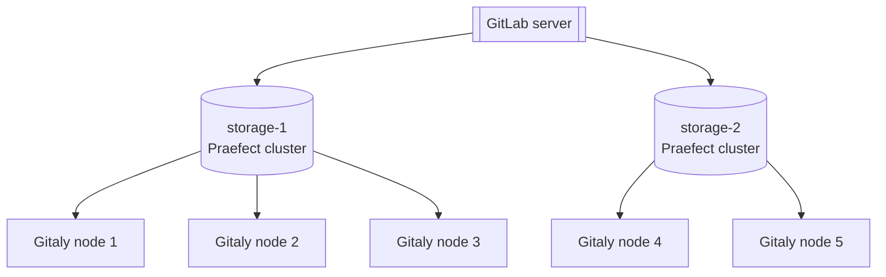
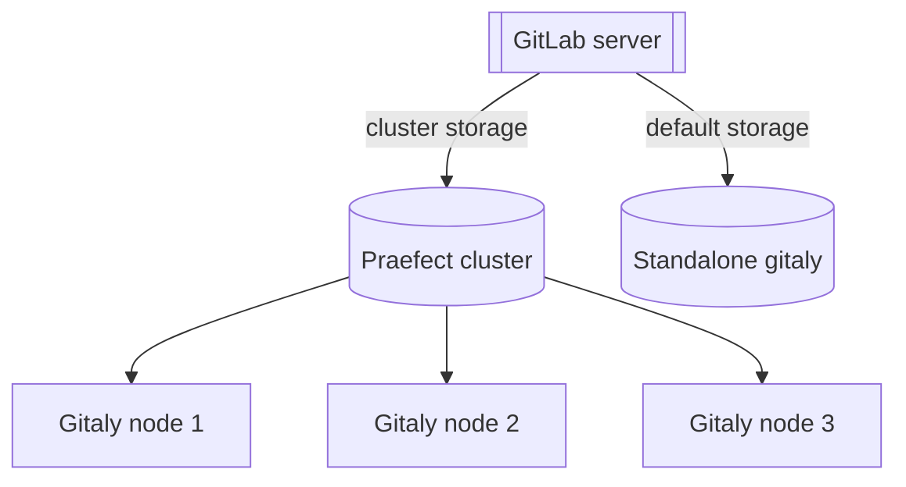



- Tier: 基础版，专业版，旗舰版
- Offering: 私有化部署



极狐GitLab 中的 Git 存储通过 Gitaly 服务提供，对极狐GitLab 的运行至关重要。当用户、代码仓库和活动数量增长时，必须适当扩展 Gitaly，方法包括：

- 在资源耗尽导致 Git、Gitaly 和极狐GitLab 应用性能下降之前，增加 Git 可用的 CPU 和内存资源。
- 在达到存储上限导致写入操作失败之前，增加可用存储。
- 消除单点故障以提高容错能力。如果服务降级会导致您无法将变更部署到生产环境，就应将 Git 视为关键任务。

Gitaly 可以以集群配置运行，以便：

- 扩展 Gitaly 服务。
- 提高容错能力。

在此配置中，每个 Git 代码仓库都可以存储在集群中的多个 Gitaly 节点上。

使用 Gitaly 集群 (Praefect)可通过以下方式提高容错能力：

- 将写入操作复制到热备 Gitaly 节点。
- 检测 Gitaly 节点故障。
- 自动将 Git 请求路由到可用的 Gitaly 节点。

> [!note]
> 对 Gitaly 集群 (Praefect)的技术支持仅限于极狐GitLab 专业版和旗舰版
> 客户。

下图展示了极狐GitLab 访问 `storage-1` 的设置，这是一个由 Gitaly 集群 (Praefect)提供的虚拟存储：


在此示例中：

- 代码仓库存储在名为 `storage-1` 的虚拟存储上。
- 三个 Gitaly 节点提供 `storage-1` 访问：`gitaly-1`、`gitaly-2` 和 `gitaly-3`。
- 这三个 Gitaly 节点在三个独立的哈希存储位置共享数据。
- [复制因子](#replication-factor)为 `3`。每个代码仓库维护三份副本。

假设发生单节点故障，Gitaly 集群 (Praefect)的可用性目标为：

- 恢复点目标（RPO）：小于 1 分钟。

  写入是异步复制的。任何尚未复制到新提升的主节点的写入都会丢失。故障节点上正在进行的任何读取操作都会被终止。

  [强一致性](#strong-consistency)可在某些情况下防止丢失。

- 恢复时间目标（RTO）：小于 10 秒。
  每个 Praefect 节点每秒运行一次健康检查来检测故障。故障转移要求每个
  Praefect 节点上连续十次健康检查失败。

RPO 和 RTO 的改进已在史诗 [8903](https://gitlab.com/groups/gitlab-org/-/work_items/8903) 中提出。

> [!warning]
> 如果发生完整的集群故障，应执行灾难恢复计划。这些计划可能会影响
> 前面讨论的 RPO 和 RTO。

<a id="before-deploying-gitaly-cluster-praefect"></a>

## 部署 Gitaly 集群 (Praefect)之前

Gitaly 集群 (Praefect)提供了容错优势，但也带来了额外的设置和管理复杂性。
在部署 Gitaly 集群 (Praefect)之前，请参阅：

- 现有的[已知问题](#known-issues)。
- [快照备份和恢复](#snapshot-backup-and-recovery)。
- [配置指南](../configure_gitaly.md)和[代码仓库存储选项](../../repository_storage_paths.md)，以确认
  Gitaly 集群 (Praefect)是否是最适合您的设置。

如果您尚未迁移到 Gitaly 集群 (Praefect)，您有两种选择：

- 分片式 Gitaly 实例。
- Gitaly 集群 (Praefect)。

如有任何疑问，请联系您的客户成功经理或客户支持。

如果您已经在使用 Gitaly 集群 (Praefect)并遇到问题或限制，请联系客户支持以立即获得恢复或还原方面的帮助。

<a id="known-issues"></a>

### 已知问题

下表概述了当前影响 Gitaly 集群 (Praefect)使用的已知问题。有关这些问题的当前状态，请参阅所引用的议题和史诗。

| 问题                                                                                                 | 摘要                                                                                                                                                                                                                                    | 如何避免                                                                                                                                                                                                                                                                                                                                                                                                               |
|:------------------------------------------------------------------------------------------------------|:-------------------------------------------------------------------------------------------------------------------------------------------------------------------------------------------------------------------------------------------|:---------------------------------------------------------------------------------------------------------------------------------------------------------------------------------------------------------------------------------------------------------------------------------------------------------------------------------------------------------------------------------------------------------------------------|
| Gitaly 集群 (Praefect) + Geo - 重试失败同步时遇到的问题                                        | 如果在 Geo 从站点上使用 Gitaly 集群 (Praefect)，当 Geo 尝试重新同步时，同步失败的代码仓库可能会持续失败。从此状态恢复需要支持人员协助执行手动步骤。 | 在极狐GitLab 15.0 至 15.2 中，在 Geo 主站点上启用 [`gitaly_praefect_generated_replica_paths` 功能标志](#praefect-generated-replica-paths)。在极狐GitLab 15.3 中，该功能标志默认启用。                                                                                                                                                                                                           |
| 升级后由于迁移未应用，Praefect 无法向数据库插入数据 | 如果数据库未与已完成的迁移保持同步，则 Praefect 节点无法执行标准操作。                                                                                                         | 确保 Praefect 数据库正常运行且所有迁移均已完成。例如，此命令应显示所有已应用迁移的列表：`sudo -u git -- /opt/gitlab/embedded/bin/praefect -config /var/opt/gitlab/praefect/config.toml sql-migrate-status`。考虑[申请升级协助](https://gitlab.cn/support)，以便支持人员审阅您的升级计划。 |
| 在运行中的集群中从快照恢复 Gitaly 集群 (Praefect)节点                       | 由于 Gitaly 集群 (Praefect)以一致状态运行，引入一个落后的单节点会导致集群无法将该节点的数据与其他节点的数据协调一致。                                    | 不要从备份快照恢复单个 Gitaly 集群 (Praefect)节点。如果必须从备份恢复：<br/><br/>1. [关闭极狐GitLab](../../read_only_gitlab.md#shut-down-the-gitlab-ui)。<br/>2. 同时对所有 Gitaly 集群 (Praefect)节点进行快照。<br/>3. 对 Praefect 数据库进行数据库转储。                                                                                              |
| 在 Kubernetes、Amazon ECS 或类似环境中运行时的限制                                        | 在 Kubernetes 上，Gitaly 集群 (Praefect)处于测试版阶段，尚未正式发布，且 Gitaly 存在已知限制。有关更多信息，请参阅 [Kubernetes 上的 Gitaly 集群](#gitaly-cluster-on-kubernetes) 和 [史诗 6127](https://gitlab.com/groups/gitlab-org/-/work_items/6127)。在 Amazon ECS 或类似环境中，不支持 Gitaly 集群 (Praefect)。                                                                     | 对于生产部署，请使用我们的[参考架构](../../reference_architectures/_index.md)。                                                                                                                                                                                                                                                                                                                                                |
| `PostReceiveHook` 在 Praefect 记录写入之前被调用                                  | 竞态条件允许 `PostReceiveHook` 在写入复制到所有节点之前执行。当 CI/CD 流水线以尚未收到写入的副本为目标时，此竞态条件会导致流水线失败，并出现 `couldn't find remote ref refs/merge-requests/$iid/{head,merge}` 错误。有关更多信息，请参阅 [议题 5406](https://gitlab.com/gitlab-org/gitaly/-/issues/5406) | 重试整个作业，或仅重试获取源阶段。有关更多信息，请参阅[作业阶段尝试次数](../../../ci/runners/configure_runners.md#job-stages-attempts)。 |
| HPA 自动扩缩可能导致存储迁移静默失败                                             | 当 Sidekiq Pod 使用 Horizontal Pod Autoscaler（HPA）时，由于作业执行期间 Pod 扩缩，代码仓库存储迁移可能会静默失败。                                                                                                | 在执行代码仓库存储迁移之前，将 HPA 配置为固定副本数，设置 `minReplicas` = `maxReplicas` 以防止迁移期间发生扩缩。                                                                                                                                                                                                                                                                        |

<a id="snapshot-backup-and-recovery"></a>

### 快照备份和恢复

Gitaly 集群 (Praefect)不支持快照备份。快照备份可能导致 Praefect 数据库
与磁盘存储不同步的问题。由于 Praefect 在恢复期间重建 Gitaly 磁盘信息的复制元数据的方式，
您应使用[官方备份和恢复 Rake 任务](../../backup_restore/_index.md)。

[增量备份方法](../../backup_restore/backup_gitlab.md#incremental-repository-backups)
可用于加快 Gitaly 集群 (Praefect)的备份速度。

如果您无法使用这两种方法，请联系客户支持以获得恢复帮助。

<a id="comparison-to-geo"></a>

## 与 Geo 的比较

Gitaly 集群 (Praefect)和 [Geo](../../geo/_index.md) 提供不同类型的冗余。

- Gitaly 集群 (Praefect)的冗余为数据存储提供容错能力，对用户不可见。
- Geo 的冗余为整个极狐GitLab 实例提供[复制](../../geo/_index.md)（对用户可见）和
  [灾难恢复](../../geo/disaster_recovery/_index.md)。Geo
  [复制多种数据类型](../../geo/replication/datatypes.md#replicated-data-types)，包括 Git 数据。

下表概述了 Gitaly 集群 (Praefect)与 Geo 之间的主要区别：

| 工具                      | 节点    | 位置 | 延迟容忍度                                                                                      | 故障转移                                                                     | 一致性                   | 提供的冗余范围 |
|:--------------------------|:---------|:----------|:-------------------------------------------------------------------------------------------------------|:-----------------------------------------------------------------------------|:------------------------------|:------------------------|
| Gitaly 集群 (Praefect) | 多个 | 单一    | [小于 1 秒，理想情况下为个位数毫秒](configure.md#network-latency-and-connectivity) | [自动](configure.md#automatic-failover-and-primary-election) | [强](#strong-consistency) | Git 中的数据存储     |
| Geo                       | 多个 | 多个  | 最长一分钟                                                                                       | [手动](../../geo/disaster_recovery/_index.md)                              | 最终                      | 整个极狐GitLab 实例  |

有关更多信息，请参阅：

- Geo [用例](../../geo/_index.md#use-cases)。
- Geo [架构](../../geo/_index.md#architecture)。

<a id="virtual-storage"></a>

## 虚拟存储

虚拟存储使得在极狐GitLab 中使用单一代码仓库存储成为可能，从而简化代码仓库管理。

使用 Gitaly 集群 (Praefect)的虚拟存储通常可以替代直接的 Gitaly 存储配置。然而，这是以在每个 Gitaly 节点上存储每个代码仓库所需的额外存储空间为代价的。与直接 Gitaly 存储相比，使用 Gitaly 集群 (Praefect)虚拟存储的好处是：

- 提高容错能力，因为每个 Gitaly 节点都有每个代码仓库的副本。
- 提高资源利用率，减少为分片特定峰值负载过度预配的需求，因为读取负载分布在各个 Gitaly 节点上。
- 无需为性能进行手动再平衡，因为读取负载分布在各个 Gitaly 节点上。
- 管理更简单，因为所有 Gitaly 节点都是相同的。

代码仓库副本的数量可以通过
[复制因子](#replication-factor)进行配置。

对所有代码仓库使用相同的复制因子可能不经济。为了给超大型极狐GitLab 实例提供更大的灵活性，
可变复制因子在[此议题](https://gitlab.com/groups/gitlab-org/-/work_items/3372)中进行跟踪。

与标准 Gitaly 存储一样，虚拟存储可以进行分片。

<a id="multiple-virtual-storages"></a>

### 多个虚拟存储

您可以在 Gitaly 集群 (Praefect)部署中配置多个虚拟存储。这使您可以：

- 将代码仓库组织到具有不同性能特征的独立集群中。
- 对不同的代码仓库组应用不同的复制因子。
- 独立扩展基础设施的不同部分。

虚拟存储在极狐GitLab 服务器的 `gitlab_rails['repositories_storages']` 中配置。此哈希中的每个条目代表一个不同的虚拟存储。Praefect 配置定义了哪些 Gitaly 节点为每个虚拟存储提供服务。不同虚拟存储中的代码仓库完全独立，不会在虚拟存储之间进行复制。

例如，您可以配置：

- `storage-1`：用于关键生产代码仓库的虚拟存储，复制因子为 3。
- `storage-2`：用于不太关键的代码仓库的虚拟存储，复制因子为 2。

每个虚拟存储都需要自己的一组 Gitaly 节点。



有关配置说明，请参阅[配置多个虚拟存储](configure.md#configure-multiple-virtual-storages)。

<a id="mixed-configuration"></a>

### 混合配置

您可以将极狐GitLab 配置为组合使用：

- 独立 Gitaly 实例（直接 Gitaly 存储）。
- Gitaly 集群 (Praefect)虚拟存储。

在以下情况下可以使用混合配置：

- 从独立 Gitaly 逐步迁移到 Gitaly 集群 (Praefect)时。
- 某些代码仓库需要高可用性，而其他代码仓库不需要时。
- 您希望通过仅对关键代码仓库使用 Gitaly 集群 (Praefect)来优化成本时。

在混合配置中，每个存储在极狐GitLab 中独立配置：

- 独立 Gitaly 存储直接连接到 Gitaly 节点。
- Gitaly 集群 (Praefect)存储连接到 Praefect 负载均衡器。

极狐GitLab 对所有已配置的存储一视同仁，无论它们是独立的还是集群的。创建新代码仓库时，极狐GitLab 会根据配置的存储权重和可用容量选择存储。



有关更多信息，请参阅：

- [混合配置](../configure_gitaly.md#mixed-configuration)以获取配置示例。
- [为现有极狐GitLab 实例使用 TCP](configure.md#use-tcp-for-existing-gitlab-instances)以获取迁移指南。

<a id="storage-layout"></a>

## 存储布局

> [!warning]
> 存储布局是 Gitaly 集群 (Praefect)的内部细节，不保证在版本之间保持稳定。
> 此处信息仅供参考并帮助调试。不支持直接在磁盘上对
> 代码仓库进行更改，这可能导致损坏或更改被覆盖。

Gitaly 集群 (Praefect)虚拟存储提供了一种抽象，看起来像单一存储，但实际上由多个物理存储组成。Gitaly 集群 (Praefect)必须将每个操作复制到每个物理存储。操作可能在某些物理存储上成功，但在其他物理存储上失败。

部分应用的操作可能会导致其他操作出现问题，并使系统处于无法恢复的状态。为避免此类问题，每个操作应完全应用或完全不应用。操作的这种特性称为
[原子性](https://en.wikipedia.org/wiki/Atomicity_(database_systems))。

极狐GitLab 控制代码仓库存储上的存储布局。极狐GitLab 指示代码仓库存储在哪里创建、删除和移动代码仓库。当这些操作应用于多个物理存储时，会产生原子性问题。例如：

- 极狐GitLab 在某个副本不可用时删除代码仓库。
- 极狐GitLab 随后重新创建该代码仓库。

结果，在删除时不可用的过期副本可能会导致冲突并阻止代码仓库的重新创建。

这些原子性问题过去曾导致多个问题，涉及：

- Geo 同步到使用 Gitaly 集群 (Praefect)的从站点。
- 备份恢复。
- 代码仓库在代码仓库存储之间的移动。

Gitaly 集群 (Praefect)通过以特殊布局在磁盘上存储代码仓库来为这些操作提供原子性，该布局可防止因部分应用的操作而可能发生的冲突。

<a id="client-generated-replica-paths"></a>

### 客户端生成的副本路径

代码仓库存储在由 [Gitaly 客户端](../_index.md#gitaly-architecture)确定的相对路径中。这些路径可以通过
不以 `@cluster` 前缀开头来识别。相对路径
遵循[哈希存储](../../repository_storage_paths.md#hashed-storage)模式。

<a id="praefect-generated-replica-paths"></a>

### Praefect 生成的副本路径

当 Gitaly 集群 (Praefect)创建代码仓库时，它会为代码仓库分配一个唯一且永久的 ID，称为 _repository ID_。repository ID 是
Gitaly 集群 (Praefect)内部的，与极狐GitLab 中其他任何地方的 ID 无关。如果代码仓库从 Gitaly 集群 (Praefect)中移除，之后又移回，
该代码仓库会被分配一个新的 repository ID，从 Gitaly 集群 (Praefect)的角度来看，它是一个不同的代码仓库。repository ID 的序列
始终递增，但序列中可能存在空缺。

repository ID 用于为集群上的每个代码仓库派生一个唯一的存储路径，称为 _replica path_。一个
代码仓库的所有副本都存储在存储上相同的 replica path 中。replica path 与 _relative path_ 不同：

- relative path 是 Gitaly 客户端用来标识代码仓库的名称，与其虚拟存储一起，对它们而言是唯一的。
- replica path 是物理存储中的实际物理路径。

Praefect 在处理客户端请求时，将 RPC 中的代码仓库从虚拟 `(virtual storage, relative path)` 标识符转换为物理代码仓库
`(storage, replica_path)` 标识符。

replica path 的格式：

- 对象池为 `@cluster/pools/<xx>/<xx>/<repository ID>`。对象池存储在与普通代码仓库不同的目录中。
  Gitaly 必须能够识别它们，以避免在清理过程中将其修剪。修剪对象池可能导致关联
  代码仓库中的数据丢失。
- 其他代码仓库为 `@cluster/repositories/<xx>/<xx>/<repository ID>`

例如，`@cluster/repositories/6f/96/54771`。

replica path 的最后一个组成部分 `54771` 是 repository ID。这可用于识别磁盘上的代码仓库。

`<xx>/<xx>` 是 repository ID 字符串表示的 SHA256 哈希的前四个十六进制数字。这些
数字用于将代码仓库均匀地平衡到子目录中，以避免目录过大而可能
在某些文件系统上导致问题。在本例中，`54771` 的哈希值为
`6f960ab01689464e768366d3315b3d3b2c28f38761a58a70110554eb04d582f7`，因此前四位数字是 `6f` 和 `96`。

<a id="identify-repositories-on-disk"></a>

### 识别磁盘上的代码仓库

使用 [`praefect metadata`](troubleshooting.md#view-repository-metadata) 子命令来：

- 从元数据存储中检索代码仓库的虚拟存储和相对路径。获得哈希存储路径后，您可以使用 Rails
  控制台检索项目路径。
- 使用以下任一方式查找代码仓库在集群中的存储位置：
  - 虚拟存储和相对路径。
  - repository ID。

磁盘上的代码仓库还在 Git 配置文件中包含项目路径。即使代码仓库的元数据已被删除，也可以使用该配置文件来确定项目路径。
请遵循[哈希存储文档中的说明](../../repository_storage_paths.md#from-hashed-path-to-project-name)。

<a id="atomicity-of-operations"></a>

### 操作的原子性

Gitaly 集群 (Praefect)使用 PostgreSQL 元数据存储和存储布局来确保代码仓库创建、
删除和移动操作的原子性。磁盘操作无法在多个存储之间原子地应用。然而，PostgreSQL 保证了元数据操作的原子性。Gitaly 集群 (Praefect)以这样的方式对操作进行建模：失败的操作总是使元数据保持一致。即使在成功操作之后，磁盘上也可能包含过期状态。这种情况是预期的，残留状态不会干扰未来的操作，但在执行清理之前可能会不必要地占用磁盘空间。

目前正在开发一个[后台爬虫](https://gitlab.com/gitlab-org/gitaly/-/issues/3719)，用于清理存储中残留的
代码仓库。

<a id="repository-creations"></a>

#### 代码仓库创建

创建代码仓库时，Praefect：

1. 从 PostgreSQL 预留一个 repository ID，这是原子操作，不会有两个创建操作获得相同的 ID。
1. 在从 repository ID 派生的 replica path 中，在 Gitaly 存储上创建副本。
1. 在代码仓库成功创建到磁盘后，创建元数据记录。

即使两个并发操作创建相同的代码仓库，它们也会存储在存储上的不同目录中，不会冲突。先完成的操作创建元数据记录，另一个操作会失败并显示“已存在”错误。失败的创建会在存储上留下残留的代码仓库。目前正在开发一个
[后台爬虫](https://gitlab.com/gitlab-org/gitaly/-/issues/3719)，用于清理存储中残留的代码仓库。

repository ID 从 PostgreSQL 中的 `repositories_repository_id_seq` 生成。在前面的示例中，失败的操作
占用了一个 repository ID，但没有成功创建代码仓库。失败的代码仓库创建预计会导致 repository ID 出现空缺。

<a id="repository-deletions"></a>

#### 代码仓库删除

代码仓库通过删除其元数据记录来删除。一旦元数据记录被删除，代码仓库在逻辑上就不再存在。PostgreSQL 保证删除的原子性，并发删除会失败并显示“未找到”错误。成功删除元数据记录后，Praefect 会尝试从存储中移除副本。这可能会失败并在存储中留下残留状态。残留状态最终会被清理。

<a id="repository-moves"></a>

#### 代码仓库移动

与 Gitaly 不同，Gitaly 集群 (Praefect)不会在存储中移动代码仓库，而是通过更新元数据存储中代码仓库的相对路径来虚拟地移动代码仓库。

<a id="components"></a>

## 组件

Gitaly 集群 (Praefect)由多个组件组成：

- [负载均衡器](configure.md#load-balancer)，用于分发请求并提供对
  Praefect 节点的容错访问。
- [Praefect](configure.md#praefect) 节点，用于管理集群并将请求路由到 Gitaly 节点。
- [PostgreSQL 数据库](configure.md#postgresql)，用于持久化集群元数据，以及 [PgBouncer](configure.md#use-pgbouncer)，
  推荐用于池化 Praefect 的数据库连接。
- Gitaly 节点，用于提供代码仓库存储和 Git 访问。

<a id="architecture"></a>

## 架构

Praefect 是 Gitaly 的路由器和事务管理器，也是运行 Gitaly 集群 (Praefect)所必需的
组件。


有关更多信息，请参阅 [Gitaly 高可用性（HA）设计](https://gitlab.com/gitlab-org/gitaly/-/blob/master/doc/design_ha.md)。

<a id="features"></a>

## 功能

Gitaly 集群 (Praefect)提供以下功能：

- Gitaly 节点之间的[分布式读取](#distributed-reads)。
- 从副本的[强一致性](#strong-consistency)。
- 代码仓库的[复制因子](#replication-factor)，以提高冗余度。
- 从主 Gitaly 节点到从 Gitaly 节点的[自动故障转移](configure.md#automatic-failover-and-primary-election)。
- 如果复制队列不为空，报告可能的[数据丢失](recovery.md#check-for-data-loss)。

请关注[史诗 1489](https://gitlab.com/groups/gitlab-org/-/work_items/1489)以了解提议的改进，
包括[水平分布读取](https://gitlab.com/groups/gitlab-org/-/work_items/2013)。

<a id="distributed-reads"></a>

### 分布式读取

Gitaly 集群 (Praefect)支持在配置了
[虚拟存储](#virtual-storage)的 Gitaly 节点之间分布读取操作。

所有标记有 `ACCESSOR` 选项的 RPC 都会被重定向到一个最新且健康的 Gitaly 节点。
例如，[`GetBlob`](https://gitlab.com/gitlab-org/gitaly/-/blob/v12.10.6/proto/blob.proto#L16)。

在此上下文中，“最新”意味着：

- 没有为该 Gitaly 节点安排复制操作。
- 最后一个复制操作处于已完成状态。

在以下情况下，主节点会被选中来服务请求：

- 不存在最新的节点。
- 节点选择过程中发生任何其他错误。

如果您有一个大型、频繁修改的代码仓库（例如数 GB 的单体仓库），如果变更到达速度超过 Praefect 复制到从节点的速度，主节点可能会服务大部分或全部请求。发生这种情况时，CI/CD 作业和其他代码仓库流量会受到主节点容量的瓶颈限制。

您可以使用 Prometheus [监控读取分布](monitoring.md)。

<a id="strong-consistency"></a>

### 强一致性

Gitaly 集群 (Praefect)通过将更改同步写入所有健康、最新的副本来提供强一致性。如果副本在事务发生时已过时或不健康，则写入会异步复制到该副本。

强一致性是主要的复制方法。一部分操作仍使用复制作业（最终一致性）而不是强一致性。请参阅
[强一致性史诗](https://gitlab.com/groups/gitlab-org/-/work_items/1189)以获取更多信息。

如果强一致性不可用，Gitaly 集群 (Praefect)保证最终一致性。在这种情况下，
Gitaly 集群 (Praefect)会在写入主 Gitaly 节点之后，将所有写入复制到从 Gitaly 节点。

有关监控强一致性的更多信息，请参阅
[监控 Gitaly 集群 (Praefect)](monitoring.md)。

<a id="replication-factor"></a>

### 复制因子

复制因子是 Gitaly 集群 (Praefect)为给定代码仓库维护的副本数量。更高的复制因子：

- 提供更好的冗余和读取工作负载分布。
- 导致更高的存储成本。

默认情况下，Gitaly 集群 (Praefect)将代码仓库复制到
[虚拟存储](#virtual-storage)中的每个存储。

有关配置信息，请参阅[配置复制因子](configure.md#configure-replication-factor)。

<a id="upgrade-gitaly-cluster-praefect"></a>

## 升级 Gitaly 集群 (Praefect)

要升级 Gitaly 集群 (Praefect)，请遵循
[零停机升级](../../../update/zero_downtime.md)文档。

<a id="roll-back-gitaly-cluster-praefect-to-a-previous-version"></a>

## 将 Gitaly 集群 (Praefect)回滚到先前版本

如果您需要将 Gitaly 集群 (Praefect)回滚到较早版本，可能需要还原一些 Praefect 数据库迁移。

要回滚 Gitaly 集群 (Praefect)，假设有多个 Praefect 节点：

1. 在所有 Praefect 节点上停止 Praefect 服务：

   ```shell
   gitlab-ctl stop praefect
   ```

1. 在其中一个 Praefect 节点上将极狐GitLab 软件包回滚到旧版本。
1. 在已回滚的节点上，检查 Praefect 迁移的状态：

   ```shell
   sudo -u git -- /opt/gitlab/embedded/bin/praefect -config /var/opt/gitlab/praefect/config.toml sql-migrate-status
   ```

1. 统计 `APPLIED` 列中带有 `unknown migration` 的迁移数量。
1. 在尚未回滚的 Praefect 节点上，执行回滚的试运行以验证要还原哪些迁移。`<CT_UNKNOWN>`
   是已回滚节点报告的未知迁移数量。

   ```shell
   sudo -u git -- /opt/gitlab/embedded/bin/praefect -config /var/opt/gitlab/praefect/config.toml sql-migrate <CT_UNKNOWN>
   ```

1. 如果结果看起来正确，使用 `-f` 选项运行相同的命令以还原迁移：

   ```shell
   sudo -u git -- /opt/gitlab/embedded/bin/praefect -config /var/opt/gitlab/praefect/config.toml sql-migrate -f <CT_UNKNOWN>
   ```

1. 在其余 Praefect 节点上回滚极狐GitLab 软件包，并再次启动 Praefect 服务：

   ```shell
   gitlab-ctl start praefect
   ```

<a id="migrate-to-gitaly-cluster-praefect"></a>

## 迁移到 Gitaly 集群 (Praefect)

> [!warning]
> Gitaly 集群 (Praefect)中存在一些[已知问题](#known-issues)。在继续之前，请查看以下信息。

迁移到 Gitaly 集群 (Praefect)之前：

- 查看[部署 Gitaly 集群 (Praefect)之前](#before-deploying-gitaly-cluster-praefect)。
- 升级到尽可能新的极狐GitLab 版本，以利用改进和错误修复。

要迁移到 Gitaly 集群 (Praefect)：

1. 创建所需的存储。请参阅
   [代码仓库存储建议](configure.md#repository-storage-recommendations)。
1. 创建并配置 [Gitaly 集群 (Praefect)](configure.md)。
1. 如果尚未配置，将现有 Gitaly 实例配置为[使用 TCP](configure.md#use-tcp-for-existing-gitlab-instances)。
1. [移动代码仓库](../../operations/moving_repositories.md)。要迁移到 Gitaly 集群 (Praefect)，存储在 Gitaly 集群 (Praefect)之外的现有
   代码仓库必须移动。没有自动迁移，但可以通过极狐GitLab API 安排移动。

即使您不使用 `default` 代码仓库存储，也必须确保它已配置。
[阅读有关此限制的更多信息](../configure_gitaly.md#gitlab-requires-a-default-repository-storage)。

要从 Kubernetes 上的 Gitaly chart 迁移，请遵循
[特定迁移说明](https://gitlab.cn/docs/charts/advanced/external-gitaly/#migrate-from-gitaly-chart-to-external-gitaly)。

<a id="migrate-off-gitaly-cluster-praefect"></a>

## 从 Gitaly 集群 (Praefect)迁出

如果发现 Gitaly 集群 (Praefect)的限制和权衡不适合您的环境，您可以
从 Gitaly 集群 (Praefect)迁移到分片式 Gitaly 实例：

1. 创建并配置一个新的 [Gitaly 服务器](../configure_gitaly.md#run-gitaly-on-its-own-server)。
1. [将代码仓库移动](../../operations/moving_repositories.md)到新创建的存储。您可以
   按分片或按群组移动它们，这使您有机会将它们分布到多个 Gitaly 服务器上。

<a id="gitaly-cluster-on-kubernetes"></a>

## Kubernetes 上的 Gitaly 集群



Status: 测试版



Gitaly 集群 (Praefect)通过跨实例复制数据来解决数据和服务高可用性问题。

然而，Kubernetes 上的 Gitaly 集群目前处于测试版阶段。我们正在处理这些[已知问题](#known-issues)和其他相关事项，然后再将其推向正式发布。
