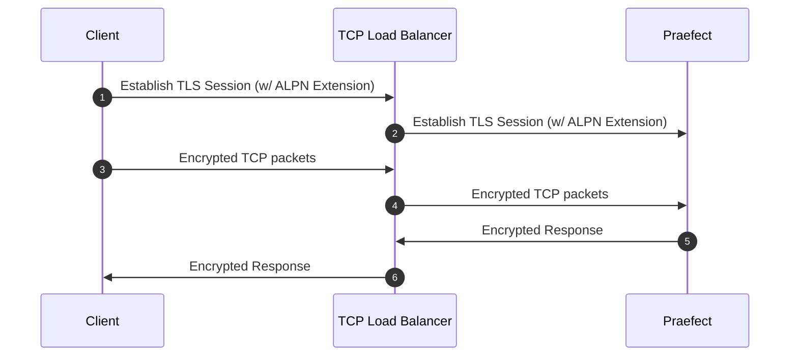
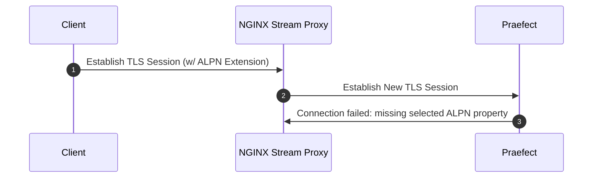

使用以下任一方式配置 Gitaly 集群 (Praefect)：

- 作为 [参考架构](../../reference_architectures/_index.md) 的一部分提供的 Gitaly 集群 (Praefect)配置说明，适用于以下规模的安装：
  - [60 RPS 或 3,000 用户](../../reference_architectures/3k_users.md#configure-gitaly-cluster-praefect)。
  - [100 RPS 或 5,000 用户](../../reference_architectures/5k_users.md#configure-gitaly-cluster-praefect)。
  - [200 RPS 或 10,000 用户](../../reference_architectures/10k_users.md#configure-gitaly-cluster-praefect)。
  - [500 RPS 或 25,000 用户](../../reference_architectures/25k_users.md#configure-gitaly-cluster-praefect)。
  - [1000 RPS 或 50,000 用户](../../reference_architectures/50k_users.md#configure-gitaly-cluster-praefect)。
- 本页后续的自定义配置说明。

较小的极狐GitLab 安装可能只需要 [Gitaly 本身](../_index.md)。

> [!note]
> Gitaly 集群 (Praefect)尚不支持在 Kubernetes、Amazon ECS 或类似的容器环境中使用。有关更多信息，请参阅
> [epic 6127](https://gitlab.com/groups/gitlab-org/-/work_items/6127)。

<a id="requirements"></a>

## 要求

Gitaly 集群 (Praefect)的最低推荐配置需要：

- 1 个负载均衡器
- 1 个 PostgreSQL 服务器（[受支持的版本](../../../install/requirements.md#postgresql)）
- 3 个 Praefect 节点
- 3 个 Gitaly 节点（1 个主节点，2 个从节点）

> [!note]
> [磁盘要求](../_index.md#disk-requirements) 适用于 Gitaly 节点。

您应配置奇数个 Gitaly 节点，以便在某个 Gitaly 节点在变更 RPC 调用中发生故障时，事务具有决胜机制。

有关实现细节，请参阅 [设计文档](https://gitlab.com/gitlab-org/gitaly/-/blob/master/doc/design_ha.md)。

> [!note]
> 如果未在极狐GitLab 中设置，功能标志将从控制台读取为 false，Praefect 将使用其默认值。默认值取决于极狐GitLab 版本。

<a id="network-latency-and-connectivity"></a>

### 网络延迟和连接

Gitaly 集群 (Praefect)的网络延迟理想情况下应保持在个位数毫秒级别。延迟对于以下方面尤为重要：

- Gitaly 节点健康检查。节点必须能够在 1 秒内响应。
- 强制执行 [强一致性](_index.md#strong-consistency) 的引用事务。较低的延迟意味着 Gitaly 节点可以更快地就变更达成一致。

在 Gitaly 节点之间实现可接受的延迟：

- 在物理网络上，通常意味着高带宽、单一位置的连接。
- 在云上，通常意味着位于同一区域，包括允许跨可用区复制。这些链路专为此类同步而设计。对于 Gitaly 集群 (Praefect)，低于 2 毫秒的延迟应足够。

如果您无法为复制提供低网络延迟（例如，在相距较远的位置之间），请考虑使用 Geo。有关更多信息，请参阅 [与 Geo 的比较](_index.md#comparison-to-geo)。

Gitaly 集群 (Praefect) [组件](_index.md#components) 通过多种路由相互通信。您的防火墙规则必须允许以下流量，Gitaly 集群 (Praefect)才能正常运行：

| 来源                   | 目标                     | 默认端口 | TLS 端口 |
|:-----------------------|:-----------------------|:-------------|:---------|
| 极狐GitLab                 | Praefect 负载均衡器 | `2305`       | `3305`   |
| Praefect 负载均衡器 | Praefect               | `2305`       | `3305`   |
| Praefect               | Gitaly                 | `8075`       | `9999`   |
| Praefect               | 极狐GitLab（内部 API）  | `80`         | `443`    |
| Gitaly                 | 极狐GitLab（内部 API）  | `80`         | `443`    |
| Gitaly                 | Praefect 负载均衡器 | `2305`       | `3305`   |
| Gitaly                 | Praefect               | `2305`       | `3305`   |
| Gitaly                 | Gitaly                 | `8075`       | `9999`   |

> [!note]
> Gitaly 不直接连接到 Praefect。但是，除非 Praefect 节点上的防火墙允许来自 Gitaly 节点的流量，否则从 Gitaly 到 Praefect 负载均衡器的请求仍可能被阻止。

<a id="praefect-database-storage"></a>

### Praefect 数据库存储

由于数据库仅包含以下内容的元数据，因此要求相对较低：

- 代码仓库的位置。
- 一些排队的工作。

这取决于代码仓库的数量，但一个良好的最低要求是 5-10 GB，与主极狐GitLab 应用程序数据库类似。

<a id="setup-instructions"></a>

## 设置说明

如果您使用 Linux 软件包[安装](https://gitlab.cn/install)了极狐GitLab（强烈推荐），请按照以下步骤操作：

1. [准备](#preparation)
1. [配置 Praefect 数据库](#postgresql)
1. [配置 Praefect 代理/路由器](#praefect)
1. [配置每个 Gitaly 节点](#gitaly)（每个 Gitaly 节点执行一次）
1. [配置负载均衡器](#load-balancer)
1. [更新极狐GitLab 服务器配置](#gitlab)
1. [配置 Grafana](#grafana)

<a id="preparation"></a>

### 准备

开始之前，您应该已经有一个可用的极狐GitLab 实例。
[了解如何安装极狐GitLab](https://gitlab.cn/install)。

准备一台 PostgreSQL 服务器。您应该使用 Linux 软件包自带的 PostgreSQL 来配置 PostgreSQL 数据库。您也可以使用外部 PostgreSQL 服务器，但必须[手动](#manual-database-setup)进行设置。

通过[安装极狐GitLab](https://gitlab.cn/install)准备所有新节点。您需要：

- 1 个 PostgreSQL 节点
- 1 个 PgBouncer 节点（可选）
- 至少 1 个 Praefect 节点（所需存储空间最小）
- 3 个 Gitaly 节点（高 CPU、高内存、快速存储）
- 1 个极狐GitLab 服务器

您还需要每个节点的 IP/主机地址：

1. `PRAEFECT_LOADBALANCER_HOST`：Praefect 负载均衡器的 IP/主机地址
1. `POSTGRESQL_HOST`：PostgreSQL 服务器的 IP/主机地址
1. `PGBOUNCER_HOST`：PostgreSQL 服务器的 IP/主机地址
1. `PRAEFECT_HOST`：Praefect 服务器的 IP/主机地址
1. `GITALY_HOST_*`：每个 Gitaly 服务器的 IP 或主机地址
1. `GITLAB_HOST`：极狐GitLab 服务器的 IP/主机地址

如果您使用的是 Google Cloud Platform、SoftLayer 或任何其他提供虚拟私有云（VPC）的供应商，您可以为每个云实例使用私有地址（对应 Google Cloud Platform 的“内部地址”）作为 `PRAEFECT_HOST`、`GITALY_HOST_*` 和 `GITLAB_HOST`。

<a id="secrets"></a>

#### 密钥

组件之间的通信使用不同的密钥进行保护，具体如下所述。开始之前，请为每个密钥生成一个唯一的密钥，并记录下来。这样您就可以在完成设置过程时，将这些占位符令牌替换为安全的令牌。

1. `GITLAB_SHELL_SECRET_TOKEN`：Git 钩子使用此令牌在接受 Git 推送时向极狐GitLab 发起回调 HTTP API 请求。出于遗留原因，此密钥与 GitLab Shell 共享。
1. `PRAEFECT_EXTERNAL_TOKEN`：托管在您的 Praefect 集群上的代码仓库只能由携带此令牌的 Gitaly 客户端访问。
1. `PRAEFECT_INTERNAL_TOKEN`：此令牌用于 Praefect 集群内部的复制流量。此令牌与 `PRAEFECT_EXTERNAL_TOKEN` 不同，因为 Gitaly 客户端不得直接访问 Praefect 集群的内部节点；这可能导致数据丢失。
1. `PRAEFECT_SQL_PASSWORD`：Praefect 使用此密码连接到 PostgreSQL。
1. `PRAEFECT_SQL_PASSWORD_HASH`：Praefect 用户密码的哈希值。使用 `gitlab-ctl pg-password-md5 praefect` 生成哈希。该命令会要求输入 `praefect` 用户的密码。请输入 `PRAEFECT_SQL_PASSWORD` 明文密码。默认情况下，Praefect 使用 `praefect` 用户，但您可以更改。
1. `PGBOUNCER_SQL_PASSWORD_HASH`：PgBouncer 用户密码的哈希值。PgBouncer 使用此密码连接到 PostgreSQL。更多详情请参阅[内置 PgBouncer](../../postgresql/pgbouncer.md) 文档。

我们在下面的说明中注明了这些密钥的使用位置。

> [!note]
> Linux 软件包安装可以使用 `gitlab-secrets.json` 中的 `GITLAB_SHELL_SECRET_TOKEN`。

<a id="customize-time-server-setting"></a>

### 自定义时间服务器设置

默认情况下，Gitaly 和 Praefect 节点使用 `pool.ntp.org` 的时间服务器进行时间同步检查。您可以通过在每个节点的 `gitlab.rb` 中添加以下内容来自定义此设置：

- `gitaly['env'] = { "NTP_HOST" => "ntp.example.com" }`，适用于 Gitaly 节点。
- `praefect['env'] = { "NTP_HOST" => "ntp.example.com" }`，适用于 Praefect 节点。

<a id="postgresql"></a>

### PostgreSQL

> [!note]
> Praefect 使用一个独立于极狐GitLab 应用数据库的数据库来管理 Gitaly 代码仓库的复制状态。当使用 [Geo](../../geo/_index.md) 和 Gitaly 集群 (Praefect)时，Praefect 复制状态对每个站点都是唯一的。每个 Geo 站点必须有一个独立的、可读写的 PostgreSQL 数据库实例来存放 Praefect 数据库。
>
> - 不要将极狐GitLab 应用数据库和 Praefect 数据库存储在同一台 PostgreSQL 服务器上。
> - 不要将 Geo 主站点上的 Praefect Postgres 数据库配置为复制到 Geo 从站点。

这些说明有助于设置单个 PostgreSQL 数据库，但这会形成单点故障。为避免这种情况，您可以配置自己的 PostgreSQL 集群。对其他数据库（例如 Praefect 和 Geo 数据库）的集群数据库支持已在
[议题 7292](https://gitlab.com/gitlab-org/omnibus-gitlab/-/issues/7292) 中提出。

以下选项可用：

- 对于非 Geo 安装，任选其一：
  - 使用文档中描述的 [PostgreSQL 设置](../../postgresql/_index.md)之一。
  - 使用您自己的第三方数据库设置。这需要[手动设置](#manual-database-setup)。
- 对于 Geo 实例，任选其一：
  - 设置一个独立的 [PostgreSQL 实例](https://www.postgresql.org/docs/16/high-availability.html)。
  - 使用云托管的 PostgreSQL 服务。推荐使用 AWS
    [关系数据库服务](https://aws.amazon.com/rds/)。

设置 PostgreSQL 会创建空的 Praefect 表。更多信息，请参阅
[相关故障排除部分](troubleshooting.md#relation-does-not-exist-errors)。

<a id="running-gitlab-and-praefect-databases-on-the-same-server"></a>

#### 在同一台服务器上运行极狐GitLab 和 Praefect 数据库

极狐GitLab 应用数据库和 Praefect 数据库可以在同一台服务器上运行。但是，当使用 Linux 软件包中的 PostgreSQL 时，Praefect 应该有自己的数据库服务器。如果发生故障转移，Praefect 不会感知，并会开始失败，因为它尝试使用的数据库要么：

- 不可用。
- 处于只读模式。

<a id="manual-database-setup"></a>

#### 手动数据库设置

要完成本节，您需要：

- 一个 Praefect 节点
- 一个 PostgreSQL 节点
  - 一个具有管理数据库服务器权限的 PostgreSQL 用户

在本节中，我们配置 PostgreSQL 数据库。这可用于外部和 Linux 软件包提供的 PostgreSQL 服务器。

要运行以下命令，您可以使用 Praefect 节点，Linux 软件包在该节点上安装了 `psql`（`/opt/gitlab/embedded/bin/psql`）。如果您使用 Linux 软件包提供的 PostgreSQL，则可以在 PostgreSQL 节点上使用 `gitlab-psql`：

1. 创建一个供 Praefect 使用的新用户 `praefect`：

   ```sql
   CREATE ROLE praefect WITH LOGIN PASSWORD 'PRAEFECT_SQL_PASSWORD';
   ```

   将 `PRAEFECT_SQL_PASSWORD` 替换为您在准备步骤中生成的强密码。

1. 创建一个由 `praefect` 用户拥有的新数据库 `praefect_production`。

   ```sql
   CREATE DATABASE praefect_production WITH OWNER praefect ENCODING UTF8;
   ```

当使用 Linux 软件包提供的 PgBouncer 时，您需要执行以下额外步骤。我们强烈建议使用 Linux 软件包自带的 PostgreSQL 作为后端。以下说明仅适用于 Linux 软件包提供的 PostgreSQL：

1. 对于 Linux 软件包提供的 PgBouncer，您需要使用 `praefect` 密码的哈希值而不是实际密码：

   ```sql
   ALTER ROLE praefect WITH PASSWORD 'md5<PRAEFECT_SQL_PASSWORD_HASH>';
   ```

   将 `<PRAEFECT_SQL_PASSWORD_HASH>` 替换为您在准备步骤中生成的密码哈希值。它以 `md5` 字面量为前缀。

1. 创建一个供 PgBouncer 使用的新用户 `pgbouncer`：

   ```sql
   CREATE ROLE pgbouncer WITH LOGIN;
   ALTER USER pgbouncer WITH password 'md5<PGBOUNCER_SQL_PASSWORD_HASH>';
   ```

   将 `PGBOUNCER_SQL_PASSWORD_HASH` 替换为您在准备步骤中生成的强密码哈希值。

1. Linux 软件包自带的 PgBouncer 配置为使用 [`auth_query`](https://www.pgbouncer.org/config.html#generic-settings) 并使用 `pg_shadow_lookup` 函数。您需要在 `praefect_production` 数据库中创建此函数：

   ```sql
   CREATE OR REPLACE FUNCTION public.pg_shadow_lookup(in i_username text, out username text, out password text) RETURNS record AS $$
   BEGIN
       SELECT usename, passwd FROM pg_catalog.pg_shadow
       WHERE usename = i_username INTO username, password;
       RETURN;
   END;
   $$ LANGUAGE plpgsql SECURITY DEFINER;

   REVOKE ALL ON FUNCTION public.pg_shadow_lookup(text) FROM public, pgbouncer;
   GRANT EXECUTE ON FUNCTION public.pg_shadow_lookup(text) TO pgbouncer;
   ```

Praefect 使用的数据库现已配置完成。

您现在可以配置 Praefect 以使用该数据库：

```ruby
praefect['configuration'] = {
   # ...
   database: {
      # ...
      host: POSTGRESQL_HOST,
      user: 'praefect',
      port: 5432,
      password: PRAEFECT_SQL_PASSWORD,
      dbname: 'praefect_production',
   }
}
```

如果在配置 PostgreSQL 后看到 Praefect 数据库错误，请参阅
[故障排除步骤](troubleshooting.md#relation-does-not-exist-errors)。

<a id="configure-automatic-failover-with-a-self-managed-patroni-cluster"></a>

#### 使用自管理的 Patroni 集群配置自动故障转移

完成[手动数据库设置](#manual-database-setup)后，您可以将 Praefect 直接指向由 [Patroni](https://patroni.readthedocs.io) 等故障转移工具管理的 PostgreSQL 集群。Praefect 使用 [`pgx`](https://github.com/jackc/pgx) 连接到 PostgreSQL，它支持与 libpq 相同的多主机连接行为：Praefect 探测地址列表中的每个主机，并连接到当前接受写入的主机，在故障转移后自动重新连接。

在此配置下，不要在 PostgreSQL 集群前面放置代理。这种客户端故障转移检测与用于 [极狐GitLab 应用数据库](../../postgresql/replication_and_failover.md)的设置不同，后者在集群前面放置 PgBouncer 或基于 Consul 的路由等代理，并执行自己的服务端切换。将两者结合意味着代理对 Praefect 隐藏了各个集群节点，因此 `pgx` 无法再直接探测每个节点，或者代理自身的故障转移会与 Praefect 的客户端检测产生竞争。

此配置尚未由 GitLab 在 JihuLab.com 或 Dedicated 环境中部署或测试。在依赖它之前，请务必在非生产环境中彻底验证。

> [!warning]
> 将集群配置为使用[同步复制](https://patroni.readthedocs.io/en/latest/replication_modes.html#postgresql-synchronous-replication)。
> 使用异步复制时，丢失主节点的故障转移也可能丢失已提交但尚未复制的事务，这可能会使 Praefect 数据库处于 Gitaly 不期望的状态。

先决条件：

- 已针对集群完成[手动数据库设置](#manual-database-setup)。
- 一个由 Patroni 或等效工具（可自动提升新主节点）管理的 PostgreSQL 集群，运行在专用于 Praefect 数据库的服务器上，并配置为同步复制。您可以使用与
  [极狐GitLab 应用数据库](../../postgresql/replication_and_failover.md)相同的 Patroni、Consul 和 PostgreSQL 组件，在一组独立的节点上构建此集群。
- 从 Praefect 节点到集群中每个节点的网络访问。

要配置 Praefect：

1. 在 Praefect 配置中，将 `database.host` 设置为集群节点地址的逗号分隔列表，并将 `database.port` 设置为所有节点共享的端口：

   ```ruby
   praefect['configuration'] = {
      # ...
      database: {
         # ...
         host: 'POSTGRESQL_HOST_1,POSTGRESQL_HOST_2,POSTGRESQL_HOST_3',
         port: 5432,
         user: 'praefect',
         password: PRAEFECT_SQL_PASSWORD,
         dbname: 'praefect_production',
      }
   }
   ```

1. 为 Praefect 进程设置 `PGTARGETSESSIONATTRS` 环境变量为 `read-write`，以便连接到当前主节点。Praefect 配置没有专门用于 `PGTARGETSESSIONATTRS` 的设置，因此请通过 Praefect 环境设置该变量。直接设置该键，而不是分配整个 `env` 哈希，这样不会移除 Praefect 现有的默认环境变量：

   ```ruby
   praefect['env']['PGTARGETSESSIONATTRS'] = 'read-write'
   ```

1. 重新配置以使更改生效：

   ```shell
   gitlab-ctl reconfigure
   ```

此配置仅涵盖 Praefect 与 PostgreSQL 之间的直接连接。如果您还配置了 [`session_pooled` 设置](#reads-distribution-caching)以使用 PgBouncer，则必须单独使 PgBouncer 高可用。`session_pooled` 设置仅接受单个主机，因此 PgBouncer 连接不参与此故障转移机制。

<a id="reads-distribution-caching"></a>

#### 读分布缓存

通过额外配置 `session_pooled` 设置，可以提升 Praefect 性能：

```ruby
praefect['configuration'] = {
   # ...
   database: {
      # ...
      session_pooled: {
         # ...
         host: POSTGRESQL_HOST,
         port: 5432

         # Use the following to override parameters of direct database connection.
         # Comment out where the parameters are the same for both connections.
         user: 'praefect',
         password: PRAEFECT_SQL_PASSWORD,
         dbname: 'praefect_production',
         # sslmode: '...',
         # sslcert: '...',
         # sslkey: '...',
         # sslrootcert: '...',
      }
   }
}
```

配置后，此连接会自动用于 [SQL LISTEN](https://www.postgresql.org/docs/16/sql-listen.html) 功能，并允许 Praefect 从 PostgreSQL 接收缓存失效通知。

通过在 Praefect 日志中查找以下日志条目来验证此功能是否正常工作：

```plaintext
reads distribution caching is enabled by configuration
```

<a id="use-pgbouncer"></a>

#### 使用 PgBouncer

为减少 PostgreSQL 资源消耗，您应该在 PostgreSQL 实例前设置并配置 [PgBouncer](https://www.pgbouncer.org/)。但是，PgBouncer 不是必需的，因为 Praefect 建立的连接数较少。如果您选择使用 PgBouncer，可以为极狐GitLab 应用数据库和 Praefect 数据库使用同一个 PgBouncer 实例。

要在 PostgreSQL 实例前配置 PgBouncer，您必须通过在 Praefect 配置上设置数据库参数，将 Praefect 指向 PgBouncer：

```ruby
praefect['configuration'] = {
   # ...
   database: {
      # ...
      host: PGBOUNCER_HOST,
      port: 6432,
      user: 'praefect',
      password: PRAEFECT_SQL_PASSWORD,
      dbname: 'praefect_production',
      # sslmode: '...',
      # sslcert: '...',
      # sslkey: '...',
      # sslrootcert: '...',
   }
}
```

Praefect 需要一个额外的 PostgreSQL 连接来支持 [LISTEN](https://www.postgresql.org/docs/16/sql-listen.html) 功能。使用 PgBouncer 时，此功能仅在 `session` 池模式下可用（`pool_mode = session`）。在 `transaction` 池模式下不支持（`pool_mode = transaction`）。

要配置额外的连接，您必须：

- 配置一个新的 PgBouncer 数据库，连接到同一个 PostgreSQL 数据库端点，但使用不同的池模式（`pool_mode = session`）。
- 将 Praefect 直接连接到 PostgreSQL 并绕过 PgBouncer。

<a id="configure-a-new-pgbouncer-database-with-pool_mode--session"></a>

##### 使用 `pool_mode = session` 配置新的 PgBouncer 数据库

您应该使用 `session` 池模式的 PgBouncer。您可以使用[内置 PgBouncer](../../postgresql/pgbouncer.md) 或使用外部 PgBouncer 并[手动配置](https://www.pgbouncer.org/config.html)。

以下示例使用内置 PgBouncer，并在 PostgreSQL 主机上设置两个独立的连接池，一个使用 `session` 池模式，另一个使用 `transaction` 池模式。要使此示例生效，您需要按照[设置说明](#manual-database-setup)中的文档准备 PostgreSQL 服务器。

然后，在 PgBouncer 主机上配置独立的连接池：

```ruby
pgbouncer['databases'] = {
  # Other database configuration including gitlabhq_production
  ...

  praefect_production: {
    host: POSTGRESQL_HOST,
    # Use `pgbouncer` user to connect to database backend.
    user: 'pgbouncer',
    password: PGBOUNCER_SQL_PASSWORD_HASH,
    pool_mode: 'transaction'
  },
  praefect_production_direct: {
    host: POSTGRESQL_HOST,
    # Use `pgbouncer` user to connect to database backend.
    user: 'pgbouncer',
    password: PGBOUNCER_SQL_PASSWORD_HASH,
    dbname: 'praefect_production',
    pool_mode: 'session'
  },

  ...
}

# Allow the praefect user to connect to PgBouncer
pgbouncer['users'] = {
  'praefect': {
    'password': PRAEFECT_SQL_PASSWORD_HASH,
  }
}
```

`praefect_production` 和 `praefect_production_direct` 都使用相同的数据库端点（`praefect_production`），但使用不同的池模式。这对应于 PgBouncer 的以下 `databases` 部分：

```ini
[databases]
praefect_production = host=POSTGRESQL_HOST auth_user=pgbouncer pool_mode=transaction
praefect_production_direct = host=POSTGRESQL_HOST auth_user=pgbouncer dbname=praefect_production pool_mode=session
```

现在您可以配置 Praefect 为两种连接都使用 PgBouncer：

```ruby
praefect['configuration'] = {
   # ...
   database: {
      # ...
      host: PGBOUNCER_HOST,
      port: 6432,
      user: 'praefect',
      # `PRAEFECT_SQL_PASSWORD` is the plain-text password of
      # Praefect user. Not to be confused with `PRAEFECT_SQL_PASSWORD_HASH`.
      password: PRAEFECT_SQL_PASSWORD,
      dbname: 'praefect_production',
      session_pooled: {
         # ...
         dbname: 'praefect_production_direct',
         # There is no need to repeat the following. Parameters of direct
         # database connection will fall back to the values specified in the
         # database block.
         #
         # host: PGBOUNCER_HOST,
         # port: 6432,
         # user: 'praefect',
         # password: PRAEFECT_SQL_PASSWORD,
      },
   },
}
```

使用此配置，Praefect 对两种连接类型都使用 PgBouncer。

> [!note]
> Linux 软件包安装会处理身份验证要求（使用 `auth_query`），但如果您手动准备数据库并配置外部 PgBouncer，则必须在 PgBouncer 使用的文件中包含 `praefect` 用户及其密码。例如，如果设置了 [`auth_file`](https://www.pgbouncer.org/config.html#auth_file) 配置选项，则为 `userlist.txt`。更多详情，请查阅 PgBouncer 文档。

<a id="configure-praefect-to-connect-directly-to-postgresql"></a>

##### 配置 Praefect 直接连接到 PostgreSQL

作为使用 `session` 池模式配置 PgBouncer 的替代方案，可以将 Praefect 配置为使用不同的连接参数直接访问 PostgreSQL。此连接支持 `LISTEN` 功能。

绕过 PgBouncer 直接连接到 PostgreSQL 的 Praefect 配置示例：

```ruby
praefect['configuration'] = {
   # ...
   database: {
      # ...
      session_pooled: {
         # ...
         host: POSTGRESQL_HOST,
         port: 5432,

         # Use the following to override parameters of direct database connection.
         # Comment out where the parameters are the same for both connections.
         #
         user: 'praefect',
         password: PRAEFECT_SQL_PASSWORD,
         dbname: 'praefect_production',
         # sslmode: '...',
         # sslcert: '...',
         # sslkey: '...',
         # sslrootcert: '...',
      },
   },
}
```

<a id="praefect"></a>

### Praefect

在配置 Praefect 之前，请参阅
[Praefect 配置示例文件](https://gitlab.com/gitlab-org/gitaly/-/blob/master/config.praefect.toml.example)以熟悉配置。如果您使用 Linux 软件包安装极狐GitLab，则必须将示例文件中的设置转换为 Ruby。

如果有多个 Praefect 节点：

1. 指定一个节点作为部署节点，并使用以下步骤进行配置。
1. 对每个其他节点完成以下步骤。

要完成本节，您需要一个[已配置的 PostgreSQL 服务器](#postgresql)，包括：

> [!warning]
> Praefect 应在专用节点上运行。不要在应用服务器或 Gitaly 节点上运行 Praefect。

在 Praefect 节点上：

1. 通过编辑 `/etc/gitlab/gitlab.rb` 禁用所有其他服务：

<!--
Updates to example must be made at:

- <https://gitlab.com/gitlab-org/gitlab/-/blob/master/doc/administration/gitaly/configure_gitaly.md#configure-gitaly-server>
- All reference architecture pages
-->

   ```ruby
   # Avoid running unnecessary services on the Praefect server
   gitaly['enable'] = false
   postgresql['enable'] = false
   redis['enable'] = false
   nginx['enable'] = false
   puma['enable'] = false
   sidekiq['enable'] = false
   gitlab_workhorse['enable'] = false
   prometheus['enable'] = false
   alertmanager['enable'] = false
   gitlab_exporter['enable'] = false
   gitlab_kas['enable'] = false

   # Enable only the Praefect service
   praefect['enable'] = true

   # Prevent database migrations from running on upgrade automatically
   praefect['auto_migrate'] = false
   gitlab_rails['auto_migrate'] = false
   ```

1. 通过编辑 `/etc/gitlab/gitlab.rb` 配置 Praefect 监听网络接口：

   ```ruby
   praefect['configuration'] = {
      # ...
      listen_addr: '0.0.0.0:2305',
   }
   ```

1. 通过编辑 `/etc/gitlab/gitlab.rb` 配置 Prometheus 指标：

   ```ruby
   praefect['configuration'] = {
      # ...
      #
      # Enable Prometheus metrics access to Praefect. You must use firewalls
      # to restrict access to this address/port.
      # The default metrics endpoint is /metrics
      prometheus_listen_addr: '0.0.0.0:9652',
      # Some metrics run queries against the database. Enabling separate database metrics allows
      # these metrics to be collected when the metrics are
      # scraped on a separate /db_metrics endpoint.
      prometheus_exclude_database_from_default_metrics: true,
   }
   ```

1. 通过编辑 `/etc/gitlab/gitlab.rb` 为 Praefect 配置一个强身份验证令牌，集群外部的客户端（如 GitLab Shell）需要此令牌才能与 Praefect 集群通信：

   ```ruby
   praefect['configuration'] = {
      # ...
      auth: {
         # ...
         token: 'PRAEFECT_EXTERNAL_TOKEN',
      },
   }
   ```

1. 配置 Praefect 以[连接到 PostgreSQL 数据库](#postgresql)。我们强烈建议同时使用 [PgBouncer](#use-pgbouncer)。

   如果您想使用 TLS 客户端证书，可以使用以下选项：

   ```ruby
   praefect['configuration'] = {
      # ...
      database: {
         # ...
         #
         # Connect to PostgreSQL using a TLS client certificate
         # sslcert: '/path/to/client-cert',
         # sslkey: '/path/to/client-key',
         #
         # Trust a custom certificate authority
         # sslrootcert: '/path/to/rootcert',
      },
   }
   ```

   默认情况下，Praefect 使用机会性 TLS 连接到 PostgreSQL。这意味着 Praefect 尝试使用设置为 `prefer` 的 `sslmode` 连接到 PostgreSQL。您可以通过取消注释以下行来覆盖此设置：

   ```ruby
   praefect['configuration'] = {
      # ...
      database: {
         # ...
         # sslmode: 'disable',
      },
   }
   ```

1. 通过编辑 `/etc/gitlab/gitlab.rb` 配置 Praefect 集群以连接到集群中的每个 Gitaly 节点。

   虚拟存储的名称必须与极狐GitLab 配置中配置的存储名称匹配。在后续步骤中，我们将存储名称配置为 `default`，因此我们在这里也使用 `default`。此集群有三个 Gitaly 节点 `gitaly-1`、`gitaly-2` 和 `gitaly-3`，它们旨在互为副本。

   > [!warning]
   > 如果您在已存在的名为 `default` 的存储上有数据，您应该使用其他名称配置虚拟存储，并随后[将数据迁移到 Gitaly 集群 (Praefect)存储](_index.md#migrate-to-gitaly-cluster-praefect)。

   将 `PRAEFECT_INTERNAL_TOKEN` 替换为强密钥，Praefect 在与集群中的 Gitaly 节点通信时使用此密钥。此令牌与 `PRAEFECT_EXTERNAL_TOKEN` 不同。

   将 `GITALY_HOST_*` 替换为每个 Gitaly 节点的 IP 或主机地址。

   可以向集群添加更多 Gitaly 节点以增加副本数量。对于非常大的极狐GitLab 实例，也可以添加更多集群。

   > [!note]
   > 向虚拟存储添加额外的 Gitaly 节点时，该虚拟存储中的所有存储名称必须唯一。此外，Praefect 配置中引用的所有 Gitaly 节点地址必须唯一。

   ```ruby
   # Name of storage hash must match storage name in gitlab_rails['repositories_storages'] on GitLab
   # server ('default') and in gitaly['configuration'][:storage][INDEX][:name] on Gitaly nodes ('gitaly-1')
   praefect['configuration'] = {
      # ...
      virtual_storage: [
         {
            # ...
            name: 'default',
            node: [
               {
                  storage: 'gitaly-1',
                  address: 'tcp://GITALY_HOST_1:8075',
                  token: 'PRAEFECT_INTERNAL_TOKEN'
               },
               {
                  storage: 'gitaly-2',
                  address: 'tcp://GITALY_HOST_2:8075',
                  token: 'PRAEFECT_INTERNAL_TOKEN'
               },
               {
                  storage: 'gitaly-3',
                  address: 'tcp://GITALY_HOST_3:8075',
                  token: 'PRAEFECT_INTERNAL_TOKEN'
               },
            ],
         },
      ],
   }
   ```

1. 保存对 `/etc/gitlab/gitlab.rb` 的更改并[重新配置 Praefect](../../restart_gitlab.md#reconfigure-a-linux-package-installation)：

   ```shell
   gitlab-ctl reconfigure
   ```

1. 对于：

   - “部署节点”：
     1. 通过在 `/etc/gitlab/gitlab.rb` 中设置 `praefect['auto_migrate'] = true` 再次启用 Praefect 数据库自动迁移。
     1. 为确保数据库迁移仅在重新配置期间运行，而不是在升级时自动运行，请执行：

        ```shell
        sudo touch /etc/gitlab/skip-auto-reconfigure
        ```

   - 其他节点，您可以保持设置不变。虽然 `/etc/gitlab/skip-auto-reconfigure` 不是必需的，但您可能希望设置它以防止极狐GitLab 在运行诸如 `apt-get update` 等命令时自动运行重新配置。这样，您可以进行任何额外的配置更改，然后手动运行重新配置。

1. 保存对 `/etc/gitlab/gitlab.rb` 的更改并[重新配置 Praefect](../../restart_gitlab.md#reconfigure-a-linux-package-installation)：

   ```shell
   gitlab-ctl reconfigure
   ```

1. 为确保 Praefect [已更新其 Prometheus 监听地址](https://gitlab.com/gitlab-org/gitaly/-/issues/2734)，请[重启 Praefect](../../restart_gitlab.md#reconfigure-a-linux-package-installation)：

   ```shell
   gitlab-ctl restart praefect
   ```

1. 验证 Praefect 是否可以访问 PostgreSQL：

   ```shell
   sudo -u git -- /opt/gitlab/embedded/bin/praefect -config /var/opt/gitlab/praefect/config.toml sql-ping
   ```

   如果检查失败，请确保您已正确完成这些步骤。如果您编辑了 `/etc/gitlab/gitlab.rb`，请记得在尝试 `sql-ping` 命令前再次运行 `sudo gitlab-ctl reconfigure`。

<a id="enable-tls-support"></a>

#### 启用 TLS 支持

Praefect 支持 TLS 加密。要与监听安全连接的 Praefect 实例通信，您必须：

- 确保 Gitaly 已[为 TLS 配置](../tls_support.md)，并在极狐GitLab 配置中相应存储条目的 `gitaly_address` 中使用 `tls://` URL 方案。
- 自带证书，因为此功能不会自动提供。与每个 Praefect 服务器对应的证书必须安装在该 Praefect 服务器上。

此外，证书或其证书颁发机构必须按照 [极狐GitLab 自定义证书配置](https://gitlab.cn/docs/omnibus/settings/ssl/#install-custom-public-certificates)（并在下面重复）中描述的过程，安装在所有 Gitaly 服务器和所有与之通信的 Praefect 客户端上。

请注意以下几点：

- 证书必须指定您用于访问 Praefect 服务器的地址。您必须将主机名或 IP 地址作为主题备用名称添加到证书中。
- 在命令行使用 [Gitaly TLS 已启用](../tls_support.md)运行 Praefect 子命令（如 `dial-nodes` 和 `list-untracked-repositories`）时，您必须设置 `SSL_CERT_DIR` 或 `SSL_CERT_FILE` 环境变量，以便信任 Gitaly 证书。例如：

  ```shell
  SSL_CERT_DIR=/etc/gitlab/trusted-certs sudo -u git -- /opt/gitlab/embedded/bin/praefect -config /var/opt/gitlab/praefect/config.toml dial-nodes
  ```

- 您可以同时为 Praefect 服务器配置未加密的监听地址 `listen_addr` 和加密的监听地址 `tls_listen_addr`。这样，如有必要，您可以逐步从未加密流量过渡到加密流量。

  要禁用未加密的监听器，请设置：

  ```ruby
  praefect['configuration'] = {
    # ...
    listen_addr: nil,
  }
  ```

使用 TLS 配置 Praefect。

对于 Linux 软件包安装：

1. 为 Praefect 服务器创建证书。
1. 在 Praefect 服务器上，创建 `/etc/gitlab/ssl` 目录并将您的密钥和证书复制到那里：

   ```shell
   sudo mkdir -p /etc/gitlab/ssl
   sudo chmod 755 /etc/gitlab/ssl
   sudo cp key.pem cert.pem /etc/gitlab/ssl/
   sudo chmod 644 key.pem cert.pem
   ```

1. 编辑 `/etc/gitlab/gitlab.rb` 并添加：

   ```ruby
   praefect['configuration'] = {
      # ...
      tls_listen_addr: '0.0.0.0:3305',
      tls: {
         # ...
         certificate_path: '/etc/gitlab/ssl/cert.pem',
         key_path: '/etc/gitlab/ssl/key.pem',
      },
   }
   ```

1. 保存文件并[重新配置](../../restart_gitlab.md#reconfigure-a-linux-package-installation)。
1. 在 Praefect 客户端（包括每个 Gitaly 服务器）上，将证书或其证书颁发机构复制到 `/etc/gitlab/trusted-certs`：

   ```shell
   sudo cp cert.pem /etc/gitlab/trusted-certs/
   ```

1. 在 Praefect 客户端（Gitaly 服务器除外）上，按如下方式编辑 `/etc/gitlab/gitlab.rb` 中的 `gitlab_rails['repositories_storages']`：

   ```ruby
   gitlab_rails['repositories_storages'] = {
     "default" => {
       "gitaly_address" => 'tls://PRAEFECT_LOADBALANCER_HOST:3305',
       "gitaly_token" => 'PRAEFECT_EXTERNAL_TOKEN'
     }
   }
   ```

1. 保存文件并[重新配置极狐GitLab](../../restart_gitlab.md#reconfigure-a-linux-package-installation)。

对于自编译安装：

1. 为 Praefect 服务器创建证书。
1. 在 Praefect 服务器上，创建 `/etc/gitlab/ssl` 目录并将您的密钥和证书复制到那里：

   ```shell
   sudo mkdir -p /etc/gitlab/ssl
   sudo chmod 755 /etc/gitlab/ssl
   sudo cp key.pem cert.pem /etc/gitlab/ssl/
   sudo chmod 644 key.pem cert.pem
   ```

1. 在 Praefect 客户端（包括每个 Gitaly 服务器）上，将证书或其证书颁发机构复制到系统受信任的证书中：

   ```shell
   sudo cp cert.pem /usr/local/share/ca-certificates/praefect.crt
   sudo update-ca-certificates
   ```

1. 在 Praefect 客户端（Gitaly 服务器除外）上，按如下方式编辑 `/home/git/gitlab/config/gitlab.yml` 中的 `storages`：

   ```yaml
   gitlab:
     repositories:
       storages:
         default:
           gitaly_address: tls://PRAEFECT_LOADBALANCER_HOST:3305
   ```

1. 保存文件并[重启极狐GitLab](../../restart_gitlab.md#self-compiled-installations)。
1. 将所有 Praefect 服务器证书或其证书颁发机构复制到每个 Gitaly 服务器上的系统受信任证书中，以便 Gitaly 服务器调用 Praefect 服务器时，Praefect 服务器信任该证书：

   ```shell
   sudo cp cert.pem /usr/local/share/ca-certificates/praefect.crt
   sudo update-ca-certificates
   ```

1. 编辑 `/home/git/praefect/config.toml` 并添加：

   ```toml
   tls_listen_addr = '0.0.0.0:3305'

   [tls]
   certificate_path = '/etc/gitlab/ssl/cert.pem'
   key_path = '/etc/gitlab/ssl/key.pem'
   ```

1. 保存文件并[重启极狐GitLab](../../restart_gitlab.md#self-compiled-installations)。

<a id="service-discovery"></a>

#### 服务发现

先决条件：

- 一个 DNS 服务器。

极狐GitLab 使用服务发现来获取 Praefect 主机列表。服务发现涉及定期检查 DNS A 或 AAAA 记录，从记录中检索到的 IP 作为目标节点的地址。Praefect 不支持通过 SRV 记录进行服务发现。

默认情况下，检查之间的最短时间为 5 分钟，与记录的 TTL 无关。Praefect 不支持自定义此间隔。当客户端收到更新时，它们会：

- 与新的 IP 地址建立新连接。
- 保持与未变 IP 地址的现有连接。
- 断开与已移除 IP 地址的连接。

对即将移除的连接上的进行中请求仍会处理直至完成。Workhorse 有 10 分钟的超时，而其他客户端未指定优雅超时。

DNS 服务器应返回所有 IP 地址，而不是自行负载均衡。客户端可以以轮询方式将请求分发到各个 IP 地址。

在更新客户端配置之前，请确保 DNS 服务发现正常工作。它应该正确返回 IP 地址列表。`dig` 是用于验证的好工具。

```console
❯ dig A praefect.service.consul @127.0.0.1

; <<>> DiG 9.10.6 <<>> A praefect.service.consul @127.0.0.1
;; global options: +cmd
;; Got answer:
;; ->>HEADER<<- opcode: QUERY, status: NOERROR, id: 29210
;; flags: qr aa rd ra; QUERY: 1, ANSWER: 3, AUTHORITY: 0, ADDITIONAL: 1

;; OPT PSEUDOSECTION:
; EDNS: version: 0, flags:; udp: 4096
;; QUESTION SECTION:
;praefect.service.consul.                     IN      A

;; ANSWER SECTION:
praefect.service.consul.              0       IN      A       10.0.0.3
praefect.service.consul.              0       IN      A       10.0.0.2
praefect.service.consul.              0       IN      A       10.0.0.1

;; Query time: 0 msec
;; SERVER: ::1#53(::1)
;; WHEN: Wed Dec 14 12:53:58 +07 2022
;; MSG SIZE  rcvd: 86
```

<a id="configure-service-discovery"></a>

##### 配置服务发现

默认情况下，Praefect 将 DNS 解析委托给操作系统。在这种情况下，Gitaly 地址可以设置为以下任一格式：

- `dns:[host]:[port]`
- `dns:///[host]:[port]`（注意三个斜杠）

您还可以通过以下格式指定权威名称服务器：

- `dns://[authority_host]:[authority_port]/[host]:[port]`

要将服务发现与 TLS 加密一起使用，请使用 `dns+tls` 方案：

- `dns+tls:[host]:[port]`（简写形式）
- `dns+tls:///[host]:[port]`（注意三个斜杠）
- `dns+tls://[authority_host]:[authority_port]/[host]:[port]`

`dns+tls://` 方案结合了基于 DNS 的服务发现与 TLS 加密。使用此方案前，您必须在 Praefect 服务器上配置 TLS。更多信息，请参阅[启用 TLS](#enable-tls-support)。

每个 Praefect 端点的 TLS 证书必须包含一个与下面 `PRAEFECT_SERVICE_DISCOVERY_ADDRESS` 中使用的主机名匹配的主题备用名称（SAN）。例如，如果地址是 `dns+tls:///praefect.service.consul:3305`，则每个 Praefect 节点的证书必须将 `praefect.service.consul` 作为 SAN 条目。如果 SAN 不匹配，连接将失败。





1. 将每个 Praefect 节点的 IP 地址添加到 DNS 服务发现地址。
1. 在 Praefect 客户端（Gitaly 服务器除外）上，按如下方式编辑 `/etc/gitlab/gitlab.rb` 中的 `gitlab_rails['repositories_storages']`。将 `PRAEFECT_SERVICE_DISCOVERY_ADDRESS` 替换为 Praefect 服务发现地址，例如 `praefect.service.consul`。

   ```ruby
   gitlab_rails['repositories_storages'] = {
     "default" => {
       "gitaly_address" => 'dns:PRAEFECT_SERVICE_DISCOVERY_ADDRESS:2305',
       "gitaly_token" => 'PRAEFECT_EXTERNAL_TOKEN'
     }
   }
   ```

   要使用 TLS，请将方案更改为 `dns+tls://`：

   ```ruby
   gitlab_rails['repositories_storages'] = {
     "default" => {
       "gitaly_address" => 'dns+tls://DNS_SERVER_ADDRESS:53/PRAEFECT_SERVICE_DISCOVERY_ADDRESS:3305',
       "gitaly_token" => 'PRAEFECT_EXTERNAL_TOKEN'
     }
   }
   ```

1. 保存文件并[重新配置极狐GitLab](../../restart_gitlab.md#reconfigure-a-linux-package-installation)。





1. 安装 DNS 服务发现服务。向该服务注册所有 Praefect 节点。
1. 在 Praefect 客户端（Gitaly 服务器除外）上，按如下方式编辑 `/home/git/gitlab/config/gitlab.yml` 中的 `storages`：

   ```yaml
   gitlab:
     repositories:
       storages:
         default:
           gitaly_address: dns:PRAEFECT_SERVICE_DISCOVERY_ADDRESS:2305
   ```

   要使用 TLS，请将方案更改为 `dns+tls://`：

   ```yaml
   gitlab:
     repositories:
       storages:
         default:
           gitaly_address: dns+tls://DNS_SERVER_ADDRESS:53/PRAEFECT_SERVICE_DISCOVERY_ADDRESS:3305
   ```

1. 保存文件并[重启极狐GitLab](../../restart_gitlab.md#self-compiled-installations)。





<a id="configure-service-discovery-with-consul"></a>

##### 使用 Consul 配置服务发现

如果您的架构中已有 Consul 服务器，则可以在每个 Praefect 节点上添加 Consul agent，并向其注册 `praefect` 服务。这会将每个节点的 IP 地址注册到 `praefect.service.consul`，以便通过服务发现找到它。

先决条件：

- 一个或多个 [Consul](../../consul.md) 服务器来跟踪 Consul agent。

1. 在每个 Praefect 服务器上，将以下内容添加到您的 `/etc/gitlab/gitlab.rb`：

   ```ruby
   consul['enable'] = true
   praefect['consul_service_name'] = 'praefect'

   # The following must also be added until this issue is addressed:
   # https://gitlab.com/gitlab-org/omnibus-gitlab/-/issues/8321
   consul['monitoring_service_discovery'] = true
   praefect['configuration'] = {
     # ...
     #
     prometheus_listen_addr: '0.0.0.0:9652',
   }
   ```

1. 保存文件并[重新配置极狐GitLab](../../restart_gitlab.md#reconfigure-a-linux-package-installation)。
1. 在每个 Praefect 服务器上重复上述步骤以用于服务发现。
1. 在 Praefect 客户端（Gitaly 服务器除外）上，按如下方式编辑 `/etc/gitlab/gitlab.rb` 中的 `gitlab_rails['repositories_storages']`。将 `CONSUL_SERVER` 替换为 Consul 服务器的 IP 或地址。默认的 Consul DNS 端口是 `8600`。

   ```ruby
   gitlab_rails['repositories_storages'] = {
     "default" => {
       "gitaly_address" => 'dns://CONSUL_SERVER:8600/praefect.service.consul:2305',
       "gitaly_token" => 'PRAEFECT_EXTERNAL_TOKEN'
     }
   }
   ```

1. 使用 `dig` 从 Praefect 客户端确认每个 IP 地址都已注册到 `praefect.service.consul`，使用命令 `dig A praefect.service.consul @CONSUL_SERVER -p 8600`。将 `CONSUL_SERVER` 替换为之前配置的值，输出中应显示所有 Praefect 节点 IP 地址。
1. 保存文件并[重新配置极狐GitLab](../../restart_gitlab.md#reconfigure-a-linux-package-installation)。

<a id="gitaly"></a>

### Gitaly

> [!note]
> 为每个 Gitaly 节点完成这些步骤。

要完成本节，您需要：

- [已配置的 Praefect 节点](#praefect)
- 3 个（或更多）已安装极狐GitLab 的服务器，将配置为 Gitaly 节点。这些应该是专用节点，不要在这些节点上运行其他服务。

分配给 Praefect 集群的每个 Gitaly 服务器都需要配置。配置与标准的[独立 Gitaly 服务器](_index.md)相同，除了：

- 存储名称暴露给 Praefect，而不是极狐GitLab
- 密钥令牌与 Praefect 共享，而不是极狐GitLab

Praefect 集群中所有 Gitaly 节点的配置可以相同，因为我们依赖 Praefect 来正确路由操作。

应特别注意：

- 本节中配置的 `gitaly['configuration'][:auth][:token]` 必须与 Praefect 节点上 `praefect['configuration'][:virtual_storage][<index>][:node][<index>][:token]` 下的 `token` 值匹配。此值在[上一节](#praefect)中设置。本文档通篇使用占位符 `PRAEFECT_INTERNAL_TOKEN`。
- 本节中配置的 `gitaly['configuration'][:storage]` 中的物理存储名称必须与 Praefect 节点上 `praefect['configuration'][:virtual_storage]` 下的物理存储名称匹配。这在[上一节](#praefect)中设置。本文档使用 `gitaly-1`、`gitaly-2` 和 `gitaly-3` 作为物理存储名称。

有关 Gitaly 服务器配置的更多信息，请参阅我们的 [Gitaly 文档](../configure_gitaly.md#configure-gitaly-servers)。

1. SSH 进入 Gitaly 节点并以 root 身份登录：

   ```shell
   sudo -i
   ```

1. 通过编辑 `/etc/gitlab/gitlab.rb` 禁用所有其他服务：

   ```ruby
   # Disable all other services on the Gitaly node
   postgresql['enable'] = false
   redis['enable'] = false
   nginx['enable'] = false
   puma['enable'] = false
   sidekiq['enable'] = false
   gitlab_workhorse['enable'] = false
   prometheus_monitoring['enable'] = false
   gitlab_kas['enable'] = false

   # Enable only the Gitaly service
   gitaly['enable'] = true

   # Enable Prometheus if needed
   prometheus['enable'] = true

   # Disable database migrations to prevent database connections during 'gitlab-ctl reconfigure'
   gitlab_rails['auto_migrate'] = false
   ```

1. 通过编辑 `/etc/gitlab/gitlab.rb` 配置 Gitaly 监听网络接口：

   ```ruby
   gitaly['configuration'] = {
      # ...
      #
      # Make Gitaly accept connections on all network interfaces.
      # Use firewalls to restrict access to this address/port.
      listen_addr: '0.0.0.0:8075',
      # Enable Prometheus metrics access to Gitaly. You must use firewalls
      # to restrict access to this address/port.
      prometheus_listen_addr: '0.0.0.0:9236',
   }
   ```

1. 通过编辑 `/etc/gitlab/gitlab.rb` 为 Gitaly 配置一个强 `auth_token`，客户端需要此令牌才能与这些 Gitaly 节点通信。通常，此令牌对所有 Gitaly 节点是相同的。

   ```ruby
   gitaly['configuration'] = {
      # ...
      auth: {
         # ...
         token: 'PRAEFECT_INTERNAL_TOKEN',
      },
   }
   ```

1. 配置 GitLab Shell 密钥令牌，`git push` 操作需要此令牌。任选其一：

   - 方法 1：

     1. 将 `/etc/gitlab/gitlab-secrets.json` 从 Gitaly 客户端复制到 Gitaly 服务器和任何其他 Gitaly 客户端的相同路径。
     1. 在 Gitaly 服务器上[重新配置极狐GitLab](../../restart_gitlab.md#reconfigure-a-linux-package-installation)。

   - 方法 2：

     1. 编辑 `/etc/gitlab/gitlab.rb`。
     1. 将 `GITLAB_SHELL_SECRET_TOKEN` 替换为真实的密钥。

        - 极狐GitLab 17.5 及更高版本：

          ```ruby
          gitaly['gitlab_secret'] = 'GITLAB_SHELL_SECRET_TOKEN'
          ```

        - 极狐GitLab 17.4 及更早版本：

          ```ruby
          gitlab_shell['secret_token'] = 'GITLAB_SHELL_SECRET_TOKEN'
          ```

1. 配置一个 `internal_api_url`，`git push` 操作也需要此 URL：

   ```ruby
   # Configure the gitlab-shell API callback URL. Without this, `git push` will
   # fail. This can be your front door GitLab URL or an internal load balancer.
   # Examples: 'https://gitlab.example.com', 'http://10.0.2.2'
   gitlab_rails['internal_api_url'] = 'https://gitlab.example.com'
   ```

1. 通过在 `/etc/gitlab/gitlab.rb` 中设置 `gitaly['configuration'][:storage]` 来配置 Git 数据的存储位置。每个 Gitaly 节点应具有唯一的存储名称（例如 `gitaly-1`），并且不应在其他 Gitaly 节点上重复。

   ```ruby
   gitaly['configuration'] = {
      # ...
      storage: [
        # Replace with appropriate name for each Gitaly node.
        {
          name: 'gitaly-1',
          path: '/var/opt/gitlab/git-data/repositories',
        },
      ],
   }
   ```

1. 保存对 `/etc/gitlab/gitlab.rb` 的更改并[重新配置 Gitaly](../../restart_gitlab.md#reconfigure-a-linux-package-installation)：

   ```shell
   gitlab-ctl reconfigure
   ```

1. 为确保 Gitaly [已更新其 Prometheus 监听地址](https://gitlab.com/gitlab-org/gitaly/-/issues/2734)，请[重启 Gitaly](../../restart_gitlab.md#reconfigure-a-linux-package-installation)：

   ```shell
   gitlab-ctl restart gitaly
   ```

> [!note]
> 必须为每个 Gitaly 节点完成上述步骤！

配置完所有 Gitaly 节点后，运行 Praefect 连接检查器以验证 Praefect 可以连接到 Praefect 配置中的所有 Gitaly 服务器。

1. SSH 进入每个 Praefect 节点并运行 Praefect 连接检查器：

   ```shell
   sudo -u git -- /opt/gitlab/embedded/bin/praefect -config /var/opt/gitlab/praefect/config.toml dial-nodes
   ```

<a id="load-balancer"></a>

### 负载均衡器

在容错的 Gitaly 配置中，需要负载均衡器将来自极狐GitLab 应用的内部流量路由到 Praefect 节点。具体使用哪个负载均衡器或确切配置超出了极狐GitLab 文档的范围。

> [!note]
> 负载均衡器必须配置为除了接受来自极狐GitLab 节点的流量外，还要接受来自 Gitaly 节点的流量。

我们希望如果您正在管理像极狐GitLab 这样的容错系统，您已经有自己选择的负载均衡器。一些示例包括 [HAProxy](https://www.haproxy.org/)（开源）、[Google 内部负载均衡器](https://docs.cloud.google.com/load-balancing/docs/internal)、[AWS Elastic Load Balancer](https://aws.amazon.com/elasticloadbalancing/)、F5 Big-IP LTM 和 Citrix Net Scaler。本文档概述了您需要配置的端口和协议。

您应该使用相当于 HAProxy `leastconn` 负载均衡策略的方式，因为长时间运行的操作（例如克隆）会长时间保持一些连接打开。

| 负载均衡器端口 | 后端端口 | 协议 |
|:--------|:-------------|:---------|
| 2305    | 2305         | TCP      |

您必须使用 TCP 负载均衡器。将 HTTP/2 或 gRPC 负载均衡器与 Praefect 一起使用是行不通的，因为 [Gitaly sidechannels](https://gitlab.com/gitlab-org/gitaly/-/blob/master/doc/sidechannel.md)。此优化会拦截 gRPC 握手过程。它将所有繁重的 Git 操作重定向到比 gRPC 更高效的“通道”，但 HTTP/2 或 gRPC 负载均衡器无法正确处理此类请求。

如果启用了 TLS，[某些版本的 Praefect](#alpn-enforcement) 要求根据 [RFC 7540](https://datatracker.ietf.org/doc/html/rfc7540#section-3.3) 使用应用层协议协商（ALPN）扩展。TCP 负载均衡器直接传递 ALPN，无需额外配置：



某些 TCP 负载均衡器可以配置为接受 TLS 客户端连接，并使用新的 TLS 连接将连接代理到 Praefect。但是，这仅在两个连接上都支持 ALPN 时才有效。

因此，当启用 `proxy_ssl` 配置选项时，NGINX 的 [`ngx_stream_proxy_module`](https://nginx.org/en/docs/stream/ngx_stream_proxy_module.html) 无法工作：



在第 2 步中，未使用 ALPN，因为 [NGINX 不支持此功能](https://mailman.nginx.org/pipermail/nginx-devel/2017-July/010307.html)。更多信息，请[关注 NGINX 议题 406](https://github.com/nginx/nginx/issues/406) 以了解详情。

<a id="alpn-enforcement"></a>

#### ALPN 强制

ALPN 强制在某些版本的极狐GitLab 中已启用。但是，ALPN 强制破坏了部署，因此已禁用[以提供迁移路径](https://github.com/grpc/grpc-go/issues/7922)。以下极狐GitLab 版本启用了 ALPN 强制：

- 极狐GitLab 17.7.0
- 极狐GitLab 17.6.0 - 17.6.2
- 极狐GitLab 17.5.0 - 17.5.4
- 极狐GitLab 17.4.x

从[极狐GitLab 17.5.5、17.6.3 和 17.7.1](https://about.gitlab.com/releases/2025/01/08/patch-release-gitlab-17-7-1-released/) 开始，ALPN 强制再次被禁用。极狐GitLab 17.4 及更早版本从未启用过 ALPN 强制。

<a id="gitlab"></a>

### 极狐GitLab

要完成本节，您需要：

- [已配置的 Praefect 节点](#praefect)
- [已配置的 Gitaly 节点](#gitaly)

Praefect 集群需要作为存储位置暴露给极狐GitLab 应用，这通过更新 `gitlab_rails['repositories_storages']` 来完成。

应特别注意：

- 本节中添加到 `gitlab_rails['repositories_storages']` 的存储名称必须与 Praefect 节点上 `praefect['configuration'][:virtual_storage]` 下的存储名称匹配。这在指南的 [Praefect](#praefect) 部分中设置。本文档使用 `default` 作为 Praefect 存储名称。

1. SSH 进入极狐GitLab 节点并以 root 身份登录：

   ```shell
   sudo -i
   ```

1. 通过编辑 `/etc/gitlab/gitlab.rb` 配置 `external_url`，以便极狐GitLab 可以通过适当的端点访问来提供文件服务：

   您需要将 `GITLAB_SERVER_URL` 替换为当前极狐GitLab 实例提供服务的真实外部 URL：

   ```ruby
   external_url 'GITLAB_SERVER_URL'
   ```

1. 禁用极狐GitLab 主机上运行的默认 Gitaly 服务。不需要该服务，因为极狐GitLab 会连接到已配置的集群。

   > [!warning]
   > 如果您在默认的 Gitaly 存储上有现有数据，您应该首先[将数据迁移到您的 Gitaly 集群 (Praefect)存储](_index.md#migrate-to-gitaly-cluster-praefect)。

   ```ruby
   gitaly['enable'] = false
   ```

1. 通过编辑 `/etc/gitlab/gitlab.rb` 将 Praefect 集群添加为存储位置。

   您需要替换：

   - `PRAEFECT_LOADBALANCER_HOST` 为负载均衡器的 IP 地址或主机名。
   - `PRAEFECT_EXTERNAL_TOKEN` 为真实的密钥

   如果您使用 TLS：

   - `gitaly_address` 应以 `tls://` 开头。
   - 端口应更改为 `3305`。

   ```ruby
   gitlab_rails['repositories_storages'] = {
     "default" => {
       "gitaly_address" => "tcp://PRAEFECT_LOADBALANCER_HOST:2305",
       "gitaly_token" => 'PRAEFECT_EXTERNAL_TOKEN'
     }
   }
   ```

1. 配置 GitLab Shell 密钥令牌，以便在 `git push` 期间来自 Gitaly 节点的回调得到正确认证。任选其一：

   - 方法 1：

     1. 将 `/etc/gitlab/gitlab-secrets.json` 从 Gitaly 客户端复制到 Gitaly 服务器和任何其他 Gitaly 客户端的相同路径。
     1. 在 Gitaly 服务器上[重新配置极狐GitLab](../../restart_gitlab.md#reconfigure-a-linux-package-installation)。

   - 方法 2：

     1. 编辑 `/etc/gitlab/gitlab.rb`。
     1. 将 `GITLAB_SHELL_SECRET_TOKEN` 替换为真实的密钥：

        - 极狐GitLab 17.5 及更高版本：

          ```ruby
          gitaly['gitlab_secret'] = 'GITLAB_SHELL_SECRET_TOKEN'
          ```

        - 极狐GitLab 17.4 及更早版本：

          ```ruby
          gitlab_shell['secret_token'] = 'GITLAB_SHELL_SECRET_TOKEN'
          ```

1. 通过编辑 `/etc/gitlab/gitlab.rb` 添加 Prometheus 监控设置。如果 Prometheus 在其他节点上启用，请改为在该节点上进行修改。

   您需要替换：

   - `PRAEFECT_HOST` 为 Praefect 节点的 IP 地址或主机名
   - `GITALY_HOST_*` 为每个 Gitaly 节点的 IP 地址或主机名

   ```ruby
   prometheus['scrape_configs'] = [
     {
       'job_name' => 'praefect',
       'static_configs' => [
         'targets' => [
           'PRAEFECT_HOST:9652', # praefect-1
           'PRAEFECT_HOST:9652', # praefect-2
           'PRAEFECT_HOST:9652', # praefect-3
         ]
       ]
     },
     {
       'job_name' => 'praefect-gitaly',
       'static_configs' => [
         'targets' => [
           'GITALY_HOST_1:9236', # gitaly-1
           'GITALY_HOST_2:9236', # gitaly-2
           'GITALY_HOST_3:9236', # gitaly-3
         ]
       ]
     }
   ]
   ```

1. 保存对 `/etc/gitlab/gitlab.rb` 的更改并[重新配置极狐GitLab](../../restart_gitlab.md#reconfigure-a-linux-package-installation)：

   ```shell
   gitlab-ctl reconfigure
   ```

1. 在每个 Gitaly 节点上验证 Git Hooks 是否可以访问极狐GitLab。在每个 Gitaly 节点上运行：

   ```shell
   sudo -u git -- /opt/gitlab/embedded/bin/gitaly check /var/opt/gitlab/gitaly/config.toml
   ```

1. 验证极狐GitLab 是否可以访问 Praefect：

   ```shell
   gitlab-rake gitlab:gitaly:check
   ```

1. 检查 Praefect 存储是否配置为存储新代码仓库：

   1. 在右上角，选择 **管理员**。
   1. 在左侧边栏中，选择 **设置** > **代码仓库**。
   1. 展开 **代码仓库存储** 部分。

   按照本指南，`default` 存储的权重应为 100，以存储所有新代码仓库。

1. 通过创建新项目来验证一切是否正常。勾选“使用 README 初始化代码仓库”复选框，以便代码仓库中有可查看的内容。如果项目创建成功，并且您可以看到 README 文件，则说明一切正常！

<a id="use-tcp-for-existing-gitlab-instances"></a>

#### 为现有极狐GitLab 实例使用 TCP

在向现有 Gitaly 实例添加 Gitaly 集群 (Praefect)时，现有的 Gitaly 存储必须监听 TCP/TLS。如果未指定 `gitaly_address`，则使用 Unix 套接字，这会阻止与集群的通信。

例如：

```ruby
gitlab_rails['repositories_storages'] = {
  'default' => { 'gitaly_address' => 'tcp://old-gitaly.internal:8075' },
  'cluster' => {
    'gitaly_address' => 'tls://<PRAEFECT_LOADBALANCER_HOST>:3305',
    'gitaly_token' => '<praefect_external_token>'
  }
}
```

有关运行多个 Gitaly 存储的更多信息，请参阅[混合配置](../configure_gitaly.md#mixed-configuration)。

<a id="configure-multiple-virtual-storages"></a>

#### 配置多个虚拟存储

您可以配置多个虚拟存储，以将代码仓库组织到独立的 Gitaly 集群 (Praefect)集群中。每个虚拟存储独立运行，拥有自己的一组 Gitaly 节点和复制设置。

要配置多个虚拟存储：

1. 在每个 Praefect 节点上，编辑 `/etc/gitlab/gitlab.rb` 以在 `virtual_storage` 数组中添加多个条目：

   ```ruby
   praefect['configuration'] = {
      # ...
      virtual_storage: [
         {
            name: 'storage-1',
            default_replication_factor: 3,
            node: [
               {
                  storage: 'gitaly-1',
                  address: 'tcp://GITALY_HOST_1:8075',
                  token: 'PRAEFECT_INTERNAL_TOKEN'
               },
               {
                  storage: 'gitaly-2',
                  address: 'tcp://GITALY_HOST_2:8075',
                  token: 'PRAEFECT_INTERNAL_TOKEN'
               },
               {
                  storage: 'gitaly-3',
                  address: 'tcp://GITALY_HOST_3:8075',
                  token: 'PRAEFECT_INTERNAL_TOKEN'
               }
            ]
         },
         {
            name: 'storage-2',
            default_replication_factor: 2,
            node: [
               {
                  storage: 'gitaly-4',
                  address: 'tcp://GITALY_HOST_4:8075',
                  token: 'PRAEFECT_INTERNAL_TOKEN'
               },
               {
                  storage: 'gitaly-5',
                  address: 'tcp://GITALY_HOST_5:8075',
                  token: 'PRAEFECT_INTERNAL_TOKEN'
               },
               {
                  storage: 'gitaly-6',
                  address: 'tcp://GITALY_HOST_6:8075',
                  token: 'PRAEFECT_INTERNAL_TOKEN'
               }
            ]
         }
      ]
   }
   ```

1. 保存更改并[重新配置 Praefect](../../restart_gitlab.md#reconfigure-a-linux-package-installation)：

   ```shell
   gitlab-ctl reconfigure
   ```

1. 在极狐GitLab 服务器上，编辑 `/etc/gitlab/gitlab.rb` 以配置两个虚拟存储：

   ```ruby
   gitlab_rails['repositories_storages'] = {
     "storage-1" => {
       "gitaly_address" => "tcp://PRAEFECT_1_LOADBALANCER_HOST:2305",
       "gitaly_token" => 'PRAEFECT_EXTERNAL_TOKEN'
     },
     "storage-2" => {
       "gitaly_address" => "tcp://PRAEFECT_2_LOADBALANCER_HOST:2305",
       "gitaly_token" => 'PRAEFECT_EXTERNAL_TOKEN'
     }
   }
   ```

1. 保存更改并[重新配置极狐GitLab](../../restart_gitlab.md#reconfigure-a-linux-package-installation)：

   ```shell
   gitlab-ctl reconfigure
   ```

1. 验证配置：

   ```shell
   gitlab-rake gitlab:gitaly:check
   ```

配置后，您可以：

- 分配存储权重以控制新代码仓库使用哪个存储。请参阅 [代码仓库存储权重](../../repository_storage_paths.md#configure-where-new-repositories-are-stored)。
- 在存储之间移动现有代码仓库。请参阅[移动代码仓库](../../operations/moving_repositories.md)。

<a id="configure-mixed-standalone-and-cluster-storages"></a>

#### 配置混合独立和集群存储

您可以配置极狐GitLab 同时使用独立的 Gitaly 实例和 Gitaly 集群 (Praefect)虚拟存储。在迁移期间或仅部分代码仓库需要高可用性时，您可能会这样做。

要配置混合设置：

1. 确保您的独立 Gitaly 实例配置为监听 TCP。在独立 Gitaly 节点上，编辑 `/etc/gitlab/gitlab.rb`：

   ```ruby
   gitaly['configuration'] = {
      # ...
      listen_addr: '0.0.0.0:8075'
   }
   ```

1. 为独立 Gitaly 实例配置身份验证：

   ```ruby
   gitaly['configuration'] = {
      # ...
      auth: {
         token: 'GITALY_AUTH_TOKEN',
      },
   }
   ```

1. 保存并[重新配置](../../restart_gitlab.md#reconfigure-a-linux-package-installation)：

   ```shell
   gitlab-ctl reconfigure
   ```

1. 在极狐GitLab 服务器上，编辑 `/etc/gitlab/gitlab.rb` 以配置独立和集群存储：

   ```ruby
   gitlab_rails['repositories_storages'] = {
     'default' => {
       'gitaly_address' => 'tcp://STANDALONE_GITALY_HOST:8075',
       'gitaly_token' => 'GITALY_AUTH_TOKEN'
     },
     'cluster' => {
       'gitaly_address' => 'tcp://PRAEFECT_LOADBALANCER_HOST:2305',
       'gitaly_token' => 'PRAEFECT_EXTERNAL_TOKEN'
     }
   }
   ```

1. 保存并[重新配置极狐GitLab](../../restart_gitlab.md#reconfigure-a-linux-package-installation)：

   ```shell
   gitlab-ctl reconfigure
   ```

1. 验证两个存储都可访问：

   ```shell
   gitlab-rake gitlab:gitaly:check
   ```

在此配置中：

- `default` 存储直接连接到独立的 Gitaly 节点。
- `cluster` 存储通过负载均衡器连接到 Gitaly 集群 (Praefect)。
- 极狐GitLab 平等对待两个存储，可以将代码仓库存储在任何存储上。
- 您可以[配置存储权重](../../repository_storage_paths.md#configure-where-new-repositories-are-stored)以优先为新代码仓库使用某个存储。

更多信息，请参阅[混合配置](../configure_gitaly.md#mixed-configuration)。

<a id="grafana"></a>

### Grafana

Grafana 随极狐GitLab 一起提供，可用于监控您的 Praefect 集群。详细文档请参阅 [Grafana 仪表板服务](../../monitoring/performance/grafana_configuration.md)。

快速开始：

1. SSH 进入极狐GitLab 节点（或任何启用了 Grafana 的节点）并以 root 身份登录：

   ```shell
   sudo -i
   ```

1. 通过编辑 `/etc/gitlab/gitlab.rb` 启用 Grafana 登录表单。

   ```ruby
   grafana['disable_login_form'] = false
   ```

1. 保存对 `/etc/gitlab/gitlab.rb` 的更改并[重新配置极狐GitLab](../../restart_gitlab.md#reconfigure-a-linux-package-installation)：

   ```shell
   gitlab-ctl reconfigure
   ```

1. 设置 Grafana 管理员密码。此命令会提示您输入新密码：

   ```shell
   gitlab-ctl set-grafana-password
   ```

1. 在您的 Web 浏览器中，打开极狐GitLab 服务器上的 `/-/grafana`（例如 `https://gitlab.example.com/-/grafana`）。

   使用您设置的密码和用户名 `admin` 登录。

1. 转到 **探索** 并查询 `gitlab_build_info` 以验证您是否从所有机器获取指标。

恭喜！您已经配置了一个可观测的容错 Praefect 集群。

<a id="configure-replication-factor"></a>

## 配置复制因子

Praefect 支持按代码仓库配置复制因子，通过分配特定的存储节点来托管代码仓库。

> [!warning]
> 不要降低对象池、任何已分叉的代码仓库或分叉本身的复制因子。这可能导致整个分叉网络损坏。
> 对象池的相对路径以 `@pools/` 开头。您可以通过极狐GitLab UI 检查代码仓库是否已被分叉。

Praefect 不存储实际的复制因子，而是分配足够的存储来托管代码仓库，以满足所需的复制因子。如果稍后从虚拟存储中移除存储节点，则分配给该存储的代码仓库的复制因子会相应降低。

您可以配置：

- 每个虚拟存储的默认复制因子，应用于新创建的代码仓库。
- 使用 `set-replication-factor` 子命令为现有代码仓库配置复制因子。

<a id="configure-default-replication-factor"></a>

### 配置默认复制因子

> [!warning]
> 在存在对象池时降低默认复制因子可能导致某些关联代码仓库损坏。
> 对象池的相对路径以 `@pools/` 开头。

如果未设置 `default_replication_factor`，代码仓库将始终复制到 `virtual_storages` 中定义的每个存储节点。如果向虚拟存储引入新的存储节点，新代码仓库和现有代码仓库都会自动复制到该节点。

对于具有许多存储节点的大型 Gitaly 集群 (Praefect)部署，将代码仓库复制到每个存储节点通常不合理，并可能导致问题。复制因子为 3 通常就足够了，这意味着即使有更多存储可用，也仅将代码仓库复制到三个存储。更高的复制因子会增加主存储的压力。

要配置默认复制因子，请向 `/etc/gitlab/gitlab.rb` 文件添加配置：

```ruby
praefect['configuration'] = {
   # ...
   virtual_storage: [
      {
         # ...
         name: 'default',
         default_replication_factor: 3,
      },
   ],
}
```

<a id="configure-replication-factor-for-existing-repositories"></a>

### 为现有代码仓库配置复制因子

`set-replication-factor` 子命令会根据需要自动分配或取消分配随机存储节点，以达到所需的复制因子。代码仓库的主节点始终首先被分配，并且永远不会被取消分配。

```shell
sudo -u git -- /opt/gitlab/embedded/bin/praefect -config /var/opt/gitlab/praefect/config.toml set-replication-factor -virtual-storage <virtual-storage> -relative-path <relative-path> -replication-factor <replication-factor>
```

- `-virtual-storage` 是代码仓库所在的虚拟存储。
- `-relative-path` 是代码仓库在存储中的相对路径。
- `-replication-factor` 是代码仓库所需的复制因子。最小值为 `1`，因为主节点需要一份代码仓库副本。最大复制因子是虚拟存储中的存储数量。

成功后，会打印分配的主机存储。例如：

```shell
$ sudo -u git -- /opt/gitlab/embedded/bin/praefect -config /var/opt/gitlab/praefect/config.toml set-replication-factor -virtual-storage default -relative-path @hashed/3f/db/3fdba35f04dc8c462986c992bcf875546257113072a909c162f7e470e581e278.git -replication-factor 2

current assignments: gitaly-1, gitaly-2
```

<a id="repository-storage-recommendations"></a>

### 代码仓库存储建议

所需存储的大小因实例而异，并取决于设置的[复制因子](_index.md#replication-factor)。您可能需要考虑实施代码仓库存储冗余。

对于复制因子：

- 为 `1`：Gitaly 和 Gitaly 集群 (Praefect)的存储需求大致相同。
- 大于 `1`：所需存储量为 `used space * replication factor`。`used space` 应包含任何计划的未来增长。

<a id="repository-verification"></a>

## 代码仓库验证

Praefect 将代码仓库的元数据存储在数据库中。如果代码仓库在磁盘上被直接修改，而未经过 Praefect，元数据可能会变得不准确。例如，如果 Gitaly 节点被重建，而不是被新节点替换，代码仓库验证可确保检测到这种情况。

元数据用于复制和路由决策，因此任何不准确都可能导致问题。Praefect 包含一个后台工作进程，定期将元数据与磁盘上的实际状态进行验证。该工作进程：

1. 在健康的存储上选取一批副本进行验证。这些副本要么未经验证，要么已超过配置的验证间隔。从未验证过的副本优先，其次是按距上次成功验证时间最长排序的其他副本。
1. 检查副本是否存在于各自的存储上。如果：
   - 副本存在，则更新其上次成功验证时间。
   - 副本不存在，则删除其元数据记录。
   - 检查失败，则当工作进程下次出队更多工作时，该副本会再次被选取进行验证。

该工作进程会对其即将验证的每个副本获取独占验证租约。这避免了多个工作进程同时验证同一副本。工作进程在完成检查后释放租约。如果工作进程因某种原因终止而未释放租约，Praefect 包含一个后台 goroutine，每 10 秒释放一次过期租约。

该工作进程会在执行元数据删除之前记录每次删除操作。`perform_deletions` 键指示无效元数据记录是否实际被删除。例如：

```json
{
  "level": "info",
  "msg": "removing metadata records of non-existent replicas",
  "perform_deletions": false,
  "replicas": {
    "default": {
      "@hashed/6b/86/6b86b273ff34fce19d6b804eff5a3f5747ada4eaa22f1d49c01e52ddb7875b4b.git": [
        "praefect-internal-0"
      ]
    }
  }
}
```

<a id="configure-the-verification-worker"></a>

### 配置验证工作进程

该工作进程默认启用，每七天验证一次元数据记录。验证间隔可通过任何有效的 [Go 持续时间字符串](https://pkg.go.dev/time#ParseDuration) 进行配置。

要每三天验证一次元数据：

```ruby
praefect['configuration'] = {
   # ...
   background_verification: {
      # ...
      verification_interval: '72h',
   },
}
```

值为 0 及以下将禁用后台验证器。

```ruby
praefect['configuration'] = {
   # ...
   background_verification: {
      # ...
      verification_interval: '0',
   },
}
```

<a id="enable-deletions"></a>

#### 启用删除

默认情况下，该工作进程会删除无效的元数据记录。它还会记录已删除的记录并输出 Prometheus 指标。

您可以使用以下配置禁用删除无效元数据记录：

```ruby
praefect['configuration'] = {
   # ...
   background_verification: {
      # ...
      delete_invalid_records: false,
   },
}
```

<a id="prioritize-verification-manually"></a>

### 手动优先验证

您可以优先验证某些副本，使其早于计划的下一次验证时间。例如，在磁盘故障后，当管理员知道磁盘内容可能已更改时，可能需要这样做。Praefect 最终会再次验证这些副本，但在此期间用户可能会遇到错误。

要手动优先重新验证某些副本，请使用 `praefect verify` 子命令。该子命令会将副本标记为未验证。后台验证工作进程会优先处理未验证的副本。必须启用验证工作进程，副本才会被验证。

优先验证特定代码仓库的副本：

```shell
sudo -u git -- /opt/gitlab/embedded/bin/praefect -config /var/opt/gitlab/praefect/config.toml verify -repository-id=<repository-id>
```

优先验证存储在虚拟存储上的所有副本：

```shell
sudo -u git -- /opt/gitlab/embedded/bin/praefect -config /var/opt/gitlab/praefect/config.toml verify -virtual-storage=<virtual-storage>
```

优先验证存储在存储上的所有副本：

```shell
sudo -u git -- /opt/gitlab/embedded/bin/praefect -config /var/opt/gitlab/praefect/config.toml verify -virtual-storage=<virtual-storage> -storage=<storage>
```

输出包括被标记为未验证的副本数量。

<a id="automatic-failover-and-primary-election"></a>

## 自动故障转移和主节点选举

Praefect 定期检查每个 Gitaly 节点的健康状况，如果发现当前主节点不健康，则用于自动故障转移到新选举的主 Gitaly 节点。

[特定于代码仓库的主节点](#repository-specific-primary-nodes) 是唯一可用的选举策略。

<a id="repository-specific-primary-nodes"></a>

### 特定于代码仓库的主节点

Gitaly 集群 (Praefect)为每个代码仓库分别选举一个主 Gitaly 节点。结合
[可配置的复制因子](#configure-replication-factor)，您可以横向扩展存储容量并在 Gitaly 节点之间分配写入负载。

主节点选举是惰性运行的。如果当前主节点不健康，Praefect 不会立即选举新的主节点。只有在当前主节点不可用而必须处理请求时，才会选举新的主节点。

有效的主节点候选 Gitaly 节点需满足：

- 健康。如果 `>=50%` 的 Praefect 节点在过去十秒内成功对 Gitaly 节点进行了健康检查，则该 Gitaly 节点被视为健康。
- 拥有该代码仓库的完全最新副本。

如果有多个主节点候选，Praefect 将：

- 随机选择其中一个。
- 优先提升被分配托管该代码仓库的 Gitaly 节点。如果没有被分配的 Gitaly 节点可选举为主节点，Praefect 可能会临时选举一个未被分配的节点。当有被分配的节点可用时，该未被分配的主节点将被降级，以支持被分配的节点。

如果某个代码仓库没有有效的主节点候选：

- 不健康的主节点将被降级，该代码仓库将没有主节点。
- 需要主节点的操作将失败，直到成功选举出主节点。
