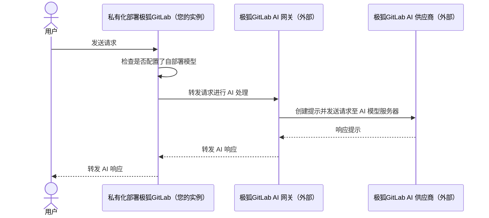
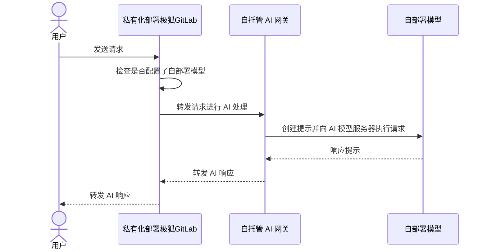
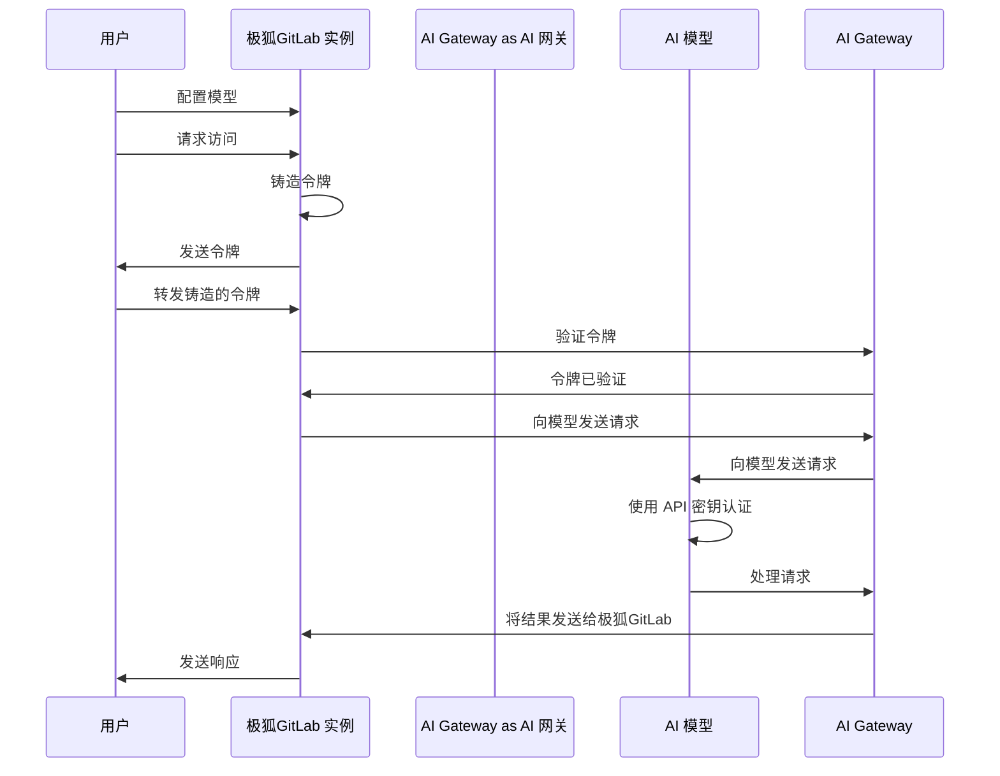



- Tier: 专业版，旗舰版
- Offering: 私有化部署





- 在极狐GitLab 17.1 中引入，附带一个名为 `ai_custom_model` 的功能标志。默认禁用。
- 在极狐GitLab 17.6 中为私有化部署启用。
- 在极狐GitLab 17.6 及更高版本中，改为需要 极狐GitLab Duo 插件。
- 功能标志 `ai_custom_model` 在极狐GitLab 17.8 中移除。
- 在极狐GitLab 17.9 中 GA。
- 在极狐GitLab 18.0 中改为包括专业版。



对于私有化部署客户，有两种 AI 网关配置选项：

- **JihuLab.com AI 网关**：这是适用于 极狐GitLab 私有化部署客户的默认配置。使用由 极狐GitLab 管理的 AI 网关，配合 极狐GitLab 选择的外部大语言模型（LLM）提供商（例如国内 SOTA 大模型）。
- **自托管 AI 网关**：在自己的基础设施中部署和管理您自己的 AI 网关和语言模型，无需依赖 极狐GitLab 提供的外部语言提供商。

## JihuLab.com AI 网关

在此配置中，您的 极狐GitLab 实例依赖于外部 极狐GitLab AI 网关并向其发送请求，该网关与外部 AI 供应商（如国内 SOTA 大模型）通信。响应随后转发回您的 极狐GitLab 实例。

## 自托管 AI 网关

在此配置中，整个系统隔离在企业内部，确保完全自托管的运行环境，保护数据隐私。

## 自部署模型的认证

自部署模型的认证过程安全、高效，由以下关键组件组成：

- **自签发令牌**：在此架构中，访问凭证不与 `cloud.jihulab.com` 同步。相反，令牌以动态方式自签发，类似于 JihuLab.com 上的功能。此方法为用户提供即时访问，同时保持高水平的安全性。
- **离线环境**：在离线设置中，没有任何到 `cloud.jihulab.com` 的连接。所有请求仅路由到自托管 AI 网关。
- **令牌铸造和验证**：实例铸造令牌，然后由 AI 网关针对 极狐GitLab 实例进行验证。
- **模型配置与安全**：当管理员配置模型时，可以加入 API 密钥以认证请求。此外，您可以通过在网络中指定连接 IP 地址来增强安全性，确保只有受信任的 IP 可以与模型交互。

如下图所示：

1. 认证流程从用户通过 极狐GitLab 实例配置模型并提交访问 极狐GitLab Duo 功能的请求开始。
1. 极狐GitLab 实例铸造一个访问令牌，用户将其转发给 极狐GitLab，然后再转发给 AI 网关进行验证。
1. 确认令牌有效后，AI 网关向 AI 模型发送请求，AI 模型使用 API 密钥对请求进行认证和处理。
1. 结果随后转发回 极狐GitLab 实例，通过将响应发送给用户完成流程，整个过程设计得安全且高效。

