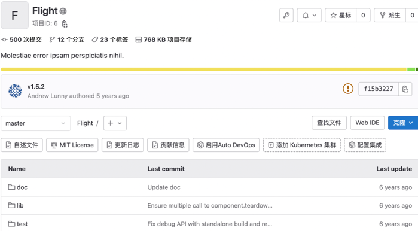

# 禁用源代码下载 **(PREMIUM SELF)**



1. Tier: 专业版, 旗舰版
1. Offering: 私有化部署





- [引入](https://jihulab.com/gitlab-cn/gitlab/-/issues/1896)于极狐GitLab 15.7。



极狐GitLab 管理员可以禁用整个极狐GitLab 实例的源代码下载功能。

默认情况下，用户可以使用项目主页及项目内文件的源代码下载功能，包括下载源代码和下载产物。
禁用源代码下载功能同时会禁用下载按钮对应的接口。

禁用源代码下载功能：

1. 在左侧边栏中，选择 **搜索或转到**。
1. 选择 **管理中心**。
1. 在左侧边栏中，选择 **设置 > 通用**。
1. 选择 **可见性与访问控制** 后面的 **展开**。
1. 勾选 **下载源代码按钮** 下面的 **移除下载源代码按钮**。

勾选后，下载按钮不会显示在项目主页及项目文件页面中。

