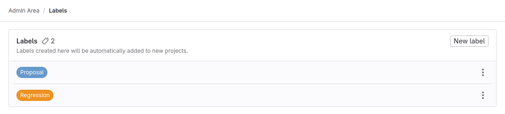



- Tier: 基础版，专业版，旗舰版
- Offering: 私有化部署



先决条件：

- 管理员访问权限。

要管理极狐GitLab 实例的标签：

1. 在右上角，选择 **管理员**。
1. 在左侧边栏中，选择 **标签**。

更多信息，请参见[管理标签](../user/project/labels.md)。

在 **管理员** 区域创建的标签会自动添加到新项目中。
它们不适用于新群组。
在 **管理员** 区域更新或添加标签不会修改现有项目中的标签。

