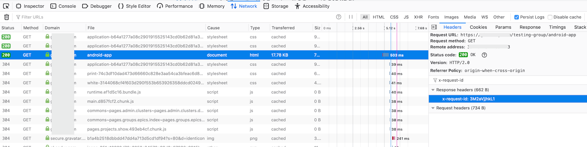
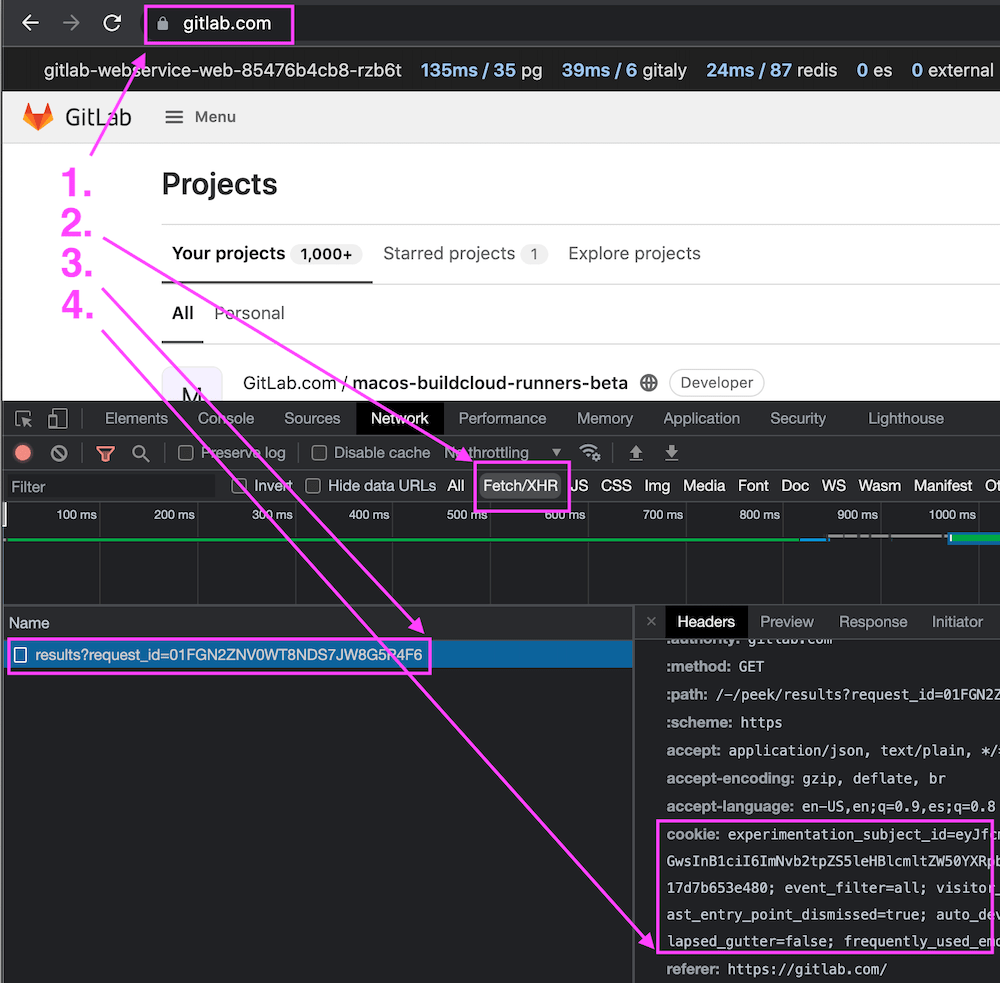
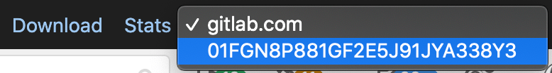
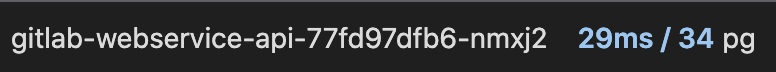
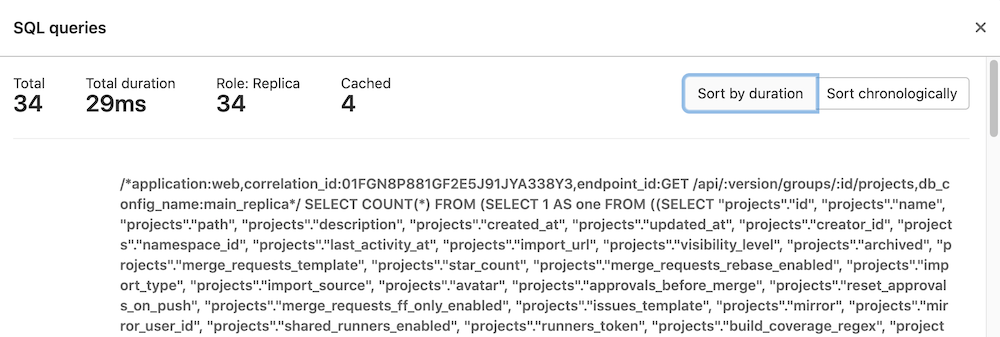



- Tier: 基础版，专业版，旗舰版
- Offering: 私有化部署



极狐GitLab 实例为大多数请求记录一个唯一的请求跟踪 ID（称为“关联 ID”）。每个发送到极狐GitLab 的独立请求都会获得自己的关联 ID，该 ID 随后会被记录在响应该请求的每个极狐GitLab 组件的日志中。这使得在分布式系统中追踪行为变得更加容易。如果没有此 ID，匹配相关的日志条目可能会非常困难甚至不可能。

## 识别请求的关联 ID

关联 ID 会记录在结构化日志的 `correlation_id` 字段下，也会出现在极狐GitLab 发送的所有响应头中的 `x-request-id` 头中。你可以通过搜索任意一处来找到你的关联 ID。

### 在浏览器中获取关联 ID

你可以使用浏览器的开发者工具监控并检查与正在访问的站点之间的网络活动。请查看以下一些主流浏览器的网络监控文档：

- [Network Monitor - Firefox Developer Tools](https://firefox-source-docs.mozilla.org/devtools-user/network_monitor/index.html)
- [Inspect Network Activity In Chrome DevTools](https://developer.chrome.com/docs/devtools/network/)
- [Safari Web Development Tools](https://developer.apple.com/safari/tools/)
- [Microsoft Edge Network panel](https://learn.microsoft.com/en-us/microsoft-edge/devtools-guide-chromium/network/)

要找到相关请求并查看其关联 ID：

1. 在网络监控器中启用持久日志记录。在极狐GitLab 中的某些操作会在你提交表单后迅速重定向，因此这有助于捕获所有相关活动。
1. 为了帮助隔离你正在寻找的请求，可以筛选出 `document` 请求。
1. 选择感兴趣的请求以查看更多细节。
1. 进入 **头信息** 部分并找到 **响应头信息**。在那里，你应该能看到一个 `x-request-id` 头，其值由极狐GitLab 为该请求随机生成。

请参见以下示例：



### 从日志中获取关联 ID

找到正确关联 ID 的另一种方法是搜索或监视你的日志，并找到你正在监视的日志条目的 `correlation_id` 值。

例如，如果你想了解在极狐GitLab 中重现某个操作时发生了什么或出现了什么错误，你可以跟踪极狐GitLab 的日志，筛选出属于你的用户的请求，然后观察这些请求，直到看到你感兴趣的内容。

### 从 curl 获取关联 ID

如果你正在使用 `curl`，则可以使用详细选项来显示请求和响应头以及其他调试信息。

```shell
➜  ~ curl --verbose "https://gitlab.example.com/api/v4/projects"
# 寻找类似以下的行
< x-request-id: 4rAMkV3gof4
```

#### 使用 jq

此示例使用 [jq](https://stedolan.github.io/jq/) 来筛选结果并显示我们最可能关心的值。

```shell
sudo gitlab-ctl tail gitlab-rails/production_json.log | jq 'select(.username == "bob") | "User: \(.username), \(.method) \(.path), \(.controller)#\(.action), ID: \(.correlation_id)"'
```

```plaintext
"User: bob, GET /root/linux, ProjectsController#show, ID: U7k7fh6NpW3"
"User: bob, GET /root/linux/commits/master/signatures, Projects::CommitsController#signatures, ID: XPIHpctzEg1"
"User: bob, GET /root/linux/blob/master/README, Projects::BlobController#show, ID: LOt9hgi1TV4"
```

#### 使用 grep

此示例仅使用 `grep` 和 `tr`，它们比 `jq` 更有可能已安装。

```shell
sudo gitlab-ctl tail gitlab-rails/production_json.log | grep '"username":"bob"' | tr ',' '\n' | egrep 'method|path|correlation_id'
```

```plaintext
{"method":"GET"
"path":"/root/linux"
"username":"bob"
"correlation_id":"U7k7fh6NpW3"}
{"method":"GET"
"path":"/root/linux/commits/master/signatures"
"username":"bob"
"correlation_id":"XPIHpctzEg1"}
{"method":"GET"
"path":"/root/linux/blob/master/README"
"username":"bob"
"correlation_id":"LOt9hgi1TV4"}
```

## 在日志中搜索关联 ID

当你有了关联 ID 后，就可以开始搜索相关的日志条目。你可以通过关联 ID 本身来过滤行。结合使用 `find` 和 `grep` 应该足以找到你所需的条目。

```shell
# find <gitlab log directory> -type f -mtime -0 exec grep '<correlation ID>' '{}' '+'
find /var/log/gitlab -type f -mtime 0 -exec grep 'LOt9hgi1TV4' '{}' '+'
```

```plaintext
/var/log/gitlab/gitlab-workhorse/current:{"correlation_id":"LOt9hgi1TV4","duration_ms":2478,"host":"gitlab.domain.tld","level":"info","method":"GET","msg":"access","proto":"HTTP/1.1","referrer":"https://gitlab.domain.tld/root/linux","remote_addr":"68.0.116.160:0","remote_ip":"[filtered]","status":200,"system":"http","time":"2019-09-17T22:17:19Z","uri":"/root/linux/blob/master/README?format=json\u0026viewer=rich","user_agent":"Mozilla/5.0 (Mac) Gecko Firefox/69.0","written_bytes":1743}
/var/log/gitlab/gitaly/current:{"correlation_id":"LOt9hgi1TV4","grpc.code":"OK","grpc.meta.auth_version":"v2","grpc.meta.client_name":"gitlab-web","grpc.method":"FindCommits","grpc.request.deadline":"2019-09-17T22:17:47Z","grpc.request.fullMethod":"/gitaly.CommitService/FindCommits","grpc.request.glProjectPath":"root/linux","grpc.request.glRepository":"project-1","grpc.request.repoPath":"@hashed/6b/86/6b86b273ff34fce19d6b804eff5a3f5747ada4eaa22f1d49c01e52ddb7875b4b.git","grpc.request.repoStorage":"default","grpc.request.topLevelGroup":"@hashed","grpc.service":"gitaly.CommitService","grpc.start_time":"2019-09-17T22:17:17Z","grpc.time_ms":2319.161,"level":"info","msg":"finished streaming call with code OK","peer.address":"@","span.kind":"server","system":"grpc","time":"2019-09-17T22:17:19Z"}
/var/log/gitlab/gitlab-rails/production_json.log:{"method":"GET","path":"/root/linux/blob/master/README","format":"json","controller":"Projects::BlobController","action":"show","status":200,"duration":2448.77,"view":0.49,"db":21.63,"time":"2019-09-17T22:17:19.800Z","params":[{"key":"viewer","value":"rich"},{"key":"namespace_id","value":"root"},{"key":"project_id","value":"linux"},{"key":"id","value":"master/README"}],"remote_ip":"[filtered]","user_id":2,"username":"bob","ua":"Mozilla/5.0 (Mac) Gecko Firefox/69.0","queue_duration":3.38,"gitaly_calls":1,"gitaly_duration":0.77,"rugged_calls":4,"rugged_duration_ms":28.74,"correlation_id":"LOt9hgi1TV4"}
```

### 在分布式架构中搜索

如果你在极狐GitLab 基础设施中做了横向扩展，那么你必须在所有极狐GitLab 节点中进行搜索。你可以通过使用 Loki、ELK、Splunk 或其他类型的日志聚合软件来实现。

你可以使用像 Ansible 或 PSSH（并行 SSH）这样的工具，它们可以跨服务器并行执行相同的命令，也可以构建你自己的解决方案。

### 在性能栏中查看请求

你可以使用[性能栏](../monitoring/performance/performance_bar.md)来查看有趣的数据，包括对 SQL 和 Gitaly 的调用。

要查看这些数据，请求的关联 ID 必须与查看性能栏的用户处于同一会话中。对于 API 请求，这意味着你必须使用经过认证用户的会话 Cookie 来执行请求。

例如，如果你想查看以下 API 端点执行的数据库查询：

```shell
https://jihulab.com/api/v4/groups/2564205/projects?with_security_reports=true&page=1&per_page=1
```

首先，启用 **开发者工具** 面板。有关如何操作的详细信息，请参见[在浏览器中获取关联 ID](#在浏览器中获取关联-id)。

开发者工具启用后，按如下方式获取会话 Cookie：

1. 在登录状态下访问 <https://jihulab.com>。
1. 可选。在 **开发者工具** 面板中选择 **Fetch/XHR** 请求过滤器。此步骤是针对 Google Chrome 开发者工具描述的，并非严格必需，只是更容易找到正确的请求。
1. 在左侧选择 `results?request_id=<some-request-id>` 请求。
1. 会话 Cookie 会显示在 **头信息** 面板的 `Request Headers` 部分。右键点击 Cookie 值并选择 `Copy value`。



此时你已将会话 Cookie 的值复制到剪贴板，例如：

```shell
experimentation_subject_id=<subject-id>; _gitlab_session=<session-id>; event_filter=all; visitor_id=<visitor-id>; perf_bar_enabled=true; sidebar_collapsed=true; diff_view=inline; sast_entry_point_dismissed=true; auto_devops_settings_dismissed=true; cf_clearance=<cf-clearance>; collapsed_gutter=false
```

使用该会话 Cookie 的值，把它粘贴到 `curl` 请求的自定义头中，以构造一个 API 请求：

```shell
$ curl --include "https://jihulab.com/api/v4/groups/2564205/projects?with_security_reports=true&page=1&per_page=1" \
--header 'cookie: experimentation_subject_id=<subject-id>; _gitlab_session=<session-id>; event_filter=all; visitor_id=<visitor-id>; perf_bar_enabled=true; sidebar_collapsed=true; diff_view=inline; sast_entry_point_dismissed=true; auto_devops_settings_dismissed=true; cf_clearance=<cf-clearance>; collapsed_gutter=false'

  date: Tue, 28 Sep 2021 03:55:33 GMT
  content-type: application/json
  ...
  x-request-id: 01FGN8P881GF2E5J91JYA338Y3
  ...
  [
    {
      "id":27497069,
      "description":"Analyzer for images used on live K8S containers based on Starboard"
    },
    "container_registry_image_prefix":"registry.gitlab.com/gitlab-org/security-products/analyzers/cluster-image-scanning",
    "..."
  ]
```

响应中包含来自 API 端点的数据，以及一个 `correlation_id` 值，该值在 `x-request-id` 头中返回，如[识别请求的关联 ID](#识别请求的关联-id)部分所述。

然后，你可以查看此请求的数据库详细信息：

1. 将 `x-request-id` 的值粘贴到[性能栏](../monitoring/performance/performance_bar.md)的 `request details` 字段中，然后按 <kbd>Enter/Return</kbd>。本例使用前一个响应返回的 `x-request-id` 值 `01FGN8P881GF2E5J91JYA338Y3`：

   

1. 一个新的请求会被插入到性能栏右侧的 `Request Selector` 下拉列表中。选择该新请求以查看该 API 请求的指标：

   

1. 在性能栏中选择 `pg` 链接，以查看该 API 请求执行的数据库查询：

   

   数据库查询对话框随即显示：

   