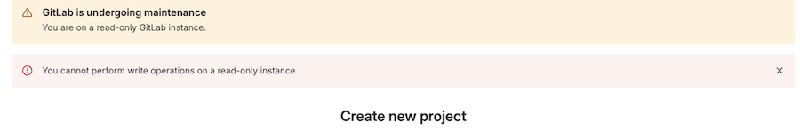



- Tier: 专业版，旗舰版
- Offering: 私有化部署



维护模式允许管理员在执行维护任务时将写操作降至最低。其主要目标是阻止所有会改变内部状态的外部操作。内部状态包括 PostgreSQL 数据库，尤其是文件、Git 代码仓库和容器仓库。

启用维护模式后，由于没有新的操作进入，进行中的操作会相对较快地完成，内部状态的变化也最小。
在这种状态下，各种维护任务会更容易执行。服务可以完全停止，或者比平时所需的时间更短地进一步降级。例如，停止 cron 作业和排空队列应该相当快。

维护模式允许大多数不改变内部状态的外部操作。在高层面上，HTTP `POST`、`PUT`、`PATCH` 和 `DELETE` 请求会被阻止，并提供[特殊情况处理方式的详细概述](#rest-api)。

<a id="enable-maintenance-mode"></a>

## 启用维护模式

以管理员身份通过以下任一方式启用维护模式：

- **Web UI**：
  1. 在右上角，选择 **管理员**。
  1. 在左侧边栏中，选择 **设置** > **通用**。
  1. 展开 **维护模式**，然后切换 **启用维护模式**。
     您还可以选择为横幅添加一条消息。
  1. 选择 **保存更改**。

- **API**：

  ```shell
  curl --request PUT --header "PRIVATE-TOKEN:$ADMIN_TOKEN" "<gitlab-url>/api/v4/application/settings?maintenance_mode=true"
  ```

<a id="disable-maintenance-mode"></a>

## 禁用维护模式

通过以下三种方式之一禁用维护模式：

- **Web UI**：
  1. 在右上角，选择 **管理员**。
  1. 在左侧边栏中，选择 **设置** > **通用**。
  1. 展开 **维护模式**，然后切换 **启用维护模式**。
     您还可以选择为横幅添加一条消息。
  1. 选择 **保存更改**。

- **API**：

  ```shell
  curl --request PUT --header "PRIVATE-TOKEN:$ADMIN_TOKEN" "<gitlab-url>/api/v4/application/settings?maintenance_mode=false"
  ```

<a id="behavior-of-gitlab-features-in-maintenance-mode"></a>

## 维护模式下极狐GitLab 功能的行为

启用维护模式后，页面顶部会显示一个横幅。
该横幅可以使用特定消息进行自定义。

当用户尝试执行不允许的写操作时，会显示错误。



> [!note]
> 在某些情况下，操作的视觉反馈可能具有误导性。例如，为项目加星标时，**星标**按钮会变为显示 **取消星标** 操作。但是，这仅更新了 UI，并未考虑 POST 请求的状态。

<a id="administrator-functions"></a>

### 管理员功能

系统管理员可以编辑应用程序设置。这使他们能够在启用后禁用维护模式。

<a id="authentication"></a>

### 身份验证

所有用户都可以登录和退出极狐GitLab 实例，但不能创建新用户。

如果该时间点安排了 [LDAP 同步](../auth/ldap/_index.md)，则会因用户创建被禁用而失败。同样，[基于 SAML 的用户创建](../../integration/saml.md#configure-saml-support-in-gitlab)也会失败。

<a id="git-actions"></a>

### Git 操作

所有只读 Git 操作继续正常工作，例如 `git clone` 和 `git pull`。所有写操作都会失败，无论是通过 CLI 还是 Web IDE，并显示错误消息：`Git push is not allowed because this GitLab instance is currently in (read-only) maintenance mode.`

如果启用了 Geo，对主站点和从站点的 Git 推送都会失败。

<a id="merge-requests-issues-epics"></a>

### 合并请求、议题、史诗

除前述操作外，所有写操作都会失败。例如，用户无法更新合并请求或议题。

<a id="incoming-email"></a>

### 接收邮件

[通过电子邮件](../incoming_email.md)创建新的议题回复、议题（包括新的服务台议题）和合并请求都会失败。

<a id="outgoing-email"></a>

### 发送邮件

通知邮件会继续送达，但需要数据库写入的邮件（如重置密码）不会送达。

<a id="rest-api"></a>

### REST API

对于大多数 JSON 请求，`POST`、`PUT`、`PATCH` 和 `DELETE` 会被阻止，API 会返回 `503` 响应及错误消息：`GitLab Maintenance: system is in maintenance mode`。仅允许以下请求：

|HTTP 请求 | 允许的路由 |  备注 |
|:----:|:--------------------------------------:|:----:|
| `POST` | `/admin/application_settings/general` | 允许在管理员 UI 中更新应用程序设置 |
| `PUT`  | `/api/v4/application/settings` | 允许通过 API 更新应用程序设置 |
| `POST` | `/users/sign_in` | 允许用户登录。 |
| `POST` | `/users/sign_out`| 允许用户退出登录。 |
| `POST` | `/oauth/token` | 允许用户首次登录 Geo 从站点。 |
| `POST` | `/admin/session`, `/admin/session/destroy` | 允许[极狐GitLab 管理员的 Admin Mode](https://gitlab.com/groups/gitlab-org/-/work_items/2158) |
| `POST` | 以 `/compare` 结尾的路径| Git 修订版本路由。 |
| `POST` | `.git/git-upload-pack` | 允许 Git pull/clone。 |
| `POST` | `/api/v4/internal` | 内部 API 路由 |
| `POST` | `/admin/sidekiq` | 允许在 **管理员** 区域管理后台作业 |
| `POST` | `/admin/geo` | 允许在管理员 UI 中更新 Geo 节点 |
| `POST` | `/api/v4/geo_replication`| 允许在从站点上执行某些特定于 Geo 的管理员 UI 操作 |

<a id="graphql-api"></a>

### GraphQL API

`POST /api/graphql` 请求被允许，但变更操作会被阻止，并显示错误消息 `You cannot perform write operations on a read-only instance`。

唯一允许的变更操作是 `GeoRegistriesUpdate`，用于重新同步和重新验证注册表。

<a id="continuous-integration"></a>

### 持续集成

- Runner 无法获取新作业，因此不会执行新的作业或流水线。
- 无法通过 UI 或 API 启动、重试或取消流水线。
  也无法通过外部操作创建新作业。
- 已在运行的作业在极狐GitLab UI 中会继续显示为 `running` 状态，
  即使它们已在极狐GitLab Runner 上完成运行。
- 处于 `running` 状态超过项目时间限制的作业不会超时。
- `/admin/runners` 中 Runner 的状态不会更新。
- `gitlab-runner verify` 返回错误 `ERROR: Verifying runner... is removed`。

> [!warning]
> 流水线调度器是一个 Sidekiq cron 作业，不会由维护模式自动禁用。
> 在维护期间，仍可在内部创建计划的流水线。
> 一旦禁用维护模式，Runner 就会获取这些流水线，这可能导致排队作业激增。
> 为防止这种情况，请在启用维护模式前手动禁用 cron 作业。
> 更多信息，请参阅 [后台作业](#background-jobs)。

禁用维护模式后，会再次获取新作业。在启用维护模式前处于 `running` 状态的作业会恢复，其日志也会再次开始更新。

> [!note]
> 关闭维护模式后，您应重新启动之前处于 `running` 状态的流水线。

<a id="deployments"></a>

### 部署

由于流水线未完成，部署无法进行。

您应在维护模式期间禁用自动部署，并在禁用维护模式后重新启用。

<a id="terraform-integration"></a>

#### Terraform 集成

Terraform 集成依赖于运行 CI 流水线，因此会被阻止。

<a id="container-registry"></a>

### 容器镜像仓库

`docker push` 会失败并显示错误：`denied: requested access to the resource is denied`，但 `docker pull` 可以正常工作。

<a id="package-registry"></a>

### 软件包仓库

软件包仓库允许您安装软件包，但不能发布软件包。

<a id="background-jobs"></a>

### 后台作业

后台作业（cron 作业、Sidekiq）会照常继续运行，因为后台作业不会被自动禁用。
由于后台作业会执行可能更改实例内部状态的操作，您可能希望在启用维护模式时禁用部分或全部后台作业。

[在计划的 Geo 故障转移期间](../geo/disaster_recovery/planned_failover.md#prevent-updates-to-the-primary-site)，
您应禁用除与 Geo 相关的 cron 作业之外的所有 cron 作业。

要监控队列和禁用作业：

1. 在右上角，选择 **管理员**。
1. 在左侧边栏中，选择 **监控** > **后台作业**。
1. 在 Sidekiq 仪表板中，选择 **Cron** 并单独禁用作业，或通过选择 **全部禁用** 一次性禁用所有作业。

<a id="incident-management"></a>

### 事件管理

[事件管理](../../operations/incident_management/_index.md)功能受限。[告警](../../operations/incident_management/alerts.md)和[事件](../../operations/incident_management/manage_incidents.md#create-an-incident)的创建会完全暂停。因此，针对告警和事件的通知与呼叫（paging）会被禁用。

<a id="feature-flags"></a>

### 功能标志

- 无法通过 API 开启或关闭开发功能标志，但可以通过 Rails 控制台切换。
- [功能标志服务](../../operations/feature_flags.md)会响应功能标志检查，但无法切换功能标志。

<a id="geo-secondaries"></a>

### Geo 从站点

当主站点处于维护模式时，从站点也会自动进入维护模式。

在启用维护模式之前，切勿禁用复制。

通过管理 UI 进行的复制、验证以及重新同步和重新验证注册表的手动操作会继续工作，但通过代理向主站点的 Git 推送不会。

<a id="secure-features"></a>

### 安全功能

依赖于创建议题或创建/批准合并请求的功能无法使用。

从漏洞报告页面导出漏洞列表无法使用。

更改发现项或漏洞对象的状态无法使用，即使 UI 中未显示错误。

SAST 和密钥检测无法启动，因为它们依赖成功通过的 CI/CD 作业来创建产物。

<a id="an-example-use-case-a-planned-failover"></a>

## 示例用例：计划故障转移

在[计划故障转移](../geo/disaster_recovery/planned_failover.md)的用例中，主数据库中的少量写入是可以接受的，因为它们会快速复制且数量不大。

出于同样的原因，我们在启用维护模式时不会自动阻止后台作业。

由此产生的数据库写入是可以接受的。这里的权衡在于更多的服务降级与复制的完成之间。

然而，在计划故障转移期间，我们[要求用户手动关闭与 Geo 无关的 cron 作业](../geo/disaster_recovery/planned_failover.md#prevent-updates-to-the-primary-site)。在没有新的数据库写入和非 Geo cron 作业的情况下，新的后台作业要么根本不会创建，要么数量极少。
