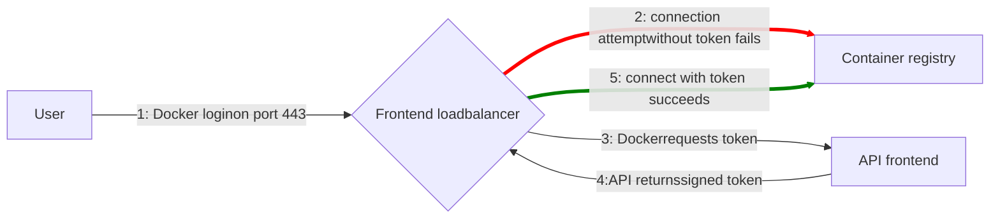



- Tier: 基础版，专业版，旗舰版
- Offering: 私有化部署



> [!note]
> [下一代容器镜像仓库](container_registry_metadata_database.md)
> 现已在极狐GitLab 私有化部署实例上提供升级。
> 此升级后的镜像仓库支持在线垃圾回收，并具有显著的性能
> 和可靠性改进。

借助极狐GitLab 容器镜像仓库，每个项目都可以拥有
自己的空间来存储 Docker 镜像。

有关 Distribution Registry 的更多详细信息：

- [配置](https://distribution.github.io/distribution/about/configuration/)
- [存储驱动](https://distribution.github.io/distribution/storage-drivers/)
- [部署镜像仓库服务器](https://distribution.github.io/distribution/about/deploying/)

本文档是管理员指南。要了解如何使用极狐GitLab 容器
镜像仓库，请参阅[用户文档](../../user/packages/container_registry/_index.md)。

<a id="enable-the-container-registry"></a>

## 启用容器镜像仓库

启用容器镜像仓库的过程取决于您使用的安装类型。

<a id="linux-package-installations"></a>

### Linux 软件包安装

如果您使用 Linux 软件包安装了极狐GitLab，则容器镜像仓库
可能默认可用，也可能不可用。

如果您使用内置的 [Let's Encrypt 集成](https://gitlab.cn/docs/omnibus/settings/ssl/#enable-the-lets-encrypt-integration)，则容器镜像仓库会在您的极狐GitLab 域名的 5050 端口上自动启用并可用。

否则，容器镜像仓库未启用。要启用它：

- 您可以为其配置[极狐GitLab 域名](#configure-container-registry-under-an-existing-gitlab-domain)，或者
- 您可以为其配置[不同的域名](#configure-container-registry-under-its-own-domain)。

容器镜像仓库默认在 HTTPS 下工作。您可以使用 HTTP，
但不推荐这样做，并且超出了本文档的范围。

<a id="helm-charts-installations"></a>

### Helm Charts 安装

对于 Helm Charts 安装，请参阅 Helm Charts 文档中的[使用容器镜像仓库](https://gitlab.cn/docs/charts/charts/registry/)。

<a id="self-compiled-installations"></a>

### 源码编译安装

如果您自行编译了极狐GitLab 安装：

1. 您必须使用与您要安装的极狐GitLab 版本对应的镜像来部署镜像仓库
   （例如：`registry.gitlab.com/gitlab-org/build/cng/gitlab-container-registry:v3.15.0-gitlab`）
1. 安装完成后，要启用它，您必须在 `gitlab.yml` 中配置 Registry 的设置。
1. 使用 [`lib/support/nginx/registry-ssl`](https://gitlab.com/gitlab-org/gitlab/-/blob/master/lib/support/nginx/registry-ssl) 下的示例 NGINX 配置文件，并编辑它以匹配
   `host`、`port` 和 TLS 证书路径。

`gitlab.yml` 的内容是：

```yaml
registry:
  enabled: true
  host: <registry.gitlab.example.com>
  port: <5005>
  api_url: <http://localhost:5000/>
  key: <config/registry.key>
  path: <shared/registry>
  issuer: <gitlab-issuer>
```

其中：

| 参数 | 描述 |
| --------- | ----------- |
| `enabled` | `true` 或 `false`。在极狐GitLab 中启用 Registry。默认值为 `false`。 |
| `host`    | Registry 运行且用户可用的主机 URL。 |
| `port`    | 外部 Registry 域名监听的端口。 |
| `api_url` | Registry 暴露的内部 API URL。默认为 `http://localhost:5000`。除非您要设置[外部 Docker 镜像仓库](#use-an-external-container-registry-with-gitlab-as-an-auth-endpoint)，否则不要更改此项。 |
| `key`     | 与 Registry 的 `rootcertbundle` 配对的私钥位置。 |
| `path`    | 应与 Registry 的 `rootdirectory` 中指定的目录相同。此路径需要可被极狐GitLab 用户、Web 服务器用户和 Registry 用户读取。 |
| `issuer`  | 应与 Registry 的 `issuer` 中配置的值相同。 |

如果您从源码安装极狐GitLab，则不会附带 Registry init 文件。
因此，如果您修改了其设置，[重启极狐GitLab](../restart_gitlab.md#self-compiled-installations) 不会重启 Registry。请阅读上游文档了解如何实现。

至少，请确保您的 Registry 配置
将 `container_registry` 作为服务，并将 `https://gitlab.example.com/jwt/auth`
作为 realm：

```yaml
auth:
  token:
    realm: <https://gitlab.example.com/jwt/auth>
    service: container_registry
    issuer: gitlab-issuer
    rootcertbundle: /root/certs/certbundle
```

> [!warning]
> 如果未设置 `auth`，用户可以在无需身份验证的情况下拉取 Docker 镜像。

<a id="container-registry-domain-configuration"></a>

## 容器镜像仓库域名配置

您可以通过以下任一方式配置 Registry 的外部域名：

- [使用现有的极狐GitLab 域名](#configure-container-registry-under-an-existing-gitlab-domain)。
  Registry 监听一个端口并复用极狐GitLab 的 TLS 证书。
- [使用完全独立的域名](#configure-container-registry-under-its-own-domain)，并为该域名使用新的 TLS 证书。

由于容器镜像仓库需要 TLS 证书，因此成本可能是一个因素。

在首次配置容器镜像仓库之前，请考虑这一点。

<a id="configure-container-registry-under-an-existing-gitlab-domain"></a>

### 在现有极狐GitLab 域名下配置容器镜像仓库

如果容器镜像仓库配置为使用现有的极狐GitLab 域名，您可以在一个端口上暴露容器镜像仓库。这样，您可以复用现有的极狐GitLab TLS 证书。

如果极狐GitLab 域名是 `https://gitlab.example.com`，并且对外端口是 `5050`，
要配置容器镜像仓库：

- 如果您使用 Linux 软件包安装，请编辑 `gitlab.rb`。
- 如果您使用源码编译安装，请编辑 `gitlab.yml`。

确保您选择的端口与 Registry 监听的端口（默认为 `5000`）不同，
否则会发生冲突。

> [!note]
> 必须配置主机和容器防火墙规则，以允许流量通过 `registry_external_url` 行下列出的端口，而不是 `gitlab_rails['registry_port']`（默认 `5000`）下列出的端口。





1. 您的 `/etc/gitlab/gitlab.rb` 应包含 Registry URL 以及
   极狐GitLab 使用的现有 TLS 证书和密钥的路径：

   ```ruby
   registry_external_url '<https://gitlab.example.com:5050>'
   ```

   `registry_external_url` 在现有的极狐GitLab URL 下监听 HTTPS，
   但使用不同的端口。

   如果您的 TLS 证书不在 `/etc/gitlab/ssl/gitlab.example.com.crt`
   且密钥不在 `/etc/gitlab/ssl/gitlab.example.com.key`，请取消注释以下行：

   ```ruby
   registry_nginx['ssl_certificate'] = "</path/to/certificate.pem>"
   registry_nginx['ssl_certificate_key'] = "</path/to/certificate.key>"
   ```

1. 保存文件并[重新配置极狐GitLab](../restart_gitlab.md#reconfigure-a-linux-package-installation)
   以使更改生效。

1. 使用以下命令验证：

   ```shell
   openssl s_client -showcerts -servername gitlab.example.com -connect gitlab.example.com:5050 > cacert.pem
   ```

如果您的证书提供商提供 CA Bundle 证书，请将它们附加到 TLS 证书文件中。

管理员可能希望容器镜像仓库监听任意端口，例如 `5678`。
但是，镜像仓库和应用服务器位于 AWS 应用程序负载均衡器后面，该负载均衡器仅
监听 `80` 和 `443` 端口。管理员可以移除
`registry_external_url` 的端口号，以便假定使用 HTTP 或 HTTPS。然后，应用规则将负载
均衡器从 `80` 或 `443` 端口映射到任意端口。如果用户
依赖容器镜像仓库中的 `docker login` 示例，这一点很重要。以下是一个示例：

```ruby
registry_external_url '<https://registry-gitlab.example.com>'
registry_nginx['redirect_http_to_https'] = true
registry_nginx['listen_port'] = 5678
```





1. 打开 `/home/git/gitlab/config/gitlab.yml`，找到 `registry` 条目并使用以下设置进行配置：

   ```yaml
   registry:
     enabled: true
     host: <gitlab.example.com>
     port: 5050
   ```

1. 保存文件并[重启极狐GitLab](../restart_gitlab.md#self-compiled-installations)以使更改生效。
1. 同时在 NGINX 中进行相关更改（域名、端口、TLS 证书路径）。





用户现在应该能够使用其极狐GitLab 凭据登录容器镜像仓库：

```shell
docker login <gitlab.example.com:5050>
```

<a id="configure-container-registry-under-its-own-domain"></a>

### 在独立域名下配置容器镜像仓库

当 Registry 配置为使用自己的域名时，您需要为该特定域名准备 TLS 证书（例如，`registry.example.com`）。如果托管在您现有极狐GitLab 域名的子域名下，您可能需要通配符证书。例如，`*.gitlab.example.com` 是一个通配符，匹配 `registry.gitlab.example.com`，并且与 `*.example.com` 不同。

除了手动生成的 SSL 证书（此处说明）外，Let's Encrypt 自动生成的证书也[在 Linux 软件包安装中受支持](https://gitlab.cn/docs/omnibus/settings/ssl/)。

假设您希望容器镜像仓库可通过 `https://registry.gitlab.example.com` 访问。





1. 将您的 TLS 证书和密钥放在
   `/etc/gitlab/ssl/<registry.gitlab.example.com>.crt` 和
   `/etc/gitlab/ssl/<registry.gitlab.example.com>.key`，并确保它们具有
   正确的权限：

   ```shell
   chmod 600 /etc/gitlab/ssl/<registry.gitlab.example.com>.*
   ```

1. TLS 证书就位后，使用以下内容编辑 `/etc/gitlab/gitlab.rb`：

   ```ruby
   registry_external_url '<https://registry.gitlab.example.com>'
   ```

   `registry_external_url` 正在监听 HTTPS。

1. 保存文件并[重新配置极狐GitLab](../restart_gitlab.md#reconfigure-a-linux-package-installation)以使更改生效。

如果您有[通配符证书](https://en.wikipedia.org/wiki/Wildcard_certificate)，则除了 URL 之外，还必须指定证书的路径，在这种情况下，`/etc/gitlab/gitlab.rb` 如下所示：

```ruby
registry_nginx['ssl_certificate'] = "/etc/gitlab/ssl/certificate.pem"
registry_nginx['ssl_certificate_key'] = "/etc/gitlab/ssl/certificate.key"
```





1. 打开 `/home/git/gitlab/config/gitlab.yml`，找到 `registry` 条目并使用以下设置进行配置：

   ```yaml
   registry:
     enabled: true
     host: <registry.gitlab.example.com>
   ```

1. 保存文件并[重启极狐GitLab](../restart_gitlab.md#self-compiled-installations)以使更改生效。
1. 同时在 NGINX 中进行相关更改（域名、端口、TLS 证书路径）。





用户现在应该能够使用其极狐GitLab 凭据登录容器镜像仓库：

```shell
docker login <registry.gitlab.example.com>
```

<a id="configure-self-signed-certificates"></a>

#### 配置自签名证书

如果您想将自签名证书与容器镜像仓库一起使用，
则必须配置 Docker 守护进程以信任自签名证书：

1. 指示 Docker 守护进程[使用自签名证书](https://distribution.github.io/distribution/about/insecure/#use-self-signed-certificates)。这些步骤因您的操作系统而异。
1. 在极狐GitLab Runner 的 `config.toml` 文件中，挂载 Docker 守护进程并设置 `privileged = false`：

   ```toml
     [runners.docker]
       image = "ruby:2.6"
       privileged = false
       volumes = ["/var/run/docker.sock:/var/run/docker.sock", "/cache"]
   ```

   设置 `privileged = true` 会优先于 Docker 守护进程。
1. 重启 Docker。

<a id="disable-container-registry-site-wide"></a>

## 在站点范围内禁用容器镜像仓库

当您按照以下步骤禁用 Registry 时，您不会
移除任何现有的 Docker 镜像。Docker 镜像的移除由
Registry 应用程序本身处理。





1. 打开 `/etc/gitlab/gitlab.rb` 并将 `registry['enable']` 设置为 `false`：

   ```ruby
   registry['enable'] = false
   ```

1. 保存文件并[重新配置极狐GitLab](../restart_gitlab.md#reconfigure-a-linux-package-installation)以使更改生效。





1. 打开 `/home/git/gitlab/config/gitlab.yml`，找到 `registry` 条目并将 `enabled` 设置为 `false`：

   ```yaml
   registry:
     enabled: false
   ```

1. 保存文件并[重启极狐GitLab](../restart_gitlab.md#self-compiled-installations)以使更改生效。





<a id="disable-container-registry-for-new-projects-site-wide"></a>

## 在站点范围内为新项目禁用容器镜像仓库

如果容器镜像仓库已启用，则它应对所有新项目可用。要禁用此功能并让项目所有者自行启用容器镜像仓库，请按照以下步骤操作。





1. 编辑 `/etc/gitlab/gitlab.rb` 并添加以下行：

   ```ruby
   gitlab_rails['gitlab_default_projects_features_container_registry'] = false
   ```

1. 保存文件并[重新配置极狐GitLab](../restart_gitlab.md#reconfigure-a-linux-package-installation)以使更改生效。





1. 打开 `/home/git/gitlab/config/gitlab.yml`，找到 `default_projects_features` 条目并进行配置，以便将 `container_registry` 设置为 `false`：

   ```yaml
   ## Default project features settings
   default_projects_features:
     issues: true
     merge_requests: true
     wiki: true
     snippets: false
     builds: true
     container_registry: false
   ```

1. 保存文件并[重启极狐GitLab](../restart_gitlab.md#self-compiled-installations)以使更改生效。





<a id="increase-token-duration"></a>

### 增加令牌持续时间

在极狐GitLab 中，容器镜像仓库的令牌每五分钟过期一次。
要增加令牌持续时间：

1. 在右上角，选择 **管理员**。
1. 在左侧边栏中，选择 **设置** > **CI/CD**。
1. 展开 **容器镜像仓库**。
1. 对于 **授权令牌持续时间（分钟）**，更新该值。
1. 选择 **保存更改**。

<a id="container-registry-feature-flags"></a>

## 容器镜像仓库功能标志

容器镜像仓库功能标志是环境变量开关，
用于控制容器镜像仓库中的实验性或过渡性功能。

与 [极狐GitLab 应用程序功能标志](../feature_flags/list.md) 不同，
容器镜像仓库功能标志：

- 通过特定于镜像仓库的环境变量进行管理
- 在容器镜像仓库代码库中定义
- 需要重新配置镜像仓库才能更改

<a id="configure-container-registry-feature-flags"></a>

### 配置容器镜像仓库功能标志

下表列出了活动的容器镜像仓库功能标志：

| 功能标志 | 描述 | 里程碑 | 默认状态 | 移除里程碑 |
|--------------|-------------|-----------|---------------|-------------------|
| `REGISTRY_FF_ONGOING_RENAME_CHECK` | 检查 Redis 中正在进行重命名操作的项目。 | 16.2 | 禁用 | |
| `REGISTRY_FF_DYNAMIC_MEDIA_TYPES` | 允许在运行时创建新的媒体类型。 | 17.1 | 禁用 | |
| `REGISTRY_FF_BBM` | 控制异步批处理后台迁移进程。 | 17.2 | 禁用 | |
| `REGISTRY_FF_ENFORCE_LOCKFILES` | 为数据库或旧版元数据存储启用锁文件检查。 | 在极狐GitLab 17.6 中[引入](https://gitlab.com/gitlab-org/container-registry/-/issues/1335)。 | 在极狐GitLab 18.9 中[对极狐GitLab 私有化部署启用](https://gitlab.com/gitlab-org/container-registry/-/work_items/1786)。 | 在极狐GitLab 18.10 中[移除](https://gitlab.com/gitlab-org/container-registry/-/issues/1439)。 |

要配置容器镜像仓库功能标志，
请按照适用于您平台的说明进行操作。





在 `/etc/gitlab/gitlab.rb` 中，配置功能标志：

```ruby
registry['env'] = {
  '<REGISTRY_FF_FEATURE_NAME>' => 'true' # or 'false' to disable
}
```

然后，重新配置容器镜像仓库：

```shell
sudo gitlab-ctl reconfigure
sudo gitlab-ctl restart registry
```





在 `values.yaml` 中，配置功能标志：

```yaml
registry:
  extraEnv:
    <REGISTRY_FF_FEATURE_NAME>: "true"  # or "false" to disable
```

然后，升级 `values.yaml`：

```shell
helm upgrade gitlab gitlab/gitlab -f values.yaml
```





> [!note]
> 直接在 Docker Compose 中设置环境变量不起作用。
> 您必须通过 `gitlab.rb` 进行配置。

对于 Docker 或 Docker Compose，创建或编辑 `gitlab.rb`：

```ruby
registry['env'] = {
  '<REGISTRY_FF_FEATURE_NAME>' => 'true'
}
```

在您的 Docker Compose 设置中挂载此配置，并确保极狐GitLab 在启动时重新配置。





<a id="configure-storage-for-the-container-registry"></a>

## 为容器镜像仓库配置存储

> [!warning]
> 不要直接修改容器镜像仓库存储的文件或对象。除镜像仓库写入或删除这些条目外，任何其他操作都可能导致实例范围内的数据一致性和稳定性问题，且可能无法恢复。

您可以通过配置存储驱动来为容器镜像仓库配置各种存储后端。默认情况下，极狐GitLab 容器镜像仓库配置为使用[文件系统驱动](#use-file-system)。

对于支持对象版本控制的存储后端，您可以使用它来保留、检索和恢复存储在存储桶中的每个对象的非当前版本。但是，这可能会导致更高的存储使用量和成本。由于镜像仓库的操作方式，镜像上传首先存储在临时路径中，然后传输到最终位置。对于对象存储后端（包括 S3 和 GCS），此传输通过先复制后删除的方式完成。启用对象版本控制后，这些已删除的临时上传产物将作为非当前版本保留，从而增加存储桶大小。为确保非当前版本在给定时间后删除，您应该使用存储提供商配置对象生命周期策略。

支持的不同驱动有：

| 驱动 | 描述 |
|--------------|--------------------------------------|
| `filesystem` | 使用本地文件系统上的路径 |
| `azure`      | Microsoft Azure Blob Storage |
| `gcs`        | Google Cloud Storage |
| `s3`         | Amazon Simple Storage Service。请务必将您的存储桶配置为具有正确的 [S3 权限范围](https://distribution.github.io/distribution/storage-drivers/s3/#s3-permission-scopes)。 |

虽然大多数兼容 S3 的服务应该可以与容器镜像仓库一起使用，但我们仅保证对 AWS S3 的支持。由于我们无法断言第三方 S3 实现的正确性，我们可以调试问题，但除非问题可以在 AWS S3 存储桶上重现，否则我们无法修补镜像仓库。

<a id="use-file-system"></a>

### 使用文件系统

如果要将镜像存储在文件系统上，可以更改容器镜像仓库的存储路径。请按照以下步骤操作。

此路径可访问：

- 运行容器镜像仓库守护进程的用户。
- 运行极狐GitLab 的用户。

所有极狐GitLab、Registry 和 Web 服务器用户都必须有权访问此目录。





Linux 软件包安装中镜像的默认存储位置是 `/var/opt/gitlab/gitlab-rails/shared/registry`。要更改它：

1. 编辑 `/etc/gitlab/gitlab.rb`：

   ```ruby
   gitlab_rails['registry_path'] = "</path/to/registry/storage>"
   ```

1. 保存文件并[重新配置极狐GitLab](../restart_gitlab.md#reconfigure-a-linux-package-installation)以使更改生效。





源码编译安装中镜像的默认存储位置是 `/home/git/gitlab/shared/registry`。要更改它：

1. 打开 `/home/git/gitlab/config/gitlab.yml`，找到 `registry` 条目并更改 `path` 设置：

   ```yaml
   registry:
     path: shared/registry
   ```

1. 保存文件并[重启极狐GitLab](../restart_gitlab.md#self-compiled-installations)以使更改生效。





<a id="use-object-storage"></a>

### 使用对象存储

如果要将容器镜像仓库镜像存储在对象存储中而不是本地文件系统上，您可以配置一个受支持的存储驱动。

有关更多信息，请参阅[对象存储](../object_storage.md)。

> [!warning]
> 极狐GitLab 不备份未存储在文件系统上的 Docker 镜像。如果需要，请使用您的对象存储提供商启用备份。

<a id="configure-object-storage-for-linux-package-installations"></a>

#### 为 Linux 软件包安装配置对象存储

要为您的容器镜像仓库配置对象存储：

1. 选择要使用的存储驱动。
1. 使用相应的配置编辑 `/etc/gitlab/gitlab.rb`。
1. 保存文件并[重新配置极狐GitLab](../restart_gitlab.md#reconfigure-a-linux-package-installation)以使更改生效。





S3 存储驱动与 Amazon S3 或任何兼容 S3 的对象存储服务集成。

`s3_v2` 驱动（测试版）使用 AWS SDK v2，并且仅支持签名版本 4 进行身份验证。此驱动提高了性能和可靠性，同时确保与 AWS 身份验证要求兼容，因为对旧签名方法的支持已弃用。有关更多信息，请参阅 [史诗 16272](https://gitlab.com/groups/gitlab-org/-/work_items/16272)。

有关每个驱动的完整配置参数列表，请参阅 [`s3_v1`](https://gitlab.com/gitlab-org/container-registry/-/blob/f4ece8cdba4413b968c8a3fd20497a8186f23d26/docs/storage-drivers/s3_v1.md) 和 [`s3_v2`](https://gitlab.com/gitlab-org/container-registry/-/blob/f4ece8cdba4413b968c8a3fd20497a8186f23d26/docs/storage-drivers/s3_v2.md)。

要配置 S3 存储驱动，请将以下配置之一添加到您的 `/etc/gitlab/gitlab.rb` 文件中：

```ruby
# Deprecated: Will be removed in GitLab 19.0
registry['storage'] = {
  's3' => {
    'accesskey' => '<s3-access-key>',
    'secretkey' => '<s3-secret-key-for-access-key>',
    'bucket' => '<your-s3-bucket>',
    'region' => '<your-s3-region>',
    'regionendpoint' => '<your-s3-regionendpoint>'
  }
}
```

或者

```ruby
# Beta: s3_v2 driver
registry['storage'] = {
  's3_v2' => {
    'accesskey' => '<s3-access-key>',
    'secretkey' => '<s3-secret-key-for-access-key>',
    'bucket' => '<your-s3-bucket>',
    'region' => '<your-s3-region>',
    'regionendpoint' => '<your-s3-regionendpoint>'
  }
}
```

为提高安全性，您可以通过不包含 `accesskey` 和 `secretkey` 参数来使用 IAM 角色代替静态凭据。

为防止存储成本增加，请在您的 S3 存储桶中配置生命周期策略以清除不完整的多部分上传。容器镜像仓库不会自动清理这些。对于大多数使用模式，为不完整的多部分上传设置三天过期策略效果很好。

> [!note]
> `loglevel` 设置在 [`s3_v1`](https://gitlab.com/gitlab-org/container-registry/-/blob/f4ece8cdba4413b968c8a3fd20497a8186f23d26/docs/storage-drivers/s3_v1.md#configuration-parameters) 和 [`s3_v2`](https://gitlab.com/gitlab-org/container-registry/-/blob/f4ece8cdba4413b968c8a3fd20497a8186f23d26/docs/storage-drivers/s3_v2.md#configuration-parameters) 驱动之间有所不同。
> 如果您为错误的驱动设置了 `loglevel`，它将被忽略并打印警告消息。

当将某些兼容 S3 的服务与 `s3_v2` 驱动一起使用时，您可能需要添加 `checksum_disabled` 参数以禁用 AWS 校验和：

```ruby
registry['storage'] = {
  's3_v2' => {
    'accesskey' => '<s3-access-key>',
    'secretkey' => '<s3-secret-key-for-access-key>',
    'bucket' => '<your-s3-bucket>',
    'region' => '<your-s3-region>',
    'regionendpoint' => '<your-s3-regionendpoint>',
    'checksum_disabled' => true
  }
}
```

对于 S3 VPC 端点：

```ruby
registry['storage'] = {
  's3_v2' => {  # Beta driver
    'accesskey' => '<s3-access-key>',
    'secretkey' => '<s3-secret-key-for-access-key>',
    'bucket' => '<your-s3-bucket>',
    'region' => '<your-s3-region>',
    'regionendpoint' => '<your-s3-vpc-endpoint>',
    'pathstyle' => false
  }
}
```

S3 配置参数：

- `<your-s3-bucket>`：现有存储桶的名称。不能包含子目录。
- `regionendpoint`：仅在使用兼容 S3 的服务或 AWS S3 VPC 端点时需要。
- `pathstyle`：控制 URL 格式。对于 `host/bucket_name/object`（大多数兼容 S3 的服务）设置为 `true`，对于 `bucket_name.host/object`（AWS S3）设置为 `false`。

在 AWS S3 上，`s3_v2` 驱动会解析所配置 `region` 的 S3 端点。因此，客户端下载 blob 时遵循的预签名 URL 可以使用区域主机名，例如 `s3.us-east-1.amazonaws.com`，而不是全局 `s3.amazonaws.com` 主机名。如果代理、防火墙或安全 Web 网关过滤了来自您的容器镜像客户端的出站流量，请将您的存储桶区域的区域主机名添加到该设备的允许列表中。仅包含 `s3.amazonaws.com` 的允许列表会导致镜像拉取失败并返回 `403 Forbidden` 响应。要将预签名 URL 定向到您控制的主机名，请将 `regionendpoint` 设置为 S3 VPC 端点或其他固定端点。

为避免 S3 API 返回 503 错误，请添加 `maxrequestspersecond` 参数以设置连接速率限制：

```ruby
registry['storage'] = {
  's3' => {
    'accesskey' => '<s3-access-key>',
    'secretkey' => '<s3-secret-key-for-access-key>',
    'bucket' => '<your-s3-bucket>',
    'region' => '<your-s3-region>',
    'regionendpoint' => '<your-s3-regionendpoint>',
    'maxrequestspersecond' => 100
  }
}
```





Azure 存储驱动与 Microsoft Azure Blob Storage 集成。

> [!warning]
> 旧版 Azure 存储驱动已在极狐GitLab 17.10 中[弃用](https://gitlab.com/gitlab-org/gitlab/-/issues/523096)，并计划在极狐GitLab 19.0 中移除。
>
> 请改用 `azure_v2` 驱动（测试版）。此驱动提供改进的性能、可靠性和现代身份验证方法。虽然这是一个破坏性更改，但新驱动已经过广泛测试，以确保大多数配置的平滑过渡。
>
> 在部署到生产环境之前，请务必在非生产环境中测试新驱动，以识别和解决特定于您的环境和使用模式的任何边缘情况。
>
> 使用 [议题 525855](https://gitlab.com/gitlab-org/gitlab/-/issues/525855) 报告任何问题或反馈。

有关每个驱动的完整配置参数列表，请参阅 [`azure_v1`](https://gitlab.com/gitlab-org/container-registry/-/blob/7b1786d261481a3c69912ad3423225f47f7c8242/docs/storage-drivers/azure_v1.md) 和 [`azure_v2`](https://gitlab.com/gitlab-org/container-registry/-/blob/7b1786d261481a3c69912ad3423225f47f7c8242/docs/storage-drivers/azure_v2.md)。

要配置 Azure 存储驱动，请将以下配置之一添加到您的 `/etc/gitlab/gitlab.rb` 文件中：

```ruby
# Deprecated: Will be removed in GitLab 19.0
registry['storage'] = {
  'azure' => {
    'accountname' => '<your_storage_account_name>',
    'accountkey' => '<base64_encoded_account_key>',
    'container' => '<container_name>'
  }
}
```

或者

```ruby
# Beta: azure_v2 driver
registry['storage'] = {
  'azure_v2' => {
    'credentials_type' => '<client_secret>',
    'tenant_id' => '<your_tenant_id>',
    'client_id' => '<your_client_id>',
    'secret' => '<your_secret>',
    'container' => '<your_container>',
    'accountname' => '<your_account_name>'
  }
}
```

默认情况下，Azure 存储驱动使用 `core.windows.net realm`。您可以在 Azure 部分为 realm 设置其他值（例如，Azure Government Cloud 使用 `core.usgovcloudapi.net`）。





GCS 存储驱动与 Google Cloud Storage 集成。

```ruby
registry['storage'] = {
  'gcs' => {
    'bucket' => '<your_bucket_name>',
    'keyfile' => '<path/to/keyfile>',
    # If you have the bucket shared with other apps beyond the registry, uncomment the following:
    # 'rootdirectory' => '/gcs/object/name/prefix'
  }
}
```

极狐GitLab 支持所有[可用参数](https://distribution.github.io/distribution/storage-drivers/gcs/)。





<a id="self-compiled-installations-1"></a>

#### 源码编译安装

配置存储驱动在您部署 Docker 镜像仓库时创建的镜像仓库配置 YAML 文件中完成。

`s3` 存储驱动示例：

```yaml
storage:
  s3:
    accesskey: '<s3-access-key>'                # Not needed if IAM role used
    secretkey: '<s3-secret-key-for-access-key>' # Not needed if IAM role used
    bucket: '<your-s3-bucket>'
    region: '<your-s3-region>'
    regionendpoint: '<your-s3-regionendpoint>'
  cache:
    blobdescriptor: inmemory
  delete:
    enabled: true
```

`<your-s3-bucket>` 应该是已存在存储桶的名称，并且不能包含子目录。

<a id="migrate-to-object-storage-without-downtime"></a>

#### 无停机迁移到对象存储

> [!warning]
> 使用 [AWS DataSync](https://aws.amazon.com/datasync/) 将镜像仓库数据复制到 S3 存储桶或在 S3 存储桶之间复制会在存储桶中创建无效的元数据对象。有关其他详细信息，请参阅[名称为空的标签](container_registry_troubleshooting.md#tags-with-an-empty-name)。要将数据移动到 S3 存储桶或在 S3 存储桶之间移动，建议使用 AWS CLI 的 `sync` 操作。

要在不停止容器镜像仓库的情况下迁移存储，请将容器镜像仓库设置为只读模式。在大型实例上，这可能需要容器镜像仓库保持只读模式一段时间。在此期间，您可以从容器镜像仓库拉取，但不能推送。

1. 可选。为减少要迁移的数据量，请运行[无停机垃圾回收工具](#performing-garbage-collection-without-downtime)。
1. 此示例使用 `aws` CLI。如果您之前未配置过 CLI，则必须通过运行 `sudo aws configure` 来配置您的凭据。由于非管理员用户可能无法访问容器镜像仓库文件夹，请确保使用 `sudo`。要检查您的凭据配置，请运行 [`ls`](https://awscli.amazonaws.com/v2/documentation/api/latest/reference/s3/ls.html) 列出所有存储桶。

   ```shell
   sudo aws --endpoint-url <https://your-object-storage-backend.com> s3 ls
   ```

   如果您使用 AWS 作为后端，则不需要 [`--endpoint-url`](https://docs.aws.amazon.com/cli/latest/reference/#options)。
1. 将初始数据复制到您的 S3 存储桶，例如使用 `aws` CLI 的 [`cp`](https://awscli.amazonaws.com/v2/documentation/api/latest/reference/s3/cp.html) 或 [`sync`](https://awscli.amazonaws.com/v2/documentation/api/latest/reference/s3/sync.html) 命令。确保将 `docker` 文件夹保留为存储桶内的顶级文件夹。

   ```shell
   sudo aws --endpoint-url <https://your-object-storage-backend.com> s3 sync registry s3://mybucket
   ```

   > [!note]
   > 如果您有大量数据，您可以通过[运行并行同步操作](https://repost.aws/knowledge-center/s3-improve-transfer-sync-command)来提高性能。

1. 要执行最终数据同步，请[将容器镜像仓库置于 `read-only` 模式](#performing-garbage-collection-without-downtime)并[重新配置极狐GitLab](../restart_gitlab.md#reconfigure-a-linux-package-installation)。
1. 将初始数据加载后发生的任何更改同步到您的 S3 存储桶，并删除目标存储桶中存在但源中不存在的文件：

   ```shell
   sudo aws --endpoint-url <https://your-object-storage-backend.com> s3 sync registry s3://mybucket --delete --dryrun
   ```

   验证命令按预期执行后，移除 [`--dryrun`](https://docs.aws.amazon.com/cli/latest/reference/s3/sync.html) 标志并运行该命令。

   > [!warning]
   > [`--delete`](https://docs.aws.amazon.com/cli/latest/reference/s3/sync.html) 标志会删除目标中存在但源中不存在的文件。
   > 如果您交换源和目标，Registry 中的所有数据都将被删除。

1. 通过查看以下两个命令返回的文件计数，验证所有容器镜像仓库文件是否已上传到对象存储：

   ```shell
   sudo find registry -type f | wc -l
   ```

   ```shell
   sudo aws --endpoint-url <https://your-object-storage-backend.com> s3 ls s3://<mybucket> --recursive | wc -l
   ```

   这两个命令的输出应匹配，但 `_uploads` 目录和子目录中的内容除外。
1. 将您的镜像仓库配置为[使用 S3 存储桶进行存储](#use-object-storage)。
1. 为使更改生效，请将 Registry 设置回 `read-write` 模式并[重新配置极狐GitLab](../restart_gitlab.md#reconfigure-a-linux-package-installation)。

<a id="moving-to-azure-object-storage"></a>

#### 迁移到 Azure 对象存储





```ruby
registry['storage'] = {
  'azure' => {
    'accountname' => '<your_storage_account_name>',
    'accountkey' => '<base64_encoded_account_key>',
    'container' => '<container_name>',
    'trimlegacyrootprefix' => true
  }
}
```





```yaml
storage:
  azure:
    accountname: <your_storage_account_name>
    accountkey: <base64_encoded_account_key>
    container: <container_name>
    trimlegacyrootprefix: true
```





默认情况下，Azure 存储驱动使用 `core.windows.net` realm。您可以在 `azure` 部分为 `realm` 设置其他值（例如，Azure Government Cloud 使用 `core.usgovcloudapi.net`）。

<a id="disable-redirect-for-storage-driver"></a>

### 禁用存储驱动的重定向

默认情况下，访问配置了远程后端的镜像仓库的用户会被重定向到存储驱动的默认后端。例如，可以使用 `s3` 存储驱动配置镜像仓库，该驱动将请求重定向到远程 S3 存储桶以减轻极狐GitLab 服务器的负载。

但是，对于通常无法访问公共服务器的内部主机使用的镜像仓库来说，这种行为是不可取的。要禁用重定向并[代理下载](../object_storage.md#proxy-download)，请按如下方式将 `disable` 标志设置为 true。这将使所有流量始终通过 Registry 服务。这提高了安全性（因为存储后端不公开访问，攻击面更小），但性能更差（所有流量都通过该服务重定向）。





1. 编辑 `/etc/gitlab/gitlab.rb`：

   ```ruby
   registry['storage'] = {
     's3' => {
       'accesskey' => '<s3_access_key>',
       'secretkey' => '<s3_secret_key_for_access_key>',
       'bucket' => '<your_s3_bucket>',
       'region' => '<your_s3_region>',
       'regionendpoint' => '<your_s3_regionendpoint>'
     },
     'redirect' => {
       'disable' => true
     }
   }
   ```

1. 保存文件并[重新配置极狐GitLab](../restart_gitlab.md#reconfigure-a-linux-package-installation)以使更改生效。





1. 将 `redirect` 标志添加到您的镜像仓库配置 YAML 文件中：

   ```yaml
   storage:
     s3:
       accesskey: '<s3_access_key>'
       secretkey: '<s3_secret_key_for_access_key>'
       bucket: '<your_s3_bucket>'
       region: '<your_s3_region>'
       regionendpoint: '<your_s3_regionendpoint>'
     redirect:
       disable: true
     cache:
       blobdescriptor: inmemory
     delete:
       enabled: true
   ```

1. 保存文件并[重启极狐GitLab](../restart_gitlab.md#self-compiled-installations)以使更改生效。





<a id="encrypted-s3-buckets"></a>

#### 加密的 S3 存储桶

您可以将 AWS KMS 的服务器端加密用于[默认启用 SSE-S3 或 SSE-KMS 加密](https://docs.aws.amazon.com/AmazonS3/latest/userguide/UsingKMSEncryption.html)的 S3 存储桶。不支持客户主密钥 (CMK) 和 SSE-C 加密，因为这需要在每个请求中发送加密密钥。

对于 SSE-S3，您必须在镜像仓库设置中启用 `encrypt` 选项。如何执行此操作取决于您如何安装极狐GitLab。请按照与您的安装方法匹配的说明进行操作。





1. 编辑 `/etc/gitlab/gitlab.rb`：

   ```ruby
   registry['storage'] = {
     's3' => {
       'accesskey' => '<s3_access_key>',
       'secretkey' => '<s3_secret_key_for_access_key>',
       'bucket' => '<your_s3_bucket>',
       'region' => '<your_s3_region>',
       'regionendpoint' => '<your_s3_regionendpoint>',
       'encrypt' => true
     }
   }
   ```

1. 保存文件并[重新配置极狐GitLab](../restart_gitlab.md#reconfigure-a-linux-package-installation)以使更改生效。





1. 编辑您的镜像仓库配置 YAML 文件：

   ```yaml
   storage:
     s3:
       accesskey: '<s3_access_key>'
       secretkey: '<s3_secret_key_for_access_key>'
       bucket: '<your_s3_bucket>'
       region: '<your_s3_region>'
       regionendpoint: '<your_s3_regionendpoint>'
       encrypt: true
   ```

1. 保存文件并[重启极狐GitLab](../restart_gitlab.md#self-compiled-installations)以使更改生效。





<a id="storage-limitations"></a>

### 存储限制

没有存储限制，这意味着用户可以上传无限数量的任意大小的 Docker 镜像。此设置应在未来版本中可配置。

<a id="change-the-registrys-internal-port"></a>

## 更改镜像仓库的内部端口

Registry 服务器默认在 localhost 的 `5000` 端口上监听，这是 Registry 服务器应接受连接的地址。在下面的示例中，我们将 Registry 的端口设置为 `5010`。





1. 打开 `/etc/gitlab/gitlab.rb` 并设置 `registry['registry_http_addr']`：

   ```ruby
   registry['registry_http_addr'] = "localhost:5010"
   ```

1. 保存文件并[重新配置极狐GitLab](../restart_gitlab.md#reconfigure-a-linux-package-installation)以使更改生效。





1. 打开您的 Registry 服务器的配置文件并编辑 [`http:addr`](https://distribution.github.io/distribution/about/configuration/#http) 值：

   ```yaml
   http:
     addr: localhost:5010
   ```

1. 保存文件并重启 Registry 服务器。





<a id="disable-container-registry-per-project"></a>

## 按项目禁用容器镜像仓库

如果您的极狐GitLab 实例中启用了 Registry，但您的项目不需要它，您可以[从项目设置中禁用它](../../user/project/settings/_index.md#configure-project-features-and-permissions)。

<a id="use-an-external-container-registry-with-gitlab-as-an-auth-endpoint"></a>

## 使用外部容器镜像仓库并将极狐GitLab 作为身份验证端点

> [!warning]
> 在极狐GitLab 中使用第三方容器镜像仓库已[弃用](https://gitlab.com/gitlab-org/gitlab/-/issues/376217)且不再受支持。
> 如果您需要使用第三方容器镜像仓库而不是极狐GitLab 容器镜像仓库，
> 请在 [反馈议题 958](https://gitlab.com/gitlab-org/container-registry/-/issues/958) 中告诉我们您的用例。

如果您使用外部容器镜像仓库，则与容器镜像仓库关联的某些功能可能不可用或存在[固有风险](../../user/packages/container_registry/reduce_container_registry_storage.md#use-with-external-container-registries)。

为使集成正常工作，必须将外部镜像仓库配置为使用 JSON Web Token 与极狐GitLab 进行身份验证。[外部镜像仓库的运行时配置](https://distribution.github.io/distribution/about/configuration/#token)必须包含以下条目：

```yaml
auth:
  token:
    realm: https://<gitlab.example.com>/jwt/auth
    service: container_registry
    issuer: gitlab-issuer
    rootcertbundle: /root/certs/certbundle
```

如果没有这些条目，镜像仓库登录将无法与极狐GitLab 进行身份验证。极狐GitLab 也无法识别项目层级下的[嵌套镜像名称](../../user/packages/container_registry/_index.md#naming-convention-for-your-container-images)，例如 `registry.example.com/group/project/image-name:tag` 或 `registry.example.com/group/project/my/image-name:tag`，并且只识别 `registry.example.com/group/project:tag`。

<a id="linux-package-installations-1"></a>

### Linux 软件包安装

您可以将极狐GitLab 用作外部容器镜像仓库的身份验证端点。

1. 打开 `/etc/gitlab/gitlab.rb` 并设置必要的配置：

   ```ruby
   gitlab_rails['registry_enabled'] = true
   gitlab_rails['registry_api_url'] = "https://<external_registry_host>:5000"
   gitlab_rails['registry_issuer'] = "gitlab-issuer"
   ```

   - `gitlab_rails['registry_enabled'] = true` 是启用极狐GitLab 容器镜像仓库功能和身份验证端点所必需的。即使启用此项，极狐GitLab 捆绑的容器镜像仓库服务也不会启动。
   - `gitlab_rails['registry_api_url'] = "http://<external_registry_host>:5000"` 必须更改以匹配安装 Registry 的主机。如果外部镜像仓库配置为使用 TLS，则还必须指定 `https`。

1. 极狐GitLab 和外部容器镜像仓库需要一对证书-密钥才能安全通信。您需要创建一对证书-密钥，使用公共证书（`rootcertbundle`）配置外部容器镜像仓库，并使用私钥配置极狐GitLab。为此，请将以下内容添加到 `/etc/gitlab/gitlab.rb`：

   ```ruby
   # registry['internal_key'] should contain the contents of the custom key
   # file. Line breaks in the key file should be marked using `\n` character
   # Example:
   registry['internal_key'] = "---BEGIN RSA PRIVATE KEY---\nMIIEpQIBAA\n"

   # Optionally define a custom file for a Linux package installation to write the contents
   # of registry['internal_key'] to.
   gitlab_rails['registry_key_path'] = "/custom/path/to/registry-key.key"
   ```

   每次执行重新配置时，`registry_key_path` 指定的文件都会填充 `internal_key` 指定的内容。如果未指定文件，Linux 软件包安装会将其默认为 `/var/opt/gitlab/gitlab-rails/etc/gitlab-registry.key` 并填充它。

1. 要更改极狐GitLab 容器镜像仓库页面中显示的容器镜像仓库 URL，请设置以下配置：

   ```ruby
   gitlab_rails['registry_host'] = "<registry.gitlab.example.com>"
   gitlab_rails['registry_port'] = "5005"
   ```

1. 保存文件并[重新配置极狐GitLab](../restart_gitlab.md#reconfigure-a-linux-package-installation)以使更改生效。

<a id="self-compiled-installations-2"></a>

### 源码编译安装

1. 打开 `/home/git/gitlab/config/gitlab.yml`，并编辑 `registry` 下的配置设置：

   ```yaml
   ## Container registry

   registry:
     enabled: true
     host: "<registry.gitlab.example.com>"
     port: "5005"
     api_url: "https://<external_registry_host>:5000"
     path: /var/lib/registry
     key: </path/to/keyfile>
     issuer: gitlab-issuer
   ```

   [阅读更多](#enable-the-container-registry) 了解这些参数的含义。

1. 保存文件并[重启极狐GitLab](../restart_gitlab.md#self-compiled-installations)以使更改生效。

<a id="configure-container-registry-notifications"></a>

## 配置容器镜像仓库通知

您可以配置容器镜像仓库以响应镜像仓库中发生的事件发送 webhook 通知。

在 [Docker Registry 通知文档](https://distribution.github.io/distribution/about/notifications/) 中阅读有关容器镜像仓库通知配置选项的更多信息。

> [!warning]
> `threshold` 参数已在极狐GitLab 17.0 中[弃用](https://gitlab.com/gitlab-org/container-registry/-/issues/1243)，但仍可用于确保向后兼容。此参数可能会在未来的里程碑中计划移除。请改用 `maxretries`。镜像仓库会根据您配置的 `backoff` 持续时间自动将现有的 threshold 配置转换为等效的 `maxretries` 值，并在日志中发出弃用警告，显示转换后的值。虽然您现有的配置继续有效，但您应该设置 `maxretries` 以避免自动转换。

您可以为容器镜像仓库配置多个端点。





要为 Linux 软件包安装配置通知端点：

1. 编辑 `/etc/gitlab/gitlab.rb`：

   ```ruby
   registry['notifications'] = [
     {
       'name' => '<test_endpoint>',
       'url' => 'https://<gitlab.example.com>/api/v4/container_registry_event/events',
       'timeout' => '500ms',
       'threshold' => 5, # DEPRECATED: use `maxretries` instead.
       'maxretries' => 5,
       'backoff' => '1s',
       'headers' => {
         "Authorization" => ["<AUTHORIZATION_EXAMPLE_TOKEN>"]
       }
     }
   ]

   gitlab_rails['registry_notification_secret'] = '<AUTHORIZATION_EXAMPLE_TOKEN>' # Must match the auth token in registry['notifications']
   ```

   > [!note]
   > 将 `<AUTHORIZATION_EXAMPLE_TOKEN>` 替换为以字母开头、区分大小写的字母数字字符串。您可以使用 `< /dev/urandom tr -dc _A-Z-a-z-0-9 | head -c 32 | sed "s/^[0-9]*//"; echo` 生成一个。

1. 保存文件并[重新配置极狐GitLab](../restart_gitlab.md#reconfigure-a-linux-package-installation)以使更改生效。





配置通知端点在您部署 Docker 镜像仓库时创建的镜像仓库配置 YAML 文件中完成。

示例：

```yaml
notifications:
  endpoints:
    - name: <alistener>
      disabled: false
      url: https://<my.listener.com>/event
      headers: <http.Header>
      timeout: 500
      threshold: 5 # DEPRECATED: use `maxretries` instead.
      maxretries: 5
      backoff: 1000
```





<a id="run-the-cleanup-policy"></a>

## 运行清理策略

先决条件：

- 如果您使用分布式架构，其中容器镜像仓库在与 Sidekiq 不同的节点上运行，请按照[使用外部 Sidekiq 时配置容器镜像仓库](../sidekiq/_index.md#configure-the-container-registry-when-using-an-external-sidekiq)中的步骤操作。

在您[创建清理策略](../../user/packages/container_registry/reduce_container_registry_storage.md#create-a-cleanup-policy)后，您可以立即运行它以减少容器镜像仓库存储空间。您不必等待计划的清理。

为减少给定项目使用的容器镜像仓库磁盘空间量，管理员可以：

1. [按项目检查磁盘空间使用情况](#registry-disk-space-usage-by-project)以识别需要清理的项目。
1. 使用 GitLab Rails 控制台运行清理策略以移除镜像标签。
1. [运行垃圾回收](#container-registry-garbage-collection)以移除未引用的层和未标记的清单。

<a id="registry-disk-space-usage-by-project"></a>

### 按项目查看镜像仓库磁盘空间使用情况

要查找每个项目使用的磁盘空间，请在 [GitLab Rails 控制台](../operations/rails_console.md#starting-a-rails-console-session)中运行以下命令：

```ruby
projects_and_size = [["project_id", "creator_id", "registry_size_bytes", "project path"]]
# You need to specify the projects that you want to look through. You can get these in any manner.
projects = Project.last(100)

registry_metadata_database = ContainerRegistry::GitlabApiClient.supports_gitlab_api?

if registry_metadata_database
  projects.each do |project|
    size = project.container_repositories_size
    if size > 0
      projects_and_size << [project.project_id, project.creator&.id, size, project.full_path]
    end
  end
else
  projects.each do |project|
    project_layers = {}

    project.container_repositories.each do |repository|
      repository.tags.each do |tag|
        tag.layers.each do |layer|
          project_layers[layer.digest] ||= layer.size
        end
      end
    end

    total_size = project_layers.values.compact.sum
    if total_size > 0
      projects_and_size << [project.project_id, project.creator&.id, total_size, project.full_path]
    end
  end
end

# print it as comma separated output
projects_and_size.each do |ps|
   puts "%s,%s,%s,%s" % ps
end
```

> [!note]
> 该脚本根据容器镜像层计算大小。由于层可以在多个项目之间共享，因此结果是近似值，但可以很好地指示项目之间的相对磁盘使用情况。

要通过运行清理策略来移除镜像标签，请在 [GitLab Rails 控制台](../operations/rails_console.md)中运行以下命令：

```ruby
# Numeric ID of the project whose container registry should be cleaned up
P = <project_id>

# Numeric ID of a user with Developer, Maintainer, or Owner role for the project
U = <user_id>

# Get required details / objects
user    = User.find_by_id(U)
project = Project.find_by_id(P)
policy  = ContainerExpirationPolicy.find_by(project_id: P)

# Loop through each container repository
project.container_repositories.find_each do |repo|
  puts repo.attributes

  # Start the tag cleanup
  puts Projects::ContainerRepository::CleanupTagsService.new(container_repository: repo, current_user: user, params: policy.attributes.except("created_at", "updated_at")).execute
end
```

您也可以[按计划运行清理](../../user/packages/container_registry/reduce_container_registry_storage.md#cleanup-policy)。

要为实例范围内的所有项目启用清理策略，您需要找到所有具有容器镜像仓库但禁用清理策略的项目：

```ruby
# Find all projects where Container registry is enabled, and cleanup policies disabled

projects = Project.find_by_sql ("SELECT * FROM projects WHERE id IN (SELECT project_id FROM container_expiration_policies WHERE enabled=false AND id IN (SELECT project_id FROM container_repositories))")

# Loop through each project
projects.each do |p|

# Print project IDs and project full names
    puts "#{p.id},#{p.full_name}"
end
```

<a id="container-registry-metadata-database"></a>

## 容器镜像仓库元数据数据库



- Tier: 基础版，专业版，旗舰版
- Offering: 私有化部署



元数据数据库支持许多新的镜像仓库功能，包括在线垃圾回收，并提高了许多镜像仓库操作的效率。有关详细信息，请参阅[容器镜像仓库元数据数据库](container_registry_metadata_database.md)页面。

<a id="container-registry-garbage-collection"></a>

## 容器镜像仓库垃圾回收

先决条件：

- 您必须使用 Linux 软件包或 [GitLab Helm chart](https://gitlab.cn/docs/charts/charts/registry/#garbage-collection) 安装极狐GitLab。

> [!note]
> 对象存储提供商中的保留策略（例如 Amazon S3 Lifecycle）可能会阻止对象被正确删除。

容器镜像仓库可能会占用大量存储空间，您可能希望[减少存储使用量](../../user/packages/container_registry/reduce_container_registry_storage.md)。在列出的选项中，删除标签是最有效的方法。但是，仅删除标签并不会删除镜像层。它只会使底层的镜像清单变为未标记状态。

为了更有效地释放空间，容器镜像仓库有一个垃圾回收器，可以删除未引用的层和（可选）未标记的清单。

要启动垃圾回收器，请运行以下 `gitlab-ctl` 命令：

```shell
sudo gitlab-ctl registry-garbage-collect
```

执行垃圾回收所需的时间与容器镜像仓库数据大小成正比。

> [!warning]
> `registry-garbage-collect` 命令会在垃圾回收之前关闭容器镜像仓库，并且只在垃圾回收完成后才重新启动它。如果您希望避免停机，您可以手动将容器镜像仓库设置为[只读模式并绕过 `gitlab-ctl`](#performing-garbage-collection-without-downtime)。
>
> 此命令仅在旧版元数据使用时才会继续。如果启用了[容器镜像仓库元数据数据库](#container-registry-metadata-database)，此命令不会继续。

<a id="understanding-the-content-addressable-layers"></a>

### 理解内容可寻址层

考虑以下示例，您首先构建镜像：

```shell
# This builds an image with content of sha256:<111111...>
docker build -t <my.registry.com>/<my.group>/<my.project>:latest .
docker push <my.registry.com>/<my.group>/<my.project>:latest
```

现在，您用新版本覆盖 `latest`：

```shell
# This builds an image with content of sha256:<222222...>
docker build -t <my.registry.com>/<my.group>/<my.project>:latest .
docker push <my.registry.com>/<my.group>/<my.project>:latest
```

现在，`latest` 标签指向 `sha256:<222222...>` 的清单。由于镜像仓库的架构，在拉取镜像 `<my.registry.com>/<my.group>/<my.project>@sha256:<111111...>` 时，这些数据仍然可以访问，尽管它不再能通过 `latest` 标签直接访问。

<a id="remove-unreferenced-layers"></a>

### 移除未引用的层

镜像层是容器镜像仓库存储的主要部分。当没有镜像清单引用某个层时，该层被视为未引用。未引用的层是容器镜像仓库垃圾回收器的默认目标。

如果您没有更改配置文件的默认位置，请运行：

```shell
sudo gitlab-ctl registry-garbage-collect
```

如果您更改了容器镜像仓库 `config.yml` 的位置：

```shell
sudo gitlab-ctl registry-garbage-collect /path/to/config.yml
```

您也可以[移除所有未标记的清单和未引用的层](#removing-untagged-manifests-and-unreferenced-layers)以恢复更多空间。

<a id="removing-untagged-manifests-and-unreferenced-layers"></a>

### 移除未标记的清单和未引用的层

默认情况下，容器镜像仓库垃圾回收器会忽略未标记的镜像，并且用户可以继续通过摘要拉取未标记的镜像。用户将来也可以重新标记镜像，使其在极狐GitLab UI 和 API 中再次可见。

如果您不关心未标记的镜像以及仅由这些镜像引用的层，您可以全部删除它们。在 `registry-garbage-collect` 命令上使用 `-m` 标志：

```shell
sudo gitlab-ctl registry-garbage-collect -m
```

如果您不确定是否要删除未标记的镜像，请在进行操作之前备份您的镜像仓库数据。

<a id="performing-garbage-collection-without-downtime"></a>

### 无停机执行垃圾回收

要在保持容器镜像仓库在线的情况下进行垃圾回收，请将镜像仓库置于只读模式并绕过内置的 `gitlab-ctl registry-garbage-collect` 命令。

当容器镜像仓库处于只读模式时，您可以拉取但不能推送镜像。在垃圾回收的整个过程中，容器镜像仓库必须保持只读。

默认情况下，[镜像仓库存储路径](#configure-storage-for-the-container-registry)是 `/var/opt/gitlab/gitlab-rails/shared/registry`。

要启用只读模式：

1. 在 `/etc/gitlab/gitlab.rb` 中，指定只读模式：

   ```ruby
   registry['storage'] = {
     'filesystem' => {
       'rootdirectory' => "<your_registry_storage_path>"
     },
     'maintenance' => {
       'readonly' => {
         'enabled' => true
       }
     }
   }
   ```

1. 保存并重新配置极狐GitLab：

   ```shell
   sudo gitlab-ctl reconfigure
   ```

   此命令将容器镜像仓库设置为只读模式。

1. 接下来，触发其中一个垃圾回收命令：

   ```shell
   # Remove unreferenced layers
   sudo /opt/gitlab/embedded/bin/registry garbage-collect /var/opt/gitlab/registry/config.yml

   # Remove untagged manifests and unreferenced layers
   sudo /opt/gitlab/embedded/bin/registry garbage-collect -m /var/opt/gitlab/registry/config.yml
   ```

   此命令启动垃圾回收。完成时间与镜像仓库数据大小成正比。

1. 完成后，在 `/etc/gitlab/gitlab.rb` 中将其更改回读写模式：

   ```ruby
   registry['storage'] = {
     'filesystem' => {
       'rootdirectory' => "<your_registry_storage_path>"
     },
     'maintenance' => {
       'readonly' => {
         'enabled' => false
       }
     }
   }
   ```

1. 保存并重新配置极狐GitLab：

   ```shell
   sudo gitlab-ctl reconfigure
   ```

<a id="running-the-garbage-collection-on-schedule"></a>

### 按计划运行垃圾回收

理想情况下，您希望每周在镜像仓库不使用时定期运行镜像仓库的垃圾回收。最简单的方法是添加一个每周定期运行的 crontab 作业。

在 `/etc/cron.d/registry-garbage-collect` 下创建一个文件：

```shell
SHELL=/bin/sh
PATH=/usr/local/sbin:/usr/local/bin:/sbin:/bin:/usr/sbin:/usr/bin

# Run every Sunday at 04:05am
5 4 * * 0  root gitlab-ctl registry-garbage-collect
```

您可能希望添加 `-m` 标志以[移除未标记的清单和未引用的层](#removing-untagged-manifests-and-unreferenced-layers)。

<a id="stop-garbage-collection"></a>

### 停止垃圾回收

如果您预计要停止垃圾回收，您应该按照[无停机执行垃圾回收](#performing-garbage-collection-without-downtime)中的描述手动运行垃圾回收。然后，您可以通过按 <kbd>Control</kbd>+<kbd>C</kbd> 来停止垃圾回收。

否则，中断 `gitlab-ctl` 可能会使您的镜像仓库服务处于关闭状态。在这种情况下，您必须在系统上找到[垃圾回收进程](https://jihulab.com/gitlab-cn/omnibus-gitlab/-/blob/master/files/gitlab-ctl-commands/registry_garbage_collect.rb#L26-35)本身，以便 `gitlab-ctl` 命令可以重新启动镜像仓库服务。

此外，在进程的标记阶段无法保存进度或结果。只有在 blob 开始被删除时，才会产生任何永久性的更改。

<a id="continuous-zero-downtime-garbage-collection"></a>

### 持续零停机垃圾回收

如果您迁移到[元数据数据库](container_registry_metadata_database.md)，您可以在后台运行垃圾回收，无需安排或要求只读模式。

<a id="scaling-by-component"></a>

## 按组件扩展

本节概述了随着镜像仓库流量增加，按组件划分的潜在性能瓶颈。每个小节大致按从较小到较大的镜像仓库工作负载中受益的建议排序。镜像仓库未包含在[参考架构](../reference_architectures/_index.md)中，并且没有针对席位数量或每秒请求数的扩展指南。

<a id="database"></a>

### 数据库

1. 迁移到独立数据库：随着数据库负载的增加，通过将镜像仓库元数据数据库迁移到独立的物理数据库来进行垂直扩展。独立数据库可以增加可用于镜像仓库数据库的资源量，同时隔离镜像仓库产生的流量。
1. 迁移到 HA PostgreSQL 第三方解决方案：与 [Praefect](../reference_architectures/5k_users.md#praefect-ha-postgresql-third-party-solution) 类似，迁移到信誉良好的提供商或解决方案可以实现 HA，并且适用于多节点镜像仓库部署。您必须选择支持原生 Postgres 分区、触发器和函数的提供商，因为镜像仓库大量使用这些功能。

<a id="registry-server"></a>

### 镜像仓库服务器

1. 迁移到独立节点：[独立节点](#configure-gitlab-and-registry-on-separate-nodes-linux-package-installations)是垂直扩展以增加容器镜像仓库服务器进程可用资源的一种方式。
1. 在负载均衡器后面运行多个镜像仓库节点：虽然镜像仓库可以通过单个大型节点处理大量流量，但镜像仓库通常旨在通过多个部署进行水平扩展。配置多个较小的节点还可以启用自动扩缩等技术。

<a id="redis-cache"></a>

### Redis 缓存

启用 [Redis](https://gitlab.com/gitlab-org/container-registry/-/blob/master/docs/configuration.md?ref_type=heads#redis) 缓存可以提高性能，还可以启用重命名代码仓库等功能。

1. Redis 服务器：支持单个 Redis 实例，这是获得 Redis 缓存优势的最简单方法。
1. Redis Sentinel：也支持 Redis Sentinel，可以使缓存具有 HA。
1. Redis Cluster：随着部署的增长，也可以使用 Redis Cluster 进行进一步扩展。

<a id="storage"></a>

### 存储

1. 本地文件系统：本地文件系统是默认设置，性能相对较好，但不适用于多节点部署或大量镜像仓库数据。
1. 对象存储：[使用对象存储](#use-object-storage)可以实际存储更大量的镜像仓库数据。对象存储也适用于多节点镜像仓库部署。

<a id="online-garbage-collection"></a>

### 在线垃圾回收

1. 调整默认值：如果在线垃圾回收未能可靠地清除[审查队列](container_registry_metadata_database.md#monitor-task-queues)，您可以调整 [`gc`](https://gitlab.com/gitlab-org/container-registry/-/blob/master/docs/configuration.md?ref_type=heads#gc) 配置部分下 `manifests` 和 `blobs` 部分中的 `interval` 设置。默认值为 `5s`，这些也可以配置为毫秒，例如 `500ms`。
1. 随镜像仓库服务器水平扩展：如果您通过多节点部署水平扩展镜像仓库应用程序，在线垃圾回收会自动扩展，无需更改配置。

<a id="configure-gitlab-and-registry-on-separate-nodes-linux-package-installations"></a>

## 在独立节点上配置极狐GitLab 和容器镜像仓库（Linux 软件包安装）

默认情况下，极狐GitLab 软件包假定两个服务运行在同一节点上。
在独立节点上运行它们需要单独配置。

<a id="configuration-options"></a>

### 配置选项

以下配置选项应在相应节点的 `/etc/gitlab/gitlab.rb` 中设置。

<a id="registry-node-settings"></a>

#### 容器镜像仓库节点设置

| 选项                                     | 描述 |
| ------------------------------------------ | ----------- |
| `registry['registry_http_addr']`           | 容器镜像仓库监听的网络地址和端口。必须能被 Web 服务器或负载均衡器访问。默认值：[以编程方式设置](https://jihulab.com/gitlab-cn/omnibus-gitlab/-/blob/10-3-stable/files/gitlab-cookbooks/gitlab/libraries/registry.rb#L50)。 |
| `registry['token_realm']`                  | 认证端点 URL，通常是极狐GitLab 实例 URL。必须能被用户访问。默认值：[以编程方式设置](https://jihulab.com/gitlab-cn/omnibus-gitlab/-/blob/10-3-stable/files/gitlab-cookbooks/gitlab/libraries/registry.rb#L53)。 |
| `registry['http_secret']`                  | 用于防止客户端篡改的安全令牌。作为[随机字符串](https://jihulab.com/gitlab-cn/omnibus-gitlab/-/blob/10-3-stable/files/gitlab-cookbooks/gitlab/libraries/registry.rb#L32)生成。 |
| `registry['internal_key']`                 | 令牌签名密钥，在容器镜像仓库服务器上创建，但由极狐GitLab 使用。默认值：[自动生成](https://jihulab.com/gitlab-cn/omnibus-gitlab/-/blob/10-3-stable/files/gitlab-cookbooks/gitlab/recipes/gitlab-rails.rb#L113-119)。 |
| `registry['internal_certificate']`         | 用于令牌签名的证书。默认值：[自动生成](https://jihulab.com/gitlab-cn/omnibus-gitlab/-/blob/10-3-stable/files/gitlab-cookbooks/registry/recipes/enable.rb#L60-66)。 |
| `registry['rootcertbundle']`               | 存储 `internal_certificate` 的文件路径。默认值：[以编程方式设置](https://jihulab.com/gitlab-cn/omnibus-gitlab/-/blob/10-3-stable/files/gitlab-cookbooks/registry/recipes/enable.rb#L60)。 |
| `registry['health_storagedriver_enabled']` | 启用存储驱动的健康监控。默认值：[以编程方式设置](https://jihulab.com/gitlab-cn/omnibus-gitlab/-/blob/10-7-stable/files/gitlab-cookbooks/gitlab/libraries/registry.rb#L88)。 |
| `gitlab_rails['registry_key_path']`        | 存储 `internal_key` 的文件路径。默认值：[以编程方式设置](https://jihulab.com/gitlab-cn/omnibus-gitlab/-/blob/10-3-stable/files/gitlab-cookbooks/gitlab/recipes/gitlab-rails.rb#L35)。 |
| `gitlab_rails['registry_issuer']`          | 令牌签发者名称。必须在容器镜像仓库和极狐GitLab 配置之间匹配。默认值：[以编程方式设置](https://jihulab.com/gitlab-cn/omnibus-gitlab/-/blob/10-3-stable/files/gitlab-cookbooks/gitlab/attributes/default.rb#L153)。 |

<!--- start_remove The following content will be removed on remove_date: '2026-08-15' -->

> [!warning]
> 在极狐GitLab 17.8 中，容器镜像仓库中对使用 Amazon S3 Signature Version 2 进行请求认证的支持已弃用，并计划在 19.0 中移除。请改用 Signature Version 4。这是一项破坏性变更。有关更多信息，请参阅[议题 1449](https://gitlab.com/gitlab-org/container-registry/-/issues/1449)。

<!--- end_remove -->

<a id="gitlab-node-settings"></a>

#### 极狐GitLab 节点设置

| 选项                              | 描述 |
| ----------------------------------- | ----------- |
| `gitlab_rails['registry_enabled']`  | 启用极狐GitLab 容器镜像仓库 API 集成。必须设置为 `true`。 |
| `gitlab_rails['registry_api_url']`  | 极狐GitLab 使用的内部容器镜像仓库 URL（对用户不可见）。使用带协议的 `registry['registry_http_addr']`。默认值：[以编程方式设置](https://jihulab.com/gitlab-cn/omnibus-gitlab/-/blob/10-3-stable/files/gitlab-cookbooks/gitlab/libraries/registry.rb#L52)。 |
| `gitlab_rails['registry_host']`     | 不带协议的公共容器镜像仓库主机名（示例：`registry.gitlab.example`）。此地址会显示给用户。 |
| `gitlab_rails['registry_port']`     | 显示给用户的公共容器镜像仓库端口号。 |
| `gitlab_rails['registry_issuer']`   | 必须与容器镜像仓库配置匹配的令牌签发者名称。 |
| `gitlab_rails['registry_key_path']` | 容器镜像仓库使用的证书密钥的文件路径。 |
| `gitlab_rails['internal_key']`      | 极狐GitLab 使用的令牌签名密钥内容。 |

<a id="set-up-the-nodes"></a>

### 设置节点

要在独立节点上配置极狐GitLab 和容器镜像仓库：

1. 在容器镜像仓库节点上，使用以下设置编辑 `/etc/gitlab/gitlab.rb`：

   ```ruby
   # Registry server details
   # - IP address: 10.30.227.194
   # - Domain: registry.example.com

   # Disable unneeded services
   gitlab_workhorse['enable'] = false
   puma['enable'] = false
   sidekiq['enable'] = false
   postgresql['enable'] = false
   redis['enable'] = false
   gitlab_kas['enable'] = false
   gitaly['enable'] = false
   nginx['enable'] = false

   # Configure registry settings
   registry['enable'] = true
   registry['registry_http_addr'] = '0.0.0.0:5000'
   registry['token_realm'] = 'https://<gitlab.example.com>'
   registry['http_secret'] = '<6b86b273ff34fce19d6b804eff5a3f5747ada4eaa22f1d49c01e52ddb7875b4b>'

   # Configure GitLab Rails settings
   gitlab_rails['registry_issuer'] = 'omnibus-gitlab-issuer'
   gitlab_rails['registry_key_path'] = '/etc/gitlab/gitlab-registry.key'
   ```

1. 在极狐GitLab 节点上，使用以下设置编辑 `/etc/gitlab/gitlab.rb`：

   ```ruby
   # GitLab server details
   # - IP address: 10.30.227.149
   # - Domain: gitlab.example.com

   # Configure GitLab URL
   external_url 'https://<gitlab.example.com>'

   # Configure registry settings
   gitlab_rails['registry_enabled'] = true
   gitlab_rails['registry_api_url'] = '<http://10.30.227.194:5000>'
   gitlab_rails['registry_host'] = '<registry.example.com>'
   gitlab_rails['registry_port'] = 5000
   gitlab_rails['registry_issuer'] = 'omnibus-gitlab-issuer'
   gitlab_rails['registry_key_path'] = '/etc/gitlab/gitlab-registry.key'
   ```

1. 在两个节点之间同步 `/etc/gitlab/gitlab-secrets.json` 文件：

   1. 将文件从极狐GitLab 节点复制到容器镜像仓库节点。
   1. 确保文件权限正确。
   1. 在两个节点上运行 `sudo gitlab-ctl reconfigure`。

<a id="container-registry-architecture"></a>

## 容器镜像仓库架构

用户可以将自己的 Docker 镜像存储在容器镜像仓库中。由于容器镜像仓库
面向客户端，因此容器镜像仓库直接暴露
在 Web 服务器或负载均衡器（LB）上。



认证流程包括以下步骤：

1. 用户在其客户端上运行 `docker login registry.gitlab.example`。此请求到达 443 端口上的 Web 服务器（或 LB）。
1. Web 服务器连接到容器镜像仓库后端池（默认端口 5000）。由于用户没有有效令牌，容器镜像仓库返回 `401 Unauthorized` HTTP 代码和获取令牌的 URL。该 URL 由容器镜像仓库配置中的 [`token_realm`](#registry-node-settings) 设置定义，并指向极狐GitLab API。
1. Docker 客户端连接到极狐GitLab API 并获取令牌。
1. API 使用容器镜像仓库密钥对令牌进行签名，并将其发送给 Docker 客户端。
1. Docker 客户端使用从 API 收到的令牌再次登录。经过认证的客户端现在可以推送和拉取 Docker 镜像。

参考：<https://distribution.github.io/distribution/spec/auth/token/>

<a id="communication-between-gitlab-and-the-container-registry"></a>

### 极狐GitLab 与容器镜像仓库之间的通信

容器镜像仓库无法在内部对用户进行认证，因此它通过极狐GitLab 验证凭据。
容器镜像仓库与极狐GitLab 之间的连接是
TLS 加密的。

极狐GitLab 使用私钥对令牌进行签名，容器镜像仓库使用证书提供的公钥
来验证签名。

默认情况下，所有安装都会生成
自签名证书密钥对。您可以使用容器镜像仓库配置中的 [`internal_key`](#registry-node-settings) 设置覆盖此行为。

以下步骤描述了通信流程：

1. 极狐GitLab 使用容器镜像仓库的私钥与其交互。当发送容器镜像仓库
   请求时，会生成一个短时（10 分钟）、命名空间受限的令牌，
   并使用私钥进行签名。
1. 容器镜像仓库验证签名是否与其配置中指定的容器镜像仓库证书
   匹配，并允许该操作。
1. 极狐GitLab 通过 Sidekiq 处理后台作业，Sidekiq 也与容器镜像仓库交互。
   这些作业直接与容器镜像仓库通信以处理镜像删除。

<a id="migrate-from-a-third-party-registry"></a>

## 从第三方容器镜像仓库迁移

在极狐GitLab 中使用外部容器镜像仓库已[弃用](https://gitlab.com/gitlab-org/gitlab/-/issues/376217)，不再受支持。

该集成不会被禁用，但不再提供
调试和修复问题的支持。此外，该集成不再开发或
增强新功能。极狐GitLab 可能会在未来的版本中移除该集成。请迁移到极狐GitLab 容器镜像仓库。

本节为从第三方容器镜像仓库迁移到极狐GitLab 容器镜像仓库的管理员提供指导。如果您使用的第三方容器镜像仓库未在此列出，
您可以在[反馈议题](https://gitlab.com/gitlab-org/container-registry/-/issues/958)中描述您的使用场景。

对于下面提供的所有说明，您应先在测试环境中尝试。
在复制到生产环境之前，请确保一切继续按预期工作。

<a id="docker-distribution-registry"></a>

### Docker Distribution Registry

[Docker Distribution Registry](https://distribution.github.io/distribution/) 已捐赠给 CNCF，
现在称为 [Distribution Registry](https://distribution.github.io/distribution/)。
该容器镜像仓库是极狐GitLab 容器镜像仓库所基于的开源实现。
极狐GitLab 容器镜像仓库与 Distribution Registry 提供的基本功能兼容，
包括所有受支持的存储后端。要迁移到极狐GitLab 容器镜像仓库，
您可以按照此页面上的说明操作，并使用与 Distribution Registry 相同的存储后端。
极狐GitLab 容器镜像仓库应接受您为 Distribution Registry 使用的相同配置。

<a id="max-retries-for-deleting-container-images"></a>

## 删除容器镜像的最大重试次数

删除容器镜像时可能会发生错误，因此会重试删除操作，以确保
该错误不是瞬时问题。删除最多重试 10 次，重试之间有退避延迟。
此延迟为任何瞬时错误在重试之间留出更多时间来解决。

设置最大重试次数也有助于检测在重试之间
是否有任何未解决的持久性错误。删除在达到最大重试次数后失败，
容器仓库的 `status` 将设置为 `delete_failed`。使用此状态，
仓库将不再重试删除。

您应调查任何具有 `delete_failed` 状态的容器仓库，并
尝试解决问题。问题解决后，您可以将仓库状态设置
回 `delete_scheduled`，以便镜像可以再次开始删除。要更新仓库状态，
请从 Rails 控制台执行：

```ruby
container_repository = ContainerRepository.find(<id>)
container_repository.update(status: 'delete_scheduled')
```
