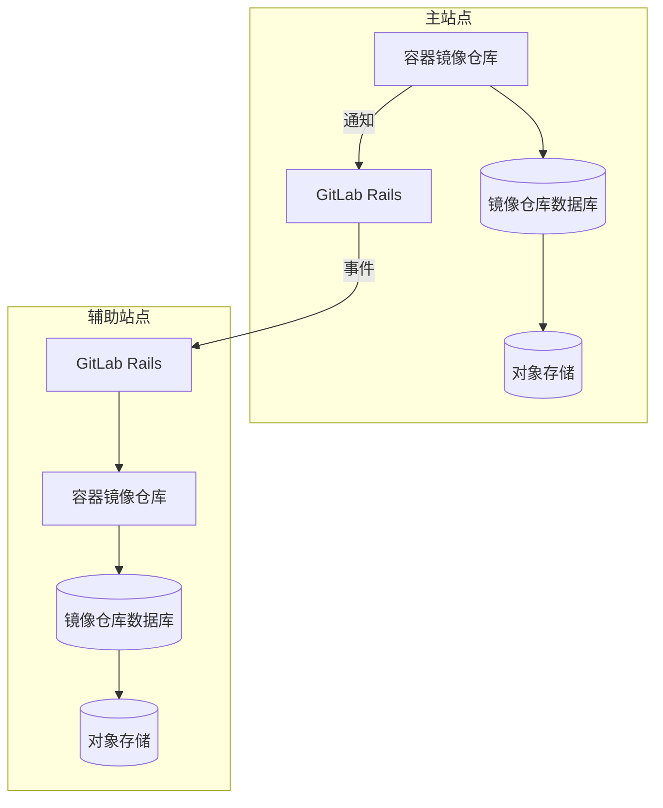



- Tier: 基础版，专业版，旗舰版
- Offering: 私有化部署





- 在极狐GitLab 17.3 中 GA。
- 对于新的 Linux 软件包和自编译安装的偏好模式于极狐GitLab 19.0 中引入。默认启用。



元数据库为容器镜像仓库提供了多项[增强功能](#enhancements)，可提升性能并增加新特性。
关于容器镜像仓库元数据库功能的私有化部署版本的工作，在史诗 5521 中跟踪。

默认情况下，容器镜像仓库使用对象存储或本地文件系统来持久化与容器镜像相关的元数据。这种元数据存储方式限制了数据访问效率，尤其是在涉及多个镜像的数据操作时，例如列出标签。通过使用数据库存储这些数据，可以实现许多新功能，包括[在线垃圾回收](https://gitlab.com/gitlab-org/container-registry/-/blob/master/docs/spec/gitlab/online-garbage-collection.md)，它可以自动删除旧数据，且无需停机。

该数据库与容器镜像仓库已使用的存储协同工作，但不会替代对象存储或文件系统。
即使已将元数据导入元数据库，你仍须维护存储解决方案。

对于 Helm Chart 安装，请参阅 Helm Chart 文档中的[管理容器镜像仓库元数据库](https://gitlab.cn/docs/charts/charts/registry/metadata_database/#create-the-database)。

<a id="enhancements"></a>

## 增强功能

元数据库架构支持传统元数据存储所不具备的性能提升、缺陷修复和新功能。这些增强功能包括：

- 自动[在线垃圾回收](../../user/packages/container_registry/delete_container_registry_images.md#garbage-collection)
- [仓库、项目与群组的存储用量可见性](../../user/packages/container_registry/reduce_container_registry_storage.md#view-container-registry-usage)
- [镜像签名](../../user/packages/container_registry/_index.md#container-image-signatures)
- [移动与重命名仓库](../../user/packages/container_registry/_index.md#move-or-rename-container-registry-repositories)
- [受保护的标签](../../user/packages/container_registry/protected_container_tags.md)
- [清理策略](../../user/packages/container_registry/reduce_container_registry_storage.md#cleanup-policy)的性能提升，确保能够成功清理大型仓库
- 列出仓库标签的性能提升
- 跟踪并显示标签发布的时间戳（参见[议题 290949]（移除链接））
- 支持按名称之外的其他属性对仓库标签进行排序

由于传统元数据存储的技术限制，新功能仅针对元数据库版本实现。非安全类的缺陷修复可能也仅限元数据库版本。

## 已知限制

- 为现有容器镜像仓库导入元数据需要一段只读时间。
- 在 18.3 之前，升级版本时必须手动运行容器镜像仓库的常规架构迁移和部署后数据库迁移。
- 在多节点 Linux 软件包环境中，无法保证容器镜像仓库[升级期间的零停机时间](../../update/zero_downtime.md)。
- 在为现有容器镜像仓库导入元数据的过程中，镜像标签的 `createdAt` 和 `publishedAt` 时间戳将被设置为导入日期。这是为确保一致性而有意为之，因为传统容器镜像仓库不会收集所有镜像的标签发布日期。虽然部分镜像的元数据中包含构建日期，但许多镜像没有。更多信息，请参见 [issue 1384](https://gitlab.com/gitlab-org/container-registry/-/issues/1384)（移除链接？按照规则删除议题链接，我们只保留文字）。

## 元数据库功能支持

你可以将现有容器镜像仓库的元数据导入到元数据库中，并使用在线垃圾回收功能。

部分支持数据库的功能仅在 JihuLab.com 上启用，且容器镜像仓库数据库的自动数据库配置尚不可用。请查看[反馈 issue](https://gitlab.com/gitlab-org/gitlab/-/issues/423459#supported-feature-status) 中的功能支持表，了解与容器镜像仓库数据库相关的各项功能状态。

## 为 Linux 软件包安装启用元数据库

前提条件：

- 极狐GitLab 17.5 是最低要求版本，但建议使用极狐GitLab 18.3 或更高版本，因为这些版本有更多改进且配置更简单。
- PostgreSQL 数据库须[满足版本要求](../../install/requirements.md#postgresql)，且须能从容器镜像仓库节点访问。
- 如果使用外部数据库，你必须先设置外部数据库连接。更多信息，请参见[使用外部数据库](#using-an-external-database)。

### 开始前需知

- 启用数据库后，你必须持续使用它。此时数据库已成为容器镜像仓库元数据的来源，此后若禁用数据库，将导致容器镜像仓库无法看到数据库启用期间写入的所有镜像。
- [离线垃圾回收](container_registry.md#container-registry-garbage-collection)不再需要。启用数据库后，极狐GitLab 自带的垃圾回收命令会安全退出，但第三方命令（如上游容器镜像仓库提供的命令）会删除与带标签镜像关联的数据。
- 请确认你尚未自动执行离线垃圾回收，尤其是使用第三方命令的情况下。
- 你可以先[缩减容器镜像仓库的存储空间](../../user/packages/container_registry/reduce_container_registry_storage.md)，以加快导入过程。
- 尽可能[备份容器镜像仓库数据](../backup_restore/backup_gitlab.md#container-registry)。
- 配置容器镜像仓库[通知](container_registry.md#configure-container-registry-notifications)。

### 为新安装启用数据库

对于从未向容器镜像仓库写入数据的安装，无需导入。您只需在向容器镜像仓库写入数据前启用数据库即可。

更多信息，请参见[新安装](container_registry_metadata_database_new_install.md)的说明。

### 为现有容器镜像仓库启用数据库

你可以使用一步导入法或三步导入法，导入现有容器镜像仓库的元数据。
导入耗时受以下因素影响：

- 容器镜像仓库中带标签镜像的数量。
- 现有容器镜像仓库数据的大小。
- PostgreSQL 实例的规格。
- 正在运行的容器镜像仓库实例数量。
- 容器镜像仓库、PostgreSQL 和已配置存储之间的网络延迟。

在准备导入前，无需执行以下操作：

- 分配额外的对象存储或文件系统空间：导入过程不会对此存储产生大量写入。
- 运行离线垃圾回收：虽然不是有害操作，但离线垃圾回收并不能大幅缩短导入时间，不值得花费运行该命令的时间。

> [!note]
> 元数据导入仅针对带标签的镜像。未标记且未被引用的清单，以及仅被它们引用的层，将被遗留并变得不可访问。未标记的镜像从未在极狐GitLab UI 或 API 中可见，但它们可能会成为“悬空镜像”，遗留在后端。导入新容器镜像仓库后，所有镜像都将受到持续的在线垃圾回收管理，默认情况下，任何未标记且未被引用的清单和层若保留超过 24 小时都将被删除。

### 选择合适的导入方法

如果你定期运行[离线垃圾回收](container_registry.md#container-registry-garbage-collection)，请使用[一步导入法](container_registry_metadata_database_one_step_import.md)。该方法的耗时相近，且操作比三步导入法更简单。

如果你的容器镜像仓库太大，无法定期运行离线垃圾回收，请使用[三步导入法](container_registry_metadata_database_three_step_import.md)，以显著缩短只读时间。

如果你使用外部数据库，在开始迁移之前，请确保已建立外部数据库连接。

更多信息，请参见[使用外部数据库](#using-an-external-database)。

### 恢复中断的导入



- 在极狐GitLab 18.5 中引入。



跳过最近 72 小时内已预导入的仓库，以恢复中断的导入。以下两种情况的仓库均被视为已预导入：

- 已完成三步导入流程的第一步
- 已完成一步导入流程

要恢复中断的导入，请配置 `--pre-import-skip-recent` 标志。默认值为 72 小时。

例如：

```shell
# 跳过自导入命令开始起 6 小时内导入的仓库
--pre-import-skip-recent 6h

# 禁用跳过行为
--pre-import-skip-recent 0
```

有关有效时长单位的更多信息，请参见 [Go duration strings](https://pkg.go.dev/time#ParseDuration)。

### 导入后

完成大规模导入后，可能会有数十万甚至数百万个 blob 排队等待垃圾回收审查。这是正常现象。

由于带标签的镜像先于悬空 blob 被清点，因此垃圾回收器最初会审查那些仍被带标签镜像引用的 blob。垃圾回收会将这些 blob 移出队列，但不会从存储中删除它们。

只有在垃圾回收器处理到悬空 blob 时，存储空间才会减少。导入后，容器镜像仓库的存储空间可能需要 48 小时或更长时间才会减少，因为垃圾回收器会延迟审查，以避免干扰镜像 blob。

要监控和管理导入后的垃圾回收积压任务：

- [检查在线垃圾回收的健康状况](#check-the-health-of-online-garbage-collection)，查看审查队列的大小和状态。
- [调整垃圾回收器的工作间隔](#adjust-the-garbage-collector-worker-interval)，以临时加速处理大型积压任务。

<a id="prefer-mode"></a>

## 偏好模式



- 在极狐GitLab 18.7 中引入。
- 在极狐GitLab 19.0 中，对于新的 Linux 软件包和自编译安装[默认启用](https://gitlab.com/gitlab-org/container-registry/-/merge_requests/2849)（链接取消）。



偏好模式是元数据库的一项配置选项，它允许容器镜像仓库在现有仓库尚未导入数据库时，回退到传统元数据存储。

### 启用偏好模式

启用偏好模式：

1. 在 `/etc/gitlab/gitlab.rb` 中，将 `database.enabled` 设置为 `"prefer"`，而不是 `true` 或 `false`：

   ```ruby
   registry['database'] = {
     'enabled' => 'prefer',
     'host' => '<your_database_host>',
     'port' => 5432,
     'user' => '<your_database_user>',
     'password' => '<your_database_password>',
     'dbname' => '<your_database_name>',
   }
   ```

1. 保存文件并[重新配置极狐GitLab](../restart_gitlab.md)。

重新配置极狐GitLab后，容器镜像仓库会在启动时根据跟踪先前文件系统或数据库写入情况的锁文件评估使用哪个元数据后端：

- 文件系统锁文件存在：容器镜像仓库有现有的文件系统元数据。它将回退到传统元数据存储并记录一条警告。在你完成[元数据导入](#enable-the-database-for-existing-registries)之前，容器镜像仓库的运行行为与 `enabled: false` 完全相同。
- 数据库锁文件存在：容器镜像仓库已在使用数据库。它将正常连接到数据库，与 `enabled: true` 行为相同。
- 两个锁文件均不存在：容器镜像仓库是全新安装。它需要一个已配置且可访问的数据库才能启动，且不会回退到传统存储。
- 两个锁文件都存在：容器镜像仓库将拒绝启动。这表明存在配置错误，必须手动解决。

回退决定只在启动时发生一次，且在容器镜像仓库运行期间不会改变。回退后，不会自动重试或重新连接到数据库。要在回退后从文件系统模式切换到数据库模式，请完成标准的[元数据导入](#enable-the-database-for-existing-registries)并重启容器镜像仓库。

### 默认配置



- 在极狐GitLab 19.0 中，对于新的 Linux 软件包和自编译安装，默认元数据库模式[更改为 `prefer`](https://gitlab.com/gitlab-org/container-registry/-/merge_requests/2849)（链接取消）。



在极狐GitLab 19.0 及更高版本中，对于新安装，默认以偏好模式启用元数据库：

- Linux 软件包 (Omnibus) 安装：当 `/etc/gitlab/gitlab.rb` 中未指定该设置时，`registry['database']['enabled']` 默认为 `"prefer"`。更多信息，请参见 [issue 9396](https://gitlab.com/gitlab-org/omnibus-gitlab/-/issues/9396)（删除链接）。
- 自编译安装：当容器镜像仓库配置文件中未指定该设置时，`database.enabled` 默认为 `"prefer"`。

升级后，请检查容器镜像仓库正在使用哪种后端。具体步骤请参见[验证当前活动的元数据后端](#verify-which-metadata-backend-is-active)。

#### 新安装

在全新的极狐GitLab 19.0 或更高版本安装中，容器镜像仓库以偏好模式启动。如果配置了可访问的元数据库，容器镜像仓库将使用它。如果没有可访问的数据库，容器镜像仓库将无法启动。

要保持新安装使用文件系统元数据，请在首次启动容器镜像仓库之前，将数据库模式设置为 `"false"`：

- 对于 Linux 软件包 (Omnibus) 安装，在 `/etc/gitlab/gitlab.rb` 中：

  ```ruby
  registry['database']['enabled'] = "false"
  ```

- 对于自编译安装，在 `/home/git/gitlab/config/gitlab.yml` 中：

  ```yaml
  registry:
    database:
      enabled: false
  ```

#### 已有安装

将已有安装升级到极狐GitLab 19.0 或更高版本时，会保留当前的 `registry['database']['enabled']` 设置。升级不会迁移元数据，也不会切换活动的后端。

已处于偏好模式并使用文件系统元数据的安装，升级后将继续使用文件系统元数据。要切换到数据库，请完成[元数据导入](#enable-the-database-for-existing-registries)。

#### 元数据库备份

当容器镜像仓库使用元数据库时，需在备份中包含容器镜像仓库数据库。具体步骤请参见[使用元数据库进行备份](#backup-with-metadata-database)。

已处于偏好模式并使用文件系统元数据的安装，在多次重启期间都将保持回退状态。在回退期间，容器镜像仓库不会从元数据库读取或写入数据。在回退结束前，你无需备份元数据库。

要结束回退，请完成[元数据导入](#enable-the-database-for-existing-registries)并重启容器镜像仓库。重启后，容器镜像仓库将使用元数据库。请将其纳入你的备份计划。

<a id="verify-which-metadata-backend-is-active"></a>

### 验证当前活动的元数据后端

要验证容器镜像仓库正在使用哪种元数据后端，可使用以下方法之一。

#### 检查容器镜像仓库 API 响应头

1. 向容器镜像仓库 `/v2/` 端点发送请求：

   ```shell
   curl --silent --head "https://registry.example.com/v2/" | grep --ignore-case gitlab-container-registry-database-enabled
   ```

1. 检查 `gitlab-container-registry-database-enabled` 响应头：

   - 值为 `true` 表示容器镜像仓库正在使用元数据库。
   - 值为 `false` 表示正在使用传统的文件系统存储。

#### 检查磁盘上的锁文件

要检查磁盘上的锁文件，请在已配置存储后端的 `<rootdirectory>/docker/registry/lockfiles/` 目录中查找以下文件：

- `database-in-use`：容器镜像仓库正在使用元数据库。
- `filesystem-in-use`：容器镜像仓库正在使用传统的文件系统存储。

如果两个锁文件都存在，则容器镜像仓库处于无效状态，不会启动。

#### 检查容器镜像仓库日志

容器镜像仓库会在启动时记录所选用的元数据后端。

要检查容器镜像仓库日志，请查找以下消息之一：

- 如果容器镜像仓库回退到传统存储（仅限偏好模式）：

  ```plaintext
  数据库偏好模式已启用，但发现文件系统元数据：回退到传统元数据
  ```

- 如果容器镜像仓库连接到数据库：

  ```plaintext
  正在使用元数据库
  ```

<a id="database-migrations"></a>

## 数据库迁移

容器镜像仓库支持两种类型的迁移：

- 常规架构迁移：部署新应用代码前必须运行的数据库结构变更，也称为预部署迁移。这类迁移应当迅速（不超过几分钟），以避免部署延迟。
- 部署后迁移：可以在应用运行时进行的数据库结构变更。用于大型表上创建索引等耗时较长的操作，可避免启动延迟和升级停机时间延长。

默认情况下，容器镜像仓库会同时应用常规架构迁移和部署后迁移。
为了减少升级停机时间，你可以跳过部署后迁移，并在应用启动后手动应用它们。

### 应用数据库迁移





要在应用启动前同时应用常规架构迁移和部署后迁移：

1. 运行数据库迁移：

   ```shell
   sudo gitlab-ctl registry-database migrate up
   ```

要跳过部署后迁移：

1. 仅运行常规架构迁移：

   ```shell
   sudo gitlab-ctl registry-database migrate up --skip-post-deployment
   ```

   除了使用 `--skip-post-deployment` 标志，你还可以将环境变量 `SKIP_POST_DEPLOYMENT_MIGRATIONS` 设置为 `true`：

   ```shell
   SKIP_POST_DEPLOYMENT_MIGRATIONS=true sudo gitlab-ctl registry-database migrate up
   ```

1. 启动应用后，应用所有待处理的部署后迁移：

   ```shell
   sudo gitlab-ctl registry-database migrate up
   ```





要在应用启动前同时应用常规架构迁移和部署后迁移：

1. 运行数据库迁移：

   ```shell
   sudo -u registry gitlab-ctl registry-database migrate up
   ```

要跳过部署后迁移：

1. 仅运行常规架构迁移：

   ```shell
   sudo -u registry gitlab-ctl registry-database migrate up --skip-post-deployment
   ```

   除了使用 `--skip-post-deployment` 标志，你还可以将环境变量 `SKIP_POST_DEPLOYMENT_MIGRATIONS` 设置为 `true`：

   ```shell
   SKIP_POST_DEPLOYMENT_MIGRATIONS=true sudo -u registry gitlab-ctl registry-database migrate up
   ```

1. 启动应用后，应用所有待处理的部署后迁移：

   ```shell
   sudo -u registry gitlab-ctl registry-database migrate up
   ```





> [!note]
> `migrate up` 命令提供了一些额外的标志，可用于控制迁移的应用方式。
> 请运行 `sudo gitlab-ctl registry-database migrate up --help` 了解详情。

<a id="online-garbage-collection-monitoring"></a>

## 在线垃圾回收监控

导入过程之后，在线垃圾回收的初始运行时长会因导入的镜像数量而异。在此期间，你应当监控在线垃圾回收的效率和健康状况。

### 监控数据库性能

完成导入后，随着垃圾回收队列不断清空，预计数据库会经历一段高负载时期。这种高负载是由于在线垃圾回收器处理队列任务时产生大量独立数据库调用所致。

定期检查 PostgreSQL 和容器镜像仓库日志中是否有错误或警告。在容器镜像仓库日志中，请特别关注按 `component=registry.gc.*` 过滤的日志。

### 跟踪指标

使用 Prometheus 和 Grafana 等监控工具可视化并跟踪垃圾回收指标，重点关注前缀为 `registry_gc_*` 的指标。这些指标包括标记为删除的对象数量、成功删除的对象数量、运行间隔和持续时间。
有关如何启用 Prometheus 的信息，请参见[启用容器镜像仓库调试服务器](container_registry_troubleshooting.md#enable-the-registry-debug-server)。

### 监控任务队列

监控 blob 和清单的垃圾回收任务队列的运行状况和状态。

<a id="check-the-health-of-online-garbage-collection"></a>

#### 检查在线垃圾回收的健康状况





以下命令显示与在线垃圾回收相关的信息。

```shell
sudo gitlab-ctl registry-database gc-stats
```

示例输出：

```shell
=== Blob Review Queue ===

Tasks Pending Removal: 42
Tasks ready for GC review (review_after has passed).

┌───────────────────────────────────────────────────────────────────┬─────────────────────┬─────────────────┐
│                              DIGEST                               │    REVIEW AFTER     │      EVENT      │
├───────────────────────────────────────────────────────────────────┼─────────────────────┼─────────────────┤
│ sha256:a3ed95caeb02ffe68cdd9fd84406680ae93d633cb16422d00e8a7c22e  │ 2026-01-16 21:56:13 │ blob_upload     │
│ sha256:b4f5e6d7c8a9b0c1d2e3f4a5b6c7d8e9f0a1b2c3d4e5f6a7b8c9d0e1f2 │ 2026-01-16 19:56:13 │ manifest_delete │
│ sha256:c5d6e7f8a9b0c1d2e3f4a5b6c7d8e9f0a1b2c3d4e5f6a7b8c9d0e1f2a3 │ 2026-01-16 17:56:13 │ layer_delete    │
└───────────────────────────────────────────────────────────────────┴─────────────────────┴─────────────────┘

Long Overdue Tasks: 5
Tasks pending longer than configured delay - may need attention.

┌───────────────────────────────────────────────────────────────────┬─────────────────────┬──────────────┬─────────┐
│                              DIGEST                               │    REVIEW AFTER     │    EVENT     │ OVERDUE │
├───────────────────────────────────────────────────────────────────┼─────────────────────┼──────────────┼─────────┤
│ sha256:d6e7f8a9b0c1d2e3f4a5b6c7d8e9f0a1b2c3d4e5f6a7b8c9d0e1f2a3b4 │ 2026-01-11 23:56:13 │ blob_upload  │ 4d 0h   │
│ sha256:e7f8a9b0c1d2e3f4a5b6c7d8e9f0a1b2c3d4e5f6a7b8c9d0e1f2a3b4c5 │ 2026-01-13 23:56:13 │ layer_delete │ 2d 0h   │
└───────────────────────────────────────────────────────────────────┴─────────────────────┴──────────────┴─────────┘

High Retry Tasks: 2
Tasks with >10 review attempts - may indicate persistent issues.

┌───────────────────────────────────────────────────────────────────┬─────────────────────┬─────────────────┬─────────┐
│                              DIGEST                               │    REVIEW AFTER     │      EVENT      │ RETRIES │
├───────────────────────────────────────────────────────────────────┼─────────────────────┼─────────────────┼─────────┤
│ sha256:f8a9b0c1d2e3f4a5b6c7d8e9f0a1b2c3d4e5f6a7b8c9d0e1f2a3b4c5d6 │ 2026-01-17 00:56:13 │ blob_upload     │ 15      │
│ sha256:a9b0c1d2e3f4a5b6c7d8e9f0a1b2c3d4e5f6a7b8c9d0e1f2a3b4c5d6e7 │ 2026-01-17 01:56:13 │ manifest_delete │ 12      │
└───────────────────────────────────────────────────────────────────┴─────────────────────┴─────────────────┴─────────┘

=== Manifest Review Queue ===

Tasks Pending Removal: 128
Tasks ready for GC review (review_after has passed).

┌───────────────┬─────────────┬─────────────────────┬──────────────────────┐
│ REPOSITORY ID │ MANIFEST ID │    REVIEW AFTER     │        EVENT         │
├───────────────┼─────────────┼─────────────────────┼──────────────────────┤
│ 1001          │ 12345       │ 2026-01-16 22:56:13 │ tag_delete           │
│ 1002          │ 67890       │ 2026-01-16 20:56:13 │ manifest_upload      │
│ 1003          │ 11111       │ 2026-01-16 18:56:13 │ tag_switch           │
│ 2001          │ 22222       │ 2026-01-16 16:56:13 │ manifest_list_delete │
└───────────────┴─────────────┴─────────────────────┴──────────────────────┘

Long Overdue Tasks: 8
Tasks pending longer than configured delay - may need attention.

```
┌───────────────┬─────────────┬─────────────────────┬─────────────────┬─────────┐
│   仓库 ID      │  清单 ID    │     审查时间         │      事件       │ 逾期时长 │
├───────────────┼─────────────┼─────────────────────┼─────────────────┼─────────┤
│ 3001          │ 33333       │ 2026-01-12 23:56:13 │ tag_delete      │ 3d 0h   │
│ 3002          │ 44444       │ 2026-01-14 23:56:13 │ manifest_delete │ 1d 0h   │
└───────────────┴─────────────┴─────────────────────┴─────────────────┴─────────┘

高重试任务：3 个
重试次数超过 10 次的任务——可能表明存在持续性问题。

┌───────────────┬─────────────┬─────────────────────┬─────────────────┬─────────┐
│   仓库 ID      │  清单 ID    │     审查时间         │      事件       │ 重试次数 │
├───────────────┼─────────────┼─────────────────────┼─────────────────┼─────────┤
│ 4001          │ 55555       │ 2026-01-17 00:26:13 │ tag_delete      │ 18      │
│ 4002          │ 66666       │ 2026-01-17 00:41:13 │ manifest_upload │ 11      │
└───────────────┴─────────────┴─────────────────────┴─────────────────┴─────────┘
```





### 连接到极狐GitLab 容器镜像仓库元数据数据库

使用以下命令连接到镜像仓库元数据数据库：

```shell
gitlab-psql -d registry
```

### 查询在线垃圾回收任务的状态

以下查询会返回重试次数超过 10 次，或符合审查条件的时长超过 24 小时的任务。
在线垃圾回收器应在 24 小时内拾取待审查项，并且失败尝试次数很少。
如果有任何行返回，请检查您的在线垃圾回收器的健康状况。

针对清单：

```sql
SELECT
  repository_id,
  manifest_id,
  ROUND(
    EXTRACT(
      EPOCH
      FROM
        AGE(NOW(), review_after)
    ) / 3600
  ) AS hours_eligible_for_review,
  review_count as failed_review_attempts,
  event
FROM
  gc_manifest_review_queue
WHERE
  review_after < NOW() - INTERVAL '24 hours'
  OR review_count > 10
LIMIT
  20;
```

针对 Blob：

```sql
SELECT
  substring(encode(digest, 'hex'), 3) AS digest,
  ROUND(
    EXTRACT(
      EPOCH
      FROM
        AGE(NOW(), review_after)
    ) / 3600
  ) AS hours_eligible_for_review,
  review_count as failed_review_attempts,
  event
FROM
  gc_blob_review_queue
WHERE
  review_after < NOW() - INTERVAL '24 hours'
  OR review_count > 10
LIMIT
  20;
```

#### 与在线垃圾回收相关的信息性查询

通过运行以下查询来检查符合审查条件的任务数量：

```sql
SELECT COUNT(*) FROM gc_blob_review_queue WHERE review_after < NOW();
SELECT COUNT(*) FROM gc_manifest_review_queue WHERE review_after < NOW();
```





一般来说，待审查项的数量应该相对较少，通常接近于零。但是，在以下情况下，可能会有更多：

- 24 到 48 小时前启动了导入。
- 大量标签被删除或某个容器仓库被移除。
- 在线垃圾回收被禁用了较长时间。

如果存在重试任务或长期逾期的任务，请检查镜像仓库日志中与垃圾回收相关的消息。按 `component="registry.gc.*` 过滤条目，并调查所有错误消息。

#### 故障排除前的检查

##### GC 队列大小

`gc_manifest_review_queue` 和 `gc_blob_review_queue` 的未过滤大小不是衡量在线垃圾回收器健康状况的好指标。这些队列会不断添加新条目；因此，对于一个活跃的镜像仓库来说，这些队列永远不会完全清空。

此外，并非这些队列中的所有项都会被从存储中移除。请参阅[在线垃圾回收](https://gitlab.com/gitlab-org/container-registry/-/blob/master/docs/spec/gitlab/online-garbage-collection.md)规范，以获取有关这些队列的完整解释和更多背景信息。

##### 大量待审查任务

大量符合审查条件的任务也不一定需要担忧。垃圾回收器可能正在处理由活动激增产生的项。

##### 部分任务是旧的

同样，仅凭这些任务的 `created_at` 日期也不是一个好的健康指标。当某个事件将相同的 Blob 或清单添加到队列时，现有任务的 `review_after` 会被更新，从而推迟审查。不会创建重复任务。

这种情况可能发生任意次数，因此几个月前创建的任务无需担忧。

### 调整垃圾回收器工作间隔

如果符合审查条件的任务数量仍然很多，并且您希望提高垃圾回收 Blob 或清单工作程序运行的频率，请将间隔配置从默认值 (`5s`) 更新为 `1s`：

```ruby
registry['gc'] = {
  'blobs' => {
    'interval' => '1s'
  },
  'manifests' => {
    'interval' => '1s'
  }
}
```

在导入负载被清除后，您应该针对长期运行对这些设置进行微调，以避免给数据库和镜像仓库实例带来不必要的 CPU 负载。您可以逐渐增加间隔到一个能够平衡性能和资源使用的值。

### 验证数据一致性

为确保导入后的数据一致性，请使用 [`crane validate`](https://github.com/google/go-containerregistry/blob/main/cmd/crane/doc/crane_validate.md) 工具。此工具会检查容器镜像仓库中的所有镜像层和清单是否可访问且链接正确。通过运行 `crane validate`，您可以确认镜像仓库中的镜像是完整且可访问的，从而确保导入成功。

### 审查清理策略

如果您的大多数镜像都有标签，垃圾回收将不会显著减少存储空间，因为它只删除无标签的镜像。

实施清理策略以移除不需要的标签，最终会导致镜像通过垃圾回收被移除并回收存储空间。

## 使用外部数据库

默认情况下，极狐GitLab 18.3 及更高版本会在主极狐GitLab 数据库中为容器镜像仓库元数据预先配置一个逻辑数据库。但是，如果您想[扩展镜像仓库](container_registry.md#scaling-by-component)，则可能需要为容器镜像仓库使用专用的外部数据库。

### 步骤

- 创建[外部数据库](../postgresql/external.md#container-registry-metadata-database)。

然后，针对默认数据库执行相同的步骤，并替换为您自己的数据库值。从数据库禁用状态开始，注意按照指示启用和禁用数据库：

```ruby
registry['database'] = {
  'enabled' => false,
  'host' => '<registry_database_host_placeholder_change_me>',
  'port' => 5432, # 默认值，但请根据您的数据库实例端口进行设置（如果不同的话）。
  'user' => '<registry_database_username_placeholder_change_me>',
  'password' => '<registry_database_placeholder_change_me>',
  'dbname' => '<registry_database_name_placeholder_change_me>',
  'sslmode' => 'require', # 更多信息请参阅 PostgreSQL 文档 https://www.postgresql.org/docs/16/libpq-ssl.html。
  'sslcert' => '</path/to/cert.pem>',
  'sslkey' => '</path/to/private.key>',
  'sslrootcert' => '</path/to/ca.pem>'
}
```

## 使用元数据数据库进行备份



- 在极狐GitLab 18.10 中[引入](https://gitlab.com/gitlab-org/gitlab/-/work_items/581279)了对镜像仓库元数据数据库的自动备份支持。



当元数据数据库启用时，备份必须同时包括镜像仓库存储后端和数据库。

备份方法取决于您的存储类型：

- 本地文件系统存储：`gitlab-backup` 会自动包含镜像仓库。
- 对象存储：您必须单独备份对象存储。

应尽可能使存储和数据库的备份时间点接近，以确保镜像仓库状态一致。要恢复镜像仓库，您必须同时应用两份备份。

### 自动备份

在极狐GitLab 18.10 及更高版本中，当元数据数据库已配置时，`gitlab-backup create` 和 `gitlab-backup restore` 会自动包含镜像仓库元数据数据库。在 Helm Chart (Kubernetes) 安装中，`backup-utility` 的行为相同。

必须在 `gitlab.rb` 或您的 Helm values 文件中配置元数据数据库。

无需额外配置。备份工具会从现有配置中读取镜像仓库数据库连接设置。

如果您直接调用备份 Rake 任务，则必须在运行备份的节点上设置以下环境变量：

| 变量 | 是否必需 | 描述 |
|---|---|---|
| `REGISTRY_DATABASE_HOST` | 是 | 数据库主机。 |
| `REGISTRY_DATABASE_NAME` | 是 | 数据库名称。 |
| `REGISTRY_DATABASE_USER` | 是 | 数据库用户。 |
| `REGISTRY_DATABASE_PORT` | 否 | 数据库端口。默认为 `5432`。 |
| `REGISTRY_DATABASE_PASSWORD` | 否 | 数据库密码。 |
| `REGISTRY_DATABASE_SSLMODE` | 否 | 是否需要 SSL 模式。设置为 `require` 或省略。 |
| `REGISTRY_DATABASE_SSLCERT` | 否 | 客户端证书的路径。 |
| `REGISTRY_DATABASE_SSLKEY` | 否 | 客户端私钥的路径。 |
| `REGISTRY_DATABASE_SSLROOTCERT` | 否 | CA 证书的路径。 |
| `REGISTRY_DATABASE_CONNECT_TIMEOUT` | 否 | 连接超时时间（秒）。 |

备份 Rake 任务在检测到以下任何凭据时会激活镜像仓库数据库备份：

- `REGISTRY_DATABASE_PASSWORD`
- `REGISTRY_DATABASE_SSLCERT`
- `REGISTRY_DATABASE_SSLKEY`
- `REGISTRY_DATABASE_SSLROOTCERT`

没有凭据，镜像仓库数据库将不包含在备份中。恢复时也必须设置相同的环境变量。

### 手动备份

如果您使用极狐GitLab 18.9 或更早版本，或者您更倾向于单独管理镜像仓库数据库备份，请使用标准的 PostgreSQL 工具，如 `pg_dump` 和 `pg_restore` 来独立备份和恢复镜像仓库数据库。

### Helm Chart (Kubernetes) 备份和恢复



- [引入](https://gitlab.com/gitlab-org/charts/gitlab/-/work_items/6207)于极狐GitLab 18.10。



对于 Helm Chart (Kubernetes) 部署，请为工具箱 Pod 配置专门用于备份和恢复操作的数据库凭据。
需要两个独立的 PostgreSQL 用户：

- 备份用户必须拥有只读权限。
- 恢复用户必须拥有写入权限。

根据需要进行的操作，配置其中一个或两个用户。

开始之前，请通过设置 `registry.database.enabled: true` 来启用容器镜像仓库元数据数据库。

#### 创建 Kubernetes Secret

您必须在部署前手动创建 Kubernetes Secret。Chart 不会自动生成此密钥。

例如，要创建一个同时包含备份和恢复密码的 Secret：

```shell
kubectl create secret generic my-registry-db-password-secret \
  --from-literal=backupPassword="BACKUP_USER_PASSWORD" \
  --from-literal=restorePassword="RESTORE_USER_PASSWORD"
```

#### 配置镜像仓库数据库凭据

在您的 Helm `values.yaml` 中添加必需的 YAML 来配置备份和恢复用户。请参考下表了解配置项的定义。

| 设置项 | 默认值 | 描述 |
|---|---|---|
| `backupUser` | | 用于备份操作的 PostgreSQL 用户名。启用镜像仓库数据库备份所必需。 |
| `restoreUser` | | 用于恢复操作的 PostgreSQL 用户名。启用镜像仓库数据库恢复所必需。 |
| `password.secret` | `<release-name>-toolbox-registry-database-password` | 包含密码的 Kubernetes Secret 的名称。 |
| `password.backupPasswordKey` | `backupPassword` | Kubernetes Secret 中用于备份用户密码的键。 |
| `password.restorePasswordKey` | `restorePassword` | Kubernetes Secret 中用于恢复用户密码的键。 |

以下示例同时配置了备份和恢复用户：

```yaml
gitlab:
  toolbox:
    backups:
      registry:
        database:
          # 用于备份镜像仓库数据库的 PostgreSQL 用户名
          backupUser: "registry_backup"
          # 用于恢复镜像仓库数据库的 PostgreSQL 用户名
          restoreUser: "registry_restore"
          password:
            # 包含密码的 Kubernetes Secret 的名称
            secret: "my-registry-db-password-secret"
            # Secret 中用于备份用户密码的键
            backupPasswordKey: "backupPassword"
            # Secret 中用于恢复用户密码的键
            restorePasswordKey: "restorePassword"
```

如果没有配置 `backupUser` 或 `restoreUser`，镜像仓库数据库备份将被静默跳过，工具箱 Pod 将正常运行。

#### PostgreSQL 用户权限

备份用户需要对镜像仓库数据库拥有只读权限才能进行转储。恢复用户需要超级用户权限才能进行恢复。

对于 Linux 软件包安装，当配置了 `database_backup_username`、`database_backup_password`、`database_restore_username` 和 `database_restore_password` 时，这些用户和权限会自动创建。

对于自行编译或外部数据库安装，请手动创建用户并授予权限：

```sql
-- 创建用于 pg_dump 的备份用户并赋予最小权限。
-- 镜像仓库数据库同时使用 'public' 和 'partitions' 模式。
CREATE ROLE registry_backup WITH LOGIN PASSWORD 'password'
  NOINHERIT NOCREATEDB NOSUPERUSER NOREPLICATION;

GRANT CONNECT ON DATABASE registry TO registry_backup;

-- 授予对两个模式的只读访问权限
GRANT USAGE ON SCHEMA public TO registry_backup;
GRANT SELECT ON ALL TABLES IN SCHEMA public TO registry_backup;
GRANT SELECT ON ALL SEQUENCES IN SCHEMA public TO registry_backup;
ALTER DEFAULT PRIVILEGES FOR ROLE registry IN SCHEMA public
  GRANT SELECT ON TABLES TO registry_backup;
ALTER DEFAULT PRIVILEGES FOR ROLE registry IN SCHEMA public
  GRANT SELECT ON SEQUENCES TO registry_backup;

GRANT USAGE ON SCHEMA partitions TO registry_backup;
GRANT SELECT ON ALL TABLES IN SCHEMA partitions TO registry_backup;
GRANT SELECT ON ALL SEQUENCES IN SCHEMA partitions TO registry_backup;
ALTER DEFAULT PRIVILEGES FOR ROLE registry IN SCHEMA partitions
  GRANT SELECT ON TABLES TO registry_backup;
ALTER DEFAULT PRIVILEGES FOR ROLE registry IN SCHEMA partitions
  GRANT SELECT ON SEQUENCES TO registry_backup;

-- 创建具有超级用户权限的恢复用户。
-- 数据库恢复操作需要 SUPERUSER 权限，因为恢复过程必须 SET ROLE 到镜像仓库所有者，
-- 并在所有表上 CREATE TRIGGER。
CREATE ROLE registry_restore WITH LOGIN PASSWORD 'password' SUPERUSER;
```

#### 凭据卷工作流

配置后，Chart 会在工具箱 Deployment 和备份 CronJob 中创建一个挂载在 `/etc/gitlab/registry-db/` 的卷。该卷是只读的，包含以下内容：

- 连接参数：由镜像仓库 Chart 创建的 ConfigMap，包含数据库主机、端口、名称、SSL 模式和连接超时。
- 备份和恢复用户名：由工具箱 Chart 创建的 ConfigMap，包含配置的 `backupUser` 和 `restoreUser`。
- 密码：用户提供的 Kubernetes Secret，包含备份和恢复密码。

工具箱 Pod 中的 `backup-utility` 会读取这些文件，并将镜像仓库元数据数据库包含在备份和恢复操作中。

如果缺少任何必需的凭据文件，`backup-utility` 会记录一个警告，并继续备份其他资源。

#### 双向 TLS 限制

用于 PostgreSQL 双向 TLS 认证的 SSL 证书路径仅在全局配置 SSL (`global.psql.ssl`) 时才会包含。如果仅在镜像仓库子 Chart 级别 (`registry.database.ssl`) 配置了 SSL，这些设置将不会传递给工具箱。

### Geo 考量

当使用 [Geo](#database-architecture-with-geo) 时，每个站点都维护自己的镜像仓库数据库和对象存储。请在每个站点独立备份镜像仓库数据库和对象存储。Geo 不会在站点之间复制镜像仓库数据库。

## 降级镜像仓库

要在导入完成后将镜像仓库降级到之前的版本，您必须恢复到所需版本的备份才能完成降级。

## 使用 Geo 的数据库架构

当使用极狐GitLab Geo 与容器镜像仓库时，您必须为每个站点的镜像仓库配置独立的数据库和对象存储栈。容器镜像仓库的 Geo 复制使用由镜像仓库通知生成的事件，而不是通过数据库复制。

### 先决条件

每个 Geo 站点都需要一个独立的、特定于站点的：

1. 用于容器镜像仓库数据库的 PostgreSQL 实例。
2. 用于容器镜像仓库的对象存储实例。
3. 配置为使用这些特定于站点资源的容器镜像仓库。

下图说明了数据流和基本架构：



在每个站点上使用独立的数据库实例，因为：

1. 主极狐GitLab 数据库以只读方式复制到辅助站点。
2. 这种复制不能针对镜像仓库数据库选择性地禁用。
3. 容器镜像仓库需要在两个站点对其数据库都有写入权限。
4. 同构设置可确保 Geo 站点之间具有最大的一致性。

## 回退到对象存储元数据

在完成元数据导入后，您可以将镜像仓库回退到使用对象存储元数据。

> [!warning]
> 当您回退到对象存储元数据时，在导入完成到此回退操作之间添加或删除的任何容器镜像、标签或仓库都将不可用。

要回退到对象存储元数据：

1. 恢复在迁移前制作的[备份](../backup_restore/backup_gitlab.md#container-registry)。
1. 将以下配置添加到您的 `/etc/gitlab/gitlab.rb` 文件中：

   ```ruby
   registry['database'] = {
     'enabled' => false,
   }
   ```

1. 保存文件并[重新配置极狐GitLab](../restart_gitlab.md#reconfigure-a-linux-package-installation)。

## 故障排除

要查看错误以及故障排除的解决方案和变通方法，请参阅[容器镜像仓库元数据数据库故障排除](container_registry_metadata_database_troubleshooting.md)。