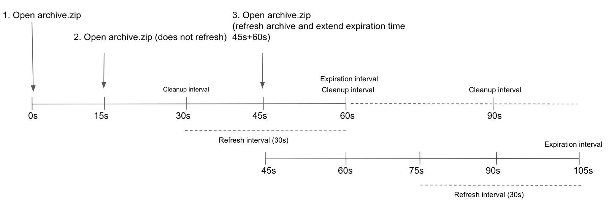



- Tier: 基础版，专业版，旗舰版
- Offering: 私有化部署



GitLab Pages 为极狐GitLab 项目和群组提供静态网站托管服务。
服务器管理员必须先配置 Pages，用户才能使用此功能。
作为管理员，您可以使用 GitLab Pages 来：

- 使用[自定义域名](#custom-domains)和 SSL/TLS 证书安全地托管静态网站。
- 启用身份验证，通过极狐GitLab 权限控制对 Pages 网站的访问。
- 在多节点环境中使用对象存储或网络存储进行扩展部署。
- 使用速率限制和自定义标头监控和管理流量。
- 为所有 Pages 网站支持 IPv4 和 IPv6 地址。

GitLab Pages 守护进程作为独立进程运行，可以配置在与极狐GitLab 相同的服务器上，
也可以配置在专用的基础设施上。
用户文档请参阅 [GitLab Pages](../../user/project/pages/_index.md)。

> [!note]
> 本指南适用于 Linux 软件包安装。对于自编译安装，请参阅
> [自编译安装的 GitLab Pages 管理](source.md)。

<a id="gitlab-pages-daemon"></a>

## GitLab Pages 守护进程

GitLab Pages 使用 [GitLab Pages 守护进程](https://gitlab.com/gitlab-org/gitlab-pages)，这是一个用 Go 编写的基本 HTTP 服务器，
可以监听外部 IP 地址，并支持[自定义域名](#custom-domains)和自定义证书。它通过服务器名称指示（SNI）支持动态证书，并默认使用 HTTP2 公开页面。

更多信息，请参阅 [README](https://gitlab.com/gitlab-org/gitlab-pages/blob/master/README.md)。

当与[自定义域名](#custom-domains)一起使用时，Pages 守护进程必须监听
`80` 或 `443` 端口。对于[通配符域名](#wildcard-domains)，这不是必需的。

您可以通过以下方式运行 Pages 守护进程：

- 在与极狐GitLab 相同的服务器上，监听辅助 IP。
- 在[独立服务器](#running-gitlab-pages-on-a-separate-server)上。[Pages 路径](#change-storage-path)也必须存在于安装 Pages 守护进程的服务器上，因此您必须通过网络共享它。
- 在与极狐GitLab 相同的服务器上，监听相同的 IP 但使用不同的端口。在这种情况下，您必须使用负载均衡器代理流量。对于 HTTPS，请使用 TCP 负载均衡。如果您使用 TLS 终止（HTTPS 负载均衡），则无法使用用户提供的证书提供页面服务。对于 HTTP，HTTP 或 TCP 负载均衡均可接受。

以下部分假定采用第一种方案。如果您不支持自定义域名，则不需要辅助 IP。

<a id="prerequisites"></a>

## 先决条件

本节介绍配置 GitLab Pages 的先决条件。

> [!note]
> 如果您的极狐GitLab 实例和 Pages 守护进程部署在私有网络或防火墙后面，
> 您的 GitLab Pages 网站只能由有权访问私有网络的设备和用户访问。

<a id="wildcard-domains"></a>

### 通配符域名

每个站点都有自己的子域名（例如，`<namespace>.example.io/<project_slug>`）。
此子域名需要通配符 DNS 记录（`*.example.io`），并且是大多数实例的推荐设置。

在为通配符域名配置 Pages 之前，您必须：

1. 拥有一个 Pages 域名，该域名不是您的极狐GitLab 实例域名的子域名。

   | 极狐GitLab 域名        | Pages 域名        | 是否有效？ |
   | -------------------- | ------------------- | ------------- |
   | `example.com`        | `example.io`        |    |
   | `example.com`        | `pages.example.com` |  <sup>1</sup> |
   | `gitlab.example.com` | `pages.example.com` |    |

   **脚注**：

   1. 如果 Pages 域名是您的极狐GitLab 实例域名的子域名，
      所有已部署的 Pages 网站都可以访问极狐GitLab 会话 Cookie。

1. 配置 **通配符 DNS 记录**。
1. 可选。如果您决定在 HTTPS 下提供 Pages 服务，请为该域名准备**通配符证书**。
1. 可选但推荐。启用[实例 Runner](../../ci/runners/_index.md)，这样您的用户就不必自带 Runner。
1. 对于自定义域名，需要**辅助 IP**。

<a id="single-domain-sites"></a>

### 单域名站点

所有站点共享一个域名，命名空间和项目 slug 作为路径段
（例如，`example.io/<namespace>/<project_slug>`）。
此域名只需要一条 DNS `A` 记录。

在为单域名站点配置 Pages 之前，您必须：

1. 拥有一个 Pages 域名，该域名不是您的极狐GitLab 实例域名的子域名。

   | 极狐GitLab 域名        | Pages 域名        | 是否支持 |
   | -------------------- | ------------------- | --------- |
   | `example.com`        | `example.io`        |  |
   | `example.com`        | `pages.example.com` |  <sup>1</sup> |
   | `gitlab.example.com` | `pages.example.com` |  |

   **脚注**：

   1. 如果 Pages 域名是您的极狐GitLab 实例域名的子域名，
      所有已部署的 Pages 网站都可以访问极狐GitLab 会话 Cookie。

1. 配置 **DNS 记录**。
1. 可选。如果您决定在 HTTPS 下提供 Pages 服务，请为该域名准备 **TLS 证书**。
1. 可选但推荐。启用[实例 Runner](../../ci/runners/_index.md)，这样您的用户就不必自带 Runner。
1. 对于自定义域名，需要**辅助 IP**。

<a id="add-the-domain-to-the-public-suffix-list"></a>

### 将域名添加到公共后缀列表

浏览器使用[公共后缀列表](https://publicsuffix.org)来决定如何处理子域名。如果您的极狐GitLab 实例允许公众成员创建 GitLab Pages 网站，那么也允许这些用户在 Pages 域名（`example.io`）上创建子域名。将域名添加到公共后缀列表可以防止浏览器接受[超级 Cookie](https://en.wikipedia.org/wiki/HTTP_cookie#Supercookie)等。

要提交您的 GitLab Pages 子域名，请参阅[提交对公共后缀列表的修订](https://publicsuffix.org/submit/)。
例如，如果您的域名是 `example.io`，您应该请求将 `example.io` 添加到公共后缀列表。GitLab.com 在 [2016 年](https://gitlab.com/gitlab-com/gl-infra/reliability/-/issues/230)添加了 `gitlab.io`。

<a id="dns-configuration"></a>

### DNS 配置

GitLab Pages 在自己的虚拟主机上运行。在您的 DNS 服务器或提供商中，添加一条指向极狐GitLab 运行主机的[通配符 DNS `A` 记录](https://en.wikipedia.org/wiki/Wildcard_DNS_record)。例如：

```plaintext
*.example.io. 1800 IN A    192.0.2.1
*.example.io. 1800 IN AAAA 2001:db8::1
```

其中 `example.io` 是 GitLab Pages 提供服务的域名，
`192.0.2.1` 是您的极狐GitLab 实例的 IPv4 地址，`2001:db8::1` 是 IPv6 地址。如果您没有 IPv6，可以省略 `AAAA` 记录。

<a id="dns-configuration-for-single-domain-sites"></a>

#### 单域名站点的 DNS 配置

要为没有通配符 DNS 的单域名站点配置 GitLab Pages DNS：

1. 通过将 `gitlab_pages['namespace_in_path'] = true` 添加到 `/etc/gitlab/gitlab.rb` 来启用此功能的 GitLab Pages 标志。
1. 在您的 DNS 提供商中，为 `example.io` 添加条目。
   将 `example.io` 替换为您的域名，将 `192.0.0.0` 替换为您实例的 IPv4 地址：

   ```plaintext
   example.io          1800 IN A    192.0.0.0
   ```

1. 可选。如果您的极狐GitLab 实例有 IPv6 地址，请为其添加条目。
   将 `example.io` 替换为您的域名，将 `2001:db8::1` 替换为您实例的 IPv6 地址：

   ```plaintext
   example.io          1800 IN AAAA 2001:db8::1
   ```

   `example.io` 是 GitLab Pages 提供服务的域名。

<a id="dns-configuration-for-custom-domains"></a>

#### 自定义域名的 DNS 配置

如果您需要自定义域名支持，Pages 根域名的所有子域名都必须指向专用于 Pages 守护进程的辅助 IP。如果没有此配置，用户无法使用 `CNAME` 记录将其[自定义域名](#custom-domains)指向其 GitLab Pages。

例如：

```plaintext
example.com   1800 IN A    192.0.2.1
*.example.io. 1800 IN A    192.0.2.2
```

此示例包含：

- `example.com`：极狐GitLab 域名。
- `example.io`：GitLab Pages 提供服务的域名。
- `192.0.2.1`：您的极狐GitLab 实例的主 IP。
- `192.0.2.2`：专用于 GitLab Pages 的辅助 IP。它必须与主 IP 不同。

> [!note]
> 不要使用极狐GitLab 域名来提供用户页面。更多信息，请参阅
> [安全部分](#security)。

<a id="configuration"></a>

## 配置

您可以通过多种方式设置 GitLab Pages。以下示例按从最简单到最复杂的设置列出。

<a id="wildcard-domains-1"></a>

### 通配符域名

此配置是使用 GitLab Pages 的最低设置，是所有其他设置的基础。在此配置中：

- NGINX 将所有请求代理到 GitLab Pages 守护进程。
- GitLab Pages 守护进程不直接监听公共互联网。

先决条件：

- 您已配置[通配符 DNS](#dns-configuration)。

要配置 GitLab Pages 以使用通配符域名：

1. 在 `/etc/gitlab/gitlab.rb` 中设置 GitLab Pages 的外部 URL：

   ```ruby
   external_url "http://example.com" # external_url here is only for reference
   pages_external_url 'http://example.io' # Important: not a subdomain of external_url, so cannot be http://pages.example.com
   ```

1. 保存文件并[重新配置极狐GitLab](../restart_gitlab.md#reconfigure-a-linux-package-installation)以使更改生效。

生成的 URL 方案是 `http://<namespace>.example.io/<project_slug>`。

<!-- Video published on 2017-02-22 -->

<a id="single-domain-sites-1"></a>

### 单域名站点

此配置是使用单域名站点的最低设置，是所有其他单域名设置的基础。在此配置中：

- NGINX 将所有请求代理到 GitLab Pages 守护进程。
- GitLab Pages 守护进程不直接监听公共互联网。

先决条件：

- 您已为[单域名站点](#dns-configuration-for-single-domain-sites)配置 DNS。

要配置 GitLab Pages 以使用单域名站点：

1. 在 `/etc/gitlab/gitlab.rb` 中，设置 GitLab Pages 的外部 URL，并启用该功能：

   ```ruby
   external_url "http://example.com" # Swap out this URL for your own
   pages_external_url 'http://example.io' # Important: not a subdomain of external_url, so cannot be http://pages.example.com

   # Set this flag to enable this feature
   gitlab_pages['namespace_in_path'] = true
   ```

1. 保存文件并[重新配置极狐GitLab](../restart_gitlab.md#reconfigure-a-linux-package-installation)以使更改生效。

生成的 URL 方案是 `http://example.io/<namespace>/<project_slug>`。

> [!warning]
> GitLab Pages 一次只支持一种 URL 方案：通配符域名或单域名站点。
> 如果您启用 `namespace_in_path`，现有的 GitLab Pages 网站只能作为单域名站点访问。

<a id="wildcard-domains-with-tls-support"></a>

### 支持 TLS 的通配符域名

NGINX 将所有请求代理到守护进程。Pages 守护进程不监听公共互联网。

一个实例只能分配一个通配符。

先决条件：

- 您已配置[通配符 DNS](#dns-configuration)。
- 您有 TLS 证书。它可以是通配符证书或满足[要求](../../user/project/pages/custom_domains_ssl_tls_certification/_index.md#manually-add-ssltls-certificates)的任何其他类型。

要配置支持 TLS 的通配符域名：

1. 将 `*.example.io` 的通配符 TLS 证书和密钥放入 `/etc/gitlab/ssl` 中。
1. 在 `/etc/gitlab/gitlab.rb` 中，指定以下配置：

   ```ruby
   external_url "https://example.com" # external_url here is only for reference
   pages_external_url 'https://example.io' # Important: not a subdomain of external_url, so cannot be https://pages.example.com

   pages_nginx['redirect_http_to_https'] = true
   ```

1. 如果您的证书和密钥不命名为 `example.io.crt` 和 `example.io.key`，请添加完整路径：

   ```ruby
   pages_nginx['ssl_certificate'] = "/etc/gitlab/ssl/pages-nginx.crt"
   pages_nginx['ssl_certificate_key'] = "/etc/gitlab/ssl/pages-nginx.key"
   ```

1. 保存文件并[重新配置极狐GitLab](../restart_gitlab.md#reconfigure-a-linux-package-installation)以使更改生效。
1. 如果您使用[访问控制](#access-control)，请更新 GitLab Pages [系统 OAuth 应用程序](../../integration/oauth_provider.md#create-an-instance-wide-application)中的重定向 URI，以使用 HTTPS 协议。

生成的 URL 方案是 `https://<namespace>.example.io/<project_slug>`。

> [!warning]
> 如果对重定向 URI 进行更改，GitLab Pages 不会更新 OAuth 应用程序。
> 在重新配置之前，请从 `/etc/gitlab/gitlab-secrets.json` 中删除 `gitlab_pages` 部分，然后运行 `gitlab-ctl reconfigure`。更多信息，请参阅
> [GitLab Pages 不会重新生成 OAuth](https://gitlab.com/gitlab-org/omnibus-gitlab/-/issues/3947)。

<a id="single-domain-sites-with-tls-support"></a>

### 支持 TLS 的单域名站点

在此配置中，NGINX 将所有请求代理到守护进程。GitLab Pages 守护进程不监听公共互联网。

先决条件：

- 您已为[单域名站点](#dns-configuration-for-single-domain-sites)配置 DNS。
- 您有覆盖您域名的 TLS 证书（如 `example.io`）。

要配置支持 TLS 的单域名站点：

1. 将您的 TLS 证书和密钥添加到 `/etc/gitlab/ssl`。
1. 在 `/etc/gitlab/gitlab.rb` 中，设置 GitLab Pages 的外部 URL 并启用该功能：

   ```ruby
   external_url "https://example.com" # Swap out this URL for your own
   pages_external_url 'https://example.io' # Important: not a subdomain of external_url, so cannot be https://pages.example.com

   pages_nginx['redirect_http_to_https'] = true

   # Set this flag to enable this feature
   gitlab_pages['namespace_in_path'] = true
   ```

1. 如果您的 TLS 证书或密钥文件的名称与 `example.io.crt` 和 `example.io.key` 不同，请添加完整路径：

   ```ruby
   pages_nginx['ssl_certificate'] = "/etc/gitlab/ssl/pages-nginx.crt"
   pages_nginx['ssl_certificate_key'] = "/etc/gitlab/ssl/pages-nginx.key"
   ```

1. 如果您使用[访问控制](#access-control)，请更新 GitLab Pages [系统 OAuth 应用程序](../../integration/oauth_provider.md#create-an-instance-wide-application)中的重定向 URI，以使用 HTTPS 协议。

   > [!note]
   > GitLab Pages 不会更新 OAuth 应用程序，并且默认的 `auth_redirect_uri` 会更新为 `https://example.io/projects/auth`。
   > 在重新配置之前，请从 `/etc/gitlab/gitlab-secrets.json` 中删除 `gitlab_pages` 部分，然后运行 `gitlab-ctl reconfigure`。更多信息，请参阅
   > [GitLab Pages 不会重新生成 OAuth](https://gitlab.com/gitlab-org/omnibus-gitlab/-/issues/3947)。

1. 保存文件并[重新配置极狐GitLab](../restart_gitlab.md#reconfigure-a-linux-package-installation)以使更改生效。

生成的 URL 方案是 `https://example.io/<namespace>/<project_slug>`。

> [!warning]
> GitLab Pages 一次只支持一种 URL 方案：
> 通配符域名或单域名站点。
> 如果您启用 `namespace_in_path`，现有的 GitLab Pages 网站只能作为单域名站点访问。

<a id="wildcard-domains-with-tls-terminating-load-balancer"></a>

### 使用 TLS 终止负载均衡器的通配符域名

在 [Amazon Web Services 上安装极狐GitLab POC](../../install/aws/_index.md) 时使用此设置。
此设置包括一个 TLS 终止的[经典负载均衡器](../../install/aws/_index.md#load-balancer)，它监听 HTTPS 连接，管理 TLS 证书，并将 HTTP 流量转发到实例。

先决条件：

- 已配置[通配符 DNS](#dns-configuration)。
- TLS 终止负载均衡器。

要使用 TLS 终止负载均衡器配置通配符域名：

1. 在 `/etc/gitlab/gitlab.rb` 中，指定以下配置：

   ```ruby
   external_url "https://example.com" # external_url here is only for reference
   pages_external_url 'https://example.io' # Important: not a subdomain of external_url, so cannot be https://pages.example.com

   pages_nginx['enable'] = true
   pages_nginx['listen_port'] = 80
   pages_nginx['listen_https'] = false
   pages_nginx['redirect_http_to_https'] = true
   ```

1. 保存文件并[重新配置极狐GitLab](../restart_gitlab.md#reconfigure-a-linux-package-installation)以使更改生效。

生成的 URL 方案是 `https://<namespace>.example.io/<project_slug>`。

<a id="global-settings"></a>

### 全局设置

下表说明了 Linux 软件包安装中 Pages 已知的所有配置设置。
这些选项可以在 `/etc/gitlab/gitlab.rb` 中调整，
并在您[重新配置极狐GitLab](../restart_gitlab.md#reconfigure-a-linux-package-installation)后生效。

除非您需要对 Pages 守护进程在您的环境中的运行和服务内容方式进行更细粒度的控制，否则大多数这些设置无需手动配置。

更多信息，请参阅
[GitLab Pages 速率限制](rate-limits.md)。

| 设置                                 | 默认值                                               | 描述 |
|-----------------------------------------|-------------------------------------------------------|-------------|
| `pages_external_url` <sup>1</sup>       | 不适用                                        | GitLab Pages 可访问的 URL，包括协议（HTTP / HTTPS）。如果使用 `https://`，则需要额外配置。更多信息，请参阅[支持 TLS 的通配符域名](#wildcard-domains-with-tls-support)和[支持 TLS 的自定义域名](#custom-domains-with-tls-support)。 |
| **`gitlab_pages[]`**                    | 不适用                                        |             |
| `access_control`                        | 不适用                                        | 是否启用[访问控制](#access-control)。 |
| `api_secret_key`                        | 自动生成                                        | 用于通过极狐GitLab API 进行身份验证的密钥文件的完整路径。 |
| `artifacts_server`                      | 不适用                                        | 启用查看 GitLab Pages 中的[作业产物](../cicd/job_artifacts.md)。 |
| `artifacts_server_timeout`              | 不适用                                        | 对产物服务器的代理请求的超时时间（秒）。 |
| `artifacts_server_url`                  | 极狐GitLab `external URL` + `/api/v4`                     | 用于代理产物请求的 API URL，例如 `https://gitlab.com/api/v4`。当运行独立的 Pages 服务器时，此 URL 必须指向主极狐GitLab 服务器的 API。 |
| `auth_redirect_uri`                     | 项目的 `pages_external_url` 子域名 + `/auth` | 用于与极狐GitLab 进行身份验证的回调 URL。URL 应为 `pages_external_url` 的子域名 + `/auth`，例如 `https://projects.example.io/auth`。当启用 `namespace_in_path` 时，默认为 `pages_external_url` + `/projects/auth`，例如 `https://example.io/projects/auth`。 |
| `auth_secret`                           | 从极狐GitLab 自动拉取                               | 用于签署身份验证请求的密钥。留空以在 OAuth 注册期间自动从极狐GitLab 拉取。 |
| `client_cert`                           | 不适用                                        | 用于与极狐GitLab API 进行[双向 TLS](#support-mutual-tls-when-calling-the-gitlab-api)的客户端证书。 |
| `client_key`                            | 不适用                                        | 用于与极狐GitLab API 进行[双向 TLS](#support-mutual-tls-when-calling-the-gitlab-api)的客户端密钥。 |
| `client_ca_certs`                       | 不适用                                        | 用于签署与极狐GitLab API 进行[双向 TLS](#support-mutual-tls-when-calling-the-gitlab-api)的客户端证书的根 CA 证书。 |
| `dir`                                   | 不适用                                        | 配置和密钥文件的工作目录。 |
| `enable`                                | 不适用                                        | 在当前系统上启用或禁用 GitLab Pages。 |
| `external_http`                         | 不适用                                        | 配置 Pages 绑定到一个或多个辅助 IP 地址，提供 HTTP 请求服务。多个地址可以作为数组给出，并带有精确端口，例如 `['1.2.3.4', '1.2.3.5:8063']`。设置 `listen_http` 的值。如果在具有 TLS 终止的反向代理后面运行 GitLab Pages，请指定 `listen_proxy` 而不是 `external_http`。 |
| `external_https`                        | 不适用                                        | 配置 Pages 绑定到一个或多个辅助 IP 地址，提供 HTTPS 请求服务。多个地址可以作为数组给出，并带有精确端口，例如 `['1.2.3.4', '1.2.3.5:8063']`。设置 `listen_https` 的值。 |
| `custom_domain_mode`                    | 不适用                                        | 配置 Pages 以启用自定义域名：`http` 或 `https`。当运行独立的 Pages 服务器时，也要在极狐GitLab 服务器上配置此设置。[引入](https://gitlab.com/gitlab-org/gitlab/-/issues/285089)于极狐GitLab 18.1。 |
| `server_shutdown_timeout`               | `30s`                                                 | GitLab Pages 服务器关闭超时时间（秒）。 |
| `gitlab_client_http_timeout`            | `60s`                                                 | 极狐GitLab API HTTP 客户端连接超时时间（秒）。 |
| `gitlab_client_jwt_expiry`              | `30s`                                                 | JWT 令牌过期时间（秒）。 |
| `gitlab_cache_expiry`                   | `600s`                                                | 域名的配置存储在[缓存](#gitlab-api-cache-configuration)中的最长时间。 |
| `gitlab_cache_refresh`                  | `60s`                                                 | 域名的配置被设置为需要刷新的时间间隔。 |
| `gitlab_cache_cleanup`                  | `60s`                                                 | 从[缓存](#gitlab-api-cache-configuration)中删除过期条目的时间间隔。 |
| `gitlab_retrieval_timeout`              | `30s`                                                 | 每次请求等待极狐GitLab API 响应的最长时间。 |
| `gitlab_retrieval_interval`             | `1s`                                                  | 使用极狐GitLab API 重试解析域名配置前等待的时间间隔。 |
| `gitlab_retrieval_retries`              | `3`                                                   | 使用极狐GitLab API 重试解析域名配置的最大次数。 |
| `gitlab_id`                             | 自动填充                                           | OAuth 应用程序公共 ID。留空以在 Pages 与极狐GitLab 进行身份验证时自动填充。 |
| `gitlab_secret`                         | 自动填充                                           | OAuth 应用程序密钥。留空以在 Pages 与极狐GitLab 进行身份验证时自动填充。 |
| `auth_scope`                            | `api`                                                 | 用于身份验证的 OAuth 应用程序范围。必须与 GitLab Pages OAuth 应用程序设置匹配。留空以默认使用 `api` 范围。 |
| `auth_timeout`                          | `5s`                                                  | 极狐GitLab 应用程序客户端身份验证超时时间（秒）。值为 `0` 表示无超时。 |
| `auth_cookie_session_timeout`           | `10m`                                                 | 身份验证 Cookie 会话超时时间（秒）。值为 `0` 表示浏览器会话结束后删除 Cookie。 |
| `gitlab_server`                         | 极狐GitLab `external_url`                                 | 启用访问控制时用于身份验证的服务器。 |
| `headers`                               | 不适用                                        | 指定应随每个响应发送给客户端的任何其他 HTTP 标头。多个标头可以作为数组给出，标头和值作为一个字符串。例如 `['my-header: myvalue', 'my-other-header: my-other-value']`。 |
| `enable_disk`                           | 不适用                                        | 允许 GitLab Pages 守护进程从磁盘提供内容。如果共享磁盘存储不可用，请禁用。 |
| `insecure_ciphers`                      | 不适用                                        | 使用默认的密码套件列表，其中可能包含不安全的密码套件，如 3DES 和 RC4。 |
| `internal_gitlab_server`                | 极狐GitLab `external_url`                                 | 专门用于 API 请求的内部极狐GitLab 服务器地址。如果您想通过内部负载均衡器发送该流量，请使用此设置。 |
| `listen_proxy`                          | 不适用                                        | 用于监听反向代理请求的地址。Pages 绑定到这些地址的网络套接字并接收来自它们的传入请求。设置 `$nginx-dir/conf/gitlab-pages.conf` 中 `proxy_pass` 的值。 |
| `log_directory`                         | 不适用                                        | 日志目录的绝对路径。 |
| `log_format`                            | 不适用                                        | 日志输出格式：`text` 或 `json`。 |
| `log_verbose`                           | 不适用                                        | 详细日志记录，true/false。 |
| `namespace_in_path`                     | `false`                                               | 启用或禁用 URL 路径中的命名空间以支持单域名站点 DNS 设置。 |
| `propagate_correlation_id`              | `false`                                               | 设置为 true 以重用传入请求标头 `X-Request-ID` 中现有的关联 ID（如果存在）。如果反向代理设置了此标头，则该值会在请求链中传播。 |
| `max_connections`                       | 不适用                                        | 对 HTTP、HTTPS 或代理监听器的并发连接数限制。 |
| `max_uri_length`                        | `2048`                                                | GitLab Pages 接受的 URI 最大长度。设置为 0 表示无限制。 |
| `metrics_address`                       | 不适用                                        | 用于监听指标请求的地址。 |
| `redirect_http`                         | 不适用                                        | 将页面从 HTTP 重定向到 HTTPS，true/false。 |
| `redirects_max_config_size`             | `65536`                                               | `_redirects` 文件的最大大小（字节）。 |
| `redirects_max_path_segments`           | `25`                                                  | `_redirects` 规则 URL 中允许的最大路径段数。 |
| `redirects_max_rule_count`              | `1000`                                                | `_redirects` 中允许的最大规则数。 |
| `sentry_dsn`                            | 不适用                                        | 用于发送 Sentry 崩溃报告的地址。 |
| `sentry_enabled`                        | 不适用                                        | 启用使用 Sentry 进行报告和日志记录，true/false。 |
| `sentry_environment`                    | 不适用                                        | Sentry 崩溃报告的环境。 |
| `status_uri`                            | 不适用                                        | 状态页面的 URL 路径，例如，`/@status`。配置以在 GitLab Pages 上启用健康检查端点。 |
| `tls_max_version`                       | 不适用                                        | 指定最大 TLS 版本（“tls1.2”或“tls1.3”）。 |
| `tls_min_version`                       | 不适用                                        | 指定最小 TLS 版本（“tls1.2”或“tls1.3”）。 |
| `use_http2`                             | 不适用                                        | 启用 HTTP2 支持。 |
| **`gitlab_pages['env'][]`**             | 不适用                                        |             |
| `http_proxy`                            | 不适用                                        | 配置 GitLab Pages 使用 HTTP 代理来调解 Pages 和极狐GitLab 之间的流量。在启动 Pages 守护进程时设置环境变量 `http_proxy`。 |
| **`gitlab_rails[]`**                    | 不适用                                        |             |
| `pages_domain_verification_cron_worker` | 不适用                                        | 验证自定义 GitLab Pages 域名的计划。 |
| `pages_domain_ssl_renewal_cron_worker`  | 不适用                                        | 通过 Let's Encrypt 为 GitLab Pages 域名获取和续订 SSL 证书的计划。 |
| `pages_domain_removal_cron_worker`      | 不适用                                        | 删除未验证的自定义 GitLab Pages 域名的计划。 |
| `pages_path`                            | `GITLAB-RAILS/shared/pages`                           | 磁盘上存储页面的目录。 |
| **`pages_nginx[]`**                     | 不适用                                        |             |
| `enable`                                | 不适用                                        | 在 NGINX 中包含 Pages 的虚拟主机 `server{}` 块。NGINX 需要它来将流量代理回 Pages 守护进程。如果 Pages 守护进程应直接接收所有请求，则设置为 `false`，例如，使用[自定义域名](#custom-domains)时。 |
| `FF_CONFIGURABLE_ROOT_DIR`              | 不适用                                        | 用于[自定义默认文件夹](../../user/project/pages/introduction.md#customize-the-default-folder)的功能标志（默认启用）。 |
| `FF_ENABLE_PLACEHOLDERS`                | 不适用                                        | 用于重写的功能标志（默认启用）。更多信息，请参阅[重写](../../user/project/pages/redirects.md#rewrites)。 |
| `rate_limit_source_ip`                  | 不适用                                        | 每个源 IP 的速率限制（每秒请求数）。设置为 `0` 以禁用此功能。 |
| `rate_limit_source_ip_burst`            | 不适用                                        | 每个源 IP 每秒允许的最大突发速率限制。 |
| `rate_limit_domain`                     | 不适用                                        | 每个域名的速率限制（每秒请求数）。设置为 `0` 以禁用此功能。 |
| `rate_limit_domain_burst`               | 不适用                                        | 每个域名每秒允许的最大突发速率限制。 |
| `rate_limit_tls_source_ip`              | 不适用                                        | 每个源 IP 的速率限制（每秒 TLS 连接数）。设置为 `0` 以禁用此功能。 |
| `rate_limit_tls_source_ip_burst`        | 不适用                                        | 每个源 IP 每秒允许的最大 TLS 连接突发速率限制。 |
| `rate_limit_tls_domain`                 | 不适用                                        | 每个域名的速率限制（每秒 TLS 连接数）。设置为 `0` 以禁用此功能。 |
| `rate_limit_tls_domain_burst`           | 不适用                                        | 每个域名每秒允许的最大 TLS 连接突发速率限制。 |
| `rate_limit_subnets_allow_list`         | 不适用                                        | 应绕过所有速率限制的 IP 范围（子网）允许列表。例如，`['1.2.3.4/24', '2001:db8::1/32']`。[引入](https://gitlab.com/groups/gitlab-org/-/work_items/14653)于极狐GitLab 17.3。 |
| `server_read_timeout`                   | `5s`                                                  | 读取请求标头和正文的最长持续时间。要无超时，请设置为 `0` 或负值。 |
| `server_read_header_timeout`            | `1s`                                                  | 读取请求标头的最长持续时间。要无超时，请设置为 `0` 或负值。 |
| `server_write_timeout`                  | `0`                                                   | 写入响应中所有文件的最长持续时间。较大的文件需要更多时间。要无超时，请设置为 `0` 或负值。 |
| `server_keep_alive`                     | `15s`                                                 | 此监听器接受的网络连接的 `Keep-Alive` 周期。如果为 `0`，则如果协议和操作系统支持，则启用 `Keep-Alive`。如果为负，则禁用 `Keep-Alive`。 |

**脚注**：

1. 当您使用外部 Sidekiq 节点时，您必须将 `pages_external_url` 添加到您的配置中。如果没有此设置，外部 Sidekiq 节点无法处理部署作业。

<a id="advanced-configuration"></a>

## 高级配置

除了通配符域名，您还可以配置 GitLab Pages 以使用自定义域名，无论是否使用 TLS 证书。无论哪种情况，您都需要**辅助 IP**。如果您同时拥有 IPv6 和 IPv4 地址，可以同时使用它们。

<a id="custom-domains"></a>

### 自定义域名

默认情况下，GitLab Pages 网站在 Pages 根域名的子域名上提供服务，例如，`namespace.example.io/project`。
要为 Pages 网站配置自定义域名，请添加一条 CNAME DNS 记录，将您自己的域名（例如，`example-custom-site-here.com`）指向 GitLab Pages。

如果您只需要默认的 `*.example.io` 子域名 URL，则无需配置自定义域名支持。

在此配置中，Pages 守护进程正在运行，NGINX 将请求代理到它，但守护进程也可以接收来自公共互联网的请求。支持不带 TLS 的自定义域名。

先决条件：

- 已配置[通配符 DNS](#dns-configuration)。
- 辅助 IP。

要配置自定义域名：

1. 在 `/etc/gitlab/gitlab.rb` 中，指定以下配置：

   ```ruby
   external_url "http://example.com" # external_url here is only for reference
   pages_external_url 'http://example.io' # Important: not a subdomain of external_url, so cannot be http://pages.example.com
   nginx['listen_addresses'] = ['192.0.2.1'] # The primary IP of the GitLab instance
   pages_nginx['enable'] = false
   gitlab_pages['external_http'] = ['192.0.2.2:80', '[2001:db8::2]:80'] # The secondary IPs for the GitLab Pages daemon
   gitlab_pages['custom_domain_mode'] = 'http' # Enable custom domain
   ```

   如果您没有 IPv6，请省略 IPv6 地址。

1. 保存文件并[重新配置极狐GitLab](../restart_gitlab.md#reconfigure-a-linux-package-installation)以使更改生效。

生成的 URL 方案是 `http://<namespace>.example.io/<project_slug>` 和 `http://custom-domain.com`。

<a id="custom-domains-with-tls-support"></a>

### 支持 TLS 的自定义域名

在此配置中，Pages 守护进程正在运行，NGINX 将请求代理到它，但守护进程也可以接收来自公共互联网的请求。支持自定义域名和 TLS。

先决条件：

- 已配置[通配符 DNS](#dns-configuration)。
- TLS 证书。它可以是通配符证书或满足[要求](../../user/project/pages/custom_domains_ssl_tls_certification/_index.md#manually-add-ssltls-certificates)的任何其他类型。
- 辅助 IP。

要配置支持 TLS 的自定义域名：

1. 将 `*.example.io` 的通配符 TLS 证书和密钥放入 `/etc/gitlab/ssl` 中。
1. 在 `/etc/gitlab/gitlab.rb` 中，指定以下配置：

   ```ruby
   external_url "https://example.com" # external_url here is only for reference
   pages_external_url 'https://example.io' # Important: not a subdomain of external_url, so cannot be https://pages.example.com
   nginx['listen_addresses'] = ['192.0.2.1'] # The primary IP of the GitLab instance
   pages_nginx['enable'] = false
   gitlab_pages['external_http'] = ['192.0.2.2:80', '[2001:db8::2]:80'] # The secondary IPs for the GitLab Pages daemon
   gitlab_pages['external_https'] = ['192.0.2.2:443', '[2001:db8::2]:443'] # The secondary IPs for the GitLab Pages daemon
   gitlab_pages['custom_domain_mode'] = 'https' # Enable custom domain
   # Redirect pages from HTTP to HTTPS
   gitlab_pages['redirect_http'] = true
   ```

   如果您没有 IPv6，请省略 IPv6 地址。

1. 如果您的证书和密钥不命名为 `example.io.crt` 和 `example.io.key`，请添加完整路径：

   ```ruby
   gitlab_pages['cert'] = "/etc/gitlab/ssl/example.io.crt"
   gitlab_pages['cert_key'] = "/etc/gitlab/ssl/example.io.key"
   ```

1. 保存文件并[重新配置极狐GitLab](../restart_gitlab.md#reconfigure-a-linux-package-installation)以使更改生效。
1. 如果您使用访问控制，请编辑 GitLab Pages [系统 OAuth 应用程序](../../integration/oauth_provider.md#create-an-instance-wide-application)中的重定向 URI，以使用 HTTPS 协议。

<a id="custom-domain-verification"></a>

### 自定义域名验证

为防止恶意用户劫持不属于他们的域名，
极狐GitLab 支持[自定义域名验证](../../user/project/pages/custom_domains_ssl_tls_certification/_index.md)。
添加自定义域名时，用户必须通过向该域名的 DNS 记录添加极狐GitLab 控制的验证码来证明他们拥有该域名。

> [!warning]
> 禁用域名验证是不安全的，可能导致各种漏洞。如果您禁用它，
> 请确保 Pages 根域名本身不指向辅助 IP，或者将根域名作为自定义域名添加到项目中。否则，任何用户都可以将此域名作为自定义域名添加到他们的项目中。

如果您的用户群是私有的或以其他方式受信任的，您可以禁用验证要求：

1. 在右上角，选择 **管理员**。
1. 在左侧边栏中，选择 **设置** > **偏好设置**。
1. 展开 **Pages**。
1. 清除 **要求用户证明自定义域名的所有权** 复选框。
   此设置默认启用。

<a id="lets-encrypt-integration"></a>

### Let's Encrypt 集成

[GitLab Pages 的 Let's Encrypt 集成](../../user/project/pages/custom_domains_ssl_tls_certification/lets_encrypt_integration.md)
允许用户为在自定义域名下提供服务的 GitLab Pages 网站添加 Let's Encrypt SSL 证书。

要启用它：

1. 选择一个电子邮件地址以接收有关域名过期的通知。
1. 在右上角，选择 **管理员**。
1. 在左侧边栏中，选择 **设置** > **偏好设置**。
1. 展开 **Pages**。
1. 输入用于接收通知的电子邮件地址，并接受 Let's Encrypt 的服务条款。
1. 选择 **保存更改**。

<a id="access-control"></a>

### 访问控制

GitLab Pages 访问控制可以按项目配置，并允许根据用户对该项目的成员资格来控制对 Pages 网站的访问。

访问控制的工作原理是将 Pages 守护进程注册为极狐GitLab 的 OAuth 应用程序。每当未认证的用户请求访问私有 Pages 网站时，Pages 守护进程会将用户重定向到极狐GitLab。如果身份验证成功，用户将被重定向回 Pages 并带有一个令牌，该令牌会持久化在 Cookie 中。Cookie 使用密钥签名，因此可以检测到篡改。

对私有站点中资源的每个查看请求都由 Pages 使用该令牌进行身份验证。对于收到的每个请求，Pages 都会向极狐GitLab API 发出请求，以检查用户是否有权读取该站点。

Pages 访问控制默认禁用。要启用它：

1. 在 `/etc/gitlab/gitlab.rb` 中，添加：

   ```ruby
   gitlab_pages['access_control'] = true
   ```

1. 保存文件并[重新配置极狐GitLab](../restart_gitlab.md#reconfigure-a-linux-package-installation)以使更改生效。
1. 用户现在可以在他们的[项目设置](../../user/project/pages/pages_access_control.md)中进行配置。

> [!note]
> 要使此设置在多节点设置中生效，请将其应用于所有应用节点和 Sidekiq 节点。

<a id="using-pages-with-reduced-authentication-scope"></a>

#### 使用减少身份验证范围的 Pages

您可以配置 Pages 守护进程用于身份验证的范围。默认情况下，它使用 `api` 范围。

例如，这会将 `/etc/gitlab/gitlab.rb` 中的范围减少到 `read_api`：

```ruby
gitlab_pages['auth_scope'] = 'read_api'
```

用于身份验证的范围必须与 GitLab Pages OAuth 应用程序设置匹配。现有应用程序的用户必须修改 GitLab Pages OAuth 应用程序。

先决条件：

- 您已启用[访问控制](#access-control)。

要更改 Pages 使用的范围：

1. 在右上角，选择 **管理员**。
1. 在左侧边栏中，选择 **应用程序**。
1. 展开 **GitLab Pages**。
1. 清除 `api` 范围的复选框，并选择所需范围的复选框（例如，`read_api`）。
1. 选择 **保存更改**。

<a id="disable-public-access-to-all-pages-sites"></a>

#### 禁用对所有 Pages 网站的公共访问

您可以对托管在您的极狐GitLab 实例上的所有 GitLab Pages 网站强制执行访问控制。启用此设置后，只有经过身份验证的用户才能访问 Pages 网站。所有项目都将失去 **所有人** 可见性级别选项，并根据项目的可见性设置，仅限于项目成员或有权访问的所有人。

使用此设置可将使用 Pages 发布的信息限制为仅限您实例的用户。

先决条件：

- 实例的管理员访问权限。
- 启用访问控制，以便该设置显示在管理区域中。

要禁用对所有 Pages 网站的公共访问：

1. 在右上角，选择 **管理员**。
1. 在左侧边栏中，选择 **设置** > **偏好设置**。
1. 展开 **Pages**。
1. 选择 **禁用对 Pages 网站的公共访问** 复选框。
1. 选择 **保存更改**。

<a id="disable-unique-domains-by-default"></a>

#### 默认禁用唯一域名

默认情况下，所有新创建的 GitLab Pages 网站都使用唯一域名 URL
（例如，`my-project-1a2b3c.example.com`），这可以防止同一命名空间下不同站点之间的 Cookie 共享。

您可以禁用此默认行为，以便新的 Pages 网站改用基于路径的 URL
（例如，`my-namespace.example.com/my-project`）。
但是，这种方法存在同一命名空间下不同站点之间 Cookie 共享的风险。

此设置仅控制新站点的默认行为。
用户仍然可以为单个项目覆盖此设置。

先决条件：

- 您必须具有实例的管理员访问权限。

要默认禁用唯一域名：

1. 在右上角，选择 **管理员**。
1. 在左侧边栏中，选择 **设置** > **偏好设置**。
1. 展开 **Pages**。
1. 清除 **默认启用唯一域名** 复选框。
1. 选择 **保存更改**。

此设置仅影响新的 Pages 网站。
现有网站保持其当前的唯一域名配置。

<a id="running-behind-a-proxy"></a>

### 在代理后面运行

您可以在外部互联网连接受代理限制的环境中使用 GitLab Pages。

要为 GitLab Pages 使用代理：

1. 在 `/etc/gitlab/gitlab.rb` 中，添加：

   ```ruby
   gitlab_pages['env']['http_proxy'] = 'http://example:8080'
   ```

1. 保存文件并[重新配置极狐GitLab](../restart_gitlab.md#reconfigure-a-linux-package-installation)以使更改生效。

<a id="using-a-custom-certificate-authority-ca"></a>

### 使用自定义证书颁发机构（CA）

当使用自定义 CA 颁发的证书时，如果自定义 CA 未被识别，访问控制和 [HTML 作业产物的在线查看](../../ci/jobs/job_artifacts.md#download-job-artifacts)将无法正常工作。

这通常会导致以下错误：

```plaintext
Post /oauth/token: x509: certificate signed by unknown authority
```

要解决此问题：

- 对于 Linux 软件包安装，
  [安装自定义 CA](https://gitlab.cn/docs/omnibus/settings/ssl/#install-custom-public-certificates)。
- 对于自编译安装，将自定义 CA 安装到系统证书存储中。

<a id="support-mutual-tls-when-calling-the-gitlab-api"></a>

### 调用极狐GitLab API 时支持双向 TLS

如果极狐GitLab [配置为需要双向 TLS](https://gitlab.cn/docs/omnibus/settings/ssl/#enable-2-way-ssl-client-authentication)，
您必须将客户端证书添加到您的 GitLab Pages 配置中。

证书有以下要求：

- 证书必须将主机名或 IP 地址指定为主题备用名称。
- 需要完整的证书链，包括最终用户证书、中间证书和根证书，按此顺序。

证书的通用名字段将被忽略。

先决条件：

- 您的实例使用 Linux 软件包安装方法。

要在您的 GitLab Pages 服务器上配置证书：

1. 在 GitLab Pages 节点上，创建 `/etc/gitlab/ssl` 目录并将您的密钥和完整证书链复制到那里：

   ```shell
   sudo mkdir -p /etc/gitlab/ssl
   sudo chmod 755 /etc/gitlab/ssl
   sudo cp key.pem cert.pem /etc/gitlab/ssl/
   sudo chmod 644 key.pem cert.pem
   ```

1. 编辑 `/etc/gitlab/gitlab.rb`：

   ```ruby
   gitlab_pages['client_cert'] = ['/etc/gitlab/ssl/cert.pem']
   gitlab_pages['client_key'] = ['/etc/gitlab/ssl/key.pem']
   ```

1. 如果您使用了自定义 CA，请将根 CA 证书复制到 `/etc/gitlab/ssl` 并编辑 `/etc/gitlab/gitlab.rb`：

   ```ruby
   gitlab_pages['client_ca_certs'] = ['/etc/gitlab/ssl/ca.pem']
   ```

   多个自定义证书颁发机构的文件路径用逗号分隔。

1. 如果您有多节点 GitLab Pages 安装，请在所有节点上重复这些步骤。
1. 在所有极狐GitLab 节点上的 `/etc/gitlab/trusted-certs` 目录中保存完整证书链文件的副本。

<a id="zip-serving-and-cache-configuration"></a>

### ZIP 服务和缓存配置

> [!warning]
> 推荐的默认值设置在 GitLab Pages 内部。仅在绝对必要时更改这些设置。

GitLab Pages 可以通过对象存储从 ZIP 存档提供内容。
它使用内存缓存来提高从 ZIP 存档提供内容时的性能。您可以通过更改以下配置标志来修改缓存行为。

| 设置 | 描述 |
| ------- | ----------- |
| `zip_cache_expiration` | ZIP 存档的缓存过期时间间隔。必须大于零以避免提供过时内容。默认值为 `60s`。 |
| `zip_cache_cleanup` | 存档过期后从内存中清理的时间间隔。默认值为 `30s`。 |
| `zip_cache_refresh` | 如果在 `zip_cache_expiration` 之前访问存档，则在内存中延长存档的时间间隔。与 `zip_cache_expiration` 一起确定是否在内存中延长存档。更多信息，请参阅 [ZIP 缓存刷新示例](#zip-cache-refresh-example)。默认值为 `30s`。 |
| `zip_open_timeout` | 打开 ZIP 存档允许的最长时间。对于大型存档或慢速网络连接，请增加此值。默认值为 `30s`。 |
| `zip_http_client_timeout` | ZIP HTTP 客户端的最长时间。默认值为 `30m`。 |

<a id="zip-cache-refresh-example"></a>

#### ZIP 缓存刷新示例

如果在 `zip_cache_expiration` 之前访问存档，并且距离过期的时间小于或等于 `zip_cache_refresh`，则存档会在缓存中刷新（延长其在内存中的保留时间）。例如，如果在时间 `0s` 访问 `archive.zip`，它将在 `60s`（`zip_cache_expiration` 的默认值）时过期。如果在 `15s` 后再次打开存档，则不会刷新，因为距离过期的时间（`45s`）大于 `zip_cache_refresh`（默认 `30s`）。但是，如果在（第一次打开后的）`45s` 再次访问存档，则会刷新。这将存档在内存中的保留时间从 `45s + zip_cache_expiration
(60s)` 延长，总计为 `105s`。

存档达到 `zip_cache_expiration` 后，会被标记为已过期，并在下一个 `zip_cache_cleanup` 时间间隔内被删除。



<a id="http-strict-transport-security-hsts-support"></a>

### HTTP 严格传输安全（HSTS）支持

可以通过 `gitlab_pages['headers']` 配置选项启用 HTTP 严格传输安全（HSTS）。HSTS 告知浏览器网站应始终通过 HTTPS 访问，防止攻击者强制建立未加密的连接。它还可以通过防止浏览器在被重定向到 HTTPS 之前尝试未加密的 HTTP 连接来提高页面加载速度。

```ruby
gitlab_pages['headers'] = ['Strict-Transport-Security: max-age=63072000']
```

<a id="pages-project-redirect-limits"></a>

### Pages 项目重定向限制

GitLab Pages 对 [`_redirects` 文件](../../user/project/pages/redirects.md) 有默认限制，以最小化性能影响。

要调整限制：

```ruby
gitlab_pages['redirects_max_config_size'] = 131072
gitlab_pages['redirects_max_path_segments'] = 50
gitlab_pages['redirects_max_rule_count'] = 2000
```

<a id="use-environment-variables"></a>

## 使用环境变量

您可以将环境变量传递给 Pages 守护进程以启用或禁用功能标志。

要禁用可配置目录功能：

1. 编辑 `/etc/gitlab/gitlab.rb`：

   ```ruby
   gitlab_pages['env'] = {
     'FF_CONFIGURABLE_ROOT_DIR' => "false"
   }
   ```

1. 保存文件并[重新配置极狐GitLab](../restart_gitlab.md#reconfigure-a-linux-package-installation)以使更改生效。

<a id="activate-verbose-logging-for-daemon"></a>

## 为守护进程启用详细日志记录

要配置 GitLab Pages 守护进程的详细日志记录：

1. 默认情况下，守护进程仅以 `INFO` 级别记录日志。要以 `DEBUG` 级别记录事件，请编辑 `/etc/gitlab/gitlab.rb`：

   ```ruby
   gitlab_pages['log_verbose'] = true
   ```

1. 保存文件并[重新配置极狐GitLab](../restart_gitlab.md#reconfigure-a-linux-package-installation)以使更改生效。

<a id="propagating-the-correlation-id"></a>

## 传播关联 ID

将 `propagate_correlation_id` 设置为 `true` 允许位于反向代理后面的安装为发送到 GitLab Pages 的请求生成并设置关联 ID。当反向代理设置标头值 `X-Request-ID` 时，该值会在请求链中传播。用户可以在[日志中找到关联 ID](../logs/tracing_correlation_id.md#identify-the-correlation-id-for-a-request)。

要启用关联 ID 的传播：

1. 在 `/etc/gitlab/gitlab.rb` 中，添加：

   ```ruby
   gitlab_pages['propagate_correlation_id'] = true
   ```

1. 保存文件并[重新配置极狐GitLab](../restart_gitlab.md#reconfigure-a-linux-package-installation)以使更改生效。

<a id="change-storage-path"></a>

## 更改存储路径

要更改 GitLab Pages 内容存储的默认路径：

1. Pages 默认存储在 `/var/opt/gitlab/gitlab-rails/shared/pages`。要使用其他位置，请编辑 `/etc/gitlab/gitlab.rb`：

   ```ruby
   gitlab_rails['pages_path'] = "/mnt/storage/pages"
   ```

1. 保存文件并[重新配置极狐GitLab](../restart_gitlab.md#reconfigure-a-linux-package-installation)以使更改生效。

<a id="configure-listener-for-reverse-proxy-requests"></a>

## 为反向代理请求配置监听器

要配置 GitLab Pages 的代理监听器：

1. 默认情况下，监听器配置为监听 `localhost:8090` 上的请求。

   要禁用它，请编辑 `/etc/gitlab/gitlab.rb`：

   ```ruby
   gitlab_pages['listen_proxy'] = nil
   ```

   要更改端口，请编辑 `/etc/gitlab/gitlab.rb`：

   ```ruby
   gitlab_pages['listen_proxy'] = "localhost:10080"
   ```

1. 保存文件并[重新配置极狐GitLab](../restart_gitlab.md#reconfigure-a-linux-package-installation)以使更改生效。

<a id="set-global-maximum-size-of-each-gitlab-pages-site"></a>

## 设置每个 GitLab Pages 站点的全局最大大小



- Tier: 基础版，专业版，旗舰版
- Offering: 私有化部署



先决条件：

- 您必须具有实例的管理员访问权限。

要为项目设置全局最大页面大小：

1. 在右上角，选择 **管理员**。
1. 在左侧边栏中，选择 **设置** > **偏好设置**。
1. 展开 **Pages**。
1. 在 **页面最大大小** 中，输入一个值。默认值为 `100`。
1. 选择 **保存更改**。

<a id="set-maximum-size-of-each-gitlab-pages-site-in-a-group"></a>

## 设置群组中每个 GitLab Pages 站点的最大大小



- Tier: 专业版，旗舰版
- Offering: 私有化部署



先决条件：

- 您必须具有实例的管理员访问权限。

要设置群组中每个 GitLab Pages 站点的最大大小，覆盖继承的设置：

1. 在顶部栏中，选择 **搜索或跳转到** 并找到您的群组。
1. 在左侧边栏中，选择 **设置** > **通用**。
1. 展开 **Pages**。
1. 在 **最大大小** 下输入以 MB 为单位的值。
1. 选择 **保存更改**。

<a id="set-maximum-size-of-gitlab-pages-site-in-a-project"></a>

## 设置项目中 GitLab Pages 站点的最大大小



- Tier: 专业版，旗舰版
- Offering: 私有化部署



先决条件：

- 您必须具有实例的管理员访问权限。

要设置项目中 GitLab Pages 站点的最大大小，覆盖继承的设置：

1. 在顶部栏中，选择 **搜索或跳转到** 并找到您的项目。
1. 在左侧边栏中，选择 **部署** > **Pages**。
1. 在 **页面最大大小** 中，输入以 MB 为单位的大小。
1. 选择 **保存更改**。

<a id="set-maximum-number-of-gitlab-pages-custom-domains-for-a-project"></a>

## 为项目设置最大 GitLab Pages 自定义域名数量

先决条件：

- 您必须具有实例的管理员访问权限。

要为项目设置最大 GitLab Pages 自定义域名数量：

1. 在右上角，选择 **管理员**。
1. 在左侧边栏中，选择 **设置** > **偏好设置**。
1. 展开 **Pages**。
1. 为 **每个项目的最大自定义域名数量** 输入一个值。使用 `0` 表示无限制。
1. 选择 **保存更改**。

<a id="configure-the-default-expiry-for-parallel-deployments"></a>

## 配置并行部署的默认过期时间

先决条件：

- 实例的管理员访问权限。

要配置 [并行部署](../../user/project/pages/_index.md#parallel-deployments) 被删除后的默认持续时间：

1. 在右上角，选择 **管理员**。
1. 在左侧边栏中，选择 **设置** > **偏好设置**。
1. 展开 **Pages**。
1. 为 **并行部署的默认过期时间（秒）** 输入一个值。
   如果并行部署默认不应过期，请使用 `0`。
1. 选择 **保存更改**。

<a id="set-maximum-number-of-files-per-gitlab-pages-website"></a>

## 设置每个 GitLab Pages 网站的最大文件数

每个 GitLab Pages 网站的文件条目总数（包括目录和符号链接）限制为 `200,000`。

您可以使用 [GitLab Rails 控制台](../operations/rails_console.md#starting-a-rails-console-session) 在您的极狐GitLab 私有化部署实例中更新此限制。

更多信息，请参阅
[极狐GitLab 应用程序限制](../instance_limits.md#number-of-files-per-gitlab-pages-website)。

<a id="running-gitlab-pages-on-a-separate-server"></a>

## 在独立服务器上运行 GitLab Pages

您可以在独立服务器上运行 GitLab Pages 守护进程，以减轻主应用服务器的负载。

> [!warning]
> 以下过程包括备份和编辑 `gitlab-secrets.json` 文件的步骤。此文件包含控制数据库加密的密钥。请谨慎操作。

要在独立服务器上配置 GitLab Pages：

1. 可选。要启用访问控制，请将以下内容添加到 `/etc/gitlab/gitlab.rb` 并[重新配置 **极狐GitLab 服务器**](../restart_gitlab.md#reconfigure-a-linux-package-installation)：

   > [!warning]
   > 如果您计划将 GitLab Pages 与访问控制一起使用，请在复制 `gitlab-secrets.json` 之前在极狐GitLab 服务器上启用它。启用访问控制会生成一个新的 OAuth 应用程序，其信息会传播到 `gitlab-secrets.json`。如果未按正确顺序执行，您可能会遇到访问控制问题。

   ```ruby
   gitlab_pages['access_control'] = true
   ```

1. 在 **极狐GitLab 服务器** 上创建密钥文件的备份：

   ```shell
   cp /etc/gitlab/gitlab-secrets.json /etc/gitlab/gitlab-secrets.json.bak
   ```

1. 在 **极狐GitLab 服务器** 上，要启用 Pages，请将以下内容添加到 `/etc/gitlab/gitlab.rb`：

   ```ruby
   pages_external_url "http://<pages_server_URL>"
   ```

1. 通过以下任一方式设置对象存储：
   - [配置对象存储并将 GitLab Pages 数据迁移到其中](#object-storage-settings)。
   - [配置网络存储](#enable-pages-network-storage-in-multi-node-environments)。
1. [重新配置 **极狐GitLab 服务器**](../restart_gitlab.md#reconfigure-a-linux-package-installation)以使更改生效。`gitlab-secrets.json` 文件现在已使用新配置更新。
1. 设置一台新服务器。这将成为 **Pages 服务器**。
1. 在 **Pages 服务器** 上，使用 Linux 软件包安装极狐GitLab，并修改 `/etc/gitlab/gitlab.rb` 以包含：

   ```ruby
   roles ['pages_role']

   pages_external_url "http://<pages_server_URL>"

   gitlab_pages['gitlab_server'] = 'http://<gitlab_server_IP_or_URL>'

   ## If access control was enabled
   gitlab_pages['access_control'] = true
   ```

1. 如果您在 **极狐GitLab 服务器** 上有自定义 UID/GID 设置，也请将它们添加到 **Pages 服务器** 的 `/etc/gitlab/gitlab.rb` 中。否则，在 **极狐GitLab 服务器** 上运行 `gitlab-ctl reconfigure` 可能会更改文件所有权并导致 Pages 请求失败。

1. 在 **Pages 服务器** 上创建密钥文件的备份：

   ```shell
   cp /etc/gitlab/gitlab-secrets.json /etc/gitlab/gitlab-secrets.json.bak
   ```

1. 要为单个 GitLab Pages 站点启用自定义域名，请使用以下任一方式设置 **Pages 服务器**：

   - [自定义域名](#custom-domains)。
   - [支持 TLS 的自定义域名](#custom-domains-with-tls-support)。

1. 将 `/etc/gitlab/gitlab-secrets.json` 文件从 **极狐GitLab 服务器** 复制到 **Pages 服务器**：

   ```shell
   # On the GitLab server
   cp /etc/gitlab/gitlab-secrets.json /mnt/pages/gitlab-secrets.json

   # On the Pages server
   mv /var/opt/gitlab/gitlab-rails/shared/pages/gitlab-secrets.json /etc/gitlab/gitlab-secrets.json
   ```

1. [重新配置 **Pages 服务器**](../restart_gitlab.md#reconfigure-a-linux-package-installation)以使更改生效。
1. 在 **极狐GitLab 服务器** 上，对 `/etc/gitlab/gitlab.rb` 进行以下更改：

   ```ruby
   pages_external_url "http://<pages_server_URL>"
   gitlab_pages['enable'] = false
   pages_nginx['enable'] = false
   ```

1. 要为单个 GitLab Pages 站点启用自定义域名，请在 **极狐GitLab 服务器** 上对 `/etc/gitlab/gitlab.rb` 进行以下更改：

   - 自定义域名：

     ```ruby
        gitlab_pages['custom_domain_mode'] = 'http'
     ```

   - 支持 TLS 的自定义域名：

     ```ruby
        gitlab_pages['custom_domain_mode'] = 'https'
     ```

1. [重新配置 **极狐GitLab 服务器**](../restart_gitlab.md#reconfigure-a-linux-package-installation)以使更改生效。

要分配负载，您可以使用标准负载均衡实践在多台服务器上运行 GitLab Pages，例如配置 DNS 服务器返回多个 IP 或使用 IP 级负载均衡器。要在多台服务器上设置 GitLab Pages，请为每台 Pages 服务器重复上述过程。

<a id="domain-source-configuration"></a>

## 域名来源配置

当 GitLab Pages 守护进程处理请求时，它首先确定哪个项目应提供请求的 URL 以及其内容的存储方式。

默认情况下，每次请求新域名时，GitLab Pages 都会使用内部极狐GitLab API。如果无法连接到 API，Pages 将无法启动。域名信息也会被 Pages 守护进程缓存，以加快后续请求的速度。

有关常见问题，请参阅
[故障排查部分](troubleshooting.md#failed-to-connect-to-the-internal-gitlab-api)。

<a id="gitlab-api-cache-configuration"></a>

### 极狐GitLab API 缓存配置

基于 API 的配置使用缓存机制来提高性能和可靠性。您可以通过更改以下设置来修改缓存行为，但推荐的默认值仅在需要时才应更改。不正确的配置可能会导致间歇性或持续性错误，或 Pages 守护进程提供过时内容。

> [!note]
> 过期时间、时间间隔和超时标志使用
> [Go 持续时间格式](https://pkg.go.dev/time#ParseDuration)。持续时间字符串是可能带符号的十进制数字序列，每个数字都有可选的小数和单位后缀，例如 `300ms`、`1.5h` 或 `2h45m`。有效的时间单位是 `ns`、`us`（或 `µs`）、`ms`、`s`、`m`、`h`。

示例：

- 增加 `gitlab_cache_expiry` 允许条目在缓存中保留更长时间。如果 GitLab Pages 和 GitLab Rails 之间的通信不稳定，请使用此设置。
- 增加 `gitlab_cache_refresh` 会降低 GitLab Pages 向 GitLab Rails 请求域名配置的频率。如果 GitLab Pages 向极狐GitLab API 生成过多请求且内容不经常更改，请使用此设置。
- 减少 `gitlab_cache_cleanup` 会更频繁地从缓存中删除过期条目，从而减少 Pages 节点上的内存使用。
- 减少 `gitlab_retrieval_timeout` 会更快地停止对 GitLab Rails 的请求。增加它则允许有更多时间从 API 接收响应。对于慢速网络环境，请使用此设置。
- 减少 `gitlab_retrieval_interval` 会使对 API 的请求更频繁，但仅在 API 返回错误响应（例如连接超时）时。
- 减少 `gitlab_retrieval_retries` 会减少在报告错误之前重试域名配置的次数。

<a id="object-storage-settings"></a>

## 对象存储设置

以下[对象存储](../object_storage.md)设置：

- 在自编译安装中嵌套在 `pages:` 下，然后是 `object_store:`。
- 在 Linux 软件包安装中以 `pages_object_store_` 为前缀。

| 设置 | 描述 | 默认值 |
|---------|-------------|---------|
| `enabled` | 是否启用对象存储。 | `false` |
| `remote_directory` | 存储 Pages 站点内容的存储桶名称。 | |
| `connection` | 下文描述的各种连接选项。 | |

> [!note]
> 如果您想停止使用并断开 NFS 服务器，您必须
> [显式禁用本地存储](#disable-pages-local-storage)。

<a id="s3-compatible-connection-settings"></a>

### 兼容 S3 的连接设置

您应该使用[统一对象存储设置](../object_storage.md#configure-a-single-storage-connection-for-all-object-types-consolidated-form)。

请参阅[不同提供商可用的连接设置](../object_storage.md#configure-the-connection-settings)。

<a id="migrate-pages-deployments-to-object-storage"></a>

### 将 Pages 部署迁移到对象存储

现有的 Pages 部署对象（ZIP 存档）可以存储在本地存储或对象存储中。

要将现有的 Pages 部署从本地存储迁移到对象存储：

```shell
sudo gitlab-rake gitlab:pages:deployments:migrate_to_object_storage
```

您可以使用 [PostgreSQL 控制台](https://gitlab.cn/docs/omnibus/settings/database/#connecting-to-the-postgresql-database)跟踪进度并验证所有 Pages 部署是否成功迁移：

- Linux 软件包安装使用 `sudo gitlab-rails dbconsole --database main`。
- 自编译安装使用 `sudo -u git -H psql -d gitlabhq_production`。

验证 `objectstg`（其中 `store=2`）是否包含所有 Pages 部署的计数：

```shell
gitlabhq_production=# SELECT count(*) AS total, sum(case when file_store = '1' then 1 else 0 end) AS filesystem, sum(case when file_store = '2' then 1 else 0 end) AS objectstg FROM pages_deployments;

total | filesystem | objectstg
------+------------+-----------
   10 |          0 |        10
```

验证一切正常后，
[禁用 Pages 本地存储](#disable-pages-local-storage)。

<a id="rolling-pages-deployments-back-to-local-storage"></a>

### 将 Pages 部署回滚到本地存储

迁移到对象存储后，您可以将 Pages 部署移回本地存储：

```shell
sudo gitlab-rake gitlab:pages:deployments:migrate_to_local
```

<a id="disable-pages-local-storage"></a>

### 禁用 Pages 本地存储

如果您使用对象存储，可以禁用本地存储以避免不必要的磁盘使用或写入：

1. 编辑 `/etc/gitlab/gitlab.rb`：

   ```ruby
   gitlab_rails['pages_local_store_enabled'] = false
   ```

1. 保存文件并[重新配置极狐GitLab](../restart_gitlab.md#reconfigure-a-linux-package-installation)以使更改生效。

<a id="enable-pages-network-storage-in-multi-node-environments"></a>

## 在多节点环境中启用 Pages 网络存储

对于大多数环境，对象存储是首选配置。但是，
如果您的需求要求使用网络存储，并且您希望将 Pages 配置为在[独立服务器](#running-gitlab-pages-on-a-separate-server)上运行，您应该：

1. 确保共享存储卷已挂载，并且主服务器和您计划使用的 Pages 服务器都可以访问该卷。
1. 在每个节点上更新 `/etc/gitlab/gitlab.rb`，以包含：

   ```ruby
   gitlab_pages['enable_disk'] = true
   gitlab_rails['pages_path'] = "/var/opt/gitlab/gitlab-rails/shared/pages" # Path to your network storage
   ```

1. 将 Pages 切换到您的独立服务器。

在您的独立服务器上成功配置 Pages 后，只有该服务器需要访问共享存储卷。建议在主服务器上保持挂载共享存储卷，以防您需要迁移回单节点环境。

<a id="zip-storage"></a>

## ZIP 存储

GitLab Pages 的底层存储格式是每个项目一个 ZIP 存档。这些存档可以存储在本地，也可以存储在[对象存储](#object-storage-settings)中。每次 Pages 站点更新时，都会存储一个新的存档。

<a id="backup"></a>

## 备份

GitLab Pages 是[常规备份](../backup_restore/_index.md)的一部分，因此无需单独配置备份。

<a id="security"></a>

## 安全

强烈建议您在不同于极狐GitLab 的主机名上运行 GitLab Pages，以防止 XSS 攻击。
