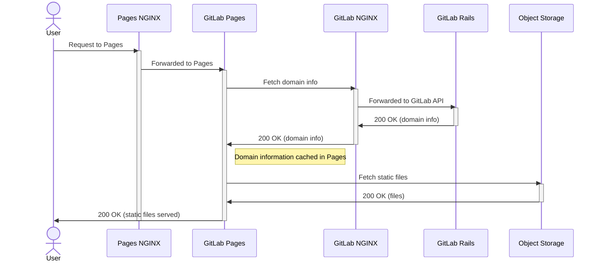
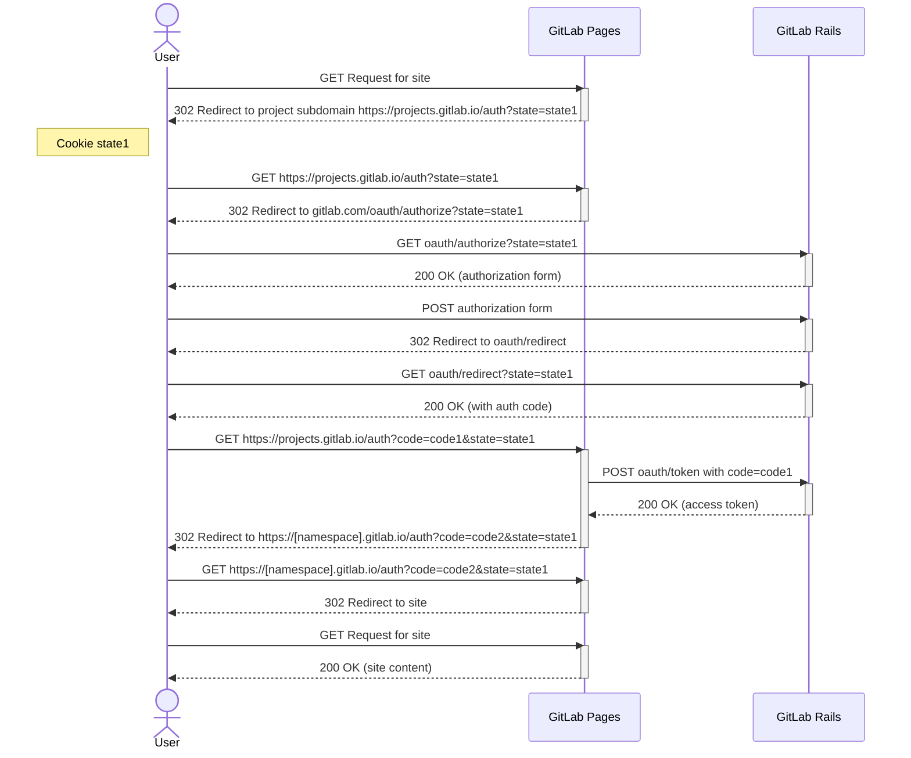
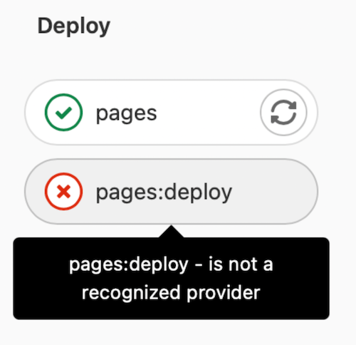



- Tier: 基础版，专业版，旗舰版
- Offering: 私有化部署



管理 GitLab Pages 时，您可能会遇到以下问题。

<a id="how-to-see-gitlab-pages-logs"></a>

## 如何查看 GitLab Pages 日志

您可以运行以下命令查看 Pages 守护进程日志：

```shell
sudo gitlab-ctl tail gitlab-pages
```

您也可以在 `/var/log/gitlab/gitlab-pages/current` 中找到日志文件。

更多信息，请参见如何[从日志中获取关联 ID](../logs/tracing_correlation_id.md#getting-the-correlation-id-from-your-logs)。

<a id="debug-gitlab-pages"></a>

## 调试 GitLab Pages

以下时序图说明了 GitLab Pages 请求是如何被处理的。有关 GitLab Pages 站点如何部署以及如何从对象存储提供静态内容的更多信息，
请参见 GitLab Pages 架构文档。



<a id="identify-error-logs"></a>

### 识别错误日志

您应按照前一时序图中显示的顺序检查日志。基于您的域名进行过滤也有助于识别相关日志。

要开始跟踪日志：

1. 对于 **GitLab Pages NGINX** 日志，请运行：

   ```shell
   # View GitLab Pages NGINX error logs
   sudo gitlab-ctl tail nginx/gitlab_pages_error.log

   # View GitLab Pages NGINX access logs
   sudo gitlab-ctl tail nginx/gitlab_pages_access.log
   ```

1. 对于 **GitLab Pages** 日志，请运行：首先[从日志中识别关联 ID](../logs/tracing_correlation_id.md#getting-the-correlation-id-from-your-logs)。

   ```shell
   sudo gitlab-ctl tail gitlab-pages
   ```

1. 对于 **极狐GitLab NGINX** 日志，请运行：

   ```shell
   # View GitLab NGINX error logs
   sudo gitlab-ctl tail nginx/gitlab_error.log

   # View GitLab NGINX access logs
   sudo gitlab-ctl tail nginx/gitlab_access.log
   ```

1. 对于 **GitLab Rails** 日志，请运行：
   您可以根据来自 [GitLab Pages 日志](../logs/tracing_correlation_id.md#getting-the-correlation-id-from-your-logs)的 `correlation_id` 过滤这些日志。

   ```shell
   sudo gitlab-ctl tail gitlab-rails
   ```

<a id="authorization-code-flow"></a>

## 授权码流程

以下时序图说明了用户、GitLab Pages 和 GitLab Rails 之间用于访问受保护 Pages 站点的 OAuth 身份验证流程。

更多信息，请参见
[极狐GitLab OAuth 授权码流程](../../api/oauth2.md#authorization-code-flow)。



<a id="error-unsupported-protocol-scheme-"></a>

## 错误：`unsupported protocol scheme \"\""`

如果您看到以下错误：

```plaintext
{"error":"failed to connect to internal Pages API: Get \"/api/v4/internal/pages/status\": unsupported protocol scheme \"\"","level":"warning","msg":"attempted to connect to the API","time":"2021-06-23T20:03:30Z"}
```

这意味着您没有在 Pages 服务器设置中设置 HTTP(S) 协议方案。要修复此问题：

1. 编辑 `/etc/gitlab/gitlab.rb`：

   ```ruby
   gitlab_pages['gitlab_server'] = "https://<your_gitlab_server_public_host_and_port>"
   gitlab_pages['internal_gitlab_server'] = "https://<your_gitlab_server_private_host_and_port>" # optional, gitlab_pages['gitlab_server'] is used as default
   ```

1. 重新配置极狐GitLab：

   ```shell
   sudo gitlab-ctl reconfigure
   ```

<a id="502-error-when-connecting-to-gitlab-pages-proxy-when-server-does-not-listen-over-ipv6"></a>

## 服务器未监听 IPv6 时连接到 GitLab Pages 代理出现 502 错误

在某些情况下，即使服务器未监听 IPv6，NGINX 也可能默认使用 IPv6 连接到 GitLab Pages 服务。如果您在 `gitlab_pages_error.log` 中看到类似下面的日志条目，就可以判断发生了这种情况：

```plaintext
2020/02/24 16:32:05 [error] 112654#0: *4982804 connect() failed (111: Connection refused) while connecting to upstream, client: 123.123.123.123, server: ~^(?<group>.*)\.pages\.example\.com$, request: "GET /-/group/project/-/jobs/1234/artifacts/artifact.txt HTTP/1.1", upstream: "http://[::1]:8090//-/group/project/-/jobs/1234/artifacts/artifact.txt", host: "group.example.com"
```

要解决此问题，请为 GitLab Pages 的 `listen_proxy` 设置显式 IP 和端口，以定义 GitLab Pages 守护进程应监听的显式地址：

```ruby
gitlab_pages['listen_proxy'] = '127.0.0.1:8090'
```

<a id="intermittent-502-errors-or-after-a-few-days"></a>

## 间歇性 502 错误或几天后出现

如果您在使用 `systemd` 和
[`tmpfiles.d`](https://www.freedesktop.org/software/systemd/man/tmpfiles.d.html) 的系统上运行 Pages，
您可能会在提供 Pages 服务时遇到间歇性 502 错误，错误类似于：

```plaintext
dial tcp: lookup gitlab.example.com on [::1]:53: dial udp [::1]:53: connect: no route to host"
```

GitLab Pages 会在 `/tmp/gitlab-pages-*` 内创建一个[绑定挂载](https://man7.org/linux/man-pages/man8/mount.8.html)，其中包含 `/etc/hosts` 等文件。
但是，`systemd` 可能会定期清理 `/tmp/` 目录，因此 DNS 配置可能会丢失。

要阻止 `systemd` 清理与 Pages 相关的内容：

1. 告诉 `tmpfiles.d` 不要删除 Pages 的 `/tmp` 目录：

   ```shell
   echo 'x /tmp/gitlab-pages-*' >> /etc/tmpfiles.d/gitlab-pages-jail.conf
   ```

1. 重启 GitLab Pages：

   ```shell
   sudo gitlab-ctl restart gitlab-pages
   ```

<a id="unable-to-access-gitlab-pages"></a>

## 无法访问 GitLab Pages

如果您无法访问您的 GitLab Pages（例如收到 `502 Bad Gateway` 错误或登录循环），并且您的 Pages 日志显示以下错误之一：

- 上下文截止时间超出的错误：

  ```plaintext
  "error":"retrieval context done: context deadline exceeded","host":"root.docs-cit.otenet.gr","level":"error","msg":"could not fetch domain information from a source"
  ```

- HTTP/HTTPS 协议不匹配错误：

  ```plaintext
  "error":"Get \"https://gitlab.example.com/api/v4/internal/pages?host=example.com\": http: server gave HTTP response to HTTPS client","level":"error","msg":"could not fetch domain information from a source"
  ```

  当负载均衡器或反向代理在请求到达极狐GitLab 之前终止 TLS 时，会发生此错误。Pages 尝试使用 HTTPS `external_url` 进行连接，但收到的是纯 HTTP 响应。

要解决此问题，请设置 `internal_gitlab_server` 以直接与本地 GitLab Rails 实例通信，绕过外部 URL：

1. 将以下内容添加到 `/etc/gitlab/gitlab.rb`：

   ```ruby
   gitlab_pages['internal_gitlab_server'] = 'http://localhost:8080'
   ```

1. 重启 GitLab Pages：

   ```shell
   sudo gitlab-ctl restart gitlab-pages
   ```

<a id="gitlab-pages-requests-redirect-to-the-sign-in-page-instead-of-loading-pages-content"></a>

## GitLab Pages 请求重定向到登录页面而不是加载 Pages 内容

在某些情况下，GitLab Pages 似乎配置正确，但请求从未到达 Pages 守护进程。相反，即使凭据和权限正确，用户也会被反复重定向到极狐GitLab 登录页面。

如果主极狐GitLab 实例和 GitLab Pages 不属于同一个 NGINX 监听组，就可能发生此行为。

如果您将 `nginx['listen_addresses']` 设置为特定 IP 地址，那么您必须具有匹配的 `pages_nginx['listen_addresses']` 值。

要解决此问题，请确保主极狐GitLab 实例和 GitLab Pages 都配置了相同的 `listen_addresses` 值，以便它们属于同一个监听组：

1. 编辑 `/etc/gitlab/gitlab.rb`，并确保主极狐GitLab 实例和 GitLab Pages 具有匹配的 `listen_addresses`，例如：

   ```ruby
   nginx['listen_addresses']       = ['10.74.12.5']
   pages_nginx['listen_addresses'] = ['10.74.12.5']
   ```

1. 重新配置极狐GitLab：

   ```shell
   sudo gitlab-ctl reconfigure
   ```

当两个组件监听相同的 IP 地址时，NGINX 可以正确评估 `server_name` 并将请求路由到 GitLab Pages，而不是重定向到登录页面。

<a id="failed-to-connect-to-the-internal-gitlab-api"></a>

## 无法连接到内部极狐GitLab API

如果您看到以下错误：

```plaintext
ERRO[0010] Failed to connect to the internal GitLab API after 0.50s  error="failed to connect to internal Pages API: HTTP status: 401"
```

如果您[在单独的服务器上运行 GitLab Pages](_index.md#running-gitlab-pages-on-a-separate-server)，
您必须将 `/etc/gitlab/gitlab-secrets.json` 文件从 **极狐GitLab 服务器**复制到 **Pages 服务器**。

其他原因可能包括 **极狐GitLab 服务器**和 **Pages 服务器**之间的网络连接问题，例如防火墙配置或端口关闭。例如，如果出现连接超时：

```plaintext
error="failed to connect to internal Pages API: Get \"https://gitlab.example.com:3000/api/v4/internal/pages/status\": net/http: request canceled while waiting for connection (Client.Timeout exceeded while awaiting headers)"
```

<a id="pages-cannot-communicate-with-an-instance-of-the-gitlab-api"></a>

## Pages 无法与极狐GitLab API 实例通信

如果您使用 `domain_config_source=auto` 的默认值并运行多个 GitLab Pages 实例，您可能会在提供 Pages 内容时看到间歇性 502 错误响应。您也可能在 Pages 日志中看到以下警告：

```plaintext
WARN[0010] Pages cannot communicate with an instance of the GitLab API. Please sync your gitlab-secrets.json file https://gitlab.com/gitlab-org/gitlab-pages/-/issues/535#workaround. error="pages endpoint unauthorized"
```

如果您的 `gitlab-secrets.json` 文件在 GitLab Rails 和 GitLab Pages 之间已过期，就可能发生这种情况。请在您的所有 GitLab Pages 实例中按照[在单独的服务器上运行 GitLab Pages](_index.md#running-gitlab-pages-on-a-separate-server) 的步骤 8-10 操作。

<a id="intermittent-502-errors-when-using-an-aws-network-load-balancer-and-gitlab-pages"></a>

## 使用 AWS 网络负载均衡器和 GitLab Pages 时出现间歇性 502 错误

当使用启用了客户端 IP 保留的网络负载均衡器且[请求被环回到源服务器](https://docs.aws.amazon.com/elasticloadbalancing/latest/network/load-balancer-troubleshooting.html#loopback-timeout)时，连接会超时。
这种情况可能发生在具有多个服务器、同时运行核心极狐GitLab 应用程序和 GitLab Pages 的极狐GitLab 实例上。当单个容器同时运行核心极狐GitLab 应用程序和 GitLab Pages 时，也可能发生这种情况。

AWS [建议使用 IP 目标类型](https://repost.aws/knowledge-center/target-connection-fails-load-balancer)来解决此问题。

当核心极狐GitLab 应用程序和 GitLab Pages 在同一主机或容器上运行时，关闭[客户端 IP 保留](https://docs.aws.amazon.com/elasticloadbalancing/latest/network/load-balancer-target-groups.html#client-ip-preservation)可能会解决此问题。

<a id="500-error-with-securecookie-failed-to-generate-random-iv-and-failed-to-save-the-session"></a>

## 500 错误，伴随 `securecookie: failed to generate random iv` 和 `Failed to save the session`

此问题很可能是由过时的操作系统引起的。
[Pages 守护进程使用 `securecookie` 库](https://gitlab.com/search?group_id=9970&project_id=734943&repository_ref=master&scope=blobs&search=securecookie&snippets=false)，通过 [Go 中的 `crypto/rand`](https://pkg.go.dev/crypto/rand#pkg-variables) 获取随机字符串。
这要求主机操作系统上提供 `getrandom` 系统调用或 `/dev/urandom`。
建议升级到[官方支持的操作系统](../../install/package/_index.md#supported-platforms)。

<a id="the-requested-scope-is-invalid-malformed-or-unknown"></a>

## 请求的作用域无效、格式错误或未知

此问题来自 GitLab Pages OAuth 应用程序的权限。要修复此问题：

1. 在右上角，选择 **管理员**。
1. 在左侧边栏中，选择 **应用程序** > **GitLab Pages**。
1. 编辑该应用程序。
1. 在 **作用域** 下，确保已选择 `api` 作用域。
1. 保存您的更改。

当运行[单独的 Pages 服务器](_index.md#running-gitlab-pages-on-a-separate-server)时，需要在主极狐GitLab 服务器上配置此设置。

<a id="workaround-in-case-no-wildcard-dns-entry-can-be-set"></a>

## 无法设置通配符 DNS 条目时的变通方法

如果无法满足通配符 DNS [先决条件](_index.md#prerequisites)，您仍然可以以有限的方式使用 GitLab Pages：

1. [将](../../user/project/working_with_projects.md#transfer-a-project)您需要使用 Pages 的所有项目移动到一个群组命名空间中，例如 `pages`。
1. 配置不带 `*.` 通配符的 [DNS 条目](_index.md#dns-configuration)，例如 `pages.example.io`。
1. 在您的 `gitlab.rb` 文件中配置 `pages_external_url http://example.io/`。
   此处省略群组命名空间，因为它会自动由极狐GitLab 添加前缀。

<a id="pages-daemon-fails-with-permission-denied-errors"></a>

## Pages 守护进程因权限被拒绝错误而失败

如果 `/tmp` 以 `noexec` 方式挂载，Pages 守护进程将无法启动，并出现类似以下错误：

```plaintext
{"error":"fork/exec /gitlab-pages: permission denied","level":"fatal","msg":"could not create pages daemon","time":"2021-02-02T21:54:34Z"}
```

在这种情况下，请将 `TMPDIR` 更改为未以 `noexec` 方式挂载的位置。将以下内容添加到
`/etc/gitlab/gitlab.rb`：

```ruby
gitlab_pages['env'] = {'TMPDIR' => '<new_tmp_path>'}
```

添加后，使用 `sudo gitlab-ctl reconfigure` 重新配置，并使用
`sudo gitlab-ctl restart` 重启极狐GitLab。

<a id="the-redirect-uri-included-is-not-valid-when-using-pages-access-control"></a>

## 使用 Pages 访问控制时出现 `The redirect URI included is not valid.`

如果 `pages_external_url` 在某个时间点被更新过，您可能会看到此错误。请验证以下内容：

1. 检查[系统 OAuth 应用程序](../../integration/oauth_provider.md#create-an-instance-wide-application)：

   1. 在右上角，选择 **管理员**。
   1. 选择 **应用程序**，然后选择 **添加新应用程序**。
   1. 确保 **回调 URL/重定向 URI** 使用的协议（HTTP 或 HTTPS）与 `pages_external_url` 配置使用的协议一致。
1. `Redirect URI` 的域和路径组件有效：它们应类似于 `projects.<pages_external_url>/auth`。

<a id="500-error-cannot-serve-from-disk"></a>

## 500 错误 `cannot serve from disk`

如果您从 Pages 收到 500 响应并遇到类似以下错误：

```plaintext
ERRO[0145] cannot serve from disk                        error="gitlab: disk access is disabled via enable-disk=false" project_id=27 source_path="file:///shared/pages/@hashed/67/06/670671cd97404156226e507973f2ab8330d3022ca96e0c93bdbdb320c41adcaf/pages_deployments/14/artifacts.zip" source_type=zip
```

这意味着 GitLab Rails 正在告诉 GitLab Pages 从磁盘上的某个位置提供内容。
但是，GitLab Pages 被配置为禁用磁盘访问。

要启用磁盘访问：

1. 在 `/etc/gitlab/gitlab.rb` 中为 GitLab Pages 启用磁盘访问：

   ```ruby
   gitlab_pages['enable_disk'] = true
   ```

1. [重新配置极狐GitLab](../restart_gitlab.md#reconfigure-a-linux-package-installation)。

<a id="httprange-new-resource-403"></a>

## `httprange: new resource 403`

如果您看到类似以下错误：

```plaintext
{"error":"httprange: new resource 403: \"403 Forbidden\"","host":"root.pages.example.com","level":"error","msg":"vfs.Root","path":"/pages1/","time":"2021-06-10T08:45:19Z"}
```

并且您在单独的服务器上运行 Pages，通过 NFS 同步文件，这可能意味着共享 Pages 目录在主极狐GitLab 服务器和 GitLab Pages 服务器上挂载到了不同的路径。

在这种情况下，强烈建议您配置[对象存储并将任何现有 Pages 数据迁移到其中](_index.md#object-storage-settings)。

或者，您可以将 GitLab Pages 共享目录挂载到两台服务器上的相同路径。

<a id="gitlab-pages-deploy-job-fails-with-error-is-not-a-recognized-provider"></a>

## GitLab Pages 部署作业失败，错误为 `is not a recognized provider`

如果 **pages** 作业成功，但 **deploy** 作业给出错误“is not a recognized provider”：



错误消息 `is not a recognized provider` 可能来自极狐GitLab 用于连接云提供商以进行对象存储的 `fog` gem。

要修复此问题：

1. 检查您的 `gitlab.rb` 文件。如果您启用了 `gitlab_rails['pages_object_store_enabled']`，但没有配置存储桶详细信息，请执行以下任一操作：

   - 按照 [S3 兼容连接设置](_index.md#s3-compatible-connection-settings)指南，为您的 Pages 部署配置对象存储。
   - 通过注释掉该行，将部署存储在本地。

1. 保存您对 `gitlab.rb` 文件所做的更改，然后[重新配置极狐GitLab](../restart_gitlab.md#reconfigure-a-linux-package-installation)。

<a id="404-error-the-page-youre-looking-for-could-not-be-found"></a>

## 404 错误 `The page you're looking for could not be found`

如果您从 GitLab Pages 收到 `404 Page Not Found` 响应：

1. 检查 `.gitlab-ci.yml` 是否包含作业 `pages:`。
1. 检查当前项目的流水线，确认作业 `pages:deploy` 正在运行。

如果没有 `pages:deploy` 作业，您对 GitLab Pages 站点的更新将永远不会发布。

如果您使用启用了 `namespace_in_path` 的单独 Pages 服务器，请参见
[Pages UI 显示错误 URL 时的 404 错误](#404-error-page-not-found-when-pages-ui-shows-incorrect-url)。

<a id="404-error-page-not-found-when-pages-ui-shows-incorrect-url"></a>

## 404 错误：Pages UI 显示错误 URL 时找不到页面

如果您在[单独的 GitLab Pages 服务器](_index.md#running-gitlab-pages-on-a-separate-server)上配置并启用了 `namespace_in_path`，
您可能会收到 `404 Page not found` 错误。

当 GitLab Pages 服务器或主极狐GitLab 服务器上的 `namespace_in_path` 设置配置错误或缺失时，会发生此错误。

[全局设置](_index.md#global-settings) `namespace_in_path` 决定了 GitLab Pages 站点的 URL 结构。极狐GitLab 服务器和 GitLab Pages 服务器必须对此设置具有相同的值。

要解决此错误：

1. 打开 `/etc/gitlab/gitlab.rb` 文件：

   1. 验证您的极狐GitLab 服务器配置是否为：

      ```ruby
      gitlab_pages['namespace_in_path'] = true
      ```

   1. 确保您的 GitLab Pages 服务器配置相同：

      ```ruby
         gitlab_pages['namespace_in_path'] = true
      ```

1. 保存文件。
1. 在两台服务器上[重新配置极狐GitLab](../restart_gitlab.md)，以使更改生效。

<a id="404-error-when-viewing-job-artifacts"></a>

## 查看作业产物时出现 404 错误

您的 Pages 站点可能加载正常且身份验证可能成功，但指向
[作业产物](../cicd/job_artifacts.md)的链接返回 `404` 错误。

Pages 守护进程将产物请求代理到 [`artifacts_server_url`](_index.md#global-settings) 处的极狐GitLab API。这些请求使用[项目的 URL 编码路径](../../api/rest/_index.md#namespaced-paths)，因此项目路径包含编码的斜杠（`%2F`）。如果极狐GitLab 前面的反向代理解码了该字符，URL 将不再匹配 API 路由。然后 API 返回 `404`。

Pages 日志只记录 `404` 响应，而不记录 API 收到的 URL。要确认原因，请检查反向代理日志中的请求。

有关完整的配置示例，请参见
[使用反向代理时出现 `404 Not Found`](../../api/rest/troubleshooting.md#error-404-not-found-when-using-a-reverse-proxy)。

<a id="503-error-client-authentication-failed-due-to-unknown-client"></a>

## 503 错误 `Client authentication failed due to unknown client`

如果 Pages 是已注册的 OAuth 应用程序且[启用了访问控制](../../user/project/pages/pages_access_control.md)，此错误表示存储在 `/etc/gitlab/gitlab-secrets.json` 中的身份验证令牌已失效：

```plaintext
Client authentication failed due to unknown client, no client authentication included,
or unsupported authentication method.
```

要解决此问题：

1. 备份您的密钥文件：

   ```shell
   sudo cp /etc/gitlab/gitlab-secrets.json /etc/gitlab/gitlab-secrets.json.$(date +\%Y\%m\%d)
   ```

1. 编辑 `/etc/gitlab/gitlab-secrets.json` 并删除 `gitlab_pages` 部分。
1. 重新配置极狐GitLab 并重新生成 OAuth 令牌：

   ```shell
   sudo gitlab-ctl reconfigure
   ```

<a id="multi-node-oauth-secret-synchronization"></a>

### 多节点 OAuth 密钥同步

当您跨多个节点运行 GitLab Pages 时，所有节点上的 Pages OAuth 密钥必须相同。如果密钥不同步，某些节点可能会以相同的 `Client authentication failed due to unknown client` 错误拒绝身份验证请求。

要解决此问题：

1. 在所有极狐GitLab 节点上备份密钥文件：

   ```shell
   sudo cp /etc/gitlab/gitlab-secrets.json /etc/gitlab/gitlab-secrets.json.$(date +\%Y\%m\%d)
   ```

1. 在第一个节点上，在 `/etc/gitlab/gitlab-secrets.json` 文件中：

   1. 删除 `gitlab_pages` 部分。
   1. 保存文件。
   1. 重新配置极狐GitLab 以重新生成 OAuth 令牌：

      ```shell
      sudo gitlab-ctl reconfigure
      ```

   1. 复制更新后的 `gitlab_pages` 部分。

1. 在所有其他节点上，将更新后的 `gitlab_pages` 部分粘贴到相应的 `gitlab-secrets.json` 文件中并保存。

1. 重新配置极狐GitLab，以便 `gitlab-pages-config` 文件填充更新后的密钥：

   ```shell
   sudo gitlab-ctl reconfigure
   ```

1. 通过比较每个节点上 `/etc/gitlab/gitlab-secrets.json` 中的 `gitlab_pages` 部分和 `/var/opt/gitlab/gitlab-pages/gitlab-pages-config` 的内容，验证所有节点上的密钥是否一致。

<a id="error-response-size-over-104857600-bytes"></a>

## 错误：`Response size over 104857600 bytes`

如果 **pages** 作业成功但 **deploy** 作业失败，您可能会收到一条错误，指出 `Response size over 104857600 bytes`。

当解压后的 Pages 内容超过[最大 Gzip 压缩大小](../instance_limits.md#maximum-gzip-compressed-size)限制时，会发生此错误。

要解决此问题，请增加 `max_http_decompressed_size` 限制。使用以下方法之一：

- 在 [Rails 控制台会话](../operations/rails_console.md#starting-a-rails-console-session)中运行以下命令：

  ```ruby
  ApplicationSetting.update(max_http_decompressed_size: 1000)
  ```

- [应用程序设置 API](../../api/settings.md)。
