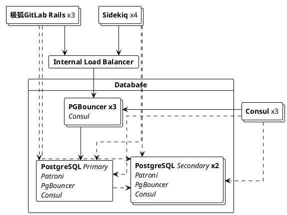



- Tier: 基础版，专业版，旗舰版
- Offering: 私有化部署



通过数据库负载均衡，只读查询可以分布到多个 PostgreSQL 节点上，以提高性能。

该功能原生集成在极狐GitLab Rails 和 Sidekiq 中，可以配置为以轮询方式平衡数据库读查询，无需任何外部依赖：



<a id="requirements-to-enable-database-load-balancing"></a>

## 启用数据库负载均衡的要求

要启用数据库负载均衡，请确保：

- PostgreSQL 高可用架构中有一个或多个从节点正在向主节点进行复制。
- 每个 PostgreSQL 节点使用相同的凭证和端口连接。

对于 Linux 软件包安装，您还需要在每个 PostgreSQL 节点上配置 PgBouncer，以便在[配置多节点架构](replication_and_failover.md)时池化所有负载均衡连接。

<a id="configuring-database-load-balancing"></a>

## 配置数据库负载均衡

数据库负载均衡可以通过以下两种方式之一进行配置：

- （推荐）[主机](#hosts)：PostgreSQL 主机列表。
- [服务发现](#service-discovery)：返回 PostgreSQL 主机列表的 DNS 记录。

<a id="hosts"></a>

### 主机

<!-- Including the Primary host in Database Load Balancing is now recommended for improved performance - Approved by the Reference Architecture and Database groups. -->

要配置主机列表，请在要平衡的每个环境的极狐GitLab Rails 和 Sidekiq 节点上执行以下步骤：

1. 编辑 `/etc/gitlab/gitlab.rb` 文件。
1. 在 `gitlab_rails['db_load_balancing']` 中，创建要平衡的数据库主机数组。例如，在 PostgreSQL 运行于 `primary.example.com`、`secondary1.example.com`、`secondary2.example.com` 等主机的环境中：

   ```ruby
   gitlab_rails['db_load_balancing'] = { 'hosts' => ['primary.example.com', 'secondary1.example.com', 'secondary2.example.com'] }
   ```

   这些主机必须在与 `gitlab_rails['db_port']` 配置相同的端口上可达。

1. 保存文件并[重新配置极狐GitLab](../restart_gitlab.md#reconfigure-a-linux-package-installation)。

> [!note]
> 将主节点添加到主机列表是可选操作，但建议添加。
> 这样主节点就具备了处理负载均衡读查询的条件，当主节点有能力处理这些查询时，可提高系统性能。
> 流量非常高的实例可能主节点没有额外容量充当读取副本。
> 无论主节点是否在列表中，它都将用于写查询。

<a id="service-discovery"></a>

### 服务发现

服务发现允许极狐GitLab 自动获取要使用的 PostgreSQL 主机列表。它会定期检查 DNS `A` 记录，使用此记录返回的 IP 作为从节点的地址。为让服务发现正常工作，只需一个 DNS 服务器和一个包含从节点 IP 地址的 `A` 记录。

使用 Linux 软件包安装时，提供的 [Consul](../consul.md) 服务充当 DNS 服务器，并通过 `postgresql-ha.service.consul` 记录返回 PostgreSQL 地址。例如：

1. 在每个极狐GitLab Rails / Sidekiq 节点上，编辑 `/etc/gitlab/gitlab.rb` 并添加以下内容：

   ```ruby
   gitlab_rails['db_load_balancing'] = { 'discover' => {
       'nameserver' => 'localhost'
       'record' => 'postgresql-ha.service.consul'
       'record_type' => 'A'
       'port' => '8600'
       'interval' => '60'
       'disconnect_timeout' => '120'
     }
   }
   ```

1. 保存文件并[重新配置极狐GitLab](../restart_gitlab.md#reconfigure-a-linux-package-installation) 以使更改生效。

| 选项 | 描述 | 默认值 |
|------|------|--------|
| `nameserver` | 用于查找 DNS 记录的域名服务器。 | localhost |
| `record` | 要查找的记录。此选项是服务发现正常工作所必需的。 | |
| `record_type` | 要查找的可选记录类型。可以是 `A` 或 `SRV`。 | `A` |
| `port` | 域名服务器的端口。 | 8600 |
| `interval` | 检查 DNS 记录之间的最小秒数。 | 60 |
| `disconnect_timeout` | 在主机列表更新后，关闭旧连接的时间（秒）。 | 120 |
| `use_tcp` | 使用 TCP 而非 UDP 查找 DNS 资源。 | false |
| `max_replica_pools` | 每个 Rails 进程连接的最大副本数。如果您运行大量 Postgres 副本和大量 Rails 进程，此设置很有用，因为如果不设限，默认情况下每个 Rails 进程都会连接到每个副本。如果不设置，默认行为为无限制。 | nil |

如果 `record_type` 设置为 `SRV`，极狐GitLab 将继续使用轮询算法，并忽略记录中的 `weight` 和 `priority`。由于 `SRV` 记录通常返回主机名而非 IP，极狐GitLab 需要在 `SRV` 响应的附加部分中查找返回主机名的 IP。如果找不到主机名的 IP，极狐GitLab 需要为每个此类主机名向配置的 `nameserver` 查询 `ANY` 记录，查找 `A` 或 `AAAA` 记录，如果最终无法解析其 IP，则从轮换中移除此主机名。

`interval` 值指定了检查之间的最小间隔时间。如果 `A` 记录的 TTL 大于此值，服务发现将遵循该 TTL。例如，如果 `A` 记录的 TTL 为 90 秒，那么服务发现将至少等待 90 秒才会再次检查 `A` 记录。

当主机列表更新时，可能需要一段时间才能终止旧连接。可以使用 `disconnect_timeout` 设置为终止所有旧数据库连接的时间设置上限。

<a id="handling-stale-reads"></a>

### 处理过期读取



- 从极狐GitLab 专业版移至基础版于 14.0。



为防止从过时的从节点读取数据，负载均衡器会检查它是否与主节点同步。如果数据足够新，则使用从节点，否则忽略。为减少这些检查的开销，我们仅按一定间隔执行检查。

有三个配置选项会影响此行为：

| 选项 | 描述 | 默认值 |
|------|------|--------|
| `max_replication_difference` | 允许从节点在一段时间未复制数据时滞后的数据量（字节）。 | 8 MB |
| `max_replication_lag_time` | 从节点允许的最大滞后秒数，超过后我们停止使用它。 | 60 秒 |
| `replica_check_interval` | 检查从节点状态前必须等待的最小秒数。 | 60 秒 |

默认设置应能满足大多数用户的需求。

要结合主机列表配置这些选项，可使用以下示例：

```ruby
gitlab_rails['db_load_balancing'] = {
  'hosts' => ['primary.example.com', 'secondary1.example.com', 'secondary2.example.com'],
  'max_replication_difference' => 16777216, # 16 MB
  'max_replication_lag_time' => 30,
  'replica_check_interval' => 30
}
```

<a id="logging"></a>

## 日志记录

负载均衡器会在 [`database_load_balancing.log`](../logs/_index.md#database_load_balancinglog) 中记录各种事件，例如：

- 当主机被标记为离线时
- 当主机恢复在线时
- 当所有从节点都离线时
- 当读取操作因查询冲突而在另一个主机上重试时

日志以每个条目为 JSON 对象的结构化形式记录，至少包含：

- 用于过滤的 `event` 字段。
- 人类可读的 `message` 字段。
- 一些事件特定的元数据。例如 `db_host`
- 始终记录的上下文信息。例如 `severity` 和 `time`。

例如：

```json
{"severity":"INFO","time":"2019-09-02T12:12:01.728Z","correlation_id":"abcdefg","event":"host_online","message":"Host came back online","db_host":"111.222.333.444","db_port":null,"tag":"rails.database_load_balancing","environment":"production","hostname":"web-example-1","fqdn":"gitlab.example.com","path":null,"params":null}
```

<a id="implementation-details"></a>

## 实现细节

<a id="balancing-queries"></a>

### 平衡查询

只读的 `SELECT` 查询在所有给定的主机之间进行平衡。
其他所有操作（包括事务）都在主节点上执行。
诸如 `SELECT ... FOR UPDATE` 的查询也在主节点上执行。

<a id="prepared-statements"></a>

### 预编译语句

预编译语句在负载均衡下无法正常工作，启用负载均衡后会被自动禁用。这应该不会影响响应时间。

<a id="primary-sticking"></a>

### 主节点保持

执行写操作后，极狐GitLab 会在一段时间内保持使用主节点，范围仅限于执行写操作的用户。当从节点追上进度后或 30 秒后，极狐GitLab 会恢复使用从节点。

<a id="failover-handling"></a>

### 故障转移处理

当发生故障转移或数据库无响应时，负载均衡器会尝试使用下一个可用主机。如果没有可用的从节点，则操作将在主节点上执行。

如果在写入数据时发生连接错误，操作将使用指数退避重试最多 3 次。

使用负载均衡时，您应该能够安全地重启数据库服务器，而不会立即向用户呈现错误。

<a id="development-guide"></a>

### 开发指南

有关数据库负载均衡的详细开发指南，请参阅开发文档。