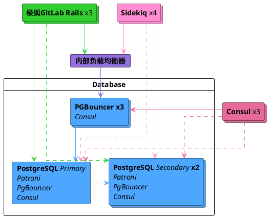



- Tier: 专业版、旗舰版
- Offering: 私有化部署



如果您是 极狐GitLab 私有化部署的基础版用户，请考虑使用云托管解决方案。
本文档不涵盖自编译安装。

如果您要的并非具备复制和故障转移的设置，请参阅
Linux package 的[数据库配置文档](https://gitlab.cn/docs/omnibus/settings/database/)。

强烈建议您完整阅读本文档，再尝试为 极狐GitLab 配置具备复制和故障转移的 PostgreSQL。

<a id="operating-system-upgrades"></a>

## 操作系统升级

如果您要故障转移到一个操作系统不同的系统，
请阅读[关于为 PostgreSQL 升级操作系统的文档](upgrading_os.md)。
在操作系统升级时未考虑到本地更改可能导致数据损坏。

<a id="architecture"></a>

## 架构

针对 PostgreSQL 集群且具备复制故障转移的 Linux package 推荐配置需要：

- 至少三个 PostgreSQL 节点。
- 至少三个 Consul 服务器节点。
- 至少三个 PgBouncer 节点，用于跟踪和处理主数据库的读写操作。
  - 一个内部负载均衡器（TCP），用于平衡 PgBouncer 节点之间的请求。
- 启用[数据库负载均衡](database_load_balancing.md)。
  - 每个 PostgreSQL 节点上配置一个本地 PgBouncer 服务。这与跟踪主节点的主 PgBouncer 集群是分开的。



您还需要考虑底层网络拓扑，确保所有数据库和 极狐GitLab 实例之间具有冗余连接，避免网络成为单点故障。

<a id="database-node"></a>

### 数据库节点

每个数据库节点运行四个服务：

- `PostgreSQL`：数据库本身。
- `Patroni`：与集群中的其他 Patroni 服务通信，并在主服务器出现问题时处理故障转移。故障转移过程包括：
  - 为集群选择一个新领导者。
  - 将该新节点提升为领导者。
  - 指示其余服务器跟随新领导者节点。
- `PgBouncer`：节点本地的连接池。用于作为[数据库负载均衡](database_load_balancing.md)一部分的 _读_ 查询。
- `Consul` agent：与存储当前 Patroni 状态的 Consul 集群通信。该代理会监控数据库集群中每个节点的状态，并在 Consul 集群的服务定义中跟踪其健康状况。

<a id="consul-server-node"></a>

### Consul 服务器节点

Consul 服务器节点运行 Consul 服务器服务。这些节点必须在 Patroni 集群引导之前达到法定人数并选出领导者；否则，数据库节点会等待，直到此类 Consul 领导者被选出。

<a id="pgbouncer-node"></a>

### PgBouncer 节点

每个 PgBouncer 节点运行两个服务：

- `PgBouncer`：数据库连接池本身。
- `Consul` agent：监视 Consul 集群上 PostgreSQL 服务定义的状态。如果状态发生变化，Consul 会运行一个脚本，更新 PgBouncer 配置以指向新的 PostgreSQL 领导者节点，并重新加载 PgBouncer 服务。

<a id="connection-flow"></a>

### 连接流

软件包中的每个服务都附带一套[默认端口](../package_information/defaults.md#ports)。您可能需要为下列连接制定特定的防火墙规则：

本设置中有多种连接流：

- [主连接](#primary)
- [数据库负载均衡](#database-load-balancing)
- [复制](#replication)

<a id="primary"></a>

#### 主连接

- 应用服务器通过其[默认端口](../package_information/defaults.md)直接连接到 PgBouncer，或通过为多个 PgBouncer 提供服务的已配置内部负载均衡器（TCP）连接。
- PgBouncer 连接到主数据库服务器的 [PostgreSQL 默认端口](../package_information/defaults.md)。

<a id="database-load-balancing"></a>

#### 数据库负载均衡

针对近期未更改且在所有数据库节点上均为最新的数据的读查询：

- 应用服务器以轮询方式，通过每个数据库节点上本地 PgBouncer 服务的[默认端口](../package_information/defaults.md)连接到该服务。
- 本地 PgBouncer 连接到本地数据库服务器的 [PostgreSQL 默认端口](../package_information/defaults.md)。

<a id="replication"></a>

#### 复制

- Patroni 主动管理正在运行的 PostgreSQL 进程和配置。
- PostgreSQL 次级节点连接到主数据库服务器的 [PostgreSQL 默认端口](../package_information/defaults.md)。
- Consul 服务器和代理相互连接到对方的 [Consul 默认端口](../package_information/defaults.md)。

<a id="setting-it-up"></a>

## 设置

<a id="required-information"></a>

### 所需信息

在开始配置之前，您需要收集所有必要的信息。

<a id="network-information"></a>

#### 网络信息

PostgreSQL 默认不在任何网络接口上监听。它需要知道应该监听哪个 IP 地址才能对其他服务可访问。同样，PostgreSQL 的访问也是基于网络源进行控制的。

因此您需要：

- 每个节点网络接口的 IP 地址。可将其设置为 `0.0.0.0` 以在所有接口上监听。不能设置为回环地址 `127.0.0.1`。
- 网络地址。可以是子网形式（即 `192.168.0.0/255.255.255.0`）或无类别域间路由（CIDR）形式（`192.168.0.0/24`）。

<a id="consul-information"></a>

#### Consul 信息

使用默认设置时，最低配置需要：

- `CONSUL_USERNAME`。Linux package 安装的默认用户是 `gitlab-consul`。
- `CONSUL_DATABASE_PASSWORD`。数据库用户的密码。
- `CONSUL_PASSWORD_HASH`。这是根据 Consul 用户名/密码对生成的哈希。可使用以下命令生成：

  ```shell
  sudo gitlab-ctl pg-password-md5 CONSUL_USERNAME
  ```

- `CONSUL_SERVER_NODES`。Consul 服务器节点的 IP 地址或 DNS 记录。

关于服务本身的一些说明：

- 服务运行在一个系统账户下，默认为 `gitlab-consul`。
- 如果您使用不同的用户名，则必须通过 `CONSUL_USERNAME` 变量指定。
- 密码存储在以下位置：
  - `/etc/gitlab/gitlab.rb`：哈希形式
  - `/var/opt/gitlab/pgbouncer/pg_auth`：哈希形式
  - `/var/opt/gitlab/consul/.pgpass`：明文形式

<a id="postgresql-information"></a>

#### PostgreSQL 信息

配置 PostgreSQL 时，我们会执行以下操作：

- 将 `max_replication_slots` 设置为数据库节点数量的两倍。Patroni 在启动复制时每个节点会额外使用一个插槽。
- 将 `max_wal_senders` 设置为比集群中分配的复制插槽数多一。这可以防止复制耗尽所有可用的数据库连接。

本文档假设有 3 个数据库节点，所以配置如下：

```ruby
patroni['postgresql']['max_replication_slots'] = 6
patroni['postgresql']['max_wal_senders'] = 7
```

如前所述，请准备好需要权限才能对数据库进行身份验证的网络子网。
您还需要手头有 Consul 服务器节点的 IP 地址或 DNS 记录。

您需要为应用程序的数据库用户提供以下密码信息：

- `POSTGRESQL_USERNAME`。Linux package 安装的默认用户是 `gitlab`。
- `POSTGRESQL_USER_PASSWORD`。数据库用户的密码。
- `POSTGRESQL_PASSWORD_HASH`。这是根据用户名/密码对生成的哈希。可使用以下命令生成：

  ```shell
  sudo gitlab-ctl pg-password-md5 POSTGRESQL_USERNAME
  ```

<a id="patroni-information"></a>

#### Patroni 信息

您需要为 Patroni API 提供以下密码信息：

- `PATRONI_API_USERNAME`。用于 API 基本认证的用户名。
- `PATRONI_API_PASSWORD`。用于 API 基本认证的密码。

<a id="pgbouncer-information"></a>

#### PgBouncer 信息

使用默认设置时，最低配置需要：

- `PGBOUNCER_USERNAME`。Linux package 安装的默认用户是 `pgbouncer`。
- `PGBOUNCER_PASSWORD`。这是 PgBouncer 服务的密码。
- `PGBOUNCER_PASSWORD_HASH`。这是根据 PgBouncer 用户名/密码对生成的哈希。可使用以下命令生成：

  ```shell
  sudo gitlab-ctl pg-password-md5 PGBOUNCER_USERNAME
  ```

- `PGBOUNCER_NODE`，是运行 PgBouncer 的节点的 IP 地址或 FQDN。

关于服务本身需要记住的几点：

- 该服务与数据库运行在同一系统账户下。在软件包中，默认为 `gitlab-psql`。
- 如果您为 PgBouncer 服务使用了非默认用户账户（默认为 `pgbouncer`），则需要指定该用户名。
- 密码存储在以下位置：
  - `/etc/gitlab/gitlab.rb`：哈希形式及明文形式
  - `/var/opt/gitlab/pgbouncer/pg_auth`：哈希形式

<a id="installing-the-linux-package"></a>

### 安装 Linux package

首先，请确保在每个节点上[下载并安装](https://gitlab.cn/install/) Linux package。

请确保从步骤 1 安装必要的依赖项，
并从步骤 2 添加 极狐GitLab 软件包仓库。
安装 极狐GitLab 软件包时，不要提供 `EXTERNAL_URL` 值。

<a id="configuring-the-database-nodes"></a>

### 配置数据库节点

1. 确保[配置 Consul 节点](../consul.md)。
1. 在执行下一步之前，请确保已收集 [`CONSUL_SERVER_NODES`](#consul-information)、[`PGBOUNCER_PASSWORD_HASH`](#pgbouncer-information)、[`POSTGRESQL_PASSWORD_HASH`](#postgresql-information)、[数据库节点数量](#postgresql-information)以及[网络地址](#network-information)。

<a id="configuring-patroni-cluster"></a>

#### 配置 Patroni 集群

您必须显式启用 Patroni 才能使用它（通过 `patroni['enable'] = true`）。

任何控制复制的 PostgreSQL 配置项，例如 `wal_level`、`max_wal_senders` 或其他，都严格由 Patroni 控制。这些配置会覆盖您通过 `postgresql[...]` 配置键所做的原始设置。因此，它们都被分开并放置在 `patroni['postgresql'][...]` 下。此行为仅限于复制。
Patroni 会遵循通过 `postgresql[...]` 配置键所做的其他任何 PostgreSQL 配置。例如，`max_wal_senders` 默认设置为 `5`。如果您希望更改此值，必须通过 `patroni['postgresql']['max_wal_senders']` 配置键来设置。

示例如下：

```ruby
# 禁用除 Patroni、PgBouncer 和 Consul 之外的所有组件
roles(['patroni_role', 'pgbouncer_role'])

# PostgreSQL 配置
postgresql['listen_address'] = '0.0.0.0'

# 禁用自动数据库迁移
gitlab_rails['auto_migrate'] = false

# 配置 Consul agent
consul['services'] = %w(postgresql)

# 开始用户配置
#  设置真实值，如“所需信息”部分所述
#
# 用生成的 md5 值替换 PGBOUNCER_PASSWORD_HASH
postgresql['pgbouncer_user_password'] = 'PGBOUNCER_PASSWORD_HASH'
# 用生成的 md5 值替换 POSTGRESQL_REPLICATION_PASSWORD_HASH
postgresql['sql_replication_password'] = 'POSTGRESQL_REPLICATION_PASSWORD_HASH'
# 用生成的 md5 值替换 POSTGRESQL_PASSWORD_HASH
postgresql['sql_user_password'] = 'POSTGRESQL_PASSWORD_HASH'

# 用 Patroni Rest API 调用的用户名替换 PATRONI_API_USERNAME（所有节点使用相同用户名）
patroni['username'] = 'PATRONI_API_USERNAME'
# 用 Patroni Rest API 调用的密码替换 PATRONI_API_PASSWORD（所有节点使用相同密码）
patroni['password'] = 'PATRONI_API_PASSWORD'

# 将 `max_replication_slots` 设置为数据库节点数量的两倍。
# Patroni 在启动复制时每个节点会额外使用一个插槽。
patroni['postgresql']['max_replication_slots'] = X

# 将 `max_wal_senders` 设置为比集群中的复制插槽数多一。
# 这用于防止复制耗尽所有可用的数据库连接。
patroni['postgresql']['max_wal_senders'] = X+1

# 用其他 patroni 节点的网络地址替换 XXX.XXX.XXX.XXX/YY
patroni['allowlist'] = %w(XXX.XXX.XXX.XXX/YY 127.0.0.1/32)

# 用网络地址替换 XXX.XXX.XXX.XXX/YY
postgresql['trust_auth_cidr_addresses'] = %w(XXX.XXX.XXX.XXX/YY 127.0.0.1/32)

# 用于数据库负载均衡的本地 PgBouncer 服务
pgbouncer['databases'] = {
  gitlabhq_production: {
    host: "127.0.0.1",
    user: "PGBOUNCER_USERNAME",
    password: 'PGBOUNCER_PASSWORD_HASH'
  }
}

# 替换占位符：
#
# Y.Y.Y.Y consul1.gitlab.example.com Z.Z.Z.Z
# 用收集到的 CONSUL_SERVER_NODES 的地址替换
consul['configuration'] = {
  retry_join: %w(Y.Y.Y.Y consul1.gitlab.example.com Z.Z.Z.Z)
}
#
# 结束用户配置
```

所有数据库节点使用相同的配置。领导者节点并非在配置中确定，
并且领导者或副本节点没有额外或不同的配置。

节点配置完成后，您必须[重新配置 极狐GitLab](../restart_gitlab.md#reconfigure-a-linux-package-installation)
使更改生效。

通常，当 Consul 集群就绪时，第一个[重新配置](../restart_gitlab.md#reconfigure-a-linux-package-installation)的节点会成为领导者。您无需对节点重新配置进行排序。可以并行或以任何顺序运行它们。
如果选择任意顺序，则不会有预先确定的领导者。

<a id="enable-monitoring"></a>

#### 启用监控

如果您启用监控，必须在所有数据库服务器上启用。

1. 创建/编辑 `/etc/gitlab/gitlab.rb` 并添加以下配置：

   ```ruby
   # 为 Prometheus 启用服务发现
   consul['monitoring_service_discovery'] = true

   # 设置导出器的监听网络地址
   node_exporter['listen_address'] = '0.0.0.0:9100'
   postgres_exporter['listen_address'] = '0.0.0.0:9187'
   ```

1. 运行 `sudo gitlab-ctl reconfigure` 来编译配置。

<a id="enable-tls-support-for-the-patroni-api"></a>

#### 为 Patroni API 启用 TLS 支持

默认情况下，Patroni [REST API](https://patroni.readthedocs.io/en/latest/rest_api.html#rest-api) 通过 HTTP 提供服务。
您可以选择启用 TLS 并在相同的[端口](../package_information/defaults.md)上使用 HTTPS。

要启用 TLS，您需要 PEM 格式的证书和私钥文件。这两个文件都必须可供 PostgreSQL 用户读取（默认为 `gitlab-psql`，或由 `postgresql['username']` 设置的用户）：

```ruby
patroni['tls_certificate_file'] = '/path/to/server/certificate.pem'
patroni['tls_key_file'] = '/path/to/server/key.pem'
```

如果服务器的私钥已加密，请指定解密密码：

```ruby
patroni['tls_key_password'] = 'private-key-password' # 这是明文密码。
```

如果您使用的是自签名证书或内部 CA，您需要禁用 TLS 验证或传递内部 CA 的证书，否则在使用 `gitlab-ctl patroni ....` 命令时可能会遇到意外错误。Linux package 确保 Patroni API 客户端遵守此配置。

TLS 证书验证默认启用。要禁用：

```ruby
patroni['tls_verify'] = false
```

或者，您可以传递内部 CA 的 PEM 格式证书。同样，该文件必须可供 PostgreSQL 用户读取：

```ruby
patroni['tls_ca_file'] = '/path/to/ca.pem'
```

启用 TLS 后，API 服务器和客户端之间的双向认证对于所有端点都是可能的，其程度取决于 `patroni['tls_client_mode']` 属性：

- `none`（默认）：API 不检查任何客户端证书。
- `optional`：所有[不安全](https://patroni.readthedocs.io/en/latest/security.html#protecting-the-rest-api)的 API 调用都需要客户端证书。
- `required`：所有 API 调用都需要客户端证书。

客户端证书根据由 `patroni['tls_ca_file']` 属性指定的 CA 证书进行验证。因此，此属性对于双向 TLS 认证是必需的。您还需要指定 PEM 格式的客户端证书和私钥文件。
这两个文件都必须可供 PostgreSQL 用户读取：

```ruby
patroni['tls_client_mode'] = 'required'
patroni['tls_ca_file'] = '/path/to/ca.pem'

patroni['tls_client_certificate_file'] = '/path/to/client/certificate.pem'
patroni['tls_client_key_file'] = '/path/to/client/key.pem'
```

您可以在不同的 Patroni 节点上为 API 服务器和客户端使用不同的证书和密钥，只要它们可以被验证即可。
但是，CA 证书（`patroni['tls_ca_file']`）、TLS 证书验证（`patroni['tls_verify']`）和客户端 TLS 认证模式（`patroni['tls_client_mode']`）在所有节点上必须具有相同的值。

<a id="configure-pgbouncer-nodes"></a>

### 配置 PgBouncer 节点

1. 在执行下一步之前，请确保已收集 [`CONSUL_SERVER_NODES`](#consul-information)、[`CONSUL_PASSWORD_HASH`](#consul-information) 和 [`PGBOUNCER_PASSWORD_HASH`](#pgbouncer-information)。
1. 在每个节点上，编辑 `/etc/gitlab/gitlab.rb` 配置文件，并替换下面 `# 开始用户配置` 部分中标注的值：

   ```ruby
   # 禁用除 PgBouncer 和 Consul agent 之外的所有组件
   roles(['pgbouncer_role'])

   # 配置 PgBouncer
   pgbouncer['admin_users'] = %w(pgbouncer gitlab-consul)

   # 配置 Consul agent
   consul['watchers'] = %w(postgresql)

   # 开始用户配置
   # 设置真实值，如“所需信息”部分所述
   # 用生成的 md5 值替换 CONSUL_PASSWORD_HASH
   # 用生成的 md5 值替换 PGBOUNCER_PASSWORD_HASH
   pgbouncer['users'] = {
     'gitlab-consul': {
       password: 'CONSUL_PASSWORD_HASH'
     },
     'pgbouncer': {
       password: 'PGBOUNCER_PASSWORD_HASH'
     }
   }
   # 替换占位符：
   #
   # Y.Y.Y.Y consul1.gitlab.example.com Z.Z.Z.Z
   # 用收集到的 CONSUL_SERVER_NODES 的地址替换
   consul['configuration'] = {
     retry_join: %w(Y.Y.Y.Y consul1.gitlab.example.com Z.Z.Z.Z)
   }
   #
   # 结束用户配置
   ```

1. 运行 `gitlab-ctl reconfigure`
1. 创建一个 `.pgpass` 文件，以便 Consul 能够重新加载 PgBouncer。在提示时输入两次 `PGBOUNCER_PASSWORD`：

   ```shell
   gitlab-ctl write-pgpass --host 127.0.0.1 --database pgbouncer --user pgbouncer --hostuser gitlab-consul
   ```

1. [启用监控](pgbouncer.md#enable-monitoring)

<a id="pgbouncer-checkpoint"></a>

#### PgBouncer 检查点

1. 确保每个节点都与当前节点领导者通信：

   ```shell
   gitlab-ctl pgb-console # 在提示时提供 PGBOUNCER_PASSWORD
   ```

   如果在输入密码后出现错误 `psql: ERROR:  Auth failed`，请确保您之前已使用正确的格式生成了 MD5 密码哈希。正确的格式是将密码和用户名连接起来：`PASSWORDUSERNAME`。例如，对于 `pgbouncer` 用户，`Sup3rS3cr3tpgbouncer` 就是生成 MD5 密码哈希所需的文本。

1. 在控制台提示符可用后，运行以下查询：

   ```shell
   show databases ; show clients ;
   ```

   输出应类似于以下内容：

   ```plaintext
           name         |  host       | port |      database       | force_user | pool_size | reserve_pool | pool_mode | max_connections | current_connections
   ---------------------+-------------+------+---------------------+------------+-----------+--------------+-----------+-----------------+---------------------
    gitlabhq_production | MASTER_HOST | 5432 | gitlabhq_production |            |        20 |            0 |           |               0 |                   0
    pgbouncer           |             | 6432 | pgbouncer           | pgbouncer  |         2 |            0 | statement |               0 |                   0
   (2 rows)

    type |   user    |      database       |  state  |   addr         | port  | local_addr | local_port |    connect_time     |    request_time     |    ptr    | link | remote_pid | tls
   ------+-----------+---------------------+---------+----------------+-------+------------+------------+---------------------+---------------------+-----------+------+------------+-----
    C    | pgbouncer | pgbouncer           | active  | 127.0.0.1      | 56846 | 127.0.0.1  |       6432 | 2017-08-21 18:09:59 | 2017-08-21 18:10:48 | 0x22b3880 |      |          0 |
   (2 rows)
   ```

<a id="configure-the-internal-load-balancer"></a>

#### 配置内部负载均衡器

如果您按照建议运行多个 PgBouncer 节点，则必须设置一个 TCP 内部负载均衡器来正确地为每个节点提供服务。这可以使用任何可靠的 TCP 负载均衡器来实现。

以下是一个使用 [HAProxy](https://www.haproxy.org/) 的示例：

```plaintext
全局
    log /dev/log local0
    log localhost local1 notice
    log stdout format raw local0

默认值
    log global
    default-server inter 10s fall 3 rise 2
    balance leastconn

前端 internal-pgbouncer-tcp-in
    bind *:6432
    mode tcp
    option tcplog

    default_backend pgbouncer

后端 pgbouncer
    mode tcp
    option tcp-check

    server pgbouncer1 <ip>:6432 check
    server pgbouncer2 <ip>:6432 check
    server pgbouncer3 <ip>:6432 check
```

请参考您首选的负载均衡器文档以获取进一步指导。

<a id="configuring-the-application-nodes"></a>

### 配置应用节点

应用节点运行 `gitlab-rails` 服务。您可能还设置了其他属性，但以下属性必须设置。

1. 编辑 `/etc/gitlab/gitlab.rb`：

   ```ruby
   # 在应用节点上禁用 PostgreSQL
   postgresql['enable'] = false

   gitlab_rails['db_host'] = 'PGBOUNCER_NODE' or 'INTERNAL_LOAD_BALANCER'
   gitlab_rails['db_port'] = 6432
   gitlab_rails['db_password'] = 'POSTGRESQL_USER_PASSWORD'
   gitlab_rails['auto_migrate'] = false
   gitlab_rails['db_load_balancing'] = { 'hosts' => ['POSTGRESQL_NODE_1', 'POSTGRESQL_NODE_2', 'POSTGRESQL_NODE_3'] }
   ```

1. [重新配置 极狐GitLab](../restart_gitlab.md#reconfigure-a-linux-package-installation) 以使更改生效。

<a id="application-node-post-configuration"></a>

#### 应用节点后续配置

确保所有迁移都已运行：

```shell
gitlab-rake gitlab:db:configure
```

> [!note]
> 如果您遇到 `rake aborted!` 错误，提示 PgBouncer 无法连接到 PostgreSQL，可能是因为 PgBouncer 节点的 IP 地址在数据库节点上 `gitlab.rb` 的 `trust_auth_cidr_addresses` 中缺失。请参阅
> [PgBouncer 错误 `ERROR:  pgbouncer cannot connect to server`](replication_and_failover_troubleshooting.md#pgbouncer-error-error-pgbouncer-cannot-connect-to-server)，然后再继续。

<a id="backups"></a>

### 备份

不要通过 PgBouncer 连接备份或恢复 极狐GitLab：这会导致 极狐GitLab 服务中断。

[阅读更多相关信息以及如何重新配置备份](../backup_restore/backup_gitlab.md#back-up-and-restore-for-installations-using-pgbouncer)。

<a id="ensure-gitlab-is-running"></a>

### 确保 极狐GitLab 正在运行

此时，您的 极狐GitLab 实例应该已启动并运行。请验证您能否登录、创建议题和合并请求。更多信息，请参阅[复制和故障转移故障排查](replication_and_failover_troubleshooting.md)。

<a id="example-configuration"></a>

## 示例配置

本节描述了几个完全展开的示例配置。

<a id="example-recommended-setup"></a>

### 示例推荐设置

此示例使用三个 Consul 服务器、三个 PgBouncer 服务器（带有一个关联的内部负载均衡器）、三个 PostgreSQL 服务器和一个应用节点。

在此设置中，所有服务器共享相同的 `10.6.0.0/16` 私有网络范围。服务器通过这些地址自由通信。
虽然你可以使用不同的网络设置，但建议确保它允许在集群中进行同步复制。一般来说，低于 2 毫秒的延迟可确保复制操作的高效执行。

极狐GitLab [参考架构](../reference_architectures/_index.md) 的规模设定是假设应用数据库查询由所有三个节点共享。通信延迟高于 2 毫秒可能会导致数据库锁定，并影响副本及时处理只读查询的能力。

- `10.6.0.22`：PgBouncer 2
- `10.6.0.23`：PgBouncer 3
- `10.6.0.31`：PostgreSQL 1
- `10.6.0.32`：PostgreSQL 2
- `10.6.0.33`：PostgreSQL 3
- `10.6.0.41`：极狐GitLab 应用

所有密码都设置为 `toomanysecrets`。请勿使用此密码或其派生哈希，极狐GitLab 的 `external_url` 为 `http://gitlab.example.com`。

初始配置后，如果发生故障转移，PostgreSQL 主节点将切换到其中一个可用的备用节点，直到故障恢复。

<a id="example-recommended-setup-for-consul-servers"></a>

#### 推荐的 Consul 服务器示例设置

在每台服务器上编辑 `/etc/gitlab/gitlab.rb`：

```ruby
# Disable all components except Consul
roles(['consul_role'])

consul['configuration'] = {
  server: true,
  retry_join: %w(10.6.0.11 10.6.0.12 10.6.0.13)
}
consul['monitoring_service_discovery'] =  true
```

[重新配置极狐GitLab](../restart_gitlab.md#reconfigure-a-linux-package-installation) 以使更改生效。

<a id="example-recommended-setup-for-pgbouncer-servers"></a>

#### 推荐的 PgBouncer 服务器示例设置

在每台服务器上编辑 `/etc/gitlab/gitlab.rb`：

```ruby
# Disable all components except Pgbouncer and Consul agent
roles(['pgbouncer_role'])

# Configure PgBouncer
pgbouncer['admin_users'] = %w(pgbouncer gitlab-consul)

pgbouncer['users'] = {
  'gitlab-consul': {
    password: '5e0e3263571e3704ad655076301d6ebe'
  },
  'pgbouncer': {
    password: '771a8625958a529132abe6f1a4acb19c'
  }
}

consul['watchers'] = %w(postgresql)
consul['configuration'] = {
  retry_join: %w(10.6.0.11 10.6.0.12 10.6.0.13)
}
consul['monitoring_service_discovery'] =  true
```

[重新配置极狐GitLab](../restart_gitlab.md#reconfigure-a-linux-package-installation) 以使更改生效。

<a id="internal-load-balancer-setup"></a>

#### 内部负载均衡器设置

然后需要设置一个内部负载均衡器 (TCP) 来服务于每个 PgBouncer 节点（本例中 IP 为 `10.6.0.20`）。如何操作的示例可以在 [PgBouncer 配置内部负载均衡器](#configure-the-internal-load-balancer) 部分找到。

<a id="example-recommended-setup-for-postgresql-servers"></a>

#### 推荐的 PostgreSQL 服务器示例设置

在数据库节点上编辑 `/etc/gitlab/gitlab.rb`：

```ruby
# Disable all components except Patroni, PgBouncer and Consul
roles(['patroni_role', 'pgbouncer_role'])

# PostgreSQL configuration
postgresql['listen_address'] = '0.0.0.0'
postgresql['hot_standby'] = 'on'
postgresql['wal_level'] = 'replica'

# Disable automatic database migrations
gitlab_rails['auto_migrate'] = false

postgresql['pgbouncer_user_password'] = '771a8625958a529132abe6f1a4acb19c'
postgresql['sql_user_password'] = '450409b85a0223a214b5fb1484f34d0f'
patroni['username'] = 'PATRONI_API_USERNAME'
patroni['password'] = 'PATRONI_API_PASSWORD'
patroni['postgresql']['max_replication_slots'] = 6
patroni['postgresql']['max_wal_senders'] = 7

patroni['allowlist'] = = %w(10.6.0.0/16 127.0.0.1/32)
postgresql['trust_auth_cidr_addresses'] = %w(10.6.0.0/16 127.0.0.1/32)

# Local PgBouncer service for Database Load Balancing
pgbouncer['databases'] = {
  gitlabhq_production: {
    host: "127.0.0.1",
    user: "pgbouncer",
    password: '771a8625958a529132abe6f1a4acb19c'
  }
}

# Configure the Consul agent
consul['services'] = %w(postgresql)
consul['configuration'] = {
  retry_join: %w(10.6.0.11 10.6.0.12 10.6.0.13)
}
consul['monitoring_service_discovery'] =  true
```

[重新配置极狐GitLab](../restart_gitlab.md#reconfigure-a-linux-package-installation) 以使更改生效。

<a id="example-recommended-setup-manual-steps"></a>

#### 推荐的示例设置手动步骤

部署配置后，请按照以下步骤操作：

1. 找到主数据库节点：

   ```shell
   gitlab-ctl get-postgresql-primary
   ```

1. 在 `10.6.0.41`（我们的应用服务器）上：

   将 `gitlab-consul` 用户的 PgBouncer 密码设置为 `toomanysecrets`：

   ```shell
   gitlab-ctl write-pgpass --host 127.0.0.1 --database pgbouncer --user pgbouncer --hostuser gitlab-consul
   ```

   运行数据库迁移：

   ```shell
   gitlab-rake gitlab:db:configure
   ```

<a id="patroni"></a>

## Patroni

Patroni 是一个针对 PostgreSQL 高可用性的定制解决方案。它接管 PostgreSQL 的控制权，覆盖其配置，并管理其生命周期（启动、停止、重启）。对于 PostgreSQL 12+ 的集群以及 Geo 部署的级联复制，Patroni 是唯一的选择。

对于 Patroni，基本[架构](#example-recommended-setup-manual-steps)不会改变。在配置数据库节点时，你不需要对 Patroni 进行任何特殊考虑。Patroni 高度依赖 Consul 来存储集群状态并选举领导者。Consul 集群及其领导者选举中的任何故障也会传播到 Patroni 集群。

Patroni 监控集群并处理任何故障转移。当主节点发生故障时，它与 Consul 一起通知 PgBouncer。故障时，Patroni 负责将旧的主节点转换为副本，并自动将其重新加入集群。

使用 Patroni 时，连接流程略有不同。每个节点上的 Patroni 连接到 Consul agent 以加入集群。仅在此之后，它才决定该节点是主节点还是副本。基于此决定，它配置并启动 PostgreSQL，并通过 Unix 套接字直接与其通信。这意味着如果 Consul 集群无法正常工作或没有领导者，Patroni 以及扩展的 PostgreSQL 都不会启动。Patroni 还公开了一个 REST API，可以通过每个节点上的其[默认端口](../package_information/defaults.md) 访问。

<a id="check-replication-status"></a>

### 检查复制状态

运行 `gitlab-ctl patroni members` 以查询 Patroni 获取集群状态摘要：

```plaintext
+ Cluster: postgresql-ha (6970678148837286213) ------+---------+---------+----+-----------+
| Member                              | Host         | Role    | State   | TL | Lag in MB |
+-------------------------------------+--------------+---------+---------+----+-----------+
| gitlab-database-1.example.com       | 172.18.0.111 | Replica | running |  5 |         0 |
| gitlab-database-2.example.com       | 172.18.0.112 | Replica | running |  5 |       100 |
| gitlab-database-3.example.com       | 172.18.0.113 | Leader  | running |  5 |           |
+-------------------------------------+--------------+---------+---------+----+-----------+
```

要验证复制状态：

```shell
echo -e 'select * from pg_stat_wal_receiver\x\g\x \n select * from pg_stat_replication\x\g\x' | gitlab-psql
```

可以在所有三个数据库服务器上运行相同的命令。它会根据服务器所扮演的角色返回有关复制的任何可用信息。

主节点应为每个副本返回一条记录：

```sql
-[ RECORD 1 ]----+------------------------------
pid              | 371
usesysid         | 16384
usename          | gitlab_replicator
application_name | gitlab-database-1.example.com
client_addr      | 172.18.0.111
client_hostname  |
client_port      | 42900
backend_start    | 2021-06-14 08:01:59.580341+00
backend_xmin     |
state            | streaming
sent_lsn         | 0/EA13220
write_lsn        | 0/EA13220
flush_lsn        | 0/EA13220
replay_lsn       | 0/EA13220
write_lag        |
flush_lag        |
replay_lag       |
sync_priority    | 0
sync_state       | async
reply_time       | 2021-06-18 19:17:14.915419+00
```

如果出现以下情况，请进一步调查：

- 记录缺失或有多余记录。
- `reply_time` 不是当前时间。

`lsn` 字段与已复制的预写日志段相关。在主节点上运行以下命令以查找当前日志序列号 (LSN)：

```shell
echo 'SELECT pg_current_wal_lsn();' | gitlab-psql
```

如果副本未同步，`gitlab-ctl patroni members` 会显示缺失的数据量，而 `lag` 字段则指示已用时间。

详细了解主节点返回的数据，请参阅 [PostgreSQL 文档](https://www.postgresql.org/docs/16/monitoring-stats.html#PG-STAT-REPLICATION-VIEW)，包括 `state` 字段的其他值。

副本应返回：

```sql
-[ RECORD 1 ]---------+-------------------------------------------------------------------------------------------------
pid                   | 391
status                | streaming
receive_start_lsn     | 0/D000000
receive_start_tli     | 5
received_lsn          | 0/EA13220
received_tli          | 5
last_msg_send_time    | 2021-06-18 19:16:54.807375+00
last_msg_receipt_time | 2021-06-18 19:16:54.807512+00
latest_end_lsn        | 0/EA13220
latest_end_time       | 2021-06-18 19:07:23.844879+00
slot_name             | gitlab-database-1.example.com
sender_host           | 172.18.0.113
sender_port           | 5432
conninfo              | user=gitlab_replicator host=172.18.0.113 port=5432 application_name=gitlab-database-1.example.com
```

详细了解副本返回的数据，请参阅 [PostgreSQL 文档](https://www.postgresql.org/docs/16/monitoring-stats.html#PG-STAT-WAL-RECEIVER-VIEW)。

<a id="selecting-the-appropriate-patroni-replication-method"></a>

### 选择合适的 Patroni 复制方法

在进行更改之前，请仔细[查看 Patroni 文档](https://patroni.readthedocs.io/en/latest/yaml_configuration.html#postgresql)，因为某些选项如果未完全理解，可能会带来潜在的数据丢失风险。配置的[复制模式](https://patroni.readthedocs.io/en/latest/replication_modes.html) 决定了可容忍的数据丢失量。

> [!warning]
> 复制不是备份策略！没有什么可以替代经过深思熟虑和测试的备份解决方案。

Linux 软件包安装默认将 [`synchronous_commit`](https://www.postgresql.org/docs/16/runtime-config-wal.html#GUC-SYNCHRONOUS-COMMIT) 设置为 `on`。

```ruby
postgresql['synchronous_commit'] = 'on'
gitlab['geo-postgresql']['synchronous_commit'] = 'on'
```

<a id="customizing-patroni-failover-behavior"></a>

#### 自定义 Patroni 故障转移行为

Linux 软件包安装提供了几个选项，可以更好地控制 [Patroni 恢复过程](#recovering-the-patroni-cluster)。

每个选项及其默认值如下所示，位于 `/etc/gitlab/gitlab.rb` 中。

```ruby
patroni['use_pg_rewind'] = true
patroni['remove_data_directory_on_rewind_failure'] = false
patroni['remove_data_directory_on_diverged_timelines'] = false
```

[上游文档始终是最新的](https://patroni.readthedocs.io/en/latest/patroni_configuration.html)，但下表应提供功能的最低限度概述。

| 设置                                          | 概述                                                                                        |
| --------------------------------------------- | ------------------------------------------------------------------------------------------- |
| `use_pg_rewind`                               | 尝试在前集群主节点重新加入数据库集群之前，对其运行 `pg_rewind`。                             |
| `remove_data_directory_on_rewind_failure`     | 如果 `pg_rewind` 失败，则删除本地 PostgreSQL 数据目录，并从当前集群主节点重新复制。         |
| `remove_data_directory_on_diverged_timelines` | 如果无法使用 `pg_rewind` 且前主节点的时间线与当前节点发生分叉，则删除本地数据目录，并从当前集群主节点重新复制。 |

<a id="database-authorization-for-patroni"></a>

### Patroni 的数据库授权

Patroni 使用 Unix 套接字来管理 PostgreSQL 实例。因此，必须信任来自 `local` 套接字的连接。

副本使用复制用户（默认为 `gitlab_replicator`）与主节点通信。对于此用户，你可以选择 `trust` 或 `md5` 身份验证。如果你设置了 `postgresql['sql_replication_password']`，Patroni 将使用 `md5` 身份验证，否则回退到 `trust`。

根据你选择的身份验证方式，你必须在 `postgresql['md5_auth_cidr_addresses']` 或 `postgresql['trust_auth_cidr_addresses']` 设置中指定集群 CIDR。

<a id="interacting-with-patroni-cluster"></a>

### 与 Patroni 集群交互

你可以使用 `gitlab-ctl patroni members` 检查集群成员的状态。要检查每个节点的状态，`gitlab-ctl patroni` 提供了两个额外的子命令，`check-leader` 和 `check-replica`，用于指示节点是主节点还是副本。

启用 Patroni 后，它独家控制 PostgreSQL 的启动、关闭和重启。这意味着，要在特定节点上关闭 PostgreSQL，你必须使用以下命令在同一节点上关闭 Patroni：

```shell
sudo gitlab-ctl stop patroni
```

停止或重启主节点上的 Patroni 服务会触发自动故障转移。如果你需要 Patroni 重新加载其配置或重启 PostgreSQL 进程而不触发故障转移，则必须使用 `gitlab-ctl patroni` 的 `reload` 或 `restart` 子命令。这两个子命令是相同 `patronictl` 命令的封装。

<a id="manual-failover-procedure-for-patroni"></a>

### Patroni 的手动故障转移过程

> [!warning]
> 在极狐GitLab 16.5 及更早版本中，PgBouncer 节点不会与 Patroni 节点一起自动故障转移。PgBouncer 服务[必须手动重启](replication_and_failover_troubleshooting.md#pgbouncer-error-error-pgbouncer-cannot-connect-to-server)才能成功切换。

虽然 Patroni 支持自动故障转移，但你也可以执行手动故障转移，有两种略有不同的选项：

- 故障转移：允许你在没有健康节点时执行手动故障转移。你可以在任何 PostgreSQL 节点上执行此操作：

  ```shell
  sudo gitlab-ctl patroni failover
  ```

- 切换：仅在集群健康时有效，允许你计划切换（可以是立即执行）。你可以在任何 PostgreSQL 节点上执行此操作：

  ```shell
  sudo gitlab-ctl patroni switchover
  ```

有关此主题的更多详细信息，请参阅 [Patroni 文档](https://patroni.readthedocs.io/en/latest/rest_api.html#switchover-and-failover-endpoints)。

<a id="geo-secondary-site-considerations"></a>

#### Geo 辅助站点注意事项

当 Geo 辅助站点从使用 `Patroni` 和 `PgBouncer` 的主站点复制时，不支持通过 PgBouncer 进行复制。有一个功能请求要添加支持，请参阅 [议题 #8832](https://jihulab.com/gitlab-cn/omnibus-gitlab/-/issues/8832)。

建议在主站点引入负载均衡器，以自动处理 `Patroni` 集群中的故障转移。更多信息请参阅[第 2 步：在主站点上配置内部负载均衡器](../geo/setup/database.md#step-2-configure-the-internal-load-balancer-on-the-primary-site)。

<a id="handling-patroni-failover-when-replicating-directly-from-the-leader-node"></a>

##### 直接从主节点复制时处理 Patroni 故障转移

如果你的辅助站点配置为直接从 `Patroni` 集群中的主节点复制，那么 `Patroni` 集群中的故障转移将停止向辅助站点的复制，即使原始节点被重新添加为从节点。

在这种情况下，在 `Patroni` 集群中发生故障转移后，你必须手动将辅助站点指向从新的主节点进行复制：

```shell
sudo gitlab-ctl replicate-geo-database --host=<new_leader_ip> --replication-slot=<slot_name>
```

这将重新同步辅助站点数据库，根据要同步的数据量，可能需要很长时间。如果在重新同步后复制仍然无法正常工作，你可能还需要运行 `gitlab-ctl reconfigure`。

<a id="recovering-the-patroni-cluster"></a>

### 恢复 Patroni 集群

要恢复旧的主节点并将其作为副本重新加入集群，你可以使用以下命令启动 Patroni：

```shell
sudo gitlab-ctl start patroni
```

无需进一步的配置或干预。

<a id="maintenance-procedure-for-patroni"></a>

### Patroni 的维护过程

启用 Patroni 后，你可以对节点进行计划维护。要在不中断 Patroni 的情况下对节点进行维护，你可以使用以下命令将其置于维护模式：

```shell
sudo gitlab-ctl patroni pause
```

当 Patroni 在暂停模式下运行时，它不会更改 PostgreSQL 的状态。维护完成后，你可以恢复 Patroni：

```shell
sudo gitlab-ctl patroni resume
```

更多详细信息，请参阅 [相关的 Patroni 文档](https://patroni.readthedocs.io/en/latest/pause.html)。

<a id="upgrading-postgresql-major-version-in-a-patroni-cluster"></a>

### 在 Patroni 集群中升级 PostgreSQL 主版本

有关捆绑的 PostgreSQL 版本列表以及每个版本的默认版本，请参阅 [Linux 软件包的 PostgreSQL 版本](../package_information/postgresql_versions.md)。

在升级 PostgreSQL 之前，以下是必须考虑的几个关键事实：

- 主要的一点是，你必须关闭 Patroni 集群。这意味着在数据库升级期间，或者至少在升级主节点期间，你的极狐GitLab 部署将不可用。根据数据库的大小，这可能会造成较长的停机时间。
- 升级 PostgreSQL 会创建一个包含新控制数据的新数据目录。从 Patroni 的角度来看，这是一个需要重新引导的新集群。因此，作为升级过程的一部分，集群状态（存储在 Consul 中）将被清除。升级完成后，Patroni 会引导一个新集群。这将更改你的集群 ID。
- 升级主节点和副本的过程不同。因此，在每个节点上使用正确的过程非常重要。
- 升级副本节点会删除数据目录，并使用配置的复制方法（`pg_basebackup` 是唯一可用的选项）从主节点重新同步数据。根据数据库的大小，副本可能需要一些时间才能赶上主节点。
- 升级过程的概述已在 [Patroni 文档](https://patroni.readthedocs.io/en/latest/existing_data.html#major-upgrade-of-postgresql-version) 中列出。你仍然可以使用 `gitlab-ctl pg-upgrade`，它通过一些调整实现了此过程。

考虑到这些，你应该仔细规划你的 PostgreSQL 升级：

1. 找出哪个节点是主节点，哪个是副本：

   ```shell
   gitlab-ctl patroni members
   ```

   > [!note]
   > 在 Geo 辅助站点上，Patroni 主节点被称为 `standby leader`。

1. 仅停止副本上的 Patroni：

   ```shell
   sudo gitlab-ctl stop patroni
   ```

1. 在应用节点上启用维护模式：

   ```shell
   sudo gitlab-ctl deploy-page up
   ```

1. 升级主节点上的 PostgreSQL，并确保升级成功完成：

   ```shell
   # 默认命令超时时间为 600 秒，可通过 '--timeout' 配置
   sudo gitlab-ctl pg-upgrade
   ```

   > [!note]
   > `gitlab-ctl pg-upgrade` 会尝试检测节点的角色。如果由于某种原因自动检测不工作，或者你认为它没有正确检测到角色，你可以使用 `--leader` 或 `--replica` 参数手动覆盖。使用 `gitlab-ctl pg-upgrade --help` 了解可用选项的更多详细信息。

1. 检查主节点和集群的状态。只有在主节点健康的情况下才能继续：

   ```shell
   gitlab-ctl patroni check-leader

   # 或者

   gitlab-ctl patroni members
   ```

1. 现在你可以在应用节点上禁用维护模式：

   ```shell
   sudo gitlab-ctl deploy-page down
   ```

1. 升级副本上的 PostgreSQL（你可以在所有副本上并行执行此操作）：

   ```shell
   sudo gitlab-ctl pg-upgrade
   ```

1. 确保在极狐GitLab Rails 实例上使用兼容版本的 `pg_dump` 和 `pg_restore`，以避免在执行备份或恢复时出现版本不匹配错误。你可以在 Rails 实例的 `/etc/gitlab/gitlab.rb` 中指定 PostgreSQL 版本：

   ```shell
   postgresql['version'] = 16
   ```

如果升级副本时遇到问题，[有一个故障排除部分](replication_and_failover_troubleshooting.md#postgresql-major-version-upgrade-fails-on-a-patroni-replica) 可能提供解决方案。

> [!note]
> 使用 `gitlab-ctl revert-pg-upgrade` 回退 PostgreSQL 升级与 `gitlab-ctl pg-upgrade` 有相同的注意事项。你应该遵循相同的过程：首先停止副本，然后回退主节点，最后回退副本。

<a id="near-zero-downtime-upgrade-of-postgresql-in-a-patroni-cluster"></a>

### 在 Patroni 集群中近乎零停机升级 PostgreSQL



- 状态：实验



Patroni 允许你在不关闭集群的情况下运行 PostgreSQL 主版本升级。但是，这需要额外的资源来承载带有升级版 PostgreSQL 的新 Patroni 节点。实际上，通过此过程，你是在：

- 创建一个包含新版本 PostgreSQL 的新 Patroni 集群。
- 从现有集群迁移数据。

此过程是非侵入性的，并且在关闭现有集群之前不会影响现有集群。但是，它既耗时又耗费资源。请权衡其在可用性方面的利弊。

步骤如下：

1. [为新集群配置资源](#provision-resources-for-the-new-cluster)。
1. [预检查](#preflight-check)。
1. [配置新集群的主节点](#configure-the-leader-of-the-new-cluster)。
1. [在现有主节点上启动发布器](#start-publisher-on-the-existing-leader)。
1. [复制现有集群的数据](#copy-the-data-from-the-existing-cluster)。
1. [从现有集群复制数据](#replicate-data-from-the-existing-cluster)。
1. [扩展新集群](#grow-the-new-cluster)。
1. [切换应用以使用新集群](#switch-the-application-to-use-the-new-cluster)。
1. [清理](#clean-up)。

<a id="provision-resources-for-the-new-cluster"></a>

#### 为新集群配置资源

你需要为 Patroni 节点配置一组新资源。新的 Patroni 集群不需要与现有集群的节点数完全相同。你可以根据自己的需求选择不同数量的节点。新集群使用现有的 Consul 集群（使用不同的 `patroni['scope']`）和 PgBouncer 节点。

确保新集群的节点至少可以访问现有集群的主节点。

<a id="preflight-check"></a>

#### 预检查

我们依赖 PostgreSQL [逻辑复制](https://www.postgresql.org/docs/16/logical-replication.html) 来支持 Patroni 集群的近乎零停机升级。必须满足[逻辑复制要求](https://www.postgresql.org/docs/16/logical-replication-restrictions.html)。特别是，`wal_level` 必须为 `logical`。要检查 `wal_level`，请在现有集群的任何节点上使用 `gitlab-psql` 运行以下命令：

```sql
SHOW wal_level;
```

默认情况下，Patroni 将 `wal_level` 设置为 `replica`。你必须将其增加到 `logical`。更改 `wal_level` 需要重启 PostgreSQL，因此这一步会导致短暂停机（因此是近乎零停机）。要在 Patroni 主节点上执行此操作：

1. 编辑 `gitlab.rb`，设置：

   ```ruby
   patroni['postgresql']['wal_level'] = 'logical'
   ```

1. 运行 `gitlab-ctl reconfigure`。这将写入配置，但不会重启 PostgreSQL 服务。
1. 运行 `gitlab-ctl patroni restart` 来重启 PostgreSQL 并应用新的 `wal_level`，而不会触发故障转移。在重启周期内，集群主节点不可用。
1. 通过使用 `gitlab-psql` 运行 `SHOW wal_level` 来验证更改。

<a id="configure-the-leader-of-the-new-cluster"></a>

#### 配置新集群的主节点

配置新集群的第一个节点。它将成为新集群的主节点。如果现有集群的配置与新的 PostgreSQL 版本兼容，你可以使用它。请参阅有关[配置 Patroni 集群](#configuring-patroni-cluster)的文档。

除了通用配置外，你必须在 `gitlab.rb` 中应用以下设置：

1. 确保新的 Patroni 集群使用不同的范围 (scope)。范围用于在 Consul 中对 Patroni 设置进行命名空间划分，从而可以为现有集群和新集群使用同一个 Consul 集群。

   ```ruby
   patroni['scope'] = 'postgresql_new-ha'
   ```

1. 确保 Consul agent 不会混淆现有 Patroni 集群和新 Patroni 集群提供的 PostgreSQL 服务。为此，你必须使用一个内部属性：

   ```ruby
   consul['internal']['postgresql_service_name'] = 'postgresql_new'
   ```

<a id="start-publisher-on-the-existing-leader"></a>

#### 在现有主节点上启动发布器

在现有主节点上，使用 `gitlab-psql` 运行此 SQL 语句以启动逻辑复制发布器：

```sql
CREATE PUBLICATION patroni_upgrade FOR ALL TABLES;
```

<a id="copy-the-data-from-the-existing-cluster"></a>

#### 从现有集群复制数据

要从现有集群转储当前数据库，请在新集群的主节点上运行以下命令：

1. 可选。复制全局数据库对象：

   ```shell
   pg_dumpall -h ${EXISTING_CLUSTER_LEADER} -U gitlab-psql -g | gitlab-psql
   ```

   你可以忽略关于现有数据库对象（例如角色）的错误。它们是在首次配置节点时创建的。
1. 复制当前数据库：

   ```shell
   pg_dump -h ${EXISTING_CLUSTER_LEADER} -U gitlab-psql -d gitlabhq_production -s | gitlab-psql
   ```

   根据数据库大小，此命令可能需要一段时间才能完成。

`pg_dump` 和 `pg_dumpall` 命令位于 `/opt/gitlab/embedded/bin` 中。在这些命令中，
`EXISTING_CLUSTER_LEADER` 是现有集群领导节点的主机地址。

> [!note]
> `gitlab-psql` 用户必须能够从新领导节点对现有领导节点进行身份验证。

#### 从现有集群复制数据

完成初始数据转储后，您必须使新领导节点与现有集群的最新更改保持同步。在新领导节点上，使用 `gitlab-psql` 运行以下 SQL 语句以订阅现有领导节点的发布：

```sql
CREATE SUBSCRIPTION patroni_upgrade
  CONNECTION 'host=EXISTING_CLUSTER_LEADER dbname=gitlabhq_production user=gitlab-psql'
  PUBLICATION patroni_upgrade;
```

在此语句中，`EXISTING_CLUSTER_LEADER` 是现有集群领导节点的主机地址。您也可以使用
[其他参数](https://www.postgresql.org/docs/16/libpq-connect.html#LIBPQ-PARAMKEYWORDS)
来更改连接字符串。例如，您可以传递身份验证密码。

要检查复制状态，请运行以下查询：

- 在现有领导节点（发布者）上运行 `SELECT * FROM pg_replication_slots WHERE slot_name = 'patroni_upgrade'`。
- 在新领导节点（订阅者）上运行 `SELECT * FROM pg_stat_subscription`。

#### 扩展新集群

按照[配置新集群领导节点](#configure-the-leader-of-the-new-cluster)的方式配置新集群的其他节点。
确保使用相同的 `patroni['scope']` 和
`consul['internal']['postgresql_service_name']`。

此时发生的情况：

- 应用程序仍使用现有领导节点作为其数据库后端。
- 逻辑复制确保新领导节点保持同步。
- 当其他节点添加到新集群时，Patroni 会处理到这些节点的复制。

最好等待新集群的副本节点初始化完成并赶上复制延迟。

#### 切换应用程序以使用新集群

到目前为止，您可以停止升级过程而不会丢失现有集群上的数据。当您切换应用程序的数据库后端并将其指向新集群时，旧集群将不再接收新的更新。它会落后于新集群。此后，任何恢复都必须从新集群的节点进行。

要在所有 PgBouncer 节点上执行切换：

1. 编辑 `gitlab.rb` 并设置：

   ```ruby
   consul['watchers'] = %w(postgresql_new)
   consul['internal']['postgresql_service_name'] = 'postgresql_new'
   ```

1. 运行 `gitlab-ctl reconfigure`。

#### 清理

完成这些步骤后，您可以清理旧 Patroni 集群的资源。
它们不再需要。但是，在移除资源之前，请通过在新领导节点上使用 `gitlab-psql` 运行 `DROP SUBSCRIPTION patroni_upgrade` 来移除逻辑复制订阅。