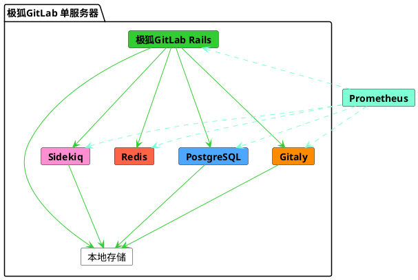



- Tier: 基础版，专业版，旗舰版
- Offering: 私有化部署



该参考架构的目标峰值负载为每秒 20 个请求 (RPS)。根据真实数据，此负载通常对应最多 1,000 名用户，包括手动和自动交互。

有关参考架构的完整列表，请参阅
[可用的参考架构](_index.md#available-reference-architectures)。

- **目标负载**: API: 20 RPS, Web: 2 RPS, Git (拉取): 2 RPS, Git (推送): 1 RPS
- **高可用性**: 否。要获得高可用性环境，
  请遵循修改后的[3K 参考架构](3k_users.md#supported-modifications-for-lower-user-counts-ha)。
- **云原生混合**: 否。对于云原生混合环境，你可以
  遵循[修改后的混合参考架构](#cloud-native-hybrid-reference-architecture-with-helm-charts)。
- **不确定要使用哪个参考架构**？更多信息，请参阅[决定从哪个架构开始](_index.md#deciding-which-architecture-to-start-with)。

| 用户           | 配置                     | GCP 示例1       | AWS 示例1 | Azure 示例1 |
|---------------|-------------------------|----------------------------|----------------------|------------------------|
| 最高 1,000 或 20 RPS | 8 vCPU，16 GB 内存 | `n1-standard-8`2 | `c5.2xlarge`         | `F8s v2`               |

**脚注**：

<!-- Disable ordered list rule <https://github.com/DavidAnson/markdownlint/blob/main/doc/Rules.md#md029---ordered-list-item-prefix> -->
<!-- markdownlint-disable MD029 -->
1.  此处机器类型示例仅作说明用途。这些类型已在[验证和测试](_index.md#validation-and-test-results)中使用，但并非旨在作为规定性默认值。切换到满足所列要求的其他机器类型是受支持的，包括可用的 ARM 变体。更多信息，请参阅[支持的机器类型](_index.md#supported-machine-types)。
2.  对于 GCP，选择了最接近且等效的标准机器类型，以满足推荐的 8 vCPU 和 16 GB 内存要求。如果需要，也可以使用[自定义机器类型](https://cloud.google.com/compute/docs/instances/creating-instance-with-custom-machine-type)。
<!-- markdownlint-enable MD029 -->

下图显示，虽然 GitLab 可以安装在单个服务器上，但其内部由多个服务组成。当实例扩展时，这些服务会被分离，并根据其特定需求独立扩展。

在某些情况下，你可以对一些服务利用 PaaS。例如，你可以为某些文件系统使用云对象存储。为了冗余，一些服务会成为节点集群并存储相同的数据。

在水平扩展的 GitLab 配置中，需要各种辅助服务来协调集群或发现资源。例如，用于 PostgreSQL 连接管理的 PgBouncer，或用于 Prometheus 端点发现的 Consul。

## 要求

在继续之前，请查阅参考架构的[要求](_index.md#requirements)。

> [!warning]
> 节点的规格是基于正常状况下使用模式和仓库大小的高百分位数据得出的。
> 然而，如果你有[大型单一仓库](_index.md#large-monorepos)（大于几 GB）或[额外的工作负载](_index.md#additional-workloads)，它们可能会显著影响环境的性能。
> 如果这适用于你，[可能需要进一步的调整](_index.md#scaling-an-environment)。请查看链接的文档，如果需要进一步的指导，请联系我们。

## 测试方法

20 RPS / 1k 用户参考架构旨在适应最常见的工​​作流程。极狐GitLab 会定期针对以下端点吞吐量目标进行冒烟测试和性能测试：

| 端点类型      | 目标吞吐量 |
|-------------|-------|
| API         | 20 RPS |
| Web         | 2 RPS |
| Git (拉取)   | 2 RPS |
| Git (推送)   | 1 RPS |

这些目标基于真实客户数据，反映了指定用户数量的总环境负载，包括 CI 流水线和其他工作负载。这代表了典型的工作负载组合。有关非典型工作负载模式的指导，请参见[了解 RPS 构成](sizing.md#understanding-rps-composition-and-workload-patterns)。

有关我们测试方法的更多信息，请参见[验证和测试结果](_index.md#validation-and-test-results)部分。

### 性能考量

如果你的环境存在以下情况，你可能需要进行额外的调整：

-   持续高于列出的目标的吞吐量
-   [大型单一仓库](_index.md#large-monorepos)
-   显著的[额外工作负载](_index.md#additional-workloads)

在这些情况下，请参阅[扩展环境](_index.md#scaling-an-environment)以获取更多信息。如果你认为这些考虑因素可能适用于你，请联系我们以获取所需的额外指导。

## 设置说明

要为该默认参考架构安装极狐GitLab，请使用标准
[安装说明](../../install/_index.md)。

你也可以选择将极狐GitLab 配置为使用[外部 PostgreSQL 服务](../postgresql/external.md)
或[外部对象存储服务](../object_storage.md)。这可以提升性能和可靠性，但会增加复杂性成本。

## 配置高级搜索



- Tier: 专业版，旗舰版
- Offering: 私有化部署



你可以利用 Elasticsearch 并[启用高级搜索](../../integration/advanced_search/elasticsearch.md)
，以便在整个极狐GitLab 实例中实现更快、更高级的代码搜索。

Elasticsearch 集群的设计和要求取决于你的
数据。关于如何为你的实例设置 Elasticsearch
集群的推荐最佳实践，请参见
[选择最佳集群配置](../../integration/advanced_search/elasticsearch.md#guidance-on-choosing-optimal-cluster-configuration)。

## 使用 Helm Chart 的云原生混合参考架构

在云原生混合参考架构设置中，选定的无状态
组件通过使用我们官方的 [Helm Chart](https://gitlab.cn/docs/charts/) 部署在 Kubernetes 中。
有状态组件则通过 Linux 软件包部署在计算 VM 中。

可在 Kubernetes 中使用的最小参考架构是 [2k 或 40 RPS 极狐GitLab 云原生混合](2k_users.md#cloud-native-hybrid-reference-architecture-with-helm-charts-alternative)（非 HA）和 [3k 或 60 RPS 极狐GitLab 云原生混合](3k_users.md#cloud-native-hybrid-reference-architecture-with-helm-charts-alternative)（HA）。

对于服务较少用户或较低 RPS 的环境，你可以降低节点规格。根据你的用户数量，你可以根据需要降低所有建议的节点规格。但是，你不应低于[通用要求](../../install/requirements.md)。

## 后续步骤

现在，你拥有了一个全新的极狐GitLab 环境，并相应地配置了核心功能。你可能希望根据需求配置其他可选的极狐GitLab 功能。有关更多信息，请参见[安装极狐GitLab 后的步骤](../../install/next_steps.md)。

> [!note]
> 根据你的环境和需求，设置附加功能可能需要额外的硬件或进行调整。详情请参见各个功能的独立页面。