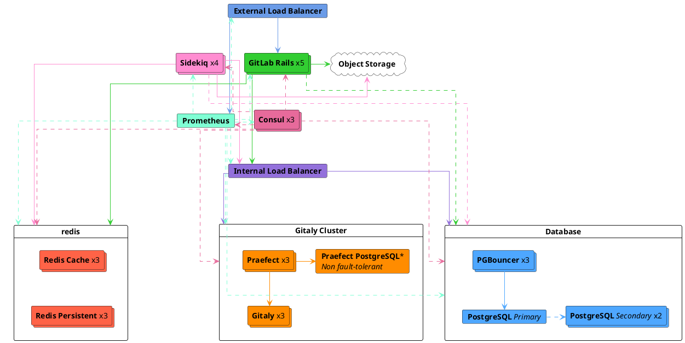
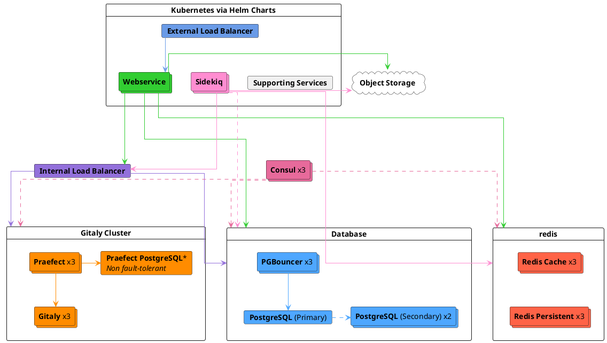



- Tier: 专业版，旗舰版
- Offering: 私有化部署



本页介绍极狐GitLab 参考架构，该架构旨在基于真实数据，应对 500 请求/秒（RPS）的峰值负载，即最多 25,000 名用户（包括手动和自动用户）的典型峰值负载。

有关参考架构的完整列表，请参阅
[可用参考架构](_index.md#available-reference-architectures)。

> [!note]
> 在部署此架构之前，建议先阅读[主文档](_index.md)，
> 特别是[开始之前](_index.md#before-you-start)和[决定使用哪种架构](_index.md#deciding-which-architecture-to-start-with)部分。

- **目标负载**：API：500 RPS，Web：50 RPS，Git（拉取）：50 RPS，Git（推送）：10 RPS
- **高可用性**：是（[Praefect](#configure-praefect-postgresql) 需要第三方 PostgreSQL 解决方案以实现 HA）
- **云原生混合替代方案**：[是](#cloud-native-hybrid-reference-architecture-with-helm-charts-alternative)
- **不确定使用哪种参考架构**？[点击此指南了解更多信息](_index.md#deciding-which-architecture-to-start-with)

| 服务                                  | 节点数 | 配置           | GCP 示例<sup>1</sup> | AWS 示例<sup>1</sup> | Azure 示例<sup>1</sup> |
|------------------------------------------|-------|-------------------------|------------------|--------------|-----------|
| 外部负载均衡器<sup>4</sup>       | 1     | 8 vCPU, 7.2 GB 内存   | `n1-highcpu-8`   | `c5n.2xlarge` | `F8s v2`  |
| Consul<sup>2</sup>                       | 3     | 2 vCPU, 1.8 GB 内存   | `n1-highcpu-2`   | `c5.large`   | `F2s v2`  |
| PostgreSQL<sup>2</sup>                   | 3     | 16 vCPU, 60 GB 内存   | `n1-standard-16` | `m5.4xlarge` | `D16s v3` |
| PgBouncer<sup>2</sup>                    | 3     | 2 vCPU, 1.8 GB 内存   | `n1-highcpu-2`   | `c5.large`   | `F2s v2`  |
| 内部负载均衡器<sup>4</sup>       | 1     | 8 vCPU, 7.2 GB 内存   | `n1-highcpu-8`   | `c5n.2xlarge` | `F8s v2`  |
| Redis/Sentinel - 缓存<sup>3</sup>       | 3     | 4 vCPU, 15 GB 内存    | `n1-standard-4`  | `m5.xlarge`  | `D4s v3`  |
| Redis/Sentinel - 持久化<sup>3</sup>  | 3     | 4 vCPU, 15 GB 内存    | `n1-standard-4`  | `m5.xlarge`  | `D4s v3`  |
| Gitaly<sup>6</sup><sup>7</sup>           | 3     | 32 vCPU, 120 GB 内存  | `n1-standard-32` | `m5.8xlarge` | `D32s v3` |
| Praefect<sup>6</sup>                     | 3     | 4 vCPU, 3.6 GB 内存   | `n1-highcpu-4`   | `c5.xlarge`  | `F4s v2`  |
| Praefect PostgreSQL<sup>2</sup>          | 1+    | 2 vCPU, 1.8 GB 内存   | `n1-highcpu-2`   | `c5.large`   | `F2s v2`  |
| Sidekiq<sup>8</sup>                      | 4     | 4 vCPU, 15 GB 内存    | `n1-standard-4`  | `m5.xlarge`  | `D4s v3`  |
| GitLab Rails<sup>8</sup>                 | 5     | 32 vCPU, 28.8 GB 内存 | `n1-highcpu-32`  | `c5.9xlarge` | `F32s v2` |
| 监控节点                          | 1     | 4 vCPU, 3.6 GB 内存   | `n1-highcpu-4`   | `c5.xlarge`  | `F4s v2`  |
| 对象存储<sup>5</sup>               | -     | -                       | -                | -            | -         |

**脚注**：

<!-- Disable ordered list rule <https://github.com/DavidAnson/markdownlint/blob/main/doc/Rules.md#md029---ordered-list-item-prefix> -->
<!-- markdownlint-disable MD029 -->
1. 机器类型示例仅用于说明目的。这些类型用于[验证和测试](_index.md#validation-and-test-results)，但并非作为规定性默认值。支持切换到满足所列要求的其他机器类型，包括可用的 ARM 变体。有关更多信息，请参阅[支持的机器类型](_index.md#supported-machine-types)。
2. 可以选择在信誉良好的第三方外部 PaaS PostgreSQL 解决方案上运行。有关更多信息，请参阅[提供您自己的 PostgreSQL 实例](#provide-your-own-postgresql-instance)。
3. 可以选择在信誉良好的第三方外部 PaaS Redis 解决方案上运行。有关更多信息，请参阅[提供您自己的 Redis 实例](#provide-your-own-redis-instances)。
   - Redis 主要是单线程的，增加 CPU 核心数不会带来显著收益。对于此规模的架构，强烈建议按指定方式分离缓存和持久化实例，以获得最佳性能。
4. 建议与信誉良好的第三方负载均衡器或服务（LB PaaS）一起运行，该服务可以提供 HA 能力。
   此外，规模取决于所选负载均衡器以及网络带宽等其他因素。有关更多信息，请参阅[负载均衡器](_index.md#load-balancers)。
5. 应在信誉良好的云提供商或私有化部署解决方案上运行。有关更多信息，请参阅[配置对象存储](#configure-the-object-storage)。
6. Gitaly 集群 (Praefect)提供了容错优势，但也带来了设置和管理的额外复杂性。
   在部署 Gitaly 集群之前，请查看现有的[技术限制和注意事项](../gitaly/praefect/_index.md#before-deploying-gitaly-cluster-praefect)。如果您想要分片 Gitaly，请使用上表中为 `Gitaly` 列出的相同规格。
7. Gitaly 规格基于健康状态下使用模式和代码仓库大小的高百分位数。
   但是，如果您有[大型 monorepo](_index.md#large-monorepos)（大于几 GB）或[额外工作负载](_index.md#additional-workloads)，这些可能会显著影响 Git 和 Gitaly 的性能，并且可能需要进行进一步调整。
8. 可以放置在自动扩缩组（ASG）中，因为该组件不存储任何[有状态数据](_index.md#autoscaling-of-stateful-nodes)。
   但是，通常更倾向于[云原生混合设置](#cloud-native-hybrid-reference-architecture-with-helm-charts-alternative)，因为某些组件
   例如[迁移](#gitlab-rails-post-configuration)和 [Mailroom](../incoming_email.md) 只能在单个节点上运行，这在 Kubernetes 中处理得更好。
<!-- markdownlint-enable MD029 -->

> [!note]
> 对于所有涉及配置实例的 PaaS 解决方案，建议在三个不同的可用区中至少部署三个节点，以符合弹性云架构实践。



<a id="requirements"></a>

## 要求

开始之前，请参阅参考架构的[要求](_index.md#requirements)。

<a id="testing-methodology"></a>

## 测试方法

500 RPS / 25k 用户参考架构旨在适应大多数常见工作流。极狐GitLab 定期针对以下端点吞吐量目标进行冒烟和性能测试：

| 端点类型 | 目标吞吐量 |
| ------------- | ----------------- |
| API           | 500 RPS            |
| Web           | 50 RPS             |
| Git（拉取）    | 50 RPS             |
| Git（推送）    | 10 RPS             |

这些目标基于实际客户数据，反映了指定用户数的总环境负载，包括 CI 流水线和其他工作负载。这代表了典型的工作负载构成。有关非典型工作负载模式的指导，请参阅[了解 RPS 构成](../../install/sizing.md#understanding-rps-composition-and-workload-patterns)。

有关我们测试方法的更多信息，请参阅[验证和测试结果](_index.md#validation-and-test-results)部分。

<a id="performance-considerations"></a>

### 性能注意事项

如果您的环境具有以下情况，则可能需要进行额外调整：

- 持续高于所列目标的吞吐量
- [大型 monorepo](_index.md#large-monorepos)
- 大量[额外工作负载](_index.md#additional-workloads)

在这些情况下，请参阅[扩展环境](_index.md#scaling-an-environment)以获取更多信息。如果您认为这些注意事项可能适用于您，请根据需要联系我们以获取额外指导。

<a id="load-balancer-configuration"></a>

### 负载均衡器配置

我们的测试环境使用：

- 适用于 Linux 软件包环境的 HAProxy
- 适用于云原生混合环境的、具有 Gateway API 或 Ingress 实现的云提供商等价物

<a id="set-up-components"></a>

## 设置组件

要设置极狐GitLab 及其组件以支持最多 500 RPS 或 25,000 名用户：

1. [配置外部负载均衡器](#configure-the-external-load-balancer)
   以处理极狐GitLab 应用服务节点的负载均衡。
1. [配置内部负载均衡器](#configure-the-internal-load-balancer)
   以处理极狐GitLab 应用内部连接的负载均衡。
1. [配置 Consul](#configure-consul) 用于服务发现和健康检查。
1. [配置 PostgreSQL](#configure-postgresql)，即极狐GitLab 的数据库。
1. [配置 PgBouncer](#configure-pgbouncer) 用于数据库连接池和管理。
1. [配置 Redis](#configure-redis)，它存储会话数据、临时缓存信息和后台作业队列。
1. [配置 Gitaly 集群 (Praefect)](#configure-gitaly-cluster-praefect)，
   它提供对 Git 代码仓库的访问。
1. [配置 Sidekiq](#configure-sidekiq) 用于后台作业处理。
1. [配置主 GitLab Rails 应用](#configure-gitlab-rails)
   以运行 Puma、Workhorse、GitLab Shell，并处理所有前端请求（包括 UI、API 和基于 HTTP/SSH 的 Git）。
1. [配置 Prometheus](#configure-prometheus) 以监控您的极狐GitLab 环境。
1. [配置对象存储](#configure-the-object-storage)
   用于共享数据对象。
1. [配置高级搜索](#configure-advanced-search)（可选）以在整个极狐GitLab 实例中实现更快、更高级的代码搜索。

服务器位于相同的 10.6.0.0/24 私有网络范围内，并且可以
通过这些地址自由地相互连接。

以下列表包含每台服务器及其分配 IP 的描述：

- `10.6.0.10`：外部负载均衡器
- `10.6.0.11`：Consul 1
- `10.6.0.12`：Consul 2
- `10.6.0.13`：Consul 3
- `10.6.0.21`：PostgreSQL 主节点
- `10.6.0.22`：PostgreSQL 从节点 1
- `10.6.0.23`：PostgreSQL 从节点 2
- `10.6.0.31`：PgBouncer 1
- `10.6.0.32`：PgBouncer 2
- `10.6.0.33`：PgBouncer 3
- `10.6.0.40`：内部负载均衡器
- `10.6.0.51`：Redis - 缓存主节点
- `10.6.0.52`：Redis - 缓存副本 1
- `10.6.0.53`：Redis - 缓存副本 2
- `10.6.0.61`：Redis - 持久化主节点
- `10.6.0.62`：Redis - 持久化副本 1
- `10.6.0.63`：Redis - 持久化副本 2
- `10.6.0.91`：Gitaly 1
- `10.6.0.92`：Gitaly 2
- `10.6.0.93`：Gitaly 3
- `10.6.0.131`：Praefect 1
- `10.6.0.132`：Praefect 2
- `10.6.0.133`：Praefect 3
- `10.6.0.141`：Praefect PostgreSQL 1（非 HA）
- `10.6.0.101`：Sidekiq 1
- `10.6.0.102`：Sidekiq 2
- `10.6.0.103`：Sidekiq 3
- `10.6.0.104`：Sidekiq 4
- `10.6.0.111`：极狐GitLab 应用 1
- `10.6.0.112`：极狐GitLab 应用 2
- `10.6.0.113`：极狐GitLab 应用 3
- `10.6.0.114`：极狐GitLab 应用 4
- `10.6.0.115`：极狐GitLab 应用 5
- `10.6.0.151`：Prometheus

<a id="configure-the-external-load-balancer"></a>

## 配置外部负载均衡器

在多节点极狐GitLab 配置中，您需要一个外部负载均衡器来将流量路由到应用服务器。

具体使用哪个负载均衡器或其确切配置
超出了极狐GitLab 文档的范围，但有关一般要求的更多信息，请参阅[负载均衡器](_index.md)。本节将重点介绍
为您选择的负载均衡器需要配置的具体内容。

<a id="readiness-checks"></a>

### 就绪检查

确保外部负载均衡器仅将流量路由到具有内置监控端点的正常服务。 [就绪检查](../monitoring/health_check.md)
都要求在被检查的节点上进行[额外配置](../monitoring/ip_allowlist.md)，否则外部负载均衡器将无法连接。

<a id="ports"></a>

### 端口

下表显示了要使用的基本端口。

| LB 端口 | 后端端口 | 协议                 |
| ------- | ------------ | ------------------------ |
| 80      | 80           | HTTP (*1*)               |
| 443     | 443          | TCP 或 HTTPS (*1*) (*2*) |
| 22      | 22           | TCP                      |

- (*1*)：[Web 终端](../../ci/environments/_index.md#web-terminals-deprecated)支持要求
  您的负载均衡器正确处理 WebSocket 连接。使用
  HTTP 或 HTTPS 代理时，这意味着您的负载均衡器必须配置为
  传递 `Connection` 和 `Upgrade` 逐跳头。有关更多详细信息，请参阅
  [Web 终端](../integration/terminal.md)集成指南。
- (*2*)：对端口 443 使用 HTTPS 协议时，您必须向负载均衡器添加 SSL 证书。如果您希望在极狐GitLab 应用服务器上终止 SSL，请改用 TCP 协议。

如果您将 GitLab Pages 与自定义域名支持一起使用，则需要一些额外的端口配置。
GitLab Pages 需要一个单独的虚拟 IP 地址。配置 DNS 将
`pages_external_url` 从 `/etc/gitlab/gitlab.rb` 指向新的虚拟 IP 地址。有关更多信息，请参阅
[GitLab Pages 文档](../pages/_index.md)。

| LB 端口 | 后端端口  | 协议  |
| ------- | ------------- | --------- |
| 80      | 不同 (*1*)  | HTTP      |
| 443     | 不同 (*1*)  | TCP (*2*) |

- (*1*)：GitLab Pages 的后端端口取决于
  `gitlab_pages['external_http']` 和 `gitlab_pages['external_https']`
  设置。有关更多详细信息，请参阅 [GitLab Pages 文档](../pages/_index.md)。
- (*2*)：GitLab Pages 的端口 443 应始终使用 TCP 协议。用户可以配置带有自定义 SSL 的自定义域名，如果 SSL 在负载均衡器处终止，则无法实现这一点。

<a id="alternate-ssh-port"></a>

#### 备用 SSH 端口

一些组织有禁止开放 SSH 端口 22 的策略。在这种情况下，
配置一个允许用户在端口 443 上使用 SSH 的备用 SSH 主机名可能会有所帮助。与之前记录的
其他极狐GitLab HTTP 配置相比，备用 SSH 主机名将需要一个新的虚拟 IP 地址。

为备用 SSH 主机名配置 DNS，例如 `altssh.gitlab.example.com`。

| LB 端口 | 后端端口 | 协议 |
| ------- | ------------ | -------- |
| 443     | 22           | TCP      |

<a id="ssl"></a>

### SSL

下一个问题是您将如何在环境中处理 SSL。
有几种不同的选项：

- [应用节点终止 SSL](#application-node-terminates-ssl)。
- [负载均衡器终止 SSL 而不启用后端 SSL](#load-balancer-terminates-ssl-without-backend-ssl)
  且负载均衡器与应用节点之间的通信不安全。
- [负载均衡器终止 SSL 并启用后端 SSL](#load-balancer-terminates-ssl-with-backend-ssl)
  且负载均衡器与应用节点之间的通信是安全的。

<a id="application-node-terminates-ssl"></a>

#### 应用节点终止 SSL

将您的负载均衡器配置为将端口 443 上的连接作为 `TCP` 协议而不是 `HTTP(S)` 协议传递。这将把连接原封不动地传递到应用节点的 NGINX 服务。NGINX 将拥有 SSL 证书并监听端口 443。

有关管理 SSL 证书和配置 NGINX 的详细信息，请参阅 [HTTPS 文档](https://gitlab.cn/docs/omnibus/settings/ssl/)。

<a id="load-balancer-terminates-ssl-without-backend-ssl"></a>

#### 负载均衡器终止 SSL 而不启用后端 SSL

将您的负载均衡器配置为使用 `HTTP(S)` 协议而不是 `TCP` 协议。
然后，负载均衡器将负责管理 SSL 证书并终止 SSL。

由于负载均衡器和极狐GitLab 之间的通信将不安全，
因此需要进行一些额外配置。有关详细信息，请参阅
[代理 SSL 文档](https://gitlab.cn/docs/omnibus/settings/ssl/#configure-a-reverse-proxy-or-load-balancer-ssl-termination)。

<a id="load-balancer-terminates-ssl-with-backend-ssl"></a>

#### 负载均衡器终止 SSL 并启用后端 SSL

将您的负载均衡器配置为使用 'HTTP(S)' 协议而不是 'TCP' 协议。
负载均衡器将负责管理最终用户将看到的 SSL 证书。

在这种情况下，负载均衡器和 NGINX 之间的流量也是安全的。由于连接全程安全，因此无需为代理 SSL 添加配置。但是，必须向极狐GitLab 添加配置以配置 SSL 证书。有关管理 SSL 证书和配置 NGINX 的详细信息，请参阅 [HTTPS 文档](https://gitlab.cn/docs/omnibus/settings/ssl/)。

<div align="right">
  <a type="button" class="btn btn-default" href="#set-up-components">
    返回设置组件 <i class="fa fa-angle-double-up" aria-hidden="true"></i>
  </a>
</div>

<a id="configure-the-internal-load-balancer"></a>

## 配置内部负载均衡器

内部负载均衡器用于平衡极狐GitLab 环境所需的任何内部连接，
例如到 [PgBouncer](#configure-pgbouncer) 和 [Gitaly 集群 (Praefect)](#configure-praefect) 的连接。

它是与外部负载均衡器分离的节点，不应有任何外部访问。

以下 IP 将用作示例：

- `10.6.0.40`：内部负载均衡器

以下是使用 [HAProxy](https://www.haproxy.org/) 实现的方法：

```plaintext
global
    log /dev/log local0
    log localhost local1 notice
    log stdout format raw local0

defaults
    log global
    default-server inter 10s fall 3 rise 2
    balance leastconn

frontend internal-pgbouncer-tcp-in
    bind *:6432
    mode tcp
    option tcplog

    default_backend pgbouncer

backend pgbouncer
    mode tcp
    option tcp-check

    server pgbouncer1 10.6.0.31:6432 check
    server pgbouncer2 10.6.0.32:6432 check
    server pgbouncer3 10.6.0.33:6432 check

# Praefect load balancing (skip both sections below if using DNS service discovery for Praefect)
# For more information, see https://docs.gitlab.com/administration/gitaly/praefect/configure/#service-discovery
frontend internal-praefect-tcp-in
    bind *:2305
    mode tcp
    option tcplog
    option clitcpka

    default_backend praefect

backend praefect
    mode tcp
    option tcp-check
    option srvtcpka

    server praefect1 10.6.0.131:2305 check
    server praefect2 10.6.0.132:2305 check
    server praefect3 10.6.0.133:2305 check
```

请参阅您首选的负载均衡器文档以获取进一步指导。

<div align="right">
  <a type="button" class="btn btn-default" href="#set-up-components">
    返回设置组件 <i class="fa fa-angle-double-up" aria-hidden="true"></i>
  </a>
</div>

<a id="configure-consul"></a>

## 配置 Consul

接下来，我们设置 Consul 服务器。

> [!note]
> Consul 必须以 3 个或更多节点的奇数部署。这是为了确保节点可以作为法定人数的一部分进行投票。

以下 IP 将用作示例：

- `10.6.0.11`：Consul 1
- `10.6.0.12`：Consul 2
- `10.6.0.13`：Consul 3

要配置 Consul：

1. SSH 登录到将托管 Consul 的服务器。
1. [下载并安装](../../install/package/_index.md#supported-platforms)您选择的 Linux 软件包。请务必仅添加极狐GitLab 软件包仓库，并为您的操作系统安装极狐GitLab。选择与您当前安装相同的版本和类型（基础版或企业版）。
1. 编辑 `/etc/gitlab/gitlab.rb` 并添加内容：

   ```ruby
   roles(['consul_role'])

   ## Enable service discovery for Prometheus
   consul['monitoring_service_discovery'] =  true

   ## The IPs of the Consul server nodes
   ## You can also use FQDNs and intermix them with IPs
   consul['configuration'] = {
      server: true,
      retry_join: %w(10.6.0.11 10.6.0.12 10.6.0.13),
   }

   # Set the network addresses that the exporters will listen on
   node_exporter['listen_address'] = '0.0.0.0:9100'

   # Prevent database migrations from running on upgrade automatically
   gitlab_rails['auto_migrate'] = false
   ```

1. 从您配置的第一个 Linux 软件包节点复制 `/etc/gitlab/gitlab-secrets.json` 文件，并在此服务器上添加或替换同名文件。如果这是您配置的第一个 Linux 软件包节点，则可以跳过此步骤。
1. [重新配置极狐GitLab](../restart_gitlab.md#reconfigure-a-linux-package-installation) 以使更改生效。
1. 对所有其他 Consul 节点重复这些步骤，并确保设置正确的 IP。

当第三个 Consul 服务器配置完成时，会选举出一个 Consul 领导者。查看 Consul 日志 `sudo gitlab-ctl tail consul` 会显示
`...[INFO] consul: New leader elected: ...`。

您可以列出当前的 Consul 成员（服务器、客户端）：

```shell
sudo /opt/gitlab/embedded/bin/consul members
```

您可以验证极狐GitLab 服务是否正在运行：

```shell
sudo gitlab-ctl status
```

输出应类似于以下内容：

```plaintext
run: consul: (pid 30074) 76834s; run: log: (pid 29740) 76844s
run: logrotate: (pid 30925) 3041s; run: log: (pid 29649) 76861s
run: node-exporter: (pid 30093) 76833s; run: log: (pid 29663) 76855s
```

<div align="right">
  <a type="button" class="btn btn-default" href="#set-up-components">
    返回设置组件 <i class="fa fa-angle-double-up" aria-hidden="true"></i>
  </a>
</div>

<a id="configure-postgresql"></a>

## 配置 PostgreSQL

在本节中，将指导您配置一个用于极狐GitLab 的高可用 PostgreSQL 集群。

<a id="provide-your-own-postgresql-instance"></a>

### 提供您自己的 PostgreSQL 实例

您可以使用[第三方外部 PostgreSQL 服务](../postgresql/external.md)，而不是使用 Linux 软件包捆绑的 PostgreSQL、PgBouncer 和 Consul 服务发现组件。

使用运行[受支持的 PostgreSQL 版本](../../install/requirements.md#postgresql)的信誉良好的提供商。这些服务已知可以很好地工作：

- [Google Cloud SQL](https://cloud.google.com/sql/docs/postgres/high-availability#normal)。
- [Amazon RDS](https://aws.amazon.com/rds/)。

有关更多信息，包括高可用性和数据库负载均衡的指导，请参阅：

- [基础设施和服务](_index.md#infrastructure-and-services)。
- [数据库服务最佳实践](_index.md#best-practices-for-the-database-services)。

如果您使用第三方外部服务：

1. 根据[数据库要求文档](../../install/requirements.md#postgresql)设置 PostgreSQL。
1. 配置所需的[用户和数据库](../postgresql/external.md)。
1. 按照[配置 GitLab Rails](#configure-gitlab-rails) 中的说明，使用适当的连接详细信息配置极狐GitLab 应用服务器。

<a id="standalone-postgresql-using-the-linux-package"></a>

### 使用 Linux 软件包的独立 PostgreSQL

推荐的用于具有复制和故障转移的 PostgreSQL 集群的 Linux 软件包配置需要：

- 至少三个 PostgreSQL 节点。
- 至少三个 Consul 服务器节点。
- 至少三个 PgBouncer 节点，用于跟踪和处理主数据库的读写。
  - 一个[内部负载均衡器](#configure-the-internal-load-balancer)（TCP），用于在 PgBouncer 节点之间平衡请求。
- 启用[数据库负载均衡](../postgresql/database_load_balancing.md)。

  在每个 PostgreSQL 节点上配置一个本地 PgBouncer 服务。这与跟踪主节点的 PgBouncer 主集群是分开的。

以下 IP 用作示例：

- `10.6.0.21`：PostgreSQL 主节点
- `10.6.0.22`：PostgreSQL 从节点 1
- `10.6.0.23`：PostgreSQL 从节点 2

首先，确保在每个节点上[安装](../../install/package/_index.md#supported-platforms) Linux 软件包。请务必仅添加极狐GitLab 软件包仓库，并为您的操作系统安装极狐GitLab，但不要提供 `EXTERNAL_URL` 值。

<a id="postgresql-nodes"></a>

#### PostgreSQL 节点

1. SSH 登录到其中一个 PostgreSQL 节点。
1. 为 PostgreSQL 用户名/密码对生成密码哈希。这假设您将使用默认用户名 `gitlab`（推荐）。该命令将要求输入密码并确认。在下一步中使用此命令输出的值作为 `<postgresql_password_hash>` 的值：

   ```shell
   sudo gitlab-ctl pg-password-md5 gitlab
   ```

1. 为 PgBouncer 用户名/密码对生成密码哈希。这假设您将使用默认用户名 `pgbouncer`（推荐）。该命令将要求输入密码并确认。在下一步中使用此命令输出的值作为 `<pgbouncer_password_hash>` 的值：

   ```shell
   sudo gitlab-ctl pg-password-md5 pgbouncer
   ```

1. 为 PostgreSQL 复制用户名/密码对生成密码哈希。这假设您将使用默认用户名 `gitlab_replicator`（推荐）。该命令将要求输入密码并确认。在下一步中使用此命令输出的值作为 `<postgresql_replication_password_hash>` 的值：

   ```shell
   sudo gitlab-ctl pg-password-md5 gitlab_replicator
   ```

1. 为 Consul 数据库用户名/密码对生成密码哈希。这假设您将使用默认用户名 `gitlab-consul`（推荐）。该命令将要求输入密码并确认。在下一步中使用此命令输出的值作为 `<consul_password_hash>` 的值：

   ```shell
   sudo gitlab-ctl pg-password-md5 gitlab-consul
   ```

1. 在每个数据库节点上，编辑 `/etc/gitlab/gitlab.rb`，替换 `# START user configuration` 部分中注明的值：

   ```ruby
   # Disable all components except Patroni, PgBouncer, and Consul
   roles(['patroni_role', 'pgbouncer_role'])

   # PostgreSQL configuration
   postgresql['listen_address'] = '0.0.0.0'

   # Sets `max_replication_slots` to double the number of database nodes.
   # Patroni uses one extra slot per node when initiating the replication.
   patroni['postgresql']['max_replication_slots'] = 6

   # Set `max_wal_senders` to one more than the number of replication slots in the cluster.
   # This is used to prevent replication from using up all of the
   # available database connections.
   patroni['postgresql']['max_wal_senders'] = 7

   # Prevent database migrations from running on upgrade automatically
   gitlab_rails['auto_migrate'] = false

   # Configure the Consul agent
   consul['services'] = %w(postgresql)
   ## Enable service discovery for Prometheus
   consul['monitoring_service_discovery'] =  true

   # START user configuration
   # Please set the real values as explained in Required Information section
   #
   # Replace PGBOUNCER_PASSWORD_HASH with a generated md5 value
   postgresql['pgbouncer_user_password'] = '<pgbouncer_password_hash>'
   # Replace POSTGRESQL_REPLICATION_PASSWORD_HASH with a generated md5 value
   postgresql['sql_replication_password'] = '<postgresql_replication_password_hash>'
   # Replace POSTGRESQL_PASSWORD_HASH with a generated md5 value
   postgresql['sql_user_password'] = '<postgresql_password_hash>'

   # Set up basic authentication for the Patroni API (use the same username/password in all nodes).
   patroni['username'] = '<patroni_api_username>'
   patroni['password'] = '<patroni_api_password>'

   # Replace 10.6.0.0/24 with Network Address
   postgresql['trust_auth_cidr_addresses'] = %w(10.6.0.0/24 127.0.0.1/32)

   # Local PgBouncer service for Database Load Balancing
   pgbouncer['databases'] = {
      gitlabhq_production: {
         host: "127.0.0.1",
         user: "pgbouncer",
         password: '<pgbouncer_password_hash>'
      }
   }

   # Set the network addresses that the exporters will listen on for monitoring
   node_exporter['listen_address'] = '0.0.0.0:9100'
   postgres_exporter['listen_address'] = '0.0.0.0:9187'

   ## The IPs of the Consul server nodes
   ## You can also use FQDNs and intermix them with IPs
   consul['configuration'] = {
      retry_join: %w(10.6.0.11 10.6.0.12 10.6.0.13),
   }
   #
   # END user configuration
   ```

PostgreSQL 在 Patroni 管理其故障转移时，将默认使用 `pg_rewind` 来处理冲突。
与大多数故障转移处理方法一样，这有很小的可能导致数据丢失。
有关更多信息，请参阅各种 [Patroni 复制方法](../postgresql/replication_and_failover.md#selecting-the-appropriate-patroni-replication-method)。

1. 从您配置的第一个 Linux 软件包节点复制 `/etc/gitlab/gitlab-secrets.json` 文件，并在此服务器上添加或替换同名文件。如果这是您配置的第一个 Linux 软件包节点，则可以跳过此步骤。
1. [重新配置极狐GitLab](../restart_gitlab.md#reconfigure-a-linux-package-installation) 以使更改生效。

支持高级[配置选项](https://gitlab.cn/docs/omnibus/settings/database/)，如有需要可以添加。

<div align="right">
  <a type="button" class="btn btn-default" href="#set-up-components">
    返回设置组件 <i class="fa fa-angle-double-up" aria-hidden="true"></i>
  </a>
</div>

<a id="postgresql-post-configuration"></a>

#### PostgreSQL 后配置

SSH 登录到主站点上的任意 Patroni 节点：

1. 检查领导者和集群的状态：

   ```shell
   gitlab-ctl patroni members
   ```

   输出应类似于以下内容：

   ```plaintext
   | Cluster       | Member                            |  Host     | Role   | State   | TL  | Lag in MB | Pending restart |
   |---------------|-----------------------------------|-----------|--------|---------|-----|-----------|-----------------|
   | postgresql-ha | <PostgreSQL primary hostname>     | 10.6.0.21 | Leader | running | 175 |           | *               |
   | postgresql-ha | <PostgreSQL secondary 1 hostname> | 10.6.0.22 |        | running | 175 | 0         | *               |
   | postgresql-ha | <PostgreSQL secondary 2 hostname> | 10.6.0.23 |        | running | 175 | 0         | *               |
   ```

如果任何节点的 'State' 列未显示 "running"，请在继续之前检查
[PostgreSQL 复制和故障转移故障排除部分](../postgresql/replication_and_failover_troubleshooting.md#pgbouncer-error-error-pgbouncer-cannot-connect-to-server)。

<div align="right">
  <a type="button" class="btn btn-default" href="#set-up-components">
    返回设置组件 <i class="fa fa-angle-double-up" aria-hidden="true"></i>
  </a>
</div>

<a id="configure-pgbouncer"></a>

### 配置 PgBouncer

现在 PostgreSQL 服务器都已设置完毕，让我们配置 PgBouncer
以跟踪和处理对主数据库的读/写。

> [!note]
> PgBouncer 是单线程的，增加 CPU 核心数不会带来显著收益。
> 有关更多信息，请参阅[扩展文档](_index.md#scaling-an-environment)。

以下 IP 将用作示例：

- `10.6.0.31`：PgBouncer 1
- `10.6.0.32`：PgBouncer 2
- `10.6.0.33`：PgBouncer 3

1. 在每个 PgBouncer 节点上，编辑 `/etc/gitlab/gitlab.rb`，并将
   `<consul_password_hash>` 和 `<pgbouncer_password_hash>` 替换为
   您[之前设置](#postgresql-nodes)的密码哈希：

   ```ruby
   # Disable all components except Pgbouncer and Consul agent
   roles(['pgbouncer_role'])

   # Configure PgBouncer
   pgbouncer['admin_users'] = %w(pgbouncer gitlab-consul)
   pgbouncer['users'] = {
      'gitlab-consul': {
         password: '<consul_password_hash>'
      },
      'pgbouncer': {
         password: '<pgbouncer_password_hash>'
      }
   }

   # Configure Consul agent
   consul['watchers'] = %w(postgresql)
   consul['configuration'] = {
   retry_join: %w(10.6.0.11 10.6.0.12 10.6.0.13)
   }

   # Enable service discovery for Prometheus
   consul['monitoring_service_discovery'] = true

   # Set the network addresses that the exporters will listen on
   node_exporter['listen_address'] = '0.0.0.0:9100'
   ```

1. 从您配置的第一个 Linux 软件包节点复制 `/etc/gitlab/gitlab-secrets.json` 文件，并在此服务器上添加或替换同名文件。如果这是您配置的第一个 Linux 软件包节点，则可以跳过此步骤。
1. [重新配置极狐GitLab](../restart_gitlab.md#reconfigure-a-linux-package-installation) 以使更改生效。

   如果出现错误 `execute[generate databases.ini]`，这是由于一个现有的
   [已知问题](https://gitlab.com/gitlab-org/omnibus-gitlab/-/issues/4713)。
   在下一步之后运行第二次 `reconfigure` 时，该问题将得到解决。
1. 创建一个 `.pgpass` 文件，以便 Consul 能够重新加载 PgBouncer。在提示时输入两次 PgBouncer 密码：

   ```shell
   gitlab-ctl write-pgpass --host 127.0.0.1 --database pgbouncer --user pgbouncer --hostuser gitlab-consul
   ```

1. 再次[重新配置极狐GitLab](../restart_gitlab.md#reconfigure-a-linux-package-installation)
   以解决上一步可能出现的任何错误。
1. 确保每个节点都在与当前主节点通信：

   ```shell
   gitlab-ctl pgb-console # You will be prompted for PGBOUNCER_PASSWORD
   ```

1. 控制台提示符可用后，运行以下查询：

   ```shell
   show databases ; show clients ;
   ```

   输出应类似于以下内容：

   ```plaintext
           name         |  host       | port |      database       | force_user | pool_size | reserve_pool | pool_mode | max_connections | current_connections
   ---------------------+-------------+------+---------------------+------------+-----------+--------------+-----------+-----------------+---------------------
    gitlabhq_production | MASTER_HOST | 5432 | gitlabhq_production |            |        20 |            0 |           |               0 |                   0
    pgbouncer           |             | 6432 | pgbouncer           | pgbouncer  |         2 |            0 | statement |               0 |                   0
   (2 rows)

    type |   user    |      database       |  state  |   addr         | port  | local_addr | local_port |    connect_time     |    request_time     |    ptr    | link | remote_pid | tls
   ------+-----------+---------------------+---------+----------------+-------+------------+------------+---------------------+---------------------+-----------+------+------------+-----
    C    | pgbouncer | pgbouncer           | active  | 127.0.0.1      | 56846 | 127.0.0.1  |       6432 | 2017-08-21 18:09:59 | 2017-08-21 18:10:48 | 0x22b3880 |      |          0 |
   (2 rows)
   ```

<div align="right">
  <a type="button" class="btn btn-default" href="#set-up-components">
    返回设置组件 <i class="fa fa-angle-double-up" aria-hidden="true"></i>
  </a>
</div>

<a id="configure-redis"></a>

## 配置 Redis

在可扩展环境中使用 [Redis](https://redis.io/) 可以通过 **主** x **副本** 拓扑实现，并使用 [Redis Sentinel](https://redis.io/docs/latest/operate/oss_and_stack/management/sentinel/) 服务来监视并自动启动故障转移过程。

> [!note]
>
> - Redis 集群必须分别以 3 个或更多节点的奇数部署。
>   这是为了确保 Redis Sentinel 可以作为法定人数的一部分进行投票。这不适用于外部配置 Redis 的情况，例如云提供商服务。
> - Redis 主要是单线程的，增加 CPU 核心数不会带来显著收益。对于此规模的架构，强烈建议按指定方式分离缓存和持久化实例，以获得最佳性能。
>   有关更多信息，请参阅[扩展文档](_index.md#scaling-an-environment)。

如果与 Sentinel 一起使用，Redis 需要身份验证。有关更多信息，请参阅
[Redis 安全](https://redis.io/docs/latest/operate/rc/security/)文档。我们建议结合使用 Redis 密码和严格的防火墙规则来保护您的 Redis 服务。
强烈建议您在将 Redis 与极狐GitLab 配置之前阅读 [Redis Sentinel](https://redis.io/docs/latest/operate/oss_and_stack/management/sentinel/) 文档，以充分了解拓扑和架构。

Redis 设置的要求如下：

1. 所有 Redis 节点必须能够相互通信，并接受通过 Redis（`6379`）和 Sentinel（`26379`）端口传入的连接（除非您更改默认端口）。
1. 托管极狐GitLab 应用的服务器必须能够访问 Redis 节点。
1. 使用防火墙保护节点免受外部网络（互联网）的访问。

在本节中，将指导您配置两个用于极狐GitLab 的外部 Redis 集群。以下 IP 将用作示例：

- `10.6.0.51`：Redis - 缓存主节点
- `10.6.0.52`：Redis - 缓存副本 1
- `10.6.0.53`：Redis - 缓存副本 2
- `10.6.0.61`：Redis - 持久化主节点
- `10.6.0.62`：Redis - 持久化副本 1
- `10.6.0.63`：Redis - 持久化副本 2

<a id="provide-your-own-redis-instances"></a>

### 提供您自己的 Redis 实例

您可以选择使用[第三方外部 Redis 缓存和持久化实例服务](../redis/replication_and_failover_external.md#redis-as-a-managed-service-in-a-cloud-provider)，并遵循以下指导：

- 应为此使用信誉良好的提供商或解决方案。[Google Memorystore](https://cloud.google.com/memorystore/docs/redis/memorystore-for-redis-overview) 和 [AWS ElastiCache](https://docs.aws.amazon.com/AmazonElastiCache/latest/red-ug/WhatIs.html) 已知可以工作。
- 特别不支持 Redis 集群模式，但支持带 HA 的 Redis 独立模式。
- 您必须根据您的设置设置 [Redis 驱逐模式](../redis/replication_and_failover_external.md#setting-the-eviction-policy)。

有关更多信息，请参阅[基础设施和服务](_index.md#infrastructure-and-services)。

<a id="configure-the-redis-cache-cluster"></a>

### 配置 Redis 缓存集群

这是我们安装和设置新的 Redis 缓存实例的部分。

主节点和副本 Redis 节点都需要在 `redis['password']` 中定义相同的密码。在故障转移期间的任何时候，Sentinel 都可以重新配置节点并将其状态从主节点更改为副本节点（反之亦然）。

<a id="configure-the-primary-redis-cache-node"></a>

#### 配置 Redis 缓存主节点

1. SSH 登录到 **主** Redis 服务器。
1. [下载并安装](../../install/package/_index.md#supported-platforms)您选择的 Linux 软件包。请务必仅添加极狐GitLab 软件包仓库，并为您的操作系统安装极狐GitLab。选择与您当前安装相同的版本和类型（基础版或企业版）。
1. 编辑 `/etc/gitlab/gitlab.rb` 并添加内容：

   ```ruby
   # Specify server role as 'redis_sentinel_role' 'redis_master_role'
   roles ['redis_sentinel_role', 'redis_master_role', 'consul_role']

   # Set IP bind address and Quorum number for Redis Sentinel service
   sentinel['bind'] = '0.0.0.0'
   sentinel['quorum'] = 2

   # IP address pointing to a local IP that the other machines can reach.
   # You can also set bind to '0.0.0.0' which listens on all interfaces.
   # If you really must bind to an external accessible IP, make
   # sure you add extra firewall rules to prevent unauthorized access.
   redis['bind'] = '10.6.0.51'

   # Define a port so Redis can listen for TCP requests which will allow other
   # machines to connect to it.
   redis['port'] = 6379

   # Port of primary Redis server for Sentinel, uncomment to change to non default.
   # Defaults to `6379`.
   # redis['master_port'] = 6379

   # Set up password authentication for Redis (use the same password in all nodes).
   redis['master_password'] = 'REDIS_PRIMARY_PASSWORD_OF_FIRST_CLUSTER'

   # Must be the same in every Redis node.
   redis['master_name'] = 'gitlab-redis-cache'

   # The IP of this primary Redis node.
   redis['master_ip'] = '10.6.0.51'

   # Set the Redis Cache instance as an LRU
   # 90% of available RAM in MB
   redis['maxmemory'] = '13500mb'
   redis['maxmemory_policy'] = "allkeys-lru"
   redis['maxmemory_samples'] = 5

   ## Enable service discovery for Prometheus
   consul['monitoring_service_discovery'] =  true

   ## The IPs of the Consul server nodes
   ## You can also use FQDNs and intermix them with IPs
   consul['configuration'] = {
      retry_join: %w(10.6.0.11 10.6.0.12 10.6.0.13),
   }

   # Set the network addresses that the exporters will listen on
   node_exporter['listen_address'] = '0.0.0.0:9100'
   redis_exporter['listen_address'] = '0.0.0.0:9121'

   # Prevent database migrations from running on upgrade automatically
   gitlab_rails['auto_migrate'] = false
   ```

1. 从您配置的第一个 Linux 软件包节点复制 `/etc/gitlab/gitlab-secrets.json` 文件，并在此服务器上添加或替换同名文件。如果这是您配置的第一个 Linux 软件包节点，则可以跳过此步骤。
1. [重新配置极狐GitLab](../restart_gitlab.md#reconfigure-a-linux-package-installation) 以使更改生效。

<a id="configure-the-replica-redis-cache-nodes"></a>

#### 配置 Redis 缓存副本节点

1. SSH 登录到 **副本** Redis 服务器。
1. [下载并安装](../../install/package/_index.md#supported-platforms)您选择的 Linux 软件包。请务必仅添加极狐GitLab 软件包仓库，并为您的操作系统安装极狐GitLab。选择与您当前安装相同的版本和类型（基础版或企业版）。
1. 编辑 `/etc/gitlab/gitlab.rb` 并添加上一节中与主节点相同的内容，将 `redis_master_node` 替换为 `redis_replica_node`：

   ```ruby
   # Specify server role as 'redis_replica_role' and enable Consul agent
   roles ['redis_sentinel_role', 'redis_replica_role', 'consul_role']

   # Set IP bind address and Quorum number for Redis Sentinel service
   sentinel['bind'] = `0.0.0.0`
   sentinel['quorum'] = 2

   # IP address pointing to a local IP that the other machines can reach.
   # Set bind to '0.0.0.0' to listen on all interfaces.
   # If you really must bind to an external accessible IP, make
   # sure you add extra firewall rules to prevent unauthorized access.
   redis['bind'] = '10.6.0.52'

   # Define a port so Redis can listen for TCP requests which will allow other
   # machines to connect to it.
   redis['port'] = 6379

   ## Port of primary Redis server for Sentinel, uncomment to change to non default. Defaults
   ## to `6379`.
   #redis['master_port'] = 6379

   # Set up password authentication for Redis and replicas (use the same password in all nodes).
   redis['master_password'] = 'REDIS_PRIMARY_PASSWORD_OF_FIRST_CLUSTER'

   # Must be the same in every Redis node
   redis['master_name'] = 'gitlab-redis-cache'

   # The IP of the primary Redis node.
   redis['master_ip'] = '10.6.0.51'

   # Set the Redis Cache instance as an LRU
   # 90% of available RAM in MB
   redis['maxmemory'] = '13500mb'
   redis['maxmemory_policy'] = "allkeys-lru"
   redis['maxmemory_samples'] = 5

   ## Enable service discovery for Prometheus
   consul['monitoring_service_discovery'] =  true

   ## The IPs of the Consul server nodes
   ## You can also use FQDNs and intermix them with IPs
   consul['configuration'] = {
      retry_join: %w(10.6.0.11 10.6.0.12 10.6.0.13),
   }

   # Set the network addresses that the exporters will listen on
   node_exporter['listen_address'] = '0.0.0.0:9100'
   redis_exporter['listen_address'] = '0.0.0.0:9121'

   # Prevent database migrations from running on upgrade automatically
   gitlab_rails['auto_migrate'] = false
   ```

1. 从您配置的第一个 Linux 软件包节点复制 `/etc/gitlab/gitlab-secrets.json` 文件，并在此服务器上添加或替换同名文件。如果这是您配置的第一个 Linux 软件包节点，则可以跳过此步骤。
1. [重新配置极狐GitLab](../restart_gitlab.md#reconfigure-a-linux-package-installation) 以使更改生效。
1. 对所有其他副本节点重复这些步骤，并确保正确设置 IP。

   支持高级[配置选项](https://gitlab.cn/docs/omnibus/settings/redis/)，如有需要可以添加。

<div align="right">
  <a type="button" class="btn btn-default" href="#set-up-components">
    返回设置组件 <i class="fa fa-angle-double-up" aria-hidden="true"></i>
  </a>
</div>

<a id="configure-the-redis-persistent-cluster"></a>

### 配置 Redis 持久化集群

这是我们安装和设置新的 Redis 持久化实例的部分。

主节点和副本 Redis 节点都需要在 `redis['password']` 中定义相同的密码。在故障转移期间的任何时候，Sentinel 都可以重新配置节点并将其状态从主节点更改为副本节点（反之亦然）。

<a id="configure-the-primary-redis-persistent-node"></a>

#### 配置 Redis 持久化主节点

1. SSH 登录到 **主** Redis 服务器。
1. [下载并安装](../../install/package/_index.md#supported-platforms)您选择的 Linux 软件包。请务必仅添加极狐GitLab 软件包仓库，并为您的操作系统安装极狐GitLab。选择与您当前安装相同的版本和类型（基础版或企业版）。
1. 编辑 `/etc/gitlab/gitlab.rb` 并添加内容：

   ```ruby
   # Specify server roles as 'redis_sentinel_role' and 'redis_master_role'
   roles ['redis_sentinel_role', 'redis_master_role', 'consul_role']

   # Set IP bind address and Quorum number for Redis Sentinel service
   sentinel['bind'] = '0.0.0.0'
   sentinel['quorum'] = 2

   # IP address pointing to a local IP that the other machines can reach.
   # You can also set bind to '0.0.0.0' which listens on all interfaces.
   # If you really must bind to an external accessible IP, make
   # sure you add extra firewall rules to prevent unauthorized access.
   redis['bind'] = '10.6.0.61'

   # Define a port so Redis can listen for TCP requests which will allow other
   # machines to connect to it.
   redis['port'] = 6379

   ## Port of primary Redis server for Sentinel, uncomment to change to non default. Defaults
   ## to `6379`.
   #redis['master_port'] = 6379

   # Set up password authentication for Redis and replicas (use the same password in all nodes).
   redis['password'] = 'REDIS_PRIMARY_PASSWORD_OF_SECOND_CLUSTER'
   redis['master_password'] = 'REDIS_PRIMARY_PASSWORD_OF_SECOND_CLUSTER'

   ## Must be the same in every Redis node
   redis['master_name'] = 'gitlab-redis-persistent'

   ## The IP of this primary Redis node.
   redis['master_ip'] = '10.6.0.61'

   ## Enable service discovery for Prometheus
   consul['monitoring_service_discovery'] =  true

   ## The IPs of the Consul server nodes
   ## You can also use FQDNs and intermix them with IPs
   consul['configuration'] = {
      retry_join: %w(10.6.0.11 10.6.0.12 10.6.0.13),
   }

   # Set the network addresses that the exporters will listen on
   node_exporter['listen_address'] = '0.0.0.0:9100'
   redis_exporter['listen_address'] = '0.0.0.0:9121'

   # Prevent database migrations from running on upgrade automatically
   gitlab_rails['auto_migrate'] = false
   ```

1. 从您配置的第一个 Linux 软件包节点复制 `/etc/gitlab/gitlab-secrets.json` 文件，并在此服务器上添加或替换同名文件。如果这是您配置的第一个 Linux 软件包节点，则可以跳过此步骤。
1. [重新配置极狐GitLab](../restart_gitlab.md#reconfigure-a-linux-package-installation) 以使更改生效。

<a id="configure-the-replica-redis-persistent-nodes"></a>

#### 配置 Redis 持久化副本节点

1. SSH 登录到 **副本** Redis 持久化服务器。
1. [下载并安装](../../install/package/_index.md#supported-platforms)您选择的 Linux 软件包。请务必仅添加极狐GitLab 软件包仓库，并为您的操作系统安装极狐GitLab。选择与您当前安装相同的版本和类型（基础版或企业版）。
1. 编辑 `/etc/gitlab/gitlab.rb` 并添加内容：

   ```ruby
   # Specify server role as 'redis_replica_role' and enable Consul agent
   roles ['redis_sentinel_role', 'redis_replica_role', 'consul_role']

   # Set IP bind address and Quorum number for Redis Sentinel service
   sentinel['bind'] = '0.0.0.0'
   sentinel['quorum'] = 2

   # IP address pointing to a local IP that the other machines can reach.
   # You can also set bind to '0.0.0.0' which listens on all interfaces.
   # If you really must bind to an external accessible IP, make
   # sure you add extra firewall rules to prevent unauthorized access.
   redis['bind'] = '10.6.0.62'

   # Define a port so Redis can listen for TCP requests which will allow other
   # machines to connect to it.
   redis['port'] = 6379

   ## Port of primary Redis server for Sentinel, uncomment to change to non default. Defaults
   ## to `6379`.
   #redis['master_port'] = 6379

   # The same password for Redis authentication you set up for the primary node.
   redis['master_password'] = 'REDIS_PRIMARY_PASSWORD_OF_SECOND_CLUSTER'

   ## Must be the same in every Redis node
   redis['master_name'] = 'gitlab-redis-persistent'

   # The IP of the primary Redis node.
   redis['master_ip'] = '10.6.0.61'

   ## Enable service discovery for Prometheus
   consul['monitoring_service_discovery'] =  true

   ## The IPs of the Consul server nodes
   ## You can also use FQDNs and intermix them with IPs
   consul['configuration'] = {
      retry_join: %w(10.6.0.11 10.6.0.12 10.6.0.13),
   }

   # Set the network addresses that the exporters will listen on
   node_exporter['listen_address'] = '0.0.0.0:9100'
   redis_exporter['listen_address'] = '0.0.0.0:9121'

   # Prevent database migrations from running on upgrade automatically
   gitlab_rails['auto_migrate'] = false
   ```

1. 从您配置的第一个 Linux 软件包节点复制 `/etc/gitlab/gitlab-secrets.json` 文件，并在此服务器上添加或替换同名文件。如果这是您配置的第一个 Linux 软件包节点，则可以跳过此步骤。
1. [重新配置极狐GitLab](../restart_gitlab.md#reconfigure-a-linux-package-installation) 以使更改生效。
1. 对所有其他副本节点重复这些步骤，并确保正确设置 IP。

支持高级[配置选项](https://gitlab.cn/docs/omnibus/settings/redis/)，如有需要可以添加。

<div align="right">
  <a type="button" class="btn btn-default" href="#set-up-components">
    返回设置组件 <i class="fa fa-angle-double-up" aria-hidden="true"></i>
  </a>
</div>

<a id="configure-gitaly-cluster-praefect"></a>

## 配置 Gitaly 集群 (Praefect)

[Gitaly 集群 (Praefect)](../gitaly/praefect/_index.md) 是极狐GitLab 提供并推荐的用于存储 Git 代码仓库的容错解决方案。在此配置中，每个 Git 代码仓库都存储在集群中的每个 Gitaly 节点上，其中一个节点被指定为主节点，如果主节点发生故障，则会自动进行故障转移。

> [!warning]
> Gitaly 规格基于健康状态下使用模式和代码仓库大小的高百分位数。
> 但是，如果您有[大型 monorepo](_index.md#large-monorepos)（大于几 GB）或[额外工作负载](_index.md#additional-workloads)，这些可能会显著影响环境的性能，并且可能需要进行进一步调整。
> 如果您认为这适用于您的情况，请联系我们以获取所需的额外指导。

Gitaly 集群 (Praefect)提供了容错的优势，但设置和管理也更为复杂。
在部署 Gitaly 集群 (Praefect)之前，请先查看现有的[技术限制和注意事项](../gitaly/praefect/_index.md#before-deploying-gitaly-cluster-praefect)。

有关以下方面的指导：

- 如果要改为实施分片式 Gitaly，请遵循[单独的 Gitaly 文档](../gitaly/configure_gitaly.md)
  而不是本节。使用相同的 Gitaly 规格。
- 迁移不受 Gitaly 集群 (Praefect)管理的现有代码仓库，请参阅
  [迁移到 Gitaly 集群 (Praefect)](../gitaly/praefect/_index.md#migrate-to-gitaly-cluster-praefect)。

推荐的集群设置包括以下组件：

- 3 个 Gitaly 节点：Git 代码仓库的复制存储。
- 3 个 Praefect 节点：Gitaly 集群 (Praefect)的路由器和事务管理器。
- 1 个 Praefect PostgreSQL 节点：Praefect 的数据库服务器。要使 Praefect 数据库连接实现高可用，需要使用第三方解决方案。
- 负载均衡：将流量均匀分配到 Praefect 节点。您可以使用
  [TCP 负载均衡器](../gitaly/praefect/configure.md#load-balancer)（推荐用于大多数设置）
  或[服务发现 DNS](../gitaly/praefect/configure.md#service-discovery)（用于高级配置）。
  有关更多信息，请参阅 [Praefect 的负载均衡](#load-balancing-for-praefect)。

本节详细介绍了如何按顺序配置推荐的标准设置。
有关更高级的设置，请参阅
[独立的 Gitaly 集群 (Praefect)文档](../gitaly/praefect/_index.md)。

<a id="load-balancing-for-praefect"></a>

### Praefect 的负载均衡

您可以使用 TCP 负载均衡器或服务发现 DNS 将流量分配到 Praefect 节点。
对于大多数设置，推荐使用 TCP 负载均衡器，因为它适用于所有部署场景。

<a id="tcp-load-balancer"></a>

#### TCP 负载均衡器

传统的 TCP 负载均衡器（例如 HAProxy 或 AWS ELB）在 Praefect 节点之间分配流量。此方法：

- 适用于所有部署场景（Omnibus、Cloud Native Hybrid）
- 提供直接的设置和运维管理
- 支持 TLS 和非 TLS 配置
- 可能会出现流量分配不均的情况，因为连接可能会集中在某些节点上
- 节点重启后可能需要更长时间才能重新平衡流量

有关配置说明，请参阅[负载均衡器](../gitaly/praefect/configure.md#load-balancer)。

<a id="service-discovery-dns"></a>

#### 服务发现 DNS

服务发现使用 DNS 检索 Praefect 节点地址，使客户端能够将请求均匀地分配到所有可用节点。此方法：

- 将流量均匀分配到所有 Praefect 节点
- 在节点添加或重启时自动重新平衡流量
- 需要 DNS 基础设施（例如 Consul、CoreDNS 或类似设施）
- 使用 TLS 时需要极狐GitLab 18.9 或更高版本
- 仅适用于 Linux 软件包（Omnibus）安装

有关配置说明，请参阅[服务发现](../gitaly/praefect/configure.md#service-discovery)。

<a id="configure-praefect-postgresql"></a>

### 配置 Praefect PostgreSQL

Praefect 是 Gitaly 集群 (Praefect)的路由和事务管理器，需要自己的数据库服务器来存储有关 Gitaly 集群 (Praefect)状态的数据。

如果您想要高可用设置，Praefect 需要第三方 PostgreSQL 数据库。
内置解决方案正在[开发中](https://gitlab.com/gitlab-org/omnibus-gitlab/-/issues/7292)。

<a id="praefect-non-ha-postgresql-standalone-using-the-linux-package"></a>

#### 使用 Linux 软件包的 Praefect 非高可用 PostgreSQL 独立部署

以下 IP 将用作示例：

- `10.6.0.141`：Praefect PostgreSQL

首先，确保在 Praefect PostgreSQL 节点上[安装](../../install/package/_index.md#supported-platforms)
Linux 软件包。请务必仅添加极狐GitLab 软件包仓库，并为您的操作系统安装极狐GitLab，
但不要提供 `EXTERNAL_URL` 值。

1. SSH 登录到 Praefect PostgreSQL 节点。
1. 为 Praefect PostgreSQL 用户创建一个强密码。请记下此密码，记为 `<praefect_postgresql_password>`。
1. 为 Praefect PostgreSQL 用户名/密码对生成密码哈希。此处假设您将使用默认
   用户名 `praefect`（推荐）。该命令将要求输入密码 `<praefect_postgresql_password>`
   并确认。在下一步中，将此命令输出的值用作
   `<praefect_postgresql_password_hash>` 的值：

   ```shell
   sudo gitlab-ctl pg-password-md5 praefect
   ```

1. 编辑 `/etc/gitlab/gitlab.rb`，替换 `# START user configuration` 部分中标注的值：

   ```ruby
   # Disable all components except PostgreSQL and Consul
   roles(['postgres_role', 'consul_role'])

   # PostgreSQL configuration
   postgresql['listen_address'] = '0.0.0.0'

   # Prevent database migrations from running on upgrade automatically
   gitlab_rails['auto_migrate'] = false

   # Configure the Consul agent
   ## Enable service discovery for Prometheus
   consul['monitoring_service_discovery'] =  true

   # START user configuration
   # Please set the real values as explained in Required Information section
   #
   # Replace PRAEFECT_POSTGRESQL_PASSWORD_HASH with a generated md5 value
   postgresql['sql_user_password'] = "<praefect_postgresql_password_hash>"

   # Replace XXX.XXX.XXX.XXX/YY with Network Address
   postgresql['trust_auth_cidr_addresses'] = %w(10.6.0.0/24 127.0.0.1/32)

   # Set the network addresses that the exporters will listen on for monitoring
   node_exporter['listen_address'] = '0.0.0.0:9100'
   postgres_exporter['listen_address'] = '0.0.0.0:9187'

   ## The IPs of the Consul server nodes
   ## You can also use FQDNs and intermix them with IPs
   consul['configuration'] = {
      retry_join: %w(10.6.0.11 10.6.0.12 10.6.0.13),
   }
   #
   # END user configuration
   ```

1. 从您配置的第一个 Linux 软件包节点复制 `/etc/gitlab/gitlab-secrets.json` 文件，并在此服务器上添加或替换
   同名文件。如果这是您配置的第一个 Linux 软件包节点，则可以跳过此步骤。
1. [重新配置极狐GitLab](../restart_gitlab.md#reconfigure-a-linux-package-installation) 以使更改生效。
1. 遵循[配置后步骤](#praefect-postgresql-post-configuration)。

<div align="right">
  <a type="button" class="btn btn-default" href="#set-up-components">
    返回设置组件 <i class="fa fa-angle-double-up" aria-hidden="true"></i>
  </a>
</div>

<a id="praefect-ha-postgresql-third-party-solution"></a>

#### Praefect 高可用 PostgreSQL 第三方解决方案

[如前所述](#configure-praefect-postgresql)，如果目标是实现完全高可用，建议为 Praefect 的数据库使用第三方 PostgreSQL 解决方案。

PostgreSQL 高可用有许多第三方解决方案。所选解决方案必须满足以下条件才能与 Praefect 配合使用：

- 所有连接使用一个在故障转移时不会更改的静态 IP。
- 必须支持 [`LISTEN`](https://www.postgresql.org/docs/16/sql-listen.html) SQL 功能。

> [!note]
> 使用第三方设置时，除非您使用 Geo（Geo 需要单独的数据库实例才能正确处理复制），
> 否则为了方便起见，可以将 Praefect 的数据库与主[极狐GitLab](#provide-your-own-postgresql-instance)数据库放在同一台服务器上。
> 在此设置中，主数据库设置的规格无需更改，因为影响应该很小。

应为此使用信誉良好的提供商或解决方案。[Google Cloud SQL](https://cloud.google.com/sql/docs/postgres/high-availability#normal)
和 [Amazon RDS](https://aws.amazon.com/rds/) 已知可以正常工作。但是，Amazon Aurora 与从
[14.4.0](https://archives.docs.gitlab.com/17.3/ee/update/versions/gitlab_14_changes/#1440) 开始默认启用的负载均衡不兼容。

有关更多信息，请参阅[基础设施和服务](_index.md#infrastructure-and-services)。

数据库设置完成后，请遵循[配置后步骤](#praefect-postgresql-post-configuration)。

<a id="praefect-postgresql-post-configuration"></a>

#### Praefect PostgreSQL 配置后步骤

Praefect PostgreSQL 服务器设置完成后，您必须为 Praefect 配置要使用的用户和数据库。

我们建议用户名为 `praefect`，数据库名为 `praefect_production`，这些都可以在 PostgreSQL 中按标准方式配置。
该用户的密码与您之前配置的 `<praefect_postgresql_password>` 相同。

以下是在 Linux 软件包 PostgreSQL 设置中的操作方式：

1. SSH 登录到 Praefect PostgreSQL 节点。
1. 使用管理员权限连接到 PostgreSQL 服务器。
   此处应使用 `gitlab-psql` 用户，因为它在 Linux 软件包中默认添加。
   使用数据库 `template1`，因为它在所有 PostgreSQL 服务器上默认创建。

   ```shell
   /opt/gitlab/embedded/bin/psql -U gitlab-psql -d template1 -h POSTGRESQL_SERVER_ADDRESS
   ```

1. 创建新用户 `praefect`，替换 `<praefect_postgresql_password>`：

   ```shell
   CREATE ROLE praefect WITH LOGIN CREATEDB PASSWORD '<praefect_postgresql_password>';
   ```

1. 重新连接到 PostgreSQL 服务器，这次以 `praefect` 用户身份：

   ```shell
   /opt/gitlab/embedded/bin/psql -U praefect -d template1 -h POSTGRESQL_SERVER_ADDRESS
   ```

1. 创建新数据库 `praefect_production`：

   ```shell
   CREATE DATABASE praefect_production WITH ENCODING=UTF8;
   ```

<div align="right">
  <a type="button" class="btn btn-default" href="#set-up-components">
    返回设置组件 <i class="fa fa-angle-double-up" aria-hidden="true"></i>
  </a>
</div>

<a id="configure-praefect"></a>

### 配置 Praefect

Praefect 是 Gitaly 集群 (Praefect)的路由器和事务管理器，所有到 Gitaly 的连接都通过它进行。本节详细介绍了如何配置它。

> [!note]
> Praefect 必须以 3 个或更多节点的奇数数量部署。这是为了确保节点可以作为法定人数的一部分进行投票。

Praefect 需要多个密钥令牌来保护整个集群的通信：

- `<praefect_external_token>`：用于托管在 Gitaly 集群 (Praefect)上的代码仓库，只有携带此令牌的 Gitaly 客户端才能访问。
- `<praefect_internal_token>`：用于 Gitaly 集群 (Praefect)内部的复制流量。这与 `praefect_external_token` 不同，
  因为 Gitaly 客户端不得直接访问 Gitaly 集群 (Praefect)的内部节点；否则可能导致数据丢失。
- `<praefect_postgresql_password>`：上一节中定义的 Praefect PostgreSQL 密码也是此设置所必需的。

Gitaly 集群 (Praefect)节点在 Praefect 中使用 `virtual storage` 进行配置。每个存储都包含
组成集群的每个 Gitaly 节点的详细信息。每个存储还会被赋予一个名称，
该名称会在配置的多个地方使用。在本指南中，存储的名称将是
`default`。此外，本指南面向全新安装。如果要将现有环境升级
为使用 Gitaly 集群 (Praefect)，您可能需要使用不同的名称。
有关更多信息，请参阅 [Praefect 文档](../gitaly/praefect/configure.md#praefect)。

以下 IP 将用作示例：

- `10.6.0.131`：Praefect 1
- `10.6.0.132`：Praefect 2
- `10.6.0.133`：Praefect 3

要配置 Praefect 节点，请在每个节点上执行以下操作：

1. SSH 登录到 Praefect 服务器。
1. [下载并安装](../../install/package/_index.md#supported-platforms)您选择的 Linux 软件包。
   请务必仅添加极狐GitLab 软件包仓库，并为您的操作系统安装极狐GitLab。
1. 编辑 `/etc/gitlab/gitlab.rb` 文件以配置 Praefect：

   > [!note]
   > 您不能从 `virtual_storages` 中删除 `default` 条目，因为 [极狐GitLab 需要它](../gitaly/configure_gitaly.md#gitlab-requires-a-default-repository-storage)。

   <!--
   Updates to example must be made at:

   - <https://gitlab.com/gitlab-org/gitlab/-/blob/master/doc/administration/gitaly/praefect/configure.md#praefect>
   - All reference architecture pages
   -->

   ```ruby
   # Avoid running unnecessary services on the Praefect server
   gitaly['enable'] = false
   postgresql['enable'] = false
   redis['enable'] = false
   nginx['enable'] = false
   puma['enable'] = false
   sidekiq['enable'] = false
   gitlab_workhorse['enable'] = false
   prometheus['enable'] = false
   alertmanager['enable'] = false
   gitlab_exporter['enable'] = false
   gitlab_kas['enable'] = false

   # Praefect Configuration
   praefect['enable'] = true

   # Prevent database migrations from running on upgrade automatically
   praefect['auto_migrate'] = false
   gitlab_rails['auto_migrate'] = false

   # Configure the Consul agent
   consul['enable'] = true
   ## Enable service discovery for Prometheus
   consul['monitoring_service_discovery'] = true

   # START user configuration
   # Please set the real values as explained in Required Information section
   #

   praefect['configuration'] = {
      # ...
      listen_addr: '0.0.0.0:2305',
      auth: {
         # ...
         #
         # Praefect External Token
         # This is needed by clients outside the cluster (like GitLab Shell) to communicate with the Praefect cluster
         token: '<praefect_external_token>',
      },
      # Praefect Database Settings
      database: {
         # ...
         host: '10.6.0.141',
         port: 5432,
         dbname: 'praefect_production',
         user: 'praefect',
         password: '<praefect_postgresql_password>',
      },
      # Praefect Virtual Storage config
      # Name of storage hash must match storage name in gitlab_rails['repositories_storages'] on GitLab
      # server ('praefect') and in gitaly['configuration'][:storage] on Gitaly nodes ('gitaly-1')
      virtual_storage: [
         {
            # ...
            name: 'default',
            node: [
               {
                  storage: 'gitaly-1',
                  address: 'tcp://10.6.0.91:8075',
                  token: '<praefect_internal_token>'
               },
               {
                  storage: 'gitaly-2',
                  address: 'tcp://10.6.0.92:8075',
                  token: '<praefect_internal_token>'
               },
               {
                  storage: 'gitaly-3',
                  address: 'tcp://10.6.0.93:8075',
                  token: '<praefect_internal_token>'
               },
            ],
         },
      ],
      # Set the network address Praefect will listen on for monitoring
      prometheus_listen_addr: '0.0.0.0:9652',
   }

   # Set the network address the node exporter will listen on for monitoring
   node_exporter['listen_address'] = '0.0.0.0:9100'

   ## The IPs of the Consul server nodes
   ## You can also use FQDNs and intermix them with IPs
   consul['configuration'] = {
      retry_join: %w(10.6.0.11 10.6.0.12 10.6.0.13),
   }
   #
   # END user configuration
   ```

1. 从您配置的第一个 Linux 软件包节点复制 `/etc/gitlab/gitlab-secrets.json` 文件，并在此服务器上添加或替换
   同名文件。如果这是您配置的第一个 Linux 软件包节点，则可以跳过此步骤。
1. Praefect 需要运行一些数据库迁移，与极狐GitLab 主应用程序非常相似。为此，
   您应该只选择一个 Praefect 节点来运行迁移，即 _部署节点_。此节点
   必须先于其他节点进行配置，如下所示：

   1. 在 `/etc/gitlab/gitlab.rb` 文件中，将 `praefect['auto_migrate']` 设置的值从 `false` 更改为 `true`

   1. 为确保数据库迁移仅在重新配置期间运行，而不会在升级时自动运行，请运行：

   ```shell
   sudo touch /etc/gitlab/skip-auto-reconfigure
   ```

   1. [重新配置极狐GitLab](../restart_gitlab.md#reconfigure-a-linux-package-installation) 以使更改生效并
      运行 Praefect 数据库迁移。

1. 在所有其他 Praefect 节点上，[重新配置极狐GitLab](../restart_gitlab.md#reconfigure-a-linux-package-installation) 以使更改生效。

<a id="configure-gitaly"></a>

### 配置 Gitaly

组成集群的 [Gitaly](../gitaly/_index.md) 服务器节点具有取决于数据和负载的要求。

> [!warning]
> Gitaly 规格基于健康状态下使用模式和代码仓库大小的高百分位数。
> 但是，如果您有[大型 monorepo](_index.md#large-monorepos)（大于几 GB）或[额外工作负载](_index.md#additional-workloads)，这些可能会显著影响环境的性能，并且可能需要进行进一步调整。
> 如果您认为这适用于您的情况，请联系我们以获取所需的额外指导。

Gitaly 对 Gitaly 存储有特定的[磁盘要求](../gitaly/_index.md#disk-requirements)。

Gitaly 服务器不得暴露于公共互联网，因为 Gitaly 上的网络流量默认不加密。强烈建议使用防火墙
来限制对 Gitaly 服务器的访问。另一种选择是
[使用 TLS](#gitaly-cluster-praefect-tls-support)。

配置 Gitaly 时，您应注意以下事项：

- `gitaly['configuration'][:storage]` 应配置为反映特定 Gitaly 节点的存储路径
- `auth_token` 应与 `praefect_internal_token` 相同

以下 IP 将用作示例：

- `10.6.0.91`：Gitaly 1
- `10.6.0.92`：Gitaly 2
- `10.6.0.93`：Gitaly 3

在每个节点上：

1. [下载并安装](../../install/package/_index.md#supported-platforms)您选择的 Linux 软件包。
   请务必仅添加极狐GitLab 软件包仓库，并为您的操作系统安装极狐GitLab，
   但不要提供 `EXTERNAL_URL` 值。
1. 编辑 Gitaly 服务器节点的 `/etc/gitlab/gitlab.rb` 文件以配置
   存储路径、启用网络监听器并配置令牌：

   <!--
   Updates to example must be made at:

   - <https://gitlab.com/gitlab-org/charts/gitlab/blob/master/doc/advanced/external-gitaly/external-omnibus-gitaly.md#configure-linux-package-installation>
   - <https://gitlab.com/gitlab-org/gitlab/-/blob/master/doc/administration/gitaly/configure_gitaly.md#configure-gitaly-server>
   - All reference architecture pages
   -->

   ```ruby
   # https://docs.gitlab.com/omnibus/roles/#gitaly-roles
   roles(["gitaly_role"])

   # Prevent database migrations from running on upgrade automatically
   gitlab_rails['auto_migrate'] = false

   # Configure the gitlab-shell API callback URL. Without this, `git push` will
   # fail. This can be your 'front door' GitLab URL or an internal load
   # balancer.
   gitlab_rails['internal_api_url'] = 'https://gitlab.example.com'

   # Configure the Consul agent
   consul['enable'] = true
   ## Enable service discovery for Prometheus
   consul['monitoring_service_discovery'] = true

   # START user configuration
   # Please set the real values as explained in Required Information section
   #
   ## The IPs of the Consul server nodes
   ## You can also use FQDNs and intermix them with IPs
   consul['configuration'] = {
      retry_join: %w(10.6.0.11 10.6.0.12 10.6.0.13),
   }

   # Set the network address that the node exporter will listen on for monitoring
   node_exporter['listen_address'] = '0.0.0.0:9100'

   gitaly['configuration'] = {
      # Make Gitaly accept connections on all network interfaces. You must use
      # firewalls to restrict access to this address/port.
      # Comment out following line if you only want to support TLS connections
      listen_addr: '0.0.0.0:8075',
      # Set the network address that Gitaly will listen on for monitoring
      prometheus_listen_addr: '0.0.0.0:9236',
      auth: {
         # Gitaly Auth Token
         # Should be the same as praefect_internal_token
         token: '<praefect_internal_token>',
      },
      pack_objects_cache: {
         # Gitaly Pack-objects cache
         # Recommended to be enabled for improved performance but can notably increase disk I/O
         # Refer to https://docs.gitlab.com/administration/gitaly/configure_gitaly/#pack-objects-cache for more info
         enabled: true,
      },
   }

   #
   # END user configuration
   ```

1. 为每个相应的服务器将以下内容追加到 `/etc/gitlab/gitlab.rb`：
   - 在 Gitaly 节点 1 上：

     ```ruby
     gitaly['configuration'] = {
        # ...
        storage: [
           {
              name: 'gitaly-1',
              path: '/var/opt/gitlab/git-data/repositories',
           },
        ],
     }
     ```

   - 在 Gitaly 节点 2 上：

     ```ruby
     gitaly['configuration'] = {
        # ...
        storage: [
           {
              name: 'gitaly-2',
              path: '/var/opt/gitlab/git-data/repositories',
           },
        ],
     }
     ```

   - 在 Gitaly 节点 3 上：

     ```ruby
     gitaly['configuration'] = {
        # ...
        storage: [
           {
              name: 'gitaly-3',
              path: '/var/opt/gitlab/git-data/repositories',
           },
        ],
     }
     ```

1. 从您配置的第一个 Linux 软件包节点复制 `/etc/gitlab/gitlab-secrets.json` 文件，并在此服务器上添加或替换
   同名文件。如果这是您配置的第一个 Linux 软件包节点，则可以跳过此步骤。
1. 保存文件，然后[重新配置极狐GitLab](../restart_gitlab.md#reconfigure-a-linux-package-installation)。

<a id="gitaly-cluster-praefect-tls-support"></a>

### Gitaly 集群 (Praefect) TLS 支持

Praefect 支持 TLS 加密。要与监听安全连接的 Praefect 实例通信，您必须：

- 在极狐GitLab 配置中相应存储条目的 `gitaly_address` 中使用 `tls://` URL 方案。
- 自带证书，因为这不是自动提供的。与每个 Praefect 服务器对应的证书必须安装在该 Praefect 服务器上。

此外，证书或其证书颁发机构必须按照
[极狐GitLab 自定义证书配置](https://gitlab.cn/docs/omnibus/settings/ssl/#install-custom-public-certificates)中描述的过程（并在下文重复）安装到所有 Gitaly 服务器
以及与其通信的所有 Praefect 客户端上。

请注意以下事项：

- 证书必须指定您用于访问 Praefect 服务器的地址。您必须将主机名或 IP
  地址作为使用者备用名称添加到证书中。
- 您可以同时为 Praefect 服务器配置未加密的监听地址
  `listen_addr` 和加密的监听地址 `tls_listen_addr`。
  如有必要，这允许您从未加密流量逐步过渡到加密流量。要禁用未加密监听器，请设置 `praefect['configuration'][:listen_addr] = nil`。
- 内部负载均衡器必须配置为处理 TLS 连接。将负载均衡器配置为支持 TLS 透传，即负载均衡器
  将加密流量转发到后端而不终止它。不要使用透传/直接服务器返回（DSR）负载均衡器。负载均衡器必须主动代理
  连接以维持正确的负载均衡和健康检查。

要使用 TLS 配置 Praefect：

1. 为 Praefect 服务器创建证书。
1. 在 Praefect 服务器上，创建 `/etc/gitlab/ssl` 目录并将您的密钥
   和证书复制到其中：

   ```shell
   sudo mkdir -p /etc/gitlab/ssl
   sudo chmod 755 /etc/gitlab/ssl
   sudo cp key.pem cert.pem /etc/gitlab/ssl/
   sudo chmod 644 key.pem cert.pem
   ```

1. 编辑 `/etc/gitlab/gitlab.rb` 并添加：

   ```ruby
   praefect['configuration'] = {
      # ...
      tls_listen_addr: '0.0.0.0:3305',
      tls: {
         # ...
         certificate_path: '/etc/gitlab/ssl/cert.pem',
         key_path: '/etc/gitlab/ssl/key.pem',
      },
   }
   ```

1. 保存文件并[重新配置](../restart_gitlab.md#reconfigure-a-linux-package-installation)。
1. 在 Praefect 客户端（包括每个 Gitaly 服务器）上，将证书
   或其证书颁发机构复制到 `/etc/gitlab/trusted-certs`：

   ```shell
   sudo cp cert.pem /etc/gitlab/trusted-certs/
   ```

1. 在 Praefect 客户端（Gitaly 服务器除外）上，按如下方式编辑 `/etc/gitlab/gitlab.rb` 中的
   `gitlab_rails['repositories_storages']`：

   ```ruby
   gitlab_rails['repositories_storages'] = {
     "default" => {
       "gitaly_address" => 'tls://LOAD_BALANCER_SERVER_ADDRESS:3305',
       "gitaly_token" => 'PRAEFECT_EXTERNAL_TOKEN'
     }
   }
   ```

1. 保存文件并[重新配置极狐GitLab](../restart_gitlab.md#reconfigure-a-linux-package-installation)。

<div align="right">
  <a type="button" class="btn btn-default" href="#set-up-components">
    返回设置组件 <i class="fa fa-angle-double-up" aria-hidden="true"></i>
  </a>
</div>

<a id="configure-sidekiq"></a>

## 配置 Sidekiq

Sidekiq 需要连接到 [Redis](#configure-redis)、
[PostgreSQL](#configure-postgresql) 和 [Gitaly](#configure-gitaly) 实例。
它还建议连接到[对象存储](#configure-the-object-storage)。

[由于建议使用对象存储](../object_storage.md)而不是 NFS 来存储数据对象，以下
示例包含对象存储配置。

如果您发现环境的 Sidekiq 作业处理速度缓慢且队列很长，
您可以相应地进行扩展。有关更多信息，请参阅[扩展文档](_index.md#scaling-an-environment)。

在配置容器镜像仓库、SAML 或 LDAP 等其他极狐GitLab 功能时，
除了 Rails 配置外，还要更新 Sidekiq 配置。
有关更多信息，请参阅[外部 Sidekiq 文档](../sidekiq/_index.md)。

以下 Sidekiq 节点用作示例：

- `10.6.0.101`：Sidekiq 1
- `10.6.0.102`：Sidekiq 2
- `10.6.0.103`：Sidekiq 3
- `10.6.0.104`：Sidekiq 4

要配置 Sidekiq 节点，请在每个节点上执行以下操作：

1. SSH 登录到 Sidekiq 服务器。
1. 确认您可以访问 PostgreSQL、Gitaly 和 Redis 端口：

   ```shell
   telnet <GitLab host> 5432 # PostgreSQL
   telnet <GitLab host> 8075 # Gitaly
   telnet <GitLab host> 6379 # Redis
   ```

1. [下载并安装](../../install/package/_index.md#supported-platforms)您选择的 Linux
   软件包。请务必仅添加极狐GitLab 软件包仓库，并为您的操作系统安装极狐GitLab。
1. 创建或编辑 `/etc/gitlab/gitlab.rb` 并使用以下配置：

   ```ruby
   # https://docs.gitlab.com/omnibus/roles/#sidekiq-roles
   roles(["sidekiq_role"])

   # External URL
   ## This should match the URL of the external load balancer
   external_url 'https://gitlab.example.com'

   # Redis
   ## Redis connection details
   ## First cluster that will host the cache data
   gitlab_rails['redis_cache_instance'] = 'redis://:<REDIS_PRIMARY_PASSWORD_OF_FIRST_CLUSTER>@gitlab-redis-cache'

   gitlab_rails['redis_cache_sentinels'] = [
     {host: '10.6.0.51', port: 26379},
     {host: '10.6.0.52', port: 26379},
     {host: '10.6.0.53', port: 26379},
   ]

   ## Second cluster that hosts all other persistent data
   redis['master_name'] = 'gitlab-redis-persistent'
   redis['master_password'] = '<REDIS_PRIMARY_PASSWORD_OF_SECOND_CLUSTER>'

   gitlab_rails['redis_sentinels'] = [
     {host: '10.6.0.61', port: 26379},
     {host: '10.6.0.62', port: 26379},
     {host: '10.6.0.63', port: 26379},
   ]

   # Gitaly Cluster
   ## gitlab_rails['repositories_storages'] gets configured for the Praefect virtual storage
   ## TCP load balancer (recommended for most setups):
   gitlab_rails['repositories_storages'] = {
     "default" => {
       "gitaly_address" => "tcp://10.6.0.40:2305", # internal load balancer IP
       "gitaly_token" => '<praefect_external_token>'
     }
   }

   ## Alternatively, use service discovery DNS (requires DNS infrastructure):
   # gitlab_rails['repositories_storages'] = {
   #   "default" => {
   #     "gitaly_address" => "dns:PRAEFECT_SERVICE_DISCOVERY_ADDRESS:2305",
   #     "gitaly_token" => '<praefect_external_token>'
   #   }
   # }

   # PostgreSQL
   gitlab_rails['db_host'] = '10.6.0.20' # internal load balancer IP
   gitlab_rails['db_port'] = 6432
   gitlab_rails['db_password'] = '<postgresql_user_password>'
   gitlab_rails['db_load_balancing'] = { 'hosts' => ['10.6.0.21', '10.6.0.22', '10.6.0.23'] } # PostgreSQL IPs

   ## Prevent database migrations from running on upgrade automatically
   gitlab_rails['auto_migrate'] = false

   # Sidekiq
   sidekiq['listen_address'] = "0.0.0.0"

   ## Set number of Sidekiq queue processes to the same number as available CPUs
   sidekiq['queue_groups'] = ['*'] * 4

   # Monitoring
   consul['enable'] = true
   consul['monitoring_service_discovery'] =  true

   consul['configuration'] = {
      retry_join: %w(10.6.0.11 10.6.0.12 10.6.0.13)
   }

   ## Set the network addresses that the exporters will listen on
   node_exporter['listen_address'] = '0.0.0.0:9100'

   ## Add the monitoring node's IP address to the monitoring whitelist
   gitlab_rails['monitoring_whitelist'] = ['10.6.0.151/32', '127.0.0.0/8']

   # Object Storage
   # This is an example for configuring Object Storage on GCP
   # Replace this config with your chosen Object Storage provider as desired
   gitlab_rails['object_store']['enabled'] = true
   gitlab_rails['object_store']['connection'] = {
     'provider' => 'Google',
     'google_project' => '<gcp-project-name>',
     'google_json_key_location' => '<path-to-gcp-service-account-key>'
   }
   gitlab_rails['object_store']['objects']['artifacts']['bucket'] = "<gcp-artifacts-bucket-name>"
   gitlab_rails['object_store']['objects']['external_diffs']['bucket'] = "<gcp-external-diffs-bucket-name>"
   gitlab_rails['object_store']['objects']['lfs']['bucket'] = "<gcp-lfs-bucket-name>"
   gitlab_rails['object_store']['objects']['uploads']['bucket'] = "<gcp-uploads-bucket-name>"
   gitlab_rails['object_store']['objects']['packages']['bucket'] = "<gcp-packages-bucket-name>"
   gitlab_rails['object_store']['objects']['dependency_proxy']['bucket'] = "<gcp-dependency-proxy-bucket-name>"
   gitlab_rails['object_store']['objects']['terraform_state']['bucket'] = "<gcp-terraform-state-bucket-name>"

   gitlab_rails['backup_upload_connection'] = {
     'provider' => 'Google',
     'google_project' => '<gcp-project-name>',
     'google_json_key_location' => '<path-to-gcp-service-account-key>'
   }
   gitlab_rails['backup_upload_remote_directory'] = "<gcp-backups-state-bucket-name>"

   gitlab_rails['ci_secure_files_object_store_enabled'] = true
   gitlab_rails['ci_secure_files_object_store_remote_directory'] = "<gcp-ci_secure_files-bucket-name>"

   gitlab_rails['ci_secure_files_object_store_connection'] = {
      'provider' => 'Google',
      'google_project' => '<gcp-project-name>',
      'google_json_key_location' => '<path-to-gcp-service-account-key>'
   }
   ```

1. 从您配置的第一个 Linux 软件包节点复制 `/etc/gitlab/gitlab-secrets.json` 文件，并在此服务器上添加或替换
   同名文件。如果这是您配置的第一个 Linux 软件包节点，则可以跳过此步骤。
1. 为确保数据库迁移仅在重新配置期间运行，而不会在升级时自动运行，请运行：

   ```shell
   sudo touch /etc/gitlab/skip-auto-reconfigure
   ```

   只有单个指定节点应处理迁移，如
   [GitLab Rails 配置后步骤](#gitlab-rails-post-configuration)部分所述。
1. [重新配置极狐GitLab](../restart_gitlab.md#reconfigure-a-linux-package-installation) 以使更改生效。

<div align="right">
  <a type="button" class="btn btn-default" href="#set-up-components">
    返回设置组件 <i class="fa fa-angle-double-up" aria-hidden="true"></i>
  </a>
</div>

<a id="configure-gitlab-rails"></a>

## 配置 GitLab Rails

本节介绍如何配置极狐GitLab 应用程序（Rails）组件。

Rails 需要连接到 [Redis](#configure-redis)、
[PostgreSQL](#configure-postgresql) 和 [Gitaly](#configure-gitaly) 实例。
它还建议连接到[对象存储](#configure-the-object-storage)。

> [!note]
> [由于建议使用对象存储](../object_storage.md)而不是 NFS 来存储数据对象，以下
> 示例包含对象存储配置。

以下 IP 将用作示例：

- `10.6.0.111`：极狐GitLab 应用 1
- `10.6.0.112`：极狐GitLab 应用 2
- `10.6.0.113`：极狐GitLab 应用 3
- `10.6.0.114`：极狐GitLab 应用 4
- `10.6.0.115`：极狐GitLab 应用 5

在每个节点上执行以下操作：

1. [下载并安装](../../install/package/_index.md#supported-platforms)您选择的 Linux
   软件包。请务必仅添加极狐GitLab 软件包仓库，并为您的操作系统安装极狐GitLab。
1. 编辑 `/etc/gitlab/gitlab.rb` 并使用以下配置。
   为保持各节点之间链接的一致性，应用程序服务器上的 `external_url`
   应指向用户用于访问极狐GitLab 的外部 URL。这将是[外部负载均衡器](#configure-the-external-load-balancer)的 URL，
   该负载均衡器会将流量路由到极狐GitLab 应用程序服务器：

   ```ruby
   external_url 'https://gitlab.example.com'

   # gitlab_rails['repositories_storages'] gets configured for the Praefect virtual storage
   # TCP load balancer (recommended for most setups):
   gitlab_rails['repositories_storages'] = {
     "default" => {
       "gitaly_address" => "tcp://10.6.0.40:2305", # internal load balancer IP
       "gitaly_token" => '<praefect_external_token>'
     }
   }

   # Alternatively, use service discovery DNS (requires DNS infrastructure):
   # gitlab_rails['repositories_storages'] = {
   #   "default" => {
   #     "gitaly_address" => "dns:PRAEFECT_SERVICE_DISCOVERY_ADDRESS:2305",
   #     "gitaly_token" => '<praefect_external_token>'
   #   }
   # }

   ## Disable components that will not be on the GitLab application server
   roles(['application_role'])
   gitaly['enable'] = false
   sidekiq['enable'] = false

   ## PostgreSQL connection details
   # Disable PostgreSQL on the application node
   postgresql['enable'] = false
   gitlab_rails['db_host'] = '10.6.0.20' # internal load balancer IP
   gitlab_rails['db_port'] = 6432
   gitlab_rails['db_password'] = '<postgresql_user_password>'
   gitlab_rails['db_load_balancing'] = { 'hosts' => ['10.6.0.21', '10.6.0.22', '10.6.0.23'] } # PostgreSQL IPs

   # Prevent database migrations from running on upgrade automatically
   gitlab_rails['auto_migrate'] = false

   ## Redis connection details
   ## First cluster that will host the cache data
   gitlab_rails['redis_cache_instance'] = 'redis://:<REDIS_PRIMARY_PASSWORD_OF_FIRST_CLUSTER>@gitlab-redis-cache'

   gitlab_rails['redis_cache_sentinels'] = [
     {host: '10.6.0.51', port: 26379},
     {host: '10.6.0.52', port: 26379},
     {host: '10.6.0.53', port: 26379},
   ]

   ## Second cluster that hosts all other persistent data
   redis['master_name'] = 'gitlab-redis-persistent'
   redis['master_password'] = '<REDIS_PRIMARY_PASSWORD_OF_SECOND_CLUSTER>'

   gitlab_rails['redis_sentinels'] = [
     {host: '10.6.0.61', port: 26379},
     {host: '10.6.0.62', port: 26379},
     {host: '10.6.0.63', port: 26379},
   ]

   # Set the network addresses that the exporters used for monitoring will listen on
   node_exporter['listen_address'] = '0.0.0.0:9100'
   gitlab_workhorse['prometheus_listen_addr'] = '0.0.0.0:9229'
   puma['listen'] = '0.0.0.0'

   # Add the monitoring node's IP address to the monitoring whitelist and allow it to
   # scrape the NGINX metrics
   gitlab_rails['monitoring_whitelist'] = ['10.6.0.151/32', '127.0.0.0/8']
   nginx['status']['options']['allow'] = ['10.6.0.151/32', '127.0.0.0/8']

   #############################
   ###     Object storage    ###
   #############################

   # This is an example for configuring Object Storage on GCP
   # Replace this config with your chosen Object Storage provider as desired
   gitlab_rails['object_store']['enabled'] = true
   gitlab_rails['object_store']['connection'] = {
     'provider' => 'Google',
     'google_project' => '<gcp-project-name>',
     'google_json_key_location' => '<path-to-gcp-service-account-key>'
   }
   gitlab_rails['object_store']['objects']['artifacts']['bucket'] = "<gcp-artifacts-bucket-name>"
   gitlab_rails['object_store']['objects']['external_diffs']['bucket'] = "<gcp-external-diffs-bucket-name>"
   gitlab_rails['object_store']['objects']['lfs']['bucket'] = "<gcp-lfs-bucket-name>"
   gitlab_rails['object_store']['objects']['uploads']['bucket'] = "<gcp-uploads-bucket-name>"
   gitlab_rails['object_store']['objects']['packages']['bucket'] = "<gcp-packages-bucket-name>"
   gitlab_rails['object_store']['objects']['dependency_proxy']['bucket'] = "<gcp-dependency-proxy-bucket-name>"
   gitlab_rails['object_store']['objects']['terraform_state']['bucket'] = "<gcp-terraform-state-bucket-name>"

   gitlab_rails['backup_upload_connection'] = {
     'provider' => 'Google',
     'google_project' => '<gcp-project-name>',
     'google_json_key_location' => '<path-to-gcp-service-account-key>'
   }
   gitlab_rails['backup_upload_remote_directory'] = "<gcp-backups-state-bucket-name>"
   gitlab_rails['ci_secure_files_object_store_enabled'] = true
   gitlab_rails['ci_secure_files_object_store_remote_directory'] = "<gcp-ci_secure_files-bucket-name>"

   gitlab_rails['ci_secure_files_object_store_connection'] = {
      'provider' => 'Google',
      'google_project' => '<gcp-project-name>',
      'google_json_key_location' => '<path-to-gcp-service-account-key>'
   }
   ```

1. 如果您使用[支持 TLS 的 Gitaly](#gitaly-cluster-praefect-tls-support)，请确保
   `gitlab_rails['repositories_storages']` 条目配置为使用 `tls` 而不是 `tcp`：

   ```ruby
   # TCP load balancer with TLS (recommended for most setups):
   gitlab_rails['repositories_storages'] = {
     "default" => {
       "gitaly_address" => "tls://10.6.0.40:3305", # internal load balancer IP
       "gitaly_token" => '<praefect_external_token>'
     }
   }

   # Alternatively, use service discovery DNS with TLS (requires DNS infrastructure and GitLab 18.9+):
   # gitlab_rails['repositories_storages'] = {
   #   "default" => {
   #     "gitaly_address" => "dns+tls://DNS_SERVER_ADDRESS:53/PRAEFECT_SERVICE_DISCOVERY_ADDRESS:3305",
   #     "gitaly_token" => '<praefect_external_token>'
   #   }
   # }
   ```

   1. 将证书复制到 `/etc/gitlab/trusted-certs`：

      ```shell
      sudo cp cert.pem /etc/gitlab/trusted-certs/
      ```

1. 从您配置的第一个 Linux 软件包节点复制 `/etc/gitlab/gitlab-secrets.json` 文件，并在此服务器上添加或替换
   同名文件。如果这是您配置的第一个 Linux 软件包节点，则可以跳过此步骤。
1. 从您配置的第一个 Rails 节点复制 SSH 主机密钥（所有名称格式为 `/etc/ssh/ssh_host_*_key*` 的文件），并
   在此服务器上添加或替换同名文件。这可确保当您的用户访问负载均衡的 Rails 节点时不会出现主机不匹配错误。如果这是您配置的第一个 Linux 软件包节点，
   则可以跳过此步骤。
1. 为确保数据库迁移仅在重新配置期间运行，而不会在升级时自动运行，请运行：

   ```shell
   sudo touch /etc/gitlab/skip-auto-reconfigure
   ```

   只有单个指定节点应处理迁移，如
   [GitLab Rails 配置后步骤](#gitlab-rails-post-configuration)部分所述。
1. [重新配置极狐GitLab](../restart_gitlab.md#reconfigure-a-linux-package-installation) 以使更改生效。
1. [启用增量日志记录](#enable-incremental-logging)。
1. 确认节点可以连接到 Gitaly：

   ```shell
   sudo gitlab-rake gitlab:gitaly:check
   ```

   然后，跟踪日志以查看请求：

   ```shell
   sudo gitlab-ctl tail gitaly
   ```

1. 可选地，从 Gitaly 服务器确认 Gitaly 可以通过运行
   `sudo -u git -- /opt/gitlab/embedded/bin/gitaly check /var/opt/gitlab/gitaly/config.toml` 对内部 API 执行回调。

当您在 `external_url` 中指定 `https` 时（如前面的示例所示），
极狐GitLab 期望 SSL 证书位于 `/etc/gitlab/ssl/` 中。如果
证书不存在，NGINX 将无法启动。有关更多信息，请参阅
[HTTPS 文档](https://gitlab.cn/docs/omnibus/settings/ssl/)。

<a id="gitlab-rails-post-configuration"></a>

### GitLab Rails 配置后步骤

1. 指定一个应用程序节点用于在安装和更新期间运行数据库迁移。初始化极狐GitLab 数据库并确保所有
   迁移均已运行：

   ```shell
   sudo gitlab-rake gitlab:db:configure
   ```

   此操作需要将 Rails 节点配置为直接连接到主数据库，
   [绕过 PgBouncer](../postgresql/pgbouncer.md#procedure-for-bypassing-pgbouncer)。
   迁移完成后，您必须将节点配置为再次通过 PgBouncer。
1. [在数据库中配置已授权 SSH 密钥的快速查找](../operations/fast_ssh_key_lookup.md)。

<div align="right">
  <a type="button" class="btn btn-default" href="#set-up-components">
    返回设置组件 <i class="fa fa-angle-double-up" aria-hidden="true"></i>
  </a>
</div>

<a id="configure-prometheus"></a>

## 配置 Prometheus

Linux 软件包可用于配置运行 [Prometheus](../monitoring/prometheus/_index.md) 的独立监控节点。

以下 IP 将用作示例：

- `10.6.0.151`：Prometheus

要配置监控节点：

1. SSH 登录到监控节点。
1. [下载并安装](../../install/package/_index.md#supported-platforms)您选择的 Linux
   软件包。请务必仅添加极狐GitLab 软件包仓库，并为您的操作系统安装极狐GitLab。
1. 编辑 `/etc/gitlab/gitlab.rb` 并添加以下内容：

   ```ruby
   roles(['monitoring_role', 'consul_role'])

   external_url 'http://gitlab.example.com'

   # Prometheus
   prometheus['listen_address'] = '0.0.0.0:9090'
   prometheus['monitor_kubernetes'] = false

   # Enable service discovery for Prometheus
   consul['monitoring_service_discovery'] =  true
   consul['configuration'] = {
      retry_join: %w(10.6.0.11 10.6.0.12 10.6.0.13)
   }

   # Configure Prometheus to scrape services not covered by discovery
   prometheus['scrape_configs'] = [
      {
         'job_name': 'pgbouncer',
         'static_configs' => [
            'targets' => [
            "10.6.0.31:9188",
            "10.6.0.32:9188",
            "10.6.0.33:9188",
            ],
         ],
      },
      {
         'job_name': 'praefect',
         'static_configs' => [
            'targets' => [
            "10.6.0.131:9652",
            "10.6.0.132:9652",
            "10.6.0.133:9652",
            ],
         ],
      },
   ]

   nginx['enable'] = false
   ```

1. 保存文件并[重新配置极狐GitLab](../restart_gitlab.md#reconfigure-a-linux-package-installation)。

<div align="right">
  <a type="button" class="btn btn-default" href="#set-up-components">
    返回设置组件 <i class="fa fa-angle-double-up" aria-hidden="true"></i>
  </a>
</div>

<a id="configure-the-object-storage"></a>

## 配置对象存储

极狐GitLab 支持使用[对象存储](../object_storage.md)服务来保存多种类型的数据。
对于数据对象，建议使用对象存储而不是 [NFS](../nfs.md)，并且在较大的设置中通常更好，因为对象存储通常性能更高、更可靠且更具可扩展性。有关更多信息，请参阅[基础设施和服务](_index.md#infrastructure-and-services)。

在极狐GitLab 中指定对象存储配置有两种方式：

- [合并形式](../object_storage.md#configure-a-single-storage-connection-for-all-object-types-consolidated-form)：所有支持的对象类型共享一个凭据。
- [存储特定形式](../object_storage.md#configure-each-object-type-to-define-its-own-storage-connection-storage-specific-form)：每个对象定义自己的对象存储[连接和配置](../object_storage.md#configure-the-connection-settings)。

在以下示例中，当可用时使用合并形式。

为每种数据类型使用单独的存储桶是极狐GitLab 的推荐方法。
这确保了极狐GitLab 存储的各种类型数据之间不会发生冲突。
未来有计划[启用单个存储桶的使用](https://gitlab.com/gitlab-org/gitlab/-/issues/292958)。

<div align="right">
  <a type="button" class="btn btn-default" href="#set-up-components">
    返回设置组件 <i class="fa fa-angle-double-up" aria-hidden="true"></i>
  </a>
</div>

<a id="enable-incremental-logging"></a>

### 启用增量日志记录

极狐GitLab Runner 以块的形式返回作业日志，即使使用合并对象存储，Linux 软件包默认也会将其临时缓存在 `/var/opt/gitlab/gitlab-ci/builds` 的磁盘上。使用默认配置时，此目录需要在任何 GitLab Rails 和 Sidekiq 节点上通过 NFS 共享。

虽然支持通过 NFS 共享作业日志，但可以通过启用[增量日志记录](../cicd/job_logs.md#incremental-logging)来避免使用 NFS（在未部署 NFS 节点时必需）。增量日志记录使用 Redis 而不是磁盘空间来临时缓存作业日志。

<a id="configure-advanced-search"></a>

## 配置高级搜索

您可以利用 Elasticsearch 并[启用高级搜索](../../integration/advanced_search/elasticsearch.md)，
以便在整个极狐GitLab 实例中进行更快、更高级的代码搜索。

Elasticsearch 集群设计和要求取决于您的具体数据。有关如何在实例旁设置 Elasticsearch 集群的推荐最佳实践，请阅读如何
[选择最佳集群配置](../../integration/advanced_search/elasticsearch.md#guidance-on-choosing-optimal-cluster-configuration)。

<div align="right">
  <a type="button" class="btn btn-default" href="#set-up-components">
    返回设置组件 <i class="fa fa-angle-double-up" aria-hidden="true"></i>
  </a>
</div>

<a id="cloud-native-hybrid-reference-architecture-with-helm-charts-alternative"></a>

## 使用 Helm Chart 的 Cloud Native Hybrid 参考架构（替代方案）

另一种方法是在 Kubernetes 中运行特定的极狐GitLab 组件。
支持以下服务：

- GitLab Rails
- Sidekiq
- NGINX
- Toolbox
- Migrations
- Prometheus

混合安装同时利用云原生和传统计算部署的优势。这样，无状态组件可以从云原生工作负载管理优势中受益，而有状态组件则部署在使用 Linux 软件包安装的计算虚拟机中，以受益于更高的持久性。

有关设置说明（包括有关在 Kubernetes 和后端组件之间同步哪些极狐GitLab 密钥的指导），请参阅 Helm Chart 的[高级配置](https://gitlab.cn/docs/charts/advanced/)
文档。

> [!note]
> 这是一种高级设置。众所周知，在 Kubernetes 中运行服务非常复杂。仅当您具备扎实的 Kubernetes 工作知识和经验时，才推荐使用此设置。本节的其余部分假设您具备这些条件。

有关 Kubernetes 上 Gitaly 的可用性、限制和部署注意事项的信息，请参阅 [Kubernetes 上的 Gitaly](../gitaly/kubernetes.md)。

<a id="cluster-topology"></a>

### 集群拓扑

以下表格和图表使用与之前记录的典型环境相同的格式详细说明了混合环境。

首先是在 Kubernetes 中运行的组件。这些组件跨多个节点组运行，但您可以根据需要更改整体构成，只要满足最低 CPU 和内存要求即可。

| 组件节点组 | 目标节点池总计 | GCP 示例     | AWS 示例  |
|----------------------|-------------------------|-----------------|--------------|
| Webservice           | 140 vCPU<br/>175 GB 内存（请求）<br/>245 GB 内存（限制） | 5 x `n1-standard-32` | 5 x `c5.9xlarge` |
| Sidekiq              | 12.6 vCPU<br/>28 GB 内存（请求）<br/>56 GB 内存（限制） | 4 x `n1-standard-4` | 4 x `m5.xlarge`  |
| 支持服务  | 8 vCPU<br/>30 GB 内存 | 2 x `n1-standard-4` | 2 x `m5.xlarge`   |

- 对于此设置，我们定期[测试](_index.md#validation-and-test-results)并推荐 [Google Kubernetes Engine (GKE)](https://cloud.google.com/kubernetes-engine) 和 [Amazon Elastic Kubernetes Service (EKS)](https://aws.amazon.com/eks/)。其他 Kubernetes 服务也可能有效，但效果可能有所不同。
- 机器类型示例仅供说明之用。这些类型用于[验证和测试](_index.md#validation-and-test-results)，但并非作为规定性默认值。支持切换到满足所列要求的其他机器类型。有关更多信息，请参阅[支持的机器类型](_index.md#supported-machine-types)。
- [Webservice](#webservice) 和 [Sidekiq](#sidekiq) 目标节点池总计仅针对极狐GitLab 组件给出。所选 Kubernetes 提供商的系统进程需要额外资源。给出的示例已考虑到这一点。
- [支持](#supporting)目标节点池总计是一般性给出的，用于容纳支持极狐GitLab 部署的若干资源以及您可能希望根据需求进行的任何额外部署。与其他节点池类似，所选 Kubernetes 提供商的系统进程也需要资源。给出的示例已考虑到这一点。
- 在生产部署中，不要求将 Pod 分配到特定节点。但是，建议在每个池中设置多个节点，分布在不同的可用区，以符合弹性云架构实践。
- 出于效率原因，鼓励启用自动扩缩（例如 Cluster Autoscaler），但通常建议将 Webservice 和 Sidekiq Pod 的目标下限设为 75%，以确保持续性能。

接下来是使用 Linux 软件包（或适用的外部 PaaS 服务）在静态计算虚拟机上运行的后端组件：

| 服务                                  | 节点数 | 配置          | GCP 示例<sup>1</sup> | AWS 示例<sup>1</sup> |
|------------------------------------------|-------|------------------------|------------------|--------------|
| Consul<sup>2</sup>                       | 3     | 2 vCPU，1.8 GB 内存  | `n1-highcpu-2`   | `c5.large`   |
| PostgreSQL<sup>2</sup>                   | 3     | 16 vCPU，60 GB 内存  | `n1-standard-16` | `m5.4xlarge` |
| PgBouncer<sup>2</sup>                    | 3     | 2 vCPU，1.8 GB 内存  | `n1-highcpu-2`   | `c5.large`   |
| 内部负载均衡器<sup>4</sup>       | 1     | 8 vCPU，7.2 GB 内存  | `n1-highcpu-8`   | `c5.2xlarge` |
| Redis/Sentinel - 缓存<sup>3</sup>       | 3     | 4 vCPU，15 GB 内存   | `n1-standard-4`  | `m5.xlarge`  |
| Redis/Sentinel - 持久化<sup>3</sup>  | 3     | 4 vCPU，15 GB 内存   | `n1-standard-4`  | `m5.xlarge`  |
| Gitaly<sup>6</sup><sup>7</sup>           | 3     | 32 vCPU，120 GB 内存 | `n1-standard-32` | `m5.8xlarge` |
| Praefect<sup>6</sup>                     | 3     | 4 vCPU，3.6 GB 内存  | `n1-highcpu-4`   | `c5.xlarge`  |
| Praefect PostgreSQL<sup>2</sup>          | 1+    | 2 vCPU，1.8 GB 内存  | `n1-highcpu-2`   | `c5.large`   |
| 对象存储<sup>5</sup>               | -     | -                      | -                | -            |

**脚注**：

<!-- Disable ordered list rule <https://github.com/DavidAnson/markdownlint/blob/main/doc/Rules.md#md029---ordered-list-item-prefix> -->
<!-- markdownlint-disable MD029 -->
1. 机器类型示例仅用于说明目的。这些类型用于[验证和测试](_index.md#validation-and-test-results)，但并非作为规定性默认值。支持切换到满足所列要求的其他机器类型，包括可用的 ARM 变体。有关更多信息，请参阅[支持的机器类型](_index.md#supported-machine-types)。
2. 可以选择在信誉良好的第三方外部 PaaS PostgreSQL 解决方案上运行。有关更多信息，请参阅[提供您自己的 PostgreSQL 实例](#provide-your-own-postgresql-instance)。
3. 可以选择在信誉良好的第三方外部 PaaS Redis 解决方案上运行。有关更多信息，请参阅[提供您自己的 Redis 实例](#provide-your-own-redis-instances)。
   - Redis 主要是单线程的，增加 CPU 核心数不会带来显著收益。对于此规模的架构，强烈建议按指定方式分离缓存和持久化实例，以获得最佳性能。
4. 可以选择在信誉良好的第三方负载均衡服务（LB PaaS）上运行。有关更多信息，请参阅[基础设施和服务](_index.md#infrastructure-and-services)。
5. 应在信誉良好的云提供商或私有化部署解决方案上运行。有关更多信息，请参阅[配置对象存储](#configure-the-object-storage)。
6. Gitaly 集群 (Praefect)提供了容错优势，但也带来了设置和管理的额外复杂性。
   在部署 Gitaly 集群 (Praefect)之前，请查看现有的[技术限制和注意事项](../gitaly/praefect/_index.md#before-deploying-gitaly-cluster-praefect)。如果您想要分片 Gitaly，请使用上表中为 `Gitaly` 列出的相同规格。
7. Gitaly 规格基于健康状态下使用模式和代码仓库大小的高百分位数。
   但是，如果您有[大型 monorepo](_index.md#large-monorepos)（大于几 GB）或[额外工作负载](_index.md#additional-workloads)，这些可能会显著影响 Git 和 Gitaly 的性能，并且可能需要进行进一步调整。
<!-- markdownlint-enable MD029 -->

> [!note]
> 对于所有涉及配置实例的 PaaS 解决方案，建议在三个不同的可用区中至少部署三个节点，以符合弹性云架构实践。



<a id="kubernetes-component-targets"></a>

### Kubernetes 组件目标

以下部分详细介绍了部署在 Kubernetes 中的极狐GitLab 组件所使用的目标。

<a id="webservice"></a>

#### Webservice

建议每个 Webservice Pod（Puma 和 Workhorse）使用以下配置运行：

- 4 个 Puma 工作进程
- 4 vCPU
- 5 GB 内存（请求）
- 7 GB 内存（限制）

对于 500 RPS 或 25,000 用户，我们建议 Puma 工作进程总数约为 140，因此建议至少运行 35 个 Webservice Pod。

有关 Webservice 资源使用的更多信息，请参阅 Chart 文档中的 [Webservice 资源](https://gitlab.cn/docs/charts/charts/gitlab/webservice/#resources)。

<a id="gateway-api--ingress"></a>

##### Gateway API / Ingress

还建议将 Gateway API 或 Ingress 控制器 Pod 作为 DaemonSet 部署在 Webservice 节点上。这是为了让控制器能够与其所服务的 Webservice Pod 一起动态扩展，并利用通常较大机器类型所具有的更高网络带宽。

这不是严格要求。只要 Gateway API 或 Ingress 控制器 Pod 有足够的资源来处理 Web 流量，就可以按需部署。

<a id="sidekiq"></a>

#### Sidekiq

建议每个 Sidekiq Pod 使用以下配置运行：

- 1 个 Sidekiq 工作进程
- 900m vCPU
- 2 GB 内存（请求）
- 4 GB 内存（限制）

与之前记录的标准部署类似，此处使用了 14 个 Sidekiq 工作进程的初始目标。
根据您的具体工作流，可能需要额外的工作进程。

有关 Sidekiq 资源使用的更多信息，请参阅 Chart 文档中的 [Sidekiq 资源](https://gitlab.cn/docs/charts/charts/gitlab/sidekiq/#resources)。

<a id="supporting"></a>

### 支持

支持节点池旨在容纳 Webservice 和 Sidekiq 池上不需要的所有支持部署。

这包括与云提供商实现相关的各种部署以及支持
极狐GitLab 部署，例如 [GitLab Shell](https://gitlab.cn/docs/charts/charts/gitlab/gitlab-shell/)。

要进行任何额外部署（例如容器镜像仓库、Pages 或监控），请尽可能将这些部署在支持节点池中，而不是 Webservice 或 Sidekiq 池中。支持节点池旨在容纳若干额外部署。但是，如果您的部署不适合
给定的池，您可以相应地增加节点池。相反，如果您的用例中该池过度预配，则可以相应地减少。

<a id="example-config-file"></a>

### 示例配置文件

针对 500 RPS 或 25,000 用户参考架构配置的 GitLab Helm Chart 示例[可以在 Chart 项目中找到](https://jihulab.com/gitlab-cn/charts/gitlab/-/blob/master/examples/ref/25k.yaml)。

<div align="right">
  <a type="button" class="btn btn-default" href="#set-up-components">
    返回设置组件 <i class="fa fa-angle-double-up" aria-hidden="true"></i>
  </a>
</div>

<a id="next-steps"></a>

## 后续步骤

按照本指南操作后，您现在应该拥有一个全新的极狐GitLab 环境，并且核心功能已相应配置。

根据您的需求，您可能还想配置极狐GitLab 的其他可选功能。有关更多信息，请参阅[安装极狐GitLab 后的步骤](../../install/next_steps.md)。

> [!note]
> 根据您的环境和需求，设置所需的其他功能可能需要额外的硬件要求或调整。有关更多信息，请参阅各个页面。
