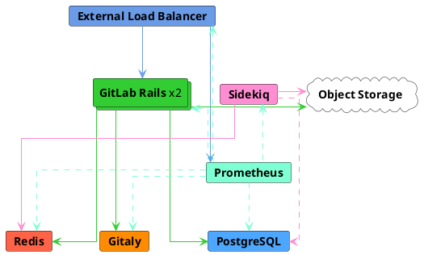
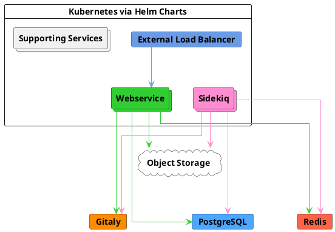



- Tier: 基础版，专业版，旗舰版
- Offering: 私有化部署



本文介绍极狐GitLab 参考架构，该架构旨在应对 40 次请求每秒（RPS）的峰值负载，即基于真实数据得出的多达 2,000 名用户（包括手动和自动化用户）的典型峰值负载。

有关所有参考架构的完整列表，请参阅
[可用参考架构](_index.md#available-reference-architectures)。

- **目标负载**：API：40 RPS，Web：4 RPS，Git（拉取）：4 RPS，Git（推送）：1 RPS
- **高可用性**：否。如需高可用环境，您可以参考修改后的 [3K 或 60 RPS 参考架构](3k_users.md#supported-modifications-for-lower-user-counts-ha)。
- **云原生混合**：[是](#cloud-native-hybrid-reference-architecture-with-helm-charts-alternative)
- **不确定使用哪种参考架构**？[查看此指南了解更多信息](_index.md#deciding-which-architecture-to-start-with)。

| 服务                            | 节点 | 配置          | GCP 示例<sup>1</sup> | AWS 示例<sup>1</sup> | Azure 示例<sup>1</sup> |
|------------------------------------|-------|------------------------|-----------------|--------------|----------|
| 外部负载均衡器<sup>4</sup> | 1     | 4 vCPU, 3.6 GB 内存  | `n1-highcpu-4`  | `c5n.xlarge` | `F4s v2` |
| PostgreSQL<sup>2</sup>             | 1     | 2 vCPU, 7.5 GB 内存  | `n1-standard-2` | `m5.large`   | `D2s v3` |
| Redis<sup>3</sup>                  | 1     | 1 vCPU, 3.75 GB 内存 | `n1-standard-1` | `m5.large`   | `D2s v3` |
| Gitaly<sup>6</sup>                 | 1     | 4 vCPU, 15 GB 内存   | `n1-standard-4` | `m5.xlarge` | `D4s v3` |
| Sidekiq<sup>7</sup>                | 1     | 4 vCPU, 15 GB 内存   | `n1-standard-4` | `m5.xlarge`  | `D4s v3` |
| GitLab Rails<sup>7</sup>           | 2     | 8 vCPU, 7.2 GB 内存  | `n1-highcpu-8`  | `c5.2xlarge` | `F8s v2` |
| 监控节点                    | 1     | 2 vCPU, 1.8 GB 内存  | `n1-highcpu-2`  | `c5.large`   | `F2s v2` |
| 对象存储<sup>5</sup>         | -     | -                      | -               | -            | -        |

**脚注**：

<!-- Disable ordered list rule <https://github.com/DavidAnson/markdownlint/blob/main/doc/Rules.md#md029---ordered-list-item-prefix> -->
<!-- markdownlint-disable MD029 -->
1. 机器类型示例仅用于说明目的。这些类型用于[验证和测试](_index.md#validation-and-test-results)，并非规定性默认值。支持切换到满足所列要求的其他机器类型，包括可用的 ARM 变体。有关更多信息，请参阅[支持的机器类型](_index.md#supported-machine-types)。
2. 可以选择在信誉良好的第三方外部 PaaS PostgreSQL 解决方案上运行。有关更多信息，请参阅[提供您自己的 PostgreSQL 实例](#provide-your-own-postgresql-instance)和[基础设施和服务](_index.md#infrastructure-and-services)。
3. 可以选择在信誉良好的第三方外部 PaaS Redis 解决方案上运行。有关更多信息，请参阅[提供您自己的 Redis 实例](#provide-your-own-redis-instance)和[基础设施和服务](_index.md#infrastructure-and-services)。
4. 建议使用信誉良好的第三方负载均衡器或服务（LB PaaS）运行。规格取决于所选负载均衡器以及网络带宽等其他因素。有关更多信息，请参阅[负载均衡器](_index.md#load-balancers)。
5. 应在信誉良好的云提供商或私有化部署解决方案上运行。有关更多信息，请参阅[配置对象存储](#configure-the-object-storage)。
6. Gitaly 规格基于运行状况良好的普通大小代码仓库。但是，如果您有大型 monorepo（大于几 GB），这可能会显著影响 Git 和 Gitaly 的性能，并且可能需要增加规格。请参阅[大型 monorepo](_index.md#large-monorepos)了解更多信息。
7. 可以放置在自动扩缩组（ASG）中，因为该组件不存储任何[有状态数据](_index.md#autoscaling-of-stateful-nodes)。但是，通常更倾向于[云原生混合设置](#cloud-native-hybrid-reference-architecture-with-helm-charts-alternative)，因为某些组件（如[迁移](#gitlab-rails-post-configuration)和 [Mailroom](../incoming_email.md)）只能在单个节点上运行，这在 Kubernetes 中处理得更好。
<!-- markdownlint-enable MD029 -->

> [!note]
> 对于所有涉及配置实例的 PaaS 解决方案，建议在多个可用区中部署以增强弹性（如果需要）。



<a id="requirements"></a>

## 要求

在继续之前，请查看参考架构的[要求](_index.md#requirements)。

<a id="testing-methodology"></a>

## 测试方法

40 RPS / 2k 用户参考架构旨在满足大多数常见工作流。极狐GitLab 定期针对以下端点吞吐量目标进行冒烟测试和性能测试：

| 端点类型 | 目标吞吐量 |
| ------------- | ----------------- |
| API           | 40 RPS            |
| Web           | 4 RPS             |
| Git（拉取）    | 4 RPS             |
| Git（推送）    | 1 RPS             |

这些目标基于实际客户数据，反映了指定用户数的总环境负载，包括 CI 流水线和其他工作负载。这代表了典型的工作负载构成。有关非典型工作负载模式的指导，请参阅[了解 RPS 构成](../../install/sizing.md#understanding-rps-composition-and-workload-patterns)。

有关我们测试方法的更多信息，请参阅[验证和测试结果](_index.md#validation-and-test-results)部分。

<a id="performance-considerations"></a>

### 性能注意事项

如果您的环境具有以下情况，则可能需要进行额外调整：

- 吞吐量持续高于所列目标
- [大型 monorepo](_index.md#large-monorepos)
- 大量[额外工作负载](_index.md#additional-workloads)

在这些情况下，请参阅[扩展环境](_index.md#scaling-an-environment)了解更多信息。如果您认为这些注意事项可能适用于您，请根据需要联系我们获取额外指导。

<a id="load-balancer-configuration"></a>

### 负载均衡器配置

我们的测试环境使用：

- 用于 Linux 软件包环境的 HAProxy
- 用于云原生混合环境的、具有 Gateway API 或 Ingress 实现的云提供商等价物

<a id="set-up-components"></a>

## 设置组件

要设置极狐GitLab 及其组件以支持多达 40 RPS 或 2,000 名用户：

1. [配置外部负载均衡节点](#configure-the-external-load-balancer)
   以处理极狐GitLab 应用服务节点的负载均衡。
1. [配置 PostgreSQL](#configure-postgresql)，即极狐GitLab 的数据库。
1. [配置 Redis](#configure-redis)，用于存储会话数据、临时缓存信息和后台作业队列。
1. [配置 Gitaly](#configure-gitaly)，用于提供对 Git 代码仓库的访问。
1. [配置 Sidekiq](#configure-sidekiq) 以进行后台作业处理。
1. [配置主 GitLab Rails 应用程序](#configure-gitlab-rails)
   以运行 Puma、Workhorse、GitLab Shell，并处理所有前端请求（包括 UI、API 和基于 HTTP/SSH 的 Git）。
1. [配置 Prometheus](#configure-prometheus) 以监控您的极狐GitLab环境。
1. [配置对象存储](#configure-the-object-storage) 用于共享数据对象。
1. [配置高级搜索](#configure-advanced-search)（可选）以在整个极狐GitLab 实例中实现更快、更高级的代码搜索。

<a id="configure-the-external-load-balancer"></a>

## 配置外部负载均衡器

在多节点极狐GitLab 配置中，您需要一个外部负载均衡器来将流量路由到应用服务器。

使用哪个负载均衡器或其确切配置的具体细节超出了极狐GitLab 文档的范围，但有关一般要求的更多信息，请参阅[负载均衡器](_index.md)。本节将重点介绍为您选择的负载均衡器需要配置的具体内容。

<a id="readiness-checks"></a>

### 就绪检查

确保外部负载均衡器仅将流量路由到具有内置监控端点的正常服务。[就绪检查](../monitoring/health_check.md)都要求在被检查的节点上进行[额外配置](../monitoring/ip_allowlist.md)，否则外部负载均衡器将无法连接。

<a id="ports"></a>

### 端口

要使用的基本端口如下表所示。

| 负载均衡器端口 | 后端端口 | 协议                 |
| ------- | ------------ | ------------------------ |
| 80      | 80           | HTTP (*1*)               |
| 443     | 443          | TCP 或 HTTPS (*1*) (*2*) |
| 22      | 22           | TCP                      |

- (*1*)：[Web 终端](../../ci/environments/_index.md#web-terminals-deprecated)支持要求您的负载均衡器正确处理 WebSocket 连接。使用 HTTP 或 HTTPS 代理时，这意味着您的负载均衡器必须配置为传递 `Connection` 和 `Upgrade` 逐跳请求头。有关更多详细信息，请参阅 [web 终端](../integration/terminal.md)集成指南。
- (*2*)：对端口 443 使用 HTTPS 协议时，您必须向负载均衡器添加 SSL 证书。如果您希望在极狐GitLab 应用服务器上终止 SSL，请改用 TCP 协议。

如果您将 GitLab Pages 与自定义域名支持一起使用，则需要一些额外的端口配置。GitLab Pages 需要一个单独的虚拟 IP 地址。配置 DNS 将 `pages_external_url` 从 `/etc/gitlab/gitlab.rb` 指向新的虚拟 IP 地址。有关更多信息，请参阅 [GitLab Pages 文档](../pages/_index.md)。

| 负载均衡器端口 | 后端端口  | 协议  |
| ------- | ------------- | --------- |
| 80      | 不同 (*1*)  | HTTP      |
| 443     | 不同 (*1*)  | TCP (*2*) |

- (*1*)：GitLab Pages 的后端端口取决于 `gitlab_pages['external_http']` 和 `gitlab_pages['external_https']` 设置。有关更多详细信息，请参阅 [GitLab Pages 文档](../pages/_index.md)。
- (*2*)：GitLab Pages 的端口 443 应始终使用 TCP 协议。用户可以配置带有自定义 SSL 的自定义域名，如果 SSL 在负载均衡器处终止，则无法实现这一点。

<a id="alternate-ssh-port"></a>

#### 备用 SSH 端口

一些组织有禁止开放 SSH 端口 22 的策略。在这种情况下，配置一个允许用户在端口 443 上使用 SSH 的备用 SSH 主机名可能会有所帮助。与前面记录的其它极狐GitLab HTTP 配置相比，备用 SSH 主机名将需要一个新的虚拟 IP 地址。

为备用 SSH 主机名（例如 `altssh.gitlab.example.com`）配置 DNS。

| 负载均衡器端口 | 后端端口 | 协议 |
| ------- | ------------ | -------- |
| 443     | 22           | TCP      |

<a id="ssl"></a>

### SSL

下一个问题是如何在您的环境中处理 SSL。有几种不同的选项：

- [应用节点终止 SSL](#application-node-terminates-ssl)。
- [负载均衡器终止 SSL 而不启用后端 SSL](#load-balancer-terminates-ssl-without-backend-ssl)，负载均衡器与应用节点之间的通信不安全。
- [负载均衡器终止 SSL 并启用后端 SSL](#load-balancer-terminates-ssl-with-backend-ssl)，负载均衡器与应用节点之间的通信是安全的。

<a id="application-node-terminates-ssl"></a>

#### 应用节点终止 SSL

将您的负载均衡器配置为将端口 443 上的连接作为 `TCP` 协议而不是 `HTTP(S)` 协议传递。这将把连接原封不动地传递到应用节点的 NGINX 服务。NGINX 将拥有 SSL 证书并监听端口 443。

有关管理 SSL 证书和配置 NGINX 的详细信息，请参阅 [HTTPS 文档](https://gitlab.cn/docs/omnibus/settings/ssl/)。

<a id="load-balancer-terminates-ssl-without-backend-ssl"></a>

#### 负载均衡器终止 SSL 而不启用后端 SSL

将您的负载均衡器配置为使用 `HTTP(S)` 协议而不是 `TCP`。然后，负载均衡器将负责管理 SSL 证书并终止 SSL。

由于负载均衡器和极狐GitLab 之间的通信将不安全，因此需要进行一些额外的配置。有关详细信息，请参阅[代理 SSL 文档](https://gitlab.cn/docs/omnibus/settings/ssl/#configure-a-reverse-proxy-or-load-balancer-ssl-termination)。

<a id="load-balancer-terminates-ssl-with-backend-ssl"></a>

#### 负载均衡器终止 SSL 并启用后端 SSL

将您的负载均衡器配置为使用 `HTTP(S)` 协议而不是 `TCP`。负载均衡器将负责管理最终用户将看到的 SSL 证书。

在这种情况下，负载均衡器和 NGINX 之间的流量也是安全的。由于连接全程安全，因此无需为代理 SSL 添加配置。但是，必须向极狐GitLab 添加配置以配置 SSL 证书。有关管理 SSL 证书和配置 NGINX 的详细信息，请参阅 [HTTPS 文档](https://gitlab.cn/docs/omnibus/settings/ssl/)。

<div align="right">
  <a type="button" class="btn btn-default" href="#set-up-components">
    返回组件设置 <i class="fa fa-angle-double-up" aria-hidden="true"></i>
  </a>
</div>

<a id="configure-postgresql"></a>

## 配置 PostgreSQL

在本节中，将指导您配置一个用于极狐GitLab 的外部 PostgreSQL 数据库。

<a id="provide-your-own-postgresql-instance"></a>

### 提供您自己的 PostgreSQL 实例

您可以使用[第三方外部 PostgreSQL 服务](../postgresql/external.md)，而不是使用 Linux 软件包捆绑的 PostgreSQL、PgBouncer 和 Consul 服务发现组件。

请使用运行[受支持的 PostgreSQL 版本](../../install/requirements.md#postgresql)的信誉良好的提供商。这些服务已知运行良好：

- [Google Cloud SQL](https://cloud.google.com/sql/docs/postgres/high-availability#normal)。
- [Amazon RDS](https://aws.amazon.com/rds/)。

有关更多信息，包括高可用性和数据库负载均衡的指导，请参阅：

- [基础设施和服务](_index.md#infrastructure-and-services)。
- [数据库服务最佳实践](_index.md#best-practices-for-the-database-services)。

如果您使用第三方外部服务：

1. 根据[数据库要求文档](../../install/requirements.md#postgresql)设置 PostgreSQL。
1. 配置所需的[用户和数据库](../postgresql/external.md)。
1. 按照[配置 GitLab Rails](#configure-gitlab-rails) 中的说明，使用适当的连接详细信息配置极狐GitLab 应用服务器。

<a id="standalone-postgresql-using-the-linux-package"></a>

### 使用 Linux 软件包的独立 PostgreSQL

1. SSH 登录到 PostgreSQL 服务器。
1. [下载并安装](../../install/package/_index.md#supported-platforms)您选择的 Linux 软件包。请务必仅为您的操作系统添加极狐GitLab 软件包仓库并安装极狐GitLab。
1. 为 PostgreSQL 生成密码哈希。这假设您将使用默认用户名 `gitlab`（推荐）。该命令将要求输入密码并确认。在下一步中使用此命令输出的值作为 `POSTGRESQL_PASSWORD_HASH` 的值。

   ```shell
   sudo gitlab-ctl pg-password-md5 gitlab
   ```

1. 编辑 `/etc/gitlab/gitlab.rb` 并添加以下内容，适当更新占位符值。

   - `POSTGRESQL_PASSWORD_HASH` - 上一步输出的值
   - `APPLICATION_SERVER_IP_BLOCKS` - 将连接到数据库的 GitLab Rails 和 Sidekiq 服务器的 IP 子网或 IP 地址的空格分隔列表。示例：`%w(123.123.123.123/32 123.123.123.234/32)`

   ```ruby
   # Disable all components except PostgreSQL related ones
   roles(['postgres_role'])

   # Set the network addresses that the exporters used for monitoring will listen on
   node_exporter['listen_address'] = '0.0.0.0:9100'
   postgres_exporter['listen_address'] = '0.0.0.0:9187'
   postgres_exporter['dbname'] = 'gitlabhq_production'
   postgres_exporter['password'] = 'POSTGRESQL_PASSWORD_HASH'

   # Set the PostgreSQL address and port
   postgresql['listen_address'] = '0.0.0.0'
   postgresql['port'] = 5432

   # Replace POSTGRESQL_PASSWORD_HASH with a generated md5 value
   postgresql['sql_user_password'] = 'POSTGRESQL_PASSWORD_HASH'

   # Replace APPLICATION_SERVER_IP_BLOCK with the CIDR address of the application node
   postgresql['trust_auth_cidr_addresses'] = %w(127.0.0.1/32 APPLICATION_SERVER_IP_BLOCK)

   # Prevent database migrations from running on upgrade automatically
   gitlab_rails['auto_migrate'] = false
   ```

1. 从您配置的第一个 Linux 软件包节点复制 `/etc/gitlab/gitlab-secrets.json` 文件，并在此服务器上添加或替换同名文件。如果这是您配置的第一个 Linux 软件包，则可以跳过此步骤。
1. [重新配置极狐GitLab](../restart_gitlab.md#reconfigure-a-linux-package-installation) 以使更改生效。
1. 记下 PostgreSQL 节点的 IP 地址或主机名、端口和明文密码。稍后配置 [极狐GitLab 应用服务器](#configure-gitlab-rails) 时需要这些详细信息。

支持高级[配置选项](https://gitlab.cn/docs/omnibus/settings/database/)，如有需要可以添加。

<div align="right">
  <a type="button" class="btn btn-default" href="#set-up-components">
    返回组件设置 <i class="fa fa-angle-double-up" aria-hidden="true"></i>
  </a>
</div>

<a id="configure-redis"></a>

## 配置 Redis

在本节中，将指导您配置一个用于极狐GitLab 的外部 Redis 实例。

> [!note]
> Redis 主要是单线程的，增加 CPU 核心数不会带来显著收益。有关更多信息，请参阅[扩展文档](_index.md#scaling-an-environment)。

<a id="provide-your-own-redis-instance"></a>

### 提供您自己的 Redis 实例

您可以选择使用[第三方外部 Redis 实例服务](../redis/replication_and_failover_external.md#redis-as-a-managed-service-in-a-cloud-provider)，并遵循以下指导：

- 应为此使用信誉良好的提供商或解决方案。[Google Memorystore](https://docs.cloud.google.com/memorystore/docs/redis/memorystore-for-redis-overview) 和 [AWS ElastiCache](https://docs.aws.amazon.com/AmazonElastiCache/latest/dg/WhatIs.html) 已知可以正常工作。
- 特别不支持 Redis Cluster 模式，但支持带 HA 的 Redis Standalone。
- 您必须根据您的设置设置 [Redis 逐出模式](../redis/replication_and_failover_external.md#setting-the-eviction-policy)。

有关更多信息，请参阅[基础设施和服务](_index.md#infrastructure-and-services)。

<a id="standalone-redis-using-the-linux-package"></a>

### 使用 Linux 软件包的独立 Redis

Linux 软件包可用于配置独立的 Redis 服务器。以下步骤是使用 Linux 软件包配置 Redis 服务器的最低要求：

1. SSH 登录到 Redis 服务器。
1. [下载并安装](../../install/package/_index.md#supported-platforms)您选择的 Linux 软件包。请务必仅为您的操作系统添加极狐GitLab 软件包仓库并安装极狐GitLab。
1. 编辑 `/etc/gitlab/gitlab.rb` 并添加以下内容：

   ```ruby
   ## Enable Redis
   roles(["redis_master_role"])

   redis['bind'] = '0.0.0.0'
   redis['port'] = 6379
   redis['password'] = 'SECRET_PASSWORD_HERE'

   # Set the network addresses that the exporters used for monitoring will listen on
   node_exporter['listen_address'] = '0.0.0.0:9100'
   redis_exporter['listen_address'] = '0.0.0.0:9121'

   # Prevent database migrations from running on upgrade automatically
   gitlab_rails['auto_migrate'] = false
   ```

1. 从您配置的第一个 Linux 软件包节点复制 `/etc/gitlab/gitlab-secrets.json` 文件，并在此服务器上添加或替换同名文件。如果这是您配置的第一个 Linux 软件包节点，则可以跳过此步骤。
1. [重新配置极狐GitLab](../restart_gitlab.md#reconfigure-a-linux-package-installation) 以使更改生效。
1. 记下 Redis 节点的 IP 地址或主机名、端口和 Redis 密码。稍后[配置极狐GitLab 应用服务器](#configure-gitlab-rails)时需要这些信息。

支持高级[配置选项](https://gitlab.cn/docs/omnibus/settings/redis/)，如有需要可以添加。

<div align="right">
  <a type="button" class="btn btn-default" href="#set-up-components">
    返回组件设置 <i class="fa fa-angle-double-up" aria-hidden="true"></i>
  </a>
</div>

<a id="configure-gitaly"></a>

## 配置 Gitaly

[Gitaly](../gitaly/_index.md) 服务器节点要求取决于数据大小，特别是项目数量及这些项目的大小。

> [!warning]
> Gitaly 规格基于高百分位的使用模式和运行状况良好的代码仓库大小。但是，如果您有[大型 monorepo](_index.md#large-monorepos)（大于几 GB）或[额外工作负载](_index.md#additional-workloads)，这些可能会显著影响环境性能，可能需要进行进一步调整。如果您认为这适用于您，请根据需要联系我们获取额外指导。

Gitaly 对 Gitaly 存储有特定的[磁盘要求](../gitaly/_index.md#disk-requirements)。

请务必注意以下事项：

- GitLab Rails 应用程序将代码仓库分片到[代码仓库存储路径](../repository_storage_paths.md)。
- 一个 Gitaly 服务器可以托管一个或多个存储路径。
- 一个极狐GitLab 服务器可以使用一个或多个 Gitaly 服务器节点。
- 必须指定 Gitaly 地址，以便所有 Gitaly 客户端都能正确解析。
- Gitaly 服务器不得暴露到公共互联网，因为 Gitaly 上的网络流量默认未加密。强烈建议使用防火墙来限制对 Gitaly 服务器的访问。另一种选择是[使用 TLS](#gitaly-tls-support)。

> [!note]
> Gitaly 文档中提到的令牌是管理员选择的任意密码。此令牌与为极狐GitLab API 或其他类似 Web API 创建的令牌无关。

以下过程描述如何配置一个名为 `gitaly1.internal` 的 Gitaly 服务器，使用密钥令牌 `gitalysecret`。我们假设您的极狐GitLab 安装有两个代码仓库存储：`default` 和 `storage1`。

要配置 Gitaly 服务器，请在您要用于 Gitaly 的服务器节点上：

1. [下载并安装](../../install/package/_index.md#supported-platforms)您选择的 Linux 软件包。请务必仅为您的操作系统添加极狐GitLab 软件包仓库并安装极狐GitLab，但不要提供 `EXTERNAL_URL` 值。
1. 编辑 Gitaly 服务器节点的 `/etc/gitlab/gitlab.rb` 文件以配置存储路径、启用网络监听器并配置令牌：

   > [!note]
   > 您不能从 `gitaly['configuration'][:storage]` 中删除 `default` 条目，因为[极狐GitLab 要求它](../gitaly/configure_gitaly.md#gitlab-requires-a-default-repository-storage)。

   <!--
   Updates to example must be made at:

   - <https://gitlab.com/gitlab-org/charts/gitlab/blob/master/doc/advanced/external-gitaly/external-omnibus-gitaly.md#configure-linux-package-installation>
   - <https://gitlab.com/gitlab-org/gitlab/-/blob/master/doc/administration/gitaly/configure_gitaly.md#configure-gitaly-server>
   - All reference architecture pages
   -->

   ```ruby
   # https://docs.gitlab.com/omnibus/roles/#gitaly-roles
   roles(["gitaly_role"])

   # Prevent database migrations from running on upgrade automatically
   gitlab_rails['auto_migrate'] = false

   # Configure the gitlab-shell API callback URL. Without this, `git push` will
   # fail. This can be your 'front door' GitLab URL or an internal load
   # balancer.
   gitlab_rails['internal_api_url'] = 'https://gitlab.example.com'

   # Set the network addresses that the exporters used for monitoring will listen on
   node_exporter['listen_address'] = '0.0.0.0:9100'

   gitaly['configuration'] = {
      # ...
      #
      # Make Gitaly accept connections on all network interfaces. You must use
      # firewalls to restrict access to this address/port.
      # Comment out following line if you only want to support TLS connections
      listen_addr: '0.0.0.0:8075',
      prometheus_listen_addr: '0.0.0.0:9236',
      # Gitaly Auth Token
      # Should be the same as praefect_internal_token
      auth: {
         # ...
         #
         # Gitaly's authentication token is used to authenticate gRPC requests to Gitaly. This must match
         # the respective value in GitLab Rails application setup.
         token: 'gitalysecret',
      },
      # Gitaly Pack-objects cache
      # Recommended to be enabled for improved performance but can notably increase disk I/O
      # Refer to https://docs.gitlab.com/administration/gitaly/configure_gitaly/#pack-objects-cache for more info
      pack_objects_cache: {
         # ...
         enabled: true,
      },
      storage: [
         {
            name: 'default',
            path: '/var/opt/gitlab/git-data/repositories',
         },
         {
            name: 'storage1',
            path: '/mnt/gitlab/git-data',
         },
      ],
   }
   ```

1. 从您配置的第一个 Linux 软件包节点复制 `/etc/gitlab/gitlab-secrets.json` 文件，并在此服务器上添加或替换同名文件。如果这是您配置的第一个 Linux 软件包节点，则可以跳过此步骤。
1. [重新配置极狐GitLab](../restart_gitlab.md#reconfigure-a-linux-package-installation) 以使更改生效。
1. 通过运行 `sudo -u git -- /opt/gitlab/embedded/bin/gitaly check /var/opt/gitlab/gitaly/config.toml` 确认 Gitaly 可以执行对内部 API 的回调。

<a id="gitaly-tls-support"></a>

### Gitaly TLS 支持

Gitaly 支持 TLS 加密。要与监听安全连接的 Gitaly 实例通信，您必须在极狐GitLab 配置中相应存储条目的 `gitaly_address` 中使用 `tls://` URL 方案。

您必须自带证书，因为不会自动提供。证书或其证书颁发机构必须按照 [极狐GitLab 自定义证书配置](https://gitlab.cn/docs/omnibus/settings/ssl/#install-custom-public-certificates) 中描述的过程安装在所有 Gitaly 节点（包括使用该证书的 Gitaly 节点）以及所有与之通信的客户端节点上。

> [!note]
> 自签名证书必须指定您用来访问 Gitaly 服务器的地址。如果您通过主机名访问 Gitaly 服务器，请将其添加为主题备用名称。如果您通过 IP 地址访问 Gitaly 服务器，则必须将其添加为证书的主题备用名称。

可以同时为 Gitaly 服务器配置未加密的监听地址（`listen_addr`）和加密的监听地址（`tls_listen_addr`）。这允许您在必要时从未加密流量逐步过渡到加密流量。

要使用 TLS 配置 Gitaly：

1. 创建 `/etc/gitlab/ssl` 目录并将您的密钥和证书复制到那里：

   ```shell
   sudo mkdir -p /etc/gitlab/ssl
   sudo chmod 755 /etc/gitlab/ssl
   sudo cp key.pem cert.pem /etc/gitlab/ssl/
   sudo chmod 644 key.pem cert.pem
   ```

1. 将证书复制到 `/etc/gitlab/trusted-certs`，以便 Gitaly 在调用自身时信任该证书：

   ```shell
   sudo cp /etc/gitlab/ssl/cert.pem /etc/gitlab/trusted-certs/
   ```

1. 编辑 `/etc/gitlab/gitlab.rb` 并添加：

   <!-- Updates to following example must also be made at <https://gitlab.com/gitlab-org/charts/gitlab/blob/master/doc/advanced/external-gitaly/external-omnibus-gitaly.md#configure-omnibus-gitlab> -->

   ```ruby
   gitaly['configuration'] = {
      # ...
      tls_listen_addr: '0.0.0.0:9999',
      tls: {
         certificate_path: '/etc/gitlab/ssl/cert.pem',
         key_path: '/etc/gitlab/ssl/key.pem',
      },
   }
   ```

1. 删除 `gitaly['listen_addr']` 以仅允许加密连接。
1. 保存文件并[重新配置极狐GitLab](../restart_gitlab.md#reconfigure-a-linux-package-installation)。

<div align="right">
  <a type="button" class="btn btn-default" href="#set-up-components">
    返回组件设置 <i class="fa fa-angle-double-up" aria-hidden="true"></i>
  </a>
</div>

<a id="configure-sidekiq"></a>

## 配置 Sidekiq

Sidekiq 需要连接到 [Redis](#configure-redis)、[PostgreSQL](#configure-postgresql) 和 [Gitaly](#configure-gitaly) 实例。按照建议，它还需要连接到[对象存储](#configure-the-object-storage)。

如果您发现环境的 Sidekiq 作业处理缓慢且队列较长，您可以相应地对其进行扩展。有关更多信息，请参阅[扩展文档](_index.md#scaling-an-environment)。

配置其他极狐GitLab 功能（如容器镜像仓库、SAML 或 LDAP）时，除了 Rails 配置外，还要更新 Sidekiq 配置。有关更多信息，请参阅[外部 Sidekiq 文档](../sidekiq/_index.md)。

要配置 Sidekiq 服务器，请在您要用于 Sidekiq 的服务器节点上：

1. SSH 登录到 Sidekiq 服务器。
1. 确认您可以访问 PostgreSQL、Gitaly 和 Redis 端口：

   ```shell
   telnet <GitLab host> 5432 # PostgreSQL
   telnet <GitLab host> 8075 # Gitaly
   telnet <GitLab host> 6379 # Redis
   ```

1. [下载并安装](../../install/package/_index.md#supported-platforms)您选择的 Linux 软件包。请务必仅为您的操作系统添加极狐GitLab 软件包仓库并安装极狐GitLab。
1. 创建或编辑 `/etc/gitlab/gitlab.rb` 并使用以下配置：

   ```ruby
   # https://docs.gitlab.com/omnibus/roles/#sidekiq-roles
   roles(["sidekiq_role"])

   # External URL
   external_url 'https://gitlab.example.com'

   ## Redis connection details
   gitlab_rails['redis_port'] = '6379'
   gitlab_rails['redis_host'] = '10.1.0.6' # IP/hostname of Redis server
   gitlab_rails['redis_password'] = 'Redis Password'

   # Gitaly and GitLab use two shared secrets for authentication, one to authenticate gRPC requests
   # to Gitaly, and a second stored in /etc/gitlab/gitlab-secrets.json for authentication callbacks from GitLab-Shell to the GitLab internal API.
   # The following must be the same as their respective values
   # of the Gitaly setup
   gitlab_rails['gitaly_token'] = 'gitalysecret'

   gitlab_rails['repositories_storages'] = {
     'default' => { 'gitaly_address' => 'tcp://gitaly1.internal:8075' },
     'storage1' => { 'gitaly_address' => 'tcp://gitaly1.internal:8075' },
     'storage2' => { 'gitaly_address' => 'tcp://gitaly2.internal:8075' },
   }

   ## PostgreSQL connection details
   gitlab_rails['db_adapter'] = 'postgresql'
   gitlab_rails['db_encoding'] = 'unicode'
   gitlab_rails['db_host'] = '10.1.0.5' # IP/hostname of database server
   gitlab_rails['db_password'] = 'DB password'

   ## Prevent database migrations from running on upgrade automatically
   gitlab_rails['auto_migrate'] = false

   # Sidekiq
   sidekiq['listen_address'] = "0.0.0.0"

   ## Set number of Sidekiq queue processes to the same number as available CPUs
   sidekiq['queue_groups'] = ['*'] * 4

   ## Set the network addresses that the exporters will listen on
   node_exporter['listen_address'] = '0.0.0.0:9100'

   # Object Storage
   ## This is an example for configuring Object Storage on GCP
   ## Replace this config with your chosen Object Storage provider as desired
   gitlab_rails['object_store']['enabled'] = true
   gitlab_rails['object_store']['connection'] = {
     'provider' => 'Google',
     'google_project' => '<gcp-project-name>',
     'google_json_key_location' => '<path-to-gcp-service-account-key>'
   }
   gitlab_rails['object_store']['objects']['artifacts']['bucket'] = "<gcp-artifacts-bucket-name>"
   gitlab_rails['object_store']['objects']['external_diffs']['bucket'] = "<gcp-external-diffs-bucket-name>"
   gitlab_rails['object_store']['objects']['lfs']['bucket'] = "<gcp-lfs-bucket-name>"
   gitlab_rails['object_store']['objects']['uploads']['bucket'] = "<gcp-uploads-bucket-name>"
   gitlab_rails['object_store']['objects']['packages']['bucket'] = "<gcp-packages-bucket-name>"
   gitlab_rails['object_store']['objects']['dependency_proxy']['bucket'] = "<gcp-dependency-proxy-bucket-name>"
   gitlab_rails['object_store']['objects']['terraform_state']['bucket'] = "<gcp-terraform-state-bucket-name>"

   gitlab_rails['backup_upload_connection'] = {
     'provider' => 'Google',
     'google_project' => '<gcp-project-name>',
     'google_json_key_location' => '<path-to-gcp-service-account-key>'
   }
   gitlab_rails['backup_upload_remote_directory'] = "<gcp-backups-state-bucket-name>"
   gitlab_rails['ci_secure_files_object_store_enabled'] = true
   gitlab_rails['ci_secure_files_object_store_remote_directory'] = "<gcp-ci_secure_files-bucket-name>"

   gitlab_rails['ci_secure_files_object_store_connection'] = {
      'provider' => 'Google',
      'google_project' => '<gcp-project-name>',
      'google_json_key_location' => '<path-to-gcp-service-account-key>'
   }
   ```

1. 从您配置的第一个 Linux 软件包节点复制 `/etc/gitlab/gitlab-secrets.json` 文件，并在此服务器上添加或替换同名文件。如果这是您配置的第一个 Linux 软件包节点，则可以跳过此步骤。
1. 为确保数据库迁移仅在重新配置期间运行，而不会在升级时自动运行，请执行：

   ```shell
   sudo touch /etc/gitlab/skip-auto-reconfigure
   ```

   只有单个指定节点应处理迁移，如 [GitLab Rails 后配置](#gitlab-rails-post-configuration) 部分所述。
1. 保存文件并[重新配置极狐GitLab](../restart_gitlab.md#reconfigure-a-linux-package-installation)。
1. 验证极狐GitLab 服务正在运行：

   ```shell
   sudo gitlab-ctl status
   ```

   输出应类似于以下内容：

   ```plaintext
   run: logrotate: (pid 192292) 2990s; run: log: (pid 26374) 93048s
   run: node-exporter: (pid 26864) 92997s; run: log: (pid 26446) 93036s
   run: sidekiq: (pid 26870) 92996s; run: log: (pid 26391) 93042s
   ```

<div align="right">
  <a type="button" class="btn btn-default" href="#set-up-components">
    返回组件设置 <i class="fa fa-angle-double-up" aria-hidden="true"></i>
  </a>
</div>

<a id="configure-gitlab-rails"></a>

## 配置 GitLab Rails

本节介绍如何配置极狐GitLab 应用程序（Rails）组件。

在我们的架构中，我们使用 Puma Web 服务器运行每个 GitLab Rails 节点，并将其工作进程数设置为可用 CPU 的 90%，每个工作进程四个线程。对于与其他组件一起运行 Rails 的节点，应相应减少工作进程数。我们确定 50% 的工作进程值可以实现良好的平衡，但这取决于工作负载。

在每个节点上执行以下操作：

1. [下载并安装](../../install/package/_index.md#supported-platforms)您选择的 Linux 软件包。请务必仅为您的操作系统添加极狐GitLab 软件包仓库并安装极狐GitLab。
1. 创建或编辑 `/etc/gitlab/gitlab.rb` 并使用以下配置。为保持各节点间链接的一致性，应用服务器上的 `external_url` 应指向用户访问极狐GitLab 时将使用的外部 URL。这将是[负载均衡器](#configure-the-external-load-balancer)的 URL，它将流量路由到极狐GitLab 应用服务器：

   ```ruby
   external_url 'https://gitlab.example.com'

   # Gitaly and GitLab use two shared secrets for authentication, one to authenticate gRPC requests
   # to Gitaly, and a second stored in /etc/gitlab/gitlab-secrets.json for authentication callbacks from GitLab-Shell to the GitLab internal API.
   # The following must be the same as their respective values
   # of the Gitaly setup
   gitlab_rails['gitaly_token'] = 'gitalysecret'

   gitlab_rails['repositories_storages'] = {
     'default' => { 'gitaly_address' => 'tcp://gitaly1.internal:8075' },
     'storage1' => { 'gitaly_address' => 'tcp://gitaly1.internal:8075' },
     'storage2' => { 'gitaly_address' => 'tcp://gitaly2.internal:8075' },
   }

   ## Disable components that will not be on the GitLab application server
   roles(['application_role'])
   gitaly['enable'] = false
   sidekiq['enable'] = false

   ## PostgreSQL connection details
   gitlab_rails['db_adapter'] = 'postgresql'
   gitlab_rails['db_encoding'] = 'unicode'
   gitlab_rails['db_host'] = '10.1.0.5' # IP/hostname of database server
   gitlab_rails['db_password'] = 'DB password'

   ## Redis connection details
   gitlab_rails['redis_port'] = '6379'
   gitlab_rails['redis_host'] = '10.1.0.6' # IP/hostname of Redis server
   gitlab_rails['redis_password'] = 'Redis Password'

   # Set the network addresses that the exporters used for monitoring will listen on
   node_exporter['listen_address'] = '0.0.0.0:9100'
   gitlab_workhorse['prometheus_listen_addr'] = '0.0.0.0:9229'
   puma['listen'] = '0.0.0.0'

   # Add the monitoring node's IP address to the monitoring whitelist and allow it to
   # scrape the NGINX metrics. Replace placeholder `monitoring.gitlab.example.com` with
   # the address and/or subnets gathered from the monitoring node
   gitlab_rails['monitoring_whitelist'] = ['<MONITOR NODE IP>/32', '127.0.0.0/8']
   nginx['status']['options']['allow'] = ['<MONITOR NODE IP>/32', '127.0.0.0/8']

   # Object Storage
   # This is an example for configuring Object Storage on GCP
   # Replace this config with your chosen Object Storage provider as desired
   gitlab_rails['object_store']['enabled'] = true
   gitlab_rails['object_store']['connection'] = {
     'provider' => 'Google',
     'google_project' => '<gcp-project-name>',
     'google_json_key_location' => '<path-to-gcp-service-account-key>'
   }
   gitlab_rails['object_store']['objects']['artifacts']['bucket'] = "<gcp-artifacts-bucket-name>"
   gitlab_rails['object_store']['objects']['external_diffs']['bucket'] = "<gcp-external-diffs-bucket-name>"
   gitlab_rails['object_store']['objects']['lfs']['bucket'] = "<gcp-lfs-bucket-name>"
   gitlab_rails['object_store']['objects']['uploads']['bucket'] = "<gcp-uploads-bucket-name>"
   gitlab_rails['object_store']['objects']['packages']['bucket'] = "<gcp-packages-bucket-name>"
   gitlab_rails['object_store']['objects']['dependency_proxy']['bucket'] = "<gcp-dependency-proxy-bucket-name>"
   gitlab_rails['object_store']['objects']['terraform_state']['bucket'] = "<gcp-terraform-state-bucket-name>"

   gitlab_rails['backup_upload_connection'] = {
     'provider' => 'Google',
     'google_project' => '<gcp-project-name>',
     'google_json_key_location' => '<path-to-gcp-service-account-key>'
   }
   gitlab_rails['backup_upload_remote_directory'] = "<gcp-backups-state-bucket-name>"

   gitlab_rails['ci_secure_files_object_store_enabled'] = true
   gitlab_rails['ci_secure_files_object_store_remote_directory'] = "<gcp-ci_secure_files-bucket-name>"

   gitlab_rails['ci_secure_files_object_store_connection'] = {
      'provider' => 'Google',
      'google_project' => '<gcp-project-name>',
      'google_json_key_location' => '<path-to-gcp-service-account-key>'
   }

   ## Uncomment and edit the following options if you have set up NFS
   ##
   ## Prevent GitLab from starting if NFS data mounts are not available
   ##
   #high_availability['mountpoint'] = '/var/opt/gitlab/git-data'
   ##
   ## Ensure UIDs and GIDs match between servers for permissions via NFS
   ##
   #user['uid'] = 9000
   #user['gid'] = 9000
   #web_server['uid'] = 9001
   #web_server['gid'] = 9001
   #registry['uid'] = 9002
   #registry['gid'] = 9002
   ```

1. 如果您使用[支持 TLS 的 Gitaly](#gitaly-tls-support)，请确保 `gitlab_rails['repositories_storages']` 条目配置为使用 `tls` 而不是 `tcp`：

   ```ruby
   gitlab_rails['repositories_storages'] = {
     'default' => { 'gitaly_address' => 'tls://gitaly1.internal:9999' },
     'storage1' => { 'gitaly_address' => 'tls://gitaly1.internal:9999' },
     'storage2' => { 'gitaly_address' => 'tls://gitaly2.internal:9999' },
   }
   ```

   1. 将证书复制到 `/etc/gitlab/trusted-certs`：

      ```shell
      sudo cp cert.pem /etc/gitlab/trusted-certs/
      ```

1. 从您配置的第一个 Linux 软件包节点复制 `/etc/gitlab/gitlab-secrets.json` 文件，并在此服务器上添加或替换同名文件。如果这是您配置的第一个 Linux 软件包节点，则可以跳过此步骤。
1. 从您配置的第一个 Rails 节点复制 SSH 主机密钥（所有名称格式为 `/etc/ssh/ssh_host_*_key*` 的文件），并在此服务器上添加或替换同名文件。这可以确保您的用户在访问负载均衡的 Rails 节点时不会收到主机不匹配错误。如果这是您配置的第一个 Linux 软件包节点，则可以跳过此步骤。
1. 为确保数据库迁移仅在重新配置期间运行，而不会在升级时自动运行，请执行：

   ```shell
   sudo touch /etc/gitlab/skip-auto-reconfigure
   ```

   只有单个指定节点应处理迁移，如 [GitLab Rails 后配置](#gitlab-rails-post-configuration) 部分所述。
1. [重新配置极狐GitLab](../restart_gitlab.md#reconfigure-a-linux-package-installation) 以使更改生效。
1. [启用增量日志](#enable-incremental-logging)。
1. 运行 `sudo gitlab-rake gitlab:gitaly:check` 以确认节点可以连接到 Gitaly。
1. 跟踪日志以查看请求：

   ```shell
   sudo gitlab-ctl tail gitaly
   ```

当您在前面的示例中于 `external_url` 中指定 `https` 时，极狐GitLab 期望 SSL 证书位于 `/etc/gitlab/ssl/`。如果证书不存在，NGINX 将无法启动。有关更多信息，请参阅 [HTTPS 文档](https://gitlab.cn/docs/omnibus/settings/ssl/)。

<a id="gitlab-rails-post-configuration"></a>

### GitLab Rails 后配置

1. 指定一个应用节点在安装和更新期间运行数据库迁移。初始化极狐GitLab 数据库并确保所有迁移都已运行：

   ```shell
   sudo gitlab-rake gitlab:db:configure
   ```

   此操作需要将 Rails 节点配置为直接连接到主数据库，[绕过 PgBouncer](../postgresql/pgbouncer.md#procedure-for-bypassing-pgbouncer)。迁移完成后，您必须将节点配置为再次通过 PgBouncer。
1. [配置数据库中授权 SSH 密钥的快速查找](../operations/fast_ssh_key_lookup.md)。

<div align="right">
  <a type="button" class="btn btn-default" href="#set-up-components">
    返回组件设置 <i class="fa fa-angle-double-up" aria-hidden="true"></i>
  </a>
</div>

<a id="configure-prometheus"></a>

## 配置 Prometheus

Linux 软件包可用于配置运行 [Prometheus](../monitoring/prometheus/_index.md) 的独立监控节点：

1. SSH 登录到监控节点。
1. [下载并安装](../../install/package/_index.md#supported-platforms)您选择的 Linux 软件包。请务必仅为您的操作系统添加极狐GitLab 软件包仓库并安装极狐GitLab。
1. 编辑 `/etc/gitlab/gitlab.rb` 并添加以下内容：

   ```ruby
   roles(['monitoring_role'])
   nginx['enable'] = false

   external_url 'http://gitlab.example.com'

   # Prometheus
   prometheus['listen_address'] = '0.0.0.0:9090'
   prometheus['monitor_kubernetes'] = false
   ```

1. Prometheus 还需要一些抓取配置来从我们配置了导出器的各个节点拉取所有数据。假设您节点的 IP 为：

   ```plaintext
   1.1.1.1: postgres
   1.1.1.2: redis
   1.1.1.3: gitaly1
   1.1.1.4: rails1
   1.1.1.5: rails2
   1.1.1.6: sidekiq
   ```

   将以下内容添加到 `/etc/gitlab/gitlab.rb`：

   ```ruby
   prometheus['scrape_configs'] = [
     {
        'job_name': 'postgres',
        'static_configs' => [
        'targets' => ['1.1.1.1:9187'],
        ],
     },
     {
        'job_name': 'redis',
        'static_configs' => [
        'targets' => ['1.1.1.2:9121'],
        ],
     },
     {
        'job_name': 'gitaly',
        'static_configs' => [
        'targets' => ['1.1.1.3:9236'],
        ],
     },
     {
        'job_name': 'gitlab-nginx',
        'static_configs' => [
        'targets' => ['1.1.1.4:8060', '1.1.1.5:8060'],
        ],
     },
     {
        'job_name': 'gitlab-workhorse',
        'static_configs' => [
        'targets' => ['1.1.1.4:9229', '1.1.1.5:9229'],
        ],
     },
     {
        'job_name': 'gitlab-rails',
        'metrics_path': '/-/metrics',
        'static_configs' => [
        'targets' => ['1.1.1.4:8080', '1.1.1.5:8080'],
        ],
     },
     {
        'job_name': 'gitlab-sidekiq',
        'static_configs' => [
        'targets' => ['1.1.1.6:8082'],
        ],
     },
     {
        'job_name': 'static-node',
        'static_configs' => [
        'targets' => ['1.1.1.1:9100', '1.1.1.2:9100', '1.1.1.3:9100', '1.1.1.4:9100', '1.1.1.5:9100', '1.1.1.6:9100'],
        ],
     },
   ]
   ```

1. 保存文件并[重新配置极狐GitLab](../restart_gitlab.md#reconfigure-a-linux-package-installation)。

<div align="right">
  <a type="button" class="btn btn-default" href="#set-up-components">
    返回组件设置 <i class="fa fa-angle-double-up" aria-hidden="true"></i>
  </a>
</div>

<a id="configure-the-object-storage"></a>

## 配置对象存储

极狐GitLab 支持使用[对象存储](../object_storage.md)服务来保存多种类型的数据。对于数据对象，建议使用对象存储而不是 [NFS](../nfs.md)，并且在较大的设置中通常更好，因为对象存储通常性能更高、更可靠且可扩展性更强。有关更多信息，请参阅[基础设施和服务](_index.md#infrastructure-and-services)。

在极狐GitLab 中指定对象存储配置有两种方式：

- [统一形式](../object_storage.md#configure-a-single-storage-connection-for-all-object-types-consolidated-form)：所有受支持的对象类型共享一个凭据。
- [特定存储形式](../object_storage.md#configure-each-object-type-to-define-its-own-storage-connection-storage-specific-form)：每个对象定义自己的对象存储[连接和配置](../object_storage.md#configure-the-connection-settings)。

以下示例在可用时使用统一形式。

为每种数据类型使用单独的存储桶是极狐GitLab 推荐的方法。这可以确保极狐GitLab 存储的各种类型数据之间不会发生冲突。未来有计划[启用单个存储桶](https://gitlab.com/gitlab-org/gitlab/-/issues/292958)。

<div align="right">
  <a type="button" class="btn btn-default" href="#set-up-components">
    返回组件设置 <i class="fa fa-angle-double-up" aria-hidden="true"></i>
  </a>
</div>

<a id="enable-incremental-logging"></a>

### 启用增量日志

极狐GitLab Runner 分块返回作业日志，Linux 软件包默认将这些日志临时缓存在磁盘上的 `/var/opt/gitlab/gitlab-ci/builds` 中，即使使用统一对象存储也是如此。使用默认配置时，此目录需要在任何 GitLab Rails 和 Sidekiq 节点上通过 NFS 共享。

虽然支持通过 NFS 共享作业日志，但可以通过启用[增量日志](../cicd/job_logs.md#incremental-logging)来避免使用 NFS 的要求（当未部署 NFS 节点时需要）。增量日志使用 Redis 而不是磁盘空间来临时缓存作业日志。

<a id="configure-advanced-search"></a>

## 配置高级搜索



- Tier: 专业版，旗舰版
- Offering: 私有化部署



您可以利用 Elasticsearch 并[启用高级搜索](../../integration/advanced_search/elasticsearch.md)，以在整个极狐GitLab 实例中实现更快、更高级的代码搜索。

Elasticsearch 集群的设计和要求取决于您的具体数据。有关如何随实例一起设置 Elasticsearch 集群的推荐最佳实践，请阅读如何[选择最佳集群配置](../../integration/advanced_search/elasticsearch.md#guidance-on-choosing-optimal-cluster-configuration)。

<div align="right">
  <a type="button" class="btn btn-default" href="#set-up-components">
    返回组件设置 <i class="fa fa-angle-double-up" aria-hidden="true"></i>
  </a>
</div>

<a id="cloud-native-hybrid-reference-architecture-with-helm-charts-alternative"></a>

## 使用 Helm Charts 的云原生混合参考架构（备选方案）

另一种方法是在 Kubernetes 中运行特定的极狐GitLab 组件。支持以下服务：

- GitLab Rails
- Sidekiq
- NGINX
- Toolbox
- Migrations
- Prometheus

混合安装利用了云原生和传统计算部署的优势。这样，无状态组件可以受益于云原生工作负载管理优势，而有状态组件则部署在使用 Linux 软件包安装的计算 VM 中，以获得更高的持久性。

请参阅 Helm Charts [高级配置](https://gitlab.cn/docs/charts/advanced/)文档以获取设置说明，包括有关在 Kubernetes 和后端组件之间同步哪些极狐GitLab 密钥的指导。

> [!note]
>
> - 这是一个高级设置。众所周知，在 Kubernetes 中运行服务很复杂。仅当您对 Kubernetes 有扎实的工作知识和经验时，才建议使用此设置。本节其余部分均基于此假设。
> - 2,000 参考架构不是高可用性设置。要实现 HA，您可以遵循修改后的 [3K 或 60 RPS 参考架构](3k_users.md#cloud-native-hybrid-reference-architecture-with-helm-charts-alternative)。

有关 Gitaly 在 Kubernetes 上的可用性、限制和部署注意事项的信息，请参阅 [Kubernetes 上的 Gitaly](../gitaly/kubernetes.md)。

<a id="cluster-topology"></a>

### 集群拓扑

以下表格和图示详细说明了混合环境，使用与前面记录的典型环境相同的格式。

首先是运行在 Kubernetes 中的组件。这些组件分布在几个节点组中，但只要满足最低 CPU 和内存要求，您可以根据需要更改整体构成。

| 组件节点组 | 目标节点池总计 | GCP 示例     | AWS 示例  |
|----------------------|-------------------------|-----------------|--------------|
| Webservice           | 12 vCPU<br/>15 GB 内存（请求）<br/>21 GB 内存（限制） | 3 x `n1-standard-8` | 3 x `c5.2xlarge` |
| Sidekiq              | 3.6 vCPU<br/>8 GB 内存（请求）<br/>16 GB 内存（限制） | 2 x `n1-standard-4` | 2 x `m5.xlarge`  |
| 支持服务  | 4 vCPU<br/>15 GB 内存 | 2 x `n1-standard-2` | 2 x `m5.large`   |

- 对于此设置，我们定期[测试](_index.md#validation-and-test-results)并推荐 [Google Kubernetes Engine (GKE)](https://cloud.google.com/kubernetes-engine) 和 [Amazon Elastic Kubernetes Service (EKS)](https://aws.amazon.com/eks/)。其他 Kubernetes 服务也可能有效，但效果可能因环境而异。
- 机器类型示例仅用于说明目的。这些类型用于[验证和测试](_index.md#validation-and-test-results)，并非规定性默认值。支持切换到满足所列要求的其他机器类型。有关更多信息，请参阅[支持的机器类型](_index.md#supported-machine-types)。
- [Webservice](#webservice) 和 [Sidekiq](#sidekiq) 目标节点池总计仅针对极狐GitLab 组件给出。所选 Kubernetes 提供商的系统进程需要额外资源。给出的示例已考虑这一点。
- [支持](#supporting)目标节点池总计是通用的，用于容纳支持极狐GitLab 部署以及您可能根据需求希望进行的任何额外部署的若干资源。与其他节点池类似，所选 Kubernetes 提供商的系统进程也需要资源。给出的示例已考虑这一点。
- 在生产部署中，不需要将 Pod 分配到特定节点。但是，建议在每个池中拥有多个节点，分布在不同可用区，以符合弹性云架构实践。
- 出于效率原因，鼓励启用自动扩缩（例如 Cluster Autoscaler），但通常建议将 Webservice 和 Sidekiq Pod 的目标下限设为 75%，以确保持续性能。

接下来是使用 Linux 软件包（或适用的外部 PaaS 服务）在静态计算 VM 上运行的后端组件：

| 服务                     | 节点 | 配置          | GCP 示例<sup>1</sup> | AWS 示例<sup>1</sup> |
|-----------------------------|-------|------------------------|-----------------|-------------|
| PostgreSQL<sup>2</sup>      | 1     | 2 vCPU, 7.5 GB 内存  | `n1-standard-2` | `m5.large`  |
| Redis<sup>3</sup>           | 1     | 1 vCPU, 3.75 GB 内存 | `n1-standard-1` | `m5.large`  |
| Gitaly<sup>5</sup>          | 1     | 4 vCPU, 15 GB 内存   | `n1-standard-4` | `m5.xlarge` |
| 对象存储<sup>4</sup>  | -     | -                      | -               | -           |

**脚注**：

<!-- Disable ordered list rule <https://github.com/DavidAnson/markdownlint/blob/main/doc/Rules.md#md029---ordered-list-item-prefix> -->
<!-- markdownlint-disable MD029 -->
1. 机器类型示例仅用于说明目的。这些类型用于[验证和测试](_index.md#validation-and-test-results)，并非规定性默认值。支持切换到满足所列要求的其他机器类型，包括可用的 ARM 变体。有关更多信息，请参阅[支持的机器类型](_index.md#supported-machine-types)。
2. 可以选择在信誉良好的第三方外部 PaaS PostgreSQL 解决方案上运行。有关更多信息，请参阅[提供您自己的 PostgreSQL 实例](#provide-your-own-postgresql-instance)和[基础设施和服务](_index.md#infrastructure-and-services)。
3. 可以选择在信誉良好的第三方外部 PaaS Redis 解决方案上运行。有关更多信息，请参阅[提供您自己的 Redis 实例](#provide-your-own-redis-instance)和[基础设施和服务](_index.md#infrastructure-and-services)。
4. 应在信誉良好的云提供商或私有化部署解决方案上运行。有关更多信息，请参阅[配置对象存储](#configure-the-object-storage)。
5. Gitaly 规格基于运行状况良好的普通大小代码仓库。但是，如果您有大型 monorepo（大于几 GB），这可能会显著影响 Git 和 Gitaly 的性能，并且可能需要增加规格。请参阅[大型 monorepo](_index.md#large-monorepos)了解更多信息。
<!-- markdownlint-enable MD029 -->

> [!note]
> 对于所有涉及配置实例的 PaaS 解决方案，建议在三个不同的可用区中至少部署三个节点，以符合弹性云架构实践。



<a id="kubernetes-component-targets"></a>

### Kubernetes 组件目标

以下部分详细说明了部署在 Kubernetes 中的极狐GitLab 组件所使用的目标。

<a id="webservice"></a>

#### Webservice

建议使用以下配置运行每个 Webservice Pod（Puma 和 Workhorse）：

- 4 个 Puma 工作进程
- 4 vCPU
- 5 GB 内存（请求）
- 7 GB 内存（限制）

对于 40 RPS 或 2,000 用户，我们建议 Puma 工作进程总数约为 12 个，因此建议至少运行 3 个 Webservice Pod。

有关 Webservice 资源使用的更多信息，请参阅 Charts 文档中的 [Webservice 资源](https://gitlab.cn/docs/charts/charts/gitlab/webservice/#resources)。

<a id="gateway-api--ingress"></a>

##### Gateway API / Ingress

还建议将 Gateway API 或 Ingress 控制器 Pod 作为 DaemonSet 部署在 Webservice 节点上。这允许控制器随其服务的 Webservice Pod 动态扩展，并利用通常更大的机器类型所具有的更高网络带宽。

这不是硬性要求。只要 Gateway API 或 Ingress 控制器 Pod 有足够的资源来处理 Web 流量，就可以按需部署。

<a id="sidekiq"></a>

#### Sidekiq

建议使用以下配置运行每个 Sidekiq Pod：

- 1 个 Sidekiq 工作进程
- 900m vCPU
- 2 GB 内存（请求）
- 4 GB 内存（限制）

与前面记录的标准部署类似，此处使用了 4 个 Sidekiq 工作进程的初始目标。根据您的具体工作流，可能需要额外的工作进程。

有关 Sidekiq 资源使用的更多信息，请参阅 Charts 文档中的 [Sidekiq 资源](https://gitlab.cn/docs/charts/charts/gitlab/sidekiq/#resources)。

<a id="supporting"></a>

### 支持

支持节点池旨在容纳所有不需要在 Webservice 和 Sidekiq 池上的支持性部署。

这包括与云提供商的实现相关的各种部署，以及支持极狐GitLab 的部署，例如 [GitLab Shell](https://gitlab.cn/docs/charts/charts/gitlab/gitlab-shell/)。

要进行任何额外的部署，如容器镜像仓库、Pages 或监控，请尽可能将这些部署到支持节点池中，而不是 Webservice 或 Sidekiq 池。支持节点池旨在容纳多个额外部署。但是，如果您的部署不适合给定的池，您可以相应地增加节点池。相反，如果您的用例中池过度配置，您可以相应减少。

<a id="example-config-file"></a>

### 示例配置文件

40 RPS 或 2,000 用户参考架构配置的极狐GitLab Helm Charts 示例[可在 Charts 项目中找到](https://jihulab.com/gitlab-cn/charts/gitlab/-/blob/master/examples/ref/2k.yaml)。

<div align="right">
  <a type="button" class="btn btn-default" href="#set-up-components">
    返回组件设置 <i class="fa fa-angle-double-up" aria-hidden="true"></i>
  </a>
</div>

<a id="next-steps"></a>

## 后续步骤

遵循本指南后，您应该拥有一个配置了核心功能的全新极狐GitLab 环境。

您可能需要根据需求配置极狐GitLab 的其他可选功能。有关更多信息，请参阅[安装极狐GitLab 后的步骤](../../install/next_steps.md)。

> [!note]
> 根据您的环境和需求，可能需要额外的硬件要求或调整才能按需设置其他功能。请参阅各个页面了解更多信息。
