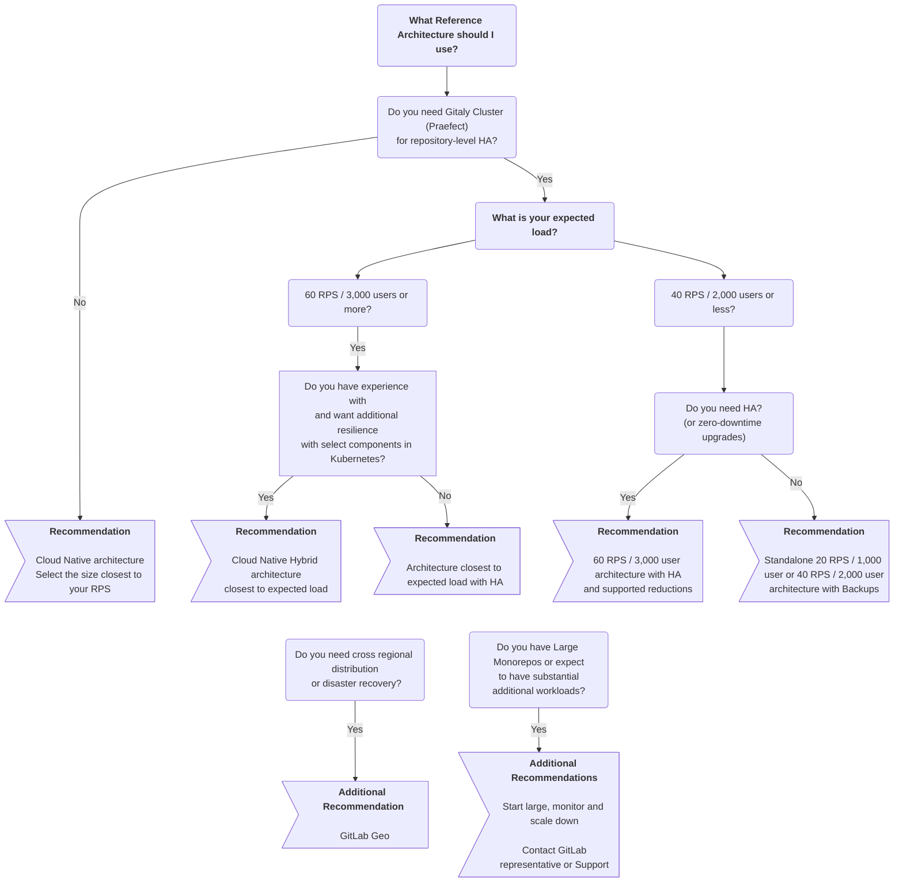



- Tier: 基础版，专业版，旗舰版
- Offering: 私有化部署



极狐GitLab 参考架构是经过验证的、可用于生产环境的设计方案，用于大规模部署极狐GitLab。每种架构都提供了详细的规格，您可以根据需求直接使用或进行调整。

<a id="before-you-start"></a>

## 开始之前

首先，请考虑极狐GitLab 私有化部署是否适合您和您的需求。

在生产环境中运行任何应用程序都很复杂，极狐GitLab 也不例外。虽然我们力求让这一过程尽可能顺畅，但根据您的设计，仍然存在一些普遍的复杂性。通常，您需要管理所有方面，例如硬件、操作系统、网络、存储、安全性、极狐GitLab 本身等等。这包括环境的初始设置和长期维护。

如果您决定采用这种方式，您必须掌握在生产环境中运行和维护应用程序的实用知识。如果您不具备这些条件，我们的 [专业服务](https://about.gitlab.com/services/#implementation-services) 团队可以提供实施服务。希望长期获得托管程度更高的方案的用户，可以探索我们的其他产品，例如 [JihuLab.com](../../subscriptions/manage_seats.md#gitlabcom-billing-and-usage) 或 [GitLab Dedicated](../../subscriptions/gitlab_dedicated/_index.md)。

如果您正在考虑使用极狐GitLab 私有化部署方案，我们建议您完整阅读本页内容，尤其是以下部分：

- [决定从哪种架构开始](#deciding-which-architecture-to-start-with)
- [大型单体仓库](#large-monorepos)
- [额外工作负载](#additional-workloads)
- [监控和调整您的环境](#monitoring)

<a id="deciding-which-architecture-to-start-with"></a>

## 决定从哪种架构开始

参考架构在性能、弹性和成本之间取得平衡。它们是基于典型工作负载模式推荐的起点。然而，大多数部署都需要根据实际使用情况，通过 [监控](#monitoring) 进行调整。

一般来说，您希望环境性能越高或弹性越强，其复杂性就越高。

<a id="expected-load"></a>

### 预期负载

正确的架构规模主要取决于您环境的预期峰值负载。每秒请求数（RPS）是衡量极狐GitLab 基础设施规模的主要指标，但其他因素也可能适用。

如需全面的 RPS 分析和数据驱动的规模决策，请参阅 [参考架构规模确定](../../install/sizing.md)，其中提供了：

- 用于提取峰值和持续 RPS 指标的详细 PromQL 查询
- 工作负载模式分析和 RPS 构成指导，以确定特定组件的调整
- 针对单体仓库、网络使用和增长规划的评估方法

如需快速估算 RPS，一些可能的方法包括：

- [Prometheus](../monitoring/prometheus/_index.md#sample-prometheus-queries) 查询，例如：

  ```prometheus
  sum(irate(gitlab_transaction_duration_seconds_count{controller!~'HealthController|MetricsController'}[1m])) by (controller, action)
  ```

- [极狐GitLab RPS 分析器](https://gitlab.com/gitlab-org/professional-services-automation/tools/utilities/gitlab-rps-analyzer#gitlab-rps-analyzer)。
- 其他监控解决方案。
- 负载均衡器统计信息。

如果您无法确定 RPS，Linux 软件包和云原生混合架构提供了用户数等效值作为替代的规模确定方法。该数量映射到典型的 RPS 值，同时考虑了手动和自动化使用情况。

<a id="available-reference-architectures"></a>

## 可用的参考架构

以下参考架构可作为您环境的推荐起点。

> [!note]
> 每种架构都设计为可 [扩展](#scaling-an-environment) 的。您可以根据工作负载向上或向下调整。例如，一些已知的重负载场景，如使用 [大型单体仓库](#large-monorepos) 或显著的 [额外工作负载](#additional-workloads)。

<a id="linux-package-omnibus"></a>

### Linux 软件包（Omnibus）

基于 Linux 软件包的参考架构将极狐GitLab 的所有组件部署在使用该软件包的虚拟机上。部分组件（PostgreSQL、Redis、对象存储）可以选择使用云提供商的服务。

以下 RPS 目标反映了典型的工作负载构成。对于非典型工作负载，请参阅 [了解 RPS 构成](../../install/sizing.md#understanding-rps-composition-and-workload-patterns)。

| 规模                         | API RPS | Web RPS | Git（拉取）RPS | Git（推送）RPS |
|------------------------------|---------|---------|----------------|----------------|
| [1,000 用户](1k_users.md)   | 20      | 2       | 2              | 1              |
| [2,000 用户](2k_users.md)   | 40      | 4       | 4              | 1              |
| [3,000 用户](3k_users.md)   | 60      | 6       | 6              | 1              |
| [5,000 用户](5k_users.md)   | 100     | 10      | 10             | 2              |
| [10,000 用户](10k_users.md) | 200     | 20      | 20             | 4              |
| [25,000 用户](25k_users.md) | 500     | 50      | 50             | 10             |
| [50,000 用户](50k_users.md) | 1000    | 100     | 100            | 20             |

<a id="cloud-native-hybrid"></a>

### 云原生混合

云原生混合参考架构使用 Helm Charts 在 Kubernetes 中部署部分无状态组件（Webservice、Sidekiq），而部分组件则保留在虚拟机上或使用云提供商的服务（PostgreSQL、Redis、对象存储）。

| 规模                                                                                                 | API RPS | Web RPS | Git（拉取）RPS | Git（推送）RPS |
|------------------------------------------------------------------------------------------------------|---------|---------|----------------|----------------|
| [2,000 用户](2k_users.md#cloud-native-hybrid-reference-architecture-with-helm-charts-alternative)   | 40      | 4       | 4              | 1              |
| [3,000 用户](3k_users.md#cloud-native-hybrid-reference-architecture-with-helm-charts-alternative)   | 60      | 6       | 6              | 1              |
| [5,000 用户](5k_users.md#cloud-native-hybrid-reference-architecture-with-helm-charts-alternative)   | 100     | 10      | 10             | 2              |
| [10,000 用户](10k_users.md#cloud-native-hybrid-reference-architecture-with-helm-charts-alternative) | 200     | 20      | 20             | 4              |
| [25,000 用户](25k_users.md#cloud-native-hybrid-reference-architecture-with-helm-charts-alternative) | 500     | 50      | 50             | 10             |
| [50,000 用户](50k_users.md#cloud-native-hybrid-reference-architecture-with-helm-charts-alternative) | 1000    | 100     | 100            | 20             |

<a id="cloud-native"></a>

### 云原生

云原生架构将所有极狐GitLab 组件部署在 Kubernetes 中，而 PostgreSQL、Redis 和对象存储则使用外部托管服务。四种标准化的规模覆盖了大多数生产部署。对于非典型工作负载，请参阅 [参考架构规模确定](../../install/sizing.md)。这是新部署的推荐架构。

| 规模 | 目标 RPS | 工作负载特征 |
|------|------------|--------------------------|
| [小型（S）](cloud_native.md#small-s) | ≤100 RPS | 整体负载较轻，不适合活跃的单体仓库 |
| [中型（M）](cloud_native.md#medium-m) | ≤200 RPS | 中等负载，支持轻度使用的单体仓库 |
| [大型（L）](cloud_native.md#large-l) | ≤500 RPS | 高负载，可处理中度使用的单体仓库 |
| [超大型（XL）](cloud_native.md#extra-large-xl) | ≤1000 RPS | 高强度负载，专为重负载使用的单体仓库设计 |

<a id="if-in-doubt-start-large-monitor-and-then-scale-down"></a>

### 如有疑问，从大规模开始，监控，然后缩减

如果您不确定所需的环境规模，可以考虑从较大的规模开始，进行 [监控](#monitoring)，然后根据指标支持您的情况，相应地进行 [缩减](#scaling-an-environment)。

在以下情况下，从大规模开始然后缩减是一种审慎的方法：

- 您无法确定 RPS
- 环境负载可能异常高于预期
- 您有 [大型单体仓库](#large-monorepos) 或显著的 [额外工作负载](#additional-workloads)

例如，如果您有 3,000 个用户，但也知道存在会显著增加并发负载的自动化操作，那么您可以从 100 RPS / 5k 用户级别的环境开始，进行监控，如果指标支持，可以一次性或逐个缩减所有组件。

<a id="standalone-non-ha"></a>

### 独立（非 HA）

对于服务 2,000 或更少用户的环境，通常建议采用独立方法，即部署非 HA 的单节点或多节点环境。使用这种方法，您可以采用 [自动备份](../backup_restore/backup_gitlab.md#configuring-cron-to-make-daily-backups) 等策略进行恢复。这些策略提供了良好的恢复时间目标（RTO）或恢复点目标（RPO），同时避免了 HA 带来的复杂性。

对于独立设置，尤其是单节点环境，有多种 [安装](../../install/_index.md) 和管理选项。这些选项包括 [通过选定的云提供商市场直接部署](https://page.gitlab.com/cloud-partner-marketplaces.html) 的能力，这可以进一步降低复杂性。

<a id="high-availability-ha"></a>

### 高可用性（HA）

高可用性确保极狐GitLab 设置中的每个组件都能通过各种机制处理故障。然而，实现这一点很复杂，所需的环境规模也可能相当大。

对于服务 3,000 或更多用户的环境，我们通常建议使用 HA 策略。在此级别，故障对更多用户的影响更大。此范围内的所有架构都为此在设计上内置了 HA。

<a id="do-you-need-high-availability-ha"></a>

#### 您需要高可用性（HA）吗？

如前所述，实现 HA 是有代价的。环境要求相当大，因为每个组件都需要成倍增加，这会带来额外的实际和维护成本。

对于许多用户少于 3,000 的客户，我们发现备份策略就足够了，甚至更可取。虽然这确实有较慢的恢复时间，但这也意味着您的架构要小得多，维护成本也因此更低。

作为一般准则，仅在以下情况下采用 HA：

- 当您有 3,000 或更多用户时。
- 当极狐GitLab 宕机会严重影响您的工作流程时。

<a id="scaled-down-high-availability-ha-approach"></a>

#### 缩减版高可用性（HA）方法

如果您在用户较少的情况下仍需要 HA，可以通过调整后的 [3K 架构](3k_users.md#supported-modifications-for-lower-user-counts-ha) 来实现。

<a id="zero-downtime-upgrades"></a>

#### 零停机升级

[零停机升级](../../update/zero_downtime.md) 适用于具有 HA 的标准环境（云原生混合 [不支持](https://gitlab.com/groups/gitlab-org/cloud-native/-/work_items/52)）。这允许环境在升级期间保持运行。然而，此过程因此更复杂，并且有一些文档中详述的限制。

在执行此过程时，值得注意的是，当 HA 机制生效时，可能仍会有短暂的停机时刻。

在大多数情况下，升级所需的停机时间不应过长。仅当这是您的关键要求时，才使用此方法。

<a id="gitlab-geo-cross-regional-distribution--disaster-recovery"></a>

### 极狐GitLab Geo（跨区域分发 / 灾难恢复）

使用 [极狐GitLab Geo](../geo/_index.md)，您可以在不同区域实现分布式环境，并具备完整的灾难恢复（DR）设置。极狐GitLab Geo 至少需要两个独立的环境：

- 一个主站点。
- 一个或多个作为副本的从站点。

如果主站点不可用，您可以故障转移到一个从站点。

> [!note]
> 仅当 DR 是您环境的关键要求时，才使用这种高级且复杂的设置。您还必须就每个站点的配置方式做出额外决定。例如，每个从站点是否与主站点采用相同的架构，或者每个站点是否配置为 HA。

<a id="large-monorepos--additional-workloads"></a>

### 大型单体仓库 / 额外工作负载

[大型单体仓库](#large-monorepos) 或显著的 [额外工作负载](#additional-workloads) 会显著影响环境的性能。根据具体情况，可能需要进行一些调整。

如需对这些因素进行全面分析，请参阅 [参考架构规模确定](../../install/sizing.md)，其中提供了：

- 单体仓库对基础设施影响的详细评估方法。
- 针对不同工作负载模式的特定组件扩展建议。
- 针对高数据传输场景的网络带宽分析。

如果您的情况适用，请联系您的极狐GitLab 客户代表或我们的 [支持团队](https://about.gitlab.com/support/) 以获取进一步指导。

<a id="cloud-provider-services"></a>

### 云提供商服务

对于前面描述的所有策略，您可以在等效的云提供商服务上运行选定的极狐GitLab 组件，例如 PostgreSQL 数据库或 Redis/Valkey。

有关更多信息，请参阅 [基础设施和服务](#infrastructure-and-services)。

<a id="decision-tree"></a>

### 决策树

在参考以下决策树之前，请先完整阅读前面记录的指导。



<a id="requirements"></a>

## 要求

在实施参考架构之前，请参阅以下要求和指导。

<a id="supported-machine-types"></a>

### 支持的机器类型

这些架构旨在机器类型选择方面保持灵活性，同时确保一致的性能。虽然我们在每个参考架构中提供了具体的机器类型示例，但这些并非强制性的默认值。

您可以使用任何满足或超过每个组件指定要求的机器类型，例如：

- 新一代机器类型（如 GCP `n2` 系列或 AWS `m6` 系列）
- 不同的架构，如基于 ARM 的实例（例如 AWS Graviton）
- 更符合您特定工作负载特征的替代机器类型系列（例如更高的网络带宽）

此指导也适用于任何云提供商服务，例如 AWS RDS。

> [!note]
> 不建议使用任何“可突发”实例类型，因为其性能不稳定。

有关我们测试的机器类型及测试方式的详细信息，请参阅 [验证和测试结果](#validation-and-test-results)。

<a id="supported-disk-types"></a>

### 支持的磁盘类型

大多数标准磁盘类型都应与极狐GitLab 兼容。但是，请注意以下具体说明：

- Gitaly 对 Gitaly 存储有特定的 [磁盘要求](../gitaly/_index.md#disk-requirements)。
- 我们不建议使用任何“可突发”的磁盘类型，因为其性能不稳定。

其他磁盘类型预计可与极狐GitLab 配合使用。请根据您的需求（如持久性或成本）进行选择。

<a id="supported-infrastructure"></a>

### 支持的基础设施

极狐GitLab 应能在大多数基础设施上运行，例如信誉良好的云提供商（AWS、GCP、Azure）及其服务，或自托管（ESXi），只要它们满足：

- 每种架构中详述的规格。
- 本节中的任何要求。

但是，这并不保证与每种可能的组合都兼容。

有关更多信息，请参阅 [基础设施和服务](#infrastructure-and-services)。

<a id="networking-high-availability"></a>

### 网络（高可用性）

以下是以高可用性方式运行极狐GitLab 的网络要求。

<a id="network-latency"></a>

#### 网络延迟

网络延迟应尽可能低，以允许跨极狐GitLab 应用程序进行同步复制，例如数据库复制。通常，这应低于 5 毫秒。

<a id="availability-zones-cloud-providers"></a>

#### 可用区（云提供商）

支持跨可用区部署，通常建议这样做以增强弹性。您应使用奇数个可用区，以符合极狐GitLab 应用程序的要求，因为某些组件使用奇数个节点进行法定人数投票。

<a id="data-centers-self-hosted"></a>

#### 数据中心（自托管）

跨多个自托管数据中心部署是可能的，但需要仔细考虑。这要求中心之间具有同步能力的延迟、防止脑裂场景的稳健冗余网络链路、所有中心位于同一地理区域，以及跨奇数个中心进行部署以进行正确的法定人数投票（如 [可用区](#availability-zones-cloud-providers)）。

> [!warning]
> 极狐GitLab 支持团队可能无法协助处理由多数据中心部署引起的基础设施相关问题。
> 选择跨中心部署通常需要您自行承担风险。
> 此外，不支持在 [不同区域部署单个极狐GitLab 环境](#deploying-one-environment-over-multiple-regions)。
> 数据中心应位于同一区域。

<a id="large-monorepos"></a>

### 大型单体仓库

这些架构已使用遵循最佳实践的各种规模的代码仓库进行了测试。

然而，[大型单体仓库](../../user/project/repository/monorepos/_index.md)（数 GB 或更大）会显著影响 Git 的性能，进而影响环境本身。它们的存在和使用方式会对从 Gitaly 到底层基础设施的整个系统造成显著压力。

性能影响主要是软件层面的。额外的硬件资源会导致收益递减。

> [!warning]
> 如果您的情况适用，我们强烈建议您遵循链接的文档，并联系您的极狐GitLab 客户代表或我们的 [支持团队](https://about.gitlab.com/support/) 以获取进一步指导。

大型单体仓库会带来显著的成本。如果您有这样的代码仓库，请遵循以下指导以确保良好的性能并控制成本：

- [优化大型单体仓库](../../user/project/repository/monorepos/_index.md)。使用 [LFS](../../user/project/repository/monorepos/_index.md#use-git-lfs-for-large-binary-files) 等功能来避免存储二进制文件，以及其他减少代码仓库大小的方法，可以显著提高性能并降低成本。
- 根据单体仓库的不同，可能需要增加环境规格来补偿。Gitaly 可能需要额外的资源，Praefect、GitLab Rails 和负载均衡器也可能需要。这取决于单体仓库本身及其使用情况。
- 当单体仓库非常大（20 GB 或更大）时，可能需要进一步的额外策略，例如进一步增加规格，或者在某些情况下，为单体仓库单独使用一个独立的 Gitaly 后端。
- 网络和磁盘带宽是大型单体仓库的另一个潜在考虑因素。在非常繁重的情况下，如果存在大量并发克隆（例如 CI 中），则可能发生带宽饱和。在这种情况下，请 [尽可能减少完整克隆](../../user/project/repository/monorepos/_index.md#reduce-concurrent-clones-in-cicd)。否则，可能需要额外的环境规格来增加带宽。这因云提供商而异。

<a id="additional-workloads"></a>

### 额外工作负载

这些架构已基于真实数据为标准的极狐GitLab 设置进行了 [设计和测试](#validation-and-test-results)。

然而，额外的工作负载会通过触发后续操作而放大操作的影响。如果您使用以下内容，您可能需要调整建议的规格来补偿：

- 节点上的安全软件。
- 针对 [大型代码仓库](../../user/project/repository/monorepos/_index.md) 的数百个并发 CI 作业。
- [高频率运行](../logs/log_parsing.md#print-top-api-user-agents) 的自定义脚本。
- 许多大型项目中的 [集成](../../integration/_index.md)。
- 拥有大量用户群的项目中的 [功能标志](../../operations/feature_flags.md#performance-factors)。
- [服务器钩子](../server_hooks.md)。
- [系统钩子](../system_hooks.md)。

通常，您应该建立稳健的监控来衡量任何额外工作负载的影响，以便为需要进行的任何更改提供信息。请联系您的极狐GitLab 客户代表或我们的 [支持团队](https://about.gitlab.com/support/) 以获取进一步指导。

<a id="load-balancers"></a>

### 负载均衡器

这些架构根据级别使用最多两个负载均衡器：

- 外部负载均衡器 - 为任何面向外部的组件提供流量服务，主要是 Rails。
- 内部负载均衡器 - 为以 HA 方式部署的选定内部组件（如 Praefect 或 PgBouncer）提供流量服务。

具体使用哪个负载均衡器或其确切配置超出了极狐GitLab 文档的范围。最常见的选项是在机器节点上设置负载均衡器，或使用云提供商提供的服务。如果部署云原生混合环境，charts 可以使用 Kubernetes Ingress 处理外部负载均衡器的设置。

每个架构级别都包含一个推荐的基准机器大小，用于直接部署在机器上。但是，它们可能需要根据所选负载均衡器和预期工作负载等因素进行调整。值得注意的是，机器可能具有不同的 [网络带宽](#network-bandwidth)，也应予以考虑。

以下部分为负载均衡器提供额外指导。

<a id="balancing-algorithm"></a>

#### 均衡算法

为确保对节点的调用均匀分布并获得良好性能，请尽可能使用基于最少连接的负载均衡算法或等效算法。

我们不建议使用轮询算法，因为已知它们在实践中无法均匀分布连接。

<a id="network-bandwidth"></a>

#### 网络带宽

部署在机器上时，负载均衡器可用的总网络带宽在云提供商之间可能有显著差异。一些云提供商，如 [AWS](https://docs.aws.amazon.com/AWSEC2/latest/UserGuide/ec2-instance-network-bandwidth.html)，可能采用基于积分的突发系统来确定任何时间的带宽。

您的负载均衡器所需的网络带宽取决于数据形态和工作负载等因素。每个架构级别的推荐基准大小都是基于真实数据选择的。然而，在某些场景下，例如持续克隆 [大型单体仓库](#large-monorepos)、大量使用 [极狐GitLab 容器镜像仓库](../../user/packages/container_registry/_index.md)、大型 CI 产物，或任何涉及频繁传输大文件的工作负载，您可能需要相应调整大小。

<a id="no-swap"></a>

### 无交换分区

参考架构中不建议使用交换分区。它是一种故障保险机制，但会严重影响性能。这些架构设计为在大多数情况下具有足够的内存来避免对交换分区的需求。

<a id="praefect-postgresql"></a>

### Praefect PostgreSQL

[Praefect 需要自己的数据库服务器](../gitaly/praefect/configure.md#postgresql)。要实现完全 HA，需要第三方 PostgreSQL 数据库解决方案。

我们希望将来能为这些限制提供内置解决方案。同时，可以按照规格说明使用 Linux 软件包设置非 HA 的 PostgreSQL 服务器。有关更多详细信息，请参阅以下议题：

- [`omnibus-gitlab#7292`](https://gitlab.com/gitlab-org/omnibus-gitlab/-/issues/7292)。
- [`gitaly#3398`](https://gitlab.com/gitlab-org/gitaly/-/issues/3398)。

<a id="infrastructure-and-services"></a>

## 基础设施和服务

这些架构可以在满足规格的任何基础设施上运行，无论是在云提供商还是本地。本文档中的示例和内部测试使用 GCP 和 AWS，但满足要求的其他提供商预计也能同样良好地工作。

对于云原生和云原生混合部署，支持任何满足 [GitLab Charts 先决条件](https://gitlab.cn/docs/charts/installation/tools/) 的 Kubernetes 发行版。Kubernetes 平台特定行为（网络、存储类、身份验证）不在极狐GitLab 支持范围内。

以下是每种服务类型的示例服务，用于测试和文档。满足以下各节所述要求的其他服务预计也能工作：

| 云服务  | GCP                                                    | AWS                                                                                                  | Azure                                                                                                   | 裸机               |
|----------------|--------------------------------------------------------|------------------------------------------------------------------------------------------------------|---------------------------------------------------------------------------------------------------------|--------------------------|
| 对象存储 | [Cloud Storage](https://cloud.google.com/storage)      | [S3](https://aws.amazon.com/s3/)                                                                     | [Azure Blob Storage](https://azure.microsoft.com/en-gb/products/storage/blobs)                          | 兼容 S3 的对象存储 |
| 数据库       | [Cloud SQL](https://cloud.google.com/sql) <sup>1</sup> | [RDS](https://aws.amazon.com/rds/)                                                                   | [Azure Database for PostgreSQL Flexible Server](https://azure.microsoft.com/en-gb/products/postgresql/) |                          |
| Redis          | [Memorystore](https://cloud.google.com/memorystore)    | [ElastiCache for Valkey](https://aws.amazon.com/elasticache/valkey/) <sup>2</sup>                    |                                                                                                         |                          |

<!-- Disable ordered list rule <https://github.com/DavidAnson/markdownlint/blob/main/doc/Rules.md#md029---ordered-list-item-prefix> -->
<!-- markdownlint-disable MD029 -->
1. 为获得最佳性能，尤其是在较大环境（500 RPS / 25k 用户或更高）中，请为 GCP Cloud SQL 使用 [Enterprise Plus 版本](https://docs.cloud.google.com/sql/docs/mysql/editions-intro)。根据您的工作负载，您可能需要将最大连接数调整得高于服务的默认值。
2. 使用 ElastiCache for Valkey 7.2。AWS 上不提供 ElastiCache for Redis 7.2。已知 ElastiCache for Redis 7.1 可以工作，但它基于 Redis 7.0 OSS 构建，不建议用于新部署。
<!-- markdownlint-enable MD029 -->

<a id="best-practices-for-the-database-services"></a>

### 数据库服务的最佳实践

您可以使用 [第三方外部 PostgreSQL 服务](../postgresql/external.md)，而不是 Linux 软件包捆绑的 PostgreSQL、PgBouncer 和 Consul 服务发现组件。

使用运行 [受支持的 PostgreSQL 版本](../../install/requirements.md#postgresql) 的信誉良好的提供商。以下是已知可用的服务示例：

- [Google Cloud SQL](https://cloud.google.com/sql/docs/postgres/high-availability#normal)。
- [Amazon RDS](https://aws.amazon.com/rds/)。

<a id="configuration-considerations"></a>

#### 配置注意事项

使用外部数据库服务时，请考虑以下事项：

- 为获得最佳性能，请启用 [数据库负载均衡](../postgresql/database_load_balancing.md) 并使用只读副本。将节点数匹配到标准 Linux 软件包部署中使用的数量。这种方法对于较大环境（每秒超过 200 个请求或 10,000+ 用户）尤其重要。
- 高可用性节点要求可能因服务而异，并可能与 Linux 软件包安装不同。
- 对于 [极狐GitLab Geo](../geo/_index.md)，请确保服务支持跨区域复制。

<a id="connection-management"></a>

#### 连接管理

为获得外部数据库服务的最佳连接处理：

- 使用 [数据库负载均衡](../postgresql/database_load_balancing.md) 将连接分布到只读副本。
- 根据您的环境规模和工作负载调整 PostgreSQL 连接数配置。根据性能进行监控和调整。
- 如果需要额外的连接池，请部署您自己的 PgBouncer。其他第三方池化解决方案可能有效，但尚未经过验证。

云提供商的池化服务有以下限制，要么不兼容，要么不推荐：

- [AWS RDS Proxy](https://aws.amazon.com/rds/proxy/)：未经验证可与极狐GitLab 一起使用。
- [Azure Database for PostgreSQL PgBouncer](https://learn.microsoft.com/en-us/azure/postgresql/connectivity/concepts-pgbouncer)：单线程架构，可观测性有限。在高负载下可能成为瓶颈。

> [!note]
> 极狐GitLab 捆绑的 PgBouncer 仅适用于捆绑的 PostgreSQL，不能与外部数据库服务一起使用。

<a id="database-service-compatibility"></a>

#### 数据库服务兼容性

以下数据库云提供商服务要么不兼容，要么不推荐：

- [Amazon Aurora](https://aws.amazon.com/rds/aurora/) 不兼容且不受支持。有关更多详细信息，请参阅 [14.4.0](https://archives.docs.gitlab.com/17.3/ee/update/versions/gitlab_14_changes/#1440)。
- [Google AlloyDB](https://cloud.google.com/products/alloydb) 和 [Amazon RDS Multi-AZ DB 集群](https://docs.aws.amazon.com/AmazonRDS/latest/UserGuide/multi-az-db-clusters-concepts.html) 未经测试且不推荐。这两种解决方案预计都无法与极狐GitLab Geo 配合使用。
  - [Amazon RDS Multi-AZ DB 实例](https://docs.aws.amazon.com/AmazonRDS/latest/UserGuide/Concepts.MultiAZSingleStandby.html) 是一个独立产品，受支持。

<a id="best-practices-for-redis-and-valkey-services"></a>

### Redis 和 Valkey 服务的最佳实践

使用运行标准、高性能且受支持版本的外部 [Redis 或 Valkey 服务](../redis/replication_and_failover_external.md#redis-as-a-managed-service-in-a-cloud-provider)。该服务必须支持：

- Redis 独立（主 x 副本）模式 - 特别不支持 Redis 集群模式
- 通过复制实现高可用性
- 设置 [Redis 逐出策略](../redis/replication_and_failover_external.md#setting-the-eviction-policy) 的能力

Redis 主要是单线程的。对于目标为 200 RPS / 10,000 用户或更大级别的环境，请将实例拆分为缓存和持久数据，以获得最佳性能。

> [!note]
> 不支持无服务器 Redis 和 Valkey 变体。

<a id="best-practices-for-object-storage"></a>

### 对象存储的最佳实践

极狐GitLab 已针对 [各种对象存储提供商](../object_storage.md#object-storage-provider-support) 进行了测试，这些提供商预计可以正常工作。

请使用具有完整 S3 兼容性的信誉良好的解决方案。

<a id="deviating-from-the-suggested-reference-architectures"></a>

## 偏离建议的参考架构

您偏离参考架构越远，获得支持的难度就越大。每次偏离都会引入一层复杂性，使潜在问题的故障排除复杂化。

这些架构使用官方 Linux 软件包或 [Helm Charts](https://gitlab.cn/docs/charts/) 来安装和配置各种组件。这些组件安装在单独的机器（虚拟化或裸机）上。机器硬件要求列在特定参考架构页面上的“配置”列中。等效的 VM 标准大小列在每个 [可用架构](#available-reference-architectures) 的 GCP/AWS/Azure 列中。

您可以在 Docker 上运行极狐GitLab 组件，包括 Docker Compose。Docker 得到良好支持，并在不同环境间提供一致的规格。但是，它仍然是一个额外的层，可能会增加一些支持复杂性。例如，无法在容器中运行 `strace`。

<a id="unsupported-designs"></a>

### 不支持的设计

虽然我们努力为极狐GitLab 环境设计提供良好的支持范围，但某些方法无法有效工作。以下部分详细说明了这些不受支持的方法。

<a id="stateful-components-in-kubernetes"></a>

#### Kubernetes 中的有状态组件

[不支持在 Kubernetes 中运行有状态组件，例如 Postgres 和 Redis](https://gitlab.cn/docs/charts/installation/#configure-the-helm-chart-to-use-external-stateful-data)。

您可以使用其他受支持的云提供商服务，除非特别指出不受支持。

单个 Gitaly 节点可以部署在 Kubernetes 上，并且通常可用。这提供了一种非 HA 解决方案，其中每个代码仓库存储在一个节点上。有关 Gitaly 部署选项和限制的背景信息，请参阅 [Kubernetes 上的 Gitaly](../gitaly/kubernetes.md#context)。

对于在 Kubernetes 中部署 Gitaly 作为完全云原生设置一部分的参考架构，请参阅 [云原生参考架构](cloud_native.md)。

<a id="autoscaling-of-stateful-nodes"></a>

#### 有状态节点的自动扩缩

作为一般指导，只有极狐GitLab 的无状态组件可以运行在自动扩缩组中，即 GitLab Rails 和 Sidekiq。其他有状态的组件，如 Gitaly，不支持这种方式。有关更多信息，请参阅 [议题 2997](https://gitlab.com/gitlab-org/gitaly/-/issues/2997)。

这适用于 Postgres 和 Redis 等有状态组件。您可以使用其他受支持的云提供商服务，除非特别指出不受支持。

[云原生混合设置](#cloud-native-hybrid) 通常比自动扩缩组更受青睐。Kubernetes 能更好地处理只能在一个节点上运行的组件，例如数据库迁移和 [Mailroom](../incoming_email.md)。

<a id="deploying-one-environment-over-multiple-regions"></a>

#### 在多个区域部署单个环境

极狐GitLab 不支持在多个区域部署单个环境。这些设置可能导致严重问题，例如过度的网络延迟，或者如果区域间连接失败，则可能导致脑裂场景。

几个极狐GitLab 组件执行同步复制或需要奇数个节点才能正常运行，例如 Consul、Redis Sentinel 和 Praefect。将这些组件分布在高延迟的多个区域会严重影响其功能和整体系统性能。

此限制适用于所有潜在的极狐GitLab 环境设置，包括云原生混合替代方案。

为了在多个数据中心或区域部署极狐GitLab，我们提供 [极狐GitLab Geo](../geo/_index.md) 作为全面解决方案。

<a id="validation-and-test-results"></a>

## 验证和测试结果

极狐GitLab 会定期对这些架构进行冒烟测试和性能测试，以确保它们保持合规。

<a id="how-we-perform-the-tests"></a>

### 我们如何执行测试

测试使用源自示例客户数据的特定编码工作负载进行，同时使用 [GitLab 环境工具包（GET）](https://gitlab.com/gitlab-org/gitlab-environment-toolkit) 通过 Terraform 和 Ansible 部署环境，并使用 [GitLab 性能工具（GPT）](https://gitlab.com/gitlab-org/quality/performance) 通过 k6 进行性能测试。

测试主要在 GCP 和 AWS 上使用其标准计算产品（GCP 的 n1 系列，AWS 的 m5 系列）作为基准配置进行。选择这些机器类型作为最低公分母目标，以确保广泛的兼容性。使用满足 CPU 和内存要求的不同或更新的机器类型完全受支持 - 有关更多信息，请参阅 [支持的机器类型](#supported-machine-types)。这些架构预计在满足规格的任何硬件上表现相似，无论是在其他云提供商还是本地。

<a id="performance-targets"></a>

### 性能目标

每个参考架构都根据基于真实客户数据的特定吞吐量目标进行测试。对于每 1,000 个用户，我们测试：

- API：20 RPS
- Web：2 RPS
- Git（拉取）：2 RPS
- Git（推送）：0.4 RPS（四舍五入到最接近的整数）

列出的 RPS 目标基于与用户数相对应的总环境负载的真实客户数据，包括 CI 和其他工作负载。

> [!note]
>
> - 这些 RPS 细分代表基于典型工作负载模式的测试目标。您的实际工作负载构成可能会有所不同。有关评估您的特定 RPS 构成以及何时需要调整的指导，请参阅 [了解 RPS 构成](../../install/sizing.md#understanding-rps-composition-and-workload-patterns)。
> - 测试环境中组件之间的网络延迟观察到 <5 毫秒，但请注意，这并非硬性要求。

<a id="test-coverage-and-results"></a>

### 测试覆盖范围和结果

测试旨在有效并为参考架构目标提供良好覆盖，涵盖 Linux 软件包和云原生环境。测试的具体环境和配置会定期审查，以确保最佳的覆盖范围和成本价值平衡，并可能随时间而变化。

我们的测试还包括正在探索未来可能纳入的这些架构的原型变体。测试结果可在 [参考架构 wiki](https://gitlab.com/gitlab-org/reference-architectures/-/wikis/Benchmarks/Latest) 上公开获取。

<a id="maintaining-a-reference-architecture-environment"></a>

## 维护参考架构环境

维护参考架构环境通常与维护任何其他极狐GitLab 环境相同。

在本节中，您可以找到相关领域文档的链接和特定的架构说明。

<a id="scaling-an-environment"></a>

### 扩展环境

参考架构被设计为基于典型工作负载模式的经过验证的起点，而非最终配置。大多数生产部署都受益于根据监控中出现的实际使用模式进行调整。这些架构自始至终都是可扩展的，您可以随着工作负载特征的清晰而迭代调整。当指标表明持续的资源压力时，可以逐个组件或整体扩展到下一个架构规模。

> [!note]
> 如果某个组件持续耗尽给定的资源，请在进行任何重大扩展之前联系我们的 [支持团队](https://about.gitlab.com/support/)。

<a id="when-to-scale"></a>

#### 何时扩展

大多数部署在观察实际工作负载模式后都会受益于调整。触发扩展的常见场景包括：

**资源大小调整：**

- 为 API 密集型工作负载增加 Webservice/Rails 容量，尤其是当 API 流量超过总 RPS 的 90% 时（请参阅 [了解 RPS 构成](../../install/sizing.md#understanding-rps-composition-and-workload-patterns)）
- 为单体仓库密集型环境或代码仓库大小超过 2 GB 时扩展 Gitaly（请参阅 [识别组件调整](../../install/sizing.md#identify-component-adjustments)）
- 为高 CI/CD 吞吐量或繁重的后台作业处理调整 Sidekiq 工作进程

**配置调优：**

- 根据并发访问模式设置 Gitaly 代码仓库 cgroup 数量（请参阅 [Gitaly cgroups](../gitaly/cgroups.md)）
- 配置 Sidekiq 队列优先级以优化作业处理（请参阅 [处理特定作业类](../sidekiq/processing_specific_job_classes.md)）

**架构优化：**

- 为读密集型工作负载添加 PostgreSQL 只读副本
- 将 Sidekiq 拆分为针对不同作业类型的专用池
- 为流量尖峰明显的环境调整最小实例数

这些调整是典型且预期的。参考架构提供了基础，但监控您的特定工作负载决定了最佳配置。如需对您的环境进行系统评估，请参阅 [参考架构规模确定](../../install/sizing.md)。

<a id="scaling-for-gitlab-duo-agent-platform"></a>

#### 为极狐GitLab Duo Agent Platform 扩展

极狐GitLab Duo Agent Platform 引入了超出标准极狐GitLab 工作负载的额外基础设施要求。Agent Platform 工作流通过 GitLab Rails API 执行，通过 Sidekiq 异步处理作业，并访问代码仓库数据以获取代码上下文和执行分析。

主要组件影响：

- **Rails（Webservice/Puma）** - Agent Platform API 请求增加了整体请求负载，用于流式传输 AI 响应的 WebSocket 连接由 Workhorse 管理
- **Sidekiq** - AI 完成作业和工作流状态更新作为后台作业处理
- **PostgreSQL** - Agent 工作流会话和状态数据存储在数据库中
- **Gitaly** - 代码上下文所需的代码仓库文件访问以及 Agent 生成更改的提交操作

对于计划采用 Agent Platform 的环境：

- 根据您的标准工作负载 RPS 部署推荐的架构规模
- 在初始部署期间监控 Rails CPU 利用率
- 监控 Sidekiq CPU 利用率和作业队列深度
- 监控 PostgreSQL 因工作流状态管理而增加的事务率
- 监控 Gitaly 因代码分析功能而增加的文件访问模式

有关监控这些组件的示例 Prometheus 查询，请参阅 [示例 Prometheus 查询](../monitoring/prometheus/_index.md#sample-prometheus-queries)。

如果您观察到持续的资源压力，请通过扩展受影响的组件来增加容量。在 Kubernetes 部署中，增加 Pod 副本和节点池容量。在 Linux 软件包部署中，通过添加节点进行水平扩展，或通过增加节点规格进行垂直扩展。

资源需求因 Agent Platform 使用强度和启用的特定功能而异。参考架构为典型 Agent Platform 使用模式以及标准极狐GitLab 工作负载提供了足够的基准容量。

<a id="how-to-scale"></a>

#### 如何扩展

对于大多数组件，可以照常应用垂直和水平扩展。但是，在执行此操作之前，请注意以下注意事项：

- 垂直扩展 Puma 或 Sidekiq 时，必须调整工作进程数量以利用额外的规格。Puma 工作进程数通常会自动调整，但 Sidekiq 可能需要 [手动配置](../sidekiq/extra_sidekiq_processes.md#start-multiple-processes)。
- Redis 和 PgBouncer 主要是单线程的。如果这些组件出现 CPU 耗尽，则可能必须进行水平扩展。
- 在 Linux 软件包部署中，Consul、Redis Sentinel 和 Praefect 组件在以 HA 形式部署时需要奇数个节点进行投票法定人数。
- 显著扩展某些组件可能会导致明显的连锁效应，影响环境性能。有关更多指导，请参阅 [扩展的连锁效应](#scaling-knock-on-effects)。

相反，如果您有稳健的指标表明环境过度配置，您可以向下扩展。向下扩展时应采用迭代方法，以确保没有问题。

<a id="scaling-knock-on-effects"></a>

#### 扩展的连锁效应

在某些情况下，显著扩展组件可能会对下游组件产生连锁效应，影响性能。这些架构在设计时考虑了平衡，以确保相互依赖的组件在规格上保持一致。值得注意的是，扩展组件可能会导致传递给其依赖的其他组件的吞吐量增加。因此，您可能还必须扩展这些其他依赖组件。要确定这一点，请在扩展前监控所有依赖服务的饱和指标。如果多个相互依赖的组件显示饱和，则应协调一致地同时扩展，而不是顺序扩展，以防止瓶颈在组件之间简单转移。

> [!note]
> 这些架构设计为具有弹性，以适应上游组件的扩展。但是，为安全起见，在对环境进行任何重大更改之前，请联系我们的 [支持团队](https://about.gitlab.com/support/)。

以下组件在显著扩展后会影响其他组件：

- Puma 和 Sidekiq - Puma 或 Sidekiq 工作进程的显著扩展将导致与内部负载均衡器、PostgreSQL（如果存在则通过 PgBouncer）、Gitaly（如果存在则通过 Praefect）和 Redis 的并发连接增加。
  - Redis 主要是单线程的。在某些情况下，如果增加的吞吐量导致组合集群中的 CPU 耗尽，您可能必须将 Redis 拆分为单独的实例（例如，缓存和持久）。
  - PgBouncer 也是单线程的，但扩展可能会导致添加新池，进而可能增加与 Postgres 的总连接数。强烈建议仅在您有管理 Postgres 连接的经验时才这样做，如有疑问请寻求帮助。
- Gitaly 集群 (Praefect)/PostgreSQL - 显著扩展额外节点可能会因增加对主节点的复制调用而对 HA 系统和性能产生不利影响。

<a id="scaling-from-a-non-ha-to-an-ha-architecture"></a>

#### 从非 HA 架构扩展到 HA 架构

在大多数情况下，垂直扩展仅用于增加环境的资源。但是，如果您要迁移到 HA 环境，则需要额外步骤将以下组件切换到其 HA 形式。

有关更多信息，请参阅以下文档：

- [Redis 到带 Redis Sentinel 的多节点 Redis](../redis/replication_and_failover.md#switching-from-an-existing-single-machine-installation)
- [Postgres 到带 Consul + PgBouncer 的多节点 Postgres](../postgresql/moving.md)
- [Gitaly 到 Gitaly 集群 (Praefect)](../gitaly/praefect/_index.md#migrate-to-gitaly-cluster-praefect)

<a id="upgrades"></a>

### 升级

升级参考架构环境与升级任何其他极狐GitLab 环境相同。有关更多信息，请参阅 [升级极狐GitLab](../../update/_index.md)。也提供 [零停机升级](#zero-downtime-upgrades)。

> [!note]
> 您应该按照创建参考架构的相同顺序进行升级。

<a id="monitoring"></a>

### 监控

您可以使用各种选项监控您的基础设施和 [极狐GitLab](../monitoring/_index.md)。有关更多信息，请参阅所选监控解决方案的文档。

> [!note]
> 极狐GitLab 应用程序捆绑了 [Prometheus 和各种兼容 Prometheus 的导出器](../monitoring/prometheus/_index.md)，可以接入您的解决方案。

<a id="update-history"></a>

## 更新历史

您可以在 [GitLab 项目](https://gitlab.com/gitlab-org/gitlab/-/merge_requests?scope=all&state=merged&label_name%5B%5D=Reference%20Architecture&label_name%5B%5D=documentation) 上找到完整的变更历史。
