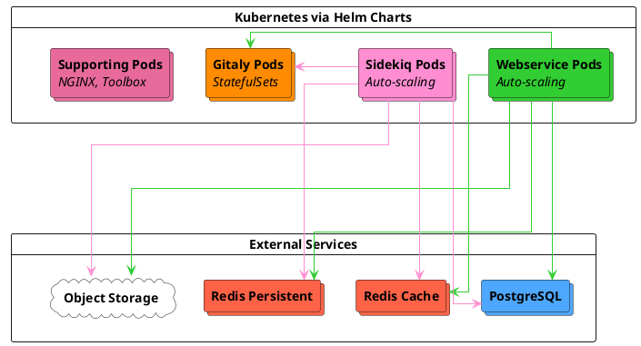



- Tier: 基础版，专业版，旗舰版
- Offering: 私有化部署



Cloud Native 参考架构专为现代云原生部署模式设计，提供四种标准化规格（S/M/L/XL），基于工作负载特征进行选择。这些架构在 Kubernetes 中部署所有极狐GitLab 组件，而 PostgreSQL、Redis 和对象存储则使用外部第三方解决方案，包括托管服务或本地部署选项。

## 架构概述

Cloud Native 架构将极狐GitLab 组件部署在 Kubernetes 和外部服务中：

**Kubernetes 组件：**

- **Webservice** - 处理 Web 请求
- **Sidekiq** - 处理后台作业
- **Gitaly** - 使用带持久化卷的 StatefulSet 管理 Git 代码仓库
- **支持服务** - Envoy Gateway、Toolbox 和监控组件

> [!note]
> 在 Kubernetes 上部署 Gitaly 时，Gitaly 仅支持分片（非集群）配置。您可以通过
> [客户端重试](../settings/gitaly_timeouts.md) 无停机升级 Gitaly。每个 Gitaly pod 对其服务的代码仓库而言都是单点故障。
> Kubernetes 上的 Gitaly 集群 (Praefect)处于测试版（参见 [Kubernetes 上的 Gitaly 集群](../gitaly/praefect/_index.md#gitaly-cluster-on-kubernetes)），不包含在此参考架构中。
>
> 如果您需要具有自动故障转移功能的 Gitaly 高可用性，请考虑 [Cloud Native 混合架构](_index.md#cloud-native-hybrid)，该架构在虚拟机上部署 Gitaly 集群，同时在 Kubernetes 中运行无状态组件。有关 Gitaly 在 Kubernetes 上的要求和限制，请参阅 [Kubernetes 上的 Gitaly](../gitaly/kubernetes.md#requirements)。

**外部服务：**

- **PostgreSQL** - 托管数据库服务，可选择部署备用副本以实现高可用性，并可添加只读副本以提升稳定性和性能
- **Redis** - 独立的缓存和持久化实例，每个实例均可选择部署备用副本以实现高可用性
- **对象存储** - 用于存储产物和软件包的对象存储服务，例如 S3、Google Cloud Storage 或 Azure Blob Storage

有关推荐的托管服务提供商（例如 GCP Cloud SQL、AWS RDS、Azure Database），请参阅 [基础设施和服务](_index.md#infrastructure-and-services)。

## 可用架构

这些架构围绕目标 RPS 范围设计，代表典型的生产工作负载模式。RPS 目标可作为起点。您的具体容量需求取决于工作负载构成和使用模式。有关 RPS 构成以及何时需要调整的指导，请参阅 [了解 RPS 构成](../../install/sizing.md#understanding-rps-composition-and-workload-patterns)。

| 规格 | 目标 RPS | 预期工作负载 |
|------|------------|-------------------|
| S | ≤100 | 开发活动较轻且自动化程度最低的团队 |
| M | ≤200 | 开发速度适中且标准使用 CI/CD 的组织 |
| L | ≤500 | 开发活动频繁且自动化程度较高的大型团队 |
| XL | ≤1000 | 工作负载密集且集成广泛的企业级部署 |

有关确定预期负载和选择合适规格的详细指导，请参阅 [参考架构规模调整指南](../../install/sizing.md)。

## 主要优势

Cloud Native 架构提供：

- **自愈基础设施** - Kubernetes 自动重启失败的 pod，并在健康节点间重新调度工作负载
- **动态资源扩展** - Horizontal Pod Autoscaler 和 Cluster Autoscaler 根据实际需求调整容量
- **简化部署** - 无需对极狐GitLab 组件进行传统 VM 管理，全部通过 Kubernetes 编排
- **降低运维开销** - 使用外部 PostgreSQL、Redis 和对象存储服务，免去数据库和缓存维护
- **内置高可用性** - 多可用区部署，所有组件均支持自动故障转移
- **提升成本效益** - 在低需求期间资源自动缩减，同时保持应对高峰的容量

## 要求

在部署 Cloud Native 架构之前，请确保您已具备：

- 受支持的 [Kubernetes 集群](https://gitlab.cn/docs/charts/installation/cloud/) 和其他 [Charts 先决条件](https://gitlab.cn/docs/charts/installation/tools/)
- 已配置数据库、用户和扩展的外部 PostgreSQL 实例
- 外部 Redis 实例
- 对象存储服务（S3、Google Cloud Storage、Azure Blob Storage 或其他）

有关包括网络、机器类型和云提供商服务在内的完整要求，请参阅 [参考架构要求](_index.md#requirements)。

有关 Gitaly 在 Kubernetes 上的特定要求和限制，请参阅 [Kubernetes 上的 Gitaly 要求](../gitaly/kubernetes.md#requirements)。

## 小型（S）

**目标负载：** ≤100 RPS | 整体负载较轻

**工作负载特征：**

- **总 RPS 范围：** ≤100 请求/秒
- **Git 操作：** 较轻的 Git 推送和拉取活动
- **代码仓库大小：** 不适合活跃使用的 monorepo
- **CI/CD 使用：** 轻量级并发流水线执行
- **API 流量：** 自动化工作负载的轻量容量
- **用户模式：** 对使用高峰有一定弹性

### Kubernetes 组件

| 组件 | 每 Pod 资源 | 最小 Pods/Workers | 最大 Pods/Workers | 示例节点配置 |
|-----------|------------------|------------------|------------------|---------------------------|
| Webservice | 4 vCPU, 5 GB (请求), 7 GB (限制) | 6 pods (24 workers) | 9 pods (36 workers) | GCP: 3 × n2-standard-16 (16 vCPU, 64 GB) AWS: 3 × c6i.4xlarge (16 vCPU, 32 GB) |
| Sidekiq | 900m vCPU, 2 GB (请求), 4 GB (限制) | 8 workers | 12 workers | GCP: 3 × n2-standard-4 (4 vCPU, 16 GB) AWS: 3 × m6i.xlarge (4 vCPU, 16 GB) |
| Gitaly | 7 vCPU, 30 GB (请求和限制) | 3 pods | 3 pods | GCP: 3 × n2-standard-8 (8 vCPU, 32 GB) AWS: 3 × m6i.2xlarge (8 vCPU, 32 GB) |
| 支持服务 | 因服务而异 | 12 vCPU, 48 GB | 12 vCPU, 48 GB | GCP: 3 × n2-standard-4 (4 vCPU, 16 GB) AWS: 3 × c6i.xlarge (4 vCPU, 8 GB) |

### Pod 扩展配置

| 组件 | 最小 → 最大 Pods | 最小 → 最大 Workers | 每 Pod 资源 | 每 Pod Workers |
|-----------|----------------|-------------------|-------------------|-----------------|
| Webservice | 6 → 9 | 24 → 36 | 4 vCPU, 5 GB (请求), 7 GB (限制) | 4 |
| Sidekiq | 8 → 12 | 8 → 12 | 900m vCPU, 2 GB (请求), 4 GB (限制) | 1 |
| Gitaly | 3 (无自动扩展) | 不适用 | 7 vCPU, 30 GB (请求和限制) | 不适用 |

**Gitaly 说明：** Git cgroups：27 GB，缓冲区：3 GB。代码仓库 cgroups 设置为 1。有关调整指导，请参阅 [Gitaly cgroups 配置](#gitaly-cgroups-configuration)。

### 外部服务

| 服务 | 配置 | GCP 等价物 | AWS 等价物 |
|---------|---------------|----------------|----------------|
| PostgreSQL | 8 vCPU, 32 GB | n2-standard-8 | m6i.2xlarge |
| Redis - 缓存 | 2 vCPU, 8 GB | n2-standard-2 | m6i.large |
| Redis - 持久化 | 2 vCPU, 8 GB | n2-standard-2 | m6i.large |
| 对象存储 | 云提供商服务 | Google Cloud Storage | Amazon S3 |

## 中型（M）

**目标负载：** ≤200 RPS | 整体负载适中

**工作负载特征：**

- **总 RPS 范围：** ≤200 请求/秒
- **Git 操作：** 适中的 Git 推送和拉取活动
- **代码仓库大小：** 支持轻度使用的 monorepo。较大或使用频繁的 monorepo 可能需要更大的架构规格。
- **CI/CD 使用：** 适中的流水线并发
- **API 流量：** 支持标准自动化工作负载
- **用户模式：** 对使用波动有良好的弹性

### Kubernetes 组件

| 组件 | 每 Pod 资源 | 最小 Pods/Workers | 最大 Pods/Workers | 示例节点配置 |
|-----------|------------------|------------------|------------------|---------------------------|
| Webservice | 4 vCPU, 5 GB (请求), 7 GB (限制) | 14 pods (56 workers) | 21 pods (84 workers) | GCP: 3 × n2-standard-32 (32 vCPU, 128 GB) AWS: 3 × c6i.8xlarge (32 vCPU, 64 GB) |
| Sidekiq | 900m vCPU, 2 GB (请求), 4 GB (限制) | 16 workers | 24 workers | GCP: 3 × n2-standard-8 (8 vCPU, 32 GB) AWS: 3 × m6i.2xlarge (8 vCPU, 32 GB) |
| Gitaly | 15 vCPU, 62 GB (请求和限制) | 3 pods | 3 pods | GCP: 3 × n2-standard-16 (16 vCPU, 64 GB) AWS: 3 × m6i.4xlarge (16 vCPU, 64 GB) |
| 支持服务 | 因服务而异 | 12 vCPU, 48 GB | 12 vCPU, 48 GB | GCP: 3 × n2-standard-4 (4 vCPU, 16 GB) AWS: 3 × c6i.xlarge (4 vCPU, 8 GB) |

### Pod 扩展配置

| 组件 | 最小 → 最大 Pods | 最小 → 最大 Workers | 每 Pod 资源 | 每 Pod Workers |
|-----------|----------------|-------------------|-------------------|-----------------|
| Webservice | 14 → 21 | 56 → 84 | 4 vCPU, 5 GB (请求), 7 GB (限制) | 4 |
| Sidekiq | 16 → 24 | 16 → 24 | 900m vCPU, 2 GB (请求), 4 GB (限制) | 1 |
| Gitaly | 3 (无自动扩展) | 不适用 | 15 vCPU, 62 GB (请求和限制) | 不适用 |

**Gitaly 说明：** Git cgroups：56 GB，缓冲区：6 GB。代码仓库 cgroups 设置为 1。有关调整指导，请参阅 [Gitaly cgroups 配置](#gitaly-cgroups-configuration)。

### 外部服务

| 服务 | 配置 | GCP 等价物 | AWS 等价物 |
|---------|---------------|----------------|----------------|
| PostgreSQL | 16 vCPU, 64 GB | n2-standard-16 | m6i.4xlarge |
| Redis - 缓存 | 2 vCPU, 8 GB | n2-standard-2 | m6i.large |
| Redis - 持久化 | 2 vCPU, 8 GB | n2-standard-2 | m6i.large |
| 对象存储 | 云提供商服务 | Google Cloud Storage | Amazon S3 |

## 大型（L）

**目标负载：** ≤500 RPS | 整体负载较重

**工作负载特征：**

- **总 RPS 范围：** ≤500 请求/秒
- **Git 操作：** 频繁的 Git 推送和拉取活动
- **代码仓库大小：** 支持中度使用的 monorepo。较大或使用频繁的 monorepo 可能需要更大的架构规格。
- **CI/CD 使用：** 频繁的流水线使用，需适当扩展 Sidekiq
- **API 流量：** 支持大量自动化工作负载
- **用户模式：** 对使用波动有很强的弹性

### Kubernetes 组件

| 组件 | 每 Pod 资源 | 最小 Pods/Workers | 最大 Pods/Workers | 示例节点配置 |
|-----------|------------------|------------------|------------------|---------------------------|
| Webservice | 4 vCPU, 5 GB (请求), 7 GB (限制) | 28 pods (112 workers) | 42 pods (168 workers) | GCP: 6 × n2-standard-32 (32 vCPU, 128 GB) AWS: 6 × c6i.8xlarge (32 vCPU, 64 GB) |
| Sidekiq | 900m vCPU, 2 GB (请求), 4 GB (限制) | 32 workers | 48 workers | GCP: 6 × n2-standard-8 (8 vCPU, 32 GB) AWS: 6 × m6i.2xlarge (8 vCPU, 32 GB) |
| Gitaly | 31 vCPU, 126 GB (请求和限制) | 3 pods | 3 pods | GCP: 3 × n2-standard-32 (32 vCPU, 128 GB) AWS: 3 × m6i.8xlarge (32 vCPU, 128 GB) |
| 支持服务 | 因服务而异 | 12 vCPU, 48 GB | 12 vCPU, 48 GB | GCP: 3 × n2-standard-4 (4 vCPU, 16 GB) AWS: 3 × c6i.xlarge (4 vCPU, 8 GB) |

### Pod 扩展配置

| 组件 | 最小 → 最大 Pods | 最小 → 最大 Workers | 每 Pod 资源 | 每 Pod Workers |
|-----------|----------------|-------------------|-------------------|-----------------|
| Webservice | 28 → 42 | 112 → 168 | 4 vCPU, 5 GB (请求), 7 GB (限制) | 4 |
| Sidekiq | 32 → 48 | 32 → 48 | 900m vCPU, 2 GB (请求), 4 GB (限制) | 1 |
| Gitaly | 3 (无自动扩展) | 不适用 | 31 vCPU, 126 GB (请求和限制) | 不适用 |

**Gitaly 说明：** Git cgroups：120 GB，缓冲区：6 GB。代码仓库 cgroups 设置为 1。有关调整指导，请参阅 [Gitaly cgroups 配置](#gitaly-cgroups-configuration)。

### 外部服务

| 服务 | 配置 | GCP 等价物 | AWS 等价物 |
|---------|---------------|----------------|----------------|
| PostgreSQL | 32 vCPU, 128 GB | n2-standard-32 | m6i.8xlarge |
| Redis - 缓存 | 2 vCPU, 16 GB | n2-highmem-2 | r6i.large |
| Redis - 持久化 | 2 vCPU, 16 GB | n2-highmem-2 | r6i.large |
| 对象存储 | 云提供商服务 | Google Cloud Storage | Amazon S3 |

## 超大型（XL）

**目标负载：** ≤1000 RPS | 整体负载密集

**工作负载特征：**

- **总 RPS 范围：** ≤1000 请求/秒
- **Git 操作：** 密集的 Git 推送和拉取活动
- **代码仓库大小：** 支持使用频繁的 monorepo。使用极其频繁的 monorepo 可能需要更大的架构规格。
- **CI/CD 使用：** 密集的 CI/CD 工作负载
- **API 流量：** 大量的自动化和集成流量
- **用户模式：** 专为多样化的访问模式设计

### Kubernetes 组件

| 组件 | 每 Pod 资源 | 最小 Pods/Workers | 最大 Pods/Workers | 示例节点配置 |
|-----------|------------------|------------------|------------------|---------------------------|
| Webservice | 4 vCPU, 5 GB (请求), 7 GB (限制) | 56 pods (224 workers) | 84 pods (336 workers) | GCP: 6 × n2-standard-64 (64 vCPU, 256 GB) AWS: 6 × c6i.16xlarge (64 vCPU, 128 GB) |
| Sidekiq | 900m vCPU, 2 GB (请求), 4 GB (限制) | 64 workers | 96 workers | GCP: 6 × n2-standard-16 (16 vCPU, 64 GB) AWS: 6 × m6i.4xlarge (16 vCPU, 64 GB) |
| Gitaly | 63 vCPU, 254 GB (请求和限制) | 3 pods | 3 pods | GCP: 3 × n2-standard-64 (64 vCPU, 256 GB) AWS: 3 × m6i.16xlarge (64 vCPU, 256 GB) |
| 支持服务 | 因服务而异 | 24 vCPU, 96 GB | 24 vCPU, 96 GB | GCP: 3 × n2-standard-8 (8 vCPU, 32 GB) AWS: 3 × c6i.2xlarge (8 vCPU, 16 GB) |

### Pod 扩展配置

| 组件 | 最小 → 最大 Pods | 最小 → 最大 Workers | 每 Pod 资源 | 每 Pod Workers |
|-----------|----------------|-------------------|-------------------|-----------------|
| Webservice | 56 → 84 | 224 → 336 | 4 vCPU, 5 GB (请求), 7 GB (限制) | 4 |
| Sidekiq | 64 → 96 | 64 → 96 | 900m vCPU, 2 GB (请求), 4 GB (限制) | 1 |
| Gitaly | 3 (无自动扩展) | 不适用 | 63 vCPU, 254 GB (请求和限制) | 不适用 |

**Gitaly 说明：** Git cgroups：248 GB，缓冲区：6 GB。代码仓库 cgroups 设置为 1。有关调整指导，请参阅 [Gitaly cgroups 配置](#gitaly-cgroups-configuration)。

### 外部服务

| 服务 | 配置 | GCP 等价物 | AWS 等价物 |
|---------|---------------|----------------|----------------|
| PostgreSQL | 64 vCPU, 256 GB | n2-standard-64 | m6i.16xlarge |
| Redis - 缓存 | 2 vCPU, 16 GB | n2-highmem-2 | r6i.large |
| Redis - 持久化 | 2 vCPU, 16 GB | n2-highmem-2 | r6i.large |
| 对象存储 | 云提供商服务 | Google Cloud Storage | Amazon S3 |

## 附加信息

本节提供部署和运维 Cloud Native 架构的补充指导，包括机器类型选择、组件特定注意事项和扩展策略。

### 机器类型指导

所示的机器类型是验证和测试中使用的示例。您可以使用：

- 更新一代的机器类型
- 基于 ARM 的实例（AWS Graviton）
- 满足或超过规格的不同机器系列
- 根据您的特定需求定制的机器类型

请勿使用可突发实例类型，因为其性能不稳定。

有关更多信息，请参阅 [受支持的机器类型](_index.md#supported-machine-types)。

### Gitaly 注意事项

在 Cloud Native 架构中，Kubernetes 上的 Gitaly 使用 StatefulSet，规格如下：

- **独占节点放置** - Gitaly pod 部署在专用节点上，以避免嘈杂邻居问题。
- **资源分配** - Pod 请求和限制设置为节点容量减去开销（为 Kubernetes 系统进程预留 2 GB 内存、1 vCPU）。
- **Git cgroups 内存** - 默认分配 10% 的缓冲区，较大 pod 的上限为 6 GB。例如，小型为 Git cgroups 分配 27 GB 和 3 GB 缓冲区，而中型及更大规格使用 6 GB 上限（中型为 56 GB cgroups 和 6 GB 缓冲区）。

**Gitaly 部署模式：**

根据设计，Kubernetes 上的 Gitaly（非集群）对于存储在每个 pod 上的代码仓库而言是单点故障服务。每个 pod 的数据都由该 pod 上的单个实例存取和提供。每个 Gitaly pod 管理自己的一组代码仓库，通过代码仓库分布实现 Git 存储的水平扩展。

Kubernetes 上的 Gitaly 集群 (Praefect)处于测试版，不包含在 Cloud Native 架构中。有关更多信息，请参阅 [Kubernetes 上的 Gitaly 集群](../gitaly/praefect/_index.md#gitaly-cluster-on-kubernetes) 和 [Kubernetes 上的 Gitaly](../gitaly/kubernetes.md)。

**代码仓库分布：**

配置了多个 Gitaly 存储（例如 `default`、`storage1`、`storage2`）后，极狐GitLab 默认将所有新代码仓库创建在 `default` 存储上。要在所有 Gitaly pod 之间分布代码仓库，请配置存储权重以平衡负载。

有关配置代码仓库存储权重的指导，请参阅 [配置新代码仓库的存储位置](../repository_storage_paths.md#configure-where-new-repositories-are-stored)。

#### Gitaly cgroups 配置

Gitaly 使用 [cgroups](../gitaly/cgroups.md) 来防止单个 Git 操作导致资源耗尽。默认配置将代码仓库 cgroup 数量设置为 1，这提供了一个起点，允许任何单个代码仓库通过超额订阅使用全部 pod 资源。

但是，此配置可能并非对所有工作负载都是最优的。对于有许多活跃代码仓库或有特定资源隔离要求的环境，您应根据观察到的使用模式调整 cgroups 配置。这包括调整代码仓库 cgroup 数量和内存分配。

有关测量、调整和配置 Gitaly cgroups 的详细指导，请参阅 [Gitaly cgroups](../gitaly/cgroups.md)。

对于大型 monorepo（超过 2 GB）或密集的 Git 工作负载，可能需要进行额外的 Gitaly 调整。请参阅 [参考架构规模调整指南](../../install/sizing.md) 获取详细指导。

### 外部服务说明

- PostgreSQL 可以部署备用副本以实现高可用性。可以添加只读副本以提升稳定性和性能。较大的环境（L、XL）从只读副本中获益更多，以分散数据库负载。
- Redis 实例可以部署备用副本以实现高可用性。在 GCP 上，Memorystore 实例仅按内存配置。所示机器规格仅供参考。
- 对于所有涉及配置实例的云提供商服务，建议在三个不同的可用区中至少部署三个节点，以符合弹性云架构实践。

### 自动扩展和最小 Pod 数量

所有架构都使用 Kubernetes Horizontal Pod Autoscaler（HPA）和 Cluster Autoscaler 来管理容量：

- **Webservice** - 基于 CPU 利用率进行扩展，并设置保守的最小 Pod 数量
- **Sidekiq** - 基于 CPU 利用率进行扩展
- **Cluster Autoscaler** - 根据 Pod 资源请求自动预配和移除节点

最小 Pod 数量设置为最大值的约 2/3，以在成本效益和性能可靠性之间取得平衡，这是基于内部测试得出的，旨在实现以下目标：

- 在需求增加时响应迅速
- 在节点故障或升级期间保持足够容量
- 在低需求期间优化成本

如果您对负载模式有清晰的了解，可以根据需要调整最小值：

- 对于流量尖峰明显或性能 SLA 严格的环境，**增加最小值**
- 在监控显示持续负载低于默认值后，**减少最小值**

### 高级扩展

Cloud Native 架构设计为可超越其基本规格进行扩展。如果您的环境存在以下情况，您可能需要调整容量：

- 吞吐量持续高于所列的 RPS 目标
- 非典型的工作负载构成（请参阅 [了解 RPS 构成](../../install/sizing.md#understanding-rps-composition-and-workload-patterns)）
- 大型 monorepo（超过 2 GB）
- 大量额外工作负载
- 广泛使用极狐GitLab Duo Agent Platform

扩展策略因组件类型而异。

#### 水平扩展（Webservice 和 Sidekiq）

如需增加容量，可通过调整最大副本数和节点池容量进行水平扩展：

- **Webservice** - 在 Helm values 中增加 `maxReplicas`，并在 Webservice 节点池中添加相应节点
- **Sidekiq** - 增加 `maxReplicas` 以处理更高的作业吞吐量，并在 Sidekiq 节点池中添加节点

对于这些无状态组件，水平扩展是推荐的方法。

#### 垂直扩展（PostgreSQL、Redis、Gitaly）

对于有状态组件，请增加实例或 Pod 规格：

- **PostgreSQL 和 Redis** - 通过您的服务提供商升级到更大的实例类型。
- **Gitaly** - 增加每个 Pod 的 CPU 和内存规格。这需要在 Gitaly 节点池中使用更大的节点类型，并相应调整 Git cgroups 内存分配。

#### Sidekiq 队列优化

默认情况下，Sidekiq 在单个队列中处理所有作业类型。对于工作负载模式多样的环境，您可以根据作业特征配置单独的队列：

- **高优先级队列** - 用于时间敏感的作业，如 CI 流水线处理和 webhook 投递
- **CPU 密集型队列** - 用于计算密集型作业，并调整并发设置
- **默认队列** - 用于标准后台处理

队列分离可以提高作业处理的可靠性，并防止低优先级作业阻塞时间敏感的操作，尤其是在自动化工作负载繁重的较大环境（L、XL）中。

有关配置 Sidekiq 队列的更多信息，请参阅 [处理特定作业类](../sidekiq/processing_specific_job_classes.md)。

#### 为极狐GitLab Duo Agent Platform 进行扩展

极狐GitLab Duo Agent Platform 引入了超出标准极狐GitLab 工作负载的额外基础设施要求。有关监控和扩展 Agent Platform 采用的详细指导，请参阅 [为极狐GitLab Duo Agent Platform 进行扩展](_index.md#scaling-for-gitlab-duo-agent-platform)。

#### 扩展注意事项

在显著扩展任何组件时：

- 监控依赖组件的资源饱和情况。Webservice 或 Sidekiq 上的负载增加可能会影响 PostgreSQL 和 Gitaly。
- 先在非生产环境中测试扩展更改。
- 同时扩展相互依赖的组件，以避免在服务之间转移瓶颈。

有关全面的扩展指导，请参阅 [扩展环境](_index.md#scaling-an-environment)。

## 部署

先决条件：

- 已设置所需数据库、用户和权限的外部 PostgreSQL
- 已配置并可访问的外部 Redis 实例
- 已创建对象存储桶
- 已根据需要为身份验证创建 Kubernetes 密钥（PostgreSQL 密码、Redis 密码、对象存储凭据、极狐GitLab 密钥）

有关详细的先决条件和密钥配置，请参阅 [GitLab chart 先决条件](https://gitlab.cn/docs/charts/installation/tools/) 和 [配置密钥](https://gitlab.cn/docs/charts/installation/secrets/)。

使用 Helm chart 进行部署：

1. 按照先决条件中的说明设置所需的外部服务和密钥
1. 配置具有适当节点池和自动扩展器的 Kubernetes 集群
1. 应用 [Helm Chart 配置](#helm-chart-configurations) 部分中显示的 Helm values 配置
1. 使用 `helm install` 部署极狐GitLab

有关详细的部署步骤，请参阅 [在 Kubernetes 上安装极狐GitLab](https://gitlab.cn/docs/charts/installation/)。

## Helm Chart 配置

有关完整的 Helm Chart 配置示例和详细的部署指导，请参阅 [GitLab Charts 代码仓库](https://jihulab.com/gitlab-cn/charts/gitlab/-/tree/master/examples/ref)。

Cloud Native 架构的关键配置领域：

- **资源规格** - Pod CPU 和内存限制与上述每种架构规格中的规格匹配
- **自动扩展** - HPA 配置将最小 Pod 数量设置为最大值的 2/3，并设置基于 CPU 的扩展目标
- **节点放置** - 节点选择器确保工作负载部署到适当的节点池（例如：`webservice`、`sidekiq`、`gitaly`、`support`）
- **外部服务** - PostgreSQL、Redis 和对象存储的连接详情
- **Gitaly** - 包含 cgroups、持久化和存储分布的 StatefulSet 配置

有关特定架构的副本数和资源值，请参阅上述每个规格部分中的规格。

## 后续步骤

部署后，环境通常需要监控和调整以匹配实际工作负载模式。

### 监控和验证

1. **监控资源利用率** - 使用 [Prometheus](../monitoring/prometheus/_index.md) 跟踪所有组件的 CPU、内存和队列深度
1. **验证 RPS 假设** - 将您的实际 [RPS 细分](../../install/sizing.md#extract-peak-traffic-metrics) 与假设的 80/10/10 构成进行比较
1. **识别潜在调整** - 查找利用率持续高于 70% 的组件
1. **审查 Gitaly cgroups** - 根据您的代码仓库访问模式，考虑调整 [代码仓库 cgroup 数量](../gitaly/cgroups.md)

### 按需调整

参考架构是起点。许多环境受益于基于以下方面的调整：

- **实际工作负载构成** - 如果您的 API/Web/Git 拆分与典型模式差异显著，请参阅 [了解 RPS 构成](../../install/sizing.md#understanding-rps-composition-and-workload-patterns)
- **代码仓库特征** - Monorepo 大小、克隆频率和访问模式可能需要 [特定组件调整](../../install/sizing.md#identify-component-adjustments)
- **增长模式** - 用户数量增加、CI/CD 扩展或自动化规模扩大

有关特定组件的调整指导，请参阅 [高级扩展](#advanced-scaling)。

### 配置可选功能

您可能需要根据需求配置极狐GitLab 的其他可选功能。有关更多信息，请参阅 [安装极狐GitLab 后的步骤](../../install/next_steps.md)。

> [!note]
> 可选功能可能需要额外的容量。请参阅功能特定文档了解要求。
