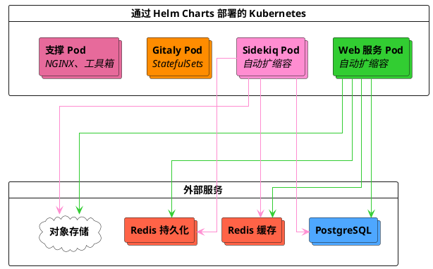



- Tier: 基础版，专业版，旗舰版
- Offering: 私有化部署
- Status: 测试版



Cloud Native First 参考架构专为现代云原生部署模式设计，提供四种标准化规模（S/M/L/XL），根据工作负载特征进行划分。这些架构将所有极狐GitLab 组件部署在 Kubernetes 中，而 PostgreSQL、Redis 和对象存储则使用外部第三方解决方案，包括托管服务或本地部署选项。

> [!note]
> 这些架构目前处于 [beta](../../policy/development_stages_support.md#beta) 阶段。我们欢迎反馈，并将根据实际生产使用数据持续优化规范。

## 架构概览

Cloud Native First 架构将极狐GitLab 组件部署在 Kubernetes 和外部服务上：

**Kubernetes 组件：**

- **Web 服务** - 处理 web 请求
- **Sidekiq** - 处理后台任务
- **Gitaly** - 使用带持久卷的 StatefulSets 管理极狐GitLab 仓库
- **支撑服务** - NGINX Ingress、工具箱及监控组件

> [!note]
> 在 Kubernetes 上部署 Gitaly 时，Gitaly 仅支持分片（非集群）配置。你可以通过 [客户端重试](../settings/gitaly_timeouts.md) 实现 Gitaly 的零停机升级。每个 Gitaly Pod 对于其所服务的仓库而言是一个单点故障。
> 当前不支持在 Kubernetes 上部署 Gitaly 集群（Praefect）。
>
> 如果你需要高可用且支持自动故障转移的 Gitaly，请考虑 [Cloud Native 混合架构](_index.md#cloud-native-hybrid)，该架构在虚拟机中部署 Gitaly 集群，同时将无状态组件运行在 Kubernetes 中。关于 Kubernetes 上 Gitaly 的要求和限制，请参阅 [Kubernetes 上的 Gitaly](../gitaly/kubernetes.md#requirements)。

**外部服务：**

- **PostgreSQL** - 托管数据库服务，可搭配可选的备用副本以实现高可用，并添加读取副本以获得更好的稳定性和性能。
- **Redis** - 分离的缓存和持久化实例，每个实例均可搭配可选的备用副本以实现高可用。
- **对象存储** - 如 S3、Google Cloud Storage、Azure Blob Storage 等对象存储服务，用于存储产物和软件包。

有关推荐的托管服务提供商（例如 GCP Cloud SQL、AWS RDS、Azure Database 等），请参阅 [推荐云提供商及服务](_index.md#recommended-cloud-providers-and-services)。

## 可用架构

这些架构围绕代表典型生产工作负载模式的目标 RPS 范围设计。RPS 目标作为起点，你的具体容量需求取决于工作负载构成和使用模式。有关 RPS 组成及何时需要调整的指导，请参阅 [理解 RPS 构成](sizing.md#understanding-rps-composition-and-workload-patterns)。

| 规模 | 目标 RPS | 适用工作负载 |
|------|------------|-------------------|
| S | ≤100 | 开发活动轻量、自动化极少的团队 |
| M | ≤200 | 开发速度中等、使用标准 CI/CD 的组织 |
| L | ≤500 | 开发活动繁重、自动化程度高的大型团队 |
| XL | ≤1000 | 工作负载密集、集成广泛的企业部署 |

有关确定预期负载及选择合适规模的详细指导，请参阅 [参考架构规模选择指南](sizing.md)。

## 主要优势

Cloud Native First 架构提供了：

- **自愈合基础设施** - Kubernetes 自动重启故障 Pod，并将工作负载重新调度到健康节点上
- **动态资源扩缩容** - Horizontal Pod Autoscaler 和 Cluster Autoscaler 根据实际需求调整容量
- **简化部署** - 极狐GitLab 组件无需传统的虚拟机管理，全部通过 Kubernetes 编排
- **降低运维开销** - PostgreSQL、Redis 和对象存储的托管服务省去了数据库和缓存维护工作
- **内置高可用** - 多可用区部署，所有组件均支持自动故障转移
- **更高成本效益** - 资源可在低需求时段缩减，同时在高峰时保持足够容量

## 要求

在部署 Cloud Native First 架构之前，请确保已具备：

- 一个受支持的 [Kubernetes 集群](https://gitlab.cn/docs/charts/installation/cloud/) 及其他 [Charts 前置条件](https://gitlab.cn/docs/charts/installation/tools/)
- 已配置数据库、用户及扩展的外部 PostgreSQL 实例
- 外部 Redis 实例
- 对象存储服务（例如 S3、Google Cloud Storage、Azure Blob Storage 等）

有关包括网络、机器类型及云提供商服务在内的完整要求，请参阅 [参考架构要求](_index.md#requirements)。

有关 Kubernetes 上 Gitaly 的特定要求和限制，请参阅 [Kubernetes 上 Gitaly 的要求](../gitaly/kubernetes.md#requirements)。

## 小型 (S)

**目标负载：**≤100 RPS | 整体负载轻量

**工作负载特征：**

- **总 RPS 范围：**≤100 请求/秒
- **极狐GitLab 操作：**轻量推送和拉取活动
- **仓库大小：**不适合活跃使用的单仓库
- **CI/CD 使用：**少量并发流水线执行
- **API 流量：**承载自动化工作负载的能力有限
- **用户模式：**对突发流量有一定适应能力

### Kubernetes 组件

| 组件 | 每 Pod 资源 | 最小 Pods/Workers | 最大 Pods/Workers | 示例节点配置 |
|-----------|------------------|------------------|------------------|---------------------------|
| Web 服务 | 2 vCPU, 3 GB (request), 4 GB (limit) | 12 pods (24 workers) | 18 pods (36 workers) | GCP: 6 × n2-standard-8 AWS: 6 × c6i.2xlarge |
| Sidekiq | 900m vCPU, 2 GB (request), 4 GB (limit) | 8 workers | 12 workers | GCP: 3 × n2-standard-4 AWS: 3 × m6i.xlarge |
| Gitaly | 7 vCPU, 30 GB (request and limit) | 3 pods | 3 pods | GCP: 3 × n2-standard-8 AWS: 3 × m6i.2xlarge |
| 支撑服务 | 各服务资源不同 | 12 vCPU, 48 GB | 12 vCPU, 48 GB | GCP: 3 × n2-standard-4 AWS: 3 × c6i.xlarge |

### Pod 扩缩容配置

| 组件 | 最小 → 最大 Pods | 最小 → 最大 Workers | 每 Pod 资源 | 每 Pod 的 Workers |
|-----------|----------------|-------------------|-------------------|-----------------|
| Web 服务 | 12 → 18 | 24 → 36 | 2 vCPU, 3 GB (request), 4 GB (limit) | 2 |
| Sidekiq | 8 → 12 | 8 → 12 | 900m vCPU, 2 GB (request), 4 GB (limit) | 1 |
| Gitaly | 3（不自动扩缩） | 不适用 | 7 vCPU, 30 GB (request and limit) | 不适用 |

**Gitaly 备注：** Git cgroups：27 GB，缓冲区：3 GB。仓库 cgroups 设置为 1。调优指导见 [Gitaly cgroups 配置](#gitaly-cgroups-configuration)。

### 外部服务

| 服务 | 配置 | GCP 等效配置 | AWS 等效配置 |
|---------|---------------|----------------|----------------|
| PostgreSQL | 8 vCPU, 32 GB | n2-standard-8 | m6i.2xlarge |
| Redis - 缓存 | 2 vCPU, 8 GB | n2-standard-2 | m6i.large |
| Redis - 持久化 | 2 vCPU, 8 GB | n2-standard-2 | m6i.large |
| 对象存储 | 云提供商服务 | Google Cloud Storage | Amazon S3 |

## 中型 (M)

**目标负载：**≤200 RPS | 整体负载中等

**工作负载特征：**

- **总 RPS 范围：**≤200 请求/秒
- **极狐GitLab 操作：**中量推送和拉取活动
- **仓库大小：**支持轻度使用的单仓库。更大或使用频繁的单仓库可能需要性能优化参数
- **CI/CD 使用：**中等并发流水线
- **API 流量：**支持常规自动化工作负载
- **用户模式：**对用量波动具有良好的适应能力

### Kubernetes 组件

| 组件 | 每 Pod 资源 | 最小 Pods/Workers | 最大 Pods/Workers | 示例节点配置 |
|-----------|------------------|------------------|------------------|---------------------------|
| Web 服务 | 2 vCPU, 3 GB (request), 4 GB (limit) | 28 pods (56 workers) | 42 pods (84 workers) | GCP: 6 × n2-standard-16 AWS: 6 × c6i.4xlarge |
| Sidekiq | 900m vCPU, 2 GB (request), 4 GB (limit) | 16 workers | 24 workers | GCP: 3 × n2-standard-8 AWS: 3 × m6i.2xlarge |
| Gitaly | 15 vCPU, 62 GB (request and limit) | 3 pods | 3 pods | GCP: 3 × n2-standard-16 AWS: 3 × m6i.4xlarge |
| 支撑服务 | 各服务资源不同 | 12 vCPU, 48 GB | 12 vCPU, 48 GB | GCP: 3 × n2-standard-4 AWS: 3 × c6i.xlarge |

### Pod 扩缩容配置

| 组件 | 最小 → 最大 Pods | 最小 → 最大 Workers | 每 Pod 资源 | 每 Pod 的 Workers |
|-----------|----------------|-------------------|-------------------|-----------------|
| Web 服务 | 28 → 42 | 56 → 84 | 2 vCPU, 3 GB (request), 4 GB (limit) | 2 |
| Sidekiq | 16 → 24 | 16 → 24 | 900m vCPU, 2 GB (request), 4 GB (limit) | 1 |
| Gitaly | 3（不自动扩缩） | 不适用 | 15 vCPU, 62 GB (request and limit) | 不适用 |

**Gitaly 备注：** Git cgroups：56 GB，缓冲区：6 GB。仓库 cgroups 设置为 1。调优指导见 [Gitaly cgroups 配置](#gitaly-cgroups-configuration)。

### 外部服务

| 服务 | 配置 | GCP 等效配置 | AWS 等效配置 |
|---------|---------------|----------------|----------------|
| PostgreSQL | 16 vCPU, 64 GB | n2-standard-16 | m6i.4xlarge |
| Redis - 缓存 | 2 vCPU, 8 GB | n2-standard-2 | m6i.large |
| Redis - 持久化 | 2 vCPU, 8 GB | n2-standard-2 | m6i.large |
| 对象存储 | 云提供商服务 | Google Cloud Storage | Amazon S3 |

## 大型 (L)

**目标负载：**≤500 RPS | 整体负载繁重

**工作负载特征：**

- **总 RPS 范围：**≤500 请求/秒
- **极狐GitLab 操作：**大量推送和拉取活动
- **仓库大小：**支持中度使用的单仓库。更大或使用频繁的单仓库可能需要性能优化参数
- **CI/CD 使用：**大量流水线使用，依赖于 Sidekiq 适当扩容
- **API 流量：**支持大规模自动化工作负载
- **用户模式：**对用量波动适应力强

### Kubernetes 组件

| 组件 | 每 Pod 资源 | 最小 Pods/Workers | 最大 Pods/Workers | 示例节点配置 |
|-----------|------------------|------------------|------------------|---------------------------|
| Web 服务 | 2 vCPU, 3 GB (request), 4 GB (limit) | 56 pods (112 workers) | 84 pods (168 workers) | GCP: 6 × n2-standard-32 AWS: 6 × c6i.8xlarge |
| Sidekiq | 900m vCPU, 2 GB (request), 4 GB (limit) | 32 workers | 48 workers | GCP: 6 × n2-standard-8 AWS: 6 × m6i.2xlarge |
| Gitaly | 31 vCPU, 126 GB (request and limit) | 3 pods | 3 pods | GCP: 3 × n2-standard-32 AWS: 3 × m6i.8xlarge |
| 支撑服务 | 各服务资源不同 | 12 vCPU, 48 GB | 12 vCPU, 48 GB | GCP: 3 × n2-standard-4 AWS: 3 × c6i.xlarge |

### Pod 扩缩容配置

| 组件 | 最小 → 最大 Pods | 最小 → 最大 Workers | 每 Pod 资源 | 每 Pod 的 Workers |
|-----------|----------------|-------------------|-------------------|-----------------|
| Web 服务 | 56 → 84 | 112 → 168 | 2 vCPU, 3 GB (request), 4 GB (limit) | 2 |
| Sidekiq | 32 → 48 | 32 → 48 | 900m vCPU, 2 GB (request), 4 GB (limit) | 1 |
| Gitaly | 3（不自动扩缩） | 不适用 | 31 vCPU, 126 GB (request and limit) | 不适用 |

**Gitaly 备注：** Git cgroups：120 GB，缓冲区：6 GB。仓库 cgroups 设置为 1。调优指导见 [Gitaly cgroups 配置](#gitaly-cgroups-configuration)。

### 外部服务

| 服务 | 配置 | GCP 等效配置 | AWS 等效配置 |
|---------|---------------|----------------|----------------|
| PostgreSQL | 32 vCPU, 128 GB | n2-standard-32 | m6i.8xlarge |
| Redis - 缓存 | 2 vCPU, 16 GB | n2-highmem-2 | r6i.large |
| Redis - 持久化 | 2 vCPU, 16 GB | n2-highmem-2 | r6i.large |
| 对象存储 | 云提供商服务 | Google Cloud Storage | Amazon S3 |

## 超大 (XL)

**目标负载：**≤1000 RPS | 整体负载密集

**工作负载特征：**

- **总 RPS 范围：**≤1000 请求/秒
- **极狐GitLab 操作：**密集的推送和拉取活动
- **仓库大小：**支持重度使用的单仓库。更大或使用极其频繁的单仓库可能需要性能优化参数
- **CI/CD 使用：**密集的 CI/CD 工作负载
- **API 流量：**大量的自动化和集成流量
- **用户模式：**针对多种访问模式设计

### Kubernetes 组件

| 组件 | 每 Pod 资源 | 最小 Pods/Workers | 最大 Pods/Workers | 示例节点配置 |
|-----------|------------------|------------------|------------------|---------------------------|
| Web 服务 | 2 vCPU, 3 GB (request), 4 GB (limit) | 110 pods (220 workers) | 165 pods (330 workers) | GCP: 6 × n2-standard-64 AWS: 6 × c6i.16xlarge |
| Sidekiq | 900m vCPU, 2 GB (request), 4 GB (limit) | 64 workers | 96 workers | GCP: 6 × n2-standard-16 AWS: 6 × m6i.4xlarge |
| Gitaly | 63 vCPU, 254 GB (request and limit) | 3 pods | 3 pods | GCP: 3 × n2-standard-64 AWS: 3 × m6i.16xlarge |
| 支撑服务 | 各服务资源不同 | 24 vCPU, 96 GB | 24 vCPU, 96 GB | GCP: 3 × n2-standard-8 AWS: 3 × c6i.2xlarge |

### Pod 扩缩容配置

| 组件 | 最小 → 最大 Pods | 最小 → 最大 Workers | 每 Pod 资源 | 每 Pod 的 Workers |
|-----------|----------------|-------------------|-------------------|-----------------|
| Web 服务 | 110 → 165 | 220 → 330 | 2 vCPU, 3 GB (request), 4 GB (limit) | 2 |
| Sidekiq | 64 → 96 | 64 → 96 | 900m vCPU, 2 GB (request), 4 GB (limit) | 1 |
| Gitaly | 3（不自动扩缩） | 不适用 | 63 vCPU, 254 GB (request and limit) | 不适用 |

**Gitaly 备注：** Git cgroups：248 GB，缓冲区：6 GB。仓库 cgroups 设置为 1。调优指导见 [Gitaly cgroups 配置](#gitaly-cgroups-configuration)。

### 外部服务

| 服务 | 配置 | GCP 等效配置 | AWS 等效配置 |
|---------|---------------|----------------|----------------|
| PostgreSQL | 64 vCPU, 256 GB | n2-standard-64 | m6i.16xlarge |
| Redis - 缓存 | 2 vCPU, 16 GB | n2-highmem-2 | r6i.large |
| Redis - 持久化 | 2 vCPU, 16 GB | n2-highmem-2 | r6i.large |
| 对象存储 | 云提供商服务 | Google Cloud Storage | Amazon S3 |

## 附加信息

本节提供部署和运维 Cloud Native First 架构的补充指导，包括机器类型选择、组件相关注意事项及扩缩容策略。

### 机器类型指导

这里列出的机器类型是验证和测试中使用的示例。你可以根据需要使用：

- 更新一代的机器类型
- 基于 ARM 的实例（例如 AWS Graviton）
- 具有相似或更高规格的不同机器系列
- 根据具体需求定制的机器类型

请勿使用可突增实例类型，因为其性能波动较大。

更多信息，请参阅 [支持的机器类型](_index.md#supported-machine-types)。

### Gitaly 注意事项

在 Cloud Native First 架构中，运行于 Kubernetes 的 Gitaly 使用 StatefulSets，具有以下规范：

- **独占节点放置** - Gitaly Pod 部署在专用节点上，避免资源争抢（noisy neighbor）。
- **资源分配** - Pod 的 requests 和 limits 设置为节点容量减去系统开销（预留 2 GB 内存、1 vCPU 给 Kubernetes 系统进程）。
- **Git cgroups 内存** - 默认分配 10% 的缓冲区，较大 Pod 的缓冲区上限为 6 GB。例如，小型架构分配 27 GB 给 Git cgroups，并附带 3 GB 缓冲区；而中型及更大架构采用 6 GB 上限（中型为 56 GB cgroups 加 6 GB 缓冲区）。

**Gitaly 部署模式：**

按照设计，运行在 Kubernetes 上的 Gitaly（非集群模式）对于每个 Pod 所存储的仓库而言是一个单点故障服务。数据的存储和提供均来自每个 Pod 的一个实例。每个 Gitaly Pod 管理自己的一组仓库，通过仓库分布实现极狐GitLab 存储的水平扩容。

当前不支持在 Cloud Native First 架构中使用 Gitaly 集群（Praefect）。有关 Kubernetes 中 Gitaly 部署限制的背景信息，请参阅 [Kubernetes 上的 Gitaly](../gitaly/kubernetes.md)。

**仓库分布：**

当配置了多个 Gitaly 存储（例如 `default`、`storage1`、`storage2`）时，极狐GitLab 默认将所有新仓库创建在 `default` 存储上。要将仓库分布到所有 Gitaly Pod，需要配置存储权重来平衡负载。

有关配置仓库存储权重的指导，请参阅 [配置新仓库的存储位置](../repository_storage_paths.md#configure-where-new-repositories-are-stored)。

#### Gitaly cgroups 配置

Gitaly 使用 [cgroups](../gitaly/cgroups.md) 来防止单个极狐GitLab 操作导致资源耗尽。默认配置将仓库 cgroup 数量设置为 1，这是一个起点，允许任何单个仓库通过超分配使用全部 Pod 资源。

然而，此配置并非对所有工作负载都最优。对于活跃仓库众多或有特定资源隔离需求的环境，你应该根据实际使用模式调优 cgroups 配置，包括调整仓库 cgroup 数量和内存分配。

有关测量、调优和配置 Gitaly cgroups 的详细指导，请参阅 [Gitaly cgroups](../gitaly/cgroups.md)。

对于大型单仓库（超过 2 GB）或密集的极狐GitLab 工作负载，可能还需要对 Gitaly 进行额外调整。详细指导请参阅 [参考架构规模选择指南](sizing.md)。

### 外部服务注意事项

- PostgreSQL 可以部署备用副本以实现高可用。可以添加读取副本以获得更好的稳定性和性能。较大规模的环境（L、XL）更受益于读取副本来分散数据库负载。
- Redis 实例可以部署备用副本以实现高可用。在 GCP 上，Memorystore 实例仅通过内存进行配置。机器规格仅供参考。
- 对于所有涉及配置实例的云提供商服务，建议至少实现三个节点，分布在三个不同的可用区，以符合弹性云架构实践。

### 自动扩缩容和最小 Pod 数量

所有架构均使用 Kubernetes Horizontal Pod Autoscaler（HPA）和 Cluster Autoscaler 来管理容量：

- **Web 服务** - 基于 CPU 利用率自动扩缩容，设置保守的最小 Pod 数量
- **Sidekiq** - 基于 CPU 利用率自动扩缩容
- **Cluster Autoscaler** - 根据 Pod 的资源请求自动供应和移除节点

最小 Pod 数量设置为最大值的约 2/3，以在成本效率与性能可靠性之间取得平衡，这一设置基于内部测试，旨在实现以下目标：

- 在需求增长时可及时扩容
- 在节点故障或升级期间保持足够容量
- 在低需求时期优化成本

如果你对负载模式有深入了解，可以根据需要调整最低数量：

- **提高最低数量**：适用于有急剧流量峰值或严格性能 SLA 的环境
- **降低最低数量**：在监控显示持续负载始终低于默认值时进行

### 高级扩缩容

Cloud Native First 架构的设计允许超出其基本规格进行扩容。如果你的环境存在以下情况，可能需要调整容量：

- 持续高于所列 RPS 目标的吞吐量
- 非典型的工作负载构成（参见 [理解 RPS 构成](sizing.md#understanding-rps-composition-and-workload-patterns)）
- 大型单仓库（超过 2 GB）
- 大量额外的工作负载
- 大量使用极狐GitLab Duo Agent Platform

不同组件类型需要采用不同的扩缩策略。

#### 水平扩缩容（Web 服务和 Sidekiq）

要增加容量，可以通过调整最大副本数和节点池容量进行水平扩容：

- **Web 服务** - 在 Helm 配置值中增加 `maxReplicas`，并在 Web 服务节点池中添加相应节点
- **Sidekiq** - 增加 `maxReplicas` 以提高任务处理吞吐量，并在 Sidekiq 节点池中添加节点

对于这些无状态组件，水平扩容是推荐的做法。

#### 垂直扩缩容（PostgreSQL、Redis、Gitaly）

对于有状态组件，则需要升级实例或 Pod 规格：

- **PostgreSQL 和 Redis** - 通过托管服务提供商升级到更大的实例类型。
- **Gitaly** - 增加每个 Pod 的 CPU 和内存规格。这需要 Gitaly 节点池中配置更大的节点类型，并相应调整 Git cgroups 内存分配。

#### Sidekiq 队列优化

默认情况下，Sidekiq 在一个队列中处理所有类型的任务。对于工作负载模式多样的环境，你可以根据任务特征配置分离的队列：

- **高紧急度队列** - 用于时间敏感型任务，例如 CI 流水线处理和 webhook 发送
- **CPU 密集型队列** - 用于计算密集型任务，并可调整并发设置
- **默认队列** - 用于标准后台处理

队列分离能够提高任务处理的可靠性，防止低优先级任务阻塞时间敏感操作，这在有大量自动化工作负载的大规模环境（L、XL）中尤其有效。

有关配置 Sidekiq 队列的更多信息，请参阅 [处理特定任务类](../sidekiq/processing_specific_job_classes.md)。

#### 为极狐GitLab Duo Agent Platform 进行扩缩容

极狐GitLab Duo Agent Platform 引入了超出标准极狐GitLab 工作负载的额外基础设施需求。有关 Agent Platform 采纳情况的监控和扩容详细指导，请参阅 [为极狐GitLab Duo Agent Platform 进行扩容](_index.md#scaling-for-gitlab-duo-agent-platform)。

#### 扩缩容注意事项

当对任何组件进行大幅扩缩容时：

- 监控依赖组件的资源饱和情况。Web 服务或 Sidekiq 的负载增加可能会影响 PostgreSQL 和 Gitaly。
- 先在非生产环境中测试扩缩容变更。
- 协同扩缩相互依赖的组件，避免在服务之间产生新的瓶颈。

全面的扩缩容指导请参阅 [扩容环境](_index.md#scaling-an-environment)。

## 部署

Cloud Native First 架构可以直接通过 Helm Charts 和外部服务提供商部署，或通过极狐GitLab Environment Toolkit 部署。

### 极狐GitLab Environment Toolkit

[极狐GitLab Environment Toolkit](https://jihulab.com/gitlab-cn/gitlab-environment-toolkit) 提供自动化部署，支持：

- 用于云资源的 Infrastructure as Code（Terraform）
- 自动化 Helm Chart 配置
- 针对每种架构规模的预先验证设置
- 简化的升级和维护

部署说明请参阅 [极狐GitLab Environment Toolkit 文档](https://jihulab.com/gitlab-cn/gitlab-environment-toolkit/-/blob/main/README.md)。

### 手动部署

手动部署的前提条件：

- 已配置所需数据库、用户和权限的外部 PostgreSQL
- 已配置并可访问的外部 Redis 实例
- 已创建的对象存储桶
- 已按需求创建认证相关的 Kubernetes 密钥（如 PostgreSQL 密码、Redis 密码、对象存储凭证、极狐GitLab 密钥）

有关详细的先决条件和密钥配置，请参阅 [极狐GitLab Chart 先决条件](https://gitlab.cn/docs/charts/installation/tools/) 和 [配置密钥](https://gitlab.cn/docs/charts/installation/secrets/)。

使用 Helm Charts 进行手动部署：
1.  按照先决条件中的说明，设置所需的外部服务和密钥
1.  使用适当的节点池和自动扩缩器配置 Kubernetes 集群
1.  应用 [Helm Chart 配置](#helm-chart-configurations)部分中显示的 Helm 值配置
1.  使用 `helm install` 部署极狐GitLab

有关详细的手动部署步骤，请参见[在 Kubernetes 上安装极狐GitLab](https://gitlab.cn/docs/charts/installation/)。

## Helm Chart 配置

有关完整的 Helm Chart 配置示例和详细的部署指南，请参见[GitLab Charts 代码仓](https://gitlab.com/gitlab-org/charts/gitlab/-/tree/master/examples/ref)。

云原生优先架构的关键配置领域：

*   **资源规格** - Pod 的 CPU 和内存限制与上述每种架构规模中的规格相匹配
*   **自动扩缩容** - HPA 配置将最小 Pod 数设置为最大值的 2/3，并采用基于 CPU 的扩缩容目标
*   **节点放置** - 节点选择器确保工作负载部署到适当的节点池（例如：`webservice`、`sidekiq`、`gitaly`、`support`）
*   **外部服务** - PostgreSQL、Redis 和对象存储的连接详细信息
*   **Gitaly** - 使用 cgroups、持久化和存储分发的 StatefulSet 配置

有关特定架构的副本数量和资源值，请参考上述每个规模部分中的规格。

> [!note]
> 云原生优先架构处于 Beta 阶段。随着该功能向 GA 推进，特定的 Helm Chart 配置示例将添加到 Charts 代码仓中。使用上述每种架构规模部分中的规格来构建你的 Helm 值配置。

## 后续步骤

部署后，环境通常需要监控和调优以匹配实际的工作负载模式。

### 监控和验证

1.  **监控资源利用率** - 使用 [Prometheus](../monitoring/prometheus/_index.md) 追踪所有组件的 CPU、内存和队列深度
1.  **验证 RPS 假设** - 将你的实际 [RPS 细分](sizing.md#extract-peak-traffic-metrics)与假设的 80/10/10 组成进行比较
1.  **识别潜在的调整** - 查找持续超过 70% 利用率的组件
1.  **审查 Gitaly cgroups** - 考虑根据你的代码仓访问模式调整[代码仓 cgroup 计数](../gitaly/cgroups.md)

### 根据需要调整

参考架构是起点。许多环境可以从以下方面的调整中受益：

*   **实际工作负载组成** - 如果你的 API/Web/Git 分割与典型模式显著不同，请参见[了解 RPS 组成](sizing.md#understanding-rps-composition-and-workload-patterns)
*   **代码仓特征** - 单体仓库大小、克隆频率和访问模式可能需要[特定于组件的调整](sizing.md#identify-component-adjustments)
*   **增长模式** - 用户数量增加、CI/CD 扩展或自动化扩缩

有关特定于组件的调整指南，请参见[高级扩缩](#advanced-scaling)。

### 配置可选功能

你可能需要根据你的需求配置极狐GitLab 的其他可选功能。有关更多信息，请参见[安装极狐GitLab 后的步骤](../../install/next_steps.md)。

> [!note]
> 可选功能可能需要额外的容量。有关要求，请参见特定功能的文档。