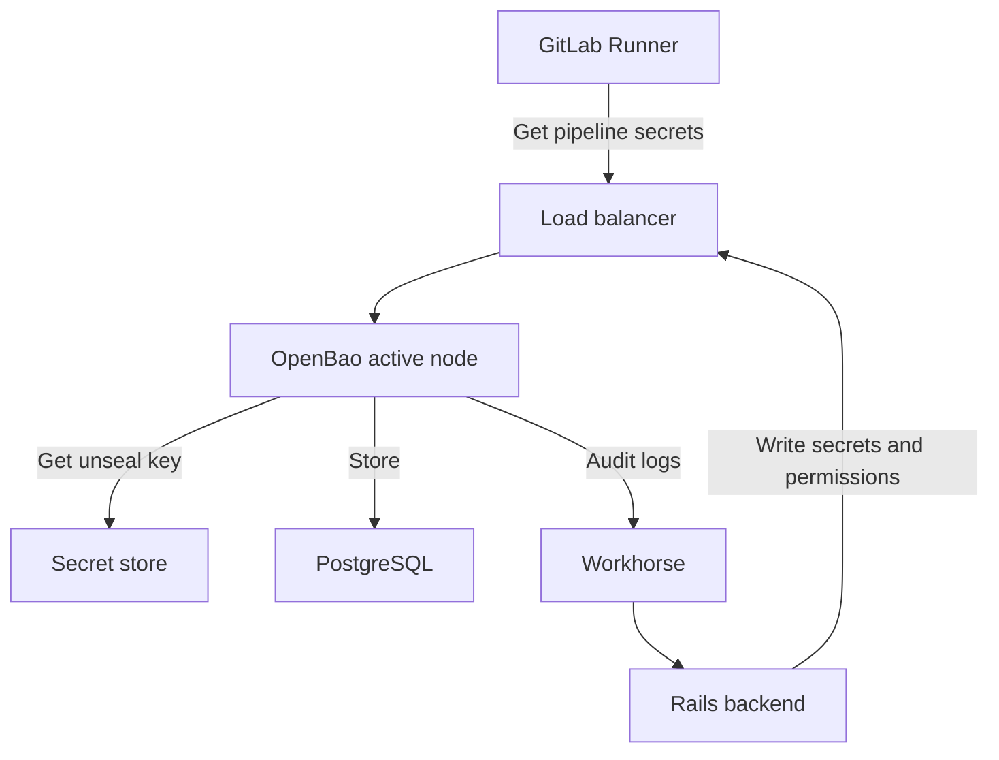



- Tier: 旗舰版
- Offering: 私有化部署
- Status: 实验





- 在极狐GitLab 18.8 中作为实验特性引入，并在极狐GitLab 18.8 中以封闭测试的形式提供给部分初始测试者。



[极狐GitLab 秘密管理器](../../ci/secrets/secrets_manager/_index.md) 使用 [OpenBao](https://openbao.org/)，一个开源的秘密管理解决方案。OpenBao 为您的极狐GitLab 实例中使用的密钥提供安全存储、访问控制和生命周期管理。

从极狐GitLab 秘密管理器获取秘密的极狐GitLab CI/CD 作业必须使用 18.6 或更高版本的 [极狐GitLab Runner](https://gitlab.cn/docs/runner/#gitlab-runner-versions)。

<a id="openbao-architecture"></a>

## OpenBao 架构

OpenBao 作为一个可选组件与极狐GitLab 集成，与现有的极狐GitLab 服务并行运行。

- Rails 后端和 Runner 通过负载均衡器连接到 OpenBao API。
- OpenBao 将数据存储在 PostgreSQL 中。
  Helm chart 将 OpenBao 配置为在同一 PostgreSQL 实例上使用单独的逻辑数据库。
  在 Helm chart 中使用 `global.openbao.psql` 配置连接。
- OpenBao 从密钥存储中获取解封密钥。
- OpenBao 从由 Helm chart 挂载的 Kubernetes 密钥中读取解封密钥。
- 当审计日志启用时，OpenBao 将审计日志发送到 Rails 后端。



OpenBao 以单一活动节点运行，处理所有请求，并可选择多个备用节点，在活动节点故障时接管。

<a id="install-openbao"></a>

## 安装 OpenBao

先决条件：

- 您必须拥有实例的管理员访问权限。
- 您必须运行极狐GitLab 18.8 或更高版本。
- 您必须拥有一个 Kubernetes 集群。
- 您必须拥有一个外部（非 Omnibus）PostgreSQL 实例。
  该外部 PostgreSQL 实例是云原生部署的极狐GitLab Helm chart 所必需的，并非特指 OpenBao。OpenBao 在该实例上使用单独的逻辑数据库。

要安装 OpenBao，请使用 [用于 Kubernetes 部署的 OpenBao Helm chart](https://gitlab.cn/docs/charts/charts/openbao/)。

安装后，通过遵循 [极狐GitLab 秘密管理器用户文档](../../ci/secrets/secrets_manager/_index.md) 测试秘密操作，验证 OpenBao 是否正常工作。

<a id="sizing-recommendations"></a>

## 规模调整建议

OpenBao 资源需求取决于您的极狐GitLab 实例大小和秘密使用模式。

这些建议是经过验证的起点。监控您的部署，并根据实际使用模式调整资源。您的需求将根据获取秘密的 CI/CD 作业数量以及启用秘密管理器的群组和项目数量而有所不同。

<a id="pod-resources"></a>

### Pod 资源

OpenBao 以单一活动节点运行，处理所有请求。
额外的副本仅提供高可用故障转移。
备用节点不提供读取服务，因为当连接到 PostgreSQL 数据库时，OpenBao 不支持水平读扩展（HRS）。

| 秘密获取数/秒 | CPU 请求 | 内存请求 | 副本 |
|------------------|-------------|----------------|----------|
| 最多 3          | 500m        | 2 GB           | 2        |
| 最多 6          | 500m        | 3 GB           | 2        |
| 最多 12         | 500m        | 4 GB           | 2        |
| 最多 30         | 500m        | 9 GB           | 2        |
| 最多 60         | 1,000m      | 16 GB          | 2        |
| 最多 150        | 2,000m      | 31 GB          | 2        |

<a id="estimate-your-secret-fetch-rate"></a>

#### 估算秘密获取速率

要确定适用哪一行，请估算每秒的秘密获取数：

```plaintext
fetches/s = Git Pull RPS × adoption rate × 3
```

其中：

- `Git Pull RPS` 是极狐GitLab 实例的峰值 Git Pull 吞吐量。
  您可以从现有环境监控中衡量此指标，
  参见
  [提取峰值流量指标](../reference_architectures/sizing.md#extract-peak-traffic-metrics)。
- `adoption rate` 是使用秘密管理器的 CI/CD 作业的比例
  （例如，0.05 表示 5%，0.20 表示 20%，或 0.50 表示 50%）。
- `3` 是假设每个使用秘密管理器的作业平均获取的秘密数量。

选择 **Secret fetches/s** 满足或略高于您结果的所在行。
例如，一个部署，测量到的 Git pull RPS 为 20，采用率为 20%：
`20 × 0.20 × 3 = 12 次获取/秒`。至少使用 **最多 12** 所在行。

部署后，根据实际使用情况验证您的估算。
使用 [监控查询](#monitor-your-openbao-deployment) 测量资源使用情况，并在超过阈值时扩展到下一行。

<a id="how-resources-are-calculated"></a>

### 资源计算方式

**CPU** 受 CI/CD 作业获取秘密的频率驱动。
秘密写操作（创建或更新秘密）相对于流水线量来说是很少的，对 CPU 负载贡献可忽略不计。
表格使用 Git 克隆速率（Git Pull RPS）作为 CI 作业速率的代理，
因为每个 CI/CD 作业都从一次 Git 克隆开始。
有关公式，请参阅 [估算秘密获取速率](#estimate-your-secret-fetch-rate)。
将 CPU 限制设置为 CPU 请求的两倍。这为启动和配置峰值提供了突发余量，而不会在稳态时过度预留节点资源。

**内存** 受 OpenBao 命名空间数量驱动，这与启用了秘密管理器的极狐GitLab 群组和项目数量相对应。
每个命名空间大约分配 5 MB，加上 1 GB 安全余量，
最小为 2 GB。
将内存限制设置为与内存请求相等（Guaranteed QoS 类）。
OpenBao 超过其内存限制时会立即崩溃，没有优雅降级。

**副本** 仅提供高可用故障转移。所有部署使用 2 个副本。
OpenBao 在使用 PostgreSQL 存储后端时不支持水平读扩展（HRS），
因此额外的副本不提供吞吐量好处。

<a id="database-resources"></a>

### 数据库资源

OpenBao 将其数据存储在单独的 PostgreSQL 数据库中。
您可以将其与极狐GitLab 数据库共置在同一 PostgreSQL 服务器上。
除了 [参考架构 PostgreSQL 建议](../reference_architectures/_index.md) 之外，不需要额外的数据库计算容量。

<a id="database-connection-pool"></a>

#### 数据库连接池

OpenBao Helm chart 配置以下 PostgreSQL 连接池默认值：

| 设置                                              | 默认值 |
|------------------------------------------------------|---------------|
| `config.storage.postgresql.maxParallel`              | 5             |
| `config.storage.postgresql.maxIdleConnections`       | 2             |

除非在监控中观察到数据库连接等待时间，否则不要增加这些值。

<a id="database-storage"></a>

#### 数据库存储

数据库存储需求主要取决于秘密总数。
每个秘密，包括其元数据和存储版本，大约需要 13 KB 存储。

| 总秘密数  | 预估存储 |
|----------------|-------------------|
| 10,000         | ~130 MB           |
| 50,000         | ~650 MB           |
| 100,000        | ~1.3 GB           |
| 200,000        | ~2.6 GB           |

存储增长对于所有参考架构层来说都是微不足道的。
分配 5 到 10 GB 数据库存储提供充足余量。

<a id="monitor-your-openbao-deployment"></a>

## 监控 OpenBao 部署

使用以下查询验证您的部署规模是否合适，并检测何时需要扩展。

<a id="cpu-utilization"></a>

### CPU 利用率

测量 OpenBao CPU 使用量：

```prometheus
sum(rate(container_cpu_usage_seconds_total{container="openbao-server"}[5m]))
```

结果以 CPU 核心为单位。乘以 1,000 转换为毫核，以便与规模调整表中的 CPU 请求值进行比较。
如果 CPU 利用率持续超过 CPU 请求的 50%，请考虑扩展到规模调整表中的下一行。

<a id="memory-utilization"></a>

### 内存利用率

测量 OpenBao 内存使用量：

```prometheus
sum(container_memory_working_set_bytes{container="openbao-server"})
```

结果以字节为单位。内存随着群组和项目启用秘密管理器而增长，每个命名空间大约 5 MB。重启后，随着 OpenBao 从数据库加载命名空间元数据，内存会稳定下来。

要计算正确的内存请求，请统计启用了秘密管理器的群组和项目数量，乘以 5 MB，然后加上 1 GB。如果结果超过当前内存请求，请更新您的 Pod 资源。如果内存在没有活动配置的情况下显示持续上升趋势，请调查潜在问题。

<a id="cpu-throttling"></a>

### CPU 限流

检测可能影响延迟的 CPU 限流：

```prometheus
sum(rate(container_cpu_cfs_throttled_periods_total{container="openbao-server"}[5m]))
/
sum(rate(container_cpu_cfs_periods_total{container="openbao-server"}[5m]))
```

限流比率高于 0.25（25%）表示 CPU 限制对于当前工作负载太低。
当 OpenBao 被限流时，等待 CPU 时间的 goroutine 会导致秘密获取延迟增加。

<a id="health-check-endpoints"></a>

### 健康检查端点

OpenBao 提供用于监控的健康检查端点：

- `<your-openbao-url>/v1/sys/health`：返回 OpenBao 的健康状态
- `<your-openbao-url>/v1/sys/seal-status`：返回封印状态

您可以将这些端点集成到您的监控系统中。

<a id="backup-and-restore"></a>

## 备份与恢复

OpenBao 将数据存储在 PostgreSQL 上单独的逻辑数据库中。将此数据库与您的常规极狐GitLab 备份一起备份，以确保在发生故障时可以恢复秘密。

有关 OpenBao 特定的详细备份和恢复过程，请参阅 [OpenBao 备份文档](https://gitlab.cn/docs/charts/charts/openbao/#back-up-openbao)。

<a id="recovery-key-management"></a>

## 恢复密钥管理

有关管理 OpenBao 恢复密钥的信息，包括存储、查看和使用它生成根令牌，请参阅 [恢复密钥管理](recovery_key.md)。

<a id="high-availability"></a>

## 高可用

OpenBao 使用单一活动节点架构。一个节点处理所有请求，备用节点在活动节点故障时提供自动故障转移。

<a id="failover"></a>

### 故障转移

备用节点在启动时加载所有命名空间元数据，因此提升为活动状态不需要额外的初始化。命名空间数量不影响故障转移时间。

对于生产部署：

- 至少运行两个 OpenBao 副本以实现冗余。
- 使用高可用的 PostgreSQL 后端。
- 使用 [监控查询](#monitor-your-openbao-deployment) 实施监控和告警。

<a id="upgrade-downtime"></a>

### 升级停机时间

OpenBao 不支持零停机升级。在升级期间，OpenBao 在启动时按顺序初始化每个命名空间。每个启用了秘密管理器的群组或项目都被计为一个命名空间。

升级大约需要每 1000 个命名空间 11 秒，外加 5 秒的基础时间。

当 OpenBao 实现按需命名空间加载时，升级停机时间将显著减少。
更多信息，请参阅
议题 595721。

<a id="geo-deployment"></a>

## Geo 部署

OpenBao 支持 [Geo](../geo/_index.md) 部署。OpenBao 部署在主站点和辅站点，但只有主站点运行活动的 OpenBao 节点。

<a id="openbao-behavior-in-geo"></a>

### Geo 中的 OpenBao 行为

在主站点，OpenBao 作为活动节点运行，连接到一个可写的 PostgreSQL 数据库。在辅站点，OpenBao 以备用模式运行，连接到一个 PostgreSQL 只读副本。

PostgreSQL 流式复制自动将所有 OpenBao 数据（秘密、策略、认证配置）从主站点复制到辅站点。

极狐GitLab 实例（主和辅）都连接到主 OpenBao URL。辅 OpenBao 部署保持备用状态，并在 Geo 故障转移期间，当辅 PostgreSQL 数据库变为可写时，被提升为活动状态。

在辅站点，OpenBao 记录 `failed to acquire lock` 和 `cannot execute INSERT in a read-only transaction` 错误。这些错误是预期的。OpenBao 无法在只读数据库上获取 HA 领导锁。

<a id="install-openbao-on-a-secondary-site"></a>

### 在辅站点安装 OpenBao

先决条件：

- 必须配置 Geo。更多信息，请参阅 [设置 Geo](../geo/setup/_index.md)。
- 必须在主站点上成功安装并运行 OpenBao，然后才能在辅站点部署。
  更多信息，请参阅 [安装 OpenBao](#install-openbao)。

1. 辅 OpenBao 必须使用与主站点相同的解封密钥来解密复制数据。
   从主集群将 `gitlab-openbao-unseal` Kubernetes 密钥复制到辅集群：

   ```shell
   kubectl --namespace gitlab get secret gitlab-openbao-unseal -o yaml
   ```

   将导出的密钥应用到辅集群。更多信息，请参阅
   [备份密钥](https://gitlab.cn/docs/charts/backup-restore/backup/#back-up-the-secrets)。

1. 如果您计划在故障转移期间将主域名的 DNS 记录指向辅站点，
   您可能希望提前相应地配置 OpenBao。
   配置 Helm chart，并将 `url` 和 `jwt_audience` 设置为主 OpenBao URL：

   ```yaml
   global:
     openbao:
       enabled: true
       url: https://openbao.<primary-domain>
       jwt_audience: https://openbao.<primary-domain>
   ```

   有关 chart 配置选项的更多信息，
   请参阅 [Geo 配置](https://gitlab.cn/docs/charts/charts/openbao/#geo-configuration)。

1. 在辅站点部署极狐GitLab Helm chart。OpenBao Pod 启动并保持备用模式。这是预期的。

1. 在辅集群上，检查 OpenBao Pod 是否正在运行：

   ```shell
   kubectl --namespace gitlab get pods -l app=openbao
   ```

   所有 Pod 应处于 `Running` 状态。辅 Pod 没有 `openbao-active: "true"` 标签。这是预期的。

1. 确认活动服务在辅集群上没有端点：

   ```shell
   kubectl --namespace gitlab get endpoints gitlab-openbao-active
   ```

   辅站点上端点为零是预期的。

1. 通过运行一个在辅站点上使用 [秘密管理器变量](../../ci/secrets/secrets_manager/_index.md) 的 CI 流水线来测试秘密管理器。

<a id="troubleshooting"></a>

## 故障排除

在使用秘密管理器时，您可能会遇到以下问题。

<a id="troubleshoot-geo-deployments"></a>

### 排查 Geo 部署问题

| 症状 | 原因 | 解决方法 |
|---------|-------|------------|
| 辅 OpenBao 日志中出现 `cipher: message authentication failed` 或 `unknown key ID` | 主站点和辅站点之间解封密钥不匹配 | 从主集群将 `gitlab-openbao-unseal` 复制到辅集群，并重启 OpenBao Pod。 |
| 辅 OpenBao 日志中出现 `failed to acquire lock` | OpenBao 在只读数据库上处于备用状态 | 预期行为。无需任何操作。 |
| 辅 OpenBao 日志中出现 `cannot execute INSERT in a read-only transaction` | OpenBao 尝试在只读副本上进行领导者选举 | 预期行为。无需任何操作。 |
| Geo 故障转移后 JWT 认证失败 | `jwt_audience` 与 OpenBao 中的 `boundAudiences` 不匹配 | 在两个站点都将 `jwt_audience` 设置为主 OpenBao URL。 |

<a id="diagnose-slow-secret-operations"></a>

### 诊断缓慢的秘密操作

当 CI/CD 作业获取秘密缓慢或秘密操作超时时，请使用此部分。

<a id="confirm-latency-is-elevated"></a>

#### 确认延迟已升高

使用以下查询测量平均请求延迟（以毫秒为单位）。
该查询可在任何流量级别（包括低流量部署）下工作：

```prometheus
rate(openbao_core_handle_request_sum[5m])
/
rate(openbao_core_handle_request_count[5m])
```

在正常负载下，所有请求类型的平均延迟通常为 3–7 毫秒。
如果平均延迟持续超过 20 毫秒，请进行调查。

当 OpenBao 正在主动处理请求时，使用以下查询获取 P99 延迟：

```prometheus
openbao_core_handle_request{quantile="0.99"}
```

正常 P99 低于 10 毫秒。当 OpenBao 空闲时，此查询将返回 `NaN`，因为摘要窗口中没有最近观察结果。在这种情况下，请使用基于速率的查询。

<a id="identify-potential-issues"></a>

#### 识别潜在问题

| 潜在问题             | 检查内容                   | 查询                                                                       | 阈值           | 操作                                                             |
|-----------------------------|---------------------------------|-----------------------------------------------------------------------------|---------------------|--------------------------------------------------------------------|
| CPU 限制太低           | CFS 限流比率              | [CPU 限流查询](#cpu-throttling)                                     | > 25%               | 增加 CPU 限制                                                 |
| 需求超过 CPU 容量 | CPU 利用率                 | [CPU 利用率查询](#cpu-utilization)                                   | > 请求的 50%    | 扩展到 [规模调整表](#pod-resources) 中的下一行        |
| 请求激增               | 进行中的请求              | `openbao_core_in_flight_requests`                                           | 持续高于 5   | 暂时的。监控复发情况。                                 |
| PostgreSQL 瓶颈       | 平均 PostgreSQL 读取延迟 | `rate(openbao_postgres_get_sum[5m]) / rate(openbao_postgres_get_count[5m])` | > 5 ms              | 检查 PostgreSQL 资源和连接池                     |
| 内存压力             | 内存利用率              | [内存利用率查询](#memory-utilization)                             | 接近内存请求 | 使用 [命名空间公式](#memory-utilization) 增加内存 |

如果 PostgreSQL 延迟升高，请检查连接池是否饱和。
如果所有连接都很忙，额外请求将排队并导致延迟。
有关连接池配置，请参阅 [数据库资源](#database-resources)。
在您的 PostgreSQL 监控或 OpenBao 日志中验证连接数。