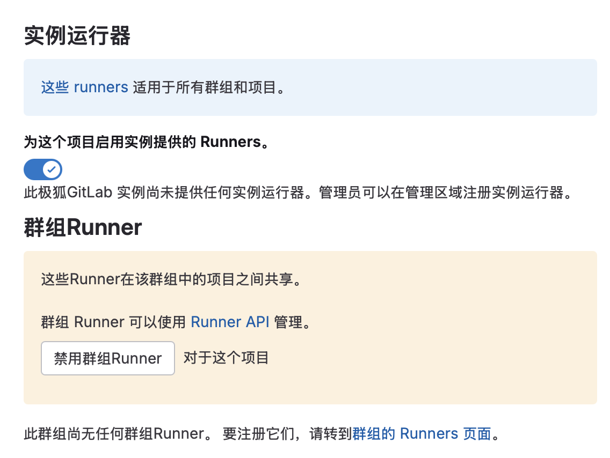
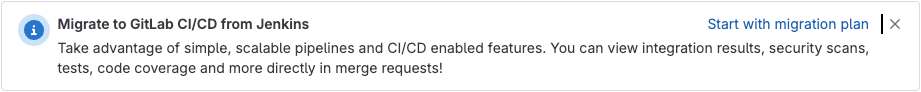



- Tier: 基础版，专业版，旗舰版
- Offering: 私有化部署



在管理区域中为您的极狐GitLab 实例配置 CI/CD 设置。

先决条件：

- 您必须具有管理员访问权限。

以下设置可用：

- 变量：为实例中的所有项目配置可用的 CI/CD 变量。
- 持续集成与部署：为 Auto DevOps、作业、产物、实例 Runner 和流水线功能配置设置。
- 软件包仓库：配置软件包转发和文件大小限制。
- Runner：配置 Runner 注册、版本管理和令牌设置。
- 作业令牌权限：控制跨项目的作业令牌访问。
- 作业日志：配置作业日志设置，如增量日志记录。
- [CI/CD 限制](../cicd/limits.md)。

## 访问持续集成与部署设置

自定义 CI/CD 设置，包括 Auto DevOps、实例 Runner 和作业产物。

要访问这些设置：

1. 在右上角，选择 **管理员**。
1. 在左侧边栏中，选择 **设置** > **CI/CD**。
1. 展开 **持续集成与部署**。

### 为所有项目配置 Auto DevOps

配置 [Auto DevOps](../../topics/autodevops/_index.md) 以在没有 `.gitlab-ci.yml` 文件的所有项目中运行。这适用于现有项目和任何新项目。

要为实例中的所有项目配置 Auto DevOps：

1. 选中 **默认为所有项目启用 Auto DevOps 流水线** 复选框。
1. 可选。要使用 Auto Deploy 和 Auto Review Apps，请指定 [Auto DevOps 基础域名](../../topics/autodevops/requirements.md#auto-devops-base-domain)。
1. 选择 **保存更改**。

### 实例 Runner

#### 为新项目启用实例 Runner

默认情况下，使实例 Runner 可用于所有新项目。

要使实例 Runner 可用于新项目：

1. 选中 **为新项目启用实例 Runner** 复选框。
1. 选择 **保存更改**。

#### 为实例 Runner 添加详细信息

添加有关实例 Runner 的说明文字。此文本会显示在所有项目的 Runner 设置中。

要添加实例 Runner 详细信息：

1. 在 **实例 Runner 详细信息** 文本框中输入文本。您可以使用 Markdown 格式。
1. 选择 **保存更改**。

要查看渲染后的详细信息：

1. 在顶部栏中，选择 **搜索或跳转到** 并找到您的项目或群组。
1. 在左侧边栏中，选择 **设置** > **CI/CD**。
1. 展开 **Runner**。

#### 与多个项目共享项目 Runner

与多个项目共享一个项目 Runner。

先决条件：

- 您必须有一个已注册的 [项目 Runner](../../ci/runners/runners_scope.md#project-runners)。

要与多个项目共享项目 Runner：

1. 在右上角，选择 **管理员**。
1. 从左侧边栏中，选择 **CI/CD** > **Runner**。
1. 选择您要编辑的 Runner。
1. 在右上角，选择 **编辑** ()。
1. 在 **限制此 Runner 的项目** 下，搜索一个项目。
1. 在项目左侧，选择 **启用**。
1. 对每个其他项目重复此过程。

### 作业产物

控制如何在您的极狐GitLab 实例中存储和管理 [作业产物](../cicd/job_artifacts.md)。

#### 设置默认产物过期时间

设置作业产物在被自动删除前的保留时间。默认过期时间为 30 天。

时长的语法在 [`artifacts:expire_in`](../../ci/yaml/_index.md#artifactsexpire_in) 中描述。单个作业定义可以在项目的 `.gitlab-ci.yml` 文件中覆盖此默认值。

对此设置的更改仅适用于新产物。现有产物保留其原始过期时间。有关手动过期旧产物的信息，请参阅 [故障排除文档](../cicd/job_artifacts_troubleshooting.md#delete-old-builds-and-artifacts)。

要设置作业产物的默认过期时间：

1. 在 **默认产物过期时间** 文本框中输入一个值。
1. 选择 **保存更改**。

#### 保留最新成功流水线的产物

为每个 Git 引用（分支或标签）保留最近一次成功流水线的产物，无论其过期时间如何。

默认情况下，此设置处于开启状态。

此设置优先于 [项目设置](../../ci/jobs/job_artifacts.md#keep-artifacts-from-most-recent-successful-jobs)。如果为实例关闭，则无法为单个项目开启。

当此功能关闭时，现有保留的产物不会立即过期。必须在分支上运行新的成功流水线后，其产物才能过期。

> [!note]
> 所有应用程序设置都有一个 [可自定义的缓存过期时间间隔](../application_settings_cache.md)，这可能会延迟设置更改的效果。

要保留最新成功流水线的产物：

1. 选中 **保留最新成功流水线中所有作业的最新产物** 复选框。
1. 选择 **保存更改**。

要允许产物根据其过期设置过期，请改为清除该复选框。

#### 显示或隐藏外部重定向警告页面

控制当用户通过 GitLab Pages 查看作业产物时是否显示警告页面。此警告会提示用户生成内容带来的潜在安全风险。

默认情况下会显示外部重定向警告页面。要隐藏它：

1. 清除 **为作业产物启用外部重定向页面** 复选框。
1. 选择 **保存更改**。

### 流水线

#### 归档流水线

在指定时间段后自动归档旧的流水线及其所有作业。已归档的作业：

- 在作业日志顶部显示信息性通知 **此作业已归档**。
- 无法重新运行或重试。
- 当环境自动停止时，无法作为 [on-stop 部署操作](../../ci/environments/_index.md#stopping-an-environment) 运行。
- 继续显示可见的作业日志。

归档时长从流水线创建时开始计算。必须至少为 1 天。有效时长的示例包括 `15 days`、`1 month` 和 `2 years`。将此字段留空以永不自动归档流水线。

对于 JihuLab.com，请参阅 [流水线归档](../../user/jihulab_com/_index.md#gitlab-cicd)。

要设置作业归档：

1. 在 **归档流水线** 文本框中输入一个值。
1. 选择 **保存更改**。

#### 默认允许流水线变量

控制新群组中的新项目是否默认允许流水线变量。

禁用时，新群组的 [默认使用流水线变量的角色](../../user/group/access_and_permissions.md#set-the-default-role-that-can-use-pipeline-variables) 设置将设为 **不允许任何人**，这会级联到新群组中的新项目。启用时，该设置默认为 **开发者**。

> [!warning]
> 为了给新群组和项目保持最安全的默认设置，建议将此设置设为禁用。

要默认允许新群组中的所有新项目使用流水线变量：

1. 选中 **默认允许新群组使用流水线变量** 复选框。
1. 选择 **保存更改**。

群组或项目创建后，维护者可以选择其他设置。

#### 默认保护 CI/CD 变量

将项目和群组中的所有新 CI/CD 变量默认设为受保护。受保护的变量仅对在受保护分支或受保护标签上运行的流水线可用。

要默认保护所有新的 CI/CD 变量：

1. 选中 **默认保护 CI/CD 变量** 复选框。
1. 选择 **保存更改**。

#### 指定默认的 CI/CD 配置文件

设置自定义路径和文件名，用作所有新项目中 CI/CD 配置文件的默认值。默认情况下，极狐GitLab 使用项目根目录中的 `.gitlab-ci.yml` 文件。

此设置仅适用于您更改后创建的新项目。现有项目继续使用其当前的 CI/CD 配置文件路径。

要设置自定义的默认 CI/CD 配置文件路径：

1. 在 **默认 CI/CD 配置文件** 文本框中输入一个值。
1. 选择 **保存更改**。

单个项目可以通过 [指定自定义 CI/CD 配置文件](../../ci/pipelines/settings.md#specify-a-custom-cicd-configuration-file) 来覆盖此实例默认值。

#### 显示或隐藏 Jenkins 迁移横幅

控制是否显示鼓励从 Jenkins 迁移到极狐GitLab CI/CD 的横幅。此横幅会出现在已 [启用 Jenkins 集成](../../integration/jenkins.md) 的项目的合并请求中。

默认情况下会显示 Jenkins 迁移横幅。要隐藏它：

1. 选中 **显示从 Jenkins 迁移的横幅** 复选框。
1. 选择 **保存更改**。

## 访问软件包仓库设置

配置 NuGet 软件包验证、Helm 软件包限制、软件包文件大小限制和软件包转发。

要访问这些设置：

1. 在右上角，选择 **管理员**。
1. 在左侧边栏中，选择 **设置** > **CI/CD**。
1. 展开 **软件包仓库**。

### 跳过 NuGet 软件包元数据 URL 验证

跳过对 NuGet 软件包中 `projectUrl`、`iconUrl` 和 `licenseUrl` 元数据的验证。

默认情况下，极狐GitLab 会验证这些 URL。如果您的极狐GitLab 实例无法访问互联网，此验证将失败并阻止您上传 NuGet 软件包。

要跳过 NuGet 软件包元数据 URL 验证：

1. 选中 **跳过 NuGet 软件包的元数据 URL 验证** 复选框。
1. 选择 **保存更改**。

### 设置每个频道的最大 Helm 软件包数

设置每个频道可以列出的最大 Helm 软件包数量。

要设置 Helm 软件包限制：

1. 在 **软件包限制** 下，在 **每个频道的最大 Helm 软件包数** 字段中输入一个值。
1. 选择 **保存更改**。

### 设置软件包文件大小限制

为每种软件包类型设置最大文件大小限制，以控制存储使用并保持系统性能。

您可以为以下软件包配置最大文件大小限制（以字节为单位）：

- Conan 软件包
- Helm chart
- Maven 软件包
- npm 软件包
- NuGet 软件包
- PyPI 软件包
- Terraform Module 软件包
- 通用软件包

要配置软件包文件大小限制：

1. 在 **软件包文件大小限制** 下，为您要配置的限制输入值。
1. 选择 **保存大小限制**。

### 控制软件包转发



- Tier: 专业版，旗舰版
- Offering: 私有化部署



控制当在您的极狐GitLab 软件包仓库中找不到软件包时，是否将软件包请求转发到公共仓库。

默认情况下，极狐GitLab 会将软件包请求转发到相应的公共仓库：

- Maven 请求转发到 [Maven Central](https://search.maven.org/)。
- npm 请求转发到 [npmjs.com](https://www.npmjs.com/)。
- PyPI 请求转发到 [pypi.org](https://pypi.org/)。

要关闭软件包转发：

1. 在右上角，选择 **管理员**。
1. 在左侧边栏中，选择 **概览** > **群组** 并找到您的群组。
1. 选择 **设置** > **CI/CD**。
1. 展开 **软件包仓库**。
1. 清除以下任一复选框：
   - **转发 npm 软件包请求**
   - **转发 PyPI 软件包请求**
1. 选择 **保存更改**。

要关闭 Maven 软件包的请求转发，请参阅 [软件包仓库中的 Maven 软件包](../../user/packages/maven_repository/_index.md#request-forwarding-to-maven-central)。

## 访问 Runner 设置

配置 Runner 版本管理和注册设置。

要访问这些设置：

1. 在右上角，选择 **管理员**。
1. 在左侧边栏中，选择 **设置** > **CI/CD**。
1. 展开 **Runner**。

### 控制 Runner 版本管理

控制您的实例是否从 JihuLab.com 获取官方 Runner 版本数据，以 [确定 Runner 是否需要升级](../../ci/runners/runners_scope.md#determine-which-runners-need-to-be-upgraded)。

默认情况下，极狐GitLab 会获取 Runner 版本数据。要停止获取此数据：

1. 在 **Runner 版本管理** 下，清除 **从 JihuLab.com 获取极狐GitLab Runner 发布版本数据** 复选框。
1. 选择 **保存更改**。

### 控制 Runner 注册

控制谁可以注册 Runner，以及是否允许注册令牌。

> [!warning]
> 传递 Runner 注册令牌的选项以及对某些配置参数的支持被视为旧版功能，不建议使用。
> 请使用 [Runner 创建工作流](https://gitlab.cn/docs/runner/register/#register-with-a-runner-authentication-token) 生成认证令牌来注册 Runner。此过程可提供 Runner 所有权的完整可追溯性，并增强您的 Runner 集群的安全性。
>
> 有关更多信息，请参阅
> [迁移到新的 Runner 注册工作流](../../ci/runners/new_creation_workflow.md)。

默认情况下，允许 Runner 注册令牌以及项目和群组成员注册。要限制 Runner 注册：

1. 在 **Runner 注册** 下，清除以下任一复选框：
   - **允许 Runner 注册令牌**
   - **项目成员可以创建 Runner**
   - **群组成员可以创建 Runner**
1. 选择 **保存更改**。

> [!note]
> 当您为项目成员禁用 Runner 注册时，注册令牌会自动轮换。先前的令牌将失效，您必须为项目使用新的注册令牌。

### 限制特定群组的 Runner 注册

控制特定群组的成员是否可以注册 Runner。

先决条件：

- 必须在 [Runner 注册设置](#control-runner-registration) 中选中 **群组成员可以创建 Runner** 复选框。

要限制特定群组的 Runner 注册：

1. 在右上角，选择 **管理员**。
1. 在左侧边栏中，选择 **概览** > **群组** 并找到您的群组。
1. 选择 **编辑**。
1. 在 **Runner 注册** 下，清除 **可以注册新的群组 Runner** 复选框。
1. 选择 **保存更改**。

## 访问作业令牌权限设置

控制 CI/CD 作业令牌如何访问您的项目。

要访问这些设置：

1. 在右上角，选择 **管理员**。
1. 在左侧边栏中，选择 **设置** > **CI/CD**。
1. 展开 **作业令牌权限**。

### 强制实施作业令牌允许名单

要求所有项目使用允许名单来控制作业令牌访问。

启用此设置后：

- 仅当令牌的源项目添加到允许名单时，CI/CD 作业令牌才能访问项目。
- 如果用户尝试禁用允许名单，[CI/CD 作业令牌范围 API](../../api/project_job_token_scopes.md#update-the-cicd-job-token-access-settings-for-a-project) 将返回错误。

有关更多信息，请参阅 [控制对您项目的作业令牌访问](../../ci/jobs/ci_job_token.md#control-job-token-access-to-your-project)。

要强制实施作业令牌允许名单：

1. 在 **已授权的群组和项目** 下，选中 **为所有项目启用并强制实施作业令牌允许名单** 复选框。
1. 选择 **保存更改**。

## 访问作业日志设置

控制 CI/CD 作业日志的存储和处理方式。

要访问这些设置：

1. 在右上角，选择 **管理员**。
1. 在左侧边栏中，选择 **设置** > **CI/CD**。
1. 展开 **作业日志**。

### 配置增量日志记录

使用 Redis 临时缓存作业日志，并将归档日志增量上传到对象存储。这可以提高性能并减少磁盘空间使用。

有关更多信息，请参阅 [增量日志记录](../cicd/job_logs.md#incremental-logging)。

先决条件：

- 您必须为 CI/CD 产物、日志和构建 [配置对象存储](../cicd/job_artifacts.md#using-object-storage)。

要为所有项目开启增量日志记录：

1. 在右上角，选择 **管理员**。
1. 在左侧边栏中，选择 **设置** > **CI/CD**。
1. 展开 **作业日志** 部分。
1. 在 **增量日志记录配置** 下，选中 **开启增量日志记录** 复选框。
1. 选择 **保存更改**。

## CI/CD Catalog 设置



- Tier: 专业版，旗舰版
- Offering: 私有化部署



控制哪些项目可以向 [CI/CD Catalog](../../ci/components/_index.md) 发布组件。

要访问这些设置：

1. 在右上角，选择 **管理员**。
1. 在左侧边栏中，选择 **设置** > **CI/CD**。
1. 展开 **Catalog**。

### 限制 CI/CD Catalog 发布

默认情况下，任何项目都可以向 CI/CD Catalog 发布组件。您可以通过配置允许名单来限制发布到特定项目。

当允许名单为：

- 空（默认）：所有项目都可以向 Catalog 发布。
- 包含任意数量的项目：只有与允许名单中的条目匹配的项目才能发布。

您可以使用以下方式定义允许名单中的条目：

- 精确的项目路径，例如 `my-group/my-project`。
- 正则表达式：例如：
  - `my-group/.*`：群组中的所有项目。
  - `my-group/security-.*`：以 `security-` 开头的项目。

要配置 CI/CD Catalog 发布允许名单：

1. 在右上角，选择 **管理员**。
1. 在左侧边栏中，选择 **设置** > **CI/CD**。
1. 展开 **Catalog**。
1. 在 **CI/CD Catalog 发布允许名单** 文本区域中，每行输入一个路径模式。
1. 选择 **保存更改**。

不在允许名单中的项目在尝试发布组件版本时会收到 `not authorized to publish` 错误。

## 必需的流水线配置（已弃用）



- Tier: 旗舰版
- Offering: 私有化部署



> [!warning]
> 此功能已在极狐GitLab 15.9 中 [弃用](https://gitlab.com/gitlab-org/gitlab/-/issues/389467)，并在 17.0 中移除。从 17.4 开始，它仅在启用功能标志 `required_pipelines` 时可用，该功能标志默认禁用。
> 请改用 [合规流水线](../../user/compliance/compliance_pipelines.md)。此更改是一项破坏性更改。

您可以将 CI/CD 模板设置为极狐GitLab 实例上所有项目必需的流水线配置。您可以使用以下来源的模板：

- 默认的 CI/CD 模板。
- 存储在 [实例模板仓库](instance_template_repository.md) 中的自定义模板。

  > [!note]
  > 当您使用实例模板仓库中定义的配置时，嵌套的 [`include:`](../../ci/yaml/_index.md#include) 关键字
  > （包括 `include:file`、`include:local`、`include:remote` 和 `include:template`）
  > [不起作用](https://gitlab.com/gitlab-org/gitlab/-/issues/35345)。

当流水线运行时，项目 CI/CD 配置会合并到必需的流水线配置中。合并后的配置与必需的流水线配置使用 [`include` 关键字](../../ci/yaml/_index.md#include) 添加项目配置的效果相同。要查看项目的完整合并配置，请在流水线编辑器中 [查看完整配置](../../ci/pipeline_editor/_index.md#view-full-configuration)。

要为必需的流水线配置选择 CI/CD 模板：

1. 在左侧边栏底部，选择 **管理员**。
1. 选择 **设置** > **CI/CD**。
1. 展开 **必需的流水线配置** 部分。
1. 从下拉列表中选择一个 CI/CD 模板。
1. 选择 **保存更改**。
