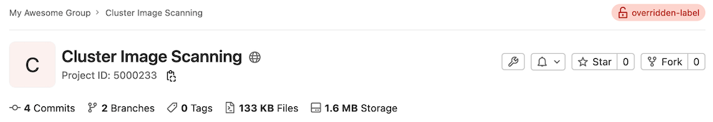



- Tier: 基础版，专业版，旗舰版
- Offering: 私有化部署





- 在 11.10 中从极狐GitLab 专业版移至基础版。



在高度受控的环境中，可能需要由外部服务来控制访问策略，该服务根据项目分类和用户访问权限来授予访问。极狐GitLab 提供了一种方法，可使用您自己定义的服务来检查项目授权。

配置并启用外部服务后，当访问某个项目时，会向外部服务发送一个请求，其中包含用户信息和分配给该项目的项目分类标签。当服务回复已知响应时，其结果会缓存六小时。

如果启用了外部授权，极狐GitLab 将进一步阻止渲染跨项目数据的页面和功能。其中包括：

- 仪表盘中的大部分页面（动态、里程碑、代码片段、已指派的合并请求、已指派的议题、待办事项列表）。
- 特定群组下的页面（动态、贡献分析、议题、议题板、标签、里程碑、合并请求）。
- 全局搜索和群组搜索均被禁用。

这是为了防止同时向外部授权服务发送过多请求。

无论访问是被授予还是被拒绝，都会被记录在名为 `external-policy-access-control.log` 的日志文件中。关于极狐GitLab 保留的日志的更多信息，请参阅 [Linux 软件包文档](https://gitlab.cn/docs/omnibus/settings/logs/)。

在使用自签名证书进行 TLS 身份验证时，CA 证书需要被 OpenSSL 安装所信任。使用 Linux 软件包安装的极狐GitLab 时，请参阅 [Linux 软件包文档](https://gitlab.cn/docs/omnibus/settings/ssl/) 了解如何安装自定义 CA。或者，使用 `openssl version -d` 来了解自定义证书的安装位置。

<a id="configuration"></a>

## 配置

外部授权服务可由管理员启用：

1. 在右上角，选择 **管理员**。
1. 在左侧边栏中，选择 **设置** > **常规**。
1. 展开 **外部授权**。
1. 填写各项字段。
1. 选择 **保存更改**。

<a id="allow-external-authorization-with-deploy-tokens-and-deploy-keys"></a>

### 允许使用部署令牌和部署密钥进行外部授权



- [引入](https://gitlab.com/gitlab-org/gitlab/-/issues/386656) 于极狐GitLab 15.9。
- 部署令牌不再能访问容器或软件包仓库 [引入](https://gitlab.com/gitlab-org/gitlab/-/issues/387721) 于极狐GitLab 16.0。



您可以设置实例，允许使用 [部署令牌](../../user/project/deploy_tokens/_index.md) 或 [部署密钥](../../user/project/deploy_keys/_index.md) 进行 Git 操作的外部授权。

先决条件：

- 您必须在外部授权中使用分类标签，且不设置服务 URL。

允许使用部署令牌和密钥进行授权：

1. 在右上角，选择 **管理员**。
1. 在左侧边栏中，选择 **设置** > **常规**。
1. 展开 **外部授权**，然后：
   - 将服务 URL 字段留空。
   - 选择 **允许使用部署令牌和部署密钥进行外部授权**。
1. 选择 **保存更改**。

> [!warning]
> 如果启用外部授权，部署令牌将无法访问容器镜像仓库或软件包仓库。如果您使用部署令牌来访问这些仓库，此措施将破坏这些令牌的此类用途。要恢复部署令牌对容器镜像仓库或软件包仓库的访问，请禁用外部授权。

<a id="how-gitlab-connects-to-an-external-authorization-service"></a>

## 极狐GitLab 如何连接到外部授权服务

当极狐GitLab 请求访问时，它会向外部服务发送一个 JSON POST 请求，请求体如下：

```json
{
  "user_identifier": "jane@acme.org",
  "project_classification_label": "项目标签",
  "user_ldap_dn": "CN=Jane Doe,CN=admin,DC=acme",
  "identities": [
    { "provider": "ldap", "extern_uid": "CN=Jane Doe,CN=admin,DC=acme" },
    { "provider": "bitbucket", "extern_uid": "2435223452345" }
  ]
}
```

`user_ldap_dn` 是可选项，仅当用户通过 LDAP 登录时才会发送。

`identities` 包含与该用户关联的所有身份的详细信息。如果用户没有任何关联身份，则此为空数组。

当外部授权服务以状态码 200 响应时，用户被授予访问权限。当外部服务以状态码 401 或 403 响应时，用户被拒绝访问。在任何情况下，该请求的结果都会缓存六小时。

拒绝访问时，可在 JSON 主体中可选地指定一个 `reason`：

```json
{
  "reason": "您未被允许访问此项目。"
}
```

除了 200、401 或 403 之外的任何其他状态码也会拒绝用户的访问，但响应不会被缓存。

如果服务超时（在 500 毫秒后），则会显示消息“外部策略服务器未响应”。

<a id="classification-labels"></a>

## 分类标签

您可以在项目的 **设置** > **常规** > **常规项目设置** 页面的“分类标签”框中，使用您自己的分类标签。当项目未指定分类标签时，将使用 [全局设置](#configuration) 中定义的默认标签。

在所有项目页面的右上角，会显示该标签。

