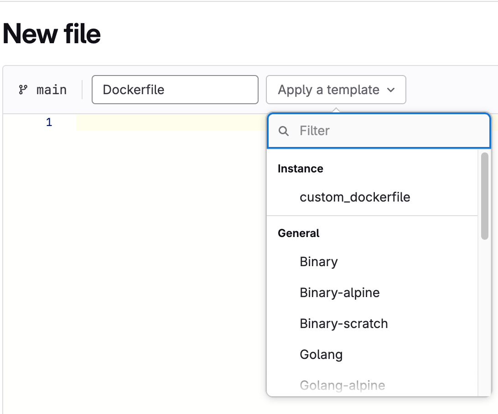



- Tier: 专业版，旗舰版
- Offering: 私有化部署



在托管系统中，企业通常需要在团队之间共享自己的模板。此功能允许管理员选择一个项目作为整个实例的文件模板集合。然后，这些模板将向所有用户公开，通过 [Web 编辑器](../../user/project/repository/web_editor.md) 使用，同时项目保持安全。

## Configuration

<a id="configuration"></a>

## 配置

要选择一个项目作为自定义模板仓库：

1. 在右上角，选择 **管理员**。
1. 在左侧边栏中，选择 **设置** > **模板**。
1. 展开 **模板**
1. 从下拉列表中，选择要用作模板仓库的项目。
1. 选择 **保存更改**。
1. 将自定义模板添加到所选仓库。

添加模板后，您可以在整个实例中使用它们。它们在 [Web 编辑器](../../user/project/repository/web_editor.md) 中以及通过 [API 设置](../../api/settings.md) 可用。

这些模板不能作为 `.gitlab-ci.yml` 中 [`include:template`](../../ci/yaml/_index.md#includetemplate) 键的值。

## Supported file types and locations

<a id="supported-file-types-and-locations"></a>

## 支持的文件类型和位置

极狐GitLab 支持用于议题和合并请求模板的 Markdown 文件以及其他文件类型的模板。

支持以下 Markdown 描述模板：

| 类型               | 目录                         | 扩展名         |
| :---------------:  | :-----------:                     | :-----------:     |
| 议题              | `.gitlab/issue_templates`         | `.md`             |
| 合并请求      | `.gitlab/merge_request_templates` | `.md`             |

更多信息，请参见 [描述模板](../../user/project/description_templates.md)。

其他支持的文件类型模板包括：

| 类型                    | 目录            | 扩展名     |
| :---------------:       | :-----------:        | :-----------: |
| `Dockerfile`            | `Dockerfile`         | `.dockerfile` |
| `.gitignore`            | `gitignore`          | `.gitignore`  |
| `.gitlab-ci.yml`        | `gitlab-ci`          | `.yml`        |
| `LICENSE`               | `LICENSE`            | `.txt`        |

每个模板必须位于其各自的子目录中，具有正确的扩展名，并且不能为空。层次结构应如下所示：

```plaintext
|-- README.md
    |-- issue_templates
        |-- feature_request.md
    |-- merge_request_templates
        |-- default.md
|-- Dockerfile
    |-- custom_dockerfile.dockerfile
    |-- another_dockerfile.dockerfile
|-- gitignore
    |-- custom_gitignore.gitignore
    |-- another_gitignore.gitignore
|-- gitlab-ci
    |-- custom_gitlab-ci.yml
    |-- another_gitlab-ci.yml
|-- LICENSE
    |-- custom_license.txt
    |-- another_license.txt
```

当通过极狐GitLab UI 添加新文件时，您的自定义模板将显示在下拉列表中：



如果此功能被禁用或没有模板存在，则选择下拉列表中不会显示 **自定义** 部分。