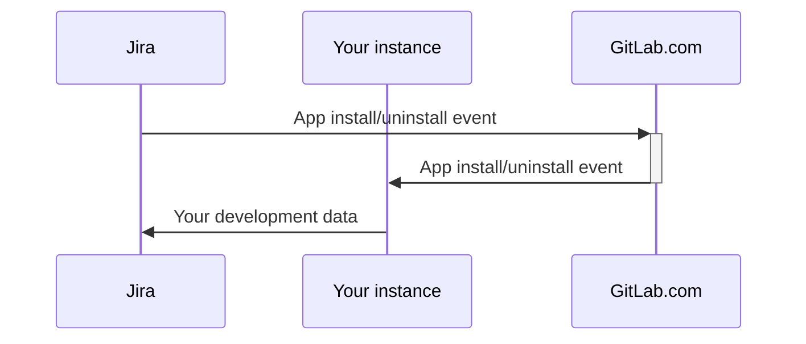



- Tier: 基础版，专业版，旗舰版
- Offering: 私有化部署



> [!note]
> 用户文档，请参阅 [GitLab for Jira Cloud 应用](../../integration/jira/connect-app.md)。

通过 [GitLab for Jira Cloud](https://marketplace.atlassian.com/apps/1221011/gitlab-com-for-jira-cloud?tab=overview&hosting=cloud) 应用，您可以连接极狐GitLab 和 Jira Cloud，实时同步开发信息。您可以在 [Jira 开发面板](../../integration/jira/development_panel.md) 中查看此信息。

要在您的极狐GitLab 私有化部署实例上设置 GitLab for Jira Cloud 应用，请执行以下任一操作：

- [从 Atlassian Marketplace 安装 GitLab for Jira Cloud 应用](#install-the-gitlab-for-jira-cloud-app-from-the-atlassian-marketplace)。
- [手动安装 GitLab for Jira Cloud 应用](#install-the-gitlab-for-jira-cloud-app-manually)。


  <!-- Video published on 2024-10-30 -->
  <!-- Video published on 2026-06-17 -->

以上视频展示了较旧的 [Universal Plugin Manager 界面](https://community.atlassian.com/forums/Community-Announcements-articles/Cloud-admins-we-re-making-app-management-easier/ba-p/2806285)，该界面在较新的 Jira Cloud 实例上可能不可用。
以下说明涵盖新旧两种应用管理界面。

如果您 [从 Atlassian Marketplace 安装 GitLab for Jira Cloud 应用](#install-the-gitlab-for-jira-cloud-app-from-the-atlassian-marketplace)，
您可以使用由 Atlassian 开发和维护的 [项目工具链](https://support.atlassian.com/jira-software-cloud/docs/what-is-the-connections-feature/) 来 [将极狐GitLab 代码仓库链接到 Jira 项目](https://support.atlassian.com/jira-software-cloud/docs/link-repositories-to-a-project/#Link-repositories-using-the-toolchain-feature)。
项目工具链不影响极狐GitLab 和 Jira Cloud 之间开发信息的同步方式。

对于 Jira Data Center 或 Jira Server，请使用由 Atlassian 开发和维护的 [Jira DVCS 连接器](../../integration/jira/dvcs/_index.md)。

<a id="set-up-oauth-authentication"></a>

## 设置 OAuth 身份验证

无论您是想 [从 Atlassian Marketplace 安装](#install-the-gitlab-for-jira-cloud-app-from-the-atlassian-marketplace) 还是 [手动安装](#install-the-gitlab-for-jira-cloud-app-manually) GitLab for Jira Cloud 应用，都必须创建 OAuth 应用。

先决条件：

- 管理员访问权限。

要在您的极狐GitLab 私有化部署实例上创建 OAuth 应用：

1. 在右上角，选择 **管理员**。
1. 在左侧边栏中，选择 **应用**。
1. 选择 **新建应用**。
1. 在 **重定向 URI** 中：
   - 如果您要从 Atlassian Marketplace 列表安装应用，请输入 `https://gitlab.com/-/jira_connect/oauth_callbacks`。
   - 如果您要手动安装应用，请输入 `<instance_url>/-/jira_connect/oauth_callbacks`，并将 `<instance_url>` 替换为您的实例 URL。
1. 清除 **受信任** 和 **机密** 复选框。

   > [!note]
   > 您必须清除这些复选框，以避免 [登录错误](jira_cloud_app_troubleshooting.md#error-failed-to-sign-in-to-gitlab)。

1. 在 **范围** 中，仅选择 `api` 复选框。
1. 选择 **保存应用**。
1. 复制 **应用 ID** 值。
1. 在左侧边栏中，选择 **设置** > **通用**。
1. 展开 **GitLab for Jira 应用**。
1. 将 **应用 ID** 值粘贴到 **Jira Connect 应用 ID** 中。
1. 选择 **保存更改**。

<a id="jira-user-requirements"></a>

## Jira 用户要求

在您的 [Atlassian 组织](https://admin.atlassian.com) 中，您必须确保用于设置 GitLab for Jira Cloud 应用的 Jira 用户是以下任一组的成员：

- 组织管理员 (`org-admins`) 组。较新的 Atlassian 组织正在使用
  [集中式用户管理](https://support.atlassian.com/user-management/docs/give-users-admin-permissions/#Centralized-user-management-content)，
  其中包含 `org-admins` 组。现有的 Atlassian 组织正在迁移到集中式用户管理。
  如果可用，您应使用 `org-admins` 组来指定哪些 Jira 用户可以管理 GitLab for Jira Cloud 应用。或者，您可以使用
  `site-admins` 组。
- 站点管理员 (`site-admins`) 组。`site-admins` 组在
  [原始用户管理](https://support.atlassian.com/user-management/docs/give-users-admin-permissions/#Original-user-management-content) 下使用。

如有必要：

1. [创建您偏好的组](https://support.atlassian.com/user-management/docs/create-groups/)。
1. [编辑组](https://support.atlassian.com/user-management/docs/edit-a-group/) 以将您的 Jira 用户添加为成员。
1. 如果您在 Jira 中自定义了全局权限，您可能还需要向 Jira 用户授予
   [`Browse users and groups` 权限](https://confluence.atlassian.com/jirakb/unable-to-browse-for-users-and-groups-120521888.html)。

<a id="install-the-gitlab-for-jira-cloud-app-from-the-atlassian-marketplace"></a>

## 从 Atlassian Marketplace 安装 GitLab for Jira Cloud 应用

您可以将 Atlassian Marketplace 中的官方 GitLab for Jira Cloud 应用与您的极狐GitLab 私有化部署实例一起使用。

使用此方法：

- JihuLab.com [处理从 Jira Cloud 发送的应用安装和卸载生命周期事件](#gitlabcom-handling-of-app-lifecycle-events)，并将其转发到您的极狐GitLab 实例。来自您的极狐GitLab 私有化部署实例的所有数据仍会直接发送到 Jira Cloud。
- JihuLab.com [处理分支创建链接](#gitlabcom-handling-of-branch-creation)，方法是将其重定向到您的实例。
- 在 17.2 之前的任何极狐GitLab 版本中，都无法从 Jira Cloud 在极狐GitLab 私有化部署实例上创建分支。
  有关更多信息，请参阅 [议题 391432](https://gitlab.com/gitlab-org/gitlab/-/issues/391432)。

或者，如果您遇到以下情况，您可能希望 [手动安装 GitLab for Jira Cloud 应用](#install-the-gitlab-for-jira-cloud-app-manually)：

- 您的实例不满足 [先决条件](#prerequisites)。
- 您不想使用官方的 Atlassian Marketplace 列表。
- 您不希望 JihuLab.com [处理应用生命周期事件](#gitlabcom-handling-of-app-lifecycle-events) 或知道您的实例已安装该应用。
- 您不希望 JihuLab.com [将分支创建链接重定向](#gitlabcom-handling-of-branch-creation) 到您的实例。

<a id="prerequisites"></a>

### 先决条件

- 实例必须可公开访问。
- 实例必须运行极狐GitLab 15.7 或更高版本。
- 您必须设置 [OAuth 身份验证](#set-up-oauth-authentication)。
- 您的极狐GitLab 实例必须使用 HTTPS，并且您的极狐GitLab 证书必须受公开信任或包含完整的证书链。
- 您的网络配置必须允许：
  - 从您的极狐GitLab 私有化部署实例到 Jira Cloud 的出站连接（[Atlassian IP 地址](https://support.atlassian.com/organization-administration/docs/ip-addresses-and-domains-for-atlassian-cloud-products/#Outgoing-Connections)）
  - 您的极狐GitLab 私有化部署实例与 JihuLab.com 之间的入站和出站连接（[JihuLab.com IP 地址](../../user/jihulab_com/_index.md#ip-range)）
  - 对于位于防火墙后面的实例：
    1. 在您的极狐GitLab 私有化部署实例前设置面向互联网的 [反向代理](#using-a-reverse-proxy)。
    1. 配置反向代理以允许来自 JihuLab.com 的入站连接（[JihuLab.com IP 地址](../../user/jihulab_com/_index.md#ip-range)）
    1. 确保您的极狐GitLab 私有化部署实例仍能进行上述出站连接。
- 安装和配置应用的 Jira 用户必须满足某些 [要求](#jira-user-requirements)。

<a id="set-up-your-instance-for-atlassian-marketplace-installation"></a>

### 为 Atlassian Marketplace 安装设置您的实例

[先决条件](#prerequisites)

要为 Atlassian Marketplace 安装设置您的极狐GitLab 私有化部署实例：

1. 在右上角，选择 **管理员**。
1. 在左侧边栏中，选择 **设置** > **通用**。
1. 展开 **GitLab for Jira 应用**。
1. 在 **Jira Connect 代理 URL** 中，输入 `https://gitlab.com` 以从 Atlassian Marketplace 安装应用。
1. 选择 **保存更改**。

<a id="link-your-instance"></a>

### 链接您的实例

[先决条件](#prerequisites)

要将您的极狐GitLab 私有化部署实例链接到 GitLab for Jira Cloud 应用：

1. 安装 [GitLab for Jira Cloud 应用](https://marketplace.atlassian.com/apps/1221011/gitlab-com-for-jira-cloud?tab=overview&hosting=cloud)。
1. [配置 GitLab for Jira Cloud 应用](../../integration/jira/connect-app.md#configure-the-gitlab-for-jira-cloud-app)。
1. 可选。 [检查 Jira Cloud 是否已链接](#check-if-jira-cloud-is-linked)。

<a id="check-if-jira-cloud-is-linked"></a>

#### 检查 Jira Cloud 是否已链接

您可以使用 [Rails 控制台](../operations/rails_console.md#starting-a-rails-console-session)
来检查 Jira Cloud 是否已链接到：

- 特定群组：

  ```ruby
  JiraConnectSubscription.where(namespace: Namespace.by_path('group/subgroup'))
  ```

- 特定项目：

  ```ruby
  Project.find_by_full_path('path/to/project').jira_subscription_exists?
  ```

- 任何群组：

  ```ruby
  installation = JiraConnectInstallation.find_by_base_url("https://customer_name.atlassian.net")
  installation.subscriptions
  ```

<a id="install-the-gitlab-for-jira-cloud-app-manually"></a>

## 手动安装 GitLab for Jira Cloud 应用

> [!warning]
> 以前的手动安装方法依赖于 Atlassian Connect 开发模式。Atlassian
> [已于 2026-03-31 禁用基于 Connect 的私有安装](https://www.atlassian.com/blog/developer/announcing-connect-end-of-support-timeline-and-next-steps)。
> 如果您之前使用 **应用描述符 URL** 工作流手动安装了该应用，
> 请迁移到 [本节](../../integration/jira/connect-app.md#migration-from-atlassian-connect-to-forge) 中描述的基于 Forge 的安装。

如果您无法 [使用官方的 Atlassian Marketplace 列表](#install-the-gitlab-for-jira-cloud-app-from-the-atlassian-marketplace)，请手动安装 GitLab for Jira Cloud 应用。
例如，如果：

- 您的实例不满足 [Marketplace 先决条件](#prerequisites)。
- 您不希望 JihuLab.com [处理应用生命周期事件](#gitlabcom-handling-of-app-lifecycle-events) 或知道您的实例已安装该应用。
- 您不希望 JihuLab.com [将分支创建链接重定向](#gitlabcom-handling-of-branch-creation) 到您的实例。

手动安装方法现在基于 [Atlassian Forge](https://developer.atlassian.com/platform/forge/)。
您在您自己的 Atlassian 开发者账户下发布 [GitLab for Jira Cloud Forge 应用](https://gitlab.com/gitlab-org/gitlab-jira-forge) 的私有副本，并将其指向您的极狐GitLab 私有化部署实例。

<a id="prerequisites-1"></a>

### 先决条件

- 实例必须可通过 HTTPS 公开访问，并具有公开受信任的证书。
- 您必须设置 [OAuth 身份验证](#set-up-oauth-authentication)。
- 您的网络配置必须允许：
  - 从 Jira Cloud 到 `<instance_url>/-/jira_connect` 的入站 HTTPS 连接（[Atlassian IP 地址](https://support.atlassian.com/organization-administration/docs/ip-addresses-and-domains-for-atlassian-cloud-products/#Outgoing-Connections)）。
  - 从您的极狐GitLab 实例到 `*.atlassian.net` 的出站 HTTPS 连接，以将开发数据推送到 Jira。
  - 对于位于防火墙后面的实例：
    1. 在您的极狐GitLab 私有化部署实例前设置面向互联网的 [反向代理](#using-a-reverse-proxy)。
    1. 配置反向代理以允许来自 Jira Cloud 的入站连接。
    1. 确保您的极狐GitLab 私有化部署实例仍能进行上述出站连接。
- 离线环境中的实例无法使用该集成。开发面板和 Jira 端的其他界面需要到 `*.atlassian.net` 的出站路径。
- 安装和配置应用的 Jira 用户必须满足某些 [要求](#jira-user-requirements)。
- 一个 Atlassian 开发者账户和一个用于 Forge CLI 的 [Atlassian API 令牌](https://id.atlassian.com/manage-profile/security/api-tokens)。
- 一台安装了 [Node.js 22 LTS](https://nodejs.org/)、[Forge CLI](https://developer.atlassian.com/platform/forge/getting-started/)、`envsubst`、`git` 和 `curl` 的机器。

<a id="set-up-your-instance-for-manual-installation"></a>

### 为手动安装设置您的实例

[先决条件](#prerequisites-1)

要为手动安装设置您的极狐GitLab 私有化部署实例：

1. 在右上角，选择 **管理员**。
1. 在左侧边栏中，选择 **设置** > **通用**。
1. 展开 **GitLab for Jira 应用**。
1. 将 **Jira Connect 代理 URL** 留空以手动安装应用。
1. 选择 **保存更改**。

<a id="publish-a-private-forge-app"></a>

### 发布私有 Forge 应用

要发布 GitLab for Jira Cloud Forge 应用的私有副本并将其安装到您的 Jira 站点：

1. 克隆 [`gitlab-jira-forge`](https://gitlab.com/gitlab-org/gitlab-jira-forge) 代码仓库：

   ```shell
   git clone --depth 1 https://gitlab.com/gitlab-org/gitlab-jira-forge.git
   cd gitlab-jira-forge
   ```

1. 导出所需的环境变量。将示例值替换为您的极狐GitLab 实例 URL、Jira 站点和 Atlassian 凭据：

   ```shell
   export GITLAB_URL=https://gitlab.example.com
   export JIRA_SITE=acme.atlassian.net
   export FORGE_EMAIL=admin@example.com
   export FORGE_API_TOKEN=<your-atlassian-api-token>
   ```

1. 运行包装脚本以注册、部署和安装应用：

   ```shell
   ./scripts/install-self-managed.sh
   ```

   该包装脚本：
   - 验证所需的工具和变量。
   - 首次使用时运行 `forge register` 以在您的 Atlassian 账户下创建 Forge 应用。
   - 从模板生成 `manifest.yml`，并将其固定到您的 `GITLAB_URL`。
   - 运行 `forge deploy -e production`。
   - 运行 `forge install --site $JIRA_SITE --product jira`。

   该脚本将已注册的 `APP_ID` 缓存在 `.env.self-managed` 中。请备份此文件：
   如果丢失，您必须重新注册应用，这将强制所有已安装的 Jira 站点重新安装。

有关分步说明、手动 `forge` 命令、故障排除和升级工作流，请参阅
`gitlab-jira-forge` 代码仓库中的
[极狐GitLab 私有化部署安装指南](https://gitlab.com/gitlab-org/gitlab-jira-forge/-/blob/main/docs/self-managed-install.md)。

应用注册后，在极狐GitLab 中设置其 Forge 应用 ID，以便验证入站 Forge 令牌：

1. 从 `.env.self-managed` 复制 `APP_ID` 值（一个 `ari:cloud:ecosystem::app/<uuid>` Atlassian 资源标识符，或 ARI）。
1. 在右上角，选择 **管理员**。
1. 在左侧边栏中，选择 **设置** > **通用**。
1. 展开 **GitLab for Jira 应用**。
1. 在 **Forge 应用 ID** 中，粘贴 ARI，然后选择 **保存更改**。

应用安装后，在 Jira 中 [配置 GitLab for Jira Cloud 应用](../../integration/jira/connect-app.md#configure-the-gitlab-for-jira-cloud-app) 以链接您的极狐GitLab 命名空间。

<a id="update-the-manually-installed-app"></a>

### 更新手动安装的应用

要将上游 manifest 更改拉取到您的私有 Forge 应用中，请使用 `--update` 重新运行包装脚本：

```shell
./scripts/install-self-managed.sh --update
```

该脚本会快进本地克隆、重新生成 manifest 并重新部署应用。有关次要和主要版本升级的更多信息，请参阅极狐GitLab 私有化部署安装指南中的
[升级](https://gitlab.com/gitlab-org/gitlab-jira-forge/-/blob/main/docs/self-managed-install.md#upgrading)。

<a id="connect-multiple-gitlab-instances"></a>

## 连接多个极狐GitLab 实例

使用 GitLab for Jira 应用将多个极狐GitLab 实例连接到单个 Jira Cloud 实例。
安装方法取决于您要连接的实例。

先决条件：

- 每个实例都需要单独的 OAuth 身份验证。
- 您必须满足每种安装方法的先决条件。

对于 JihuLab.com + 极狐GitLab 私有化部署：

- 在 JihuLab.com 上：使用 Atlassian Marketplace 安装。
- 在极狐GitLab 私有化部署实例上：手动安装应用。

对于多个极狐GitLab 私有化部署实例：

- 在第一个实例上：使用 Atlassian Marketplace 安装或手动安装应用。
- 在其他实例上：手动安装应用。

Jira Cloud 为每个安装显示一个 GitLab for Jira Cloud 应用。

每个组织只能有一个极狐GitLab 实例使用官方的 Atlassian Marketplace 列表。

<a id="configure-your-gitlab-instance-to-serve-as-a-proxy"></a>

## 配置您的极狐GitLab 实例以充当代理

> [!note]
> 对于大多数用户，此配置不是必需的。要将多个实例连接到 Jira Cloud，
> 您可以使用 GitLab for Jira Cloud 应用连接每个实例。

极狐GitLab 实例可以通过 GitLab for Jira Cloud 应用充当其他极狐GitLab 实例的代理。
如果您管理多个极狐GitLab 实例，但只想 [手动安装](#install-the-gitlab-for-jira-cloud-app-manually) 一次应用，则可能需要使用代理。

要配置您的极狐GitLab 实例以充当代理：

1. 在右上角，选择 **管理员**。
1. 在左侧边栏中，选择 **设置** > **通用**。
1. 展开 **GitLab for Jira 应用**。
1. 选择 **启用公钥存储**。
1. 选择 **保存更改**。
1. [手动安装 GitLab for Jira Cloud 应用](#install-the-gitlab-for-jira-cloud-app-manually)。

使用代理的其他极狐GitLab 实例必须配置以下设置以指向代理实例：

- [**Jira Connect 代理 URL**](#set-up-your-instance-for-atlassian-marketplace-installation)
- [**重定向 URI**](#set-up-oauth-authentication)

<a id="security-considerations"></a>

## 安全注意事项

以下安全注意事项特定于管理该应用。有关使用该应用的注意事项，请参阅
[安全注意事项](../../integration/jira/connect-app.md#security-considerations)。

<a id="gitlabcom-handling-of-app-lifecycle-events"></a>

### JihuLab.com 对应用生命周期事件的处理

当您 [从 Atlassian Marketplace 安装 GitLab for Jira Cloud 应用](#install-the-gitlab-for-jira-cloud-app-from-the-atlassian-marketplace) 时，
JihuLab.com 会从 Jira 接收 [生命周期事件](https://developer.atlassian.com/cloud/jira/platform/connect-app-descriptor/#lifecycle)。
这些事件仅限于应用在您的 Jira 项目中安装或卸载时。

在安装事件中，JihuLab.com 会从 Jira 接收一个 **秘密令牌**。JihuLab.com 使用 `AES256-GCM` 加密存储此令牌，以便稍后验证来自 Jira 的入站生命周期事件。

然后，JihuLab.com 将该令牌转发到您的极狐GitLab 私有化部署实例，以便您的实例可以使用相同的令牌向 Jira 进行 [请求身份验证](../../integration/jira/connect-app.md#data-sent-from-gitlab-to-jira)。
您的极狐GitLab 私有化部署实例也会收到 GitLab for Jira Cloud 应用已安装或卸载的通知。

当 [数据](../../integration/jira/connect-app.md#data-sent-from-gitlab-to-jira) 从您的极狐GitLab 私有化部署实例发送到 Jira 开发面板时，
它是从您的极狐GitLab 私有化部署实例直接发送到 Jira，而不是发送到 JihuLab.com。JihuLab.com 不会使用该令牌访问您 Jira 项目中的数据。
您的极狐GitLab 私有化部署实例使用该令牌来 [访问数据](../../integration/jira/connect-app.md#gitlab-access-to-jira)。

有关 JihuLab.com 接收的生命周期事件和负载的更多信息，
请参阅 [Atlassian 文档](https://developer.atlassian.com/cloud/jira/platform/connect-app-descriptor/#lifecycle)。



<a id="gitlabcom-handling-of-branch-creation"></a>

### JihuLab.com 对分支创建的处理

当您
[从 Atlassian Marketplace 安装了 GitLab for Jira Cloud 应用](#install-the-gitlab-for-jira-cloud-app-from-the-atlassian-marketplace) 时，
从开发面板创建分支的链接最初会将用户发送到 JihuLab.com。

Jira 向 JihuLab.com 发送一个 JWT 令牌。JihuLab.com 通过验证令牌来处理请求，然后将请求重定向到您的极狐GitLab 实例。

<a id="access-to-gitlab-through-oauth"></a>

### 通过 OAuth 访问极狐GitLab

极狐GitLab 不会与 Jira 共享访问令牌。但是，用户必须通过 OAuth 进行身份验证才能配置应用。

访问令牌通过 [代码交换证明密钥 (PKCE)](https://www.rfc-editor.org/rfc/rfc7636) OAuth 流程获取，并且仅存储在客户端。
初始化 OAuth 流程的应用前端是一个 JavaScript 应用程序，通过 Jira 上的 iframe 从极狐GitLab 加载。

OAuth 应用必须具有 `api` 范围，该范围授予对 API 的完全读写访问权限。此访问权限包括所有群组和项目、容器镜像仓库以及软件包仓库。
但是，GitLab for Jira Cloud 应用仅使用此访问权限来：

- 显示要链接的群组。
- 链接群组。

仅在用户配置 GitLab for Jira Cloud 应用期间需要 OAuth 访问。有关更多信息，请参阅 [访问令牌过期](../../integration/oauth_provider.md#access-token-expiration)。

<a id="using-a-reverse-proxy"></a>

## 使用反向代理

如果可能，您应避免在您的极狐GitLab 私有化部署实例前使用反向代理。相反，请考虑使用公共 IP 地址并使用防火墙保护域。

如果您必须在无法直接从互联网访问的极狐GitLab 私有化部署实例上为 GitLab for Jira Cloud 应用使用反向代理，请记住以下几点：

- 当您 [从 Atlassian Marketplace 安装 GitLab for Jira Cloud 应用](#install-the-gitlab-for-jira-cloud-app-from-the-atlassian-marketplace) 时，
  请使用可以同时访问内部极狐GitLab FQDN 和反向代理 FQDN 的客户端。
- 当您 [手动安装 GitLab for Jira Cloud 应用](#install-the-gitlab-for-jira-cloud-app-manually) 时，
  请使用反向代理 FQDN 作为 **重定向 URI** 来 [设置 OAuth 身份验证](#set-up-oauth-authentication)。
- 反向代理必须满足您的安装方法的先决条件：
  - [连接 GitLab for Jira Cloud 应用的先决条件](#prerequisites)。
  - [手动安装 GitLab for Jira Cloud 应用的先决条件](#prerequisites-1)。
- [Jira 开发面板](../../integration/jira/development_panel.md) 可能会链接到内部极狐GitLab FQDN 或 JihuLab.com，而不是反向代理 FQDN。
  有关更多信息，请参阅 [议题 434085](https://gitlab.com/gitlab-org/gitlab/-/issues/434085)。
- 要在公共互联网上保护反向代理，请仅允许来自
  [Atlassian IP 地址](https://support.atlassian.com/organization-administration/docs/ip-addresses-and-domains-for-atlassian-cloud-products/#Outgoing-Connections) 的入站流量。
- 如果您在代理中使用 `rewrite` 或 `sub_filter` 指令，请确保代理
  不会重写或替换 `gitlab-jira-connect-${host}` 应用密钥。
  否则，您可能会遇到 [`Failed to link group`](jira_cloud_app_troubleshooting.md#error-failed-to-link-group) 错误。
- 当您在 Jira 开发面板中选择 [**创建分支**](https://support.atlassian.com/jira-software-cloud/docs/view-development-information-for-an-issue/#Create-feature-branches) 时，
  您会被重定向到反向代理 FQDN，而不是内部极狐GitLab FQDN。

<a id="external-nginx"></a>

### 外部 NGINX

此服务器块是配置适用于 Jira Cloud 的极狐GitLab 反向代理的示例：

```nginx
server {
  listen *:80;
  server_name gitlab.mycompany.com;
  server_tokens off;
  location /.well-known/acme-challenge/ {
    root /var/www/;
  }
  location / {
    return 301 https://gitlab.mycompany.com:443$request_uri;
  }
}
server {
  listen *:443 ssl;
  server_tokens off;
  server_name gitlab.mycompany.com;
  ssl_certificate /etc/letsencrypt/live/gitlab.mycompany.com/fullchain.pem;
  ssl_certificate_key /etc/letsencrypt/live/gitlab.mycompany.com/privkey.pem;
  ssl_ciphers 'ECDHE-ECDSA-AES128-GCM-SHA256:ECDHE-RSA-AES128-GCM-SHA256:ECDHE-ECDSA-AES256-GCM-SHA384:ECDHE-RSA-AES256-GCM-SHA384:ECDHE-ECDSA-CHACHA20-POLY1305:ECDHE-RSA-CHACHA20-POLY1305:DHE-RSA-AES128-GCM-SHA256:DHE-RSA-AES256-GCM-SHA384';
  ssl_protocols  TLSv1.2 TLSv1.3;
  ssl_prefer_server_ciphers off;
  ssl_session_cache  shared:SSL:10m;
  ssl_session_tickets off;
  ssl_session_timeout  1d;
  access_log "/var/log/nginx/proxy_access.log";
  error_log "/var/log/nginx/proxy_error.log";
  location / {
    proxy_pass https://gitlab.internal;
    proxy_hide_header upgrade;
    proxy_set_header Host             gitlab.mycompany.com:443;
    proxy_set_header X-Real-IP        $remote_addr;
    proxy_set_header X-Forwarded-For  $proxy_add_x_forwarded_for;
  }
}
```

在此示例中：

- 将 `gitlab.mycompany.com` 替换为反向代理 FQDN，
  将 `gitlab.internal` 替换为内部极狐GitLab FQDN。
- 将 `ssl_certificate` 和 `ssl_certificate_key` 设置为有效证书
  （该示例使用 [Certbot](https://certbot.eff.org/)）。
- 将 `Host` 代理请求头设置为反向代理 FQDN，
  以确保极狐GitLab 和 Jira Cloud 可以成功连接。

您必须仅使用反向代理 FQDN 将 Jira Cloud 连接到极狐GitLab。
您必须继续从内部极狐GitLab FQDN 访问极狐GitLab。
如果您从反向代理 FQDN 访问极狐GitLab，极狐GitLab 可能无法按预期工作。
有关更多信息，请参阅 [议题 21319](https://gitlab.com/gitlab-org/gitlab/-/issues/21319)。

<a id="set-an-additional-jwt-audience"></a>

### 设置额外的 JWT 受众

当极狐GitLab 从 Jira 收到 JWT 令牌时，
极狐GitLab 通过检查 JWT 受众来验证令牌。默认情况下，受众源自您的内部极狐GitLab FQDN。

在某些反向代理配置中，您可能必须将反向代理 FQDN 设置为额外的 JWT 受众。要设置额外的 JWT 受众：

1. 在右上角，选择 **管理员**。
1. 在左侧边栏中，选择 **设置** > **通用**。
1. 展开 **GitLab for Jira 应用**。
1. 在 **Jira Connect 额外受众 URL** 中，输入额外的受众
   （例如，`https://gitlab.mycompany.com`）。
1. 选择 **保存更改**。
