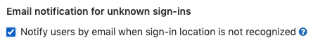



- Tier: 基础版，专业版，旗舰版
- Offering: 私有化部署



使用登录限制为 Web 界面和基于 HTTP(S) 的 Git 自定义认证限制。

前提条件：

- 你必须具有管理员访问权限。

<a id="password-and-passkey-authentication"></a>

## 密码和通行密钥认证

<a id="allow-password-and-passkey-authentication-for-the-web-interface"></a>

### 允许 Web 界面的密码和通行密钥认证

此设置默认启用。禁用后，用户将无法使用标准登录界面，必须改用[外部认证提供程序](../auth/_index.md)。这也会禁用使用通行密钥进行双因素认证。

要允许 Web 界面的密码和通行密钥认证：

1. 在右上角，选择 **管理员**。
1. 在左侧边栏中，选择 **设置** > **通用**。
1. 展开 **登录限制** 部分。
1. 选中 **允许 Web 界面的密码和通行密钥认证** 复选框。
1. 选择 **保存更改**。

> [!note]
> 如果外部认证提供程序发生故障，可以使用[极狐GitLab Rails 控制台](../operations/rails_console.md)
> [在 Rails 控制台中重新启用标准 Web 登录表单](#re-enable-standard-web-sign-in-form-in-rails-console)。
> 你还可以使用[应用程序设置 API](../../api/settings.md#update-application-settings)
> 来配置 `password_authentication_enabled_for_web` 设置。

<a id="allow-password-authentication-for-git-over-https"></a>

### 允许基于 HTTP(S) 的 Git 密码认证

此设置默认启用。禁用后，用户必须使用[个人访问令牌](../../user/profile/personal_access_tokens.md)或 LDAP 密码进行认证。

要允许基于 HTTP(S) 的 Git 密码认证：

1. 在右上角，选择 **管理员**。
1. 在左侧边栏中，选择 **设置** > **通用**。
1. 展开 **登录限制** 部分。
1. 选中 **允许基于 HTTP(S) 的 Git 密码认证** 复选框。
1. 选择 **保存更改**。

<a id="disable-password-and-passkey-authentication-for-users-with-an-sso-identity"></a>

### 为具有 SSO 身份的用户禁用密码和通行密钥认证

组织可能希望限制 SSO 用户使用密码或通行密钥登录，并要求他们改用其外部认证提供程序。这将限制 Web 界面和基于 HTTP(S) 的 Git 的密码认证，以及 Web 界面的通行密钥认证。通行密钥永远不能用于基于 HTTP(S) 的 Git。

要为具有 SSO 身份的用户禁用密码和通行密钥认证：

1. 在右上角，选择 **管理员**。
1. 在左侧边栏中，选择 **设置** > **通用**。
1. 展开 **登录限制** 部分。
1. 选中 **为具有 SSO 身份的用户禁用密码和通行密钥认证** 复选框。
1. 选择 **保存更改**。

<a id="two-factor-authentication"></a>

## 双因素认证

你可以要求用户为其账户注册一种双因素认证 (2FA) 方法。

<a id="enforce-two-factor-authentication-for-all-users"></a>

### 强制所有用户使用双因素认证

这要求所有用户（包括管理员）注册一种 2FA 方法。

要强制所有用户使用双因素认证：

1. 在右上角，选择 **管理员**。
1. 在左侧边栏中，选择 **设置** > **通用**。
1. 展开 **登录限制** 部分。
1. 选中 **强制双因素认证** 复选框。
1. 可选。在 **双因素宽限期** 中，输入小时数。用户必须在此时间结束前注册一种 2FA 方法。设置为 `0` 将在下次登录时强制注册。
1. 选择 **保存更改**。

<a id="enforce-two-factor-authentication-for-administrators"></a>

### 强制管理员使用双因素认证

这仅要求管理员注册一种 2FA 方法。这也包括具有[自定义管理员角色](../../user/custom_roles/_index.md)的用户。

要强制管理员使用双因素认证：

1. 在右上角，选择 **管理员**。
1. 在左侧边栏中，选择 **设置** > **通用**。
1. 展开 **登录限制** 部分。
1. 选中 **强制管理员使用双因素认证** 复选框。
1. 可选。在 **双因素宽限期** 中，输入小时数。用户必须在此时间结束前注册一种 2FA 方法。设置为 `0` 将在下次登录时强制注册。
1. 选择 **保存更改**。

<a id="admin-mode"></a>

## 管理员模式

如果你是管理员，你可能希望在没有管理员访问权限的情况下在极狐GitLab 中工作。你可以创建一个没有管理员访问权限的单独用户账户，或者使用管理员模式。

使用管理员模式，你的账户默认没有管理员访问权限。你可以继续访问你所属的群组和项目。但是，对于管理任务，你必须进行认证（[某些功能](#known-issues)除外）。

启用管理员模式后，它将应用于实例上的所有管理员。

为实例启用管理员模式后，管理员：

- 可以访问其所属的群组和项目。
- 无法访问 **管理员** 区域。

<a id="enable-admin-mode-for-your-instance"></a>

### 为实例启用管理员模式

管理员可以通过 API、Rails 控制台或 UI 启用管理员模式。

<a id="use-the-api-to-enable-admin-mode"></a>

#### 使用 API 启用管理员模式

向你的实例端点发出以下请求：

```shell
curl --request PUT --header "PRIVATE-TOKEN:$ADMIN_TOKEN" "<gitlab.example.com>/api/v4/application/settings?admin_mode=true"
```

将 `<gitlab.example.com>` 替换为你的实例 URL。

有关更多信息，请参阅[可通过 API 调用访问的设置列表](../../api/settings.md)。

<a id="use-the-rails-console-to-enable-admin-mode"></a>

#### 使用 Rails 控制台启用管理员模式



- Offering: 私有化部署



打开 [Rails 控制台](../operations/rails_console.md)并运行以下命令：

```ruby
::Gitlab::CurrentSettings.update!(admin_mode: true)
```

<a id="use-the-ui-to-enable-admin-mode"></a>

#### 使用 UI 启用管理员模式

要通过 UI 启用管理员模式：

1. 在右上角，选择 **管理员**。
1. 在左侧边栏中，选择 **设置** > **通用**。
1. 展开 **登录限制**。
1. 选择 **启用管理员模式**。
1. 选择 **保存更改**。

<a id="turn-on-admin-mode-for-your-session"></a>

### 为会话开启管理员模式

要为当前会话开启管理员模式并访问可能存在危险的资源：

1. 在右上角，选择你的头像。
1. 选择 **进入管理员模式**。
1. 尝试访问 URL 中包含 `/admin` 的 UI 的任何部分（这需要管理员访问权限）。

当管理员模式状态被禁用或关闭时，管理员无法访问资源，除非他们已被明确授予访问权限。例如，如果管理员尝试打开私有群组或项目，除非他们是该群组或项目的成员，否则会收到 `404` 错误。

应为管理员启用 2FA。管理员模式支持 2FA、OmniAuth 提供程序和 LDAP 认证。管理员模式状态存储在当前用户会话中，并保持活动状态，直到：

- 被明确禁用。
- 六小时后自动禁用。

<a id="check-if-your-session-has-admin-mode-enabled"></a>

### 检查会话是否已启用管理员模式



- 在极狐GitLab 16.10 中引入，带有一个名为 `show_admin_mode_within_active_sessions` 的功能标志。默认禁用。
- 在极狐GitLab 16.10 中在 JihuLab.com 上启用。
- 在极狐GitLab 17.0 中 GA。功能标志 `show_admin_mode_within_active_sessions` 已移除。



转到你的活动会话列表：

1. 在右上角，选择你的头像。
1. 选择 **编辑个人资料**。
1. 在左侧边栏中，选择 **访问** > **活动会话**。

已开启管理员模式的会话会显示文本 **在 `会话日期` 以管理员模式登录**。

<a id="turn-off-admin-mode-for-your-session"></a>

### 为会话关闭管理员模式

要为当前会话关闭管理员模式：

1. 在右上角，选择你的头像。
1. 选择 **离开管理员模式**。

<a id="known-issues"></a>

### 已知问题

管理员模式在六小时后超时，你无法更改此超时限制。

以下访问方法不受管理员模式保护：

- Git 客户端访问（使用公钥的 SSH 或使用个人访问令牌的 HTTPS）。

换句话说，原本受管理员模式限制的管理员仍然可以使用 Git 客户端，而无需额外的认证步骤。

要使用极狐GitLab REST 或 GraphQL API，管理员必须[创建个人访问令牌](../../user/profile/personal_access_tokens.md#create-a-personal-access-token)或 [OAuth 令牌](../../api/oauth2.md)，并具有 [`admin_mode` 范围](../../user/profile/personal_access_tokens.md#personal-access-token-scopes)。

如果具有 `admin_mode` 范围的个人访问令牌的管理员失去了其管理员访问权限，该用户即使仍然拥有带有 `admin_mode` 范围的令牌，也无法以管理员身份访问 API。有关更多信息，请参阅史诗 2158。

此外，当启用极狐GitLab Geo 时，在辅助节点上无法查看项目和设计的复制状态。当项目（议题 367926）和设计（议题 355660）迁移到新的 Geo 框架时，将提出修复方案。

<a id="troubleshooting-admin-mode"></a>

### 管理员模式故障排除

如有必要，你可以作为管理员使用以下两种方法之一禁用 **管理员模式**：

- API：

  ```shell
  curl --request PUT --header "PRIVATE-TOKEN:$ADMIN_TOKEN" "<gitlab-url>/api/v4/application/settings?admin_mode=false"
  ```

- [Rails 控制台](../operations/rails_console.md#starting-a-rails-console-session)：

  ```ruby
  ::Gitlab::CurrentSettings.update!(admin_mode: false)
  ```

<a id="email-notification-for-unknown-sign-ins"></a>

## 未知登录的邮件通知

启用后，极狐GitLab 会通知用户来自未知 IP 地址或设备的登录。有关更多信息，请参阅[未知登录的邮件通知](../../user/profile/notifications.md#notifications-for-unknown-sign-ins)。



<a id="sign-in-information"></a>

## 登录信息



- **登录文本** 设置在极狐GitLab 17.0 中弃用。



如果配置的 **主页 URL** 值不为空，所有未登录的用户将被重定向到该页面。

如果配置的 **退出页面 URL** 值不为空，所有用户在退出后将被重定向到该页面。

要向登录页面添加帮助消息，请[自定义你的登录和注册页面](../appearance.md#customize-your-sign-in-and-register-pages)。

<a id="troubleshooting"></a>

## 故障排除

<a id="re-enable-standard-web-sign-in-form-in-rails-console"></a>

### 在 Rails 控制台中重新启用标准 Web 登录表单



- Offering: 私有化部署



如果标准用户名和密码登录表单因[登录限制](#password-and-passkey-authentication)而被禁用，请重新启用它。

当配置的外部认证提供程序（通过 SSO 或 LDAP 配置）发生故障，需要直接登录极狐GitLab 时，你可以通过 [Rails 控制台](../operations/rails_console.md#starting-a-rails-console-session)使用此方法。

```ruby
Gitlab::CurrentSettings.update!(password_authentication_enabled_for_web: true)
```

