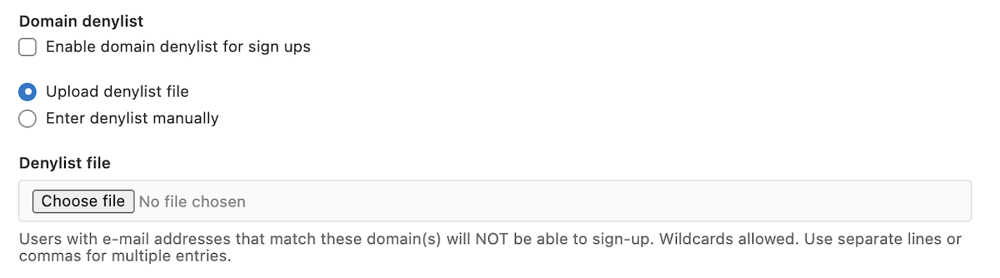



- Tier: 基础版，专业版，旗舰版
- Offering: 私有化部署



你可以对新增用户账号设置以下限制：

- 禁止创建账号。
- 要求新账号必须经过管理员审批。
- 要求用户验证邮箱。
- 允许或拒绝使用特定电子邮件域名的账号。

<a id="prerequisites"></a>

## 前提条件

你必须拥有管理员权限。

<a id="disable-new-user-account-creation"></a>

## 禁止新用户创建账号

默认情况下，任何访问你的极狐GitLab 域名的用户都可以创建账号。对于运行在公网上的极狐GitLab 实例，如果你不期望公共用户创建账号，我们强烈建议你考虑禁用新账号创建功能。

禁止创建新账号步骤：

1. 在右上角，选择 **管理员**。
1. 在左侧边栏，选择 **设置** > **通用**。
1. 展开 **新用户账号限制规则**。
1. 取消勾选 **允许创建新用户账号** 复选框，然后选择 **保存更改**。

你也可以通过 [Rails 控制台](../operations/rails_console.md) 运行以下命令来阻止新用户账号的创建：

```ruby
::Gitlab::CurrentSettings.update!(signup_enabled: false)
```

<a id="require-administrator-approval-for-new-user-accounts"></a>

## 要求管理员审批新用户账号

对于新的极狐GitLab 实例，此设置默认启用。
启用此设置后，任何通过注册表单在极狐GitLab 域名上注册新账号的用户，都必须经过管理员明确 [审批](../moderate_users.md#approve-or-reject-a-new-user-account) 才能开始使用其账号。该设置仅在允许创建用户账号时生效。

要要求管理员审批新用户账号：

1. 在右上角，选择 **管理员**。
1. 在左侧边栏，选择 **设置** > **通用**。
1. 展开 **新用户账号限制规则**。
1. 勾选 **要求管理员审批新用户账号** 复选框，然后选择 **保存更改**。

如果管理员禁用此设置，处于待审批状态的用户将通过后台任务自动获得批准。

> [!note]
> 此设置不适用于 LDAP 或 OmniAuth 用户。要强制对通过 OmniAuth 或 LDAP 注册的新用户进行审批，请在
> [OmniAuth 配置](../../integration/omniauth.md#configure-common-settings) 或
> [LDAP 配置](../auth/ldap/_index.md#basic-configuration-settings) 中将 `block_auto_created_users` 设置为 `true`。
> 也可以使用 [用户上限](#user-cap) 来强制新用户审批。

<a id="confirm-user-email"></a>

## 确认用户邮箱



- 软邮件确认在极狐GitLab 15.9 中从功能标志 [转变为](https://gitlab.com/gitlab-org/gitlab/-/merge_requests/107302/diffs) 应用设置。



你可以在创建账号时发送确认邮件，并要求用户验证其邮箱地址后才能登录。

要强制对新账号的邮箱地址进行确认：

1. 在右上角，选择 **管理员**。
1. 在左侧边栏，选择 **设置** > **通用**。
1. 展开 **新用户账号限制规则**。
1. 在 **邮件确认设置** 下，选择 **强制**。

有以下设置可选：

- **强制** - 在创建账号时发送确认邮件。新用户必须验证其邮箱地址才能登录。
- **软性** - 在创建账号时发送确认邮件。新用户可以立即登录，但必须在三天内确认邮箱。三天后，用户在确认邮箱之前将无法登录。
- **关闭** - 新用户无需验证邮箱地址即可登录。

<a id="restricted-access"></a>

## 受限访问



- Tier: 专业版，旗舰版
- Offering: 私有化部署





- 于极狐GitLab 17.8 [引入](https://gitlab.com/gitlab-org/gitlab/-/issues/501717)。
- 于极狐GitLab 18.0 [正式发布](https://gitlab.com/gitlab-org/gitlab/-/issues/523464)。
- 群组共享设置在极狐GitLab 18.7 中 [变更](https://gitlab.com/gitlab-org/gitlab/-/issues/488451)。



使用受限访问来避免超额费用。
当订阅中的授权用户数量超出时会产生超额费用，并必须在下一个 [季度对账](../../subscriptions/quarterly_reconciliation.md) 时支付。

开启受限访问后，当订阅中没有剩余授权席位时，实例将无法添加新的计费用户。

> [!note]
> 如果为包含待处理成员的实例或群组启用了用户上限，当你开启受限访问时，所有待处理成员将自动从该群组中移除。

<a id="turn-on-restricted-access"></a>

### 开启受限访问

前提条件：

- 你必须为管理员。
- 该群组或其子群组或项目不得外部共享。

开启受限访问步骤：

1. 在左侧边栏，选择 **设置** > **通用**。
1. 展开 **新用户账号限制规则**。
1. 在 **席位控制** 下，选择 **受限访问**。

当你开启受限访问时，[阻止邀请群组层级外的群组加入](../../user/project/members/sharing_projects_groups.md#prevent-inviting-groups-outside-the-group-hierarchy) 设置会自动开启。此设置可防止意外添加新的计费用户，从而避免产生超额费用。

你仍然可以根据需要独立配置 [群组及其子群组的项目共享设置](../../user/project/members/sharing_projects_groups.md#prevent-a-project-from-being-shared-with-groups)。

<a id="provisioning-behavior-with-saml-scim-and-ldap"></a>

### 使用 SAML、SCIM 和 LDAP 的供应行为



- 于极狐GitLab 18.6 [引入](https://gitlab.com/gitlab-org/gitlab/-/merge_requests/206932)，并带有名为 `bso_minimal_access_fallback` 的 [功能标志](../feature_flags/_index.md)。默认禁用。
- 于极狐GitLab 18.10 [默认启用](https://gitlab.com/gitlab-org/gitlab/-/merge_requests/225777)。



当启用受限访问且没有可用订阅席位时，通过 SAML、SCIM 或 LDAP 供应的用户将被分配最低访问权限角色，而非其配置的访问级别。
此行为旨在确保同步能够继续进行，而不会在 JihuLab.com 和极狐GitLab 旗舰版私有化部署中消耗计费席位。

拥有最低访问权限角色的用户可以认证并访问群组，但 [权限受限](../../user/permissions.md#users-with-minimal-access)。
当有席位可用时，这些用户可以被提升至其预期的访问级别。
已拥有计费角色的现有用户不受此行为影响。

你可以 [查看席位使用情况](../../subscriptions/manage_seats.md#view-seat-usage) 并管理拥有最低访问权限的用户。

<a id="known-issues"></a>

### 已知问题

当你开启受限访问时，可能会出现以下已知问题并导致超额：

- 在以下情况下，计费用户数仍可能超出：
  - 你使用 SAML、SCIM 或 LDAP 添加新成员，且已超出订阅席位数量。启用最低访问权限回退功能后，用户将被分配最低访问权限而非被阻止。
  - 多名具有管理员权限的用户同时添加成员。
  - 新计费用户延迟接受邀请。当你邀请用户时，他们不会立即消耗计费席位，直到他们接受邀请。如果受邀用户延迟接受，你在此期间可以邀请和添加其他用户。当延迟的用户最终接受时，他们会消耗一个计费席位，如果此时你已达到席位上限，则可能导致超额。
- 如果你通过极狐GitLab 销售团队以少于当前订阅的用户数续订，
  你将产生超额费用。为避免此费用，请在续订开始前移除多余用户。例如，如果你有 20 个用户，却为 15 个用户续订，
  那么你将需要为额外的 5 个用户支付超额费用。

此外，受限访问可能会阻碍标准的非超额流程：

- 被更新或添加到计费角色的服务机器人会被错误地阻止。
- 通过邮件邀请或更新现有计费用户会被意外阻止。

<a id="dormant-user-reactivation"></a>

### 休眠用户重新激活

当受限访问处于活动状态且没有授权席位可用时，
尝试重新登录的 [休眠用户](../moderate_users.md#automatically-deactivate-dormant-users) 将被设置为
[待审批](../moderate_users.md#users-pending-approval) 状态，而不是直接重新激活。他们现有的群组和项目成员资格将被保留。
当有席位可用时，管理员可以批准这些用户。

仅拥有 [最低访问权限](../../user/permissions.md#users-with-minimal-access) 角色的用户可以直接重新激活，因为他们不消耗计费席位。

<a id="user-cap"></a>

## 用户上限



- Tier: 专业版，旗舰版
- Offering: 私有化部署



用户上限是不需要管理员审批即可创建账号或添加到订阅中的最大计费用户数。达到用户上限后，创建账号或被添加的用户必须经管理员 [审批](../moderate_users.md#approve-or-reject-a-new-user-account)。
用户只有在管理员批准后才能使用其账号。

如果管理员提高或移除用户上限，待审批的用户将自动获得批准。

[计费用户](../../subscriptions/manage_seats.md#billable-users) 数量每天更新一次。
用户上限可能仅在已超出上限后才追溯生效。
如果上限设置低于当前计费用户数（例如 `1`），则该上限会立即生效。

你也可以为单个群组设置 [用户上限](../../user/group/manage.md#user-cap-for-groups)。

> [!note]
> 对于使用 LDAP 或 OmniAuth 的实例，当
> [管理员审批新用户账号](#require-administrator-approval-for-new-user-accounts)
> 被启用或禁用时，由于 Rails 配置的更改可能会导致停机。
> 你可以设置用户上限来强制新用户的审批。

<a id="set-a-user-cap"></a>

### 设置用户上限

前提条件：

- 你必须为管理员。

设置用户上限步骤：

1. 在右上角，选择 **管理员**。
1. 在左侧边栏，选择 **设置** > **通用**。
1. 展开 **新用户账号限制规则**。
1. 在 **用户上限** 字段中，输入一个数字或留空以表示无限制。
1. 选择 **保存更改**。

<a id="remove-the-user-cap"></a>

### 移除用户上限

移除用户上限后，不需要管理员审批即可创建账号的新用户数量将不再受限。

移除用户上限后，待审批的用户将自动获得批准。

前提条件：

- 你必须为管理员。

移除用户上限步骤：

1. 在右上角，选择 **管理员**。
1. 在左侧边栏，选择 **设置** > **通用**。
1. 展开 **新用户账号限制规则**。
1. 从 **用户上限** 中删除数字。
1. 选择 **保存更改**。

<a id="changing-from-user-cap-to-restricted-access"></a>

## 从用户上限更改为受限访问

当你从用户上限更改为受限访问时，所有待处理成员（待审批成员和受邀成员）将自动被移除。
为确保用户被批准为成员，你必须在启用受限访问之前批准或移除待处理成员。

<a id="modify-password-complexity-requirements"></a>

## 修改密码复杂度要求

默认情况下，用户密码有少量 [要求](../../user/profile/user_passwords.md#password-requirements)。
你可以修改这些要求来增加最小长度或要求特定字符类型。

更改密码要求不会影响现有用户的密码。
修改后的复杂度要求仅在这些情况下生效：

- 新用户创建账号时。
- 现有用户重置密码时。

修改密码复杂度要求步骤：

1. 在右上角，选择 **管理员**。
1. 在左侧边栏，选择 **设置** > **通用**。
1. 展开 **新用户账号限制规则**。
1. 修改复杂度要求：

   | 设置 | 描述 |
   |------|------|
   | **最小密码长度** | 设置所需的最小字符数。不能少于 8 个字符或多于 128 个字符。 |
   | **要求数字** | 要求密码至少包含一个数字 (0-9)。仅专业版和旗舰版。 |
   | **要求大写字母** | 要求密码至少包含一个大写字母 (A-Z)。仅专业版和旗舰版。 |
   | **要求小写字母** | 要求密码至少包含一个小写字母 (a-z)。仅专业版和旗舰版。 |
   | **要求符号** | 要求密码至少包含一个符号。仅专业版和旗舰版。 |

1. 选择 **保存更改**。

<a id="allow-or-deny-account-creation-by-using-specific-email-domains"></a>

## 通过特定电子邮件域允许或拒绝账号创建

你可以指定一个允许或禁止用于新用户账号的电子邮件域列表，可以是包含列表或排除列表。

这些限制仅适用于外部用户创建新账号时。管理员可以通过管理员面板添加使用被禁止域名的用户。用户也可以在创建账号后将其邮箱地址更改为被禁止的域名。

<a id="allowlist-email-domains"></a>

### 允许邮件域名列表

你可以限制用户只能使用与指定域名列表匹配的邮箱地址来创建用户账号。

<a id="denylist-email-domains"></a>

### 拒绝邮件域名列表

你可以阻止用户使用特定域名的邮箱地址进行注册。这有助于降低恶意用户使用一次性邮箱地址创建垃圾账号的风险。

<a id="create-email-domain-allowlist-or-denylist"></a>

### 创建邮件域名允许或拒绝列表

创建邮件域名允许或拒绝列表步骤：

1. 在右上角，选择 **管理员**。
1. 在左侧边栏，选择 **设置** > **通用**。
1. 展开 **新用户账号限制规则**。
1. 对于允许列表，你必须手动输入列表。对于拒绝列表，你可以手动输入或上传包含列表条目的 `.txt` 文件。

   允许列表和拒绝列表均支持通配符。例如，你可以使用
   `*.company.com` 来接受所有 `company.com` 的子域名，或使用 `*.io` 来阻止所有
   以 `.io` 结尾的域名。域名必须用空格、
   分号、逗号或换行符分隔。

   

<a id="set-up-ldap-user-filter"></a>

## 设置 LDAP 用户过滤器

你可以将极狐GitLab 访问权限限制为 LDAP 服务器上的部分 LDAP 用户。

请参阅 [设置 LDAP 用户过滤器的文档](../auth/ldap/_index.md#set-up-ldap-user-filter) 了解更多信息。

<a id="turn-on-administrator-approval-for-role-promotions"></a>

## 开启角色提升管理员审批



- Tier: 旗舰版
- Offering: 私有化部署





- 于极狐GitLab 16.9 [引入](https://gitlab.com/gitlab-org/gitlab/-/issues/433166)，并带有名为 `member_promotion_management` 的 [功能标志](../feature_flags/_index.md)。
- 功能标志 `member_promotion_management` 于极狐GitLab 17.5 从 `wip` [变更为](https://gitlab.com/gitlab-org/gitlab/-/merge_requests/167757/) `beta` 并默认启用。
- 功能标志 `member_promotion_management` 于极狐GitLab 18.0 [移除](https://gitlab.com/gitlab-org/gitlab/-/merge_requests/187888)。



要阻止现有用户在项目或群组中被提升至计费角色，请开启角色提升管理员审批功能。然后，你可以批准或拒绝那些 [等待管理员审批的提升请求](../moderate_users.md#view-users-pending-role-promotion)。

- 如果管理员将一个用户添加到群组或项目：
  - 如果新用户角色为 [计费角色](../../subscriptions/manage_seats.md#billable-users)，则该用户的所有其他成员资格请求将自动批准。
  - 如果新用户角色不是计费角色，则该用户的其他请求将保持待处理状态，直到管理员审批。
- 如果非管理员用户将一个用户添加到群组或项目：
  - 如果该用户在任何群组或项目中都没有计费角色，并且被添加或提升到计费角色，他们的请求将保持 [等待管理员审批状态](../moderate_users.md#view-users-pending-role-promotion)。
  - 如果该用户已有计费角色，则不需要管理员审批。

前提条件：

- 你必须为管理员。

开启角色提升审批步骤：

1. 在右上角，选择 **管理员**。
1. 在左侧边栏，选择 **设置** > **通用**。
1. 展开 **新用户账号限制规则**。
1. 在 **席位控制** 部分，选择 **审批角色提升**。

> [!note]
> 此审批要求不适用于由
> [LDAP 同步](../auth/ldap/ldap_synchronization.md)
> 或 [SAML 群组链接](../../user/group/saml_sso/group_sync.md) 授予的成员资格。通过 LDAP 或 SAML 获得角色提升的用户不需要管理员审批，无论他们之前是否拥有计费角色。