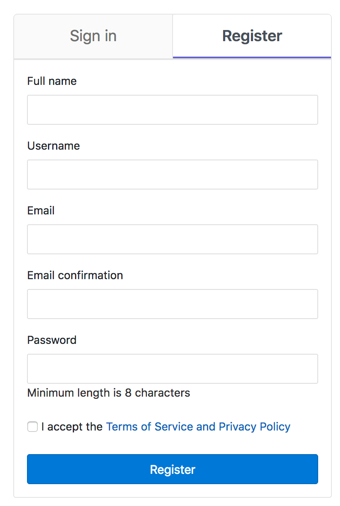



- Tier: 基础版，专业版，旗舰版
- Offering: 私有化部署



管理员可以强制要求接受服务条款和隐私政策。
启用此选项后，新用户和现有用户必须接受条款。

启用后，您可以在实例的 `-/users/terms` 页面查看服务条款，
例如 `https://gitlab.example.com/-/users/terms`。

如果定义了任何条款，**条款和隐私** 链接将显示在帮助菜单中。

## 强制要求服务条款和隐私政策

要强制接受服务条款和隐私政策：

1. 在右上角，选择 **管理员**。
1. 在左侧边栏，选择 **设置** > **通用**。
1. 展开 **服务条款和隐私政策** 部分。
1. 勾选 **所有用户必须接受服务条款和隐私政策才能访问极狐GitLab** 复选框。
1. 输入 **服务条款和隐私政策** 文本。您可以在文本框中使用的 [Markdown](../../user/markdown.md)。
1. 选择 **保存更改**。

对于每次条款更新，都会存储一个新版本。当用户接受或拒绝条款时，极狐GitLab 会记录他们接受或拒绝的版本。

现有用户必须在下一次与极狐GitLab 交互时接受条款。
如果已验证用户拒绝条款，他们将被注销。

启用后，会在新用户注册页面添加一个必选复选框：

