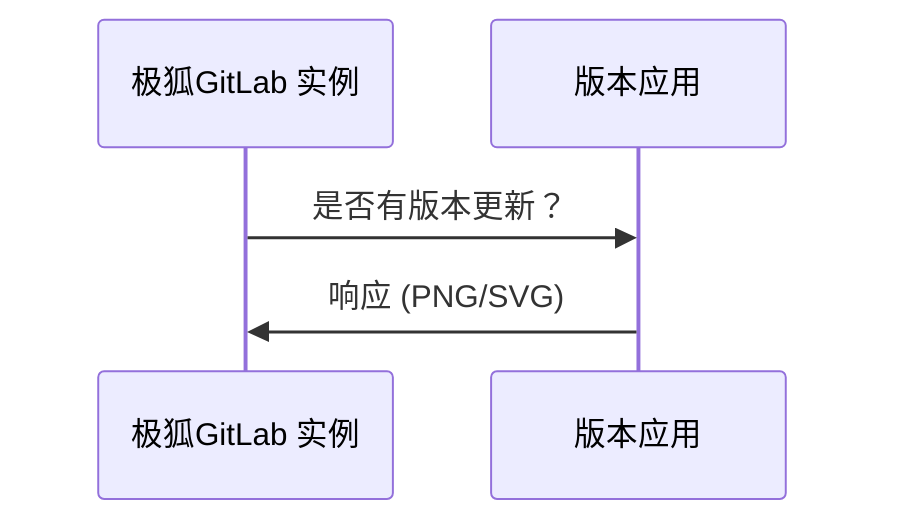



- Tier: 基础版，专业版，旗舰版
- Offering: 私有化部署



极狐GitLab Inc. 会定期收集有关您实例的信息，以便执行各种操作。

对于基础版私有化部署实例，所有使用统计数据均为[选择退出](#enable-or-disable-service-ping)。

<a id="service-ping"></a>

## 服务 Ping

服务 Ping 是一个收集并每周向极狐GitLab Inc. 发送有效负载的过程。当 服务 Ping 启用时，极狐GitLab 会从其他实例收集数据，并启用某些依赖于 服务 Ping 的[实例级分析功能](../../user/analytics/_index.md)。

<a id="why-enable-service-ping"></a>

### 为什么要启用服务 Ping？

服务 Ping 的主要目的是构建更好的极狐GitLab。我们收集关于极狐GitLab 使用方式的数据，以了解功能或阶段的采用和使用情况。这些数据揭示了极狐GitLab 如何增值，并帮助我们团队理解人们使用极狐GitLab 的原因，基于这些认知我们可以做出更好的产品决策。

启用 服务 Ping 还有其他几个好处：

- 分析您的极狐GitLab 安装中随时间变化的用户活动。
- 一个 [DevOps 评分](../analytics/devops_adoption.md)，让您概览整个实例从规划到监控的并发 DevOps 采用情况。
- 通过客户成功经理 (CSM) 提供更主动的支持，他们可以利用收集到的数据。
- 洞见和建议，帮助您从极狐GitLab 投资中获得最大价值。
- 报告展示您与其他类似组织（匿名）的对比情况，并针对如何改进您的 DevOps 流程提供具体建议和推荐。
- 参与我们的[注册功能计划](#registration-features-program)，以获得免费付费功能。

<a id="service-ping-settings"></a>

### 服务 Ping 设置

极狐GitLab 提供与 服务 Ping 相关的三个设置：

- **启用服务 Ping**：控制是否将 服务 Ping 数据发送到极狐GitLab。
- **启用服务 Ping 生成**：控制是否在您的实例上生成 服务 Ping 数据。
- **在服务 Ping 中包含可选数据**：控制是否在 服务 Ping 数据中包含可选指标。

这三个设置以下述方式相互作用：

- 当 **服务 Ping** 启用时，**服务 Ping 生成** 将自动启用且无法禁用。
- 当 **服务 Ping** 禁用时，您可以独立控制 **服务 Ping 生成**。
- **在服务 Ping 中包含可选数据** 仅在 **服务 Ping** 或 **服务 Ping 生成** 其中之一启用时才可用。

<a id="registration-features-program"></a>

## 注册功能计划

在极狐GitLab 14.1 及更高版本中，运行极狐GitLab 企业版的基础版私有化部署实例客户可以通过[启用注册功能](#enable-registration-features) 并通过服务 Ping 向我们发送活动数据来获得付费功能。此处引入的功能不会将其从付费层级中移除。付费层级的实例受 [Cloud Licensing](https://gitlab.cn/pricing/licensing-faq/cloud-licensing/) 管理的[产品使用数据政策](https://handbook.gitlab.com/handbook/legal/privacy/customer-product-usage-information/)约束。

<a id="available-features"></a>

### 可用功能

在下表中，您可以看到：

- 注册功能计划中可用的功能
- 功能可用的极狐GitLab 版本

| 功能 | 可用版本 |
| ------ | ------ |
| [来自极狐GitLab 的电子邮件](../email_from_gitlab.md)       |   极狐GitLab 14.1 及更高版本     |
| [仓库大小限制](account_and_limit_settings.md#repository-size-limit) | 极狐GitLab 14.4 及更高版本 |
| [按 IP 地址限制群组访问](../../user/group/access_and_permissions.md#restrict-group-access-by-ip-address) | 极狐GitLab 14.4 及更高版本 |
| [查看描述变更历史](../../user/discussions/_index.md#view-description-change-history) | 极狐GitLab 16.0 及更高版本 |
| [维护模式](../maintenance_mode/_index.md) | 极狐GitLab 16.0 及更高版本 |
| [可配置的议题看板](../../user/project/issue_board.md#configurable-issue-boards) | 极狐GitLab 16.0 及更高版本 |
| [覆盖率引导的模糊测试](../../user/application_security/coverage_fuzzing/_index.md) | 极狐GitLab 16.0 及更高版本 |
| [修改密码复杂度要求](sign_up_restrictions.md#modify-password-complexity-requirements) | 极狐GitLab 16.0 及更高版本 |
| [群组 Wiki](../../user/project/wiki/group.md) | 极狐GitLab 16.5 及更高版本 |
| [议题分析](../../user/group/issues_analytics/_index.md) | 极狐GitLab 16.5 及更高版本 |
| [电子邮件中的自定义文本](email.md#custom-additional-text) | 极狐GitLab 16.5 及更高版本 |
| [贡献分析](../../user/group/contribution_analytics/_index.md) | 极狐GitLab 16.5 及更高版本 |
| [群组文件模板](../../user/group/manage.md#group-file-templates) | 极狐GitLab 16.6 及更高版本 |
| [群组 Webhook](../../user/project/integrations/webhooks.md#group-webhooks) | 极狐GitLab 16.6 及更高版本 |
| [服务等级协议倒计时](../../operations/incident_management/incidents.md#service-level-agreement-countdown-timer) | 极狐GitLab 16.6 及更高版本 |
| [将项目成员锁定到群组](../../user/group/access_and_permissions.md#prevent-members-from-being-added-to-projects-in-a-group) | 极狐GitLab 16.6 及更高版本 |
| [用户和权限报告](../admin_area.md#user-permission-export) | 极狐GitLab 16.6 及更高版本 |
| [高级搜索](../../user/search/advanced_search.md) | 极狐GitLab 16.6 及更高版本 |
| [DevOps 采纳](../../user/group/devops_adoption/_index.md) | 极狐GitLab 16.6 及更高版本 |
| [带产物依赖的跨项目流水线](../../ci/yaml/_index.md#needsproject) | 极狐GitLab 16.7 及更高版本 |
| [功能标志相关议题](../../operations/feature_flags.md#feature-flag-related-issues) | 极狐GitLab 16.7 及更高版本 |
| [合并结果流水线](../../ci/pipelines/merged_results_pipelines.md) | 极狐GitLab 16.7 及更高版本 |
| [外部仓库的 CI/CD](../../ci/ci_cd_for_external_repos/_index.md) | 极狐GitLab 16.7 及更高版本 |
| [GitHub 的 CI/CD](../../ci/ci_cd_for_external_repos/github_integration.md) | 极狐GitLab 16.7 及更高版本 |

<a id="enable-registration-features"></a>

### 启用注册功能

1. 以具有管理员访问权限的用户身份登录。
1. 在右上角，选择 **管理员**。
1. 在左侧边栏中，选择 **设置** > **指标与分析**。
1. 展开 **使用统计信息** 部分。
1. 如果未启用，请选中 **启用服务 Ping** 复选框。
1. 选中 **启用注册功能** 复选框。
1. 选择 **保存更改**。

<a id="version-check"></a>

## 版本检查

如果启用，版本检查会通过状态通知您是否有新版本可用及其重要性。该状态会显示在所有已验证用户的帮助页面（`/help`）上，以及 **管理员** 区域页面上。状态包括：

- 绿色：您正在运行最新版本的极狐GitLab。
- 橙色：极狐GitLab 有可用的更新版本。
- 红色：您运行的极狐GitLab 版本存在漏洞。您应尽快安装包含安全修复的最新版本。


<a id="enable-or-disable-version-check"></a>

### 启用或禁用版本检查

前提条件：

- 管理员访问权限。

1. 在右上角，选择 **管理员**。
1. 在左侧边栏中，选择 **设置** > **指标与分析**。
1. 展开 **使用统计信息**。
1. 选中或清除 **启用版本检查** 复选框。
1. 选择 **保存更改**。

<a id="request-flow-example"></a>

### 请求流程示例

以下示例展示了您的实例与极狐GitLab 版本应用之间的基本请求/响应流程：



<a id="configure-your-network"></a>

## 配置您的网络

要将使用统计数据发送到极狐GitLab Inc.，您必须允许网络流量从您的极狐GitLab 实例到主机 `version.gitlab.com`，端口为 `443`。

如果您的极狐GitLab 实例位于代理后面，请设置适当的[代理配置变量](https://gitlab.cn/docs/omnibus/settings/environment-variables/)。

<a id="enable-or-disable-service-ping"></a>

## 启用或禁用服务 Ping

> [!note]
> 您是否能完全禁用服务 Ping 取决于实例的层级和具体许可证。
> 服务 Ping 设置仅控制数据是共享给极狐GitLab，还是仅限于实例内部使用。
> 即使您禁用了服务 Ping，`gitlab_service_ping_worker` 后台任务仍然会定期为您的实例生成服务 Ping 有效负载。
> 该有效负载可在[指标与分析](#manually-upload-service-ping-payload)管理部分查看。

<a id="through-the-ui"></a>

### 通过用户界面

前提条件：

- 管理员访问权限。

启用或禁用服务 Ping：

1. 在右上角，选择 **管理员**。
1. 在左侧边栏中，选择 **设置** > **指标与分析**。
1. 展开 **使用统计信息**。
1. 选中或清除 **启用服务 Ping** 复选框。
1. 选择 **保存更改**。

<a id="through-the-configuration-file"></a>

### 通过配置文件

要禁用服务 Ping 并防止将来通过 **管理员** 区域进行配置。





1. 编辑 `/etc/gitlab/gitlab.rb`：

   ```ruby
   gitlab_rails['usage_ping_enabled'] = false
   ```

1. 重新配置极狐GitLab：

   ```shell
   sudo gitlab-ctl reconfigure
   ```





1. 编辑 `/home/git/gitlab/config/gitlab.yml`：

   ```yaml
   production: &base
     # ...
     gitlab:
       # ...
       usage_ping_enabled: false
   ```

1. 重启极狐GitLab：

   ```shell
   sudo service gitlab restart
   ```





<a id="enable-or-disable-service-ping-generation"></a>

## 启用或禁用服务 Ping 生成

服务 Ping 生成控制是否在您的实例上自动生成服务 Ping 数据。启用后，极狐GitLab 会定期生成包含使用统计信息的服务 Ping 有效负载。此设置独立于数据是否与极狐GitLab 共享。

<a id="through-the-ui"></a>

### 通过用户界面

前提条件：

- 管理员访问权限。

启用或禁用服务 Ping 生成：

1. 在右上角，选择 **管理员**。
1. 在左侧边栏中，选择 **设置** > **指标与分析**。
1. 展开 **使用统计信息**。
1. 选中或清除 **启用服务 Ping 生成** 复选框。
   - 如果 **启用服务 Ping** 已选中，则此设置将自动启用且无法交互更改。
   - 如果 **启用服务 Ping** 已清除，您可以独立控制此设置。
1. 选择 **保存更改**。

<a id="through-the-configuration-file"></a>

### 通过配置文件

要通过配置控制服务 Ping 生成：





1. 编辑 `/etc/gitlab/gitlab.rb`：

   ```ruby
   gitlab_rails['usage_ping_enabled'] = false
   gitlab_rails['usage_ping_generation_enabled'] = false
   ```

1. 重新配置极狐GitLab：

   ```shell
   sudo gitlab-ctl reconfigure
   ```





1. 编辑 `/home/git/gitlab/config/gitlab.yml`：

   ```yaml
   production: &base
     # ...
     gitlab:
       # ...
       usage_ping_enabled: false
       usage_ping_generation_enabled: false
   ```

1. 重启极狐GitLab：

   ```shell
   sudo service gitlab restart
   ```





<a id="enable-or-disable-optional-data-in-service-ping"></a>

## 启用或禁用服务 Ping 中的可选数据

极狐GitLab 区分运营数据和可选收集的数据。

> [!note]
> **在服务 Ping 中包含可选数据** 选项仅在 **启用服务 Ping** 或 **启用服务 Ping 生成** 其中之一启用时才可用。如果两个设置均被禁用，此选项会自动禁用。

<a id="through-the-ui"></a>

### 通过用户界面

前提条件：

- 管理员访问权限。

启用或禁用服务 Ping 中的可选数据：

1. 在右上角，选择 **管理员**。
1. 进入 **设置** > **指标与分析**。
1. 展开 **使用统计信息** 部分。
1. 确保已选中 **启用服务 Ping** 或 **启用服务 Ping 生成** 复选框。
1. 要启用可选数据，请选中 **在服务 Ping 中包含可选数据** 复选框。要禁用它，请清除该框。
1. 选择 **保存更改**。

<a id="through-the-configuration-file"></a>

### 通过配置文件





1. 编辑 `/etc/gitlab/gitlab.rb`：

   ```ruby
   gitlab_rails['include_optional_metrics_in_service_ping'] = false
   ```

1. 重新配置极狐GitLab：

   ```shell
   sudo gitlab-ctl reconfigure
   ```





1. 编辑 `/home/git/gitlab/config/gitlab.yml`：

   ```yaml
   production: &base
     # ...
     gitlab:
       # ...
       include_optional_metrics_in_service_ping: false
   ```

1. 重启极狐GitLab：

   ```shell
   sudo service gitlab restart
   ```





<a id="access-the-service-ping-payload"></a>

## 访问服务 Ping 有效负载

您可以在 **管理员** 区域或通过 API 访问发送至极狐GitLab Inc. 的精确 JSON 有效负载。

<a id="in-the-ui"></a>

### 在用户界面中

1. 以具有管理员访问权限的用户身份登录。
1. 在右上角，选择 **管理员**。
1. 在左侧边栏中，选择 **设置** > **指标与分析**。
1. 展开 **使用统计信息**。
1. 选择 **预览有效负载**。

<a id="through-the-api"></a>

### 通过 API

请参阅 [服务 Ping API 文档](../../api/usage_data.md)。

<a id="manually-upload-service-ping-payload"></a>

## 手动上传服务 Ping 有效负载

即使您的实例没有互联网访问权限，或者服务 Ping 定时任务未启用，您也可以将服务 Ping 有效负载上传到极狐GitLab。

要手动上传有效负载：

1. 以具有管理员访问权限的用户身份登录。
1. 在右上角，选择 **管理员**。
1. 在左侧边栏中，选择 **设置** > **指标与分析**。
1. 展开 **使用统计信息**。
1. 选择 **下载有效负载**。
1. 保存 JSON 文件。
1. 访问 [服务使用数据中心](https://version.gitlab.com/usage_data/new)。
1. 选择 **选择文件**，然后选择包含已下载有效负载的 JSON 文件。
1. 选择 **上传**。

上传的文件使用安全的 HTTPS 协议进行加密和发送。HTTPS 在 Web 浏览器和服务器之间创建一个安全的通信通道，保护传输的数据免受中间人攻击。

如果手动上传遇到问题：

1. 在[版本应用项目的安全分叉](https://jihulab.com/gitlab-cn/security/version.gitlab.com)中打开一个机密议题。
1. 如果可能，附上 JSON 有效负载。
1. 标记 `@gitlab-org/analytics-section/analytics-instrumentation`，他们将对此议题进行分类。

