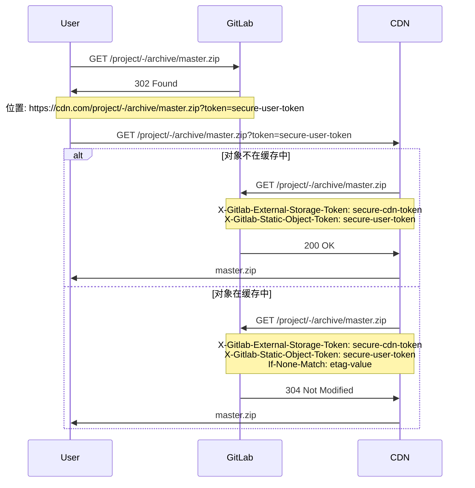



- Tier: 基础版，专业版，旗舰版
- Offering: 私有化部署



配置极狐GitLab 从外部存储（如内容分发网络 CDN）提供仓库静态对象（例如归档文件或原始 blob）。

<a id="configure-external-storage"></a>

## 配置外部存储

前提条件：

- 管理员访问权限。

要为静态对象配置外部存储：

1. 在右上角，选择 **管理员**。
1. 在左侧边栏中，选择 **设置** > **代码仓**。
1. 展开 **仓库静态对象的外部存储**。
1. 输入基础 URL 和任意令牌。当你[设置外部存储](#set-up-external-storage)时，使用一个脚本将这些值设置为 `ORIGIN_HOSTNAME` 和 `STORAGE_TOKEN`。
1. 选择 **保存更改**。

令牌用于区分来自外部存储的请求，以防止用户绕过外部存储直接访问应用程序。极狐GitLab 期望在源自外部存储的请求中，在 `X-Gitlab-External-Storage-Token` 标头中设置此令牌。

<a id="serving-private-static-objects"></a>

## 提供私有静态对象

极狐GitLab 为属于私有项目的静态对象 URL 附加用户特定的令牌，以便外部存储可以代表用户进行身份验证。

当处理源自外部存储的请求时，极狐GitLab 检查以下内容以确认用户是否可以访问请求的对象：

- `token` 查询参数。
- `X-Gitlab-Static-Object-Token` 标头。

<a id="requests-flow-example"></a>

## 请求流程示例

以下示例展示了用户、极狐GitLab 和内容分发网络之间的请求和响应序列：



<a id="set-up-external-storage"></a>

## 设置外部存储

虽然本过程使用 [Cloudflare Workers](https://workers.cloudflare.com) 作为外部存储，但其他 CDN 或函数即服务（FaaS）系统应能使用相同的原理工作。

1. 如果你尚未选择，请选择一个 Cloudflare Worker 域。
1. 在下面的脚本中，为前两个常量设置以下值：

   - `ORIGIN_HOSTNAME`：您的极狐GitLab 安装的主机名。
   - `STORAGE_TOKEN`：任意安全令牌。您可以通过在 UNIX 机器上运行 `pwgen -cn1 64` 来获取令牌。按照[配置](#configure-external-storage)部分的说明，保存此令牌到 **管理员** 区域。

     ```javascript
     const ORIGIN_HOSTNAME = 'gitlab.installation.com' // FIXME: SET CORRECT VALUE
     const STORAGE_TOKEN = 'very-secure-token' // FIXME: SET CORRECT VALUE
     const CACHE_PRIVATE_OBJECTS = false

     const CORS_HEADERS = {
       'Access-Control-Allow-Origin': '*',
       'Access-Control-Allow-Methods': 'GET, HEAD, OPTIONS',
       'Access-Control-Allow-Headers': 'X-Csrf-Token, X-Requested-With',
     }

     self.addEventListener('fetch', event => event.respondWith(handle(event)))

     async function handle(event) {
       try {
         let response = await verifyAndHandle(event);

         // responses returned from cache are immutable, so we recreate them
         // to set CORS headers
         response = new Response(response.body, response)
         response.headers.set('Access-Control-Allow-Origin', '*')

         return response
       } catch (e) {
         return new Response('An error occurred!', {status: e.statusCode || 500})
       }
     }

     async function verifyAndHandle(event) {
       if (!validRequest(event.request)) {
         return new Response(null, {status: 400})
       }

       if (event.request.method === 'OPTIONS') {
         return handleOptions(event.request)
       }

       return handleRequest(event)
     }

     function handleOptions(request) {
       // Make sure the necessary headers are present
       // for this to be a valid pre-flight request
       if (
         request.headers.get('Origin') !== null &&
         request.headers.get('Access-Control-Request-Method') !== null &&
         request.headers.get('Access-Control-Request-Headers') !== null
       ) {
         // Handle CORS pre-flight request
         return new Response(null, {
           headers: CORS_HEADERS,
         })
       } else {
         // Handle standard OPTIONS request
         return new Response(null, {
           headers: {
             Allow: 'GET, HEAD, OPTIONS',
           },
         })
       }
     }

     async function handleRequest(event) {
       let cache = caches.default
       let url = new URL(event.request.url)
       let static_object_token = url.searchParams.get('token')
       let headers = new Headers(event.request.headers)

       url.host = ORIGIN_HOSTNAME
       url = normalizeQuery(url)

       headers.set('X-Gitlab-External-Storage-Token', STORAGE_TOKEN)
       if (static_object_token !== null) {
         headers.set('X-Gitlab-Static-Object-Token', static_object_token)
       }

       let request = new Request(url, { headers: headers })
       let cached_response = await cache.match(request)
       let is_conditional_header_set = headers.has('If-None-Match')

       if (cached_response) {
         return cached_response
       }

       // We don't want to override If-None-Match that is set on the original request
       if (cached_response && !is_conditional_header_set) {
         headers.set('If-None-Match', cached_response.headers.get('ETag'))
       }

       let response = await fetch(request, {
         headers: headers,
         redirect: 'manual'
       })

       if (response.status == 304) {
         if (is_conditional_header_set) {
           return response
         } else {
           return cached_response
         }
       } else if (response.ok) {
         response = new Response(response.body, response)

         // cache.put will never cache any response with a Set-Cookie header
         response.headers.delete('Set-Cookie')

         if (CACHE_PRIVATE_OBJECTS) {
           response.headers.delete('Cache-Control')
         }

         event.waitUntil(cache.put(request, response.clone()))
       }

       return response
     }

     function normalizeQuery(url) {
       let searchParams = url.searchParams
       url = new URL(url.toString().split('?')[0])

       if (url.pathname.includes('/raw/')) {
         let inline = searchParams.get('inline')

         if (inline == 'false' || inline == 'true') {
           url.searchParams.set('inline', inline)
         }
       } else if (url.pathname.includes('/-/archive/')) {
         let append_sha = searchParams.get('append_sha')
         let path = searchParams.get('path')

         if (append_sha == 'false' || append_sha == 'true') {
           url.searchParams.set('append_sha', append_sha)
         }
         if (path) {
           url.searchParams.set('path', path)
         }
       }

       return url
     }

     function validRequest(request) {
       let url = new URL(request.url)
       let path = url.pathname

       if (/^(.+)(\/raw\/|\/-\/archive\/)/.test(path)) {
         return true
       }

       return false
     }
     ```

1. 使用此脚本创建一个新的 worker。
1. 复制你的 `ORIGIN_HOSTNAME` 和 `STORAGE_TOKEN` 值。使用这些值[为静态对象配置外部存储](#configure-external-storage)。