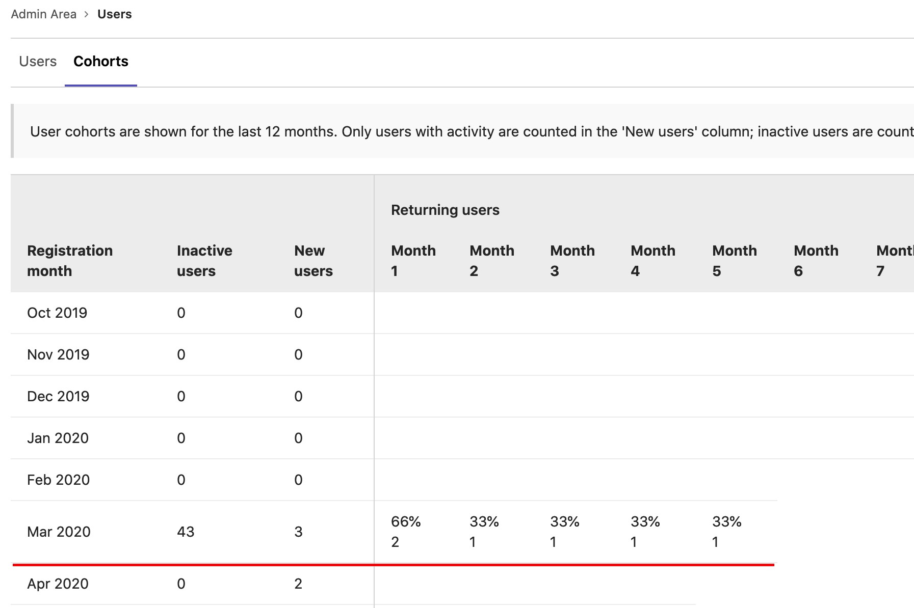



- Tier: 基础版，专业版，旗舰版
- Offering: 私有化部署



您可以分析用户在一段时间内的 极狐GitLab 活动情况。

如何解读用户群组表格？让我们通过以下用户群组示例来分析：

以 2020 年 3 月的群组为例，有三位用户加入了此服务器并从该月起保持活跃。一个月后（2020 年 4 月），有两位用户仍然活跃。五个月后（2020 年 8 月），该群组中仅有一位用户仍然活跃，即占 3 月加入的原始三人群组的 33%。

**未活跃用户**列显示了当月新增但从未在实例中有过任何活动的用户数量。

我们如何衡量用户的活动？极狐GitLab 会在以下情况将用户视为活跃：

- 用户登录。
- 用户有 Git 活动（包括推送和拉取）。
- 用户访问与仪表盘、项目、议题或合并请求相关的页面。
- 用户使用 API。
- 用户使用 GraphQL API。

## 查看用户群组

前提条件：

- 需要管理员访问权限。

要查看用户群组：

1. 在右上角，选择 **管理员**。
1. 在左侧边栏中，选择 **概览** > **用户**。
1. 选择 **群组** 选项卡。
