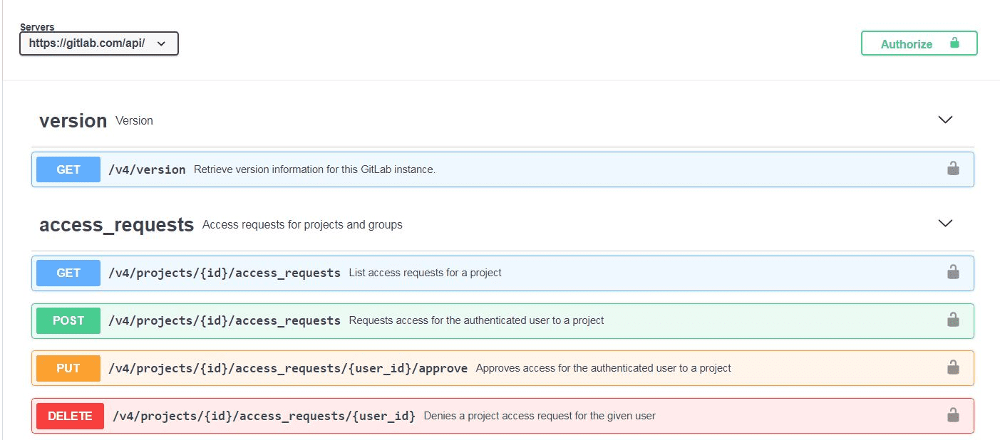
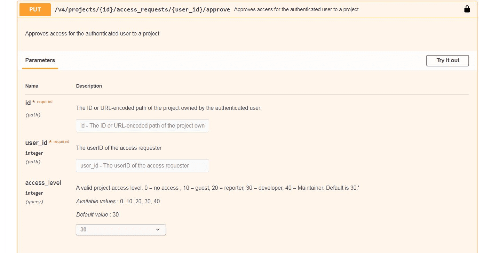
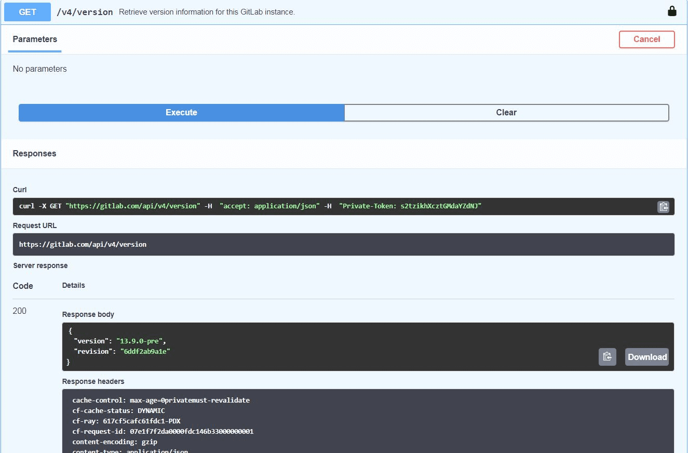

[OpenAPI 规范](https://swagger.io/specification/)（以前称为 Swagger）定义了 RESTful API 的标准、语言无关的接口。OpenAPI 定义文件使用 YAML 格式编写，极狐GitLab 浏览器会自动将其渲染为更易于阅读的界面。

有关极狐GitLab API 的常规信息，请参阅[使用极狐GitLab 扩展](../_index.md)。

<!--
The following link is absolute rather than relative because it needs to be viewed through the GitLab
Open API file viewer: <https://gitlab.cn/docs/user/project/repository/files/#render-openapi-files>.
-->
[交互式 API 文档工具](https://jihulab.com/gitlab-cn/gitlab/-/blob/master/doc/api/openapi/openapi_v2.yaml)允许直接在 JihuLab.com 网站上进行 API 测试。目前只有少数可用端点使用 OpenAPI 规范进行了文档化，但当前列表展示了该工具的功能。

## 端点参数

展开端点列表时，你会看到描述、输入参数（如果需要）以及示例服务器响应。某些参数包含默认值或允许值列表。

## 开始交互式会话

[个人访问令牌](../../user/profile/personal_access_tokens.md)（PAT）是开始交互式会话的一种方式。为此，请从主页选择 **授权**，然后会弹出一个对话框，提示你输入 PAT，该 PAT 在当前 Web 会话中有效。

要测试端点，首先在端点定义页面上选择 **试一试**。根据需要输入参数，然后选择 **执行**。以下示例执行了对 `version` 端点的请求（无需参数）。该工具会显示请求的 `curl` 命令和 URL，然后显示返回的服务器响应。你可以通过编辑相关参数并再次选择 **执行** 来创建新的响应。

## 愿景

API 代码是唯一的事实来源，API 文档应与其实现紧密耦合。OpenAPI 规范提供了一种标准化且全面的 API 文档化方式。它应该成为记录极狐GitLab REST API 的首选格式。这将带来更准确、可靠且用户友好的文档，从而提升使用极狐GitLab REST API 的整体体验。

为了实现这一目标，每次 API 代码变更时都应要求更新 OpenAPI 规范。这样做可以确保文档始终是最新且准确的，降低用户混淆和出错的风险。

OpenAPI 文档应从 API 代码自动生成，以便易于保持其最新性和准确性。这将为我们的文档团队节省时间和精力。

你可以在[在 OpenAPI V2 史诗中记录 REST API](https://jihulab.com/groups/gitlab-cn/-/epics/8926) 中跟踪这一愿景的当前进展。