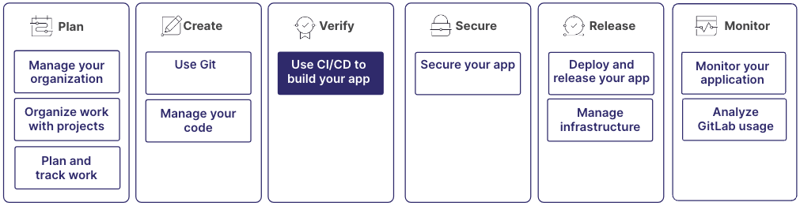



- Tier: 基础版，专业版，旗舰版
- Offering: JihuLab.com，私有化部署



CI/CD 是一种持续的软件开发方法，你可以持续地构建、测试、部署和监控迭代代码更改。

此迭代过程有助于减少基于有缺陷或失败的先前版本开发新代码的几率。极狐GitLab CI/CD 可以在开发周期早期捕获错误，并帮助确保部署到生产环境的代码符合你既定的代码标准。

此过程是更大工作流的一部分：

## Step 1: Configure your pipeline

要使用极狐GitLab CI/CD，你需要从项目根目录下的 `.gitlab-ci.yml` 文件开始。此文件指定了 CI/CD 流水线中要执行的阶段、作业和脚本。它是一个具有自定义语法的 YAML 文件。

默认情况下，文件名为 `.gitlab-ci.yml`，但你可以使用任何文件名。

在此文件中，你定义变量、作业之间的依赖关系，并指定每个作业的执行时间和方式。

流水线在 `.gitlab-ci.yml` 文件中定义，并在 runner 上执行该文件时运行。

流水线由阶段和作业组成：

- 阶段定义执行顺序。典型的阶段可能是 `build`、`test` 和 `deploy`。
- 作业指定在每个阶段要执行的任务。例如，一个作业可以编译或测试代码。

流水线可以由各种事件触发，如提交或合并，也可以按计划执行。在你的流水线中，你可以与广泛的工具和平台集成。

更多信息，请参见：

- [教程：创建并运行你的第一条极狐GitLab CI/CD 流水线](quick_start/_index.md)
- [流水线](pipelines/_index.md)

## Step 2: Find or create runners

Runner 是运行你作业的代理。这些代理可以在物理机或虚拟实例上运行。在你的 `.gitlab-ci.yml` 文件中，你可以指定运行作业时要使用的容器镜像。Runner 加载镜像，克隆你的项目，然后在本地或容器中运行作业。

如果你使用 JihuLab.com，Linux、Windows 和 macOS 上的 runner 已经可供使用。如果需要，你也可以注册你自己的 runner。

如果你不使用 JihuLab.com，你可以：

- 注册 runner 或使用已为你的私有化部署实例注册的 runner。
- 在你的本地机器上创建一个 runner。

更多信息，请参见：

- [创建、注册并运行你自己的项目 runner](../tutorials/create_register_first_runner/_index.md)

## Step 3: Use CI/CD variables and expressions

极狐GitLab CI/CD 变量是键值对，用于存储配置设置和敏感信息（如密码或 API 密钥），并将其传递给流水线中的作业。

极狐GitLab CI/CD 表达式允许你将数据动态注入流水线配置。可用的数据取决于表达式上下文。例如，`inputs` 上下文允许你访问从父文件传入配置文件的或在运行流水线时传入的信息。

### CI/CD variables

使用 CI/CD 变量来定制作业，让在其他地方定义的值可以被作业访问。你可以在 `.gitlab-ci.yml` 文件中硬编码 CI/CD 变量，在项目设置中设置它们，或动态生成它们。你可以为项目、群组或实例定义变量。

以下类型的变量可用：

- 自定义变量：你在 UI、API 或配置文件中创建和管理的变量。
- 预定义变量：极狐GitLab 自动设置以提供有关当前作业、流水线和环境信息的变量。

你可以使用安全设置来配置变量：

- 受保护变量：限制对在受保护分支或标签上运行的作业的访问。
- 掩码变量：在作业日志中隐藏变量值，以防止敏感信息泄露。

更多信息，请参见：

- [CI/CD 变量](variables/_index.md)

### CI/CD expressions

CI/CD 表达式使用 `$[[ ]]` 语法，并在你创建流水线时进行验证。你还可以在提交更改之前在流水线编辑器中验证表达式。

表达式支持基于不同上下文的动态配置：

- **Inputs context** (`$[[ inputs.INPUT_NAME ]]`)：访问通过 `include:inputs` 或在运行新流水线时传入配置文件的类型化参数
- **Matrix context** (`$[[ matrix.IDENTIFIER ]]`)：访问作业依赖项中的矩阵值，以在矩阵作业之间创建 1:1 映射

更多信息，请参见：

- [CI 表达式](yaml/expressions.md)

## Step 4: Use CI/CD components

CI/CD 组件是一个可重用的流水线配置单元。使用 CI/CD 组件可以构成整个流水线配置或更大流水线的一小部分。

你可以使用 `include:component` 将组件添加到你的流水线配置中。

可重用组件有助于减少重复、提高可维护性并促进项目间的一致性。创建一个组件项目并将其发布到 CI/CD 目录，以便在多个项目间共享你的组件。

极狐GitLab 还为常见任务和集成提供了 CI/CD 组件模板。

更多信息，请参见：

- [CI/CD 组件](components/_index.md)