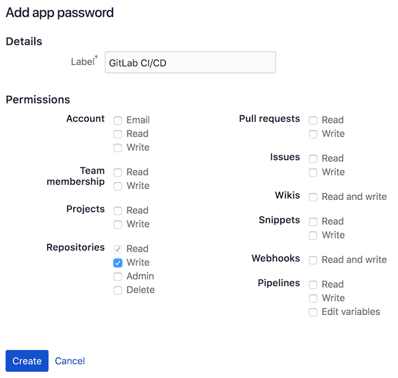



- Tier: 专业版，旗舰版
- Offering: JihuLab.com，私有化部署



极狐GitLab CI/CD 可以通过以下方式与 Bitbucket Cloud 配合使用：

1. 创建一个 [CI/CD 项目](_index.md)。
1. 通过 URL 连接你的 Git 仓库。

要使用极狐GitLab CI/CD 与 Bitbucket Cloud 仓库：

1. 在 Bitbucket 中，创建一个 [**应用密码**](https://support.atlassian.com/bitbucket-cloud/docs/create-an-app-password/) 来认证
   用于在 Bitbucket 中设置提交构建状态的脚本。需要仓库写入权限。

   

1. 在 Bitbucket 中，在你的仓库中，选择 **克隆**，然后复制 `git clone` 之后的 URL。
1. 在极狐GitLab 中，创建一个项目：

   1. 在右上角，选择 **新建** () 和 **新项目/仓库**。
   1. 选择 **为外部仓库运行 CI/CD**。
   1. 选择 **通过 URL 创建仓库**。
   1. 填写字段：
      - 对于 **Git 仓库 URL**，输入你的 Bitbucket 仓库的 URL。确保删除你的 `@username`。
      - 对于 **用户名**，输入与应用密码关联的用户名。
      - 对于 **密码**，输入来自 Bitbucket 的应用密码。

   极狐GitLab 导入仓库并启用 [拉取镜像](../../user/project/repository/mirror/pull.md)。
   你可以在项目的 **设置** > **代码仓** > **镜像仓库** 中检查镜像是否正常工作。

1. 在极狐GitLab 中，生成一个具有 `api` 范围的
   [个人访问令牌](../../user/profile/personal_access_tokens.md)。该令牌用于认证从 Bitbucket 中创建的 webhook 发送的请求，以通知极狐GitLab 有新提交。

1. 在 Bitbucket 中，从 **设置** > **Webhooks**，创建一个新的 webhook 来通知极狐GitLab 有新提交。

1. 将 webhook URL 设置为 [极狐GitLab 拉取镜像](../../api/project_pull_mirroring.md#start-the-pull-mirroring-process-for-a-project) 端点，并使用你刚刚生成的个人访问令牌进行认证。

   ```plaintext
   https://gitlab.example.com/api/v4/projects/:project_id/mirror/pull?private_token=<your_personal_access_token>
   ```

   webhook 触发器应设置为 **仓库推送**。

   

   保存后，通过向你的 Bitbucket 仓库推送更改来测试 webhook。

1. 在极狐GitLab 中，从 **设置** > **CI/CD** > **变量**，添加变量以允许通过 Bitbucket API 与 Bitbucket 通信：

   - `BITBUCKET_ACCESS_TOKEN`：之前创建的 Bitbucket 应用密码。此变量应 [被掩码](../variables/_index.md#mask-a-cicd-variable)。
   - `BITBUCKET_USERNAME`：Bitbucket 账户的用户名。
   - `BITBUCKET_NAMESPACE`：如果你的极狐GitLab 和 Bitbucket 命名空间不同，请设置此变量。
   - `BITBUCKET_REPOSITORY`：如果你的极狐GitLab 和 Bitbucket 项目名称不同，请设置此变量。

1. 在 Bitbucket 中，添加一个将流水线状态推送到 Bitbucket 的脚本。该脚本在 Bitbucket 中创建，但镜像过程会将其复制到极狐GitLab 镜像中。极狐GitLab CI/CD 流水线运行该脚本，并将状态推送回 Bitbucket。

   创建一个文件 `build_status`，插入以下脚本并在终端中运行 `chmod +x build_status` 以使脚本可执行。

   ```shell
   #!/usr/bin/env bash

   # 将极狐GitLab CI/CD 构建状态推送到 Bitbucket Cloud

   if [ -z "$BITBUCKET_ACCESS_TOKEN" ]; then
      echo "错误：BITBUCKET_ACCESS_TOKEN 未设置"
   exit 1
   fi
   if [ -z "$BITBUCKET_USERNAME" ]; then
       echo "错误：BITBUCKET_USERNAME 未设置"
   exit 1
   fi
   if [ -z "$BITBUCKET_NAMESPACE" ]; then
       echo "将 BITBUCKET_NAMESPACE 设置为 $CI_PROJECT_NAMESPACE"
       BITBUCKET_NAMESPACE=$CI_PROJECT_NAMESPACE
   fi
   if [ -z "$BITBUCKET_REPOSITORY" ]; then
       echo "将 BITBUCKET_REPOSITORY 设置为 $CI_PROJECT_NAME"
       BITBUCKET_REPOSITORY=$CI_PROJECT_NAME
   fi

   BITBUCKET_API_ROOT="https://api.bitbucket.org/2.0"
   BITBUCKET_STATUS_API="$BITBUCKET_API_ROOT/repositories/$BITBUCKET_NAMESPACE/$BITBUCKET_REPOSITORY/commit/$CI_COMMIT_SHA/statuses/build"
   BITBUCKET_KEY="ci/gitlab-ci/$CI_JOB_NAME"

   case "$BUILD_STATUS" in
   running)
      BITBUCKET_STATE="INPROGRESS"
      BITBUCKET_DESCRIPTION="构建正在运行！"
      ;;
   passed)
      BITBUCKET_STATE="SUCCESSFUL"
      BITBUCKET_DESCRIPTION="构建通过！"
      ;;
   failed)
      BITBUCKET_STATE="FAILED"
      BITBUCKET_DESCRIPTION="构建失败。"
      ;;
   esac

   echo "正在推送状态到 $BITBUCKET_STATUS_API..."
   curl --request POST "$BITBUCKET_STATUS_API" \
   --user $BITBUCKET_USERNAME:$BITBUCKET_ACCESS_TOKEN \
   --header "Content-Type:application/json" \
   --silent \
   --data "{ \"state\": \"$BITBUCKET_STATE\", \"key\": \"$BITBUCKET_KEY\", \"description\":
   \"$BITBUCKET_DESCRIPTION\",\"url\": \"$CI_PROJECT_URL/-/jobs/$CI_JOB_ID\" }"
   ```

1. 在 Bitbucket 中，创建一个 `.gitlab-ci.yml` 文件以使用该脚本将流水线成功和失败推送到 Bitbucket。与之前添加的脚本类似，此文件作为镜像过程的一部分被复制到极狐GitLab 仓库中。

   ```yaml
   stages:
     - test
     - ci_status

   unit-tests:
     script:
       - echo "成功。添加你的测试！"

   success:
     stage: ci_status
     before_script:
       - ""
     after_script:
       - ""
     script:
       - BUILD_STATUS=passed BUILD_KEY=push ./build_status
     when: on_success

   failure:
     stage: ci_status
     before_script:
       - ""
     after_script:
       - ""
     script:
       - BUILD_STATUS=failed BUILD_KEY=push ./build_status
     when: on_failure
   ```

极狐GitLab 现在已配置为从 Bitbucket 镜像更改，运行在 `.gitlab-ci.yml` 中配置的 CI/CD 流水线，并将状态推送到 Bitbucket。