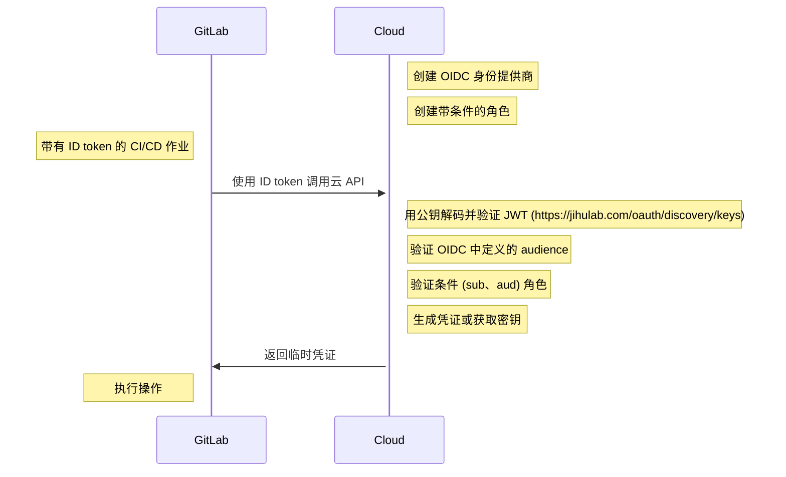



- Tier: 基础版，专业版，旗舰版
- Offering: JihuLab.com，私有化部署





- 在极狐GitLab 15.7 引入了 [ID tokens](../secrets/id_token_authentication.md) 以支持包括 HashiCorp Vault 在内的任何 OIDC 提供商。



> [!warning]
> `CI_JOB_JWT` 和 `CI_JOB_JWT_V2` [在极狐GitLab 15.9 弃用](../../update/deprecations.md#old-versions-of-json-web-tokens-are-deprecated)，并计划在 极狐GitLab 17.0 中移除。请改用 [ID tokens](../secrets/id_token_authentication.md)。

极狐GitLab CI/CD 支持 [OpenID Connect (OIDC)](https://openid.net/developers/how-connect-works/) 以赋予你的构建和部署作业访问云凭证和服务的权限。过去，团队会将密钥存储在项目中，或在极狐GitLab Runner 实例上分配权限来进行构建和部署。支持 OIDC 的 [ID tokens](../secrets/id_token_authentication.md) 可在 CI/CD 作业中配置，让你能够遵循可扩展且最小权限的安全方法。

在极狐GitLab 15.6 及更早版本中，你必须使用 `CI_JOB_JWT_V2` 而不是 ID token，但它不可自定义。

<a id="prerequisites"></a>

## 先决条件

- 极狐GitLab 账户。
- 拥有支持 OIDC 的云提供商访问权限以配置授权和创建角色。

ID tokens 支持以下支持 OIDC 的云提供商：

- AWS
- Azure
- GCP
- HashiCorp Vault

> [!note]
> 配置 OIDC 会为所有流水线启用对应目标环境的 JWT token 访问权限。
> 当你为流水线配置 OIDC 时，你应该对该流水线完成软件供应链安全审查，重点关注额外的访问。有关供应链攻击的更多信息，请参阅
> [DevOps 平台如何帮助防范供应链攻击](https://gitlab.cn/blog/devops-platform-supply-chain-attacks/)。

<a id="use-cases"></a>

## 使用场景

- 取消了将密钥存储在极狐GitLab 群组或项目中的需要。可以通过 OIDC 从云提供商获取临时凭证。
- 提供对云资源的临时访问，并基于细粒度的极狐GitLab 条件（包括群组、项目、分支或标签）。
- 允许你在 CI/CD 作业中定义职责分离，实现有条件的环境访问。过去，应用可能会通过指定的极狐GitLab Runner 进行部署，该 Runner 只能访问预生产或生产环境。这导致了 Runner 的泛滥，因为每台机器都有专门的权限。
- 允许实例 runner 安全地访问多个云账户。访问由 JWT token 确定，该 token 特定于运行流水线的用户。
- 取消了创建密钥轮换逻辑的需要，因为默认情况下可以获取临时凭证。

<a id="id-token-authentication-for-cloud-services"></a>

## 云服务的 ID token 身份认证

每个作业都可以配置 ID tokens，它们作为 CI/CD 变量提供，包含 [token payload](../secrets/id_token_authentication.md#token-payload)。这些 JWT 可用于与支持 OIDC 的云提供商（如 AWS、Azure、GCP 或 Vault）进行身份验证。

<a id="authorization-workflow"></a>

### 授权工作流程



1. 在云中创建 OIDC 身份提供商（例如 AWS、Azure、GCP、Vault）。
1. 在云服务中创建一个条件角色，该角色会过滤到群组、项目、分支或标签。
1. CI/CD 作业包含一个 ID token，即 JWT token。你可以使用该 token 与云 API 进行授权。
1. 云验证 token，从 payload 中验证条件角色，并返回一个临时凭证。

<a id="configure-a-conditional-role-with-oidc-claims"></a>

## 配置具有 OIDC 声明的条件角色

要在极狐GitLab 与 OIDC 之间建立信任关系，你需要在云提供商中创建一个能检查 JWT 的条件角色。该条件用于验证 JWT，从而专门针对两个声明——受众（aud）和主体（sub）建立信任。

- 受众（`aud`）：作为 ID token 的一部分进行配置：

  ```yaml
  job_needing_oidc_auth:
    id_tokens:
      OIDC_TOKEN:
        aud: https://oidc.provider.com
    script:
      - echo $OIDC_TOKEN
  ```

- 主体（`sub`）：一个描述极狐GitLab CI/CD 工作流（包括群组、项目、分支和标签）的元数据连接。`sub` 字段的格式如下：
  - `project_path:{group}/{project}:ref_type:{type}:ref:{branch_name}`

| 筛选类型                                        | 示例 |
|----------------------------------------------------|---------|
| 筛选到任意分支                               | 支持通配符。`project_path:mygroup/myproject:ref_type:branch:ref:*` |
| 筛选到特定项目、主分支            | `project_path:mygroup/myproject:ref_type:branch:ref:main` |
| 筛选到群组下的所有项目               | 支持通配符。`project_path:mygroup/*:ref_type:branch:ref:main` |
| 筛选到 Git 标签                                | 支持通配符。`project_path:mygroup/*:ref_type:tag:ref:1.0` |

<a id="oidc-authorization-with-your-cloud-provider"></a>

## 使用你的云提供商进行 OIDC 授权

要连接你的云提供商，请参阅以下教程：

- [在 AWS 中配置 OpenID Connect](aws/_index.md)
- [在 Azure 中配置 OpenID Connect](azure/_index.md)
- [在 Google Cloud 中配置 OpenID Connect](google_cloud/_index.md)