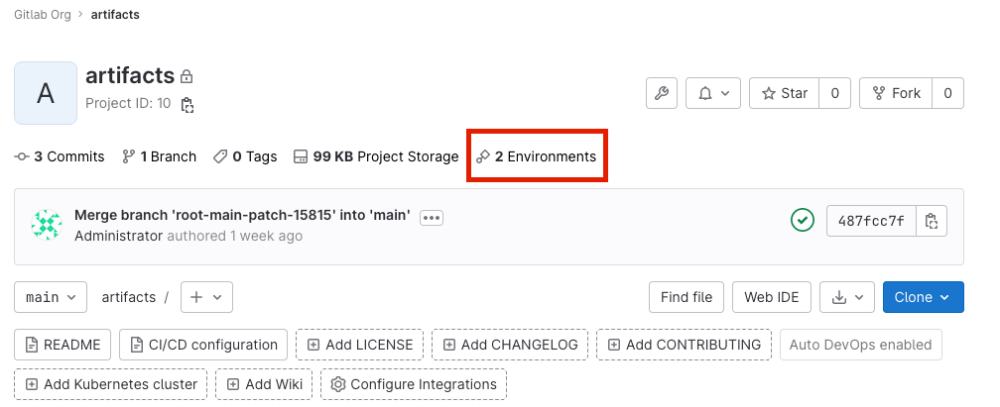
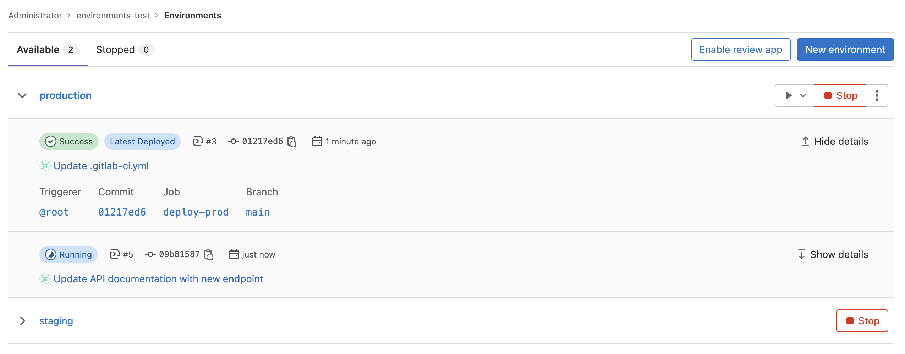
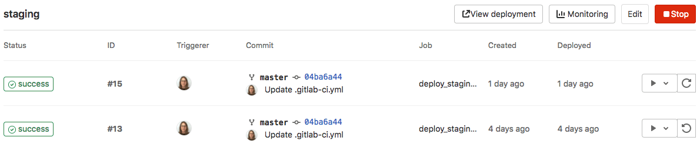
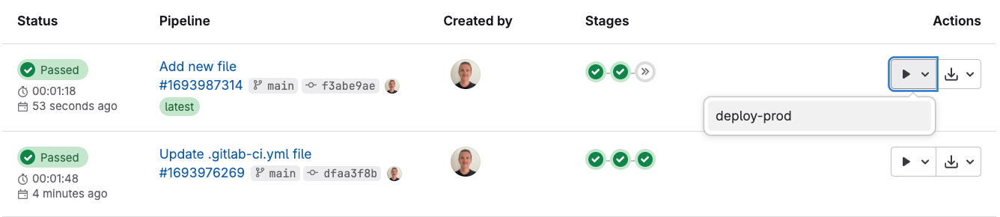
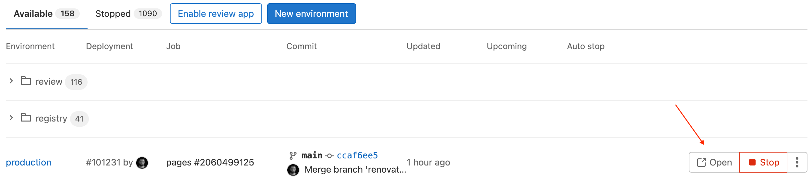
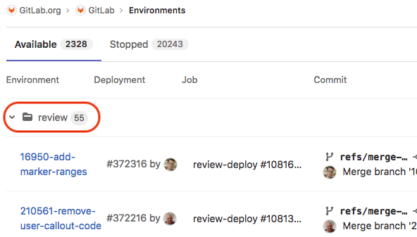
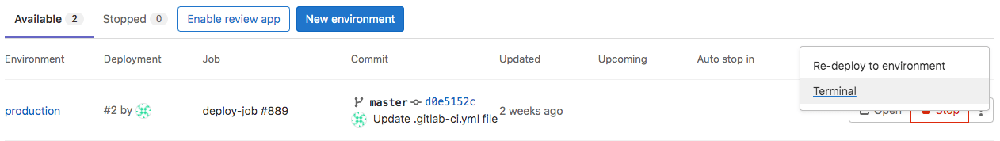



- Tier: 基础版，专业版，旗舰版
- Offering: JihuLab.com，私有化部署



极狐GitLab 环境代表您的应用程序的特定部署目标，例如开发、预发布或生产环境。您可以使用它来管理不同的配置，并在软件生命周期的各个阶段部署代码。

使用环境，您可以：

- 保持部署过程的一致性和可重复性
- 跟踪代码部署到了哪里
- 在出现问题时回滚到以前的版本
- 保护敏感环境免受未经授权的更改
- 按环境控制部署变量以维护安全边界
- 监控环境健康状况，并在出现问题时获取警报

<a id="view-environments-and-deployments"></a>

## 查看环境和部署

先决条件：

- 在私有项目中，您必须具有报告者、开发者、维护者或所有者角色。请参阅 [环境权限](#environment-permissions)。

您可以通过以下几种方式查看给定项目的环境列表：

- 在项目的概览页面上，如果至少有一个环境可用（即未停止）。

  

- 在左侧边栏中，选择 **操作** > **环境**。环境将显示出来。

  

- 要查看某个环境的部署列表，请选择环境名称，
  例如，`staging`。只有在部署作业创建部署后，部署才会显示在此列表中。

  

- 要查看部署流水线中所有手动作业的列表，请选择 **运行** () 下拉列表。

  

<a id="environment-url"></a>

### 环境 URL

[环境 URL](../yaml/_index.md#environmenturl) 显示在极狐GitLab 的几个位置：

- 在合并请求中作为链接：

  

- 在环境视图中作为按钮：

  

- 在部署视图中作为按钮：

  

如果满足以下条件，您可以在合并请求中看到此信息：

- 合并请求最终合并到默认分支（通常是 `main`）。
- 该分支也部署到某个环境（例如，`staging` 或 `production`）。

例如：


<a id="go-from-source-files-to-public-pages"></a>

#### 从源文件转到公共页面

借助极狐GitLab [路由映射](../review_apps/_index.md#route-maps)，您可以直接从源文件转到为 Review App 设置的环境中的公共页面。

<a id="types-of-environments"></a>

## 环境类型

环境可以是静态的，也可以是动态的。

静态环境：

- 通常由连续的部署重复使用。
- 具有静态名称。例如，`staging` 或 `production`。
- 手动创建或作为 CI/CD 流水线的一部分创建。

动态环境：

- 通常在 CI/CD 流水线中创建，并且仅由单个部署使用，然后停止或删除。
- 具有动态名称，通常基于 CI/CD 变量的值。
- 是 [Review App](../review_apps/_index.md) 的一项功能。

环境具有三种状态之一，具体取决于其 [停止作业](../yaml/_index.md#environmenton_stop) 是否已运行：

- `available`：环境存在。可能有部署。
- `stopping`：_on stop 作业_ 已启动。当未定义 on stop 作业时，此状态不适用。
- `stopped`：_on stop 作业_ 已运行，或用户手动停止了该作业。

<a id="create-a-static-environment"></a>

## 创建静态环境

您可以在 UI 或 `.gitlab-ci.yml` 文件中创建静态环境。

<a id="in-the-ui"></a>

### 在 UI 中

先决条件：

- 您必须具有开发者、维护者或所有者角色。

要在 UI 中创建静态环境：

1. 在顶部栏中，选择 **搜索或跳转到** 并找到您的项目。
1. 在左侧边栏中，选择 **操作** > **环境**。
1. 选择 **创建环境**。
1. 填写字段。
1. 选择 **保存**。

<a id="in-your-gitlab-ciyml-file"></a>

### 在 `.gitlab-ci.yml` 文件中

先决条件：

- 您必须具有开发者、维护者或所有者角色。

要创建静态环境，请在您的 `.gitlab-ci.yml` 文件中：

1. 在 `deploy` 阶段定义一个作业。
1. 在作业中，定义环境 `name` 和 `url`。如果当流水线运行时该名称的环境不存在，则会创建它。

> [!note]
> 环境名称中不能使用某些字符。有关 `environment` 关键字的更多信息，请参阅 [`.gitlab-ci.yml` 关键字参考](../yaml/_index.md#environment)。

例如，要创建一个名为 `staging`、URL 为 `https://staging.example.com` 的环境：

```yaml
deploy_staging:
  stage: deploy
  script:
    - echo "Deploy to staging server"
  environment:
    name: staging
    url: https://staging.example.com
```

<a id="create-a-dynamic-environment"></a>

## 创建动态环境

要创建动态环境，您需要使用对每个流水线唯一的 [CI/CD 变量](#cicd-variables)。

先决条件：

- 您必须具有开发者、维护者或所有者角色。

要创建动态环境，请在您的 `.gitlab-ci.yml` 文件中：

1. 在 `deploy` 阶段定义一个作业。
1. 在作业中，定义以下环境属性：
   - `name`：使用相关的 CI/CD 变量，如 `$CI_COMMIT_REF_SLUG`。可选地，为环境名称添加静态前缀，这会在 [UI 中分组](#group-similar-environments) 所有具有相同前缀的环境。
   - `url`：可选。使用相关的 CI/CD 变量（如 `$CI_ENVIRONMENT_SLUG`）作为主机名的前缀。

> [!note]
> 环境名称中不能使用某些字符。有关 `environment` 关键字的更多信息，请参阅 [`.gitlab-ci.yml` 关键字参考](../yaml/_index.md#environment)。

在以下示例中，每次 `deploy_review_app` 作业运行时，都会使用唯一值定义环境的名称和 URL。

```yaml
deploy_review_app:
  stage: deploy
  script: make deploy
  environment:
    name: review/$CI_COMMIT_REF_SLUG
    url: https://$CI_ENVIRONMENT_SLUG.example.com
  rules:
    - if: $CI_COMMIT_BRANCH == "main"
      when: never
    - if: $CI_COMMIT_BRANCH
```

<a id="set-a-dynamic-environment-url"></a>

### 设置动态环境 URL

某些外部托管平台会为每次部署生成随机 URL，例如
`https://94dd65b.amazonaws.com/qa-lambda-1234567`。这使得在 `.gitlab-ci.yml` 文件中引用该 URL 变得困难。

您可以配置部署作业，将生成的 URL 捕获为 dotenv 变量，并将其传递给 `environment:url`。在您的作业中指定 [`artifacts:reports:dotenv`](../variables/dotenv_variables.md)。当作业完成时，极狐GitLab 会解析 dotenv 报告，并使用变量值展开 `environment:url`。然后，分配的 URL 会在 UI 中可见。

您还可以将静态前缀与变量组合，例如
`https://$DYNAMIC_ENVIRONMENT_URL`。如果 `DYNAMIC_ENVIRONMENT_URL` 是 `example.com`，则结果是 `https://example.com`。

在以下示例中，Review App 为每个合并请求创建一个新环境：

- `review` 作业由每次推送触发，并创建或更新名为
  `review/your-branch-name` 的环境。环境 URL 设置为 `$DYNAMIC_ENVIRONMENT_URL`。
- 当 `review` 作业完成时，极狐GitLab 会更新 `review/your-branch-name` 环境的 URL。
  它解析 `deploy.env` 报告，提取变量，并使用它们来展开和设置 `environment:url`。

```yaml
review:
  script:
    - DYNAMIC_ENVIRONMENT_URL=$(deploy-script)                                 # In script, get the environment URL.
    - echo "DYNAMIC_ENVIRONMENT_URL=$DYNAMIC_ENVIRONMENT_URL" >> deploy.env    # Add the value to a dotenv file.
  artifacts:
    reports:
      dotenv: deploy.env                                                       # Report back dotenv file to rails.
  environment:
    name: review/$CI_COMMIT_REF_SLUG
    url: $DYNAMIC_ENVIRONMENT_URL                                              # and set the variable produced in script to `environment:url`
    on_stop: stop_review

stop_review:
  script:
    - ./teardown-environment
  when: manual
  environment:
    name: review/$CI_COMMIT_REF_SLUG
    action: stop
```

请注意以下事项：

- `stop_review` 不会生成 dotenv 报告产物，因此它无法识别
  `DYNAMIC_ENVIRONMENT_URL` 环境变量。因此，您不应在
  `stop_review` 作业中设置 `environment:url`。
- 如果环境 URL 无效（例如，URL 格式错误），系统不会更新环境 URL。
- 如果在 `stop_review` 中运行的脚本仅存在于您的代码仓库中，因此无法使用
  `GIT_STRATEGY: none` 或 `GIT_STRATEGY: empty`，请为这些作业配置 [合并请求流水线](../pipelines/merge_request_pipelines.md)。
  这可以确保即使功能分支被删除，Runner 也能获取代码仓库。有关更多信息，请参阅 [Runner 的 Ref 规范](../pipelines/_index.md#ref-specs-for-runners)。

> [!note]
> 对于 Windows Runner，您应该使用 PowerShell `Add-Content` 命令写入 `.env` 文件。

```powershell
Add-Content -Path deploy.env -Value "DYNAMIC_ENVIRONMENT_URL=$DYNAMIC_ENVIRONMENT_URL"
```

<a id="deployment-tier-of-environments"></a>

## 环境的部署层级

同一群组中的项目可以为同一部署层级使用不同的环境名称。
例如，一个项目可能对同一层级使用 production，而另一个项目使用 custom-portal。
群组受保护环境使用部署层级来处理这些差异。

以下部署层级可用：

- development
- testing
- staging
- production
- other

极狐GitLab 根据以下模式从 [环境名称](../yaml/_index.md#environmentname) 猜测部署层级：

| Ruby 正则表达式模式                                    | 部署层级 |
|-------------------------------------------------------------|-----------------|
| `/(dev\|review\|trunk)/i`                                   | development     |
| `/(test\|tst\|int\|ac(ce\|)pt\|qa\|qc\|control\|quality)/i` | testing         |
| `/(st(a\|)g\|mod(e\|)l\|pre\|demo\|non)/i`                  | staging         |
| `/(pr(o\|)d\|live)/i`                                       | production      |

不匹配任何模式的环境名称被猜测为 `other`。

为避免自动猜测，请使用 [`deployment_tier` 关键字](../yaml/_index.md#environmentdeployment_tier)。

您无法在 UI 中设置部署层级。

<a id="rename-an-environment"></a>

### 重命名环境

您无法重命名环境。

要实现与重命名环境相同的效果：

1. [停止现有环境](#stop-an-environment-by-using-the-ui)。
1. [删除现有环境](#delete-an-environment)。
1. [创建具有所需名称的新环境](#create-a-static-environment)。

<a id="cicd-variables"></a>

## CI/CD 变量

要自定义您的环境和部署，您可以使用任何
[预定义 CI/CD 变量](../variables/predefined_variables.md)，
并定义自定义 CI/CD 变量。

<a id="limit-the-environment-scope-of-a-cicd-variable"></a>

### 限制 CI/CD 变量的环境范围

默认情况下，所有 [CI/CD 变量](../variables/_index.md) 都可用于流水线中的所有作业。
如果作业中的测试工具被攻陷，该工具可能会尝试检索该作业可用的所有 CI/CD 变量。为帮助缓解此类供应链攻击，
您应该将敏感变量的环境范围限制为仅需要它们的作业。

通过定义 CI/CD 变量可用于哪些环境来限制其环境范围。默认环境范围是 `*` 通配符，因此任何作业都可以访问该变量。

您可以使用特定匹配来选择特定环境。例如，将变量的环境范围设置为 `production`，以仅允许 [环境](../yaml/_index.md#environment) 为 `production` 的作业访问该变量。

您还可以使用通配符匹配（`*`）来选择特定的环境组，
例如使用 `review/*` 选择所有 [Review App](../review_apps/_index.md)。

例如，对于以下四个环境：

- `production`
- `staging`
- `review/feature-1`
- `review/feature-2`

这些环境范围的匹配方式如下：

| ↓ 范围 / 环境 → | `production` | `staging` | `review/feature-1` | `review/feature-2` |
|:------------------------|:-------------|:----------|:-------------------|:-------------------|
| `*`                     | 匹配        | 匹配     | 匹配              | 匹配              |
| `production`            | 匹配        |           |                    |                    |
| `staging`               |              | 匹配     |                    |                    |
| `review/*`              |              |           | 匹配              | 匹配              |
| `review/feature-1`      |              |           | 匹配              |                    |

您不应将环境范围的变量与 [`rules`](../yaml/_index.md#rules)
或 [`include`](../yaml/_index.md#include) 一起使用。当极狐GitLab 在流水线创建时验证流水线配置时，这些变量可能未定义。

<a id="search-environments"></a>

## 搜索环境

要按名称搜索环境：

1. 在顶部栏中，选择 **搜索或跳转到** 并找到您的项目。
1. 在左侧边栏中，选择 **操作** > **环境**。
1. 在搜索栏中，输入您的搜索词。
   - **搜索词的长度应为 3 个或更多字符**。
   - 匹配从环境名称的开头开始应用。
     - 例如，`devel` 匹配环境名称 `development`，但 `elop` 不匹配。
   - 对于具有文件夹名称格式的环境，匹配在基础文件夹名称之后应用。
     - 例如，当名称为 `review/test-app` 时，搜索词 `test` 匹配 `review/test-app`。
     - 使用带前缀的文件夹名称搜索，如 `review/test`，也会匹配 `review/test-app`。

<a id="group-similar-environments"></a>

## 对相似环境进行分组

您可以在 UI 中将环境分组到可折叠的部分中。

例如，如果您所有环境的名称都以 `review` 开头，
则在 UI 中，这些环境将分组在该标题下：



以下示例展示了如何以 `review` 开头命名您的环境。
`$CI_COMMIT_REF_SLUG` 变量在运行时填充分支名称：

```yaml
deploy_review:
  stage: deploy
  script:
    - echo "Deploy a review app"
  environment:
    name: review/$CI_COMMIT_REF_SLUG
```

<a id="stopping-an-environment"></a>

## 停止环境

停止环境意味着其部署在目标服务器上不可访问。您必须先停止环境，然后才能删除它。

当使用 `on_stop` 操作停止环境时，如果作业未被 [归档](../../administration/settings/continuous_integration.md#archive-pipelines)，则该作业会运行。

<a id="stop-an-environment-by-using-the-ui"></a>

### 使用 UI 停止环境

> [!note]
> 要从环境视图触发 `on_stop` 操作并手动停止环境，
> 停止作业和部署作业必须位于相同的
> [`resource_group`](../yaml/_index.md#resource_group) 中。

要在极狐GitLab UI 中停止环境：

1. 在顶部栏中，选择 **搜索或跳转到** 并找到您的项目。
1. 在左侧边栏中，选择 **操作** > **环境**。
1. 在要停止的环境旁边，选择 **停止**。
1. 在确认对话框中，选择 **停止环境**。

<a id="default-stopping-behavior"></a>

### 默认停止行为

当关联的分支被删除或合并时，极狐GitLab 会自动停止环境。
即使未定义显式的 `on_stop` CI/CD 作业，此行为也会持续存在。

但是，[议题 428625](https://gitlab.com/gitlab-org/gitlab/-/issues/428625) 提议更改此行为，
以便生产环境和预发布环境仅在定义了显式的 `on_stop` CI/CD 作业时才停止。

您可以使用环境 API 中的
[`auto_stop_setting`](../../api/environments.md#update-an-existing-environment)
参数配置环境的停止行为。

<a id="stop-an-environment-when-a-branch-is-deleted"></a>

### 在分支被删除时停止环境

您可以配置环境在分支被删除时停止。

在以下示例中，`deploy_review` 作业调用 `stop_review` 作业来清理并停止环境。

- 两个作业必须具有相同的 [`rules`](../yaml/_index.md#rules)
  或 [`only/except`](../yaml/deprecated_keywords.md#only--except) 配置。否则，
  `stop_review` 作业可能不会包含在所有包含
  `deploy_review` 作业的流水线中，并且您无法触发 `action: stop` 来自动停止环境。
- 如果具有 `action: stop` 的作业位于启动环境的作业之后的阶段，则
  [该作业可能不会运行](#the-job-with-action-stop-doesnt-run)。
- 如果您无法使用 [合并请求流水线](../pipelines/merge_request_pipelines.md)，
  请在 `stop_review` 作业中将 [`GIT_STRATEGY`](../runners/configure_runners.md#git-strategy) 设置为 `none` 或 `empty`。然后，[Runner](https://gitlab.cn/docs/runner/) 不会在分支被删除后尝试检出代码。

```yaml
deploy_review:
  stage: deploy
  script:
    - echo "Deploy a review app"
  environment:
    name: review/$CI_COMMIT_REF_SLUG
    url: https://$CI_ENVIRONMENT_SLUG.example.com
    on_stop: stop_review

stop_review:
  stage: deploy
  script:
    - echo "Remove review app"
  environment:
    name: review/$CI_COMMIT_REF_SLUG
    action: stop
  when: manual
```

<a id="stop-an-environment-when-a-merge-request-is-merged-or-closed"></a>

### 在合并请求被合并或关闭时停止环境

当您使用 [合并请求流水线](../pipelines/merge_request_pipelines.md) 配置时，
`stop` 触发器会自动启用。

在以下示例中，`deploy_review` 作业调用 `stop_review` 作业来清理并停止环境。

- 当 [**流水线必须成功**](../../user/project/merge_requests/auto_merge.md#require-a-successful-pipeline-for-merge) 设置开启时，
  您可以在 `stop_review` 作业上配置 [`allow_failure: true`](../yaml/_index.md#allow_failure)
  关键字，以防止它阻塞您的流水线和合并请求。

```yaml
deploy_review:
  stage: deploy
  script:
    - echo "Deploy a review app"
  environment:
    name: review/$CI_COMMIT_REF_SLUG
    on_stop: stop_review
  rules:
    - if: $CI_MERGE_REQUEST_ID

stop_review:
  stage: deploy
  script:
    - echo "Remove review app"
  environment:
    name: review/$CI_COMMIT_REF_SLUG
    action: stop
  rules:
    - if: $CI_MERGE_REQUEST_ID
      when: manual
```

> [!note]
> 将此功能与合并列车一起使用时，仅当 [避免重复流水线](../jobs/job_rules.md#avoid-duplicate-pipelines) 时，`stop` 作业才会运行。

<a id="stop-an-environment-after-a-certain-time-period"></a>

### 在特定时间段后停止环境

您可以设置环境在特定时间段后自动停止。

> [!note]
> 由于资源限制，用于停止环境的后台工作进程每小时仅运行一次。
> 这意味着环境可能不会在指定的确切时间段后停止，而是
> 在后台工作进程检测到过期环境时停止。

在您的 `.gitlab-ci.yml` 文件中，指定 [`environment:auto_stop_in`](../yaml/_index.md#environmentauto_stop_in)
关键字。以自然语言指定时间段，例如 `1 hour and 30 minutes` 或 `1 day`。
时间段过后，极狐GitLab 会自动启动一个作业来停止环境。

在以下示例中：

- 合并请求上的每次提交都会运行一个 `review_app` 作业，该作业将最新更改部署到环境并重置其过期时间。
- 如果环境超过一周处于非活动状态，极狐GitLab 会自动运行
  `stop_review_app` 作业来停止环境。

```yaml
review_app:
  script: deploy-review-app
  environment:
    name: review/$CI_COMMIT_REF_SLUG
    on_stop: stop_review_app
    auto_stop_in: 1 week
  rules:
    - if: $CI_MERGE_REQUEST_ID

stop_review_app:
  script: stop-review-app
  environment:
    name: review/$CI_COMMIT_REF_SLUG
    action: stop
  rules:
    - if: $CI_MERGE_REQUEST_ID
      when: manual
```

[`environment:action`](../yaml/_index.md#environmentaction) 关键字可用于重置环境计划停止的时间。有关更多信息，请参阅
[访问环境以进行准备或验证](#access-an-environment-for-preparation-or-verification-purposes)。

<a id="view-an-environments-scheduled-stop-date-and-time"></a>

#### 查看环境的计划停止日期和时间

当环境已 [计划在指定时间段后停止](#stop-an-environment-after-a-certain-time-period) 时，
您可以查看其过期日期和时间。

要查看环境的过期日期和时间：

1. 在顶部栏中，选择 **搜索或跳转到** 并找到您的项目。
1. 在左侧边栏中，选择 **操作** > **环境**。
1. 选择环境的名称。

过期日期和时间显示在左上角，环境名称旁边。

<a id="override-an-environments-scheduled-stop-date-and-time"></a>

#### 覆盖环境的计划停止日期和时间

当环境已 [计划在指定时间段后停止](#stop-an-environment-after-a-certain-time-period) 时，
您可以覆盖其过期时间。

要在 UI 中覆盖环境的过期时间：

1. 在顶部栏中，选择 **搜索或跳转到** 并找到您的项目。
1. 在左侧边栏中，选择 **操作** > **环境**。
1. 选择环境名称。
1. 在右上角，选择图钉 ()。

要在 `.gitlab-ci.yml` 中覆盖环境的过期时间：

1. 打开项目的 `.gitlab-ci.yml`。
1. 将相应部署作业的 `auto_stop_in` 设置更新为 `auto_stop_in: never`。

`auto_stop_in` 设置被覆盖，环境将保持活动状态，直到手动停止。

<a id="clean-up-stale-environments"></a>

### 清理过时环境

当您想要停止项目中的旧环境时，请清理过时环境。

先决条件：

- 您必须具有维护者或所有者角色。

要清理过时环境：

1. 在顶部栏中，选择 **搜索或跳转到** 并找到您的项目。
1. 在左侧边栏中，选择 **操作** > **环境**。
1. 选择 **清理环境**。
1. 选择用于确定哪些环境被视为过时的日期。
1. 选择 **清理**。

在指定日期后未更新的活动环境将被停止。
受保护环境将被忽略且不会停止。

<a id="run-a-pipeline-job-when-environment-is-stopped"></a>

### 在环境停止时运行流水线作业

您可以在环境的部署作业中使用 [`on_stop` 操作](../yaml/_index.md#environmenton_stop) 为该环境定义停止作业。

当环境停止时，最新完成的流水线中已完成部署的停止作业会运行。如果部署或流水线具有成功、已取消或失败状态，则视为已完成。

先决条件：

- 部署作业和停止作业必须具有相同的 rules 或 only/except 配置。
- 停止作业必须定义以下关键字：
  - `when`，定义在以下任一位置：
    - [作业级别](../yaml/_index.md#when)。
    - [在 rules 子句中](../yaml/_index.md#rules)。如果您使用 `rules` 和 `when: manual`，您还应该设置 [`allow_failure: true`](../yaml/_index.md#allow_failure)，以便即使作业未运行，流水线也能完成。
  - `environment:name`
  - `environment:action`

在以下示例中：

- 第一个作业完成后，`review_app` 作业会调用 `stop_review_app` 作业。
- `stop_review_app` 根据 `when` 下的定义触发。在此情况下，它被设置为 `manual`，因此需要从极狐GitLab UI 执行
  [手动操作](../jobs/job_control.md#create-a-job-that-must-be-run-manually) 才能运行。
- `GIT_STRATEGY` 设置为 `none`。如果 `stop_review_app` 作业是
  [自动触发](#stopping-an-environment) 的，
  则 Runner 不会在分支被删除后尝试检出代码。

```yaml
review_app:
  stage: deploy
  script: make deploy-app
  environment:
    name: review/$CI_COMMIT_REF_SLUG
    url: https://$CI_ENVIRONMENT_SLUG.example.com
    on_stop: stop_review_app

stop_review_app:
  stage: deploy
  variables:
    GIT_STRATEGY: none
  script: make delete-app
  when: manual
  environment:
    name: review/$CI_COMMIT_REF_SLUG
    action: stop
```

<a id="multiple-stop-actions-for-an-environment"></a>

### 环境的多个停止操作

要为环境配置多个并行停止操作，请在 `.gitlab-ci.yml` 文件中为相同的 `environment` 跨多个
[部署作业](../jobs/_index.md#deployment-jobs) 指定
[`on_stop`](../yaml/_index.md#environmenton_stop) 关键字。

当环境停止时，仅来自成功部署作业的匹配 `on_stop` 操作会并行运行，顺序不限。

> [!note]
> 环境的所有 `on_stop` 操作必须属于同一个流水线。要在
> [下游流水线](../pipelines/downstream_pipelines.md) 中使用多个 `on_stop` 操作，您必须在
> 父流水线中配置环境操作。有关更多信息，请参阅 [用于部署的下游流水线](../pipelines/downstream_pipelines.md#advanced-example)。

在以下示例中，对于 `test` 环境，有两个部署作业：

- `deploy-to-cloud-a`
- `deploy-to-cloud-b`

当环境停止时，系统会并行运行 `on_stop` 操作 `teardown-cloud-a` 和
`teardown-cloud-b`。

```yaml
deploy-to-cloud-a:
  script: echo "Deploy to cloud a"
  environment:
    name: test
    on_stop: teardown-cloud-a

deploy-to-cloud-b:
  script: echo "Deploy to cloud b"
  environment:
    name: test
    on_stop: teardown-cloud-b

teardown-cloud-a:
  script: echo "Delete the resources in cloud a"
  environment:
    name: test
    action: stop
  when: manual

teardown-cloud-b:
  script: echo "Delete the resources in cloud b"
  environment:
    name: test
    action: stop
  when: manual
```

<a id="stop-an-environment-without-running-the-on_stop-action"></a>

### 不运行 `on_stop` 操作而停止环境

有时您可能希望在不运行已定义的
[`on_stop`](../yaml/_index.md#environmenton_stop) 操作的情况下停止环境。例如，您想删除许多环境而不使用 [计算配额](../pipelines/compute_minutes.md)。

要在不运行已定义的 `on_stop` 操作的情况下停止环境，请使用参数
`force=true` 执行
[停止环境 API](../../api/environments.md#stop-an-environment)。

<a id="delete-an-environment"></a>

### 删除环境

当您想要删除环境及其所有部署时，请删除环境。

先决条件：

- 您必须具有开发者、维护者或所有者角色。
- 您必须先 [停止](#stopping-an-environment) 环境，然后才能删除它。

要删除环境：

1. 在顶部栏中，选择 **搜索或跳转到** 并找到您的项目。
1. 在左侧边栏中，选择 **操作** > **环境**。
1. 选择 **已停止** 选项卡。
1. 在要删除的环境旁边，选择 **删除环境**。
1. 在确认对话框中，选择 **删除环境**。

<a id="access-an-environment-for-preparation-or-verification-purposes"></a>

## 访问环境以进行准备或验证

您可以定义一个作业，用于各种目的（例如验证或准备）访问环境。这有效地绕过了部署创建，以便您可以更准确地调整您的 CD 工作流。

为此，请在作业的 `environment` 部分添加 `action: prepare`、`action: verify` 或 `action: access`：

```yaml
build:
  stage: build
  script:
    - echo "Building the app"
  environment:
    name: staging
    action: prepare
    url: https://staging.example.com
```

这使您可以访问环境范围的变量，并可用于保护构建免受未经授权的访问。此外，
它还能有效避免 [防止过时的部署作业](deployment_safety.md#prevent-outdated-deployment-jobs) 功能。

如果环境配置为在特定时间段后停止，则具有 `access` 或 `prepare`
操作的作业会重置计划停止时间。重置计划时间时，使用环境中最近一次成功部署作业的 [`environment:auto_stop_in`](../yaml/_index.md#environmentauto_stop_in)。
例如，如果最近的部署使用了 `auto_stop_in: 1 week`，并且稍后由具有
`action: access` 的作业访问，则环境会重新计划在访问作业完成一周后停止。

要访问环境而不更改计划停止时间，请使用 `verify` 操作。

<a id="environment-incident-management"></a>

## 环境事件管理

生产环境可能会意外宕机，包括您无法控制的原因。
例如，外部依赖、基础设施或人为错误等问题都可能导致环境出现重大问题。例如：

- 依赖的云服务宕机。
- 第三方库更新后与您的应用程序不兼容。
- 有人对您服务器中的易受攻击端点发起 DDoS 攻击。
- 操作员错误配置了基础设施。
- 生产应用程序代码中引入了错误。

您可以使用 [事件管理](../../operations/incident_management/_index.md)
在出现需要立即关注的严重问题时获取警报。

<a id="view-the-latest-alerts-for-environments"></a>

### 查看环境的最新警报



- Tier: 旗舰版
- Offering: JihuLab.com，私有化部署



如果您 [设置了警报集成](../../operations/incident_management/integrations.md#configuration)，
环境的警报会显示在环境页面上。会显示严重性最高的警报，
以便您识别哪些环境需要立即关注。


当触发警报的问题解决后，警报会被移除，并且不再显示在环境页面上。

如果警报需要 [回滚](deployments.md#retry-or-roll-back-a-deployment)，您可以从环境页面选择部署选项卡，然后选择要回滚到的部署。

<a id="auto-rollback"></a>

### 自动回滚



- Tier: 旗舰版
- Offering: JihuLab.com，私有化部署



在典型的持续部署工作流中，CI 流水线会在部署到生产环境之前测试每次提交。但是，有问题的代码仍然可能进入生产环境。例如，逻辑正确但效率低下的代码即使会导致严重的性能下降，也可能通过测试。
运维人员和 SRE 会监控系统以尽快发现这些问题。如果他们发现有问题的部署，可以回滚到以前的稳定版本。

极狐GitLab 自动回滚通过在检测到
[严重警报](../../operations/incident_management/alerts.md) 时自动触发回滚来简化此工作流。
为了让极狐GitLab 为回滚选择合适的环境，警报应包含一个 `gitlab_environment_name` 键，其值为环境名称。
极狐GitLab 会选择并重新部署最近一次成功的部署。

极狐GitLab 自动回滚的限制：

- 如果在检测到警报时有部署正在运行，则跳过回滚。
- 三分钟内只能进行一次回滚。如果同时检测到多个警报，则只执行一次回滚。

极狐GitLab 自动回滚默认关闭。要开启它：

1. 在顶部栏中，选择 **搜索或跳转到** 并找到您的项目。
1. 在左侧边栏中，选择 **设置** > **CI/CD**。
1. 展开 **自动部署回滚**。
1. 选中 **启用自动回滚** 复选框。
1. 选择 **保存更改**。

<a id="environment-permissions"></a>

## 环境权限

根据您的角色，您可以在公共项目和私有项目中与环境交互。

<a id="view-environments"></a>

### 查看环境

- 在公共项目中，任何人都可以查看环境列表，包括非成员。
- 在私有项目中，您必须具有报告者、开发者、维护者或所有者角色才能查看环境列表。

<a id="create-and-update-environments"></a>

### 创建和更新环境

- 您必须具有开发者、维护者或所有者角色才能创建新环境或更新现有的未受保护环境。
- 对于 [受保护环境](protected_environments.md)，您必须位于 **允许部署** 列表中。

<a id="stop-and-delete-environments"></a>

### 停止和删除环境

- 您必须具有开发者、维护者或所有者角色才能停止或删除未受保护的环境。
- 如果环境受保护且您无权访问它，则无法停止或删除该环境。

<a id="run-deployment-jobs-in-protected-environments"></a>

### 在受保护环境中运行部署作业

如果您可以推送到受保护分支或合并到受保护分支：

- 您必须具有报告者、开发者、维护者或所有者角色。

如果您无法推送到受保护分支：

- 您必须是具有报告者角色的群组成员。

请参阅 [对受保护环境的仅部署访问](protected_environments.md#deployment-only-access-to-protected-environments)。

<a id="web-terminals-deprecated"></a>

## Web 终端（已弃用）

> [!warning]
> 此功能已在极狐GitLab 14.5 中 [弃用](https://gitlab.com/groups/gitlab-org/configure/-/work_items/8)。

如果您借助部署服务（例如，
[Kubernetes 集成](../../user/infrastructure/clusters/_index.md)）将应用部署到您的环境，极狐GitLab 可以打开到您环境的终端会话。然后您无需离开 Web 浏览器即可调试问题。

Web 终端是基于容器的部署，通常缺少基本工具（如编辑器），
并且可以随时停止或重新启动。如果发生这种情况，您将丢失所有更改。请将 Web 终端视为调试工具，而不是全面的在线 IDE。

Web 终端：

- 仅对项目维护者和所有者可用。
- 必须 [启用](../../administration/integration/terminal.md)。

在 UI 中，要查看 Web 终端，请执行以下任一操作：

- 从 **操作** 菜单中，选择 **终端**：

  

- 在特定环境的页面上，在右侧，选择 **终端** ()。

选择该按钮以建立终端会话。
它像任何其他终端一样工作。您位于部署创建的容器中，
因此您可以：

- 运行 shell 命令并实时获取响应。
- 检查日志。
- 尝试配置或代码调整。

您可以打开多个终端连接到同一环境。它们各自拥有自己的 shell
会话，甚至可以使用像 `screen` 或 `tmux` 这样的多路复用器。

<a id="troubleshooting"></a>

## 故障排除

<a id="the-job-with-action-stop-doesnt-run"></a>

### 具有 `action: stop` 的作业不运行

在某些情况下，即使配置了 `on_stop` 作业，环境也不会停止。当具有
`action: stop` 的作业由于其 `stages:` 或 `needs:` 配置而无法运行时，就会发生这种情况。

例如：

- 环境可能在一个也有作业失败的阶段启动。
  然后，后续阶段中的作业不会启动。如果环境中具有 `action: stop`
  的作业也在后续阶段，则它无法启动，环境也不会被删除。
- 具有 `action: stop` 的作业可能依赖于尚未完成的作业。

为确保 `action: stop` 在需要时始终可以运行，您可以：

- 将两个作业放在同一阶段：

  ```yaml
  stages:
    - build
    - test
    - deploy

  ...

  deploy_review:
    stage: deploy
    environment:
      name: review/$CI_COMMIT_REF_SLUG
      url: https://$CI_ENVIRONMENT_SLUG.example.com
      on_stop: stop_review

  stop_review:
    stage: deploy
    environment:
      name: review/$CI_COMMIT_REF_SLUG
      action: stop
    when: manual
  ```

- 向 `action: stop` 作业添加 [`needs`](../yaml/_index.md#needs) 条目，以便该作业可以按阶段顺序之外启动：

  ```yaml
  stages:
    - build
    - test
    - deploy
    - cleanup

  ...

  deploy_review:
    stage: deploy
    environment:
      name: review/$CI_COMMIT_REF_SLUG
      url: https://$CI_ENVIRONMENT_SLUG.example.com
      on_stop: stop_review

  stop_review:
    stage: cleanup
    needs:
      - deploy_review
    environment:
      name: review/$CI_COMMIT_REF_SLUG
      action: stop
    when: manual
  ```

<a id="error-job-would-create-an-environment-with-an-invalid-parameter"></a>

### 错误：作业 `would create an environment with an invalid parameter`

如果您的项目配置为 [创建动态环境](#create-a-dynamic-environment)，
您可能会在部署作业中遇到此错误，因为动态生成的参数无法用于创建环境：

```plaintext
This job could not be executed because it would create an environment with an invalid parameter.
```

例如，您的项目具有以下 `.gitlab-ci.yml`：

```yaml
deploy:
  script: echo
  environment: production/$ENVIRONMENT
```

由于 `$ENVIRONMENT` 变量在流水线中不存在，极狐GitLab 尝试创建一个名称为 `production/` 的环境，这在
[环境名称约束](../yaml/_index.md#environmentname) 中是无效的。

要解决此问题，请使用以下解决方案之一：

- 从部署作业中移除 `environment` 关键字。极狐GitLab 已经忽略了无效关键字，因此即使移除关键字，您的部署流水线也会保持完整。
- 确保变量存在于流水线中。请查看
  [支持变量的限制](../variables/where_variables_can_be_used.md#gitlab-ciyml-file)。
- 如果您的 `.gitlab-ci.yml` 中有 `environment:deployment_tier`，请确保该值是受支持的层级之一：
  `production`、`staging`、`testing`、`development` 或 `other`。

<a id="if-you-get-this-error-on-review-apps"></a>

#### 如果您在 Review App 上遇到此错误

例如，如果您的 `.gitlab-ci.yml` 中有以下内容：

```yaml
review:
  script: deploy review app
  environment: review/$CI_COMMIT_REF_NAME
```

当您使用分支名称 `bug-fix!` 创建新的合并请求时，
`review` 作业会尝试使用 `review/bug-fix!` 创建环境。
但是，`!` 是环境名称的无效字符，因此部署作业会失败，因为它即将在没有环境的情况下运行。

要解决此问题，请使用以下解决方案之一：

- 重新创建不包含无效字符的功能分支，
  例如 `bug-fix`。
- 将 `CI_COMMIT_REF_NAME`
  [预定义变量](../variables/predefined_variables.md) 替换为
  `CI_COMMIT_REF_SLUG`，它会去除任何无效字符：

  ```yaml
  review:
    script: deploy review app
    environment: review/$CI_COMMIT_REF_SLUG
  ```
